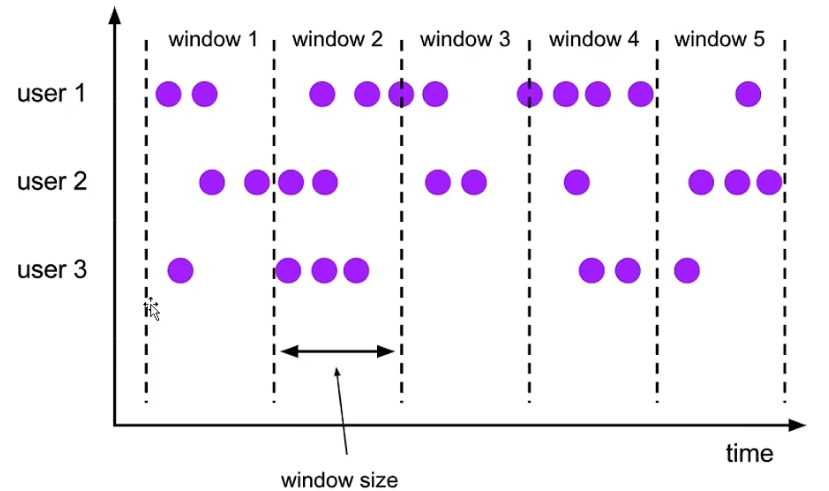
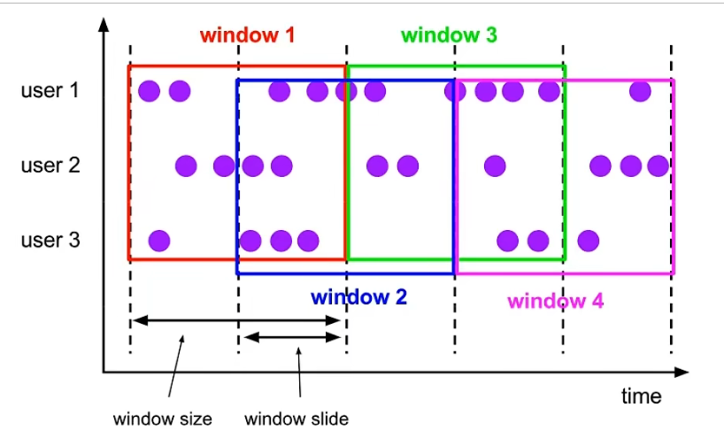
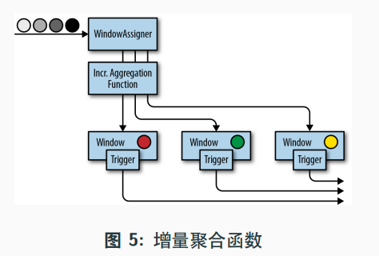
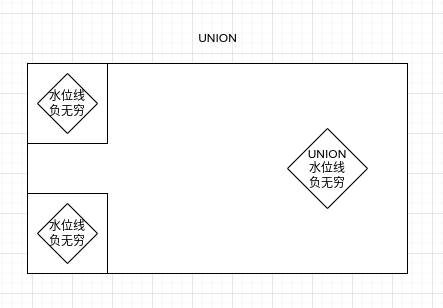

## 时间和水位线

在 Flink 中，时间分为三种类型：

- Event Time 事件时间：事件创建的时间（这个时间 Flink 肯定是不知道的，所以只能包含在数据中进行读取，读到多少就是多少）。
- Ingestion Time 摄入时间：数据进入 Flink 的 source 算子的时间，和机器时间相关。
- Processing Time 处理时间：执行操作算子的本地系统时间，和机器相关。

在这里需要强调的是事件时间 Event Time，这个时间事件发生的时间，Flink 肯定是不知道的，所以只能读取数据中的时间戳，比如数据的 `createdTime`。

为了保证计算结果的准确性，只要数据源中包含事件时间，我们就要用事件时间。假如一个数据迟到了 50 年，用处理时间就凉了，但是事件时间还是照常处理。

但是使用事件时间会出现一个问题，就是窗口不知道什么时候应该关闭。万一一个事件因为网络原因迟到了，那么还是需要按照事件发生的时间窗口进行分配。

那么有一个问题来了，一个窗口究竟要等待多长时间？总不可能永远也不关闭，那样内存就炸了，结果也算不出来了。

为了解决这个问题，出现了一个逻辑时钟：水位线 Watermark。

### 水位线

水位线是一种衡量事件时间进展的机制，是逻辑时钟，专门用来处理乱序事件。

比如，我们每小时设置一个水位线。事件时间位于两点到三点的水位线中，那么就会归类到两点到三点的这个窗口中，以此类推。

水位线的默认计算公式是：`水位线 = 观察到的最大时间戳 - 最大延迟时间 - 1 毫秒`。

解释一下计算公式：

- 观察到的最大时间戳这个就是数据中自带的事件时间。因为数据有可能有乱序的情况，所以我们采用的时间戳是到当前位置，最大的时间戳。
- 最大延迟时间是自定义的，我们不可能一直开着窗口，但是也要考虑真正迟到的数据。所以我们设置一个最大延迟时间，超过这个最大延迟时间就不等了。这个最大延迟时间是一个比较吃经验的地方。

但是这样也会有一个问题，假如在极短时间内产生了大量数据，那么对一个数据都提取出时间戳，然后更新水位线这个过程就显得没有必要。

所以在实际应用的时候，其实不是每个数据都判断，而是周期性地生成水位线，也就是说，数据的时间戳还是要保存的，但是水位线是隔一段时间判断一下最新的时间戳，然后更新一下水位线。

#### 水位线生成介绍

想要生成水位线，就使用 assignTimestampsAndWatermarks 来生成，需要一个 WatermarkStrategy

一般来说，有两种方式生成 WatermarkStrategy：

1. 使用现成的，比如：
    - `WatermarkStrategy.<Event>forBoundedOutOfOrderness()`: 处理乱序时间戳
    - `WatermarkStrategy.<Event>forMonotonousTimestamps()`：处理单调递增时间戳
1. 使用自定义的，需要继承 WatermarkStrategy

理论上，任何一个 DataStream 都可以调用方法生成水位线，但是建议在离数据源越近的地方生成越好。

看一下底层调用的顺序：

```java
public static void main(String[] args) throws Exception {
  StreamExecutionEnvironment env = StreamExecutionEnvironment.getExecutionEnvironment();
  env.setParallelism(1);

  // 设置水位线周期性更新的时间，这里设置了 200ms（默认）
  env.getConfig().setAutoWatermarkInterval(200);

  DataStreamSource<Event> stream = env.fromElements(
      new Event("Mary", "/home", 1000L),
      new Event("Bob", "/cart", 1500L),
      new Event("Alice", "/prod?id=100", 3000L)
  );

  stream.assignTimestampsAndWatermarks(new CustomWatermarkStrategy());

  env.execute();
}

/**
 * 生成水位线逻辑
 */
public static class CustomWatermarkStrategy implements WatermarkStrategy<Event> {

  /**
   * 根据元素的时间戳生成水位线
   */
  @Override
  public WatermarkGenerator<Event> createWatermarkGenerator(WatermarkGeneratorSupplier.Context context) {
    return new CustomWatermarkGenerator();
  }

  /**
   * 提取元素中的时间戳
   */
  @Override
  public TimestampAssigner<Event> createTimestampAssigner(TimestampAssignerSupplier.Context context) {
    return WatermarkStrategy.super.createTimestampAssigner(context);
  }
}

/**
 * WatermarkGenerator，在 WatermarkStrategy 中需要，是直接生成水位线的方法
 */
public static class CustomWatermarkGenerator implements WatermarkGenerator<Event> {

  /**
   * 每个事件来到之后都会调用触发
   * 这个方法可以用作更新最大时间戳，也可以用作每个事件都更新一个水位线，但是事实上我们更新水位线往往需要的是周期性更新
   *
   * @param event           事件
   * @param l               水位线
   * @param watermarkOutput 水位线生成
   */
  @Override
  public void onEvent(Event event, long l, WatermarkOutput watermarkOutput) {

  }

  /**
   * 周期性地调用触发，这个就是我们说的，周期性判断最大时间戳来更新水位线的方式，生产过程中需要使用
   * 默认周期是 200ms，可以设置
   *
   * @param watermarkOutput 水位线生成
   */
  @Override
  public void onPeriodicEmit(WatermarkOutput watermarkOutput) {

  }
}
```

#### Flink 内部的生成策略

```java
StreamExecutionEnvironment env = StreamExecutionEnvironment.getExecutionEnvironment();
env.setParallelism(1);

// 设置水位线周期性更新的时间，这里设置了 200ms（默认）
env.getConfig().setAutoWatermarkInterval(200);

DataStreamSource<Event> stream = env.fromElements(
    new Event("Mary", "/home", 1000L),
    new Event("Bob", "/cart", 1500L),
    new Event("Alice", "/prod?id=100", 3000L)
);

// 单调递增（有序流）数据的水位线生成
WatermarkStrategy<Event> monotonousWatermarkStrategy = WatermarkStrategy
    .<Event>forMonotonousTimestamps()
    // 从数据中提取时间戳，需要 TimestampAssigner，常见的是序列化的 TimestampAssigner
    .withTimestampAssigner(new SerializableTimestampAssigner<Event>() {
      @Override
      public long extractTimestamp(Event event, long l) {
        // 返回毫秒值
        return event.getTimeStamp();
      }
    });

// 乱序流
WatermarkStrategy<Event> boundedOutOfOrdernessWatermarkStrategy = WatermarkStrategy
    // 乱序流需要指定一下最大延迟时间
    .<Event>forBoundedOutOfOrderness(Duration.ofMillis(5000))
    .withTimestampAssigner(new SerializableTimestampAssigner<Event>() {
      @Override
      public long extractTimestamp(Event event, long l) {
        return event.getTimeStamp();
      }
    });

stream.assignTimestampsAndWatermarks(boundedOutOfOrdernessWatermarkStrategy);

env.execute();
```

#### 自定义水位线

```java
public static void main(String[] args) throws Exception {
  StreamExecutionEnvironment env = StreamExecutionEnvironment.getExecutionEnvironment();
  env.setParallelism(1);

  // 设置水位线周期性更新的时间，这里设置了 200ms（默认）
  env.getConfig().setAutoWatermarkInterval(200);

  DataStreamSource<Event> stream = env.fromElements(
      new Event("Mary", "/home", 1000L),
      new Event("Bob", "/cart", 1500L),
      new Event("Alice", "/prod?id=100", 3000L)
  );

  stream.assignTimestampsAndWatermarks(new CustomWatermarkStrategy());

  env.execute();
}

/**
 * 生成水位线逻辑
 */
public static class CustomWatermarkStrategy implements WatermarkStrategy<Event> {

  /**
   * 根据元素的时间戳生成水位线
   */
  @Override
  public WatermarkGenerator<Event> createWatermarkGenerator(WatermarkGeneratorSupplier.Context context) {
    return new CustomWatermarkGenerator();
  }

  /**
   * 提取元素中的时间戳
   */
  @Override
  public TimestampAssigner<Event> createTimestampAssigner(TimestampAssignerSupplier.Context context) {
    return (SerializableTimestampAssigner<Event>) (event, l) -> event.getTimeStamp();
  }
}

/**
 * WatermarkGenerator，在 WatermarkStrategy 中需要，是直接生成水位线的方法
 */
public static class CustomWatermarkGenerator implements WatermarkGenerator<Event> {

  // 自定义延迟时间是 5000ms
  private Long delayTime = 5000L;
  // 观察到的最大时间戳，暂定初始值为 `Long.MIN_VALUE + delayTime + 1L`
  private Long maxTs = Long.MIN_VALUE + delayTime + 1L;

  /**
   * 每个事件来到之后都会调用触发
   * 这个方法可以用作更新最大时间戳，也可以用作每个事件都更新一个水位线，但是事实上我们更新水位线往往需要的是周期性更新
   *
   * @param event           事件
   * @param l               水位线
   * @param watermarkOutput 水位线生成
   */
  @Override
  public void onEvent(Event event, long l, WatermarkOutput watermarkOutput) {
    maxTs = Math.max(event.getTimeStamp(), maxTs);
  }

  /**
   * 周期性地调用触发，这个就是我们说的，周期性判断最大时间戳来更新水位线的方式，生产过程中需要使用
   * 默认周期是 200ms，可以设置
   *
   * @param watermarkOutput 水位线生成
   */
  @Override
  public void onPeriodicEmit(WatermarkOutput watermarkOutput) {
    // 提交新的水位线，水位线计算公式：最大时间戳 - 延迟时间 - 1ms，其实是左闭右开
    watermarkOutput.emitWatermark(new Watermark(maxTs - delayTime - 1L));
  }
}
```

#### 水位线传递

水位线指代的是时间，所以水位线是从上游广播到下游的所有并行子任务的。

因为上游的并行任务可能会传递多个水位线到下游，所以上游的水位线会专门保存到一个分区中。下游检测的话，会以分区中的最小的水位线为主。

## 窗口

一般来说，真实数据都是无界流，然而在真实场景中我们往往是想看一段时间内的数据（例如过去一天、一周、一月等）。

那这样就相当于人为的在逻辑上对无界流划分了界限。我们使用窗口来进行这样的处理。

而且窗口其实是考虑到了事件时间的情况，Flink 的窗口更像是一个桶，针对事件时间分发到不同的桶中。

需要注意，Flink 中的窗口是动态创建的，当有落在这个窗口区间的数据到达时，才会创建对应的窗口。而且当该有的数据都到达时，窗口的就会关闭。

### 窗口的分类

在 Flink 中，窗口的应用十分灵活，可以使用各种类型的窗口来实现需求。

按照驱动类型进行分类：

- 时间窗口 Time Window：按照事件时间的某一个时间段来截取数据的窗口，称为时间窗口。
- 计数窗口 Count Window：按照数据的固定个数（比如 100），每 100 个数据就截取一次，叫做计数窗口。

按照窗口分配数据的规则进行分类：

- 滚动窗口 Tumbling Windows：

    滚动窗口可以基于时间定义，也可以基于数据个数定义。参数就是窗口的大小，窗口长度不变。

    我们定义一个长度为 1h 的窗口，那么滚动窗口的大小就是 1h。

    我们定义一个数据为 10 的窗口，那么滚动窗口的大小就是 10 个数据。

    

- 滑动窗口 Sliding Windows：

    窗口长度不变。和滚动窗口有所区别，滑动窗口之间并不是首尾相连的，而是可以向后滑动一定的距离交错一部分。这就代表两个窗口之间可以有重叠的数据了。

    滑动窗口有两个参数，第一个是窗口大小，第二个是滑动步长。

    窗口大小的意义和滚动窗口相同，滑动步长就是可以向后滑动多长距离。

    

    在理解滑动窗口时，可能会有误解，这里需要注意，窗口本身的大小是不会进行改变的，而滑动步长代表的是：在本窗口开始的一瞬间，距离下个窗口开始的时间间隔。

    也就是说，当滑动步长大小为窗口长度时，就是滚动窗口。

    窗口大小是固定的，窗口在结束时触发计算输出结果，所以滑动步长其实也就代表了计算频率。

- 会话窗口 Session Windows：

    一次 Session 作为一个窗口。在会话窗口中，最重要的就是会话的超时时间，也就是两个会话窗口之间的最小距离。

    假如相邻两个数据到来的时间间隔小于指定大小，那么说明是同一个会话中。假如相邻两个数据到来的时间间隔超过指定大小，那说明是两个窗口。

    

- 全局窗口 Global Windows：

    所有数据都到一个窗口中，这种窗口没有结束，所以假如想要触发计算需要自定义触发器。

### 窗口 API

对于 Flink 的窗口而言，我们可以选择先分区（Keyed）再开窗，也可以选择不分区直接开窗。

- 按键分区窗口 Keyed Windows：`stream.keyBy().window()`

    先分区，数据流会被分为多条逻辑流，这就是 KeyedStream。然后再开窗，窗口计算会在多个并行子任务上同时执行，相同的 key 会被分到一个并行子任务，窗口会根据每个 key 进行单独计算。

- 非按键分区 Non-Keyed Windows：`stream.windowAll()`

    没有分区，那么数据流不会分为多条逻辑流，这个时候窗口逻辑只能在一个子任务运行，相当于并行度为 1。实际使用不推荐。

在 API 层面，窗口有两个方面组成：窗口分配器（Window Assigners）、窗口函数（Window Functions）。

```java
stream.keyBy(`Key Selector`)
      .window(`Window Assigner`)
      .aggregate(`Window Function`)
```

其中 `.window()` 需要传递一个窗口分配器，之后的 aggregate（也可以是其他方法）中需要传递一个窗口函数。

### Window Assigners

窗口的类型，表示数据要分配到哪种窗口中。

```java
StreamExecutionEnvironment env = StreamExecutionEnvironment.getExecutionEnvironment();
env.setParallelism(1);
env.getConfig().setAutoWatermarkInterval(200);

DataStreamSource<Event> stream = env.fromElements(
    new Event("Mary", "/home", 1000L),
    new Event("Bob", "/cart", 1500L),
    new Event("Alice", "/prod?id=100", 3000L)
);

// 乱序流需要水位线，所以水位线就放在这了
SingleOutputStreamOperator<Event> streamOperator = stream.assignTimestampsAndWatermarks(new CustomWatermarkStrategy());

// 指定为计数窗口的滚动窗口，数据量（窗口大小）为 1h
streamOperator.keyBy(Event::getUser).countWindow(5);
// 指定为计数窗口的滑动窗口，数据量（窗口大小）为 1h，滑动距离为 2 个数据
streamOperator.keyBy(Event::getUser).countWindow(5, 2);

// 指定为事件时间滚动窗口，事件时间（窗口大小）为 1h，这个开窗是整点到整点，比如 7:00 -> 8:00，但问题是这个时间是格林威治时间，所以可以加一个偏移量到第二个参数
streamOperator.keyBy(Event::getUser).window(TumblingEventTimeWindows.of(Time.hours(1)));
// 指定为事件时间滑动窗口，事件时间为 1h，滑动距离为 5m，这个在第三个参数同样也有偏移量
streamOperator.keyBy(Event::getUser).window(SlidingEventTimeWindows.of(Time.hours(1), Time.minutes(5)));
// 指定事件时间会话窗口，超时时间为 2s
streamOperator.keyBy(Event::getUser).window(EventTimeSessionWindows.withGap(Time.seconds(2)));

// 指定为处理时间会话窗口，其余的类似，都将 EventTime 换为 ProcessingTime 即可
streamOperator.keyBy(Event::getUser).window(ProcessingTimeSessionWindows.withGap(Time.seconds(2)));

env.execute();
```

分流再开窗使用的方法是 `.window()`，生成 `windowedStream`。但是不分流直接开窗需要使用 `.windowAll()`，获得的流是 `allWindowedStream`。

### Window Functions

窗口函数，表示此窗口中的数据要进行什么样的计算。

一开始的 DataStream 进行 Keyby 变为了 KeyedStream，然后开窗变为了 windowedStream。我们的窗口函数就是将 windowedStream 再次转换为 DataStream。

之前我们介绍窗口函数，只说了一个 aggregate，其实窗口函数十分丰富。

#### 增量聚合函数

Flink 的窗口其实在感觉上类似 Spark Stream，都是攒一批之后进行计算。那么假如我们需要统计一个月的数据，那么在之前的逻辑中，需要开窗一个月，然后一次性计算。

这显然不是我们想要的，所以 Flink 提供了增量聚合函数。也就是每来一个数据就在之前的结果上聚合一次。

典型的增量聚合函数有两个：

- reduceFunction
- aggregateFunction

**reduceFunction**

```java
StreamExecutionEnvironment env = StreamExecutionEnvironment.getExecutionEnvironment();
env.setParallelism(1);
env.getConfig().setAutoWatermarkInterval(200);

DataStreamSource<Event> stream = env.fromElements(
    new Event("Mary", "/home", 1000L),
    new Event("Bob", "/cart", 1500L),
    new Event("Alice", "/prod?id=100", 3000L)
);

SingleOutputStreamOperator<Tuple2<String, Long>> streamOperator = stream
    .map((MapFunction<Event, Tuple2<String, Long>>) event -> Tuple2.of(event.getUser(), 1L))
    .returns(Types.TUPLE(Types.STRING, Types.LONG))
    .assignTimestampsAndWatermarks(WatermarkStrategy
        .<Tuple2<String, Long>>forBoundedOutOfOrderness(Duration.ofSeconds(5))
        .withTimestampAssigner((SerializableTimestampAssigner<Tuple2<String, Long>>) (element, l) -> element.f1));

streamOperator.keyBy(data -> data.f0)
    .window(TumblingEventTimeWindows.of(Time.seconds(10)))
    // 窗口函数
    .reduce((ReduceFunction<Tuple2<String, Long>>) (value1, value2) -> Tuple2.of(value1.f0, value1.f1 + value2.f1))
    .returns(Types.TUPLE(Types.STRING, Types.LONG))
    .print();

env.execute();
```

**aggregateFunction**

reduce 有个缺陷，就是接受和返回的类型都相同。这样在一些复杂情况下就不太容易了。aggregate 可以看作为一个升级版本。

aggregate 拥有三种类型：输入类型（IN）、输出类型（OUT）、累加器类型（ACC）。

其中累加器类型是聚合的中间状态类型。

```java
public static void main(String[] args) throws Exception {
  StreamExecutionEnvironment env = StreamExecutionEnvironment.getExecutionEnvironment();
  env.setParallelism(1);
  env.getConfig().setAutoWatermarkInterval(200);

  DataStreamSource<Event> stream = env.fromElements(
      new Event("Mary", "/home", 1000L),
      new Event("Bob", "/cart", 1500L),
      new Event("Alice", "/prod?id=100", 3000L)
  );

  SingleOutputStreamOperator<Event> streamOperator = stream.assignTimestampsAndWatermarks(WatermarkStrategy
      .<Event>forBoundedOutOfOrderness(Duration.ofSeconds(5))
      .withTimestampAssigner(TimestampAssignerSupplier.of((event, l) -> event.getTimeStamp())));


  streamOperator.keyBy(data -> data.getUser())
          .window(TumblingEventTimeWindows.of(Time.seconds(10)))
          .aggregate(new CustomAggregate())
          .print();

  env.execute();
}

public static class CustomAggregate implements AggregateFunction<Event, Tuple2<Long, Integer>, String> {

  /**
   * 创建一个累加器，给一个初始值
   */
  @Override
  public Tuple2<Long, Integer> createAccumulator() {
    return Tuple2.of(0L, 0);
  }

  /**
   * 聚合，每来一个数据都调用一次
   * @param event 数据
   * @param accumulator 累加器值
   * @return 累加器的新值
   */
  @Override
  public Tuple2<Long, Integer> add(Event event, Tuple2<Long, Integer> accumulator) {
    return Tuple2.of(accumulator.f0 + event.getTimeStamp(), accumulator.f1 + 1);
  }

  /**
   * 获取结果
   */
  @Override
  public String getResult(Tuple2<Long, Integer> accumulator) {
    return String.valueOf(accumulator.f0 / accumulator.f1);
  }

  /**
   * 累加器的和加在一起
   * @param acc1 累加器 1
   * @param acc2 累加器 2
   * @return 新的累加器
   */
  @Override
  public Tuple2<Long, Integer> merge(Tuple2<Long, Integer> acc1, Tuple2<Long, Integer> acc2) {
    return Tuple2.of(acc1.f0 + acc2.f0, acc1.f1 + acc2.f1);
  }
}
```

#### 全窗口函数

这个全窗口函数那就是攒批操作了，也就是数据到来的时候不进行计算，当窗口关闭的时候一次性进行计算。

全窗口函数有两种：

- windowFunction：

    其实是老版本的通用窗口接口，可基于 windowedStream 调用 apply 方法，传入一个 windowFunction 的实现类。

    可以拿到窗口中数据的迭代器，还可以拿到窗口、key 本身信息。事实上，之后可能被 processWindowFunction 逐渐替代。不再举例。

- processWindowFunction：

    是一个底层 API，水位线信息、时间操作等，可以全覆盖 windowFunction 的功能。

```java
public static void main(String[] args) throws Exception {
  StreamExecutionEnvironment env = StreamExecutionEnvironment.getExecutionEnvironment();
  env.setParallelism(1);
  env.getConfig().setAutoWatermarkInterval(200);

  DataStreamSource<Event> stream = env.fromElements(new Event("Mary", "/home", 1000L), new Event("Bob", "/cart", 1500L), new Event("Alice", "/prod?id=100", 3000L));

  SingleOutputStreamOperator<Event> streamOperator = stream.assignTimestampsAndWatermarks(WatermarkStrategy.<Event>forBoundedOutOfOrderness(Duration.ofSeconds(5)).withTimestampAssigner(TimestampAssignerSupplier.of((event, l) -> event.getTimeStamp())));


  streamOperator
      .keyBy(data -> true)
      .window(TumblingEventTimeWindows.of(Time.seconds(10)))
      .process(new CustomProcessWindowFunction()).print();

  env.execute();
}

/**
 * 类型：输入、输出、当前 key 的类型、window
 */
public static class CustomProcessWindowFunction extends ProcessWindowFunction<Event, String, Boolean, TimeWindow> {

  @Override
  public void process(Boolean aBoolean, ProcessWindowFunction<Event, String, Boolean, TimeWindow>.Context context, Iterable<Event> iterable, Collector<String> collector) throws Exception {
    HashSet<String> userSet = new HashSet<>();
    // 迭代器中遍历数据，放到 set 去重
    iterable.forEach(event -> {
      userSet.add(event.getUser());
    });
    Integer uv = userSet.size();

    // 窗口信息
    long start = context.window().getStart();
    long end = context.window().getEnd();
    collector.collect(String.format("窗口 %s - %s 的 uv 值为 ", start, end, uv));
  }
}
```

#### 其他 API

在一些特殊场景中，可能需要用到这些 API。

**触发器 Trigger**

用来控制窗口什么时候触发计算。

```java
stream.keyBy().window().trigger()
```

相当于设置了一个定时服务。条件到达时，触发窗口计算。

- `onElement()`：每个元素都会调用。
- `onEventTime()`：事件时间定时器触发。
- `onProcessingTime ()`：处理时间定时器触发。
- `clear()`：窗口关闭调用。

窗口的前三个方法都需要返回响应事件，对应的是窗口的操作：

- `CONTINUE（继续）`：什么都不做
- `FIRE（触发）`：触发计算，输出结果
- `PURGE（清除）`：清空窗口中的所有数据，销毁窗口
- `FIRE_AND_PURGE（触发并清除）`：触发计算输出结果，并清除窗口

所以从这里可以看到，窗口的关闭和窗口的计算其实是两种事件，只不过之前是将两种合二为一了。

**移除器 Evictor**

用来移除某些数据。

```java
stream.keyBy().window().evictor()
```

- `evictBefore()`：定义执行窗口函数之前的移除数据操作
- `evictAfter()`：定义执行窗口函数之后的以处数据操作

**允许延迟 Allowed Lateness**

在乱序流中，并不一定保证所有早于水位线的数据不会再来。当水位线已经到达窗口结束时间时，假如再有数据到来，一般情况下就会被丢弃。

不过在很多情况下，直接丢弃数据也不太好，所以 Flink 提供了特殊窗口，可以允许窗口算子设置一个最大延迟时间。

所以真正的窗口销毁时间是水位线到达：窗口结束时间 + 最大延迟时间，这时才会关闭窗口。

```java
stream.keyBy(...)
  .window(TumblingEventTimeWindows.of(Time.hours(1)))
  .allowedLateness(Time.minutes(1))
```

这个和我们之前说的水位线最大延迟时间是两码事。

可以理解为司机发车，水位线最大延迟时间就相当于司机的表调慢了，而允许延迟就相当于时间表确实向后调整了，但是我们的这个允许延迟只是针对于这个窗口而已。

**迟到元素到侧输出流**

假如经过了最大延迟时间、允许延迟之后，仍然有迟到数据，那么 Flink 还有一个最后兜底的办法，就是侧输出流。

迟到数据可以放到侧输出流中进行另外的处理，侧输出流其实就相当于数据流的一个分支，单独存放本应该丢弃的数据。

```java
// 我们给即将创建的这条侧输出流一个标签，注意，在 new 对象的时候必须也要写上泛型，否则运行时会报错，而且必须写上花括号，侧输出标签也是一个单例
private static OutputTag<String> lateOutputTag = new OutputTag<String>("late-element") {
};

public static void main(String[] args) throws Exception {
  StreamExecutionEnvironment env = StreamExecutionEnvironment.getExecutionEnvironment();
  env.setParallelism(1);

  SingleOutputStreamOperator<String> result = env
      .addSource(new SourceFunction<Tuple2<String, Long>>() {
        @Override
        public void run(SourceContext<Tuple2<String, Long>> ctx) throws Exception {
          /*
            指定时间，发送数据：

            1. 第一个参数是向下游发送的数据
            2. 第二个参数是时间戳
           */
          ctx.collectWithTimestamp(Tuple2.of("HELLO WORLD", 1000L), 1000L);
          // 发送水位线事件，更新水位线
          ctx.emitWatermark(new Watermark(999L));
          ctx.collectWithTimestamp(Tuple2.of("HELLO FLINK", 2000L), 2000L);
          ctx.emitWatermark(new Watermark(1999L));
          // 定义迟到数据，发送
          ctx.collectWithTimestamp(Tuple2.of("LATE", 1000L), 1000L);
        }

        @Override
        public void cancel() {

        }
      })
      .process(new ProcessFunction<Tuple2<String, Long>, String>() {
        @Override
        public void processElement(Tuple2<String, Long> value, ProcessFunction<Tuple2<String, Long>, String>.Context ctx, Collector<String> out) throws Exception {
          if (value.f1 < ctx.timerService().currentWatermark()) {
            /*
              迟到元素发送到侧输出流：

              1. 第一个参数为侧输出流标签
              2. 第二个是侧输出流的泛型，这里为 String
             */
            ctx.output(lateOutputTag, String.format("迟到元素 %s", value));
          } else {
            out.collect(String.format("正常到达的元素 %s", value));
          }
        }
      });

  result.print("主流数据：");
  result.getSideOutput(lateOutputTag).print("侧输出流数据：");

  env.execute();
}
```

开窗口状态下将迟到数据发送到侧输出流：

```java
private static OutputTag<String> lateOutputTag = new OutputTag<String>("late-element") {
};

public static void main(String[] args) throws Exception {
  StreamExecutionEnvironment env = StreamExecutionEnvironment.getExecutionEnvironment();
  env.setParallelism(1);

  SingleOutputStreamOperator<String> result = env
      .addSource(new SourceFunction<String>() {
        @Override
        public void run(SourceContext<String> ctx) throws Exception {
          ctx.collectWithTimestamp("a", 1000L);
          ctx.emitWatermark(new Watermark(999L));
          ctx.collectWithTimestamp("a", 2000L);
          ctx.emitWatermark(new Watermark(1999L));
          ctx.collectWithTimestamp("a", 4000L);
          //这里定义了水位线为 4999L，之后将会定义 5s 的滑动窗口，所以到这里，0 - 5s 的窗口就会关闭
          ctx.emitWatermark(new Watermark(4999L));
          // 迟到数据
          ctx.collectWithTimestamp("a", 3000L);
        }

        @Override
        public void cancel() {

        }
      })
      .keyBy(r -> 1)
      // 开一个 5s 的事件时间的滑动窗口
      .window(TumblingEventTimeWindows.of(Time.seconds(5)))
      // 注意，在这里设置了一下，迟到数就会发送到侧输出流
      .sideOutputLateData(lateOutputTag)
      .process(new ProcessWindowFunction<String, String, Integer, TimeWindow>() {
        @Override
        public void process(Integer integer, ProcessWindowFunction<String, String, Integer, TimeWindow>.Context context, Iterable<String> elements, Collector<String> out) throws Exception {
          out.collect(String.format("窗口中共有：%s 条数据", elements.spliterator().getExactSizeIfKnown()));
        }
      });
  result.print("主流数据：");
  result.getSideOutput(lateOutputTag).print("侧输出流数据：");

  env.execute();
}
```

侧输出流标签其实是个匿名类，所以需要花括号。

**窗口重新计算**

之前的默认策略是：水位线超过窗口距离之后，窗口自动触发计算并且自动销毁，如此一来数据要么被丢弃，要么发送到侧输出流。

但是除此之外，我们还有一种方式，就是水位线超过窗口距离之后，窗口触发计算但是不销毁，等待指定的时间，假如这段时间内数据到达，则重新触发计算，这个时候过了之后才会销毁窗口。

```java
StreamExecutionEnvironment env = StreamExecutionEnvironment.getExecutionEnvironment();
env.setParallelism(1);

SingleOutputStreamOperator<String> result = env
    .socketTextStream("localhost", 9999)
    .map((MapFunction<String, Tuple2<String, Long>>) value -> {
      String[] arr = value.split(" ");
      return Tuple2.of(arr[0], Long.parseLong(arr[1]) * 1000L);
    })
    .returns(Types.TUPLE(Types.STRING, Types.LONG))
    .assignTimestampsAndWatermarks(
        WatermarkStrategy
            .<Tuple2<String, Long>>forBoundedOutOfOrderness(Duration.ofSeconds(5))
            .withTimestampAssigner(new SerializableTimestampAssigner<Tuple2<String, Long>>() {
              @Override
              public long extractTimestamp(Tuple2<String, Long> element, long l) {
                return element.f1;
              }
            })
    )
    .keyBy(r -> r.f0)
    .window(TumblingEventTimeWindows.of(Time.seconds(5)))
    // 等待 5s 的迟到事件
    .allowedLateness(Time.seconds(5))
    .sideOutputLateData(new OutputTag<Tuple2<String, Long>>("late") {
    })
    .process(new ProcessWindowFunction<Tuple2<String, Long>, String, String, TimeWindow>() {
      @Override
      public void process(String s, ProcessWindowFunction<Tuple2<String, Long>, String, String, TimeWindow>.Context context, Iterable<Tuple2<String, Long>> elements, Collector<String> out) throws Exception {
        /*
          初始化一个窗口状态变量，注意：窗口状态变量的范围是当前窗口

          当窗口第一次触发时，也就是窗口闭合的时候，firstCaculate 为 null。
         */
        ValueState<Boolean> firstCaculate = context.windowState().getState(new ValueStateDescriptor<Boolean>("first", Types.BOOLEAN));
        if (Objects.isNull(firstCaculate.value())) {
          out.collect(String.format("窗口第一次触发计算，水位线为：%s，窗口中有 %s 个元素", context.currentWatermark(), elements.spliterator().getExactSizeIfKnown()));
          // 第一次触发计算之后，更新为 true
          firstCaculate.update(true);
        } else {
          out.collect(String.format("迟到数据到了，更新后的计算结果为 %s", elements.spliterator().getExactSizeIfKnown()));
        }
      }
    });

result.print("主流：");
result
    .getSideOutput(new OutputTag<Tuple2<String, Long>>("late") {
    })
    .print("侧输出流：");

env.execute();
```

上面的代码中：水位线最大延迟时间为 5s，滚动窗口的大小为 5s，允许 5s 的迟到元素，还有一个侧输出流：

1. 输入 `a 1`
1. 输入 `a 10`，根据水位线公式，当前水位线为 `10000L - 5000L -1L = 4999L`，窗口触发计算，并且更新窗口状态变量。
1. 输入 `a 1`，此时窗口没有关闭，所以继续向此窗口发送元素，窗口更新计算结果。
1. 输入 `a 15`，因为超出允许迟到时间，所以窗口关闭。
1. 输入 `a 1`，因为窗口关闭，所以发送到侧输出流。

那问题来了：为啥还要搞一个迟到元素的时间呢？为啥不直接设置水位线的最大延迟时间为 10s 呢？这因为可以提前 5s 看到结果，虽然结果不一定准确，但是万一没有迟到元素，那就赚了。

## 处理函数

处理函数，Process Function，是底层 API。


我们之前使用到的所有函数其实都是基于处理函数来进行实现的，而我们使用处理函数可以实现更加复杂的需求。例如，Flink SQL 就是利用 Process Function 来实现的。

所有的 Process Function 都继承了 RichFunction 接口，所以都有富函数的优点，而且处理函数可以拿到更多的东西。

process function 是基于 DataStream 调用的，只需要传入一个 processFunction：`stream.process(new CustomProcessFunction())`。

但是基于不同的 DataStream，在调用 process 时，就可以传入不同的 processFunction。

Flink 提供了 8 个 Process Function：

- `ProcessFunction`：最基础的，DataStream 直接调用。
- `KeyedProcessFunction`：keyedStream 进行调用。
- `ProcessWindowFunction`：开窗后的处理函数，基于 windowedStream 调用。
- `ProcessAllWindowFunction`：基于 allWindowedStream 调用。
- `CoProcessFunction`：双流合并之后的处理函数，基于 connectedStreams 调用，后续讲解双流合并。
- `ProcessJoinFunction`：间隔连接两条流之后的处理函数，基于 IntervalJoined 调用。
- `BroadcastProcessFunction`：广播连接流处理函数，基于 broadcastConnectedStream 调用。
- `KeyedBroadcastProcessFunction`：按键分区的广播连接流处理函数，基于 broadcastConnectedStream 调用。不过这个流是一个 KeyedStream 和广播流连接而成的。

### ProcessFunction

```java

StreamExecutionEnvironment env = StreamExecutionEnvironment.getExecutionEnvironment();
env.setParallelism(1);

SingleOutputStreamOperator<Event> stream = env
    .addSource(new ClickSource())
    .assignTimestampsAndWatermarks(WatermarkStrategy
            .<Event>forBoundedOutOfOrderness(Duration.ofSeconds(5))
            .withTimestampAssigner((SerializableTimestampAssigner<Event>) (event, l) -> event.getTimeStamp()));

stream.process(new ProcessFunction<Event, String>() {
  // 每个数据都会调用
  @Override
  public void processElement(Event event, ProcessFunction<Event, String>.Context context, Collector<String> collector) throws Exception {
    String user = event.getUser();
    long watermark = context.timerService().currentWatermark();
    collector.collect(String.format("%s => %s", user, watermark));
  }
});

env.execute();
```

### KeyedProcessFunction

用来操作 keyBy 之后的流，输出 0 个、1 个 或多个。可以看成是 flatMap 和 reduce 的终极加强版。

除了富函数的函数，还额外提供了两个方法：

- `processElement(I value, Context ctx, Collector<O> out)`：流中的每一个元素都会调用此方法。

    流中的每一个元素都会调用此方法，结果会放到 collector 数据类型中输出。

    Context 可访问元素的时间戳、key、TimeService 时间服务，还可以输出元素到别的流。

- `onTimer(long timestamp, OnTimerContext ctx, Collector<O> out)`：回调函数，定时器：

    定时器的回调函数，可以在定时器倒计时结束之后调用。

    timestamp 是定时器触发的时间戳。

    Collector 是输出集合。

    OnTimerContext 类似 processElement 的 Context。

```java
StreamExecutionEnvironment env = StreamExecutionEnvironment.getExecutionEnvironment();
env.setParallelism(1);

env
    .socketTextStream("localhost", 9999)
    // keyedProcessFunction 需要的是 keyBy 之后的 流，所以先分流
    .keyBy(r -> 1)
    /*
      1. 调用一个 process function 的方式，就是 .process()
      2. 三个泛型分别为： key、输入、输出
    */
    .process(new KeyedProcessFunction<Integer, String, String>() {
      /**
       * 每个元素都会调用此方法处理
       */
      @Override
      public void processElement(String value, KeyedProcessFunction<Integer, String, String>.Context ctx, Collector<String> out) throws Exception {
        // 获取机器时间
        long ts = ctx.timerService().currentProcessingTime();
        out.collect(String.format("元素 %s 在 %s 到达", value, new Timestamp(ts)));
        // 注册一个十秒钟之后的定时器，十秒钟后将会调用方法 onTimer
        ctx.timerService().registerProcessingTimeTimer(ts + 10 * 1000L);
      }

streamOperator.keyBy(data -> data.f0)
    .window(TumblingEventTimeWindows.of(Time.seconds(10)))
    // 窗口函数
    .reduce((ReduceFunction<Tuple2<String, Long>>) (value1, value2) -> Tuple2.of(value1.f0, value1.f1 + value2.f1))
    .returns(Types.TUPLE(Types.STRING, Types.LONG))
    .print();

env.execute();
```

:::tip
每个 key 都可以注册自己的定时器，对于每个 key，在某个时间戳，只能注册一个定时器。

每个 key 独享定时器，定时器之间在逻辑上相互隔离。
:::

**时间服务和定时器**

除了之前的例子，Context 和 OnTimerContext 持有的 TimeService 对象拥有如下方法：

- `currentProcessingTime()`：返回当前处理时间。
- `currentWatermark()`：返回当前水位线的时间戳
- `registerProcessingTimeTimer(long time)`：会注册当前 key 的 processing time 的 timer。当 processing time 到达定时时间时，触发 timer。
- `registerEventTimeTimer(long time)`：会注册当前 key 的 event time timer。当水位线大于等于定时器注册的时间时，触发定时器执行回调函数。
- `deleteProcessingTimeTimer(long time)`：删除之前注册处理时间定时器。如果没有这个时间戳的定时器，则不执行。
- `deleteEventTimeTimer(long time)`：删除之前注册的事件时间定时器，如果没有此时间戳的定时器，则不执行。

### 状态变量

状态变量，顾名思义，保存状态。我们以一个平均数的需求来开始状态变量。状态变量有很多种，例如 `ValueState`、`MapState`、`ListState`。

```java
StreamExecutionEnvironment env = StreamExecutionEnvironment.getExecutionEnvironment();
env.setParallelism(1);

env
    .addSource(new SourceFunction<Integer>() {
      private boolean shouldRunning = true;
      private Random random = new Random();

      @Override
      public void run(SourceContext<Integer> ctx) throws Exception {
        while (shouldRunning) {
          ctx.collect(random.nextInt(10));
          Thread.sleep(100L);
        }
      }

      @Override
      public void cancel() {
        shouldRunning = false;
      }
    })
    .keyBy(r -> true)
    .process(new KeyedProcessFunction<Boolean, Integer, Double>() {

      /*
        1. 声明状态变量，做累加器，这里声明一个值状态变量
        2. 状态变量的可见范围是当前 key
        3. 不同 key 的状态变量是相互隔离的
        4. 状态变量是单例，只能被实例化一次，这是用于宕机之后检查点恢复的
        5. 我们需要给状态变量起名字，也是用于检查点恢复的
      */
      private ValueState<Tuple2<Integer, Integer>> valueState;
      // 保存定时器时间戳
      private ValueState<Long> timerTs;

      @Override
      public void open(Configuration parameters) throws Exception {
        super.open(parameters);
        // 固定写法，调用 runtimeContext 来获取一个状态变量（给定状态变量的名称和类型）
        valueState = getRuntimeContext().getState(new ValueStateDescriptor<Tuple2<Integer, Integer>>("sumCount", Types.TUPLE(Types.INT, Types.INT)));
        timerTs = getRuntimeContext().getState(new ValueStateDescriptor<Long>("timer", Types.LONG));
      }

      @Override
      public void processElement(Integer value, KeyedProcessFunction<Boolean, Integer, Double>.Context context, Collector<Double> out) throws Exception {
        // 做累加器的操作
        if (Objects.isNull(valueState.value())) {
          valueState.update(Tuple2.of(value, 1));
        } else {
          Tuple2<Integer, Integer> tmp = valueState.value();
          valueState.update(Tuple2.of(tmp.f0 + value, tmp.f1 + 1));
        }

        if (Objects.isNull(timerTs.value())) {
          // 注册十秒钟之后的定时器
          long timer = context.timerService().currentProcessingTime() + 10 * 1000L;
          context.timerService().registerProcessingTimeTimer(timer);
          timerTs.update(timer);
        }
      }

      @Override
      public void onTimer(long timestamp, KeyedProcessFunction<Boolean, Integer, Double>.OnTimerContext ctx, Collector<Double> out) throws Exception {
        super.onTimer(timestamp, ctx, out);
        if (Objects.isNull(valueState.value())) {
          return;
        }
        // 发送数据
        out.collect((double) valueState.value().f0 / valueState.value().f1);
        // 清空定时器的状态变量
        timerTs.clear();
      }
    })
    .print();

env.execute();
```

### ProcessWindowFunction

按照 key 分区完毕，然后按照 window 分区之后，我们就可以使用 `ProcessWindowFunction` 了，它也是一个底层 API。

比如，我们要计算每个用户每 5 秒钟的 pv（其实应该是 0- 4999ms，因为窗口是左闭右开）。

```java
@Data
@NoArgsConstructor
@AllArgsConstructor
public class Event {

  private String user;
  private String url;
  private Long timestamp;
}
```

```java
public class ClickSource implements SourceFunction<Event> {

  private boolean shouldRunning = true;
  private String[] userArr = {"Mary", "Bob", "Alice", "Liz"};
  private String[] urlArr = {"./home", "./cart", "./fav", "./prod?id=1", "./prod?id=2"};
  private Random random = new Random();

  @Override
  public void run(SourceContext<Event> ctx) throws Exception {
    while (shouldRunning) {
      ctx.collect(
          new Event(
              userArr[random.nextInt(userArr.length)],
              urlArr[random.nextInt(urlArr.length)],
              Calendar.getInstance().getTimeInMillis()
          )
      );
      Thread.sleep(1000L);
    }
  }

  @Override
  public void cancel() {
    shouldRunning = false;
  }
}
```

```java
// 每个用户每 5 秒钟的 pv
public class Demo {
  public static void main(String[] args) throws Exception {
    StreamExecutionEnvironment env = StreamExecutionEnvironment.getExecutionEnvironment();
    env.setParallelism(1);

    env
        .addSource(new ClickSource())
        .keyBy(Event::getUser)
        // 先分流，再开窗。这里开了一个 5s 的滚动窗口
        .window(TumblingProcessingTimeWindows.of(Time.seconds(5)))
        // 开窗之后进行 processWindowFunction
        .process(new WindowResult())
        .print();

    env.execute();
  }

  /**
   * 注意，processWindowFunction 的泛型有四个：
   * <p>
   * 1. 输入泛型
   * 2. 输出泛型
   * 3. key 的泛型
   * 4. Window 的泛型，这里自然就是 TimeWindow
   */
  public static class WindowResult extends ProcessWindowFunction<Event, String, String, TimeWindow> {

    /**
     * processWindowFunction 的 process 方法会在窗口结束时调用
     */
    @Override
    public void process(String key, ProcessWindowFunction<Event, String, String, TimeWindow>.Context ctx, Iterable<Event> elements, Collector<String> out) throws Exception {
      // 获取窗口开启时间
      long windowStart = ctx.window().getStart();
      // 获取窗口关闭时间
      long windowEnd = ctx.window().getEnd();
      // 迭代器中的元素个数
      long count = elements.spliterator().getExactSizeIfKnown();
      out.collect(String.format("用户 %s 在窗口 %s - %s 的 pv 次数是 %s", key, new Timestamp(windowStart), new Timestamp(windowEnd), count));
    }
  }
}
```

我们可以看到，上面有一个迭代器，迭代器中保存的是所有的数据，所以像这种函数我们也可以叫做全窗口聚合函数。

其实全窗口聚合函数对于这种累加计算的情况不太好，因为我们需要的是 pv 次数，不需要保留原始数据，所以我们仍然可以参考累加器的思路来进行计算，一条数据加完之后就扔掉，

### AggregateFunction

我们说 processWindowFunction 是一个全窗口聚合函数，但是不太适合累加计算的情况，因为累加不需要保存原始数据。

所以出现了增量聚合聚合方面的函数，一个是 ReduceFunction，一个是 AggregateFunction，其中 AggregateFunction 可以实现更多功能，所以以它为例。

准备工作就是 ProcessWindowFunction 中的 Event 和 ClickSource，主要思路仍然是先分流再开窗，只不过这里的 `process()` 换位了 `aggregate()`

```java
// 每个用户每 5 秒钟的 pv
public class Demo {
  public static void main(String[] args) throws Exception {
    StreamExecutionEnvironment env = StreamExecutionEnvironment.getExecutionEnvironment();
    env.setParallelism(1);

    env
        .addSource(new ClickSource())
        .keyBy(Event::getUser)
        .window(TumblingProcessingTimeWindows.of(Time.seconds(5)))
        // 这里注意，聚合操作直接使用 aggregate 即可，需要使用到的就是 AggregateFunction
        .aggregate(new CountAgg())
        .print();

    env.execute();
  }

  /**
   * AggregateFunction的三个泛型：
   * <p>
   * 1. key 的类型
   * 2. 累加器的泛型
   * 3. 输出泛型
   */
  public static class CountAgg implements AggregateFunction<Event, Integer, Integer> {

    /**
     * 针对每一个窗口，都会创建一个累加器
     *
     * @return 默认数值
     */
    @Override
    public Integer createAccumulator() {
      return 0;
    }

    /**
     * 定义累加规则
     */
    @Override
    public Integer add(Event event, Integer accumulator) {
      return accumulator + 1;
    }

    /**
     * 在窗口关闭时返回结果
     */
    @Override
    public Integer getResult(Integer accumulator) {
      return accumulator;
    }

    /**
     * 当窗口合并的时候，需要实现这个 merge，当前需求我们不需要将窗口合并，不用实现这个
     */
    @Override
    public Integer merge(Integer integer, Integer acc1) {
      return null;
    }
  }
}
```

相对于全窗口聚合函数，优点是不需要知道所有的数据是什么，但是缺点就是无法访问窗口的信息，所以不知道得到的结果属于哪个窗口。

那我们不能接受了，所以我们需要将增量聚合函数和全窗口聚合函数结合使用的例子

### ProcessWindowFunction + AggregateFunction

这里注意，我们之前调用全窗口聚合函数使用的是 `process()`，增量聚合函数是 `aggregate()`，那么如果将两者集合使用，那么其实是用的是 `aggregate()`，只不过这个方法还有第二个参数，就是全窗口聚合函数。

其实增量聚合函数 + 全窗口聚合函数，在这个过程中，全窗口聚合函数的作用其实就是在增量聚合函数的外层包裹一层窗口信息而已。

当窗口闭合的时候，增量聚合函数会将它的结果发送到全窗口聚合函数。




---

```java
// 每个用户每 5 秒钟的 pv
public class Demo {
  public static void main(String[] args) throws Exception {
    StreamExecutionEnvironment env = StreamExecutionEnvironment.getExecutionEnvironment();
    env.setParallelism(1);

    env
        .addSource(new ClickSource())
        .keyBy(Event::getUser)
        .window(TumblingProcessingTimeWindows.of(Time.seconds(5)))
        // 增量聚合 + 全窗口，全窗口聚合函数的作用是就是将增量聚合的结果包裹一层窗口信息
        .aggregate(new CountAgg(), new WindowResult())
        .print();

    env.execute();
  }

  /**
   * AggregateFunction的三个泛型：
   * <p>
   * 1. key 的类型
   * 2. 累加器的泛型
   * 3. 输出泛型
   */
  public static class CountAgg implements AggregateFunction<Event, Integer, Integer> {

    /**
     * 针对每一个窗口，都会创建一个累加器
     *
     * @return 默认数值
     */
    @Override
    public Integer createAccumulator() {
      return 0;
    }

    /**
     * 定义累加规则
     */
    @Override
    public Integer add(Event event, Integer accumulator) {
      return accumulator + 1;
    }

    /**
     * 在窗口关闭时返回结果
     */
    @Override
    public Integer getResult(Integer accumulator) {
      return accumulator;
    }

    /**
     * 当窗口合并的时候，需要实现这个 merge，当前需求我们不需要将窗口合并，不用实现这个
     */
    @Override
    public Integer merge(Integer integer, Integer acc1) {
      return null;
    }
  }

  /**
   * 注意，processWindowFunction 的泛型有四个：
   * <p>
   * 1. 输入泛型
   * 2. 输出泛型
   * 3. key 的泛型
   * 4. Window 的泛型，这里自然就是 TimeWindow
   * <p>
   * 注意：
   * <p>
   * 1. 当增量聚合函数的数据发送给全窗口聚合函数时，全窗口聚合函数的输入类型就是增量聚合函数的输出类型了，这里自然就是 Integer
   * 2. 增量聚合函数的输出结果是一个元素，所以这时候迭代器的参数就只包含一个元素了，这个元素的值就是增量聚合函数的结果
   */
  public static class WindowResult extends ProcessWindowFunction<Integer, String, String, TimeWindow> {

    @Override
    public void process(String key, ProcessWindowFunction<Integer, String, String, TimeWindow>.Context ctx, Iterable<Integer> elements, Collector<String> out) throws Exception {
      long windowStart = ctx.window().getStart();
      long windowEnd = ctx.window().getEnd();
      long count = elements.iterator().next();
      out.collect(String.format("用户 %s 在窗口 %s - %s 的 pv 次数是 %s", key, new Timestamp(windowStart), new Timestamp(windowEnd), count));
    }
  }
}
```


## 多流转换

### 多留转换

```java
DataStreamSource<Integer> stream1 = env.fromElements(1, 2);
DataStreamSource<Integer> stream2 = env.fromElements(3, 4);
DataStreamSource<Integer> stream3 = env.fromElements(5, 6);

/*
  union 可以：

  1. 用于多条流的合并。
  2. 多条流中事件类型必须相同。

  有队列的特点，合并时先来的先合并。
  */
DataStream<Integer> result = stream1.union(stream2, stream3);
```


上图的序号代表顺序，可以看出，当事件到来时（多条流合流时），union 算子可以开辟多个空间，每个空间都会存放一个流上的数据内容。

在向后广播变量的时候，算子有优先考虑所有流上已经到达的事件，寻找一个最小的时间戳的数据向下广播发送。所以可以不用担心水位线一下会推得很高，这是比较合理的解决方案。

---

我们假设这样一种情况：设置水位线最大延迟时间为 0，开窗口的事件时间为 5000ms，输入类似 `a 1` 的数据，其中第一个数据为事件，第二个事件为事件（单位为秒）

我们计划输入 `a 1`、`b 5` 两条数据来测试：

1. 在一开始的时候，水位线为负无穷大。

    

1. 输入 `a 1`，根据水位线计算公式，此时水位线应该为 `1000L - 1L = 999L`。

    因为数据按照 key 来进行分区了，所以 `a 1` 这条数据只能进入到一个 key 通道中，但是 `999ms` 的水位线被分发到了所有的下游。

    

1. 输入 `b 5`，水位线到达了 `4999ms`

    同样的，因为 `b 5` 因为 key 不同，所以进入了其他通道中，但是水位线被广播到了所有下游环境中。

    

---

上面的案例是分流的情况，下面是合流的情况：我们监听两个端口 `9999`、`9998`，水位线最大延迟时间为 0，不开窗直接进行 process（直接处理事件）。

```java
SingleOutputStreamOperator<Tuple2<String, Long>> stream1 = env
    .socketTextStream("localhost", 9999)
    .map((MapFunction<String, Tuple2<String, Long>>) s -> {
      String[] arr = s.split(" ");
      return Tuple2.of(arr[0], Long.parseLong(arr[1]) * 1000L);
    })
    .returns(Types.TUPLE(Types.STRING, Types.LONG))
    .assignTimestampsAndWatermarks(
        WatermarkStrategy
            .<Tuple2<String, Long>>forMonotonousTimestamps()
            .withTimestampAssigner(new SerializableTimestampAssigner<Tuple2<String, Long>>() {
              @Override
              public long extractTimestamp(Tuple2<String, Long> element, long l) {
                return element.f1;
              }
            })
    );

SingleOutputStreamOperator<Tuple2<String, Long>> stream2 = env
    .socketTextStream("localhost", 9998)
    .map((MapFunction<String, Tuple2<String, Long>>) s -> {
      String[] arr = s.split(" ");
      return Tuple2.of(arr[0], Long.parseLong(arr[1]) * 1000L);
    })
    .returns(Types.TUPLE(Types.STRING, Types.LONG))
    .assignTimestampsAndWatermarks(
        WatermarkStrategy
            .<Tuple2<String, Long>>forMonotonousTimestamps()
            .withTimestampAssigner(new SerializableTimestampAssigner<Tuple2<String, Long>>() {
              @Override
              public long extractTimestamp(Tuple2<String, Long> element, long l) {
                return element.f1;
              }
            })
    );

stream1
    .union(stream2)
    .process(new ProcessFunction<Tuple2<String, Long>, String>() {
      @Override
      public void processElement(Tuple2<String, Long> stringLongTuple2, ProcessFunction<Tuple2<String, Long>, String>.Context context, Collector<String> out) throws Exception {
        out.collect(String.format("当前水位线是 %s", context.timerService().currentWatermark()));
      }
    }).print();
```

当前有两条 stream，这两条 stream 在 union 的时候，union 算子会开启两个位置存放当前的事件，水位线则是取两者的最小值。

1. 在一开始的时候，两者的水位线都是负无穷。

    

1. 在 `9999` 端口输入 `a 1`，对应的位置的水位线改为了 `999ms`，但是水位线取得两者的最小值，所以还是负无穷。

    

1. 在 `9998` 端口输入 `a 2`，对应位置的水位线改为了 `1999ms`，水位线取得两者最小值，所以为 `999ms`。

    

### 联结流

联结流，`connect`。和 `union` 有区别：

- `connect` 只能联结两条流。
- 两条流的元素类型可以不同。

既然两条流的类型可以不同，那么我们在联结时就需要注意自己去处理这两条流的类型，因为合流之后只能输出一种类型。

```java
stream1
    .keyBy(r -> r.f0)
    // 使用 connect 进行链接，这里注意，stream2 进行了一次广播，为的是下游中的所有任务中的 stream1 都可以和 stream2 进行连接
    .connect(stream2.broadcast())
    // 这里注意，既然是输入的两个流，那么第一个和第二个参数就是输入，第三个参数是输出，因为只能输出一种类型
    .flatMap(new CoFlatMapFunction<Tuple2<String, Long>, Tuple2<String, Long>, String>() {
      // 第一个 flatMap 是第一个流的处理
      @Override
      public void flatMap1(Tuple2<String, Long> value, Collector<String> out) throws Exception {
        out.collect(value.f0);
      }

      // 第二个 flatMap 是第二个流的处理
      @Override
      public void flatMap2(Tuple2<String, Long> value, Collector<String> out) throws Exception {
        out.collect(value.f0);
      }
    })
    .print();
```

### CoProcessFunction

我们在联结流的时候，用到 flatMap 时，使用的是 `CoFlatMapFunction`，它就属于 `CoProcessFunction`。

这种 `CoProcessFunction` 也是处理函数中的一种，我们曾经讲过，Flink 提供了八种 Process Function，CoProcessFunction 就是其中一种。它是双流合并的 API。

我们来看这样一条 SQL：`SELECT * FROM A INNER JOIN B WHERE A.id = B.id;`

对于 Spark 这种批处理的框架来说，它会将 A、B 所有相同 id 的数据 shuffle 到一个分区中再做笛卡尔积，然后进行处理。

但是对于 Flink 来讲，A 和 B 都是数据流，它要求两条流的等值内连接。

```java
StreamExecutionEnvironment env = StreamExecutionEnvironment.getExecutionEnvironment();
env.setParallelism(1);

DataStreamSource<Tuple2<String, Integer>> stream1 = env.fromElements(
    Tuple2.of("a", 1),
    Tuple2.of("a", 2),
    Tuple2.of("b", 2)
);

DataStreamSource<Tuple2<String, String>> stream2 = env.fromElements(
    Tuple2.of("a", "a"),
    Tuple2.of("b", "b")
);

stream1
    // stream1 根据 key 分区
    .keyBy(r -> r.f0)
    // stream2 也根据 key 分区，这样可以保证 stream1 和 stream2 的相同 key 的数据可以进入到一个分区中
    .connect(stream2.keyBy(r -> r.f0))
    .process(new CoProcessFunction<Tuple2<String, Integer>, Tuple2<String, String>, String>() {

      // 既然要做等值连接，那么肯定要将数据保存下来，这里就可以利用状态变量了
      ListState<Tuple2<String, Integer>> list1;
      ListState<Tuple2<String, String>> list2;

      @Override
      public void open(Configuration parameters) throws Exception {
        super.open(parameters);
        list1 = getRuntimeContext().getListState(
            new ListStateDescriptor<Tuple2<String, Integer>>("list1", Types.TUPLE(Types.STRING, Types.INT))
        );
        list2 = getRuntimeContext().getListState(
            new ListStateDescriptor<Tuple2<String, String>>("list2", Types.TUPLE(Types.STRING, Types.STRING))
        );

      }

      @Override
      public void processElement1(Tuple2<String, Integer> value, CoProcessFunction<Tuple2<String, Integer>, Tuple2<String, String>, String>.Context context, Collector<String> out) throws Exception {
        list1.add(value);
        list2.get().forEach(e -> {
          out.collect(String.format("%s => %s", value, e));
        });
      }

      @Override
      public void processElement2(Tuple2<String, String> value, CoProcessFunction<Tuple2<String, Integer>, Tuple2<String, String>, String>.Context context, Collector<String> out) throws Exception {
        list2.add(value);
        list1.get().forEach(e -> {
          out.collect(String.format("%s => %s", e, value));
        });
      }
    })
    .print();

env.execute();
```

### 基于间隔和窗口的 JOIN

CoProcessFunction 确实是对于两条流合并的功能十分强大，但是需要用到大量的状态变量、定时器等，而且写法比较麻烦。为了简化，Flink 提供了两个语法糖：基于间隔的 JOIN、基于窗口的 JOIN。

使用时可以优先使用这俩语法糖，不行再用 CoProcessFunction。

**基于间隔的 JOIN**

这个意思是说，第一个流的一个元素和第二个流中某一段元素进行 JOIN。

```java
StreamExecutionEnvironment env = StreamExecutionEnvironment.getExecutionEnvironment();
env.setParallelism(1);

SingleOutputStreamOperator<Event> orderStream = env
    .fromElements(
        // 给一个下订单时间，发生时间是在 20min 的时候
        Event.of("user-1", "order", 20 * 60 * 1000L)
    )
    .assignTimestampsAndWatermarks(WatermarkStrategy
        .<Event>forMonotonousTimestamps()
        .withTimestampAssigner(new SerializableTimestampAssigner<Event>() {
          @Override
          public long extractTimestamp(Event event, long l) {
            return event.getTimestamp();
          }
        })
    );

SingleOutputStreamOperator<Event> pvStream = env
    .fromElements(
        // 给三个浏览事件，时间分别在 5min、10min、12min 时
        Event.of("user-1", "pv", 5 * 60 * 1000L),
        Event.of("user-1", "pv", 10 * 60 * 1000L),
        Event.of("user-1", "pv", 12 * 60 * 1000L)
    )
    .assignTimestampsAndWatermarks(WatermarkStrategy
        .<Event>forMonotonousTimestamps()
        .withTimestampAssigner(new SerializableTimestampAssigner<Event>() {
          @Override
          public long extractTimestamp(Event event, long l) {
            return event.getTimestamp();
          }
        })
    );

orderStream
    .keyBy(r -> r.getUserId())
    // 使用 intervalJoin，就是间隔 JOIN
    .intervalJoin(pvStream.keyBy(r -> r.getUserId()))
    // 采用之前 10min 的 pv 事件进行 JOIN，这也就代表 pv 为 5min 的不会被 JOIN，不仅可以 JOIN 过去，还可以 JOIN 未来。
    .between(Time.minutes(-10), Time.minutes(0))
    // 使用间隔 JOIN，那么使用 ProcessJoinFunction 即可
    .process(new ProcessJoinFunction<Event, Event, String>() {
      @Override
      public void processElement(Event event, Event event2, ProcessJoinFunction<Event, Event, String>.Context context, Collector<String> out) throws Exception {
        out.collect(String.format("%s => %s", event, event2));
      }
    })
    .print();

env.execute();
```

其实两条流相互 JOIN 都是相对的，假如是 pvStream JOIN orderStream，那么 JOIN 的时间就需要变化了。

**基于窗口的 JOIN**

两条流的元素进入到相同的窗口，然后进行 JOIN。

```java
StreamExecutionEnvironment env = StreamExecutionEnvironment.getExecutionEnvironment();
env.setParallelism(1);

SingleOutputStreamOperator<Tuple2<String, Integer>> stream1 = env
    .fromElements(Tuple2.of("a", 1), Tuple2.of("b", 1))
    .assignTimestampsAndWatermarks(WatermarkStrategy
        .<Tuple2<String, Integer>>forMonotonousTimestamps()
        .withTimestampAssigner(new SerializableTimestampAssigner<Tuple2<String, Integer>>() {
          @Override
          public long extractTimestamp(Tuple2<String, Integer> element, long l) {
            return element.f1;
          }
        })
    );

SingleOutputStreamOperator<Tuple2<String, Integer>> stream2 = env
    .fromElements(Tuple2.of("a", 2), Tuple2.of("b", 2), Tuple2.of("b", 3))
    .assignTimestampsAndWatermarks(WatermarkStrategy
        .<Tuple2<String, Integer>>forMonotonousTimestamps()
        .withTimestampAssigner(new SerializableTimestampAssigner<Tuple2<String, Integer>>() {
          @Override
          public long extractTimestamp(Tuple2<String, Integer> element, long l) {
            return element.f1;
          }
        })
    );

// 我们发现之前的写法都是先 keyBy 之后再 JOIN，这里就成了 JOIN 然后指定 key，这就是个历史遗留问题，其实也是因为不怎么有用导致不更新的
stream1
    .join(stream2)
    // stream1 的 key
    .where(r -> r.f0)
    // equalTo stream2 的 key
    .equalTo(r -> r.f0)
    .window(TumblingEventTimeWindows.of(Time.seconds(5)))
    // 这里也不是 process，而是 apply
    .apply(new JoinFunction<Tuple2<String, Integer>, Tuple2<String, Integer>, String>() {
      @Override
      public String join(Tuple2<String, Integer> first, Tuple2<String, Integer> second) throws Exception {
        return String.format("%s => %s", first, second);
      }
    })
    .print();

env.execute();
```
