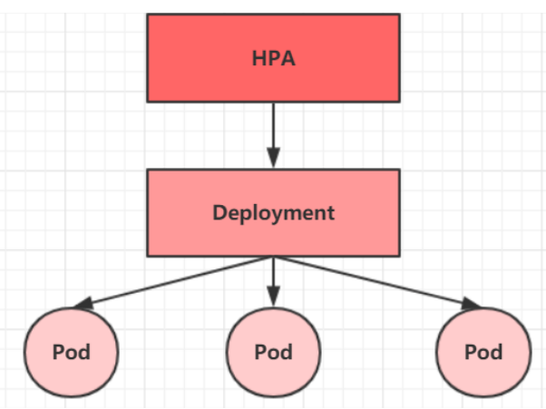

## Pod

每个 pod 都可以包含一个或者多个容器，程序运行在容器中，但是 pod 是 k8s 调度的最小单元，集群中的组件也是以 pod 为单位运行的。

pod 中的容器可以分为两类：

- 程序所在的容器。
- pause 容器，每个 pod 中都有一个，作用是：评估 pod 的健康状态、设置 ip 地址以实现 pod 内部的网络通信。

### Pod 配置

**基本配置**

```yml
apiVersion: v1
kind: Pod
metadata:
  name: pod-base
  namespace: dev
  labels:
    user: causes
spec:
  containers:
    - name: nginx
      image: nginx:1.17.1
```

**镜像拉取**

```yml
apiVersion: v1
kind: Pod
metadata:
  name: pod-base
  namespace: dev
  labels:
    user: causes
spec:
  containers:
    - name: nginx
      image: nginx:1.17.1
      # [Always, IfNotPresent, Never]
      imagePullPolicy: Always
```

- Always：一直远程拉取镜像
- IfNotPresent：优先使用本地
- Never：一直使用本地，本地没有就报错

假如指定了具体的版本号，则默认使用 `IfNotPresent`，假如指定的是 `latest`，默认使用 `Always`。

**启动命令**

```yml
apiVersion: v1
kind: Pod
metadata:
  name: pod-base
  namespace: dev
  labels:
    user: causes
spec:
  containers:
    - name: nginx
      image: nginx:1.17.1
    - name: busybox
      image: busybox:1.30
```

busybox 是一个小巧的 linux 命令合集，但是直接这样启动是失败的。因为 busybox 是一个工具集，不是一个程序，它会自动关闭。解决方式就是令它一直运行，这需要用到 command。

```yml
apiVersion: v1
kind: Pod
metadata:
  name: pod-base
  namespace: dev
  labels:
    user: causes
spec:
  containers:
    - name: nginx
      image: nginx:1.17.1
    - name: busybox
      image: busybox:1.30
      command: ["/bin/sh", "-c", "touch /tmp/hello.txt;while true; do /bin/echo $(date +%T) >> /tmp/hello.txt; sleep 3; done;"]
```

command 在容器初始化完毕之后会执行对应的命令。上面的命令是使用 `sh` 执行命令，创建一个 hello 文件之后每隔三秒向文件中写入当前时间。

**设置环境变量**

```yml
apiVersion: v1
kind: Pod
metadata:
  name: pod-base
  namespace: dev
  labels:
    user: causes
spec:
  containers:
    - name: nginx
      image: nginx:1.17.1
    - name: busybox
      image: busybox:1.30
      env:
        - name: username
          value: 'admin'
        - name: password
          value: '123456'
```

不推荐，建议将配置放到单独的配置文件中引入。

**端口**

```yml
apiVersion: v1
kind: Pod
metadata:
  name: pod-base
  namespace: dev
  labels:
    user: causes
spec:
  containers:
    - name: nginx
      image: nginx:1.17.1
    - name: busybox
      image: busybox:1.30
      # 设置容器暴露的端口列表
      ports:
        - containerPort: 80
          protocol: TCP
          name: nginx-port
```

**资源配额**

不对容器的资源做限制的话，它就可能吃掉大量资源，导致其他容器无法运行。

```yml
apiVersion: v1
kind: Pod
metadata:
  name: pod-base
  namespace: dev
  labels:
    user: causes
spec:
  containers:
    - name: nginx
      image: nginx:1.17.1
      # 资源配额
      resources:
        # 上限
        limits:
          # CPU，可以使用整数和小数
          cpu: '2'
          # 内存，可以使用 Gi、Mi、G、M 等形式
          memory: '10Gi'
        # 下限
        requests:
          cpu: '1'
          memory: '10Mi'
```

### 生命周期

1. 创建
1. 初始化容器（init container）
1. 运行主容器（main container）

    - 容器启动后钩子（post start）、容器终止前钩子（pre stop）
    - 容器存活性探测（liveness probe）、就绪性探测（readiness probe）

1. 终止 pod


**创建过程**


1. 通过 kubectl 或者 API 提交需要创建的信息给 apiServer。
1. apiServer 生成 pod 对象信息，存入到 etcd，然后返回确认给客户端。
1. apiServer 反应 etcd 中 pod 对象的变化，其他组件通过 watch 机制跟踪检查 apiServer 的变动。
1. scheduler 发现有新的 pod 对象需要创建，开始分配主机，并更新结果到 apiServer。
1. node 节点上的 kubelet 发现有 pod 调度过来，尝试调用 docker 启动容器，结果返回 apiServer。
1. apiServer 将接收到的 pod 状态信息存入 etcd。

**终止过程**

1. 提交删除命令到 apiServer。
1. apiServer 中的 pod 对象信息在宽限时间内（默认 30s），pod 被视为 dead。
1. pod 被标记为 terminating 状态。
1. kubelet 监控到 pod 转为 terminating 的同时启动 pod 关闭过程。
1. 端点控制器监控到 pod 关闭行为，将所有此端点的 service 资源从端点列表移除。
1. 假如 pod 定义了 preStop 钩子，那么在 terminating 后会以同步方式启动执行。
1. pod 中的容器接收到停止信息。
1. 宽限期结束后，假如 pod 仍然在运行，那么 pod 对象会收到立刻终止信号。
1. kubelet 请求 apiServer 将此 pod 的宽限期设置为 0 完成删除操作，pod 对用户已不可见。

**初始化容器**

初始化容器在主容器之前运行，主要做一些准备工作。初始化容器会按照顺序执行，并且必须要成功。假如失败会进行重试，直到成功为止。

```yml
apiVersion: v1
kind: Pod
metadata:
  name: pod-initcontainer
  namespace: dev
spec:
  containers:
    - name: main-container
      image: nginx:1.17.1
      ports:
        - containerPort: 80
          name: nginx-port
  initContainers:
    - name: init-mysql
      image: busybox:1.30
      command: ['sh', '-c', 'until ping 192.168.109.201 -c 1; do echo waiting for mysql......; sleep 2; done;']
    - name: init-redis
      image: busybox:1.30
      command: ['sh', '-c', 'until ping 192.168.109.202 -c 1; do echo waiting for redis......; sleep 2; done;']
```

运行容器之前会运行 initContainers 的内容，直到成功为止。

**钩子**

钩子函数可以在对应的生命周期发生时触发。


钩子函数有三种方式：

- exec 执行命令
- tcp socket 尝试访问指定 socket
- http get 向某 url 发送 http 请求。

`postStart` 和 `preStop` 分别在 mainContainer 创建之前和终止之前执行，并且会成功为止，不成功则会阻塞下一步操作。

```yml
apiVersion: v1
kind: Pod
metadata:
  name: pod-initcontainer
  namespace: dev
spec:
  containers:
    - name: main-container
      image: nginx:1.17.1
      ports:
        - containerPort: 80
          name: nginx-port
      lifecycle:
        postStart:
          exec:
            command: ['/bin/bash', '-c', 'echo postStart ...']
        preStop:
          exec:
            command: ['/user/sbin/nginx', '-s', 'quit']
```

```yml
lifecycle:
  postStart:
    httpGet:
      # URI 地址
      path: /
      port: 80
      host: 192.168.109.10
      # HTTP / HTTPS
      scheme: HTTP
```

*TCPSocket 已经过时*

```yml
apiVersion: v1
kind: Pod
metadata:
  name: pod-initcontainer
  namespace: dev
spec:
  containers:
    - name: main-container
      image: nginx:1.17.1
      ports:
        - containerPort: 80
          name: nginx-port
      lifecycle:
        postStart:
          tcpSocket:
            port: 8080
```

**容器探测**

用于检测容器中的应用实例是否正常工作，有两种探针可用：

- liveness probes：存活性探针，检测应用实例是否正常运行。
- readiness probes：就绪性探针，检测应用实例是否可接受请求。

以上探针均支持三种探测方式：exec、tspSocket、httpGet（状态码 200 - 399 之间认为正常）。

```yml
apiVersion: v1
kind: Pod
metadata:
  name: pod-initcontainer
  namespace: dev
spec:
  containers:
    - name: main-container
      image: nginx:1.17.1
      ports:
        - containerPort: 80
          name: nginx-port
      livenessProbe:
        exec:
          command: ['/bin/cat', '/tmp/hello.txt']
```

容器探测出了问题，则会对容器所在的 pod 进行重启。

**重启策略**

重启策略分为三种：

- Always：容器失效时自动重启容器，默认使用。
- OnFailure：容器终止运行且退出码不为 0 时。
- Never：不重启。

重启策略适用于 pod 中的所有容器，且再次重启时长会依次延长为 10s、20s、40s、80s、160s、300s（最大）。

```yml
apiVersion: v1
kind: Pod
metadata:
  name: pod-initcontainer
  namespace: dev
spec:
  containers:
    - name: main-container
      image: nginx:1.17.1
      ports:
        - containerPort: 80
          name: nginx-port
      livenessProbe:
        exec:
          command: ['/bin/cat', '/tmp/hello.txt']
  restartPolicy: Never
```

### Pod 调度

默认情况下，pod 的调度由 scheduler 组件采用相应算法计算，不受人工控制。但是 k8s 调度方式有多种：

- 自动调度：scheduler 自动计算。
- 定向调度：NodeName、NodeSelector。
- 亲和性调度：NodeAffinity、PodAffinity、PodAntiAffinity。
- 污点调度：Taints、Toleration。

#### 定向调度

在 pod 上声明 nodeName 和 nodeSelector 便于强制调度，即使 node 不存在也会调度。

```yml
apiVersion: v1
kind: Pod
metadata:
  name: pod-initcontainer
  namespace: dev
spec:
  containers:
    - name: main-container
      image: nginx:1.17.1
  # 强制调度到 node1
  nodeName: node1
```

```yml
apiVersion: v1
kind: Pod
metadata:
  name: pod-initcontainer
  namespace: dev
spec:
  containers:
    - name: main-container
      image: nginx:1.17.1
  nodeSelector:
    # 调度到有标签 nodeenv=pro 的节点上
    nodeenv: pro
```

强制调度时，假如 node 不存在（或者不满足条件），则调度失败。

**亲和性调度**

亲和性调度是定向调度的圆润版，就是说优先调度到满足条件的 node 上，其次是不满足条件的 node 上。总之保证了灵活性。

亲和性分为三类：

- nodeAffinity：node 亲和，以 node 为目标。
- podAffinity：pod 亲和，以 pod 为目标。
- podAntiAffinity：pod 反亲和，不以 pod 为目标。

**亲和性和反亲和性**

当两个应用频繁交互，则有必要利用亲和性让两个应用靠近，可以减少网络通信的消耗。

当应用采用副本部署，则有必要利用反亲和性让各个应用打散分布在各个 node 上，可以提高高可用性。

```yml
apiVersion: v1
kind: Pod
metadata:
  name: pod-initcontainer
  namespace: dev
spec:
  containers:
    - name: main-container
      image: nginx:1.17.1
  affinity:
    nodeAffinity:
      # 硬限制，必须满足所有规则
      requiredDuringSchedulingIgnoredDuringExecution:
        nodeSelectorTerms:
          # node 为 nodeenv=x、nodeenv=y 之一
          - matchExpressions:
              - key: nodeenv
                # 支持 In、NotIn、Exists、DoesNotExists、Gt、Lt
                operator: In
                values: ['x', 'y']
```

```yml
apiVersion: v1
kind: Pod
metadata:
  name: pod-initcontainer
  namespace: dev
spec:
  containers:
    - name: main-container
      image: nginx:1.17.1
  affinity:
    nodeAffinity:
      # 软限制，也就是倾向性
      preferredDuringSchedulingIgnoredDuringExecution:
        - preference:
            matchExpressions:
              - key: nodeenv
                operator: In
                values: ['x', 'y']
          # 权重，在 1 - 100 之间
          weight: 1
```

1. 假如同时定义了 nodeSelector 和 nodeAffinity，则必须满足两个条件，pod 才可以运行在指定容器上。
1. nodeAffinity 中，多个 nodeSelectorTerms 满足一条即可。
1. 假如 node 在 pod 运行期间不再满足 pod 的节点亲和需求，系统将忽略此变化。

```yml
apiVersion: v1
kind: Pod
metadata:
  name: pod-initcontainer
  namespace: dev
spec:
  containers:
    - name: main-container
      image: nginx:1.17.1
  affinity:
    # pod 反亲和性
    podAntiAffinity:
      # 硬限制
      requiredDuringSchedulingIgnoredDuringExecution:
        - topologyKey: kubernetes.io/hostname
          labelSelector:
            matchExpressions:
              - key: podenv
                operator: In
                values: ['x']
```

pod 和 node 控制差不多，不多赘述。

**污点和容忍**

污点，就是在 node 上打标记，用于排斥 node，有三种选项：


```shell
# 设置污点
kubectl taint nodes node1 key=value:effect
# 去除指定污点
kubectl taint nodes node1 key:effect-
# 去除所有污点
kubectl taint nodes node1 key-
```

容忍对 pod 而言，可以忍受 node 的污点，从而继续调度。

```yml
apiVersion: v1
kind: Pod
metadata:
  name: pod-initcontainer
  namespace: dev
spec:
  containers:
    - name: main-container
      image: nginx:1.17.1
  # 容忍
  tolerations:
    # 容忍污点的 key
    - key: 'tag'
      # Equal、Exists（默认）
      operator: Equal
      # 容忍污点的 value
      value: 'value1'
      # 容忍规则，这里的容忍规则必须要和标记的污点规则相同
      effect: NoExecute
      # NoExecute 生效，表示 pod 在 node 的停留时间
      tolerationSeconds: 30
```

## Pod 控制器

k8s 一般通过 pod 控制器来管理 pod。通过 pod 控制器创建出的 pod 删除后会重新创建，只有删除 pod 控制器才可以删除 pod。

pod 控制器有多种：

- ReplicaSet：控制副本数量，支持扩容缩容、版本升级。
- Deployment：控制 ReplicaSet 来控制 Pod，支持滚动升级、版本回退。
- Horizontal Pod Autoscaler：根据集群负载自动调整 pod 数量，实现削峰填谷。
- DaemonSet：在集群中的指定 Node 上运行且仅运行一个副本，一般用于守护进程。
- Job：完成任务就退出。
- Cronjob：周期性运行，不需要持续运行。
- StatefulSet：管理有状态应用。

### ReplicaSet

简称 RS，保证指定数量的 pod 运行，会持续监听 pod 的运行状态，一旦发生故障就会重启或者重建。支持扩缩容和镜像版本的升降级。

```yaml
# 版本号
apiVersion: apps/v1
# 类型
kind: ReplicaSet
# 元数据
metadata:
  # 名称
  name: rs
  # 所属的命名空间
  namespace: default
  # 指定标签
  labels:
    controller: rs
# 详情描述
spec:
  # 指定副本数量
  replicas: 3
  # 选择器，通过选择器指定该控制器应该管理哪些 pod
  selector:
    # 匹配标签
    matchLabels:
      app: nginx-pod
    # 可以指定匹配规则，例如 app in [nginx-pod]
    matchExpressions:
      - key: app
        operator: In
        values:
          - nginx-pod
  # 当副本数量不足时，按照一下模板创建 pod 副本
  template:
    metadata:
      labels:
        app: nginx-pod
    spec:
      containers:
        - name: nginx
          image: nginx:1.17.1
          ports:
            - containerPort: 80
```

无论是更改升级镜像、扩缩容、更改标签等等操作，都可以更改 yml。

### Deployment

Deployment 会管理 ReplicaSet，进而管理 Pod。它比 ReplicaSet 更强大，支持发布的停止、继续，支持滚动升级和滚动回退版本。

```yml
apiVersion: apps/v1
kind: Deployment
metadata:
  name: deploy
  namespace: default
  labels:
    controller: rs
spec:
  replicas: 3
  # 保留历史版本的数量
  revisionHistoryLimit: 3
  # 暂停部署，默认为 false
  paused: false
  # 部署的超时时间，默认是 600（s）
  progressDeadlineSeconds: 600
  # 策略
  strategy:
    # RollingUpdate：滚动更新（杀死一部分 pod，然后启动一部分，直到更新完成，更新过程中存在两个版本的 pod）、Recreate：重建更新（全部杀死所有的 pod 然后重建）
    type: RollingUpdate
    rollingUpdate:
      # 最大可以额外存在的副本数，可以为百分比、整数
      maxSurge: 30%
      # 最大不可用状态的 pod 最大值，可以为百分比、整数
      maxUnavailable: 30%
  selector:
    matchLabels:
      app: nginx-pod
    matchExpressions:
      - key: app
        operator: In
        values:
          - nginx-pod
  template:
    metadata:
      labels:
        app: nginx-pod
    spec:
      containers:
        - name: nginx
          image: nginx:1.17.1
          ports:
            - containerPort: 80
```

版本升级相关功能 `kubectl rollout [选项] deploy [deploy]`，支持选项：

- `status`: 显示当前升级状态。
- `history`: 查看升级历史记录。
- `pause`: 暂停版本升级。
- `resume`: 继续暂停的版本升级。
- `restart`: 重启版本升级。
- `undo`: 回退到上一版本。
- `--to-revision`: 回退到指定版本。

通过停止、继续这种更新操作可以实现金丝雀发布。金丝雀发布，也就是上一部分新版本，观察这新版本是否按照预计的方式运行，没问题则继续新版本发布，否则立刻回滚。

### HPA

HPA 控制器，Horizontal Pod Autoscaler，也是一种资源对象，它监控 pod 使用情况，自动化对 pod 进行扩缩容。

HPA 会监控每个 pod 的利用率，然后和 HPA 中定义的指标进行对比，计算出需要伸缩的具体值，然后进行 pod 数量调整。



::: tips
TODO
:::

### DS

DS 控制器，DaemonSet，可以保证集群中指定节点上（默认所有节点）都运行一个副本。通常是用于日志收集、节点监控等场景。

DS 的特点：

- 集群中添加一个节点时，指定 pod 副本也将添加到该节点上。
- 集群中移除一个节点时，pod 被垃圾回收。

```yml
apiVersion: apps/v1
# 类型为 DaemonSet
kind: DaemonSet
metadata:
  name: pod-initcontainer
  namespace: dev
  labels:
    controller: daemonset
spec:
  # 选择器，用于管理对应的 pod
  selector:
    # 匹配标签
    matchLabels:
      app: nginx-pod
    matchExpressions:
      - key: app
        operator: In
        values: [nginx-pod]
  # 副本数不足时，会根据下面的模板创建 pod
  template:
    metadata:
      labels:
        app: nginx-pod
    spec:
      containers:
        - name: nginx
          image: nginx:1.17.1
```

### Job

Job 控制器，用于一次性计算任务，多数场景下负责批量处理。

job 创建的 pod 成功执行后，job 将记录成功结束的 pod 数量。成功结束的 pod 达到指定数量后，job 将结束执行。

```yml
apiVersion: batch/v1
# 类型为 Job
kind: Job
metadata:
  name: pc-job
  namespace: dev
spec:
  # 指定 job 需要成功运行 pods 次数，默认 1
  completions: 1
  # job 任意时刻应该并发 pods 数，默认 1
  parallelism: 1
  # job 运行的超时时间，超时后将尝试进行终止
  activeDeadlineSeconds: 30
  # 是否可以用 selector 选择器选择 pod
  manualSelector: true
  selector:
    matchLabels:
      app: counter-pod
  # 模板，副本数量不足则根据以下模板创建 pod 副本
  template:
    metadata:
      labels:
        app: counter-pod
    spec:
      # 重启策略只可用 Never/OnFailure
      # OnFailure 指定后，会在 pod 故障后重启容器而不是创建 pod，failed 次数不变
      # Never 指定后，会在 pod 故障后创建新 pod，且故障 pod 不会消失，failed 次数 +1
      restartPolicy: Never
      containers:
        - name: counter
          image: busybox:1.30
          command: ['/bin/sh', '-c', 'for i in 9 8 7 6 5 4 3 2 1; do echo $1; sleep 3; done']
```

### CronJob

定时 Job 控制器，用于周期性运行 job。

```yml
apiVersion: batch/v1
kind: CronJob
metadata:
  name: cron-job
spec:
  # 并发执行：Allow（默认）、Forbid（禁止并发，如果上次没执行完则跳过下次执行）、Replace（取消当前作业并使用新作业替换）
  concurrencyPolicy: Allow
  # cron 表达式，分别为 秒、分、时、日、月、星期
  schedule: "* * * * *"
  # job 模板，缺少则利用模板补齐副本
  jobTemplate:
    spec:
      template:
        spec:
          containers:
            - name: counter
              image: busybox:1.28
              imagePullPolicy: IfNotPresent
              command:
                - /bin/sh
                - -c
                - date; echo Hello from the Kubernetes cluster
          restartPolicy: OnFailure
```

### StatefulSet

无状态应用，无头服务（HeadLinessService），可以部署在任意 Node 上，可以任意进行伸缩。

在 StatefulSet 中，每个 pod 的名称要求是必须有序的，可以给每一个 pod 一个唯一的标识，每个 pod 不能被随意取代，对 pod 的要求是持久、稳定、有效。

所以一般来说，StatefulSet 经常用来部署 Zookeeper、MySQL 集群等。

案例：

```yml
apiVersion: v1
kind: Service
metadata:
  name: service-headliness
  namespace: dev
spec:
  selector:
    app: nginx-pod
  # 将 clusterIP 设置为 None，即可创建 headliness Service
  clusterIP: None
  type: ClusterIP
  ports:
    # Service的端口
    - port: 80
      # Pod的端口
      targetPort: 80
---

apiVersion: apps/v1
kind: StatefulSet
metadata:
  name: pc-statefulset
  namespace: dev
spec:
  replicas: 3
  serviceName: service-headliness
  selector:
    matchLabels:
      app: nginx-pod
  template:
    metadata:
      labels:
        app: nginx-pod
    spec:
      containers:
        - name: nginx
          image: nginx
          ports:
            - containerPort: 80
```
