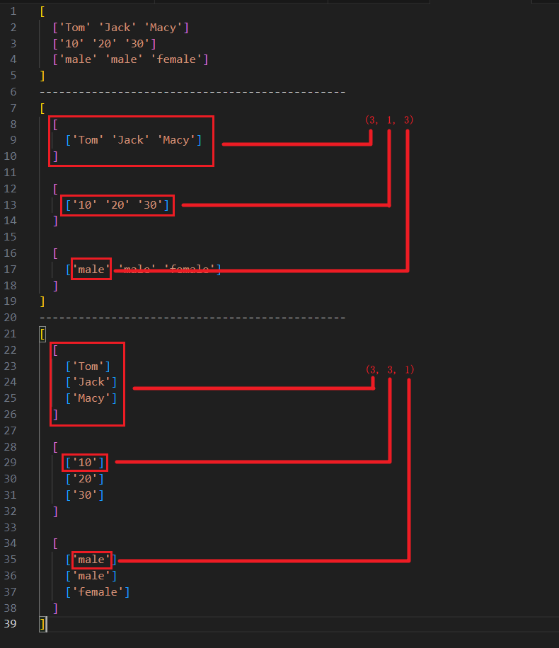

## 安装 numpy

安装 numpy 和 pandas：`pip3 install numpy pandas`

## 基本属性

numpy 是基于矩阵（矩阵数组）的运算。

那么我们可以使用一维数组或者二维数组先转换为矩阵，之后看到这个矩阵的基本属性，就是 numpy 的基本属性。

<details>

```python
import numpy as np

array = np.array([[1, 2, 3], [2, 3, 4]])

'''
[[1 2 3]
 [2 3 4]]
'''
print(array)

# 查看是一维还是二维数组：2
print(array.ndim)

# 查看矩阵行列数：(2, 3)
print(array.shape)

# 查看矩阵长度：6
print(array.size)
```

</details>

## 创建矩阵

简单方式

<details>

```python
import numpy as np

# 简单方式，一般可以使用这种列表的行使创建
arr = np.array([1, 2, 3])

# 可以给出这个矩阵的类型，可以直接使用 int64，也可以使用 int32（默认是 64 还是 32 取决于默认安装的版本），除此之外还有 float 以及其他各种形式等
arr = np.array([[1, 2, 3], [2, 3, 4]], dtype=np.int64)

print(arr.dtype)
```

</details>

其他方式

<details>

```python
import numpy as np

# 生成一个 3 行 4 列的矩阵，矩阵的值全部为 0
arr = np.zeros((3, 4))

# 生成一个 3 行 4 列的矩阵，矩阵的值全部为 1
arr = np.ones((3, 4), dtype=np.int32)

# 生成一个 3 行 4 列的矩阵，矩阵的值全部接近 0（因为精度的原因可能直接显示为 0）
arr = np.empty((3, 4))

# 从 10 生成到 20，步长为 2，即：[10 12 14 16 18]，如果只传递一个 n，则默认是从 0 到 n，步长为 1
arr = np.arange(10, 20, 2)

# 首先生成从 0 到 n，步长为 1 的矩阵，之后对矩阵重新排列为 3 行 4 列
'''
[[ 0  1  2  3]
 [ 4  5  6  7]
 [ 8  9 10 11]]
'''
arr = np.arange(12).reshape((3, 4))

# 生成一个线段，开始值为 1，最终值为 20，需要有 20 段值，这会自动分区（值可以为小数）
'''
[ 1.  2.  3.  4.  5.  6.  7.  8.  9. 10. 11. 12. 13. 14. 15. 16. 17. 18.
 19. 20.]
'''
arr = np.linspace(1, 20, 20)
```

</details>

## 基础运算

一维数组矩阵的加减乘除、n 次方、函数

<details>

```python
import numpy as np

# [10 20 30 40]
a = np.array([10, 20, 30, 40])
# [0 1 2 3]
b = np.arange(4)

# a - b 代表的就是，矩阵中对应的值相减，比如 10-0、20-1、30-2、40-3
# 加减乘除都是一个逻辑，需要注意，除法时，分母必须有意义（必须大于 0）
print(a - b)

# 需要注意的是，在 python 中，平方使用 `**` 表示
print(b ** 2)

arr = np.arange(4)

# 三角函数
print(10 * np.sin(arr))
print(10 * np.cos(arr))

# 比较，将会以每个元素都与 3 进行比较：[ True  True  True False]
print(arr < 3)

'''
随机生成 3 行 4 列的矩阵，矩阵中的值是从 0 - 1 的随机数

[[0.33054942 0.98101401 0.32522476 0.20710235]
 [0.55274883 0.93553864 0.09290821 0.68346944]
 [0.62676742 0.84797006 0.23963387 0.33535673]]
'''
arr = np.random.random((3, 4))
```

</details>

矩阵的乘法

<details>

```python
import numpy as np

'''
[[1 1]
 [1 1]]
'''
a = np.array([[1, 1], [1, 1]])

'''
[[0 1]
 [2 3]]
'''
b = np.arange(4).reshape((2, 2))

'''
矩阵中的乘法分为两种：

- 点乘
- 叉乘
'''

'''
点乘，就是对应位置的数字乘即可

[[0 1]
 [2 3]]

[
    [1 * 0, 1 * 1],
    [1 * 2, 1 * 3]
]

'''
print(a * b)

'''
叉乘，就是线代的矩阵乘法，建议看 `https://github.com/staltz/matrixmultiplication.xyz` 了解矩阵乘法。

[[2 4]
 [2 4]]

'''
print(np.dot(a, b))
print(a.dot(b))
```

</details>

函数计算

<details>

```python
import numpy as np

arr = np.random.random((3, 4))

'''
[[0.4245557  0.24433831 0.35182152 0.94751886]
 [0.85272293 0.57838763 0.03057344 0.4780149 ]
 [0.16168701 0.82723507 0.3197346  0.70064378]]
'''
print(arr)

# 矩阵所有数求和：5.917233747456798
print(np.sum(arr))
# 取得矩阵中最小值：0.03057343994987327
print(np.min(arr))
# 取得矩阵中最大值：0.9475188596192659
print(np.max(arr))

# 以行为标准，每列求和：[1.43896564 1.64996101 0.70212956 2.12617754]。min、max 同理
print(np.sum(arr, axis=0))
# 以列为标准，每行求和：[1.96823439 1.9396989  2.00930045]。min、max 同理
print(np.sum(arr, axis=1))
```

</details>

其他基本计算

<details>

```python
import numpy as np

'''
[[ 2  3  4  5]
 [ 6  7  8  9]
 [10 11 12 13]]
'''
arr = np.arange(2, 14).reshape((3, 4))

# 矩阵中，最小值的索引，这里是 0
print(np.argmin(arr))
# 矩阵中，最大值的索引，这里是 11
print(np.argmax(arr))
'''
获得平均值，其实在 python 中可以有多种方式，包括 np.mean(arr)、arr.mean()、arr.average()
'''
print(np.mean(arr))
'''
获得矩阵的中位数，中位数的定义：

- 奇数时，为最中间的数。
- 偶数时，为中间两个数的平均值。
'''
print(np.median(arr))
'''
逐步累加，可以理解为值就是累加器的值。

[ 2  5  9 14 20 27 35 44 54 65 77 90]
'''
print(np.cumsum(arr))
'''
相邻之间两个数的差

[[1 1 1]
 [1 1 1]
 [1 1 1]]

这个也就是：

[
    [ 3 - 2, 4 - 3, 5 - 4 ],
    [ 7 - 6, 8 - 7, 9 - 8 ],
    [ 11 - 10, 12 - 11, 13 - 12 ]
]

所以一开始是 3 行 4 列，diff 之后变为了 3 行 3 列。
'''
print(np.diff(arr))
'''
输出的是非 0 值的坐标索引。

(array([0, 0, 0, 0, 1, 1, 1, 1, 2, 2, 2, 2], dtype=int64), array([0, 1, 2, 3, 0, 1, 2, 3, 0, 1, 2, 3], dtype=int64))

例如每个 array 第一个代表 (0, 0)，这代表索引为 (0, 0) 的这个值是非零值。同理，每个 array 的最后一个数，代表索引为 (2, 3) 的这个值是非零值。
'''
print(np.nonzero(arr))
# 矩阵的排序
print(np.sort(arr))
'''
矩阵的转置，也就是说行变为列，列变为行

[[ 2  6 10]
 [ 3  7 11]
 [ 4  8 12]
 [ 5  9 13]]

 np.transpose(arr) 可以简写为 arr.T
'''
print(np.transpose(arr))
'''
给定一个矩阵，给定最小值和最大值，令矩阵中小于给定的最小值的值变为给定的最小值，令矩阵中大于给定的最大值的值变为给定的最大值

[[3 3 4 5]
 [6 7 8 9]
 [9 9 9 9]]
'''
print(np.clip(arr, 3, 9))
```

</details>

注意，以上的基本计算函数中，基本上都有 `axis` 这个参数。

以 `np.mean(arr, axis=0)` 为例，求的结果就是每列的平均值。

## 索引

```python
import numpy as np

'''
[[ 3  4  5  6]
 [ 7  8  9 10]
 [11 12 13 14]]
'''
arr = np.arange(3, 15).reshape((3, 4))

'''
一维矩阵中，获取索引 2 的值为数字：5
二维矩阵中，获取索引 2 的值为矩阵：[11 12 13 14]
'''
print(np.arange(3, 15)[2])
'''
[[ 3  4  5  6]
 [ 7  8  9 10]
 [11 12 13 14]]
'''
print(arr[2])

# 用冒号代表所有数，这里代表取值索引为 2 所在行的所有数：[11 12 13 14]
print(arr[2, :])
# 用冒号代表所有数，这里代表取值索引为 1 所在行的，索引从 1 到 2（左闭右开）所在列的所有数：[8]
print(arr[1, 1:2])
# 遍历每一列，首先对 arr 进行矩阵转置，将列变为行，之后 for 循环调用 [array([ 3,  7, 11]), array([ 4,  8, 12]), array([ 5,  9, 13]), array([ 6, 10, 14])]
print([col for col in arr.T])

'''
arr.flatten() 和 arr.flat 的区别就是，一个返回值，一个返回迭代器而已。

flatten() 和 flat 的作用就是将数据扁平化为一个一维矩阵：[ 3  4  5  6  7  8  9 10 11 12 13 14]
'''
print(arr.flatten())
# [3, 4, 5, 6, 7, 8, 9, 10, 11, 12, 13, 14]
print([item for item in arr.flat])
```

## 方法

**expand_dims**

给矩阵增加一个新的维度

```python
# shape: (3, 3)
# 先 array，后 list，再 array 是为了复制一个新的副本，避免操作原始数据
arr = np.array(list(np.array([
    ['Tom', 'Jack', 'Macy'],
    [10, 20, 30],
    ['male', 'male', 'female'],
])))
# 3
num = arr.shape[1]
# shape: (3, 1, 3)。原来的维度是 (3, 3)，那么现在向 axis = 1 这个维度插了个队，原本的维度就要后移。
arr1 = np.expand_dims(arr, 1)
# shape: (3, 3, 1)。原来的维度是 (3, 3)，现在向 axis = 2 这个维度插了个队，但是原本没有 axis = 2 这个维度，所以无需后移。
arr2 = np.expand_dims(arr, 2)
```

- (3, 1, 3) 指的是：二维数组三个，每个二维数组中的一维数组一个，每个一维数组中的元素三个。
- (3, 3, 1) 指的是：二维数组三个，每个二维数组中的一维数组三个，每个一维数组中的元素一个。

<details>



</details>

**repeat**

指定一个轴向，重复 n 次

```python
# shape: (3, 3)
# 先 array，后 list，再 array 是为了复制一个新的副本，避免操作原始数据
arr = np.array(list(np.array([
    ['Tom', 'Jack', 'Macy'],
    [10, 20, 30],
    ['male', 'male', 'female'],
])))
# 3
num = arr.shape[1]
# shape: (3, 1, 3)。向轴 axis = 1 重复 3 次，也就是说每个二维数组中的一维数组重复三次。
arr1 = np.expand_dims(arr, 1).repeat(num, axis=1)
# shape: (3, 3, 1)。向轴 axis = 2 重复 3 次，也就是说每个一维数组中的元素重复三次。
arr2 = np.expand_dims(arr, 2).repeat(num, axis=2)
```

<details>


</details>