## 过去和未来

学完Spring Boot之后，我们有了这么一个疑问：当公司的服务器撑不住了怎么办？

以前有一个简单的解决方法：加服务器，实现负载均衡。

这样做十分简单粗暴，属于横向解决问题。

但是假如一个公司有很多业务：签到，订单，支付，物流....

假如签到用的资源非常少，而其他资源用的非常多，那么虽然加服务器实现负载均衡可以解决这个问题，但是有非常多的资源会被浪费

我们想给签到少一点资源，给其他业务多一点资源

在这种情况下，出现了微服务架构体系，但是微服务架构存在一些问题：

## 微服务概述

### 什么是微服务、微服务需要的版本

微服务是近几年流行的一种服务器架构风格。

他提倡将单一的应用程序划分为一组组小的服务，每个服务运行在单独的进程内，相互协调，提供最终价值。

服务之间采用轻量级的通信机制进行互通，每个服务围绕着具体的业务进行构建。

避免统一的，集中式的管理机制。

可以选择不同的语言编写服务，也可以使用不同的数据存储。

当前 SpringCloud 功能的实现有：

- 服务注册与发现

    Eureka、Consul、Etcd

    Alibaba Nacos

- 服务调用和负载均衡

    OpenFeign、LoadBalancer

- 分布式事务

    LCN、Hmily

    Alibaba Seata

- 服务熔断和服务降级

    Circuit Breaker（Resilience4J）
    
    Alibaba Sentinel

- 服务链路追踪

    Sleuth（半退休）+ Zipkin、Micrometer Tracing

- 服务网关

    Gate Way

- 分布式配置管理

    Consul

    Alibaba Nacos

微服务需要用到的版本：

- Java 17+
- Spring Cloud 2023.0.0
- Spring Boot 3.2.0
- Spring Cloud Alibaba 2022.0.0.0-RC2
- Maven 3.9+
- MySQL 8.0+

## 快速开始、Base 工程

### 环境准备

1. 需求：下订单，调用支付

    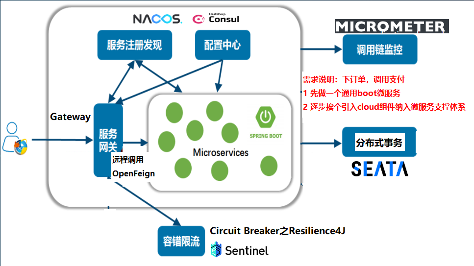

1. 创建父工程

    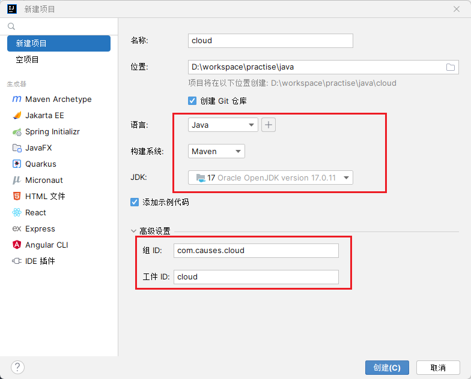

    解决编码故障问题

    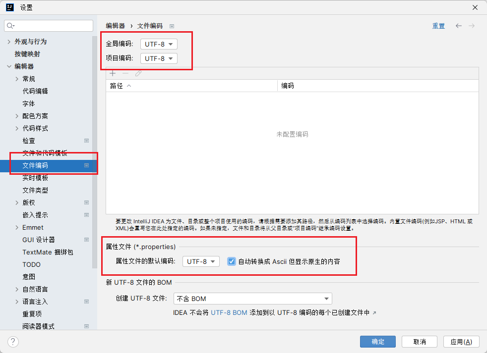

    默认注解激活

    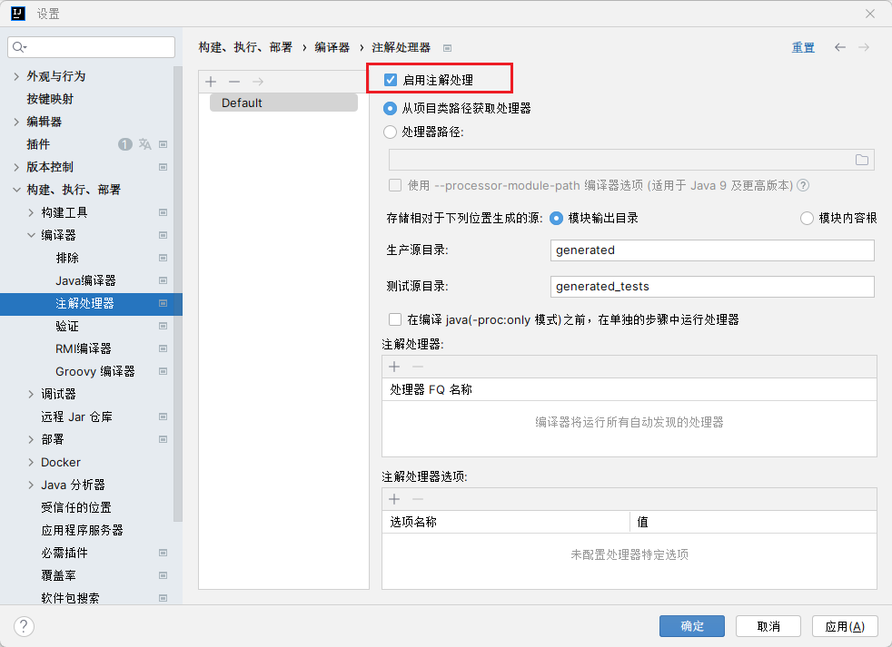

    Java 编译器版本

    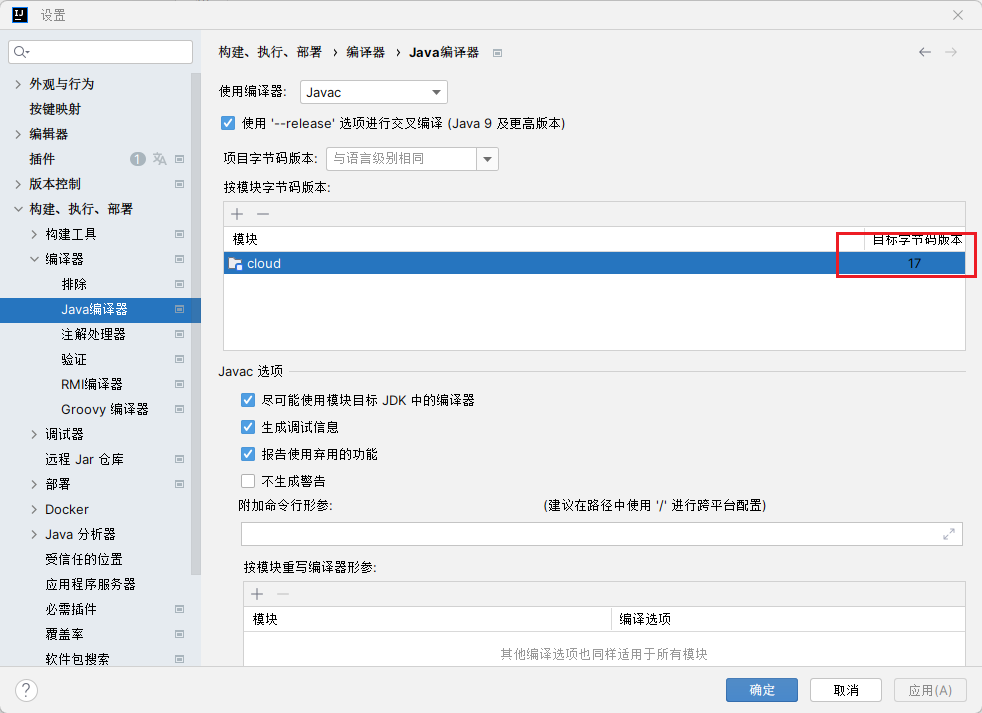

    每次创建项目时自动去掉的文本

    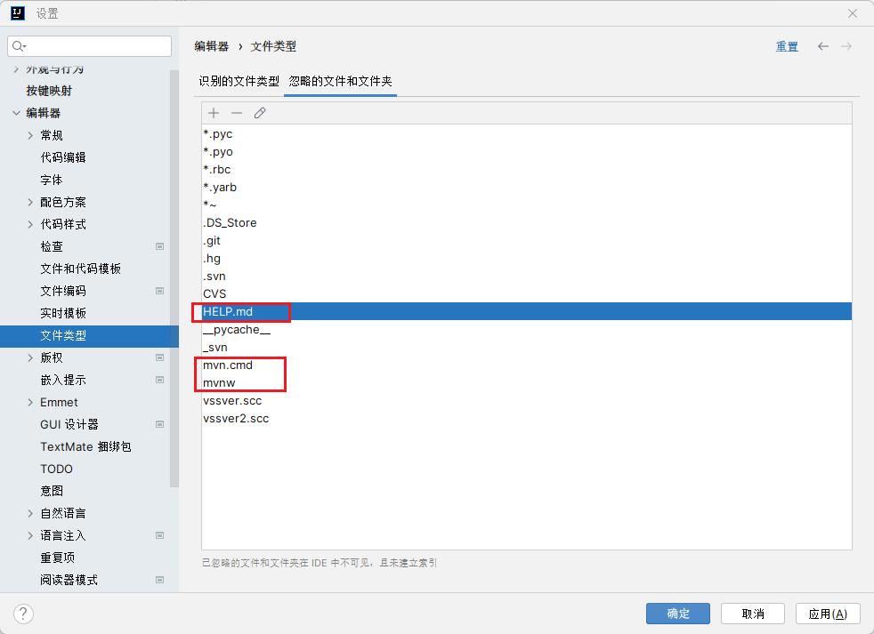

1. 父工程 pom 文件内容，本次项目直接继承了 Spring Cloud、Spring Cloud Alibaba

    maven 中有 dependencyManagement、dependencies
    
    dependencyManagement 元素能让所有的子项目引用一个依赖而不用显示版本号
    
    Maven 会沿着父子层级找到一个拥有 dependencyManagement 的项目，然后就会使用这个元素中指定的版本号

    简单来说 dependencyManagement 它是一个规范

    :::details
    ```xml
    <?xml version="1.0" encoding="UTF-8"?>
    <project xmlns="http://maven.apache.org/POM/4.0.0"
            xmlns:xsi="http://www.w3.org/2001/XMLSchema-instance"
            xsi:schemaLocation="http://maven.apache.org/POM/4.0.0 http://maven.apache.org/xsd/maven-4.0.0.xsd">
        <modelVersion>4.0.0</modelVersion>

        <groupId>com.causes.cloud</groupId>
        <artifactId>cloud</artifactId>
        <version>1.0-SNAPSHOT</version>
        <!-- 代表 maven 父工程 -->
        <packaging>pom</packaging>

        <properties>
            <maven.compiler.source>17</maven.compiler.source>
            <maven.compiler.target>17</maven.compiler.target>
            <project.build.sourceEncoding>UTF-8</project.build.sourceEncoding>

            <hutool.version>5.8.22</hutool.version>
            <lombok.version>1.18.26</lombok.version>
            <druid.version>1.1.20</druid.version>
            <mybatis.springboot.version>3.0.2</mybatis.springboot.version>
            <mysql.version>8.0.11</mysql.version>
            <swagger3.version>2.2.0</swagger3.version>
            <mapper.version>4.2.3</mapper.version>
            <fastjson2.version>2.0.40</fastjson2.version>
            <persistence-api.version>1.0.2</persistence-api.version>
            <spring.boot.test.version>3.1.5</spring.boot.test.version>
            <spring.boot.version>3.2.0</spring.boot.version>
            <spring.cloud.version>2023.0.0</spring.cloud.version>
            <spring.cloud.alibaba.version>2022.0.0.0-RC2</spring.cloud.alibaba.version>
        </properties>

        <dependencyManagement>
            <dependencies>
                <!--springboot 3.2.0-->
                <dependency>
                    <groupId>org.springframework.boot</groupId>
                    <artifactId>spring-boot-starter-parent</artifactId>
                    <version>${spring.boot.version}</version>
                    <type>pom</type>
                    <scope>import</scope>
                </dependency>
                <!--springcloud 2023.0.0-->
                <dependency>
                    <groupId>org.springframework.cloud</groupId>
                    <artifactId>spring-cloud-dependencies</artifactId>
                    <version>${spring.cloud.version}</version>
                    <type>pom</type>
                    <scope>import</scope>
                </dependency>
                <!--springcloud alibaba 2022.0.0.0-RC2-->
                <dependency>
                    <groupId>com.alibaba.cloud</groupId>
                    <artifactId>spring-cloud-alibaba-dependencies</artifactId>
                    <version>${spring.cloud.alibaba.version}</version>
                    <type>pom</type>
                    <scope>import</scope>
                </dependency>
                <!--SpringBoot集成mybatis-->
                <dependency>
                    <groupId>org.mybatis.spring.boot</groupId>
                    <artifactId>mybatis-spring-boot-starter</artifactId>
                    <version>${mybatis.springboot.version}</version>
                </dependency>
                <!--Mysql数据库驱动8 -->
                <dependency>
                    <groupId>mysql</groupId>
                    <artifactId>mysql-connector-java</artifactId>
                    <version>${mysql.version}</version>
                </dependency>
                <!--SpringBoot集成druid连接池-->
                <dependency>
                    <groupId>com.alibaba</groupId>
                    <artifactId>druid-spring-boot-starter</artifactId>
                    <version>${druid.version}</version>
                </dependency>
                <!--通用Mapper4之tk.mybatis-->
                <dependency>
                    <groupId>tk.mybatis</groupId>
                    <artifactId>mapper</artifactId>
                    <version>${mapper.version}</version>
                </dependency>
                <!--persistence-->
                <dependency>
                    <groupId>javax.persistence</groupId>
                    <artifactId>persistence-api</artifactId>
                    <version>${persistence-api.version}</version>
                </dependency>
                <!-- fastjson2 -->
                <dependency>
                    <groupId>com.alibaba.fastjson2</groupId>
                    <artifactId>fastjson2</artifactId>
                    <version>${fastjson2.version}</version>
                </dependency>
                <!-- swagger3 调用方式 http://你的主机IP地址:5555/swagger-ui/index.html -->
                <dependency>
                    <groupId>org.springdoc</groupId>
                    <artifactId>springdoc-openapi-starter-webmvc-ui</artifactId>
                    <version>${swagger3.version}</version>
                </dependency>
                <!--hutool-->
                <dependency>
                    <groupId>cn.hutool</groupId>
                    <artifactId>hutool-all</artifactId>
                    <version>${hutool.version}</version>
                </dependency>
                <!--lombok-->
                <dependency>
                    <groupId>org.projectlombok</groupId>
                    <artifactId>lombok</artifactId>
                    <version>${lombok.version}</version>
                    <optional>true</optional>
                </dependency>
                <!-- spring-boot-starter-test -->
                <dependency>
                    <groupId>org.springframework.boot</groupId>
                    <artifactId>spring-boot-starter-test</artifactId>
                    <version>${spring.boot.test.version}</version>
                    <scope>test</scope>
                </dependency>
            </dependencies>
        </dependencyManagement>
    </project>
    ```
    :::

1. MySQL 的处理

    对于 MySQL5，使用下列驱动 URL 以及 POM 文件

    ```properties
    # mysql5.7---JDBC四件套
    jdbc.driverClass = com.mysql.jdbc.Driver
    jdbc.url= jdbc:mysql://localhost:3306/db2024?useUnicode=true&characterEncoding=UTF-8&useSSL=false
    jdbc.user = root
    jdbc.password =123456
    ```

    ```xml
    <!-- Maven的POM文件处理 -->
    <dependency>
        <groupId>mysql</groupId>
        <artifactId>mysql-connector-java</artifactId>
        <version>5.1.47</version>
    </dependency>
    ```

    对于 MySQL8，使用下列驱动 URL 以及 POM 文件

    ```properties
    # mysql8.0---JDBC四件套
    jdbc.driverClass = com.mysql.cj.jdbc.Driver
    jdbc.url= jdbc:mysql://localhost:3306/db2024?characterEncoding=utf8&useSSL=false&serverTimezone=GMT%2B8&rewriteBatchedStatements=true&allowPublicKeyRetrieval=true
    jdbc.user = root
    jdbc.password =123456
    ```

    ```xml
    <!-- Maven的POM文件处理 -->
    <dependency>
        <groupId>mysql</groupId>
        <artifactId>mysql-connector-java</artifactId>
        <version>8.0.11</version>
    </dependency>
    ```

1. mapper 一键生成、MySQL 脚本

    [mybatis-generator](http://mybatis.org/generator) 现在是 DAO 的事实标准

    事实上有很多生成工具，例如 MybatisPlus、Mapper4，这里用 [Mapper4](http://github.com/abel533/Mapper)，当前比 Mapper5 更加稳定

    ```mysql
    CREATE DATABASE db2024;

    USE db2024;
    DROP TABLE IF EXISTS `t_pay`;
    CREATE TABLE `t_pay`
    (
        `id`          INT(10) UNSIGNED    NOT NULL AUTO_INCREMENT,
        `pay_no`      VARCHAR(50)         NOT NULL COMMENT '支付流水号',
        `order_no`    VARCHAR(50)         NOT NULL COMMENT '订单流水号',
        `user_id`     INT(10)                      DEFAULT '1' COMMENT '用户账号ID',
        `amount`      DECIMAL(8, 2)       NOT NULL DEFAULT '9.9' COMMENT '交易金额',
        `deleted`     TINYINT(4) UNSIGNED NOT NULL DEFAULT '0' COMMENT '删除标志，默认0不删除，1删除',
        `create_time` TIMESTAMP           NOT NULL DEFAULT CURRENT_TIMESTAMP COMMENT '创建时间',
        `update_time` TIMESTAMP           NOT NULL DEFAULT CURRENT_TIMESTAMP ON UPDATE CURRENT_TIMESTAMP COMMENT '更新时间',
        PRIMARY KEY (`id`)
    ) ENGINE = INNODB AUTO_INCREMENT = 1 DEFAULT CHARSET = utf8mb4 COMMENT ='支付交易表';

    INSERT INTO t_pay(pay_no, order_no) VALUES ('pay17203699', '6544bafb424a');

    SELECT * FROM t_pay;
    ```

1. 新建一个普通的 maven 项目 `mybatis_generator2024`，专门生成对数据库的增删改查

    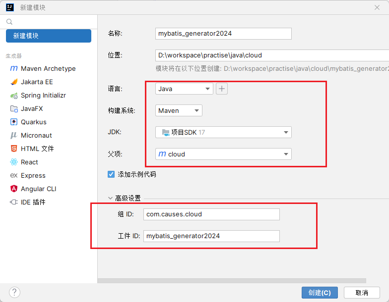

    创建之后，在父工程的 maven 中会出现 modules，代表有子项目。而在子项目中的 pom 会出现父工程 parent 的内容

    :::details
    ```xml
    <?xml version="1.0" encoding="UTF-8"?>
    <project xmlns="http://maven.apache.org/POM/4.0.0"
            xmlns:xsi="http://www.w3.org/2001/XMLSchema-instance"
            xsi:schemaLocation="http://maven.apache.org/POM/4.0.0 http://maven.apache.org/xsd/maven-4.0.0.xsd">
        <parent>
            <artifactId>cloud</artifactId>
            <groupId>com.causes.cloud</groupId>
            <version>1.0-SNAPSHOT</version>
        </parent>
        <modelVersion>4.0.0</modelVersion>

        <artifactId>mybatis_generator2024</artifactId>

        <properties>
            <maven.compiler.source>17</maven.compiler.source>
            <maven.compiler.target>17</maven.compiler.target>
            <project.build.sourceEncoding>UTF-8</project.build.sourceEncoding>
        </properties>

        <dependencies>
            <!--Mybatis 通用mapper tk单独使用，自己独有+自带版本号-->
            <dependency>
                <groupId>org.mybatis</groupId>
                <artifactId>mybatis</artifactId>
                <version>3.5.13</version>
            </dependency>
            <!-- Mybatis Generator 自己独有+自带版本号-->
            <dependency>
                <groupId>org.mybatis.generator</groupId>
                <artifactId>mybatis-generator-core</artifactId>
                <version>1.4.2</version>
            </dependency>
            <!--通用Mapper-->
            <dependency>
                <groupId>tk.mybatis</groupId>
                <artifactId>mapper</artifactId>
            </dependency>
            <!--mysql8.0-->
            <dependency>
                <groupId>mysql</groupId>
                <artifactId>mysql-connector-java</artifactId>
            </dependency>
            <!--persistence-->
            <dependency>
                <groupId>javax.persistence</groupId>
                <artifactId>persistence-api</artifactId>
            </dependency>
            <!--hutool-->
            <dependency>
                <groupId>cn.hutool</groupId>
                <artifactId>hutool-all</artifactId>
            </dependency>
            <!--lombok-->
            <dependency>
                <groupId>org.projectlombok</groupId>
                <artifactId>lombok</artifactId>
                <optional>true</optional>
            </dependency>
            <dependency>
                <groupId>org.springframework.boot</groupId>
                <artifactId>spring-boot-starter-test</artifactId>
                <scope>test</scope>
                <exclusions>
                    <exclusion>
                        <groupId>org.junit.vintage</groupId>
                        <artifactId>junit-vintage-engine</artifactId>
                    </exclusion>
                </exclusions>
            </dependency>
        </dependencies>

        <build>
            <resources>
                <resource>
                    <directory>${basedir}/src/main/java</directory>
                    <includes>
                        <include>**/*.xml</include>
                    </includes>
                </resource>
                <resource>
                    <directory>${basedir}/src/main/resources</directory>
                </resource>
            </resources>
            <plugins>
                <plugin>
                    <groupId>org.springframework.boot</groupId>
                    <artifactId>spring-boot-maven-plugin</artifactId>
                    <configuration>
                        <excludes>
                            <exclude>
                                <groupId>org.projectlombok</groupId>
                                <artifactId>lombok</artifactId>
                            </exclude>
                        </excludes>
                    </configuration>
                </plugin>
                <plugin>
                    <groupId>org.mybatis.generator</groupId>
                    <artifactId>mybatis-generator-maven-plugin</artifactId>
                    <version>1.4.2</version>
                    <configuration>
                        <configurationFile>${basedir}/src/main/resources/generatorConfig.xml</configurationFile>
                        <overwrite>true</overwrite>
                        <verbose>true</verbose>
                    </configuration>
                    <dependencies>
                        <dependency>
                            <groupId>mysql</groupId>
                            <artifactId>mysql-connector-java</artifactId>
                            <version>8.0.33</version>
                        </dependency>
                        <dependency>
                            <groupId>tk.mybatis</groupId>
                            <artifactId>mapper</artifactId>
                            <version>4.2.3</version>
                        </dependency>
                    </dependencies>
                </plugin>
            </plugins>
        </build>

    </project>
    ```
    :::

    在 `com.src.resources` 中建立 `config.properties`

    ```properties
    # 配置表的包名
    package.name=com.causes.cloud

    # mysql5.7---JDBC四件套
    jdbc.driverClass=com.mysql.jdbc.Driver
    jdbc.url=jdbc:mysql://hadoop101:3306/db2024?useUnicode=true&characterEncoding=UTF-8&useSSL=false
    jdbc.user=root
    jdbc.password=root
    ```

    建立 `generatorConfig.xml`

    ```xml
    <?xml version="1.0" encoding="UTF-8"?>
    <!DOCTYPE generatorConfiguration
            PUBLIC "-//mybatis.org//DTD MyBatis Generator Configuration 1.0//EN"
            "http://mybatis.org/dtd/mybatis-generator-config_1_0.dtd">

    <generatorConfiguration>
        <properties resource="config.properties"/>

        <context id="Mysql" targetRuntime="MyBatis3Simple" defaultModelType="flat">
            <property name="beginningDelimiter" value="`"/>
            <property name="endingDelimiter" value="`"/>

            <plugin type="tk.mybatis.mapper.generator.MapperPlugin">
                <property name="mappers" value="tk.mybatis.mapper.common.Mapper"/>
                <property name="caseSensitive" value="true"/>
            </plugin>

            <jdbcConnection driverClass="${jdbc.driverClass}" connectionURL="${jdbc.url}" userId="${jdbc.user}" password="${jdbc.password}">
            </jdbcConnection>

            <javaModelGenerator targetPackage="${package.name}.entities" targetProject="src/main/java"/>

            <sqlMapGenerator targetPackage="${package.name}.mapper" targetProject="src/main/java"/>

            <javaClientGenerator targetPackage="${package.name}.mapper" targetProject="src/main/java" type="XMLMAPPER"/>

            <table tableName="t_pay" domainObjectName="Pay">
                <generatedKey column="id" sqlStatement="JDBC"/>
            </table>
        </context>
    </generatorConfiguration>
    ```

    数据生成

    在插件中的 mybatis-generator 中会有 `mybatis-generator:generator`，双击两下会自动连接数据库生成 entities 和 Mapper

    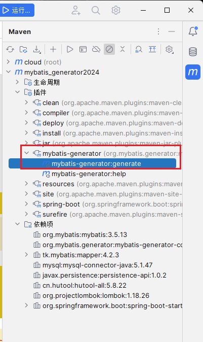

### 微服务工程化编写

1. 微服务提供者 `cloud-provider-payment8001`

    新建子项目 `cloud-provider-payment8001`，maven 如下

    :::details
    ```xml
    <dependencies>
        <!--SpringBoot通用依赖模块-->
        <dependency>
            <groupId>org.springframework.boot</groupId>
            <artifactId>spring-boot-starter-web</artifactId>
        </dependency>
        <dependency>
            <groupId>org.springframework.boot</groupId>
            <artifactId>spring-boot-starter-actuator</artifactId>
        </dependency>
        <!--SpringBoot集成druid连接池-->
        <dependency>
            <groupId>com.alibaba</groupId>
            <artifactId>druid-spring-boot-starter</artifactId>
        </dependency>
        <!-- Swagger3 调用方式 http://你的主机IP地址:5555/swagger-ui/index.html -->
        <dependency>
            <groupId>org.springdoc</groupId>
            <artifactId>springdoc-openapi-starter-webmvc-ui</artifactId>
        </dependency>
        <!--mybatis和springboot整合-->
        <dependency>
            <groupId>org.mybatis.spring.boot</groupId>
            <artifactId>mybatis-spring-boot-starter</artifactId>
        </dependency>
        <!--Mysql数据库驱动8 -->
        <dependency>
            <groupId>mysql</groupId>
            <artifactId>mysql-connector-java</artifactId>
        </dependency>
        <!--persistence-->
        <dependency>
            <groupId>javax.persistence</groupId>
            <artifactId>persistence-api</artifactId>
        </dependency>
        <!--通用Mapper4-->
        <dependency>
            <groupId>tk.mybatis</groupId>
            <artifactId>mapper</artifactId>
        </dependency>
        <!--hutool-->
        <dependency>
            <groupId>cn.hutool</groupId>
            <artifactId>hutool-all</artifactId>
        </dependency>
        <!-- fastjson2 -->
        <dependency>
            <groupId>com.alibaba.fastjson2</groupId>
            <artifactId>fastjson2</artifactId>
        </dependency>
        <!--lombok-->
        <dependency>
            <groupId>org.projectlombok</groupId>
            <artifactId>lombok</artifactId>
            <version>1.18.28</version>
            <scope>provided</scope>
        </dependency>
        <!--test-->
        <dependency>
            <groupId>org.springframework.boot</groupId>
            <artifactId>spring-boot-starter-test</artifactId>
            <scope>test</scope>
        </dependency>
    </dependencies>

    <build>
        <plugins>
            <plugin>
                <groupId>org.springframework.boot</groupId>
                <artifactId>spring-boot-maven-plugin</artifactId>
            </plugin>
        </plugins>
    </build>
    ```
    :::

    yaml 文件

    :::details
    ```yaml
    server:
    port: 8001

    # ==========applicationName + druid-mysql8 driver===================
    spring:
    application:
        name: cloud-payment-service

    datasource:
        type: com.alibaba.druid.pool.DruidDataSource
        driver-class-name: com.mysql.jdbc.Driver
        url: jdbc:mysql://hadoop101:3306/db2024?useUnicode=true&characterEncoding=UTF-8&useSSL=false
        username: root
        password: root

    # ========================mybatis===================
    mybatis:
    mapper-locations: classpath:mapper/*.xml
    type-aliases-package: com.causes.cloud.entities
    configuration:
        map-underscore-to-camel-case: true
    ```
    :::


    主启动类改为 `Main8001`，这样以端口划分不会出错

    :::details
    ```java
    package com.causes.cloud;

    import org.springframework.boot.SpringApplication;
    import org.springframework.boot.autoconfigure.SpringBootApplication;
    import tk.mybatis.spring.annotation.MapperScan;

    @SpringBootApplication
    /*
        引入 `tk.xxx` 项目
        tk：主要用于个人或者非官方项目，org 一般用于开源项目或者组织
        直接在主启动类下直接扫描 mapper 下的所有内容，不用每一个都写 @Mapper 注解了
    */
    @MapperScan("com.causes.cloud.mapper")
    public class Main8001 {
        public static void main(String[] args) {
            SpringApplication.run(Main8001.class, args);
        }
    }
    ```
    :::details

    将环境搭建中的 mapper、dao 转移到当前项目下，并且建立 `PayDTO`、`PayService`、`PayServiceImpl`、`PayController`

    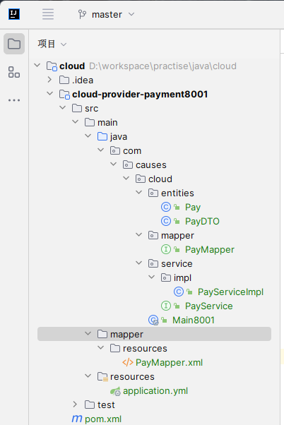

    :::details
    ```java
    package com.causes.cloud.entities;

    import lombok.AllArgsConstructor;
    import lombok.Data;
    import lombok.NoArgsConstructor;

    import java.io.Serializable;
    import java.math.BigDecimal;

    @Data
    @AllArgsConstructor
    @NoArgsConstructor
    public class PayDTO implements Serializable {

        private Integer id;
        //支付流水号
        private String payNo;
        //订单流水号
        private String orderNo;
        //用户账号ID
        private Integer userId;
        //交易金额
        private BigDecimal amount;
    }
    ```
    :::

    :::details
    ```java
    package com.causes.cloud.service;
    import com.causes.cloud.entities.Pay;
    import java.util.List;

    public interface PayService {

        int add(Pay pay);

        int delete(Integer id);

        int update(Pay pay);

        Pay getById(Integer id);

        List<Pay> getAll();
    }
    ```
    :::

    :::details
    ```java
    package com.causes.cloud.service.impl;

    import com.causes.cloud.entities.Pay;
    import com.causes.cloud.mapper.PayMapper;
    import com.causes.cloud.service.PayService;
    import jakarta.annotation.Resource;
    import org.springframework.stereotype.Service;

    import java.util.List;

    @Service
    public class PayServiceImpl implements PayService {

        // 推荐使用新包 jakarta.annotation.Resource，不要用 @Autowired 了
        @Resource
        private PayMapper payMapper;

        @Override
        public int add(Pay pay) {
            return payMapper.insertSelective(pay);
        }

        @Override
        public int delete(Integer id) {
            return payMapper.deleteByPrimaryKey(id);
        }

        @Override
        public int update(Pay pay) {
            return payMapper.updateByPrimaryKeySelective(pay);
        }

        @Override
        public Pay getById(Integer id) {
            return payMapper.selectByPrimaryKey(id);
        }

        @Override
        public List<Pay> getAll() {
            return payMapper.selectAll();
        }
    }
    ```
    :::

    :::details
    ```java
    package com.causes.cloud.controller;

    import com.causes.cloud.entities.Pay;
    import com.causes.cloud.entities.PayDTO;
    import com.causes.cloud.service.PayService;
    import jakarta.annotation.Resource;
    import org.springframework.beans.BeanUtils;
    import org.springframework.web.bind.annotation.*;

    @RestController
    public class PayController {
        @Resource
        PayService payService;

        @PostMapping(value = "/pay/add")
        public String addPay(@RequestBody Pay pay) {
            System.out.println(pay.toString());
            int i = payService.add(pay);
            return "成功插入记录，返回值：" + i;
        }

        @DeleteMapping(value = "/pay/del/{id}")
        public Integer deletePay(@PathVariable("id") Integer id) {
            return payService.delete(id);
        }

        @PutMapping(value = "/pay/update")
        public String updatePay(@RequestBody PayDTO payDTO) {
            Pay pay = new Pay();
            BeanUtils.copyProperties(payDTO, pay);

            int i = payService.update(pay);
            return "成功修改记录，返回值：" + i;
        }

        @GetMapping(value = "/pay/get/{id}")
        public Pay getById(@PathVariable("id") Integer id) {
            return payService.getById(id);
        }
    }
    ```
    :::

1. swagger3

    swagger3 需要首先引入 `springdoc-openapi-starter-webmvc-ui` 包

    调用方式为: `http://当前主机IP:当前启动端口号/swagger-ui/index.html`

    常用注解:

    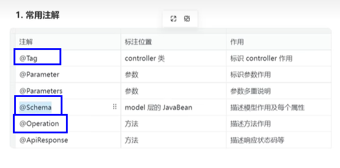

    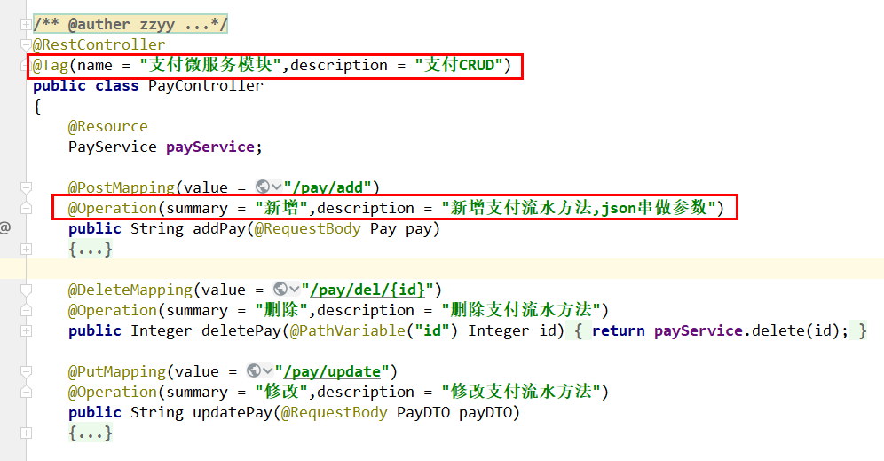

    

    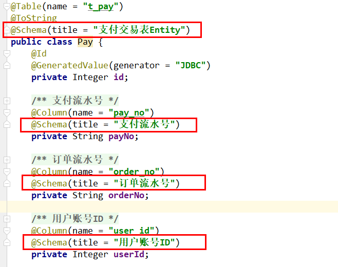

    按照上图内容直接修改即可，但是为了方便使用，直接根据模块将微服务进行整体的 Swagger 配置

    :::details
    ```java
    package com.causes.cloud.config;

    import io.swagger.v3.oas.models.ExternalDocumentation;
    import io.swagger.v3.oas.models.OpenAPI;
    import io.swagger.v3.oas.models.info.Info;
    import org.springdoc.core.models.GroupedOpenApi;
    import org.springframework.context.annotation.Bean;
    import org.springframework.context.annotation.Configuration;

    @Configuration
    public class Swagger3Config {
        @Bean
        public GroupedOpenApi PayApi() {
            return GroupedOpenApi.builder().group("支付微服务模块").pathsToMatch("/pay/**").build();
        }

        @Bean
        public GroupedOpenApi OtherApi() {
            return GroupedOpenApi.builder().group("其它微服务模块").pathsToMatch("/other/**", "/others").build();
        }

        @Bean
        public GroupedOpenApi CustomerApi() {
            return GroupedOpenApi.builder().group("客户微服务模块").pathsToMatch("/customer/**", "/customers").build();
        }

        @Bean
        public OpenAPI docsOpenApi() {
            return new OpenAPI()
                .info(new Info().title("cloud2024")
                    .description("通用设计rest")
                    .version("v1.0"))
                .externalDocs(new ExternalDocumentation()
                    .description("www.causes.site")
                    .url("https://causes.site/"));
        }
    }
    ```
    :::

1. 时间格式统一

    规定格式修改为 `yyyy-MM-dd HH:mm:ss`，有两种方式可以指定

    首先是在类的属性上使用 `@JsonFormat` 注解

    ```java
    @JsonFormat(pattern = "yyyy-MM-dd HH:mm:ss", timezone = "GMT+8")
    private Date createTime;
    ```

    如果是 SpringBoot 项目，可以在 `application.yml` 中指定

    ```yml
    spring:
        jackson:
            date-format: yyyy-MM-dd HH:mm:ss
            time-zone: GMT+8
    ```

1. 统一格式返回

    一个标准的返回数据应当包含: code 状态值、message 描述、data 数据、timestamp 接口调用时间（可选）

    ReturnCode 枚举代表返回状态，对于枚举编写，分别是：举值、构造、遍历

    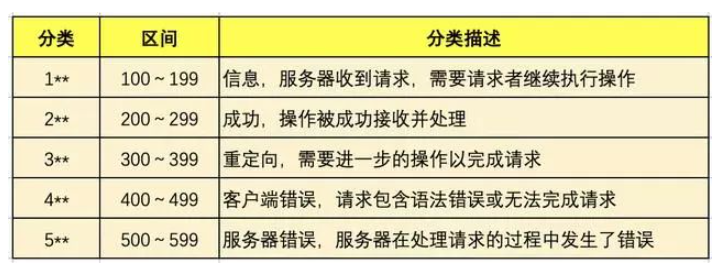

    :::details
    ```java
    package com.causes.cloud.resp;
    
    import lombok.Getter;
    
    import java.util.Arrays;
    
    @Getter
    public enum ReturnCodeEnum {
    
      // 操作失败
      RC999("999", "操作XXX失败"),
      // 操作成功
      RC200("200", "success"),
      // 服务降级
      RC201("201", "服务开启降级保护,请稍后再试!"),
      // 热点参数限流
      RC202("202", "热点参数限流,请稍后再试!"),
      // 系统规则不满足
      RC203("203", "系统规则不满足要求,请稍后再试!"),
      // 授权规则不通过
      RC204("204", "授权规则不通过,请稍后再试!"),
      // access_denied
      RC403("403", "无访问权限,请联系管理员授予权限"),
      // access_denied
      RC401("401", "匿名用户访问无权限资源时的异常"),
      RC404("404", "404页面找不到的异常"),
      // 服务异常
      RC500("500", "系统异常，请稍后重试"),
      RC375("375", "数学运算异常，请稍后重试"),
    
      INVALID_TOKEN("2001", "访问令牌不合法"),
      ACCESS_DENIED("2003", "没有权限访问该资源"),
      CLIENT_AUTHENTICATION_FAILED("1001", "客户端认证失败"),
      USERNAME_OR_PASSWORD_ERROR("1002", "用户名或密码错误"),
      BUSINESS_ERROR("1004", "业务逻辑异常"),
      UNSUPPORTED_GRANT_TYPE("1003", "不支持的认证模式");
    
      private final String code;
      private final String message;
    
      // lombok 生成的构造器有问题，用自己的
      ReturnCodeEnum(String code, String message) {
        this.code = code;
        this.message = message;
      }
    
      // 遍历
      public static ReturnCodeEnum getReturnCodeEnum(String code) {
        return Arrays.stream(ReturnCodeEnum.values())
            .filter(x -> x.getCode().equalsIgnoreCase(code))
            .findFirst()
            .orElse(null);
      }
    }
    ```
    :::

    :::details
    ```java
    package com.causes.cloud.resp;
    
    import lombok.Data;
    import lombok.experimental.Accessors;
    
    @Data
    @Accessors(chain = true)
    public class ResultData<T> {
    
      private String code;
      private String message;
      private T data;
      private Long timestamp;
    
      public ResultData() {
        this.timestamp = System.currentTimeMillis();
      }
    
      public static <T> ResultData<T> success(T data) {
        ResultData<T> resultData = new ResultData<>();
        resultData.setCode(ReturnCodeEnum.RC200.getCode());
        resultData.setMessage(ReturnCodeEnum.RC200.getMessage());
        resultData.setData(data);
        return resultData;
      }
    
      public static <T> ResultData<T> fail(String code, String message) {
        ResultData<T> resultData = new ResultData<>();
        resultData.setCode(code);
        resultData.setMessage(message);
        resultData.setData(null);
        return resultData;
      }
    }
    ```
    :::

1. 统一异常处理

    简单来说，就是不用手写 try-catch，让全局处理器处理。

    ```java
    package com.causes.cloud.handler;
    
    import com.causes.cloud.resp.ResultData;
    import com.causes.cloud.resp.ReturnCodeEnum;
    import lombok.extern.slf4j.Slf4j;
    import org.springframework.http.HttpStatus;
    import org.springframework.web.bind.annotation.ExceptionHandler;
    import org.springframework.web.bind.annotation.ResponseStatus;
    import org.springframework.web.bind.annotation.RestControllerAdvice;
    
    @Slf4j
    @RestControllerAdvice
    public class GlobalExceptionHandler {
    
        @ExceptionHandler(RuntimeException.class)
        @ResponseStatus(HttpStatus.INTERNAL_SERVER_ERROR)
        public ResultData<String> exception(Exception e) {
            log.error("全局异常信息: {}", e.getMessage(), e);
            return ResultData.fail(ReturnCodeEnum.RC500.getCode(), e.getMessage());
        }
    }
    ```

### 微服务调用者模块搭建

1. 新建子模块 `cloud-consumer-order80` 作为微服务调用者模块，也就是消费者服务
1. pom 依赖

    :::details
    ```xml
    <dependencies>
        <!--web + actuator-->
        <dependency>
            <groupId>org.springframework.boot</groupId>
            <artifactId>spring-boot-starter-web</artifactId>
        </dependency>
        <dependency>
            <groupId>org.springframework.boot</groupId>
            <artifactId>spring-boot-starter-actuator</artifactId>
        </dependency>
        <!--lombok-->
        <dependency>
            <groupId>org.projectlombok</groupId>
            <artifactId>lombok</artifactId>
            <optional>true</optional>
        </dependency>
        <!--hutool-all-->
        <dependency>
            <groupId>cn.hutool</groupId>
            <artifactId>hutool-all</artifactId>
        </dependency>
        <!--fastjson2-->
        <dependency>
            <groupId>com.alibaba.fastjson2</groupId>
            <artifactId>fastjson2</artifactId>
        </dependency>
        <!-- swagger3 调用方式 http://你的主机IP地址:5555/swagger-ui/index.html -->
        <dependency>
            <groupId>org.springdoc</groupId>
            <artifactId>springdoc-openapi-starter-webmvc-ui</artifactId>
        </dependency>
    </dependencies>

    <build>
        <plugins>
            <plugin>
                <groupId>org.springframework.boot</groupId>
                <artifactId>spring-boot-maven-plugin</artifactId>
            </plugin>
        </plugins>
    </build>
    ```
    :::

1. `application.yml`

    ```yaml
    server:
    port: 80
    ```

1. 修改启动类

    ```java
    package com.causes.cloud;
    
    import org.springframework.boot.SpringApplication;
    import org.springframework.boot.autoconfigure.SpringBootApplication;
    
    @SpringBootApplication
    public class Main80 {
        public static void main(String[] args) {
            SpringApplication.run(Main80.class, args);
        }
    }
    ```

1. RestTemplate

    如果要实现两个不同的微服务调用，就需要使用 [RestTemplate](https://docs.spring.io/spring-framework/docs/6.0.11/javadoc-api/org/springframework/web/client/RestTemplate.html)

    RestTemplate 提供了多种便捷访问远程Http服务的方法，是一种简单便捷的访问 restful 服务模板类，是 Spring 提供的用于访问 Rest 服务的客户端模板工具集

    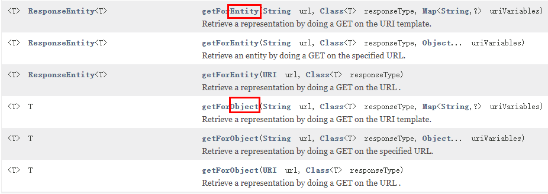

    返回对象为响应体中数据转化成的对象，基本上可以理解为 Json

    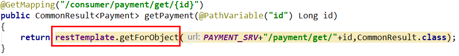

    返回对象为ResponseEntity对象，包含了响应中的一些重要信息，比如响应头、响应状态码、响应体等
    
    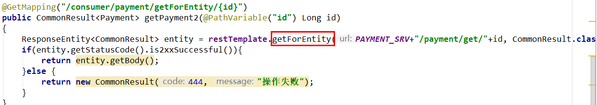

    还有 postForObject/postForEntity

    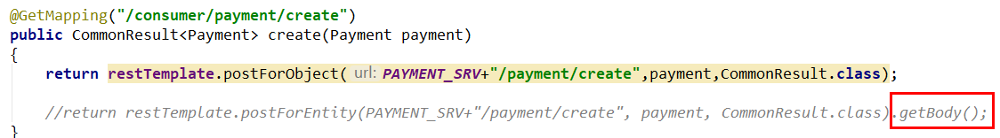

    为了方便和高效，我们使用配置类来让全局使用同一个 bean

    ```java
    package com.causes.cloud.config;
    
    import org.springframework.context.annotation.Bean;
    import org.springframework.context.annotation.Configuration;
    import org.springframework.web.client.RestTemplate;
    
    @Configuration
    public class RestTemplateConfig {

        @Bean
        public RestTemplate restTemplate() {
            return new RestTemplate();
        }
    }
    ```

    编写 controller，使用 RestTemplate

    :::details
    ```java
    package com.causes.cloud.controller;
    
    import com.causes.cloud.entity.PayDTO;
    import com.causes.cloud.resp.ResultData;
    import org.springframework.beans.factory.annotation.Autowired;
    import org.springframework.web.bind.annotation.GetMapping;
    import org.springframework.web.bind.annotation.PathVariable;
    import org.springframework.web.bind.annotation.RestController;
    import org.springframework.web.client.RestTemplate;
    
    @RestController
    public class OrderController {
    
        // 先写死，硬编码
        public static final String PaymentSrv_URL = "http://localhost:8001";
        @Autowired
        private RestTemplate restTemplate;
    
        /**
         * 一般情况下，通过浏览器的地址栏输入 url，发送的只能是 get 请求
         * 我们底层调用的是 post 方法，模拟消费者发送 get 请求，客户端消费者
         * 参数可以不添加 @RequestBody
         */
        @GetMapping("/consumer/pay/add")
        public ResultData addOrder(PayDTO payDTO) {
            return restTemplate.postForObject(PaymentSrv_URL + "/pay/add", payDTO, ResultData.class);
        }
    
        // 删除 + 修改操作作为家庭作业
        @GetMapping("/consumer/pay/get/{id}")
        public ResultData getPayInfo(@PathVariable("id") Integer id) {
            return restTemplate.getForObject(PaymentSrv_URL + "/pay/get/" + id, ResultData.class, id);
        }
    }
    ```
    :::

1. 工程重构

    将 DTO 和 Result 等两个项目的代码提取出来为一个新模块 `cloud-api-common`，用于对外暴露通用的组件、API、工具类等

    修改 pom

    ```xml
   <dependencies>
        <!--SpringBoot通用依赖模块-->
        <dependency>
            <groupId>org.springframework.boot</groupId>
            <artifactId>spring-boot-starter-web</artifactId>
        </dependency>
        <dependency>
            <groupId>org.springframework.boot</groupId>
            <artifactId>spring-boot-starter-actuator</artifactId>
        </dependency>
        <dependency>
            <groupId>org.projectlombok</groupId>
            <artifactId>lombok</artifactId>
            <optional>true</optional>
        </dependency>
        <!--hutool-->
        <dependency>
            <groupId>cn.hutool</groupId>
            <artifactId>hutool-all</artifactId>
        </dependency>
    </dependencies>
    ```

    将重复的实体类、统一返回加到公共空间中，然后在 common 模块下进行 `mvn clean`、`mvn install` 打为一个公共 jar

    之后其他两个模块引入本 common 模块

    ```xml
    <!-- 引入自己定义的api通用包 -->
    <dependency>
        <groupId>com.causes.cloud</groupId>
        <artifactId>cloud-api-common</artifactId>
        <version>1.0-SNAPSHOT</version>
    </dependency>
    ```