## consul

### 简介、环境搭建

之前服务注册中心使用的是 Eureka，当前已经停止更新了，取而代之的是 Consul 和 Alibaba Nacos。

并且 Eureka 其实作为服务注册中心是有点奇怪的，它本身作为一个微服务，但是他又要求其他微服务耦合进去，所以很奇怪。

[Consul](https://www.consul.io) 可以做服务发现、配置管理，主要功能有：

- 服务发现：提供 HTTP、DNS 两种发现方式
- 健康监测：支持多种方式，包括 HTTP、TCP、Docker、Shell
- KV 存储：Key、Value 存储方式
- 多数据中心：Consul 支持多数据中心
- 可视化 WEB 界面

1. 直接下载 [Consul](https://releases.hashicorp.com/consul/1.17.0/consul_1.17.0_windows_386.zip)

1. 解压到对应路径，并且查看版本

    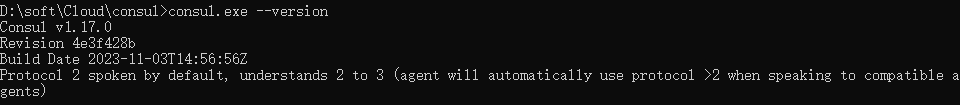

1. 之后直接使用开发者模式启动: `consul agent -dev`，启动后[地址](http://localhost:8500)

    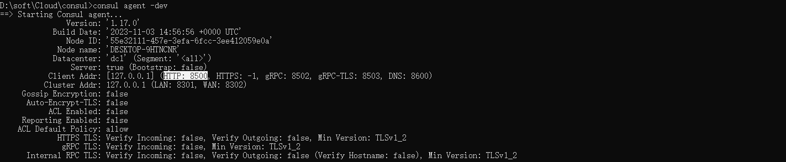

### 注册中心的异同点

注册中心的异同，主要是从三个方面考虑：CAP，即：

- C: Consistency（强一致性）
- A: Availability（可用性）
- P: Partition tolerance（分区容错性）

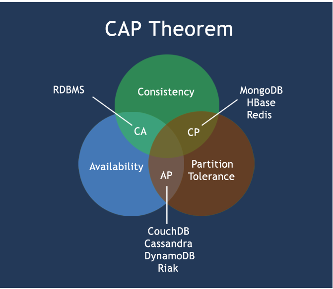

CAP理论的核心是：一个分布式系统不可能同时很好的满足一致性，可用性和分区容错性这三个需求

因此，根据 CAP 原理将 NoSQL 数据库分成了满足 CA 原则、满足 CP 原则和满足 AP 原则三大类：

- CA - 单点集群，满足一致性，可用性的系统，通常在可扩展性上不太强大
- CP - 满足一致性，分区容忍性的系统，通常性能不是特别高

    当网络分区出现后，为了保证一致性，就必须拒接请求，否则无法保证一致性
    
    Consoul 使用 CP 原则保证了强一致性和分区容错性，且使用的是 Raft 算法，比 zookeeper 使用的 Paxos 算法更加简单
    
    虽然保证了强一致性，但是可用性就相应下降了，例如服务注册的时间会稍长一些
    
    因为 Consul 的 raft 协议要求必须过半数的节点都写入成功才认为注册成功
    
    在 leader 挂掉了之后，重新选举出 leader 之前会导致 Consul 服务不可用
    
    结论：违背了可用性 A 的要求，只满足一致性和分区容错，即 CP

    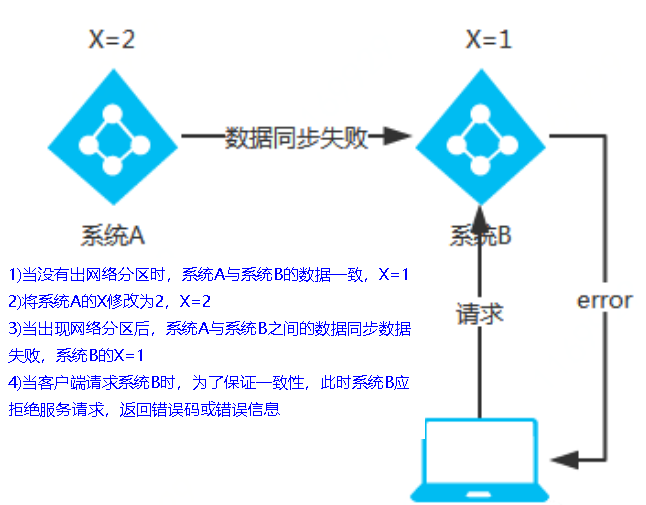

- AP - 满足可用性，分区容忍性的系统，通常可能对一致性要求低一些

    当网络分区出现后，为了保证可用性，系统 B 可以返回旧值，保证系统的可用性

    当数据出现不一致时，虽然 A、B 上的注册信息不完全相同，但每个节点依然能够正常对外提供服务
    
    Eureka 就使用了这种方式，这会出现查询服务信息时如果请求 A 查不到，但请求 B 就能查到
    
    如此保证了可用性但牺牲了一致性结论：违背了一致性C的要求，只满足可用性和分区容错，即 AP

    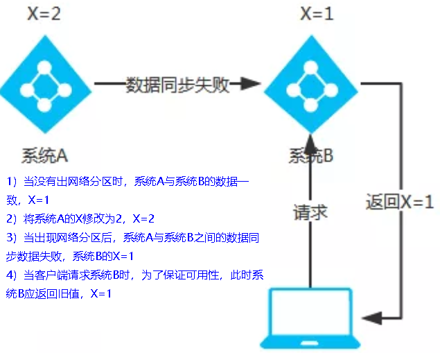

### 服务注册与发现

1. `cloud-provider-payment8001` 服务提供者模块增加依赖

    ```xml
    <!--SpringCloud consul discovery -->
    <dependency>
        <groupId>org.springframework.cloud</groupId>
        <artifactId>spring-cloud-starter-consul-discovery</artifactId>
    </dependency>
    ```

    ```yaml
    spring:
      # Spring Cloud Consul for Service Discovery
      cloud:
        consul:
          host: localhost
          port: 8500
          discovery:
            service-name: ${spring.application.name}
    ```

    之后在主启动类中增加注解 `@EnableDiscoveryClient` 激活服务发现功能

    重新启动服务提供者，可以看到已经注册到了 Consul

    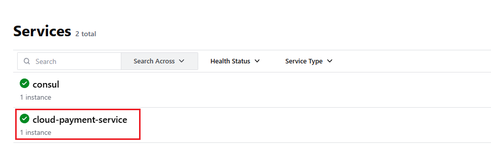

1. `cloud-consumer-order80` 服务消费者模块增加依赖

    ```xml
    <!--SpringCloud consul discovery -->
    <dependency>
        <groupId>org.springframework.cloud</groupId>
        <artifactId>spring-cloud-starter-consul-discovery</artifactId>
    </dependency>
    ```

    ```yaml
    spring:
      application:
        name: cloud-consumer-order
      ####Spring Cloud Consul for Service Discovery
      cloud:
        consul:
          host: localhost
          port: 8500
          discovery:
            #优先使用服务ip进行注册
            prefer-ip-address: true
            service-name: ${spring.application.name}
    ```

    主启动类中添加注解 `@EnableDiscoveryClient`

    controller 中，硬编码的 `http://localhost:8001` 改为使用 Consol 中服务注册的名称 `cloud-payment-service`，即 `http://cloud-payment-service`，这样解决了硬编码问题

    启动，发现已经注册成功了

    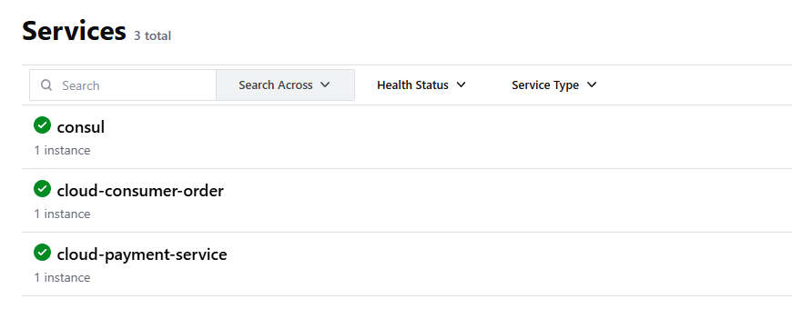

    尝试调用 controller 之后，发现出现报错，这是因为我们的 Consul 天生支持负载均衡，所以调用的时候它不知道具体需要找哪一个微服务，所以需要再加上一个负载均衡的配置，也就是在 RestTemplate 上加一个 `@LoadBalanced`

    我们的 RestTemplate 都是用的同一个，所以在 bean 中加上即可

    ```java
    @Configuration
    public class RestTemplateConfig {
    
        @Bean
        @LoadBalanced
        public RestTemplate restTemplate() {
            return new RestTemplate();
        }
    }
    ```

    加上之后重启 tomcat 后再次访问成功。

### 服务配置与刷新

微服务意味着每一个服务都需要进行配置，但如果像传统服务一样每一个服务都需要一个 `application.yaml` 那将是一个管理的灾难。

所以可以使用 Consol 的 KV 功能，同时配合定义的[配置文件](https://docs.spring.io/spring-cloud-consul/docs/4.0.4/reference/html/#spring-cloud-consul-config-format)来获取配置信息

1. 修改 `cloud-provider-payment8001`，服务提供者增加 pom 依赖

    ```xml
    <!--SpringCloud consul config-->
    <dependency>
        <groupId>org.springframework.cloud</groupId>
        <artifactId>spring-cloud-starter-consul-config</artifactId>
    </dependency>
    <dependency>
        <groupId>org.springframework.cloud</groupId>
        <artifactId>spring-cloud-starter-bootstrap</artifactId>
    </dependency>
    ```

1. 创建 `bootstrap.yml`

    从官网上看，如果要使用则需要设置 `bootstrap.yml` 来代替 `application.yml`，本次我们主要修改 `cloud-provider-payment8001` 模块作为案例

    但是虽然说是 `bootstrap.yml` 可以替代，但是一般来说我们可将通用配置放到 `bootstrap.yml` 中，将特殊配置放到 `application.yaml` 中

    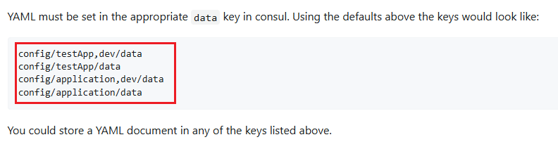

    注意，上图中的 `config/testApp,dev/data`，其中的逗号指的是文件所在路径使用逗号，对于国人而言有点太超前了
    
    所以我们之后在配置文件中使用后面的 `spring.cloud.consul.config.profile-separator` 修改文件路径（环境分隔符），改为 `-`，这样在创建文件夹（不同环境）就会是 `xxx-xx` 的形式

    创建 `bootstrap.yml`

    ```yaml
    spring:
      application:
        name: cloud-payment-service
      ####Spring Cloud Consul for Service Discovery
      cloud:
        consul:
          host: localhost
          port: 8500
          discovery:
            service-name: ${spring.application.name}
          config:
            # default value is ","，we update '-'
            profile-separator: '-'
            format: YAML
    ```

    修改 `application.yaml`，删除了 consul 中的内容，增加了 `spring.profiles.active: dev`，这代表我们使用的环境是 dev，也就代表着我们将会在 consul 中创建一个 dev 的文件夹作为环境

    ```yaml
    server:
      port: 8001
    
    # ==========applicationName + druid-mysql8 driver===================
    spring:
      application:
        name: cloud-payment-service
      jackson:
        date-format: yyyy-MM-dd HH:mm:ss
        time-zone: GMT+8
      datasource:
        type: com.alibaba.druid.pool.DruidDataSource
        driver-class-name: com.mysql.jdbc.Driver
        url: jdbc:mysql://hadoop101:3306/db2024?useUnicode=true&characterEncoding=UTF-8&useSSL=false
        username: root
        password: root
      profiles:
        active: dev
    # ========================mybatis===================
    mybatis:
      mapper-locations: classpath:mapper/*.xml
      type-aliases-package: com.causes.cloud.entities
      configuration:
        map-underscore-to-camel-case: true
    ```

1. 在 consul 中增加对应的配置信息

    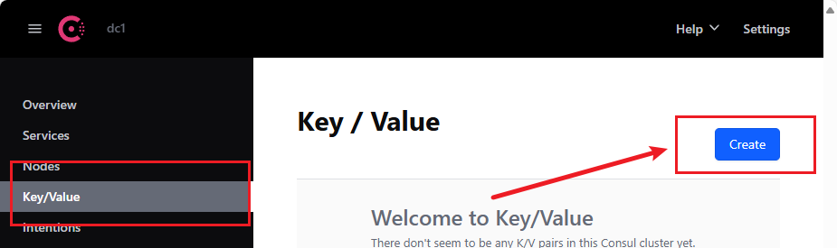

    新建文件夹和文件，其中三个目录中，dev 代表开发、prod 代表生产、啥也不带就是默认

    ```
    config/cloud-payment-service/data
    config/cloud-payment-service-dev/data
    config/cloud-payment-service-prod/data
    ```

    三个文件夹下面分别有三个 data 文件，其中分别是

    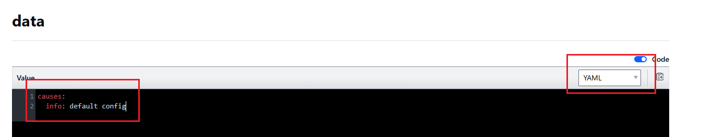

    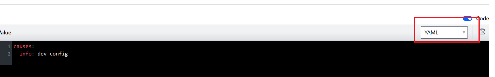

    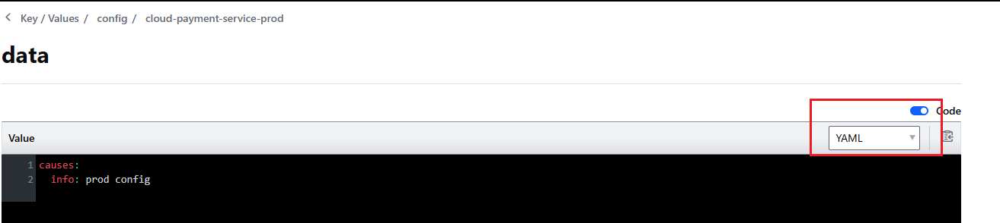

1. 修改 controller

    ```java
    @Value("${server.port}")
    private String port;

    @GetMapping(value = "/pay/get/info")
    private String getInfoByConsul(@Value("${causes.info}") String info) {
        return String.format("info: %s, port: %s", info, port);
    }
    ```

    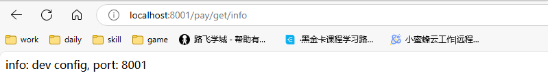

1. 动态刷新

    动态刷新的意思是，在项目运行的过程中修改 consul 中的配置文件，会不会随着修改而进行动态调整，结果并不会

    要进行动态调整的方式也很简单，直接在启动类中加上 `@RefreshScope` 即可

    动态刷新时间默认为 `55s`，可以通过 `spring.cloud.consul.config.watch.wait-time` 调整，生产按需即可

    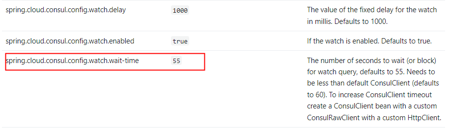

### consul 配置持久化

虽然建立了多个环境和配置，但是这些配置会随着 consul 服务的重启而消失，为了保证容错必须进行持久化配置

我们可以通过命令 `consul agent -server -data-dir xxx` 指定文件路径

但是为了方便，通过下列 `consul_start.bat` 脚本将 consul 配置为 windows 服务，每次开机的时候自动启动 consul，同时实现了持久化服务，一举多得

打开时使用**管理员权限**

```bat
@echo.服务启动......  
@echo off  
@sc create Consul binpath= "D:\soft\Cloud\consul\consul.exe agent -server -ui -bind=127.0.0.1 -client=0.0.0.0 -bootstrap-expect  1  -data-dir D:\soft\Cloud\consul\mydata"
@net start Consul
@sc config Consul start= AUTO  
@echo.Consul start is OK......success
@pause
```
