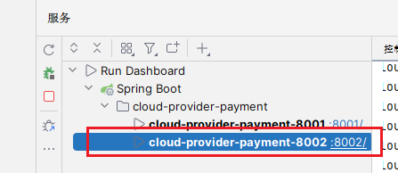
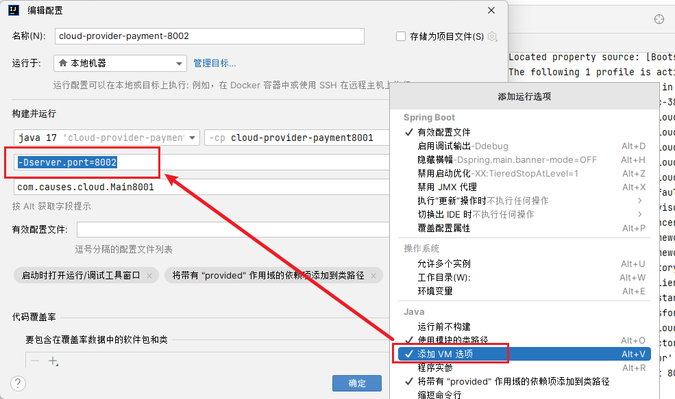
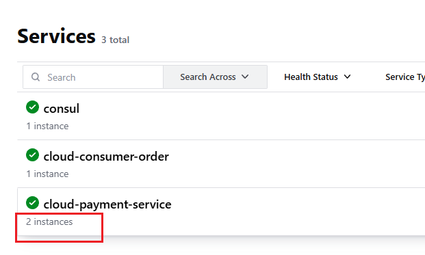
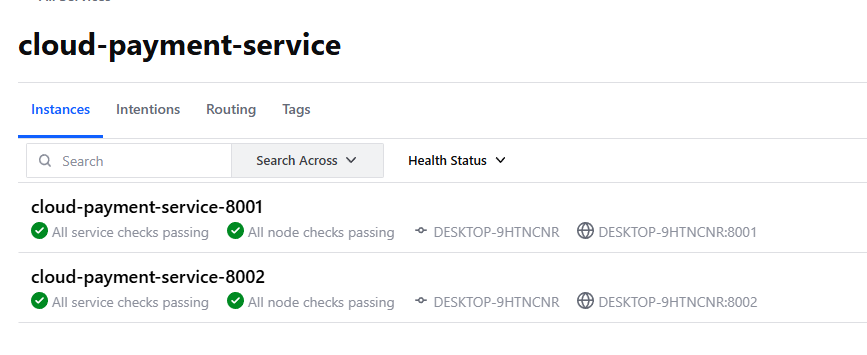
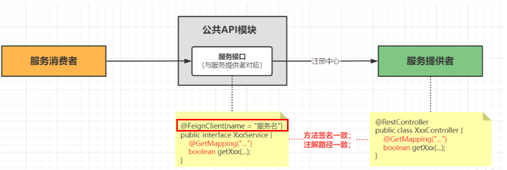
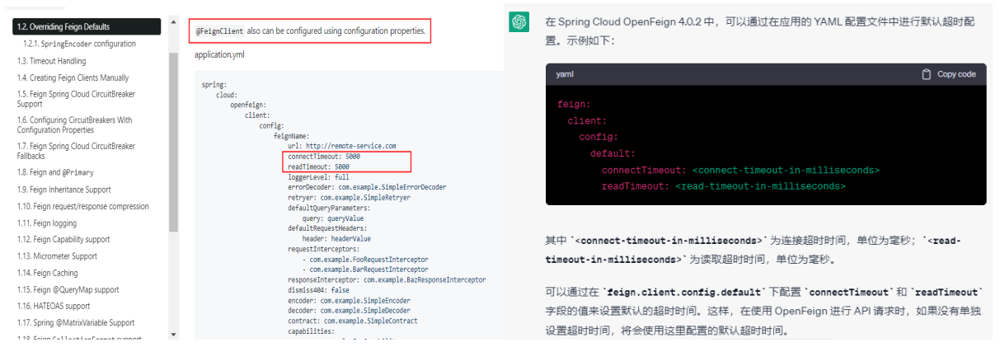
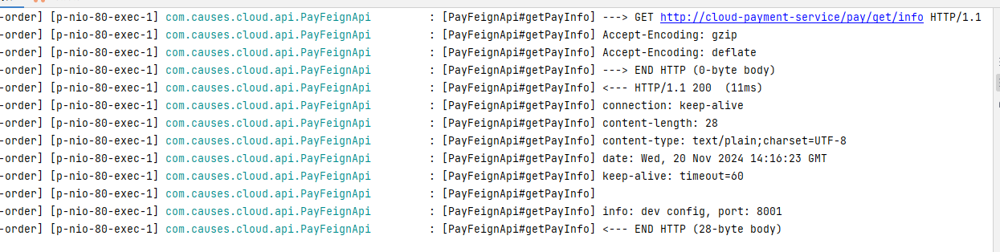

## LoadBalancer

### 简介

[LoadBalancer](https://docs.spring.io/spring-cloud-commons/reference/spring-cloud-commons/loadbalancer.html) 包含在 Spring Cloud Commons 模块下，最重要的功能就是负载均衡

简单的说就是将用户的请求平摊的分配到多个服务上，从而达到系统的 HA（高可用），常见的负载均衡有软件 Nginx，LVS，硬件 F5 等

- 客户端负载均衡

    简单来说，在调用微服务接口时候，会在注册中心上获取注册信息服务列表之后缓存到 JVM 本地，从而在本地实现 RPC 远程服务调用技术
    
    即不经过服务器转发直接调用对应的接口

    现在已经停运的 Ribbon 和替代它的 LoadBalancer 就是客户端负载均衡

- 服务端负载均衡

    简单来说，客户端所有请求都会交给服务端，然后实现转发请求，即负载均衡是由服务端实现的

    Nginx 就是服务端负载均衡

### 环境搭建

1. 首先为了方便使用，我们复制两个 spring boot 启动类，并且修改端口号，即直接复制 spring service 即可，在 vm 参数上添加端口号 `-Dserver.port=8002`

    

    

    

    

1. 在订单模块增加 loadBalancer 组件

    因为 loadBalancer 是客户端负载均衡，所以当然要在订单模块 `cloud-consumer-order80`

    ```xml
    <!--loadbalancer-->
    <dependency>
        <groupId>org.springframework.cloud</groupId>
        <artifactId>spring-cloud-starter-loadbalancer</artifactId>
    </dependency>
    ```

1. 修改订单模块 controller

    ```java
    @GetMapping("/consumer/pay/get/info")
    public String getInfoByConsul() {
        return restTemplate.getForObject(String.format("%s/pay/get/info", PaymentSrv_URL), String.class);
    }
    ```

1. 订单模块下 RestTemplate

    之前在使用 RestTemplate 中调用服务提供者的时候已经加上了一个 `@LoadBalanced` 注解，此时就要发挥作用

    ```java
    @Configuration
    public class RestTemplateConfig {
    
        @Bean
        @LoadBalanced
        public RestTemplate restTemplate() {
            return new RestTemplate();
        }
    }
    ```

1. `cloud-provider-payment-8001` 模块修改 controller，打印出 port

    ```java
    @Value("${server.port}")
    private String port;

    @GetMapping(value = "/pay/get/info")
    private String getInfoByConsul(@Value("${causes.info}") String info) {
        return String.format("info: %s, port: %s", info, port);
    }
    ```
    
    每次调用 `http://localhost:80/consumer/pay/get/info` 即可看到 dev 模块修改了

### LoadBalancer 算法

1. 内置算法

    LoadBalancer 默认的算法是轮询 RoundRobin
    
    另外还带有一个算法是随机 `RandomLoadBalancer`，做切换需要修改 RestTemplate：

    :::details
    ```java
    package com.causes.cloud.config;
    
    import org.springframework.cloud.client.ServiceInstance;
    import org.springframework.cloud.client.loadbalancer.LoadBalanced;
    import org.springframework.cloud.loadbalancer.core.RandomLoadBalancer;
    import org.springframework.cloud.loadbalancer.core.ReactorLoadBalancer;
    import org.springframework.cloud.loadbalancer.core.ServiceInstanceListSupplier;
    import org.springframework.cloud.loadbalancer.support.LoadBalancerClientFactory;
    import org.springframework.context.annotation.Bean;
    import org.springframework.context.annotation.Configuration;
    import org.springframework.core.env.Environment;
    import org.springframework.web.client.RestTemplate;
    
    @Configuration
    public class RestTemplateConfig {
    
        @Bean
        @LoadBalanced
        public RestTemplate restTemplate() {
            return new RestTemplate();
        }
    
        @Bean
        ReactorLoadBalancer<ServiceInstance> randomLoadBalancer(Environment environment, LoadBalancerClientFactory loadBalancerClientFactory) {
            String name = environment.getProperty(LoadBalancerClientFactory.PROPERTY_NAME);
            return new RandomLoadBalancer(loadBalancerClientFactory.getLazyProvider(name, ServiceInstanceListSupplier.class), name);
        }
    
    }
    ```
    :::

1. 自定义算法

    LoadBalancer 可以自定义自己的算法，只需要继承接口 ReactiveLoadBalancer 即可修改

## Feign

### 简介

[Feign](https://spring.io/projects/spring-cloud-openfeign) 其实和 LoadBalancer 类似，只不过 Feign 内置了 LoadBalancer，并且提供了更多的功能。

一般情况下，如果在调用外部的接口，我们只能用 LoadBalancer，通过 RestTemplate 来调用。

但是如果接口在我们内置的服务注册与发现中心，那么其实就可以根据 Feign 来直接通过接口调用，而不必再苦哈哈地拼接 URL 地址了。

OpenFeign 基本上就是当前微服务之间调用的事实标准。它有可插拔的注解、可插拔的 HTTP 编码解码器、支持 Alibaba Sentinel、支持 Spring Cloud Balancer、支持 HTTP 请求和响应的压缩。

之前的 LoadBalancer 的步骤是首先在客户端加上注解，然后写一个 RestTemplate 的 Bean，然后写一串服务端的网址。

这样写的坏处是，假如有多个客户端都需要调用服务端的接口，那么就需要维护多个 RestTemplate 中的地址，十分复杂。

但是现在通过 Feign，可以将这些内容写在公共部分，客户端直接调用公共部分的接口就可以直接调用接口。



### 快速开始

1. 修改 `cloud-api-commons`

    引入 openfeign 依赖

    ```xml
    <!-- openfeign -->
    <dependency>
        <groupId>org.springframework.cloud</groupId>
        <artifactId>spring-cloud-starter-openfeign</artifactId>
    </dependency>
    ```

    新建服务接口 PayFeignApi，同时配置注解 `@FeignClient("cloud-payment-service")`，同时将消费端 RestTemplate 中 controller 迁移到 `cloud-api-commons` 模块中

    `@FeignClient("cloud-payment-service")` 这里的值就是 consul 中的注册名称

    :::details
    ```java
    package com.causes.cloud.api;
    
    import com.causes.cloud.entities.PayDTO;
    import com.causes.cloud.resp.ResultData;
    import org.springframework.cloud.openfeign.FeignClient;
    import org.springframework.web.bind.annotation.GetMapping;
    import org.springframework.web.bind.annotation.PathVariable;
    import org.springframework.web.bind.annotation.PostMapping;
    import org.springframework.web.bind.annotation.RequestBody;
    
    @FeignClient("cloud-payment-service")
    public interface PayFeignApi {
    
        @PostMapping("/pay/add")
        public ResultData addPay(@RequestBody PayDTO payDTO);
    
        @GetMapping("/pay/get/{id}")
        ResultData getPayDTO(@PathVariable("id") Integer id);
    
        @GetMapping(value = "/pay/get/info")
        String getPayInfo();
    }
    ```
    :::

    重新 mvn clean、mvn install


1. 修改客户端

    在客户端引入 openFeign 的依赖（删掉 LoadBalancer 的即可）

    ```xml
    <!--openfeign-->
    <dependency>
        <groupId>org.springframework.cloud</groupId>
        <artifactId>spring-cloud-starter-openfeign</artifactId>
    </dependency>
    ```

    主启动类上增加注解 `@EnableFeignClients` 表示开启 OpenFeign

    修改 controller，删掉原有的 ResultTemplate、LoadBalancer 的所有无关内容即可

    ```java
    package com.causes.cloud.controller;
    
    import com.causes.cloud.api.PayFeignApi;
    import com.causes.cloud.entities.PayDTO;
    import com.causes.cloud.resp.ResultData;
    import jakarta.annotation.Resource;
    import org.springframework.web.bind.annotation.GetMapping;
    import org.springframework.web.bind.annotation.PathVariable;
    import org.springframework.web.bind.annotation.RestController;
    
    @RestController
    public class OrderController {
    
        @Resource
        private PayFeignApi payFeignApi;
    
        @GetMapping("/consumer/pay/add")
        public ResultData addOrder(PayDTO payDTO) {
            return payFeignApi.addPay(payDTO);
        }
    
        // 删除 + 修改操作作为家庭作业
        @GetMapping("/consumer/pay/get/{id}")
        public ResultData getPayInfo(@PathVariable("id") Integer id) {
            return payFeignApi.getPayDTO(id);
        }
    
        @GetMapping("/consumer/pay/get/info")
        public String getInfoByConsul() {
            return payFeignApi.getPayInfo();
        }
    }
    ```

    调用 `http://localhost/consumer/pay/get/info`，成功

### 超时控制、重试机制

1. 超时控制

    OpenFeign 除了以上内容外，还支持超时控制，也就是规定一个时间，超过这个时间还没有反应就直接报错，另外还有重试次数。

    

    默认的等待时间为 `60s`，我们可以在客户端模块 `cloud-consumer-order80` 通过 yaml 环境配置来配置

    :::detail
    ```yaml
    server:
    port: 80
    spring:
    application:
        name: cloud-consumer-order
    cloud:
        openfeign:
        client:
            config:
            # 如果不设置，那么默认设置为下面的时间
            default:
                # 连接超时时间
                connect-timeout: 8000
                # 请求处理超时时间
                read-timeout: 8000
            # 可以给 consul 的服务单独设置超时时间
            cloud-payment-service:
                connect-timeout: 4000
                read-timeout: 4000
    ```
    :::

1. 重试机制

    当经历了上面的超时之后，默认直接返回 False，但是 HTTP 连接一次不容易，如果就这么断开就有点浪费，可以配置一下重试机制

    重试机制默认关闭，可以通过配置类打开，在客户端直接建立一个 Config 配置 `FeignConfig`

    ```java
    package com.causes.cloud.config;
    
    import feign.Retryer;
    import org.springframework.context.annotation.Bean;
    import org.springframework.context.annotation.Configuration;
    
    @Configuration
    public class FeignConfig {
    
        @Bean
        public Retryer retryer() {
            /*
                默认情况下，Feign 配置为不走重试机制 return Retryer.NEVER_RETRY;
                配置为最大请求次数 3，包括一次请求 + 失败后的两次重试。设置初始重试间隔时间为 100ms，最大重试间隔为 1000ms
                从源码来看，每次重试之后增加 1.5 倍的时间，直到到达最大重试时间
             */
            return new Retryer.Default(100, 1000, 3);
        }
    }
    ```

### 默认 HTTPClient 修改

OpenFeign 默认使用的是 JDK 的 HTTPURLConnection 发送 HTTP 请求，但是由于它没有连接池，效率比较低，所以性能不好。

OpenFeign 存在更换 HTTPClient 的能力，我们使用 Apache HttpClient5 来代替原生的 JDK 请求。

1. 在客户端 `cloud-consumer-openfeign-order` 中增加依赖

    ```xml
    <!-- httpclient5-->
    <dependency>
        <groupId>org.apache.httpcomponents.client5</groupId>
        <artifactId>httpclient5</artifactId>
        <version>5.3</version>
    </dependency>
    <!-- feign-hc5-->
    <dependency>
        <groupId>io.github.openfeign</groupId>
        <artifactId>feign-hc5</artifactId>
        <version>13.1</version>
    </dependency>
    ```

1. yaml 配置开启

    ```yaml
    # Apache HttpClient5 配置开启
    spring:
      application:
        name: cloud-consumer-order
      cloud:
        openfeign:
          httpclient:
            hc5:
              enabled: true
    ```

### 请求、响应压缩

Spring Cloud OpenFeign 支持对请求和响应进行 GZIP 压缩，以减少通信过程中的性能损耗

通过下面的两个参数设置，就能开启请求与相应的压缩功能：

- `spring.cloud.openfeign.compression.request.enabled=true`
- `spring.cloud.openfeign.compression.response.enabled=true`

对请求压缩做一些更细致的设置，比如下面的配置内容指定压缩的请求数据类型并设置了请求压缩的大小下限，只有超过这个大小的请求才会进行压缩：

- `spring.cloud.openfeign.compression.request.enabled=true`
- `spring.cloud.openfeign.compression.request.mime-types=text/xml,application/xml,application/json`: 触发压缩数据类型
- `spring.cloud.openfeign.compression.request.min-request-size=2048`: 最小触发压缩的大小

```yaml
spring:
  cloud:
    openfeign:
      compression:
        request:
          enabled: true
          # 最小出发压缩大小
          min-request-size: 2048
          mime-types: text/xml,application/xml,application/json
        response:
          enabled: true
```

### 日志打印

Feign 提供了日志打印功能，我们可以通过配置来调整日志级别，从而了解 Feign 中 Http 请求的细节，说白了就是对Feign接口的调用情况进行监控和输出

Feign 中提供了以下四种级别：

- NONE：默认的，不显示任何日志
- BASIC：仅记录请求方法、URL、响应状态码及执行时间
- HEADERS：除了 BASIC 中定义的信息之外，还有请求和响应的头信息
- FULL：除了 HEADERS 中定义的信息之外，还有请求和响应的正文及元数据

1. 客户端配置日志级别 Config

    ```java
    package com.causes.cloud.config;

    import feign.Logger;
    import feign.Retryer;
    import org.springframework.context.annotation.Bean;
    import org.springframework.context.annotation.Configuration;

    @Configuration
    public class FeignConfig {

        @Bean
        public Retryer retryer() {
            /*
                默认情况下，Feign 配置为不走重试机制 return Retryer.NEVER_RETRY;
                配置为最大请求次数 3，包括一次请求 + 失败后的两次重试。设置初始重试间隔时间为 100ms，最大重试间隔为 1000ms
                从源码来看，每次重试之后增加 1.5 倍的时间，直到到达最大重试时间
            */
            // new Retryer.Default(100, 1000, 3);
            return Retryer.NEVER_RETRY;
        }

        // 配置日志级别为 FULL
        @Bean
        Logger.Level feignLoggerLevel() {
            return Logger.Level.FULL;
        }
    }
    ```

1. yaml 文件中配置 DEBUG，开启打印功能，这里的 `causes.cloud.api.PayFeignApi` 是官方要求的配置

    `logging.level + 含有@FeignClient注解的完整带包名的接口名+debug` 就是暴露出来的公共方法

    ```yaml
    logging:
      level:
        com:
          causes:
            cloud:
              api:
                PayFeignApi: debug
    ```

    调用接口，发现可以看到配置，其中还带有我们配置的 HTTP 压缩 `Accept-Encoding: gzip`

    