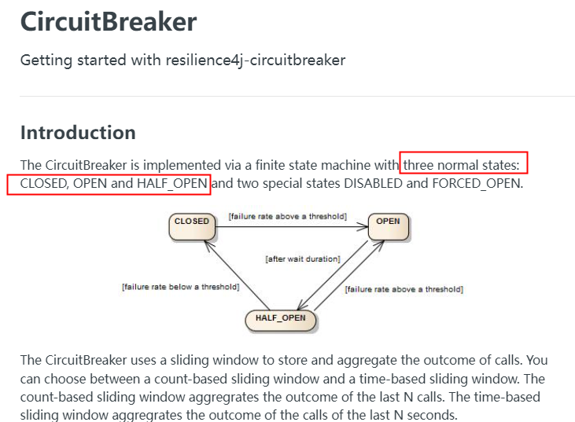
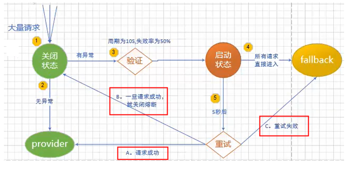
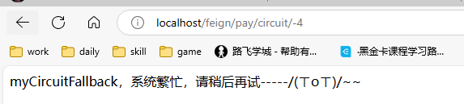
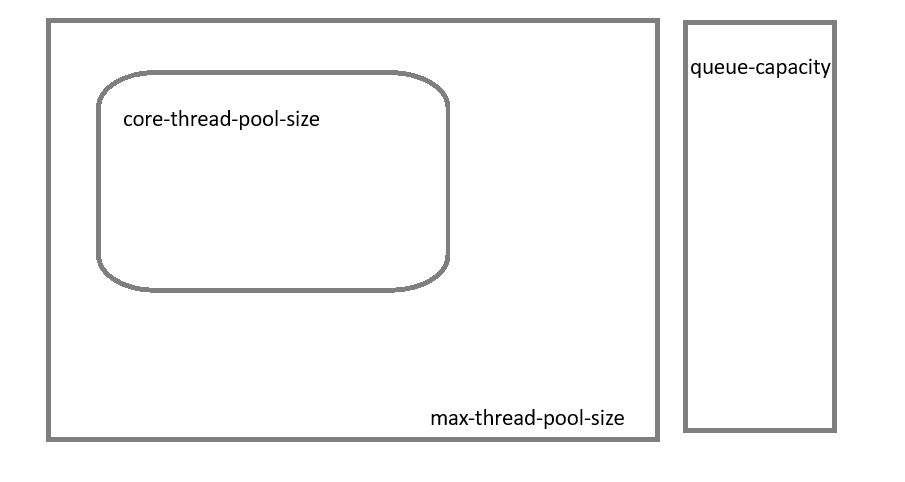
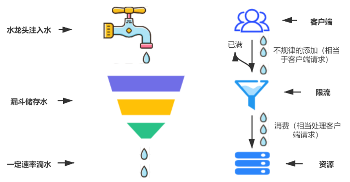
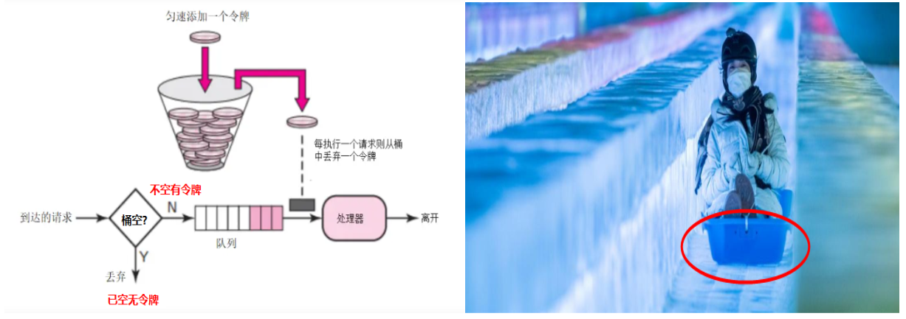
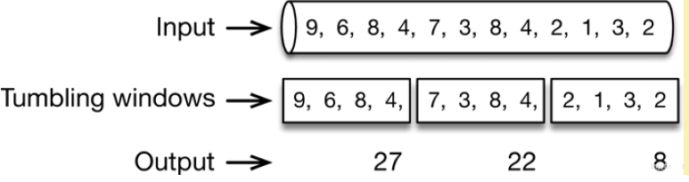
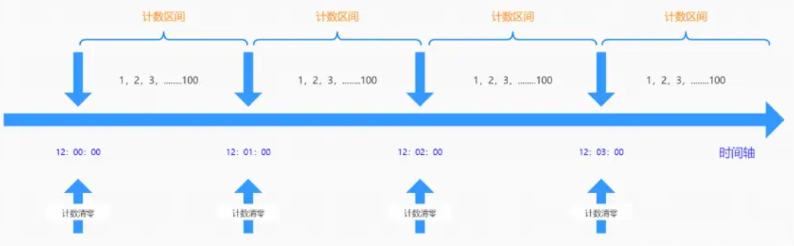
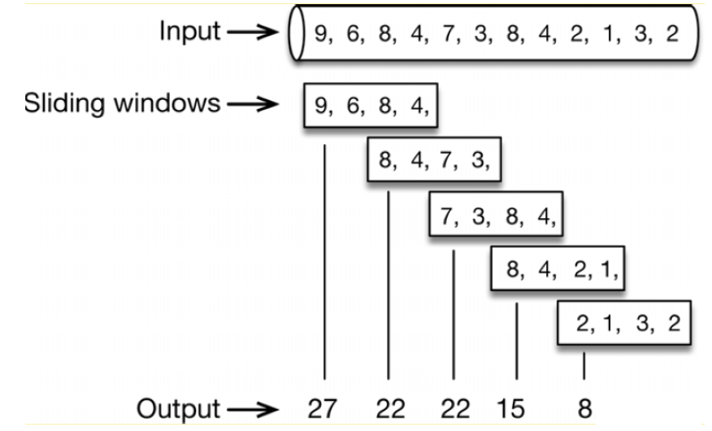

## 简介

在超高并发请求下，一个服务崩溃了，但是这个服务如果调用了其他服务，那么这些并发很有可能打到其他服务中去，这样就可能导致级崩溃。

服务熔断和服务降级可以在分布式系统单个微服务故障的情况下，及时采取措施，不会导致整体任务失败，避免级联故障。

服务熔断可以在某个服务出现故障时，及时切换到备用服务或者提供友好的错误页面，避免整个系统因为某个微服务的不可用而崩溃。

服务降级可以临时关闭一些非核心的功能，比如活动推荐、个性化推荐等，以确保网站的下单、支付等核心功能可以正常运行，保证用户购物体验。

服务熔断在之前有 Hystrix 豪猪，但是当前已经停更不维护了。

---

Spring Cloud 未来将会用 [Circuit Breaker](https://spring.io/projects/spring-cloud-circuitbreaker) 来替代 Hystrix。

或者说，Circuit Breaker 只是一个抽象的概念，Resilience4j 是它的其中一个实现方式，另外还有一个实现方式是 Retry。

## 熔断 Circuit Breaker

Resilience4j 提供了熔断器的功能。

Circuit Breaker 在检测到某一个组件或者服务出现故障后，快速转到 OPEN 状态（类似保险丝），阻止请求发送到这个组件或者服务，这样就可以避免更大的负载，而且也可以避免系统大面积崩溃。

之后过了一定的等待时间，Circuit Breaker 会转到 HALF OPEN 模式，放一两个请求查看服务是否能用了，假如能使用则 ClOSE 令服务正常提供服务，若不能使用则继续 OPEN 状态。





### 参数配置说明

- sliding-window-type 

    断路器的滑动窗口期类型
    
    可以基于次数（COUNT_BASED）或者时间（TIME_BASED）进行熔断，默认是 COUNT_BASED

- sliding-window-size

    若为 COUNT_BASED，此数字指定的调用次数中有 failure-rate-threshold 失败则打开熔断断路器

    若为 TIME_BASED，除了 failure-rate-threshold 作用之外还有额外的两个设置属性，含义为：在此值指定的秒内慢调用（slow-call-duration-threshold）超过设置的百分比（slow-call-rate-threshold）则进行服务降级。

- failure-rate-threshold

    以百分比配置失败率峰值

- minimum-number-of-calls

    断路器计算失败率或慢调用率之前所需的最小样本

    此时设置为 6 则代表必须最少记录 6 个请求，然后才能计算失败率，如果小于设置的值，即使之前全都失败也不会熔断

- slow-call-duration-threshold

    配置调用时间的峰值，断路器把调用时间大于该峰值的视为慢调用

- slow-call-rate-threshold

    以百分比的方式配置，若慢调用的比例高于此值则进入服务降级

- permitted-number-of-calls-in-half-open-state

    运行断路器在 HALF_OPEN 状态下时进行 N 次调用，如果故障或慢速调用仍然高于阈值，断路器再次进入打开状态

### COUNT_BASED 配置

1. 修改 pom

    既然是服务熔断，服务熔断是为了防止将请求打到服务器的，那么肯定是放在客户端来修改，即 `cloud-consumer-order80`

    ```xml
    <!--resilience4j-circuitbreaker-->
    <dependency>
        <groupId>org.springframework.cloud</groupId>
        <artifactId>spring-cloud-starter-circuitbreaker-resilience4j</artifactId>
    </dependency>
    <!-- 由于断路保护等需要AOP实现，所以必须导入AOP包 -->
    <dependency>
        <groupId>org.springframework.boot</groupId>
        <artifactId>spring-boot-starter-aop</artifactId>
    </dependency>   
    ```

1. 修改 yaml

    :::details
    ```yaml
    spring:
      cloud:
        openfeign:
          # 开启 circuitbreaker 和分组激活 spring.cloud.openfeign.circuitbreaker.enabled
          circuitbreaker:
            enabled: true
            # 默认为不开启分组且策略为精确优先
            # 若开启分组，则首先使用精确优先，其次使用 default 配置
            # 精确优先：如果某个服务有精确的熔断器配置，则这些精确的配置优先与其他配置被应用
            group:
              enabled: true
    resilience4j:
      circuitbreaker:
        configs:
          # spring.cloud.openfeign.circuitbreaker.group 开启后，如果没有精确优先策略，则使用此 default 策略
          default:
            # 设置为 count_based，即使用失败次数计数
            sliding-window-type: count_based
            # 此时为 count_based，则此值表示调用 6 次
            sliding-window-size: 6
            # 断路器计算失败率或慢调用率之前所需的最小样本
            # 此时设置为 6 则代表必须最少记录 6 个请求，然后才能计算失败率，如果小于设置的值，即使之前全都失败也不会熔断
            minimum-number-of-calls: 6
            # 设置为 50% 的调用失败打开熔断器，即熔断器变为 OPEN 状态
            failure-rate-threshold: 50
            # 是否允许熔断器从 OPEN 自动变为 HALF OPEN 状态，然后放几个请求去测试服务是否可用，默认为开启
            automatic-transition-from-open-to-half-open-enabled: true
            #从 OPEN 到 HALF OPEN 状态需要等待的时间
            wait-duration-in-open-state: 5s
            # HALF OPEN 状态下最大允许的请求数，默认为 10
            # HALF OPEN 状态下如果其中有任何一个请求失败，则重新进入 OPEN 状态进行熔断
            permitted-number-of-calls-in-half-open-state: 2
            # 遇到下列异常则直接记为一次失败，并且返回配置的友好回复
            record-exceptions:
              - java.lang.Exception
        # 设置服务实体类
        instances:
          cloud-payment-service:
            base-config: default
    ```
    :::

1. 在服务端增加为服务熔断的新街口

    ```java
    @RestController
    public class PayCircuitController
    {
        // Resilience4j CircuitBreaker 的例子
        @GetMapping(value = "/pay/circuit/{id}")
        public String myCircuit(@PathVariable("id") Integer id)
        {
            if(id == -4) throw new RuntimeException("----circuit id 不能负数");
            if(id == 9999){
                try { TimeUnit.SECONDS.sleep(5); } catch (InterruptedException e) { e.printStackTrace(); }
            }
            return "Hello, circuit! inputId:  "+id+" \t " + IdUtil.simpleUUID();
        }
    }
    ```

1. `cloud-api-common` 中增加新接口，专门为了服务熔断配置

    ```java
    @FeignClient("cloud-payment-service")
    public interface PayFeignApi {

        @GetMapping(value = "/pay/circuit/{id}")
        public String myCircuit(@PathVariable("id") Integer id);
    }
    ```

1. 在客户端 `cloud-consumer-order80` 中增加 controller

    ```java
    @RestController
    public class OrderCircuitController {
        @Resource
        private PayFeignApi payFeignApi;

        @GetMapping(value = "/feign/pay/circuit/{id}")
        // 在需要服务熔断的地方增加此配置，name 标定为配置中 `resilience4j.circuitbreaker.instances` 配置的名称，这里为 `cloud-payment-service`
        @CircuitBreaker(name = "cloud-payment-service", fallbackMethod = "myCircuitFallback")
        public String myCircuitBreaker(@PathVariable("id") Integer id) {
            return payFeignApi.myCircuit(id);
        }

        // myCircuitFallback 就是服务降级后的兜底处理方法
        public String myCircuitFallback(Integer id, Throwable t) {
            // 这里是容错处理逻辑，返回备用结果
            return "myCircuitFallback，系统繁忙，请稍后再试-----/(ㄒoㄒ)/~~";
        }
    }
    ```

    下图中，首先正常调用无问题，总共调用 6 次数，3 次为失败后，自动开启服务熔断，此时正常调用也出现友好回复

    

    

    

### TIME_BASED 配置

1. 因为 count_based 已经加入了 pom，所以这里不需要增加 pom 了
1. 修改客户端 `cloud-consumer-order80` yaml 文件

    :::details
    ```yaml
    spring:
      cloud:
        openfeign:
          # 开启 circuitbreaker 和分组激活 spring.cloud.openfeign.circuitbreaker.enabled
          circuitbreaker:
            enabled: true
            # 默认为不开启分组且策略为精确优先
            # 若开启分组，则首先使用精确优先，其次使用 default 配置
            # 精确优先：如果某个服务有精确的熔断器配置，则这些精确的配置优先与其他配置被应用
            group:
              enabled: true
    resilience4j:
      timelimiter:
        configs:
          default:
            # 新版本限制默认为 1s，超过 1s 直接异常，配置了降级就会直接走降级
            timeout-duration: 10s
      circuitbreaker:
        configs:
           # spring.cloud.openfeign.circuitbreaker.group 开启后，如果没有精确优先策略，则使用此 default 策略
          default:
            # 设置为 time_based，即使用调用接口的时间来判断何时打开熔断器
            sliding-window-type: time_based
            # 配置 time_based 为 2s，即在 2s 内发生高于指定比例的慢调用即打开熔断器
            sliding-window-size: 2
            # 每个周期调用失败或者慢调用打开所需要的最小样本，意思是请求总数小于此值，哪怕之前全部为慢调用或者调用失败都不会打开熔断器
            minimum-number-of-calls: 2
            # 设置为 50% 调用失败打开熔断器
            failure-rate-threshold: 50
            # 高于此阈值视为慢调用
            slow-call-duration-threshold: 2s
            # 当慢调用的比例高于此比例则打开熔断器
            slow-call-rate-threshold: 30
            # HALF OPEN 状态下能通过的最大请求数量
            permitted-number-of-calls-in-half-open-state: 2
            # 从 OPEN 到 HALF OPEN 状态所需要的等待时间
            wait-duration-in-open-state: 5s
            record-exceptions:
              - java.lang.Exception
        # 设置服务实体类
        instances:
          cloud-payment-service:
            base-config: default
    ```
    :::

1. count_based 和 time_based 其实只需要开启一个即可，推荐开启 count_based，因为 time_based 时间差有点不太准

## 隔离 Bulk Head


火锅里小格子是为了防止串味，而 Bulk Head 的作用类似，是为了防止一个微服务崩溃之后不会影响其他的微服务调用。

Bulk Head 主要的作用是可以限制下游服务最大并发的数量从而降低服务器的负载。

Bulk Head 主要使用 JUC 中的信号量 Semaphore 和固定线程池 FixedThreadPool 来实现限流。

### 信号量舱壁 Semaphore

信号量类似停车位，当信号量空闲时请求会直接获取信号量开始业务处理，当信号量全部被占用则请求进入阻塞状态。

SemaphoreBulkHead 提供了一个阻塞计时器，假如在计时器计时内没有空闲信号量则会拒绝这些请求。

1. 修改 pom

    ```xml
    <!--resilience4j-bulkhead-->
    <dependency>
        <groupId>io.github.resilience4j</groupId>
        <artifactId>resilience4j-bulkhead</artifactId>
    </dependency>
    ```

1. 修改 yaml

    :::details
    ```yaml
    spring:
      cloud:
        openfeign:
          # 开启 circuitbreaker 和分组激活 spring.cloud.openfeign.circuitbreaker.enabled
          circuitbreaker:
            enabled: true
            # 默认为不开启分组且策略为精确优先
            # 若开启分组，则首先使用精确优先，其次使用 default 配置
            # 精确优先：如果某个服务有精确的熔断器配置，则这些精确的配置优先与其他配置被应用
            group:
              enabled: true
    resilience4j:
      bulkhead:
        configs:
          default:
            # 隔离允许并发线程执行的最大数量
            max-concurrent-calls: 2
            # 达到并发最大数量时，阻塞计时器的计时时间，超过此值进入 fallback
            max-wait-duration: 1s
        # 设置服务实体类
        instances:
          cloud-payment-service:
            base-config: default
    ```
    :::

1. 服务提供者增加 controller

    ```java
    // Resilience4j bulkhead 案例
    @GetMapping(value = "/pay/bulkhead/{id}")
    public String myBulkhead(@PathVariable("id") Integer id) {
        if (id == -4) throw new RuntimeException("----bulkhead id 不能-4");

        if (id == 9999) {
            try {
                TimeUnit.SECONDS.sleep(5);
            } catch (InterruptedException e) {
                e.printStackTrace();
            }
        }

        return "Hello, bulkhead! inputId:  " + id + " \t " + IdUtil.simpleUUID();
    }
    ```

1. 公共组件提供接口调用

    ```java
    /**
     * Resilience4j Bulkhead 案例
     */
    @GetMapping(value = "/pay/bulkhead/{id}")
    public String myBulkhead(@PathVariable("id") Integer id);
    ```

1. 客户端进行调用

    ```java
    @GetMapping(value = "/feign/pay/bulkhead/{id}")
    @Bulkhead(name = "cloud-payment-service", fallbackMethod = "myBulkheadFallback", type = Bulkhead.Type.SEMAPHORE)
    public String myBulkhead(@PathVariable("id") Integer id) {
        return payFeignApi.myBulkhead(id);
    }

    public String myBulkheadFallback(Throwable t) {
        return "myBulkheadFallback，隔板超出最大数量限制，系统繁忙，请稍后再试-----/(ㄒoㄒ)/~~";
    }
    ```

    

### 固定线程池舱壁 FixedThreadPoolBulkHead

FixedThreadPool 和 Semaphore 的实现方式有所区别，FixedThreadPool 使用一个固定线程池 + 一个等待队列来实现舱壁

首先进入 `core-thread-pool-size`，满了之后进入 `queue-capacity` 进行等待，满了之后进入 `max-thread-pool-size` 扩容，再满了返回 fallback



1. pom 文件已经在 semaphore 中添加了
1. 修改 yaml

    :::details
    ```yaml
    spring:
      cloud:
        openfeign:
          # 开启 circuitbreaker 和分组激活 spring.cloud.openfeign.circuitbreaker.enabled
          circuitbreaker:
            enabled: true
            # 默认为不开启分组且策略为精确优先
            # 若开启分组，则首先使用精确优先，其次使用 default 配置
            # 精确优先：如果某个服务有精确的熔断器配置，则这些精确的配置优先与其他配置被应用
            group:
              enabled: true
    resilience4j:
      thread-pool-bulkhead:
        configs:
          default:
            core-thread-pool-size: 1
            max-thread-pool-size: 1
            queue-capacity: 1
        # 设置服务实体类
        instances:
          cloud-payment-service:
            base-config: default
    ```
    :::

1. 客户端代码 

    ```java
    @GetMapping(value = "/feign/pay/bulkhead/{id}")
    @Bulkhead(name = "cloud-payment-service", fallbackMethod = "myBulkheadFallback", type = Bulkhead.Type.THREADPOOL)
    public String myBulkhead(@PathVariable("id") Integer id) {
        return payFeignApi.myBulkhead(id);
    }

    public String myBulkheadFallback(Throwable t) {
        return "myBulkheadFallback，隔板超出最大数量限制，系统繁忙，请稍后再试-----/(ㄒoㄒ)/~~";
    }
    ```

## 限流 Rate Limiter

Bulk Head 和 Rate Limiter 这两者的最终目的都是为了限制单位时间内的最大访问量，让服务器负载降低

如果 Bulk Head 是限制最大并发，那么 Rate Limiter 就是让人群排队，就是让同一个时间单位内能访问的请求降低

一旦达到限制速率可以进行拒绝服务、排队、等待、降级等处理


常见的限流算法有：

- 漏斗算法

    

    顾名思义，设置一个最大的速率，让下游服务可以在一定时间内仅仅处理规定数量的请求

    但是漏斗算法有个极大缺点，就是哪怕服务器能够支持更多请求，但是漏斗算法也不能让请求动态增大到想要的速率

    所以说缺乏效率

- 令牌桶算法

    

    顾名思义，类似哈尔滨的冰雪大世界中的冰上滚动，令牌的数量是有限的，这就代表着能够进行的并发有限

    一个请求必须有这个令牌才能够进行请求，请求结束后可以回收令牌

    Spring Cloud 默认使用这种方式

- 滚动时间窗口

    

    把时间分为单位时间，每个单位时间只允许设置的请求进入，超过这个数量就等到下一个单位时间进入请求

    但是有个缺点，单位时间的开始和结束的分割点是可以做 bug 的，假如一个请求横跨了两个时间节点，那么就会请求多次

    由于计数器算法存在时间临界点缺陷，因此在时间临界点左右的极短时间段内容易遭到攻击

    

- 滑动时间窗口

    滚动时间窗口的升级版本，顾名思义，该时间窗口是滑动的。所以，从概念上讲，这里有两个方面的概念需要理解： 

    - 窗口：需要定义窗口的大小

    - 滑动：需要定义在窗口中滑动的大小，但理论上讲滑动的大小不能超过窗口大小

    滑动窗口算法是把固定时间片进行划分并且随着时间移动，移动方式为开始时间点变为时间列表中的第 2 个时间点，结束时间点增加一个时间点

    不断重复，通过这种方式可以巧妙的避开计数器的临界点的问题。下图统计了5次

    

下面是限流案例：

1. 修改客户端 pom

    ```xml
    <!--resilience4j-ratelimiter-->
    <dependency>
        <groupId>io.github.resilience4j</groupId>
        <artifactId>resilience4j-ratelimiter</artifactId>
    </dependency>
    ```

1. 修改 yaml

    ```yaml
    resilience4j:
      ratelimiter:
        configs:
          default:
            # 一次周期内允许请求的最大并发数
            limit-for-period: 2
            # 限流器每间隔此值刷新一次，并将允许处理的最大请求数量重置
            limit-refresh-period: 1s
            # 线程等待权限的默认等待时间
            timeout-duration: 1
        instances:
          cloud-payment-service:
            base-config: default
    ```

1. 生产者提供限流方法

    ```java
    // Resilience4j ratelimit 的例子
    @GetMapping(value = "/pay/ratelimit/{id}")
    public String myRatelimit(@PathVariable("id") Integer id) {
        return "Hello, myRatelimit欢迎到来 inputId:  " + id + " \t " + IdUtil.simpleUUID();
    }
    ```

1. 公共接口提供对外暴露的接口

    ```java
    @GetMapping(value = "/pay/ratelimit/{id}")
    public String myRatelimit(@PathVariable("id") Integer id);
    ```

1. 消费者提供限流

    ```java
    @GetMapping(value = "/feign/pay/ratelimit/{id}")
    @RateLimiter(name = "cloud-payment-service", fallbackMethod = "myRatelimitFallback")
    public String myRateLimit(@PathVariable("id") Integer id) {
        return payFeignApi.myRatelimit(id);
    }

    public String myRatelimitFallback(Integer id, Throwable t) {
        return "你被限流了，禁止访问/(ㄒoㄒ)/~~";
    }
    ```