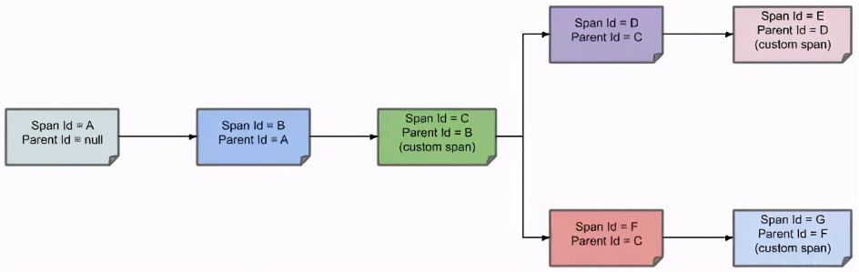
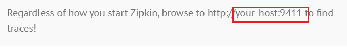
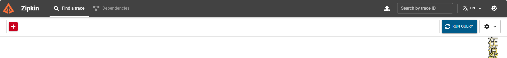
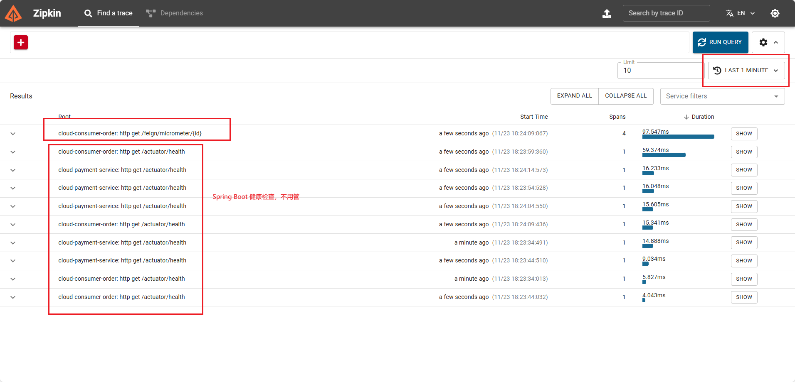
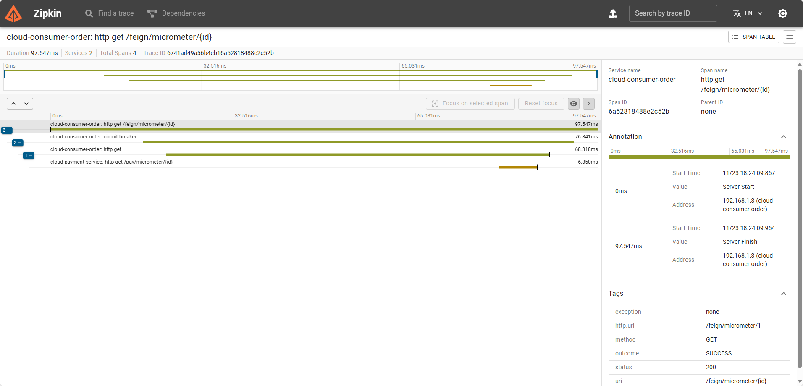

## 简介

在分布式与微服务场景下，我们需要解决如下问题：

- 在大规模分布式与微服务集群下，如何实时观测系统的整体调用链路情况。
- 在大规模分布式与微服务集群下，如何快速发现并定位到问题。
- 在大规模分布式与微服务集群下，如何尽可能精确的判断故障对系统的影响范围与影响程度。
- 在大规模分布式与微服务集群下，如何尽可能精确的梳理出服务之间的依赖关系，并判断出服务之间的依赖关系是否合理。
- 在大规模分布式与微服务集群下，如何尽可能精确的分析整个系统调用链路的性能与瓶颈点。
- 在大规模分布式与微服务集群下，如何尽可能精确的分析系统的存储瓶颈与容量规划。

分布式链路追踪技术要解决的问题，分布式链路追踪（Distributed Tracing），就是将一次分布式请求还原成调用链路，进行日志记录，性能监控并将一次分布式请求的调用情况集中展示。

比如各个服务节点上的耗时、请求具体到达哪台机器上、每个服务节点的请求状态等等。

之前 SpringCloud 全链路追踪使用 Sleuth，但是 Sleuth 现在已经并入了 Micrometer。

所以建议使用 Spring Cloud 3.2+ 使用 Micrometer，如果之前版本建议使用 Skywaling。

## 分布式链路追踪



一条链路通过 Trace Id 唯一标识，Span 标识发起的请求信息，各 span 通过 parent id 关联起来

- 第一个节点：Span ID = A，Parent ID = null，Service 1 接收到请求。
- 第二个节点：Span ID = B，Parent ID= A，Service 1 发送请求到 Service 2 返回响应给Service 1 的过程。
- 第三个节点：Span ID = C，Parent ID= B，Service 2 的 中间解决过程。
- 第四个节点：Span ID = D，Parent ID= C，Service 2 发送请求到 Service 3 返回响应给Service 2 的过程。
- 第五个节点：Span ID = E，Parent ID= D，Service 3 的中间解决过程。
- 第六个节点：Span ID = F，Parent ID= C，Service 3 发送请求到 Service 4 返回响应给 Service 3 的过程。
- 第七个节点：Span ID = G，Parent ID= F，Service 4 的中间解决过程。

通过 Parent ID 就可找到父节点，整个链路即可以进行跟踪追溯了。

## Zipkin

[Zipkin](https://zipkin.io/) 是一个前端的页面展示，用于展示 Micrometer 或者 Sleuth 收集到的数据。

1. 下载 [zipkin](https://search.maven.org/remote_content?g=io.zipkin&a=zipkin-server&v=LATEST&c=exec)
1. 直接 `java -jar` 启动即可

    

    

## Micrometer + Zipkin 搭建

1. 在 cloud 的总父项目中，在 dependencyManagement 中增加 pom

    由于 Micrometer Tracing 是一个门面工具自身并没有实现完整的链路追踪系统，具体的链路追踪另外需要引入的是第三方链路追踪系统的依赖：

    :::details
    ```xml
    <properties>
        <micrometer-tracing.version>1.2.0</micrometer-tracing.version>
        <micrometer-observation.version>1.12.0</micrometer-observation.version>
        <feign-micrometer.version>12.5</feign-micrometer.version>
        <zipkin-reporter-brave.version>2.17.0</zipkin-reporter-brave.version>
    </properties>
    ```
    :::

    :::details
    ```xml
    <!--micrometer-tracing-bom导入链路追踪版本中心  1-->
    <dependency>
        <groupId>io.micrometer</groupId>
        <artifactId>micrometer-tracing-bom</artifactId>
        <version>${micrometer-tracing.version}</version>
        <type>pom</type>
        <scope>import</scope>
    </dependency>
    <!--micrometer-tracing指标追踪  2-->
    <dependency>
        <groupId>io.micrometer</groupId>
        <artifactId>micrometer-tracing</artifactId>
        <version>${micrometer-tracing.version}</version>
    </dependency>
    <!--micrometer-tracing-bridge-brave适配zipkin的桥接包 3-->
    <dependency>
        <groupId>io.micrometer</groupId>
        <artifactId>micrometer-tracing-bridge-brave</artifactId>
        <version>${micrometer-tracing.version}</version>
    </dependency>
    <!--micrometer-observation 4-->
    <dependency>
        <groupId>io.micrometer</groupId>
        <artifactId>micrometer-observation</artifactId>
        <version>${micrometer-observation.version}</version>
    </dependency>
    <!--feign-micrometer 5-->
    <dependency>
        <groupId>io.github.openfeign</groupId>
        <artifactId>feign-micrometer</artifactId>
        <version>${feign-micrometer.version}</version>
    </dependency>
    <!--zipkin-reporter-brave 6-->
    <dependency>
        <groupId>io.zipkin.reporter2</groupId>
        <artifactId>zipkin-reporter-brave</artifactId>
        <version>${zipkin-reporter-brave.version}</version>
    </dependency>
    ```
    :::

    - `micrometer-tracing-bom`: 导入链路追踪版本中心，体系化说明
    - `micrometer-tracing`: 指标追踪
    - `micrometer-tracing-bridge-brave`: 一个 Micrometer 模块，用于与分布式跟踪工具 Brave 集成，以收集应用程序的分布式跟踪数据
        
        Brave 是一个开源的分布式跟踪工具，它可以帮助用户在分布式系统中跟踪请求的流转
        
        它使用一种称为**跟踪上下文**的机制，将请求的跟踪信息存储在请求的头部，然后将请求传递给下一个服务
        
        在整个请求链中，Brave 会将每个服务处理请求的时间和其他信息存储到跟踪数据中，以便用户可以了解整个请求的路径和性能

    - `micrometer-observation`: 一个基于度量库 Micrometer 的观测模块，用于收集应用程序的度量数据
    - `feign-micrometer`: 一个 Feign HTTP客户端的 Micrometer 模块，用于收集客户端请求的度量数据
    - `zipkin-reporter-brave`: 一个用于将 Brave 跟踪数据报告到 Zipkin 跟踪系统的库

    补充包: spring-boot-starter-actuator SpringBoot框架的一个模块用于监视和管理应用程序

1. 服务提供者修改 pom 和 yaml

    :::details
    ```xml
    <!--micrometer-tracing指标追踪  1-->
    <dependency>
        <groupId>io.micrometer</groupId>
        <artifactId>micrometer-tracing</artifactId>
    </dependency>
    <!--micrometer-tracing-bridge-brave适配zipkin的桥接包 2-->
    <dependency>
        <groupId>io.micrometer</groupId>
        <artifactId>micrometer-tracing-bridge-brave</artifactId>
    </dependency>
    <!--micrometer-observation 3-->
    <dependency>
        <groupId>io.micrometer</groupId>
        <artifactId>micrometer-observation</artifactId>
    </dependency>
    <!--feign-micrometer 4-->
    <dependency>
        <groupId>io.github.openfeign</groupId>
        <artifactId>feign-micrometer</artifactId>
    </dependency>
    <!--zipkin-reporter-brave 5-->
    <dependency>
        <groupId>io.zipkin.reporter2</groupId>
        <artifactId>zipkin-reporter-brave</artifactId>
    </dependency>
    ```
    :::

    ```yaml
    # ========================zipkin===================
    management:
      zipkin:
        tracing:
          # 追踪的地址为 9411
          endpoint: http://localhost:9411/api/v2/spans
      tracing:
        sampling:
          # 采样率默认为 0.1（0.1 就是 10 次只能有一次被记录下来），值越大收集越及时
          probability: 1.0
    ```

1. 新建业务 controller

    代码中无需特意配置，只需要执行即可看到

    ```java
    @RestController
    public class PayMicrometerController {
        /**
        * Micrometer(Sleuth)进行链路监控的例子
        *
        */
        @GetMapping(value = "/pay/micrometer/{id}")
        public String myMicrometer(@PathVariable("id") Integer id) {
            return "Hello, 欢迎到来myMicrometer inputId:  " + id + " \t    服务返回:" + IdUtil.simpleUUID();
        }
    }
    ```

1. 公共方法中增加接口

    ```java
    /**
     * Micrometer(Sleuth)进行链路监控的例子
     */
    @GetMapping(value = "/pay/micrometer/{id}")
    public String myMicrometer(@PathVariable("id") Integer id);
    ```

1. 客户端增加 pom 和 yaml

    :::details
    ```xml
    <!--micrometer-tracing指标追踪  1-->
    <dependency>
        <groupId>io.micrometer</groupId>
        <artifactId>micrometer-tracing</artifactId>
    </dependency>
    <!--micrometer-tracing-bridge-brave适配zipkin的桥接包 2-->
    <dependency>
        <groupId>io.micrometer</groupId>
        <artifactId>micrometer-tracing-bridge-brave</artifactId>
    </dependency>
    <!--micrometer-observation 3-->
    <dependency>
        <groupId>io.micrometer</groupId>
        <artifactId>micrometer-observation</artifactId>
    </dependency>
    <!--feign-micrometer 4-->
    <dependency>
        <groupId>io.github.openfeign</groupId>
        <artifactId>feign-micrometer</artifactId>
    </dependency>
    <!--zipkin-reporter-brave 5-->
    <dependency>
        <groupId>io.zipkin.reporter2</groupId>
        <artifactId>zipkin-reporter-brave</artifactId>
    </dependency>
    ```
    :::

    ```yaml
    # zipkin图形展现地址和采样率设置
    management:
      zipkin:
        tracing:
          endpoint: http://localhost:9411/api/v2/spans
      tracing:
        sampling:
          probability: 1.0
    ```

    ```java
    @RestController
    @Slf4j
    public class OrderMicrometerController
    {
        @Resource
        private PayFeignApi payFeignApi;
    
        @GetMapping(value = "/feign/micrometer/{id}")
        public String myMicrometer(@PathVariable("id") Integer id)
        {
            return payFeignApi.myMicrometer(id);
        }
    }
    ```

1. 调用接口

    

    