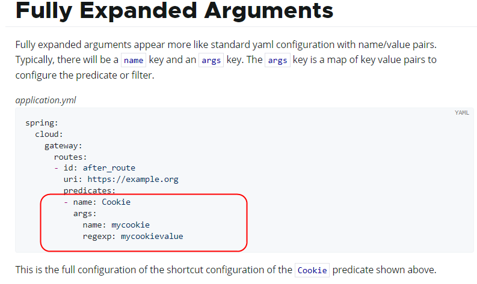

## 简介

旨在为微服务架构提供一种简单有效的统一的 API 路由管理方式，并为它们提供跨领域的关注点，例如：

- 反向代理
- 鉴权
- 流量控制
- 熔断
- 日志监控

[gateway](https://spring.io/projects/spring-cloud-gateway) 在新版本的 Spring Cloud 中替代了以往 Zuul 的定位，成为新一代网关。

一般来说，客户端访问服务器，首先经过 nginx，然后经过 gateway，进入 gateway 之后访问 controller，然后经过 openfeign 转发到各个微服务中。

gatway 的组件是一系列的过滤器，所以实际上是路由转发 + 断言判断 + 过滤器链，而 gateway 本身也是一个微服务，需要服务注册中心。


## base 准备

1. 因为 gateway 本身也是一个微服务，所以需要新增新模块 `cloud-gateway9527`
1. 修改 pom

    :::details
    ```xml
    <dependencies>
        <!--gateway-->
        <dependency>
            <groupId>org.springframework.cloud</groupId>
            <artifactId>spring-cloud-starter-gateway</artifactId>
        </dependency>
        <!--服务注册发现consul discovery,网关也要注册进服务注册中心统一管控-->
        <dependency>
            <groupId>org.springframework.cloud</groupId>
            <artifactId>spring-cloud-starter-consul-discovery</artifactId>
        </dependency>
        <!-- 指标监控健康检查的actuator,网关是响应式编程删除掉spring-boot-starter-web dependency-->
        <dependency>
            <groupId>org.springframework.boot</groupId>
            <artifactId>spring-boot-starter-actuator</artifactId>
        </dependency>
    </dependencies>

    <build>
        <plugins>
            <plugin>
                <groupId>org.springframework.boot</groupId>
                <artifactId>spring-boot-maven-plugin</artifactId>
            </plugin>
        </plugins>
    </build>
    ```
    :::

1. 修改 yaml

    ```yaml
    server:
      port: 9527
    
    spring:
      application:
        name: cloud-gateway #以微服务注册进consul或nacos服务列表内
      cloud:
        consul: #配置consul地址
          host: localhost
          port: 8500
          discovery:
            prefer-ip-address: true
            service-name: ${spring.application.name}
    ```

1. 修改主启动类

    ```java
    @SpringBootApplication
    // 服务注册和发现
    @EnableDiscoveryClient
    public class Main9527 {
        public static void main(String[] args) {
            SpringApplication.run(Main9527.class, args);
        }
    }
    ```

1. 启动服务

    

## Route 路由

1. 使用新 controller 测试 gateway，在 8001 新建 `PayGateWayController`

    ```java
    @RestController
    public class PayGateWayController
    {
        @Resource
        PayService payService;
    
        @GetMapping(value = "/pay/gateway/get/{id}")
        public ResultData<Pay> getById(@PathVariable("id") Integer id)
        {
            Pay pay = payService.getById(id);
            return ResultData.success(pay);
        }
    
        @GetMapping(value = "/pay/gateway/info")
        public ResultData<String> getGatewayInfo()
        {
            return ResultData.success("gateway info test："+ IdUtil.simpleUUID());
        }
    }
    ```

1. Route 获取服务 URL，gateway 修改 yaml 文件

    ```yaml
    spring:
      cloud:
        gateway:
          routes:
            - id: pay_routh1
              # 直接将路径写死的方式运行，比较单一
              uri: http://localhost:8001
              predicates:
                # 使用断言，匹配路由地址
                - Path=/pay/gateway/get/**
            - id: pay_routh2
              # 经过负载均衡 LB 自动获取 consul 中的注册 IP
              uri: lb://cloud-payment-service
              predicates:
                - Path=/pay/gateway/info/**
    ```

    

1. 修改公共接口

    一般来说，外部客户应该先访问 gateway，之后经过 gateway 找到对应的地址，微服务内部之间无需网关，打到 openfeign 中直接访问

    但是这里为了测试，直接将公共接口改成 gateway
    
    修改后重新打 Jar 包，重启客户端 80

    ```java
    @FeignClient("cloud-gateway")
    public interface PayFeignApi {}
    ```

1. 测试

    

1. 关掉 8001，启动 8002，然后分别访问写死和使用 lb 的两个接口

    一个已经报错了，另一个仍然可以访问

    

    


## Predicate 断言

[断言](https://docs.spring.io/spring-cloud-gateway/reference/4.2/spring-cloud-gateway/request-predicates-factories.html)其实就是判断 HTTP 的请求是否符合规则，Spring Cloud 自带许多断言，并且可以通过逻辑 and or 组合。


1. 配置方式

    根据官方文档，配置可以二选一，一种是完整型，一种是短促型：

    - 完整型

        

    - 短促型

        

1. 常用内置 Route Predicate：After、Before、Between、Cookie、Header、Host、Path、Query、RemoteAddr、Method

    :::details
    ```yaml
    spring:
      cloud:
        gateway:
          routes:
            - id: pay_routh1
              uri: lb://cloud-payment-service
              predicates:
                # 使用 ZonedDateTime 做配置
                # 仅当指定时间之后可以访问此路径
                - After=2023-11-20T17:38:13.586918800+08:00[Asia/Shanghai]
                # 仅当指定时间之前可以访问此路径
                - Before=2024-11-20T17:38:13.586918800+08:00[Asia/Shanghai]
                # 仅当指定时间范围内可以访问此路径
                - Between=2023-11-21T17:38:13.586918800+08:00[Asia/Shanghai],2023-11-22T17:38:13.586918800+08:00[Asia/Shanghai]
                - Cookie=username,zzyy
                # 请求头要有X-Request-Id属性并且值为整数的正则表达式
                - Header=X-Request-Id, \d+
                # 断言，路径相匹配的进行路由
                - Path=/pay/gateway/info/**
                # 要有参数名username并且值还要是整数才能路由
                - Query=username, \d+
                # 外部访问我的IP限制，最大跨度不超过32，目前是1~24它们是 CIDR 表示法。
                # CIDR，指的是每个分隔符 . 之间都是八位，即 0-255，而 / 后的 24 代表 3*8，即代表前三位固定，后一位可以任意，即 192.168.124.x
                - RemoteAddr=192.168.124.1/24
                # Method 配置，仅有 GET、POST 可以访问
                - Method=GET,POST
    ```
    :::

1. 自定义 Predicat

    通过源码得知，比如 `AfterRoutePredicateFactory`，首先要继承 `AbstractRoutePredicateFactory`，开头任意取名，不过必须使用 `RoutePredicateFactory` 结尾

    新建类 `CausesRoutePredicateFactory`

    :::details
    ```java
    @Component
    public class CausesRoutePredicateFactory extends AbstractRoutePredicateFactory<CausesRoutePredicateFactory.Config> {
    
        public CausesRoutePredicateFactory() {
            super(Config.class);
        }
    
    
        public CausesRoutePredicateFactory(Class<Config> configClass) {
            super(configClass);
        }
    
        // 短格式，不重写此方法就不能用短促型写法
        @Override
        public List<String> shortcutFieldOrder() {
            return Collections.singletonList("userType");
        }
    
        @Override
        public Predicate<ServerWebExchange> apply(Config config) {
            return new GatewayPredicate() {
                @Override
                public boolean test(ServerWebExchange serverWebExchange) {
                    String userType = serverWebExchange.getRequest().getQueryParams().getFirst("userType");
                    return StringUtils.hasText(userType) && userType.equals(config.getUserType());
                }
            };
        }
    
        // 按照源码配置仿照，使用用户等级做断言
        @Validated
        public static class Config {
            //钻、金、银等用户等级
            @Setter
            @Getter
            @NotEmpty
            private String userType;
        }
    }
    ```
    :::

    修改 yaml

    :::details
    ```yaml
    spring:
      cloud:
        gateway:
          routes:
            - id: pay_routh1
              uri: lb://cloud-payment-service
              predicates:
                - Path=/pay/gateway/info/**
                - Causes=diamond
    ```
    :::

    

## Filter 过滤

[Filter](https://docs.spring.io/spring-cloud-gateway/reference/4.2/spring-cloud-gateway/gatewayfilter-factories.html) 相当于拦截器和过滤器，可以在请求之前和之后调用，形成一个过滤器链，做一些操作（鉴权、异常处理、调用接口时长统计）。

过滤器分为：全局默认过滤器、单一内置过滤器、自定义过滤器。

1. 常用内置过滤器

    :::details
    ```yaml
    spring:
      cloud:
        gateway:
          routes:
            - id: pay_routh1
              uri: lb://cloud-payment-service
              predicates:
                - Path=/gateway/filter/**
                - Causes=diamond
              filters:
                # 请求头 kv，若一头含有多参则重写一行设置
                # 添加请求头
                - AddRequestHeader=X-Request-causes1,causesValue1
                - AddRequestHeader=X-Request-causes2,causesValue2
                # 删除请求头
                - RemoveRequestHeader=sec-fetch-site
                # 修改请求头，sec-fetch-mode 对应的值修改为 Blue-updatebyzzyy
                - SetRequestHeader=sec-fetch-mode, Blue-updatebyzzyy
                # 新增请求参数 X-Response-causes 并设值为 BlueResponse
                - AddResponseHeader=X-Response-causes, BlueResponse
                # 设置回应头 Date 值为 2099-11-11
                - SetResponseHeader=Date,2099-11-11
                # 删除回应头 Content-Type
                - RemoveResponseHeader=Content-Type
                # 新增请求参数 Parameter: k、v 键值对
                - AddRequestParameter=customerId,9527001
                # 删除请求参数 customerName，即使传递过来，经过过滤器删除之后也是 null
                - RemoveRequestParameter=customerName
                # 分拆地址，与 predicates.Path 结合使用
                # 客户端调用 http://localhost:9527/gateway/filter，但真实地址为 /pay/gateway/filter
                - PrefixPath=/pay
            - id: pay_routh2
              uri: lb://cloud-payment-service
              predicates:
                - Path=/XYZ/abc/{segment}
              filters:
                # 配合 predicates.Path 使用，{segment} 表示占位符
                # 除了 {} 包裹的内容，其余全都被替换为 /pay/gateway/，即访问 http://localhost:9527/XYZ/abc/filter 其实是访问 http://localhost:9527//pay/gateway/filter
                - SetPath=/pay/gateway/{segment}
            - id: pay_routh3
              uri: lb://cloud-payment-service
              predicates:
                - Path=/gateway/filter/**
              filters:
                # 重定向，访问 http://localhost:9527/pay/gateway/filter 跳转到 http://causes.site/
                - RedirectTo=302, http://causes.site/
          # 直接在 spring.cloud.gateway.default-filters 中定义，即全局过滤器
          default-filters:
            - X-Request-causes1,causesValue1
    ```
    :::

1. 自定义全局过滤器

    新建过滤器并实现接口

    :::details
    ```java
    @Component
    @Slf4j
    public class CausesGlobalFilter implements GlobalFilter, Ordered {
    
        private static final String BEGIN_VISIT_TIME = "begin_visit_time";
    
    
        @Override
        public Mono<Void> filter(ServerWebExchange exchange, GatewayFilterChain chain) {
            // 记载进入过滤器访问接口的时间
            exchange.getAttributes().put(BEGIN_VISIT_TIME, System.currentTimeMillis());
    
            return chain.filter(exchange).then(Mono.fromRunnable(() -> {
                Long begin_visit_time = exchange.getAttribute(BEGIN_VISIT_TIME);
                if (Objects.isNull(begin_visit_time)) {
                    // 获取出接口，进入过滤器的时间，两者相减为接口调用时间
                    System.out.println(System.currentTimeMillis() - begin_visit_time);
                }
            }));
        }
    
        // 数字越小优先级越高
        @Override
        public int getOrder() {
            return 0;
        }
    }
    ```
    :::

1. 新建自定义 Filter

    :::details
    ```java
    @Component
    public class CausesFilterFactory extends AbstractGatewayFilterFactory<CausesFilterFactory.Config> {
    
        public CausesFilterFactory() {
        }
    
        public CausesFilterFactory(Class<Config> configClass) {
            super(configClass);
        }
    
        @Override
        public GatewayFilter apply(Config config) {
            return new GatewayFilter() {
                @Override
                public Mono<Void> filter(ServerWebExchange exchange, GatewayFilterChain chain) {
                    if (exchange.getRequest().getQueryParams().containsKey("causes")) {
                        return chain.filter(exchange);
                    }
                    exchange.getResponse().setStatusCode(HttpStatus.BAD_REQUEST);
                    return exchange.getResponse().setComplete();
                }
            };
        }
    
        @Override
        public List<String> shortcutFieldOrder() {
            return List.of("status");
        }
    
        public static class Config {
            @Getter
            @Setter
            private String status;
        }
    }
    ```
    :::