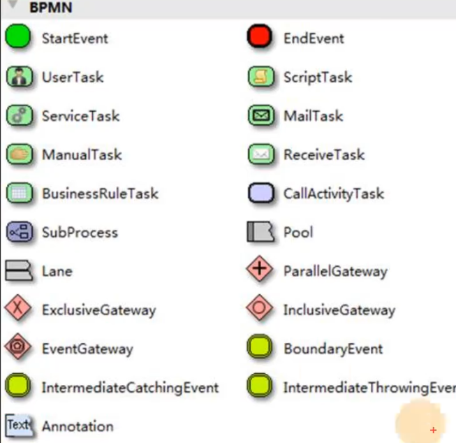
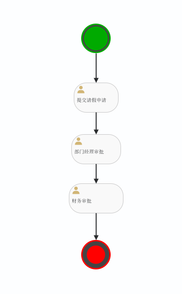
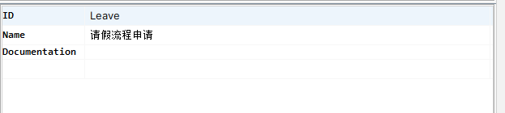
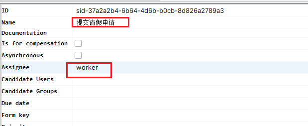
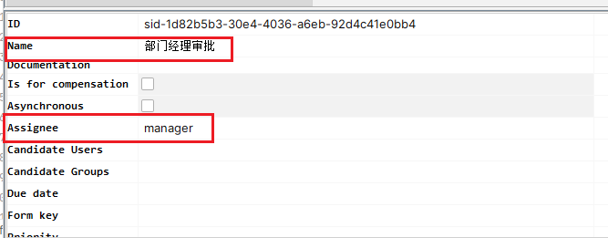
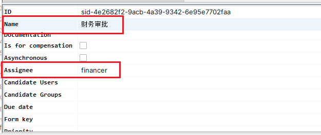
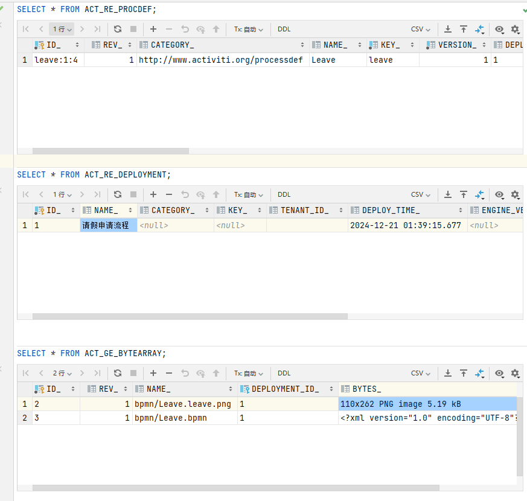

# Activiti

## 简介

[Activiti](https://www.activiti.org/)，工作流，是当前最流行的开源工作流引擎之一。

## 建模语言 BPMN

BPM 是业务流程管理 Business Process Management，而 BPMN 是对 BPM 的一种实现。BPMN 最早 2004.05 发布，与 2011.01 发布 2.0 作为当前版本。

在 Activiti 中支持了如下符号，作为一种规范



对于一个完整的 BPMN 图形流程，其实是 XML 描述，最终 BPMN 会保存为一个 .bpmn 的文件。

## 环境搭建

1. 新建项目，要求 JDK8+、MYSQL5.7+，创建数据库 `CREATE DATABASE activiti DEFAULT CHARACTER SET utf8mb4;`
2. 导入 pom 文件

    :::details
    ```xml
    <properties>
        <activiti.version>7.1.0.M6</activiti.version>
        <activiti.cloud.version>7.0.0.Beta1</activiti.cloud.version>
        <mysql.version>8.0.20</mysql.version>
        <slf4j.version>1.6.6</slf4j.version>
        <log4j.version>1.2.12</log4j.version>
    </properties>

    <dependencyManagement>
        <dependencies>
            <dependency>
                <groupId>org.activiti</groupId>
                <artifactId>activiti-engine</artifactId>
                <version>${activiti.version}</version>
            </dependency>
            <dependency>
                <groupId>org.activiti</groupId>
                <artifactId>activiti-spring</artifactId>
                <version>${activiti.version}</version>
            </dependency>
            <!-- bpmn 模型处理 -->
            <dependency>
                <groupId>org.activiti</groupId>
                <artifactId>activiti-bpmn-model</artifactId>
                <version>${activiti.version}</version>
            </dependency>
            <!-- bpmn 转换 -->
            <dependency>
                <groupId>org.activiti</groupId>
                <artifactId>activiti-bpmn-converter</artifactId>
                <version>${activiti.version}</version>
            </dependency>
            <!-- bpmn json数据转换 -->
            <dependency>
                <groupId>org.activiti</groupId>
                <artifactId>activiti-json-converter</artifactId>
                <version>${activiti.version}</version>
            </dependency>
            <!-- bpmn 布局 -->
            <dependency>
                <groupId>org.activiti</groupId>
                <artifactId>activiti-bpmn-layout</artifactId>
                <version>${activiti.version}</version>
            </dependency>
            <!-- mysql驱动 -->
            <dependency>
                <groupId>mysql</groupId>
                <artifactId>mysql-connector-java</artifactId>
                <version>${mysql.version}</version>
            </dependency>
            <!-- mybatis -->
            <dependency>
                <groupId>org.mybatis</groupId>
                <artifactId>mybatis</artifactId>
                <version>3.4.5</version>
            </dependency>
            <!-- 链接池 -->
            <dependency>
                <groupId>commons-dbcp</groupId>
                <artifactId>commons-dbcp</artifactId>
                <version>1.4</version>
            </dependency>
            <dependency>
                <groupId>commons-io</groupId>
                <artifactId>commons-io</artifactId>
                <version>2.6</version>
            </dependency>
            <dependency>
                <groupId>junit</groupId>
                <artifactId>junit</artifactId>
                <version>4.12</version>
            </dependency>
            <!-- log start -->
            <dependency>
                <groupId>log4j</groupId>
                <artifactId>log4j</artifactId>
                <version>${log4j.version}</version>
            </dependency>
            <dependency>
                <groupId>org.slf4j</groupId>
                <artifactId>slf4j-api</artifactId>
                <version>${slf4j.version}</version>
            </dependency>
            <dependency>
                <groupId>org.slf4j</groupId>
                <artifactId>slf4j-log4j12</artifactId>
                <version>${slf4j.version}</version>
            </dependency>
        </dependencies>
    </dependencyManagement>
    ```
    :::

3. 给定 `log4j.properties`

    ```properties
    # Set root category priority to INFO and its only appender to CONSOLE.
    #log4j.rootCategory=INFO, CONSOLE debug info warn error fatal
    log4j.rootCategory=debug, CONSOLE, LOGFILE
    # Set the enterprise logger category to FATAL and its only appender to CONSOLE.
    log4j.logger.org.apache.axis.enterprise=FATAL, CONSOLE
    # CONSOLE is set to be a ConsoleAppender using a PatternLayout.
    log4j.appender.CONSOLE=org.apache.log4j.ConsoleAppender
    log4j.appender.CONSOLE.layout=org.apache.log4j.PatternLayout
    log4j.appender.CONSOLE.layout.ConversionPattern=%d{ISO8601} %-6r[%15.15t] %-5p %30.30c %x - %m\n
    # LOGFILE is set to be a File appender using a PatternLayout.
    log4j.appender.LOGFILE=org.apache.log4j.FileAppender
    log4j.appender.LOGFILE.File=D:\workspace\practise\java\activiti\activiti.log
    log4j.appender.LOGFILE.Append=true
    log4j.appender.LOGFILE.layout=org.apache.log4j.PatternLayout
    log4j.appender.LOGFILE.layout.ConversionPattern=%d{ISO8601} %-6r[%15.15t] %-5p %30.30c %x - %m\n
    ```

4. 给定 `activiti.cfg.xml`

    :::details
    ```xml
    <?xml version="1.0" encoding="UTF-8"?>
    <beans xmlns="http://www.springframework.org/schema/beans"
           xmlns:xsi="http://www.w3.org/2001/XMLSchema-instance"
           xmlns:context="http://www.springframework.org/schema/context"
           xmlns:tx="http://www.springframework.org/schema/tx"
           xsi:schemaLocation="http://www.springframework.org/schema/beans
                        http://www.springframework.org/schema/beans/spring-beans.xsd
    http://www.springframework.org/schema/contex
    http://www.springframework.org/schema/context/spring-context.xsd
    http://www.springframework.org/schema/tx
    http://www.springframework.org/schema/tx/spring-tx.xsd">
    
        <!-- 这里可以使用 链接池 dbcp-->
        <bean id="dataSource" class="org.apache.commons.dbcp.BasicDataSource">
            <property name="driverClassName" value="com.mysql.cj.jdbc.Driver" />
            <property name="url" value="jdbc:mysql://hadoop101:3306/activiti?useUnicode=true&amp;characterEncoding=UTF-8" />
            <property name="username" value="root" />
            <property name="password" value="root" />
            <property name="maxActive" value="3" />
            <property name="maxIdle" value="1" />
        </bean>
    
        <bean id="processEngineConfiguration"
              class="org.activiti.engine.impl.cfg.StandaloneProcessEngineConfiguration">
            <!-- 引用数据源 上面已经设置好了-->
            <property name="dataSource" ref="dataSource" />
            <!-- activiti数据库表处理策略，true 表示表结构没有会创建，第一次使用可以用 true 之后用 false -->
            <property name="databaseSchemaUpdate" value="true"/>
        </bean>
    </beans>
    ```
    :::

5. 执行测试代码

    ```java
    import org.activiti.engine.ProcessEngine;
    import org.activiti.engine.ProcessEngines;
    import org.junit.Test;
    
    
    public class ActivitiCreateTable {
        @Test
        public void createDBTable() {
            // 默认创建表结构
            ProcessEngine engine = ProcessEngines.getDefaultProcessEngine();
            System.out.println(engine);
        }
    }
    ```

6. 执行完成测试代码后，会发现在数据库中已经被创建了 25 张表

    跟流程定义相关表

    ```
    ACT_RE_DEPLOYMENT
    ACT_RE_MODEL
    ACT_RE_PROCDEF: 流程定义表
    ```

    流程运行时相关表

    ```
    ACT_RU_DEADLETTER_JOB
    ACT_RU_EVENT_SUBSCR
    ACT_RU_EXECUTION：执行过程表
    ACT_RU_IDENTITYLINK
    ACT_RU_INTEGRATION
    ACT_RU_JOB
    ACT_RU_SUSPENDED_JOB
    ACT_RU_TASK：当前等待处理的任务
    ACT_RU_TIMER_JOB
    ACT_RU_VARIABLE：关键变量
    ```

    历史信息表

    ```
    ACT_HI_ACTINST
    ACT_HI_ATTACHMENT
    ACT_HI_COMMENT
    ACT_HI_DETAIL
    ACT_HI_IDENTITYLINK
    ACT_HI_PROCINST
    ACT_HI_TASKINST
    ACT_HI_VARINST
    ```

    通用信息

    ```
    ACT_GE_BYTEARRAY
    ACT_GE_PROPERTY
    ```

    ACT_EVT_LOG
    ACT_PROCDEF_INFO

7. 开发中比较重要的类

    | service名称       | service作用              |
    | ----------------- | ------------------------ |
    | RepositoryService | activiti的资源管理类     |
    | RuntimeService    | activiti的流程运行管理类 |
    | TaskService       | activiti的任务管理类     |
    | HistoryService    | activiti的历史管理类     |
    | ManagerService    | activiti的引擎管理类     |

## 快速启动

1. 环境搭建好后，要开始一个快速项目，首先需要创建一个流程（bpm 文件），如下

    `Leave.bpmn`

    

    整个 bpmn 文件的 ID 为 Leave

    

    

    

    

    直接下一个插件，然后将其创建、拖动即可

2. 将文件部署，其实就是将 Leave.bpmn 这个文件解析，放到数据库中，编写代码部署

    ```java
    import org.activiti.engine.ProcessEngine;
    import org.activiti.engine.ProcessEngines;
    import org.activiti.engine.RepositoryService;
    import org.activiti.engine.repository.Deployment;
    import org.junit.Test;
    
    public class ActivitiBasic {
    
        @Test
        public void deploy() {
            ProcessEngine engine = ProcessEngines.getDefaultProcessEngine();
            RepositoryService repositoryService = engine.getRepositoryService();
            // 使用 RepositoryService 实例来部署当前业务流程
            Deployment deploy = repositoryService.createDeployment()
                // 添加 bpmn 资源
                .addClasspathResource("bpmn/Leave.bpmn")
                /*
                    添加资源，资源必须是 png|jpg|gif|svg 类型
                    添加这种资源类型命名必须是 ${bpmn.name}.${bpmn.id}.png|jpg|gif|svg
                    比如这里 Leave 是 bpmn 文件名称，则 bpmn.name = Leave，bpmn.id = Leave，则为 Leave.leave.png
                 */
                .addClasspathResource("bpmn/Leave.leave.png")
                .name("请假申请流程")
                .deploy();

            System.out.println(deploy.getId());
            System.out.println(deploy.getName());
        }
    }
    ```

    

    除此之外，还可以上传压缩包，只需要在代码中指定即可

3. 有了流程定义，接下来就就可以启动一个流程实例

    :::details
    ```java
    /**
     * 根据流程定义启动流程实例
     */
    @Test
    public void startProcess() {
        ProcessEngine engine = ProcessEngines.getDefaultProcessEngine();
        RuntimeService runtimeService = engine.getRuntimeService();
        /*
            根据指定的 processDefinitionKey 开启一个新的流程实例

            这个 processDefinitionKey 其实就是 bpmn 中的 Id
         */
        ProcessInstance processInstance = runtimeService.startProcessInstanceByKey("Leave");

        // 流程定义 ID Leave:1:4
        System.out.println(String.format("流程定义 ID %s", processInstance.getProcessDefinitionId()));
        // 流程实例 ID 2501
        System.out.println(String.format("流程实例 ID %S", processInstance.getId()));
        // 当前活动 ID null
        System.out.println(String.format("当前活动 ID %s", processInstance.getActivityId()));
    }

    /**
     * 启动任务之后，需要等待 worker 去提交申请，那么可以先查询一下任务
     */
    @Test
    public void findPersonalTaskList() {
        String assignee = "worker";
        // String assignee = "manager";
        ProcessEngine engine = ProcessEngines.getDefaultProcessEngine();
        TaskService taskService = engine.getTaskService();
        // 根据 definitionKey 查询当前任务负责人的任务
        List<Task> tasks = taskService.createTaskQuery()
            .processDefinitionKey("Leave")
            .taskAssignee(assignee)
            .list();

        tasks.forEach(task -> {
            // 流程实例 ID 2501
            System.out.println(String.format("流程实例 ID %s", task.getProcessInstanceId()));
            // 任务 ID 2505
            System.out.println(String.format("任务 ID %s", task.getId()));
            // 任务负责人 worker
            System.out.println(String.format("任务负责人 %s", task.getAssignee()));
            // 任务名称 提交请假申请
            System.out.println(String.format("任务名称 %s", task.getName()));
        });
    }

    /**
     * 完成任务，流程向前推动
     */
    @Test
    public void completeTask() {
        String assignee = "worker";

        ProcessEngine engine = ProcessEngines.getDefaultProcessEngine();
        TaskService taskService = engine.getTaskService();

        Task task = taskService.createTaskQuery()
            .processDefinitionKey("Leave")
            .taskAssignee(assignee)
            // 获取一个任务对象
            .singleResult();

        // 完成任务，在调用此方法时流程会向前推动一步，根据 bpmn 的流程定义，当前 task 会从 worker 到 manager 中
        taskService.complete(task.getId());
    }

    /**
     * 查询在当前流程定义下，有哪些流程定义正在跑
     */
    @Test
    public void queryTasks() {
        ProcessEngine engine = ProcessEngines.getDefaultProcessEngine();
        RepositoryService repositoryService = engine.getRepositoryService();
        ProcessDefinitionQuery definitionQuery = repositoryService.createProcessDefinitionQuery();
        List<ProcessDefinition> definitions = definitionQuery.processDefinitionKey("Leave")
            .orderByProcessDefinitionVersion()
            .desc()
            .list();
        definitions.forEach(definition -> {
            // 流程定义 ID Leave:1:4
            System.out.println(String.format("流程定义 ID %s", definition.getId()));
            // 流程定义 Name 请假流程申请
            System.out.println(String.format("流程定义 Name %s", definition.getName()));
            // 流程定义 Key Leave
            System.out.println(String.format("流程定义 Key %s", definition.getKey()));
            // 流程定义 Version 1
            System.out.println(String.format("流程定义 Version %s", definition.getVersion()));
            // 流程部署 Id 1
            System.out.println(String.format("流程部署 Id %s", definition.getDeploymentId()));
        });
    }

    /**
     * 删除流程定义
     */
    @Test
    public void deleteDeployment() {
        String deploymentId = "1";

        ProcessEngine engine = ProcessEngines.getDefaultProcessEngine();
        RepositoryService repositoryService = engine.getRepositoryService();
        // 删除流程定义，若当前还有流程实例正在运行则会报错
        repositoryService.deleteDeployment(deploymentId);
        // 强制删除，将删除当前流程定义以及其下的所有流程实例、日志
        // repositoryService.deleteDeployment(deploymentId, true);
    }

    /**
     * 查询历史信息
     */
    @Test
    public void findHistoryInfo() {
        ProcessEngine engine = ProcessEngines.getDefaultProcessEngine();
        HistoryService historyService = engine.getHistoryService();
        // 查询历史信息
        HistoricActivityInstanceQuery instanceQuery = historyService.createHistoricActivityInstanceQuery();
        instanceQuery.list().forEach(history -> {
            System.out.println(history.getActivityId());
            System.out.println(history.getActivityName());
            System.out.println(history.getProcessDefinitionId());
            System.out.println(history.getProcessInstanceId());
            System.out.println("----------------------");
        });
    }
    ```
    :::

## 进阶

### 流程挂起与激活

#### 流程定义与流程实例

流程定义 ProcessDefinition 和流程实例 ProcessInstance 是 Activiti 中的两个概念，一个定义可以启动多个实例。

在表中，流程定义字段名多为 PROC_DEF_ID，流程实例字段名多为 PROC_INST_ID。

#### 启动流程实例时添加 BusinessKey

BusinessKey，其实就是业务的实例 key，在 activiti 中没有任何意义，但是可以和实际业务进行关联。

```java
ProcessEngine engine;
RuntimeService runtimeService;

@Before
public void before() {
    engine = ProcessEngines.getDefaultProcessEngine();
    runtimeService = engine.getRuntimeService();
}

/**
 * 开启一个实例，并且给定业务键 business key
 */
@Test
public void addBusinessKey() {
    // 增加一个 BusinessKey，可以之后和业务相关联
    ProcessInstance instance = runtimeService.startProcessInstanceByKey("Leave", "businessKey_1");
    System.out.println(instance.getBusinessKey());
}
```

#### 流程挂起与激活

```java
ProcessEngine engine;
RuntimeService runtimeService;

@Before
public void before() {
    engine = ProcessEngines.getDefaultProcessEngine();
    runtimeService = engine.getRuntimeService();
}

/**
 * 查看流程实例
 */
@Test
public void queryInstances() {
    List<ProcessInstance> instances = runtimeService
        .createProcessInstanceQuery()
        .processDefinitionKey("Leave")
        .list();
    instances.forEach(instance -> {
        System.out.println(String.format("流程实例 ID %s", instance.getProcessInstanceId()));
        System.out.println(String.format("所属流程定义 %s", instance.getProcessDefinitionId()));
        System.out.println(String.format("是否执行完成 %s", instance.isEnded()));
        System.out.println(String.format("是否暂停 %s", instance.isSuspended()));
        System.out.println(String.format("当前活动标识 %s", instance.getActivityId()));
        System.out.println(String.format("业务关键字 %s", instance.getBusinessKey()));
        System.out.println("---------------");
    });
}

/**
 * 挂起流程实例
 */
@Test
public void suspendProcessInstance() {
    // 获取一个流程定义
    RepositoryService repositoryService = engine.getRepositoryService();
    ProcessDefinition definition = repositoryService
        .createProcessDefinitionQuery()
        .processDefinitionKey("Leave")
        .singleResult();
    String definitionId = definition.getId();
    // 查看当前是否未挂起状态
    boolean suspended = definition.isSuspended();
    if (suspended) {
        // 若为挂起状态，则激活操作，参数为：流程定义 Id、是否激活、激活时间
        repositoryService.activateProcessDefinitionById(definitionId, true, null);
        System.out.println(String.format("流程定义 %s 已激活", definitionId));
    } else {
        // 若为激活状态，则可以进行挂起操作，参数为：流程定义 ID、是否挂起、挂起的时间
        repositoryService.suspendProcessDefinitionById(definitionId, true, null);
        System.out.println(String.format("流程定义 %s 已挂起", definitionId));
    }
}
```

TODO: 挂起单个流程实例