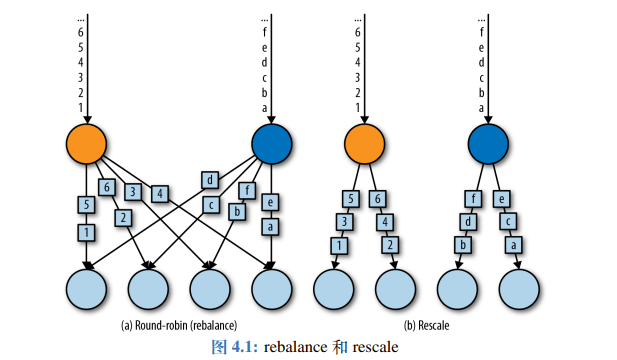
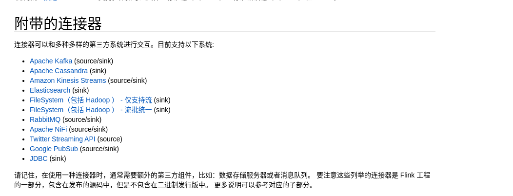
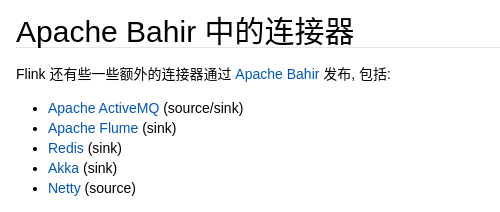

接下来的内容是大量的 API 操作（Flink DataStream API），需要大量的练习使用。

## 执行模式和触发执行

**执行模式**

在流批一体的 API 下，默认情况的 Flink 程序是流式执行模式，但是可以在程序执行时手动设置为批处理模式

在提交作业时，增加 `execution.runtime-mode` 参数，指定值为 BATCH，即可使用批处理执行模式：`bin/flink run -Dexecution.runtime-mode=BATCH ...`。

除了命令行之外，其实也可以使用代码直接指定，也就是：

```java
StreamExecutionEnvironment env = StreamExecutionEnvironment.getExecutionEnvironment();
env.setRuntimeMode(RuntimeExecutionMode.BATCH);
```

那么其实对于有界流，我们其实可以使用 BATCH 模式，来让数据更加高效。

**触发执行**

其实类似 Spark 的行动算子，只有在 Flink 在触发执行的时候，就可以执行整个 Flink，没有出发执行时，只是封装的逻辑。

## 读取数据源

事实上，在一个真实场景中，往往会将数据变为一个 POJO 类（或者是一个 Tuple）。然后根据 POJO 来进行计算。

**准备基础类**

以电商网站的用户行为数据来进行举例。例如有：`user`、`url`、`timeStamp` 三者。

```java
@Data
@NoArgsConstructor
@AllArgsConstructor
public class Event {

  private String user;
  private String url;
  private Long timeStamp;

  @Override
  public String toString() {
    return "Event{" +
        "user='" + user + '\'' +
        ", url='" + url + '\'' +
        ", timeStamp='" + new Timestamp(timeStamp) + '\'' +
        '}';
  }
}
```

**读取有界数据**

```java
StreamExecutionEnvironment env = StreamExecutionEnvironment.getExecutionEnvironment();
// 设置并行度为 1
env.setParallelism(1);

// 从文件中读取数据
DataStreamSource<String> fileStream = env.readTextFile("input/clicks.txt");
fileStream.print();

// 从集合中读取数据
List<Event> events = new ArrayList<>();
events.add(new Event("Mary", "./home", 1000L));
events.add(new Event("Bob", "./cart", 2000L));
DataStreamSource<Event> collectionStream = env.fromCollection(events);
collectionStream.print();

env.execute();
```

无论文件还是集合，读取的都是有界流的数据。

**读取无界数据**

简单的，就是读取 socket 数据为无界流（之前有过案例），但是一般来说是做流式数据的测试，而不是真实场景。

在真实的大数据场景中，一般使用 kafka 作为真实的数据源，来进行流式数据的读取。

添加依赖：

```xml
<dependency>
    <groupId>org.apache.flink</groupId>
    <artifactId>flink-connector-kafka_${scala.binary.version}</artifactId>
    <version>${flink.version}</version>
</dependency>
```

```java
StreamExecutionEnvironment env = StreamExecutionEnvironment.getExecutionEnvironment();
env.setParallelism(1);

// 不只是 kafka，实现 sourceFunction，那么就可以利用任何的数据源。kafka 的依赖帮助我们实现了 kafka 的 sourceFunction

// 属性配置
Properties properties = new Properties();
properties.setProperty("bootstrap.servers", "hadoop102:9092");
properties.setProperty("group.id", "consumer-group");
properties.setProperty("key.deserializer", "org.apache.kafka.common.serialization.StringDeserializer");
properties.setProperty("value.deserializer", "org.apache.kafka.common.serialization.StringDeserializer");
properties.setProperty("auto.offset.reset", "latest");

// 实行 topic、反序列化 schema、properties
DataStreamSource<String> kafkaStream = env.addSource(new FlinkKafkaConsumer<String>("topic-clicks", new SimpleStringSchema(), properties));
kafkaStream.print();

env.execute();
```

**自定义数据源**

```java
public class ClickSource implements SourceFunction<Event> {

  // 声明一个标志位，判断数据源是仍然有值/值已经全部取出
  private Boolean running = true;

  @Override
  public void run(SourceContext<Event> sourceContext) throws Exception {
    // 循环生成数据
    while (running) {
      sourceContext.collect(new Event());
    }
  }

  @Override
  public void cancel() {
    running = false;
  }
}
```

```java
/**
 * 自定义的并行 source function，ParallelSourceFunction 可以设置并行度为多个
 */
public class CustomSource implements ParallelSourceFunction<Integer> {

  private Boolean running = true;

  @Override
  public void run(SourceContext<Integer> sourceContext) throws Exception {
    Random random = new Random();
    while (running) {
      sourceContext.collect(random.nextInt());
    }
  }

  @Override
  public void cancel() {
    running = false;
  }
}
```

## Flink 类型系统

**基本类型**

Flink 支持 Java 和 Scala 所有普通数据类型，并且还包含专门为 Java 实现的元组 Tuple，支持 Pojo 类。

**Tuple**

Tuple 是强类型，根据元素数量的不同被实现了不同的类，从 Tuple1 一直到 Tuple25。

Tuple 可以通过下标访问，下标从 0 开始，访问时使用 `tuple.f0` 或者 `tuple.getField(0)` 获取元素。

Tuple 是可变数据结构，所以 Tuple 中的元素可以重新赋值，重复利用 Tuple 可以减轻 GC 压力。

```java
Tuple2<String, Integer> tuple = Tuple2.of("causes", 23);
System.out.println(tuple.f0);
System.out.println((String) tuple.getField(0));
// 设置索引为 0 的位置的数值
tuple.setField(23, 0);
```

**POJO**

在 Java 中，类型信息是 `org.apache.flink.api.common.typeinfo.Types`，例如 `Types.INT`、`Types.POJO(UserBehavior.class);`。

POJO 要求：

- 公共的。
- 必须有一个空参构造方法。
- 不能是 final 的。

**辅助类型**

Option、Either、List、Map 等。

**泛型类型**

假如没有按照上面的类型要求来定义，那么就会被 Flink 作为泛型类型来处理。Flink 会将所有的泛型类型作为黑盒，无法获取其内部属性。

他们也不是被 Flink 本身序列化的，而是通过 Kryo 序列化的。

**类型提示系统**

Flink 拥有一套类型提取系统，可以分析函数的输入和返回类型，自动获取类型信息，并且获得序列化和反序列化器。

但是 Java 中有类型擦除的存在，在某些情况下（例如 Lambda 中），自动提取的信息不够精细，只会提示出泛型类型，需要显示指定类型信息。

一般来说，这种类型被擦除的问题可以有两种方式解决：

1. 手动指定类型信息。
1. 使用类来代替。
1. 使用 TypeHint 类来捕获泛型的类型信息。

```java
StreamExecutionEnvironment env = StreamExecutionEnvironment.getExecutionEnvironment();
env.setParallelism(1);

env
    .fromElements(1, 2, 3)
    .flatMap((FlatMapFunction<Integer, Integer>) (num, out) -> {
      out.collect(num);
    })
    // 1. 手动指定类型信息
    .returns(Types.INT)
    .print();

env
    .fromElements(1, 2, 3)
    // 2. 使用类 / 匿名类直接代替
    .flatMap(new FlatMapFunction<Integer, Integer>() {
      @Override
      public void flatMap(Integer num, Collector<Integer> out) throws Exception {
        out.collect(num);
      }
    })
    .print();

env.execute();
```

---

使用 TypeHint：`.returns(new TypeHint<Tuple2<Integer, String>>)`。

TypeHint 可以捕获泛型的类型信息，并且一直记录下来，为运行提供更多信息。

## 基本算子

基本算子：对每个单独的事件做处理，每个输入都会产生一个输出。包括转换、数据分割、过滤等。

```java
StreamExecutionEnvironment env = StreamExecutionEnvironment.getExecutionEnvironment();
env.setParallelism(1);

List<UserBehavior> userBehaviors = new ArrayList<>();
userBehaviors.add(new UserBehavior("543462", "1715", "1464116", "pv", 1511658000 * 1000L));
userBehaviors.add(new UserBehavior("662867", "2244074", "1575622", "click", 1511658000 * 1000L));

DataStreamSource<UserBehavior> stream = env.fromCollection(userBehaviors);

// 1. map
stream.map(UserBehavior::getItemId);

// 2. filter
stream.filter(userBehavior -> "pv".equalsIgnoreCase(userBehavior.getBehaviorType()));

// 3. flatMap 就不用解释作用了，这里注意，我们是可以在 flatMap 中向下游发送多次的内容的。并且在转换之后，还需要指定一下流的种类（解决 Java 类型擦除问题）。
stream
    .map(UserBehavior::getBehaviorType)
    .flatMap((FlatMapFunction<String, String>) (s, out) -> {
      if ("pv".equals(s)) {
        out.collect(s);
      } else {
        out.collect(s);
        out.collect(s);
      }
    })
    .returns(Types.STRING)
    .print();

env.execute();
```

## 转换算子

**键控流转换算子**

简单来说，就是对数据进行分组。DataStream API 提供了一个叫做 KeyedStream 的抽象，这个抽象会从逻辑上对数据流进行分区，分区后的数据具有相同的 key。不同分区的流互不相关。

接下来也有基于 key 的操作：滚动聚合、reduce。

```java
StreamExecutionEnvironment env = StreamExecutionEnvironment.getExecutionEnvironment();
env.setParallelism(1);

// 准备一组 Tuple3，进行分流和做计算
DataStreamSource<Tuple3<Integer, Integer, Integer>> stream = env.fromElements(
    Tuple3.of(1, 2, 2),
    Tuple3.of(2, 3, 1),
    Tuple3.of(2, 2, 4),
    Tuple3.of(1, 5, 3)
);

/*
  对第一个字段进行分流。很多 API 都是 groupBy，不过在 Flink 中使用 keyBey 是分流。

  滚动聚合方法：

  - sum()：在输入流上滚动相加，可以输入值的索引来针对某个位置做计算
  - min()：求输入流上的最小值
  - max()：求输入流上的最大值
  - minBy()：输入流上针对某字段求最小值，并返回包含最小值的事件。max 和 maxBy 有所区别，max 只是更新指定的字段，而 maxBy 更改整条数据。
  - maxBy()：类似 minBy()，不过是求最大值

  虽然流是针对第一个字段进行分流的，但是计算是根据第二个字段做计算：

  1. 分流，形成两个流 [(1, 2, 2)、(1, 5, 3)]、[(2, 3, 1)、(2, 2, 4)]
  2. 每组中分别做计算 [(1, 2, 2)、(1, 7, 2)]、[(2, 3, 1)、(2, 5, 1)]

  从结果中可以看出以下事情：

  1. 流处理的意思就是每个事件都会处理，所以在进行 print() 时，每组中的第一个元素都会打印。
  2. 对于每组来说，都会基于第一个作为基础，然后按照指定字段进行累加。
*/
stream.keyBy(0).sum(1).print();

/*
  第二种方式来分流，其实作用都是一样的，写法不同而已，真实中这样的方式更常用，实际场景中类似 max 这种需求还是少，我们往往需要一个灵活的方式来进行聚合。

  reduce 是滚动聚合的泛化实现，它不会改变流的事件类型，需要你自己去实现内容。

  - value1: 之前 reduce 得到的结果值，假如是首次 reduce，则代表第一个值。
  - value2: 需要进行 reduce 的第二个值。
*/
stream
    .keyBy(r -> r.f0)
    .reduce((ReduceFunction<Tuple3<Integer, Integer, Integer>>) (value1, value2) -> value1.f1 > value2.f1 ? value1 : value2)
    .print();

env.execute();
```

**分布式转换算子**

有时候，我们需要在应用程序的层面控制分区策略，或者做自定义分区策略（例如负载均衡、解决数据倾斜等），又或者需要数据拆分并行计算等，我们可以使用 DataStream 的一些方法自定义分区策略。

注意，这个分区和 `keyBy` 有本质的不同，`keyBy` 产生的是 `KeyedStream`，而自定义的分区策略产生的是 `DataStream`。

- Random

    随机数据交换，由 `DataStream.shuffle()` 方法实现，shuffle 方法将数据随机地分配到下游算子中的并行任务中去。

- Round-Robin

    `rebalance()` 方法使用的是轮询的方式负载均衡，它会将数据流平均分配到之后的所有并行任务中。

    `rescale()` 也是 Round-Robin 方式，不过它会将数据平均分配到一部分的任务中

    两者的区别：是在于任务之间连接机制不同，rebalance 会针对所有的任务发送者和接受者建立通道，但是 rescale 只会在这个任务的下游中建立通道。

    

- Broadcast

    `broadcast()`，类似 Spark 的广播变量，会将数据复制并发送到下游所有算子的并行任务中。

- Global

    `global()` 将所有的输入流数据都发送到下游算子的第一个并行任务中去，这个操作会将所有数据发送到同一个 task，所以需要谨慎。

- Custom

    可以使用 `partitionCustom()` 自定义分区策略，此方法接受一个 `Partitioner` 对象，这个对象需要实现分区逻辑以及定义针对流的哪一个字段或者 key 来分区。

**设置并行度**

一个算子并行任务的个数叫做并行度。在 Flink 中可以设置并行度，每个算子的并行任务都会处理这个算子的输入流的一份子集。并行度的多少也就对应着并行子任务的多少。

假如我们在本地运行，并行度将被设置为 CPU 的核数，假如将应用程序提交到 Flink 集群中，并行度将被设置为集群的默认并行度（除非在提交时，在客户端显示设置并行度）。

设置某个算子的并行度优先级 > 代码中总体设置的并行度优先级 > 环境中的并行度。

并行度是一个动态的概念，插槽数量是一个静态的概念，并行度 <= 插槽数量。一个任务槽最多运行一个并行度。这也就意味着，当任务槽数量 < 并行度时，任务将无法运行。

## 富函数

而且与常规函数的主要不同在于：富函数提供了运行环境的上下文，拥有一些生命周期方法（例如 `open` 和 `close` 方法），可以实现更加复杂的功能。

基本上每个常规函数都有富函数版本，只要在函数前面加上 `Rich` 就是富函数，例如 `RichMapFunction`、`RichFlatMapFunction` 等。

```java
new RichFlatMapFunction<Integer, Integer>() {
    @Override
    public void open(Configuration parameters) throws Exception {
    super.open(parameters);
    }

    @Override
    public RuntimeContext getRuntimeContext() {
    return super.getRuntimeContext();
    }

    @Override
    public void flatMap(Integer integer, Collector<Integer> collector) throws Exception {

    }

    @Override
    public void close() throws Exception {
    super.close();
    }
};
```

```java
public class Demo {
  public static void main(String[] args) throws Exception {
    StreamExecutionEnvironment env = StreamExecutionEnvironment.getExecutionEnvironment();
    env.setParallelism(1);

    DataStreamSource<Event> stream = env.fromElements(
        new Event("Mary", "/home", 1000L),
        new Event("Bob", "/cart", 1500L),
        new Event("Alice", "/prod?id=100", 3000L)
    );

    /*
      当前并行度设置为 1，那么就是说并行子任务是 1，那么 open 和 close 就是只调用了 1 次。
      假如并行度设置为 2，那么并行子任务就是 2，那么 open 和 close 就会调用两次。

      简单的说，每个并行子任务都有自己的生命周期。
     */
    stream.map(new CustomRichMapper()).print();

    env.execute();
  }

  public static class CustomRichMapper extends RichMapFunction<Event, Integer> {

    @Override
    public void open(Configuration parameters) throws Exception {
      System.out.println(String.format("open 被调用，当前子任务索引号为：%s", getRuntimeContext().getIndexOfThisSubtask()));
      super.open(parameters);
    }

    @Override
    public Integer map(Event event) throws Exception {
      return event.getUrl().length();
    }

    @Override
    public void close() throws Exception {
      System.out.println(String.format("close 被调用，当前子任务索引号为：%s", getRuntimeContext().getIndexOfThisSubtask()));
      super.close();
    }
  }
}
```

每个并行子任务都会调用且调用一次 open 和 close，每个并行子任务都有自己的 open 和 close。

## 物理分区、广播、自定义重分区

**物理分区**

物理分区，Physical Partitioning。分区操作其实就是将数据进行重新分布，传递到不同的流分区中去进行下一步的处理。

之前的 `keyBy` 操作其实就是按照键来进行重新分区的操作，只不过这种分类方式只能保证按照键来进行分区。至于数据是否均匀、每个 key 的数据会具体分配到哪个区中，这些完全不能控制。

所以 keyBy 也被叫做逻辑分区，也就是软分区，数据实际上在物理上并没有精准分开，而是在逻辑上分开了。

至于真正的物理分区，那就是我们真正要控制的分区策略，精准地控制每个数据的去向。

其实我们在设置并行度的时候，系统默认就已经进行了自动分开，按照算子的并行度会自动分配。但是仍然不够，仍然可能导致数据清倾斜问题，我们有时需要手动调整分区策略。

1. shuffle 分区，数据全部随机分区。
1. 轮询分区，也是默认的分区方式（就是只设置了并行度之后的默认方式）。
1. 重缩放分区，rescale，类似 rebalance

    区别是：rebalance 是向下游的所有并行子任务进行数据发送。rescala 是向自己的下游并行子任务进行数据发送。

    比如说，上游的并行子任务是 2，但是下游并行子任务是 4 时，rescala 会向自己的两个并行子任务发送数据。

```java
    StreamExecutionEnvironment env = StreamExecutionEnvironment.getExecutionEnvironment();
    env.setParallelism(1);

    DataStreamSource<Event> stream = env.fromElements(
        new Event("Mary", "/home", 1000L),
        new Event("Bob", "/cart", 1500L),
        new Event("Alice", "/prod?id=100", 3000L)
    );

    // 如果数据量比较大的话，那么 4 个分区应该是数据均匀的
    stream.shuffle().print().setParallelism(4);
    // 轮询分区
    stream.rebalance().print().setParallelism(4);

    env.execute();
```

**广播**

广播，其实可以理解为一种特殊的分区。广播的数据可以向下游的所有子任务发送。`stream.broadcast().print().setParallelism(4);`

**自定义分区器**

```java
  public static void main(String[] args) throws Exception {
    StreamExecutionEnvironment env = StreamExecutionEnvironment.getExecutionEnvironment();
    env.setParallelism(1);

    env
        .fromElements(1,2,3,4,5,6,7,8)
        .partitionCustom(new CustomPartitioner(), new CustomKeySelector())
        .print().setParallelism(4);

    env.execute();
  }

  /**
   * 分区，这个泛型应该和 CustomKeySelector 的第二个泛型相同
   */
  public static class CustomPartitioner implements Partitioner<Integer> {
    @Override
    public int partition(Integer key, int numPartitions) {
      return key % 2;
    }
  }

  /**
   * 提取 key 出来，去 CustomPartitioner 进行分区
   */
  public static class CustomKeySelector implements KeySelector<Integer, Integer> {
    @Override
    public Integer getKey(Integer value) throws Exception {
      return value;
    }
  }
```

我们虽然定义了并行度为 4，但是我们自定义的分区是取余，相当于只有奇数和偶数，所以事实上只有两个分区。

## 写入下游设备（输出算子）

建立连接时，可以利用富函数类，在 open 中连接，在 close 关闭连接。

并且考虑到 Flink 是流式处理，对每一个数据处理之后应该保存一个状态，发生故障之后可以快速恢复。

Flink 为了保证外部系统的写入也纳入状态保存这个范围中，专门提供了一套向外部系统写入的方法，也就是 `addSink()`。我们之前调用的 `print()` 其实就是利用了 `addSink()`。

官网上提供了部分框架的[连接器](https://nightlies.apache.org/flink/flink-docs-release-1.13/zh/docs/connectors/datastream/overview/)。





### 输出到文件

不支持同时写一份文件（并行度必须设置为 1），并且状态一致性不能保证，所以直接写文件的 sink 要弃用了。

写文件直接使用 `StreamFileSink`，其中有两个 builder

- RowFormatBuilder：行编码，比较通用。
- BulkFormatBuilder：批量编码格式，比如 parquet 等文件格式就可以使用。

```java
StreamExecutionEnvironment env = StreamExecutionEnvironment.getExecutionEnvironment();
env.setParallelism(1);

DataStreamSource<Event> stream = env.fromElements(
    new Event("Mary", "/home", 1000L),
    new Event("Bob", "/cart", 1500L),
    new Event("Alice", "/prod?id=100", 3000L)
);

/*
  - 泛型: 前面的泛型是表示当前处理的数据类型，为了方便，我们直接定义成 String
  - 参数: 目录（`org.apache.flink.core.fs.Path`）、编码器
 */
StreamingFileSink<String> streamingFileSink = StreamingFileSink
    .<String>forRowFormat(new Path("./output"), new SimpleStringEncoder<>("utf-8"))
    // 滚动方式，也就是开一个新的文件
    .withRollingPolicy(
        DefaultRollingPolicy
            .builder()
            // 1G 滚动一次
            .withMaxPartSize(1024 * 1024 * 1024)
            // 15min 滚动一次
            .withRolloverInterval(TimeUnit.MINUTES.toMillis(15))
            // 当 5min 没有数据来则滚动一次
            .withInactivityInterval(TimeUnit.MINUTES.toMillis(5))
            .build()
    )
    .build();

stream
    .map(Event::toString)
    .addSink(streamingFileSink);

env.execute();
```

### 输出到 Kafka

Flink 和 Kafka 提供了精准一次（exactly once）语义保证。不仅有 source，还有 sink。

1. 导入依赖

    ```xml
    <dependency>
        <groupId>org.apache.flink</groupId>
        <artifactId>flink-connector-kafka_2.12</artifactId>
        <version>1.13.0</version>
    </dependency>
    ```

1. 导入到 Kafka

    ```java
    StreamExecutionEnvironment env = StreamExecutionEnvironment.getExecutionEnvironment();
    env.setParallelism(1);

    Properties properties = new Properties();
    properties.setProperty("bootstrap.servers", "hadoop102:9092");

    DataStreamSource<String> stream = env.addSource(new FlinkKafkaConsumer<String>("topic-clicks", new SimpleStringSchema(), properties));

    SingleOutputStreamOperator<String> result = stream
        .map((MapFunction<String, String>) value -> {
          String[] fields = value.split(",");
          return new Event(fields[0].trim(), fields[1].trim(), Long.valueOf(fields[2].trim())).toString();
        })
        .returns(String.class);

    result.addSink(new FlinkKafkaProducer<String>("hadoop102:9092", "topic-events", new SimpleStringSchema()));

    env.execute();
    ```

### Redis

1. 导入依赖

    ```xml
    <dependency>
        <groupId>org.apache.bahir</groupId>
        <artifactId>flink-connector-redis_2.11</artifactId>
        <version>1.0</version>
    </dependency>
    ```

    这个驱动比较诡异，他底层依赖的是 flink 1.2，并且到现在都没有更新。所以一定要将它放到依赖的最后面。

    Redis 虽然有持久化机制，但毕竟不是个正经的持久化技术。所以一般不向 Redis 写数据。

    MySQL 虽然是持久化技术，但是并发性能差（一般只有几十，不超过百），并且一般前面有个缓存，我们一般也不写到 MySQL 中。

1. 写入到 Redis

    ```java
    public static void main(String[] args) throws Exception {

        StreamExecutionEnvironment env = StreamExecutionEnvironment.getExecutionEnvironment();
        env.setParallelism(1);

        DataStreamSource<Event> stream = env.addSource(new ClickSource());

        // Jedis config
        FlinkJedisPoolConfig config = new FlinkJedisPoolConfig.Builder().setHost("hadoop102").build();

        // 写入 Redis
        stream.addSink(new RedisSink<>(config, ))

        env.execute();
    }

    /**
    * 自定义类实现 RedisMapper
    * <p>
    * 最终实现的效果是：在 db0 中，有一个 clicks 的 hash，使用 hgetall clicks 可以查看多个 kv 数据
    */
    public static class CustomRedisMapper implements RedisMapper<Event> {

        @Override
        public RedisCommandDescription getCommandDescription() {
        // kv 我们作为哈希表来传入，表的名字为 clicks
        return new RedisCommandDescription(RedisCommand.HSET, "clicks");
        }

        /**
        * 我们使用 user 来作为 key
        */
        @Override
        public String getKeyFromData(Event event) {
        return event.getUser();
        }

        /**
        * 使用 url 来作为 value
        */
        @Override
        public String getValueFromData(Event event) {
        return event.getUrl();
        }
    }
    ```

### ElasticSearch

1. 导入依赖

    ```xml
    <dependency>
        <groupId>org.apache.flink</groupId>
        <artifactId>flink-connector-elasticsearch7_${scala.binary.version}</artifactId>
        <version>${flink.version}</version>
    </dependency>
    ```

    用的是 es6，只需要将 7 改为 6 即可。

1. 写入到 es

    ```java
    public static void main(String[] args) throws Exception {

      StreamExecutionEnvironment env = StreamExecutionEnvironment.getExecutionEnvironment();
      env.setParallelism(1);

      DataStreamSource<Event> stream = env.fromElements(
          new Event("Mary", "/home", 1000L),
          new Event("Bob", "/cart", 1500L),
          new Event("Alice", "/prod?id=100", 3000L)
      );

      // 定义 host 列表
      List<HttpHost> httpHosts = new ArrayList<>();
      httpHosts.add(new HttpHost("hadoop102", 9200));

      // 定义 ElasticSearchSinkFunction
      CustomEsSinkFunction sinkFunction = new CustomEsSinkFunction();
      stream.addSink(new ElasticsearchSink.Builder<>(httpHosts, sinkFunction).build());

      env.execute();
    }

    public static class CustomEsSinkFunction implements ElasticsearchSinkFunction<Event> {

      @Override
      public void process(Event event, RuntimeContext runtimeContext, RequestIndexer requestIndexer) {
        HashMap<String, String> map = new HashMap<>();
        map.put(event.getUser(), event.getUrl());

        IndexRequest request = Requests.indexRequest()
            .index("clicks")
            // es6 还需要定义 type，es7 就不需要了
            .source(map);

        // 发送给 es 集群，执行写入操作
        requestIndexer.add(request);
      }
    }
    ```

### 输出到 MySQL

1. 引入依赖

    ```xml
    <dependency>
        <groupId>org.apache.flink</groupId>
        <artifactId>flink-connector-jdbc_${scala.binary.version}</artifactId>
        <version>${flink.version}</version>
    </dependency>
    <dependency>
        <groupId>mysql</groupId>
        <artifactId>mysql-connector-java</artifactId>
        <version>5.1.47</version>
    </dependency>
    ```

    首先要建立表 clicks。

1. 输出到 MySQL

    ```java
    StreamExecutionEnvironment env = StreamExecutionEnvironment.getExecutionEnvironment();
    env.setParallelism(1);

    DataStreamSource<Event> stream = env.fromElements(
        new Event("Mary", "/home", 1000L),
        new Event("Bob", "/cart", 1500L),
        new Event("Alice", "/prod?id=100", 3000L)
    );


    String query = "INSERT INTO clicks(user, url) VALUES (?, ?)";

    stream.addSink(JdbcSink.sink(
        query,
        ((preparedStatement, event) -> {
          preparedStatement.setString(1, event.getUser());
          preparedStatement.setString(2, event.getUrl());
        }),
        new JdbcConnectionOptions.JdbcConnectionOptionsBuilder()
            .withDriverName("com.mysql.jdbc.Driver")
            .withUsername("root")
            .withPassword("123456")
            .build()
    ));

    env.execute();
    ```

### 自定义 Sink

在一般情况下，不要自己去定义 SinkFunction，因为自己定义的往往没有精准一次的保证，在发生故障的时候没办法正常恢复。

但是假如没有官方组件，那只好牺牲一下状态一致性了。

使用 HBase 为例：

1. 导入依赖

    ```xml
    <dependency>
        <groupId>org.apache.hbase</groupId>
        <artifactId>hbase-client</artifactId>
        <version>2.0.5</version>
    </dependency>
    ```

1. 自定义 SinkFunction

    ```java
    public static void main(String[] args) throws Exception {

      StreamExecutionEnvironment env = StreamExecutionEnvironment.getExecutionEnvironment();
      env.setParallelism(1);

      DataStreamSource<String> stream = env.fromElements("1", "2", "3");

      stream.addSink(new CustomHBaseSinkFunction());

      env.execute();
    }

    public static class CustomHBaseSinkFunction extends RichSinkFunction<String> {

      Connection connection;

      @Override
      public void open(Configuration parameters) throws Exception {
        super.open(parameters);
        org.apache.hadoop.conf.Configuration configuration = HBaseConfiguration.create();
        configuration.set("hbase.zookeeper.quorum", "hadoop102:2181");;
        connection = ConnectionFactory.createConnection(configuration);
      }

      /**
        * 每来一条数据都会调用此方法
        *
        * @param value   来到的数据
        * @param context
        */
      @Override
      public void invoke(String value, Context context) throws Exception {
        // 使用 HBase 本身的表
        Table table = connection.getTable(TableName.valueOf("test"));
        Put put = new Put("rowKey".getBytes(StandardCharsets.UTF_8));
        put.addColumn(
            "info".getBytes(StandardCharsets.UTF_8),
            value.getBytes(StandardCharsets.UTF_8),
            "1".getBytes(StandardCharsets.UTF_8)
        );
        table.put(put);
        table.close();
      }

      @Override
      public void close() throws Exception {
        super.close();
        connection.close();
      }
    }
    ```
