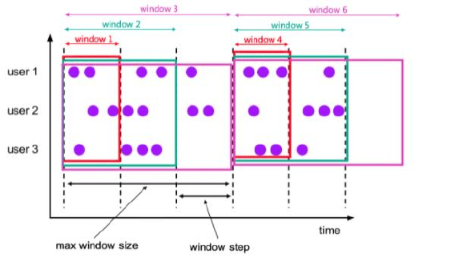

## 案例

Table API 的位置比较尴尬，它不想 DataStream 那么底层，获取不到很多的数据信息，也不像 SQL 那样方便，所以大部分的时间都不用。

**依赖引入**

想要在代码中使用 Table API，则必须使用相关依赖。

```xml
<dependency>
    <groupId>org.apache.flink</groupId>
    <artifactId>flink-table-api-java-bridge_${scala.binary.version}</artifactId>
    <version>${flink.version}</version>
</dependency>
```

如果希望在本地的 IDE 中运行 Table API 和 SQL，则需要引入以下依赖：

```xml
<dependency>
    <groupId>org.apache.flink</groupId>
    <artifactId>flink-table-planner-blink_${scala.binary.version}</artifactId>
    <version>${flink.version}</version>
</dependency>
<dependency>
    <groupId>org.apache.flink</groupId>
    <artifactId>flink-streaming-scala_${scala.binary.version}</artifactId>
    <version>${flink.version}</version>
</dependency>
```

planner 是计划器，是 Table API 的核心组件，负责提供运行时环境并生成程序的执行计划。Flink 安装包会自带 planner，所以生产不需要。

**案例**

```java
StreamExecutionEnvironment env = StreamExecutionEnvironment.getExecutionEnvironment();
env.setParallelism(1);

SingleOutputStreamOperator<Event> eventStream = env.addSource(new ClickSource())
    .assignTimestampsAndWatermarks(
        WatermarkStrategy.<Event>forBoundedOutOfOrderness(Duration.ZERO)
            .withTimestampAssigner(new SerializableTimestampAssigner<Event>() {
              @Override
              public long extractTimestamp(Event event, long l) {
                return event.getTimeStamp();
              }
            })
    );

// 1. 创建一个表的执行环境
StreamTableEnvironment tableEnv = StreamTableEnvironment.create(env);
// 2. 将 DataStream 转换为 Table
Table table = tableEnv.fromDataStream(eventStream);
// 3. 直接写 SQL 进行转换，timestamp 本身是关键字，加上反引号
Table midTable = tableEnv.sqlQuery(String.format("SELECT user, url， `timestamp` FROM %s", table));
// 4. 基于 Table 直接进行转换，使用 $() 达到了和写 SQL 相同的目的
Table resultTable = midTable.select($("user"), $("url")).where($("user").isEqual("Alice"));
// 5. 将 Table 再转换回 DataStream
tableEnv.toDataStream(resultTable).print("result");

env.execute();
```

## 基本 API

其实最标准的逻辑，是绕过 DataStream，直接进行 API 操作，不需要再经过 DataStream 再次进行一次转换操作。

**执行环境**

对于 Flink 而言，Table API 和 SQL 需要一个特别的表环境 TableEnvironment，主要负责：

1. 注册 Catalog（管理元数据，默认叫做 default_catalog） 和表。
2. 执行 SQL 查询。
3. 注册 UDF。
4. DataStream 和表之间进行相互转换。

```java
EnvironmentSettings settings = EnvironmentSettings.newInstance()
    .inStreamingMode()
    .useBlinkPlanner()
    .build();

TableEnvironment env = TableEnvironment.create(settings);
// 可选，设置 catalog 和 database
env.useCatalog("custom_catalog");
env.useDatabase("custom_database");
```

默认情况就是 Blink 版本的 planner 的流处理模式，批处理模式需要老版本的 planner，不建议用了。

我们可能需要引入依赖支持，比如 csv：

```xml
<dependency>
    <groupId>org.apache.flink</groupId>
    <artifactId>flink-csv</artifactId>
    <version>${flink.version}</version>
</dependency>
```

**创建表**

表环境中会唯一维护一个目录（catalog）和表的对应关系，所以确定唯一一张表有三部分：

- catalog
- database
- table

表的 id 就是 `${catalog}.${database}.${table}`

创建表的方式有两种：连接器（connect tables）和虚拟表（virtual tables）。

---

连接器表，就是通过连接器连接到一个外部系统，然后定义对应的表结构。

例如，通过连接到 kafka 或者文件系统，将存储在外部系统的数据以表的形式定义出来，这样直接可以对外部系统进行读写了。

```java
String sql = "CREATE TABLE clicks (" +
    " user_name STRING, " +
    " url STRING, " +
    " ts BIGIN " +
    ") WITH (" +
    " 'connector' = 'filesystem'," +
    " 'path' = 'input/clicks.txt'," +
    " format = 'csv' " +
    ")";
// 这里是 executeSql，是真正创建一张表
env.executeSql(sql);
```

---

连接表其实是真正连接数据源的，是真正有数据的。而虚拟表不同，类似于视图，是虚拟的，不会直接保存表的内容，而是在执行的时候将对应的查询语句执行。

```java
// 直接传入一条 SQL 语句作为参数进行查询，得到的 clicks 是一个中间结果，这个中间结果需要在环境中注册
Table clicks = env.sqlQuery("SELECT * FROM clicks");
// 在环境中进行注册
env.createTemporaryView("clicks", clicks);
```

我们其实也可以将 DataStream 转换为 Table，然后注册，这其实是 Table 和 DataStream 相互切换的一种很好的方式。

```java
StreamExecutionEnvironment env = StreamExecutionEnvironment.getExecutionEnvironment();
env.setParallelism(1);

SingleOutputStreamOperator<Event> eventStream = env.addSource(new ClickSource())
    .assignTimestampsAndWatermarks(
        WatermarkStrategy.<Event>forBoundedOutOfOrderness(Duration.ZERO)
            .withTimestampAssigner(new SerializableTimestampAssigner<Event>() {
              @Override
              public long extractTimestamp(Event event, long l) {
                return event.getTimeStamp();
              }
            })
    );

// 1. 创建一个表的执行环境
StreamTableEnvironment tableEnv = StreamTableEnvironment.create(env);
// 2. 将 DataStream 转换为 Table
Table table = tableEnv.fromDataStream(eventStream);
// 3. 直接写 SQL 进行转换，timestamp 本身是关键字，加上反引号
Table midTable = tableEnv.sqlQuery(String.format("SELECT user, url， `timestamp` FROM %s", table));
// 4. 基于 Table 直接进行转换，使用 $() 达到了和写 SQL 相同的目的
Table resultTable = midTable.select($("user"), $("url")).where($("user").isEqual("Alice"));
// 5. 将 Table 再转换回 DataStream
tableEnv.toDataStream(resultTable).print("result");

env.execute();
```

**查询、输出表**

表的查询其实也可以认为是流数据的转换。Flink 可以使用 SQL 和 Table API 进行执行。

```java
StreamExecutionEnvironment streamEnv = StreamExecutionEnvironment.getExecutionEnvironment();
StreamTableEnvironment env = StreamTableEnvironment.create(streamEnv);

// 使用 sqlQuery，直接查询数据
Table sqlTable = env.sqlQuery("SELECT name FROM clicks");
// 可以将得到的结果集直接输出到表中
sqlTable.executeInsert("clicks");
// 也可以执行 executeSql，进行插入
env.executeSql("INSERT INTO clicks (1, 2, 3)");

// 也可以使用 api，直接从表环境中获取表（假如之前注册过）
Table apiTable = env.from("clicks");
Table resultTable = apiTable.where($("user_name").isEqual("Bob")).select($("user_name"), $("url"));
env.createTemporaryView("resultTable", resultTable);
```

## 流处理

### 持续查询

对于流处理而言，用 SQL 其实是一件很麻烦的事情，因为 SQL 的场景一般都是有界流，数据的多少是固定死的，结果也不会有变化。但是对于无界流而言，使用 SQL 必须要根据接收到的数据持续更新查询结果。

由此而来了两个概念：动态表、持续查询。

动态表是 Table API 和 SQL 的核心概念，指的就是表会不断进行动态变化。其实在传统的关系型数据库中，都有视图、物化视图的概念。动态表就借鉴了此思想。

随着新数据到来而不断更新查询到的结果，被称为持续查询。对于动态表的查询操作都是持续查询，查询的结果也是一个动态表。

每次数据到来都会触发查询操作，因此可以认为，一次查询是针对当前数据的快照进行查询，连续不断的快照就是持续查询。

过程如下：

1. 流转换为动态表。
1. 动态表进行持续查询，得到新的动态表。
1. 新的动态表转换为流。

以上步骤，就是利用流和动态表的转换，将我们需要的内容从持续的流中抽取出来，然后转换为我们需要的流进行处理。

**更新查询**

```java
StreamExecutionEnvironment env = StreamExecutionEnvironment.getExecutionEnvironment();
env.setParallelism(1);

DataStreamSource<Event> eventStream = env.fromElements(
    new Event("Alice", "./home", 1000L),
    new Event("Bob", "./cart", 1000L),
    new Event("Alice", "./prod?id=1", 5 * 1000L)
);

// 得到表环境并注册表
StreamTableEnvironment tableEnv = StreamTableEnvironment.create(env);
tableEnv.createTemporaryView("EventTable", eventStream);

// 统计用户点击次数
Table urlCountTable = tableEnv.sqlQuery("SELECT user, count(url) as num FROM EventTable GROUP BY user");

// 将表转换为数据流，在控制台打印输出
tableEnv.toChangelogStream(urlCountTable).print("count");

env.execute();
```

因为数据流会不停到来，那么统计结果也可能会不停增长，这里的数据结果可以是简单的插入，也可以是对之前的结果进行更新。

换言之，更新日志 changelog 可以是 insert 和 update。这种持续查询被称为更新查询 update query，更新查询的结果想要转换为 dataStream 则必须调用 `toChangelogStream()`。

具体步骤为：

1. 查询启动时，原动态表为空。
1. 第一个数据插入表时，开始计算结果表，`urlCountTable` 插入第一行数据。
1. 第二个数据插入表时，开始计算结果表，`urlCountTable` 将更新结果表，假如 key 相同（如都是 Alice）则更新原始数据。不同则插入新行。
1. ……
1. 循环往复。


**追加查询**

其实对于上面的聚合操作来讲，数据不同则最后产生的结果不同。但是还有一种情况是追加查询。也就是说，结果表中只有 insert 没有 update。

比如我们只需要使用 `SELECT user, url FROM EventTable`，那么无论之前的数据是啥，新加入的数据都不会影响到之前的结果。

这种叫做追加查询，它可以直接用 `toDataStream()`，当然他也可以用 `toChangelogStream()`。

那么我们就有了一个结论：假如算上新加入的数据，再算一次之前的 SQL，之前的结果发生改变，就是更新查询。假如算上新加入的数据，再算一次之前的 SQL，之前的结果不变，就是追加查询。

---

这里的追加查询其实还有一种特殊的情况，就是涉及到窗口的查询。我们以聚合查询做一个例子，原本的聚合查询应该是一个更新查询的操作，但是涉及到窗口就不是了。

窗口的统计结果会一次性写入结果表，所以在最后的更新日志流中，只有 insert 操作，没有 update 操作，可以直接调用 `toDataStream()` 转换为数据流。

需要注意的是，涉及到时间窗口，我们还需要为事件时间指定时间戳和水位线，例如：

```java
import static org.apache.flink.table.api.Expressions.$;

StreamExecutionEnvironment env = StreamExecutionEnvironment.getExecutionEnvironment();
env.setParallelism(1);

SingleOutputStreamOperator<Event> eventStream = env
    .fromElements(
        new Event("Alice", "./home", 1000L),
        new Event("Bob", "./cart", 1000L),
        new Event("Alice", "./prod?id=1", 5 * 1000L)
    )
    .assignTimestampsAndWatermarks(
        WatermarkStrategy
            .<Event>forMonotonousTimestamps()
            .withTimestampAssigner(new SerializableTimestampAssigner<Event>() {
                @Override
                public long extractTimestamp(Event event, long l) {
                return event.getTimeStamp();
                }
            })
    );

StreamTableEnvironment tableEnv = StreamTableEnvironment.create(env);
// 指定时间属性为 timeStamp，并且命名为 ts
Table table = tableEnv.fromDataStream(eventStream, $("user"), $("url"), $("timeStamp").rowtime().as("ts"));
tableEnv.createTemporaryView("EventTable", table);

Table result = tableEnv.sqlQuery(
    "SELECT " +
            "user, " +
            "window_end AS endTime, " +
            "count(url) AS num " +
        "FROM TABLE( " +
            "TUMBLE( " +
                "TABLE EventTable, " +
                "DESCRIPTOR(ts), " +
                "INTERVAL '1' HOUR " +
            ") " +
            ") " +
        "GROUP BY user, window_start, window_end"
);
tableEnv.toDataStream(result).print();

env.execute();
```

**查询限制**

实际应用中，有些持续查询会因为计算代价太高而受到限制。代价太高，指的就是需要维护的状态持续增长，或者更新数据计算太复杂。

用流处理的持续查询，可能会运行几周、几个月。所以持续查询的数据总量可能会相当高，维护的状态也逐渐增长，最后可能会导致存储空间占用过高导致查询失败。

那对于更新计算来说，新的数据到来可能数据要全部重新计算，那么这种更新操作可能代价极大，这种查询操作就不太适合连续查询执行。

### 流表对应关系

动态表转为流或者写入外部系统中时，动态表也有 insert、update、delete 等操作，那么对于流来说，其实就只有两种编码方式：追加流（append-only）、撤回流（retrace）。

这两种编码方式组合称为 insert、delete、update。其中 update 有点特殊，就是 delete + insert，对应流的编码方式就是 retrace + append-only。

## 时间和窗口

在 Table API 和 SQL 中，在表的 schema 中其实就有时间属性，可以在 DDL 直接定义，也可以在转为 Table 时定义，一旦定义就可以作为一个普通字段使用，也可以在基于时间的操作中使用。

时间属性的类型为 timestamp，更像是常规的时间戳，可以访问，可以进行计算。按照事件语义不同，我们将时间属性划分为事件时间和处理时间。

### 事件时间

事件时间，其实就是事件产生的时间，也是最常用的时间。它一般会用作处理乱序事件或者迟到事件的参考依据，配合水位线就可以进行计算。

事件时间可以在 DDL 中定义，也可以在流表转换时定义。

```sql
CREATE TABLE EventTable (
    user STRING,
    url STRING,
    ts TIMESTAMP(3),
    WATERMARK FOR ts AS ts - INTERVAL '5' SECOND
) WITH (
    ……  
);
```

- ts 作为事件时间属性，而且 ts 设置了 5s 的水位线延迟时间，所以给到了 ` - INTERVAL '5' SECOND`，可以写作 `SECOND` 或者 `SECONDS`。
- 事件时间必须为 `TIMESTAMP` 或者 `TIMESTAMP_LTZ` ，LTZ 指带有本地时区信息的时间戳。

```java
SingleOutputStreamOperator<Event> eventStream = env
    .fromElements(
        new Event("Alice", "./home", 1000L),
        new Event("Bob", "./cart", 1000L),
        new Event("Alice", "./prod?id=1", 5 * 1000L)
    )
    // 提取时间戳，生成水位线
    .assignTimestampsAndWatermarks(
        WatermarkStrategy
            .<Event>forMonotonousTimestamps()
            .withTimestampAssigner(new SerializableTimestampAssigner<Event>() {
              @Override
              public long extractTimestamp(Event event, long l) {
                return event.getTimeStamp();
              }
            })
    );

StreamTableEnvironment tableEnv = StreamTableEnvironment.create(env);
// 设置 timeStamp 为事件时间
Table table = tableEnv.fromDataStream(eventStream, $("user"), $("url"), $("timeStamp").rowtime().as("ts"));
tableEnv.createTemporaryView("EventTable", table);
```

### 处理时间

处理时间，就是时间到达时，系统的时间。

```sql
CREATE TABLE EventTable (
    user STRING,
    url STRING,
    ts AS PROCTIME()
) WITH (
    ……  
);
```

```java
Table table = tableEnv.fromDataStream(eventStream, $("user"), $("url"), $("ts").proctime());
```

### 窗口

自 1.13 版本开始，Flink 开始使用窗口表值函数（TVFs）定义窗口。Flink 提供了以下几个窗口 TVF：

- 滚动窗口（Tumbling Windows）

    与 DataStream API 定义的完全一致，实现方式为：
    
    ```sql
    TUMBLE(Table EventTable, DESCRIPTOR(ts), INTERVAL '1' HOUR)
    ```

    基于时间字段 ts，对表 EventTable 开了一个大小为 1h 的滚动窗口。

- 滑动窗口（Hop Windows）

    与 DataStream API 定义的完全一致，实现方式为：

    ```sql
    HOP(Table EventTable, DESCRIPTOR(ts), INTERVAL '5' MINUTES, INTERVALE '1' HOURS)
    ```

    创建了 1h 滑动窗口，5m 滑动一次。需要注意，第三个参数是 slide 滑动步长，第四个才是窗口大小。

- 累计窗口（Cumulate Windows）

    累计窗口，会在统计周期内进行累加计算，计算窗口中有两个参数：最大窗口长度、步长 step。

    第一个窗口大小就是步长 step 大小，之后每个窗口都会在之前的窗口的基础上再加一个扩展 step 的长度，直到达到窗口最大长度。

    

    如上图，第一个 windows1 就是 step 长度，第二个 windows2 就是 step + step，第三个是 3 * step，然后到达最大窗口长度。

    这样做的好处是每个 step 都会输出一次结果。滚动窗口和滑动窗口只会输出一次，但是累计窗口会输出多次。

    ```sql
    CUMULATE(TABLE EventTable, DESCRIPTOR(ts), INTERVAL '1' HOURS, INTERVALE '1' DAY)
    ```

    这里指定了累计窗口的统计周期为 1day，步长为 1h。

- 会话窗口（Session Windows，未完全支持）

## 聚合查询

### 分组聚合

```java
StreamExecutionEnvironment env = StreamExecutionEnvironment.getExecutionEnvironment();
env.setParallelism(1);

StreamTableEnvironment tableEnv = StreamTableEnvironment.create(env);
TableConfig tableConfig = tableEnv.getConfig();
tableConfig.setIdleStateRetention(Duration.ofMinutes(60));

Table result = tableEnv.sqlQuery(
    "SELECT user, count(url) AS num FROM EventTable GROUP BY user"
);
```

随着时间增大，状态占用的空间可能会持续增长，为了防止无休止的增长耗尽资源，设置了状态的生存时间 TTL。配置 TTL 可能会导致计算结果不准确，但这其实是以牺牲正确性为代价获取了资源释放。

### 窗口聚合

窗口聚合，就是将数据划分为有界流数据集（开窗），然后窗口内做聚合。

```java
Table result = tableEnv.sqlQuery(
    "SELECT " +
          "user, " +
          "window_end AS endTime, " +
          "count(url) AS num " +
        "FROM TABLE( " +
          "TUMBLE( " +
              "TABLE EventTable, " +
              "DESCRIPTOR(ts), " +
              "INTERVAL '1' HOUR " +
            ") " +
          ") " +
        "GROUP BY user, window_start, window_end"
);
```

### 开窗聚合

开窗聚合和窗口聚合不同，他是采用 over 聚合。这种方式无论是在 spark 还是在 hive 中都是有提到的。

```sql
SELECT 
    user,
    ts,
    count(url) OVER (PARTITION BY user, ORDER BY ts, RANGE BETWEEN INTERVAL '1' HOUR PRECEDING AND CURRENT ROW) AS num
FROM EventTable;
```

## 函数

### 系统函数

1. 标量函数（只对输入数据做转换，返回一个值的函数）

    - 比较函数：`value1 = value2`、`value 1 <> value2`、`value IS NOT NULL`
    - 逻辑函数：`boolean1 AND boolean2`、`boolean1 IS FALSE`、`NOT boolean1`
    - 算数函数：`num1 + num2`、`power(num1, num2)`（num1 的 num2 次方）、`rand()`（返回 0.0 - 1.0 之间的一个伪随机数）
    - 字符串函数：`str1 || str2`（两个字符串链接）、`upper(str1)`、`char_length(str1)`
    - 时间函数：`DATE str1`（按照 yyyy-MM-dd 解析，返回 Date）、`TIMESTAMP str1`（按照 yyyy-MM-dd HH:mm:ss[.SSS] 解析，返回 timestamp）

1. 聚合函数

    - `count(*)`
    - `sum()`
    - `rank()`：返回当前值在一组值的排名。
    - `row_number()`：组内排序后，返回当前值的行号。

### UDF

自定义函数，UDF，无论是 spark 和 hive 都有用过。

UDF 也有几类：

- 标量函数 Scalar Functions：一个输入一个输出。
- 表函数 Table Functions：一个输入多个输出。
- 聚合函数 Aggregate Functions：多个输入一个输出。
- 表聚合函数 Table Aggregate Functions：多个输入多个输出。

#### 总流程

1. 定义 udf 函数。
1. 调用表环境注册

    ```java
    StreamTableEnvironment tableEnv = StreamTableEnvironment.create(env);
    tableEnv.createTemporarySystemFunction("CustomerUDF", CutsomerUDF.class);
    ```

1. Table API 调用

    使用 `call()` 方法调用自定义函数，参数为：注册的函数名、函数调用时的参数。

    ```java
    tableEnv.from("EventTable").select(call("CustomerUDF"), $("field"));
    ```

    另外，Table API 也可以不进行注册，直接调用，写法如下：

    ```java
    tableEnv.from("EventTable").select(call(CutsomerUDF.class, $("field")));
    ```

1. SQL 中调用函数

    SQL 需要首先注册，然后调用方式就和内置函数一致。

    ```java
    tableEnv.sqlQuery("SELECT CustomerUDF(field) FROM EventTable");
    ```

#### 标量函数

标量函数是一对一的转换，有以下要求：

- 必须继承 `ScalarFunction`
- 必须实现 `eval()` 方法，但是可以多次重载。

需要说明，抽象类中没有要求定义 `eval()`，所以我们不能直接进行重写，但是 SQL 和 Table API 要求必须是 `eval()`，这也是未来需要改进的地方。

```java
import org.apache.flink.table.annotation.DataTypeHint;
import org.apache.flink.table.annotation.InputGroup;
import org.apache.flink.table.functions.ScalarFunction;

public class CutsomerUDF extends ScalarFunction {

  /**
   * 接受任意类型输入，返回 Integer
   * @param o 任意类型，这个 DataTypeHint 对输入参数类型进行了标注，表示为任意类型 
   * @return Integer
   */
  public Integer eval(@DataTypeHint(inputGroup = InputGroup.ANY) Object o) {
    return o.hashCode();
  }
}
```

#### 表函数

表函数，一对多：

- 必须继承 `TableFunction<T>`。
- 必须实现 `eval()`，可重载。
- 没有返回值，需要使用 `collect()` 向下游发送数据，类似 `flatMap`。

```java
import org.apache.flink.table.annotation.DataTypeHint;
import org.apache.flink.table.annotation.FunctionHint;
import org.apache.flink.table.functions.TableFunction;
import org.apache.flink.types.Row;

import java.util.Arrays;

/**
 * 输出类型标注为 ROW，包含两个字段 word、length
 */
@FunctionHint(output = @DataTypeHint("ROW<word STRING, length INT>"))
public class CutsomerUDF extends TableFunction<Row> {
  
  public void eval(String words) {
    Arrays.asList(words.split(" ")).forEach(word -> {
      collect(Row.of(word, word.length()));
    });
  }
}
```

#### 聚合函数

多对一，要求为：

- 继承 `AggregateFunction<T, ACC>`。

    T 代表结果，ACC 是聚合的中间状态。

    原理如下：

    1. 需要一个累加器 accumulator 保存中间结果。
    1. 对每一行输入数据会调用 `accumulate()` 方法来更新。
    1. 所有数据处理完成之后，调用 `getValue()` 来计算并返回最终结果。

- 实现 `createAccumulator()`
- 实现 `accumulate()`，此方法无法直接重写，只能手动实现。
- 实现 `getValue()`。

```java
public class WeightedAvgAccumulator {

  // 加权值
  public Long sum = 0L;
  // 数据量
  public Long count = 0L;
}
```

```java
import org.apache.flink.table.functions.AggregateFunction;

public class CutsomerUDF extends AggregateFunction<Long, WeightedAvgAccumulator> {

  @Override
  public WeightedAvgAccumulator createAccumulator() {
    return new WeightedAvgAccumulator();
  }

  public void accumulate(WeightedAvgAccumulator acc, Long value, Integer weight) {
    acc.sum += value * weight;
    acc.count += weight;
  }

  @Override
  public Long getValue(WeightedAvgAccumulator acc) {
    return acc.count == 0 ? null : acc.sum / acc.count;
}
```

#### 表聚合函数

将表聚合为另一张表，也就是多对多，要求：

- 必须继承 `TableAggregateFunction<T, ACC>`。
- 必须实现 `createAccumulator()`、`accumulate()`。
- 必须实现 `emitValue()`。

    `emitValue()` 类似 `getValue()`，不过没有输出类型，是调用 `collect()` 向下游输出。
    
    没有重写，只能手动写。

    表聚合得到的是一张表，流处理会把这张表重新计算输出。但是假如只更新了几条数据，那么效率显然不够高效。

    为了提高效率，TableAggregateFunction 还提供了 `emitUpdateWithRetract()` 方法，可以在结果表发生变化时，以撤回老数据，发送新数据的方式增量更新。

    如果同时给到了 `emitValue` 和 `emitUpdateWithRetract` 会优先调用 `emitUpdateWithRetract`。

```java
import org.apache.flink.api.java.tuple.Tuple2;
import org.apache.flink.table.functions.TableAggregateFunction;
import org.apache.flink.util.Collector;

public class CutsomerUDF extends TableAggregateFunction<Tuple2<Integer, Integer>, TopAccumulator> {

  @Override
  public TopAccumulator createAccumulator() {
    return null;
  }

  public void accumulate(TopAccumulator acc, Integer value) {
    if (value > acc.first) {
      acc.second = acc.first;
      acc.first = value;
      return;
    }
    if (value > acc.second) {
      acc.second = value;
    }
  }

  public void emitValue(TopAccumulator acc, Collector<Tuple2<Integer, Integer>> out) {

    if (acc.first != Integer.MIN_VALUE) {
      out.collect(Tuple2.of(acc.first, 1));
    }
    if (acc.second != Integer.MIN_VALUE) {
      out.collect(Tuple2.of(acc.second, 2));
    }
  }
}
```

当前 SQL 没有直接进行表聚合的方式，所以需要 Table API 调用。

```java
tableEnv.from("EventTable")
    .groupBy($("filed"))
    .flatAggregate(call("CustomerUDF", $("value").as("value", "rank")))
    .select($("filed"), $("value"), $("rank"));
```