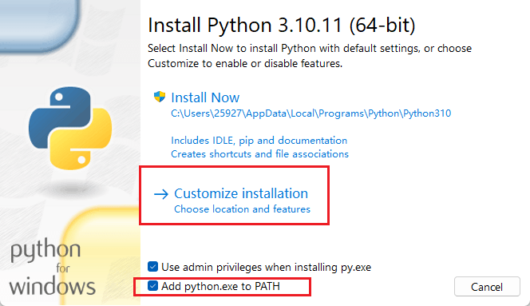

## 环境安装

[下载地址](https://www.python.org/)

3.6 是一个比较经典的版本，主要在于异步与并发，所以下载 3.6+ 就可以了，下载倒数第二新的即可，下载 windwos installer 即可。

1. 自定义安装

    

    

    

    python 解释器，一次能执行一条数据

    

1. 环境变量

    若之前没有勾选添加到 PATH，可以手动添加到环境变量

    

1. 代码规范

    pep8 规范，官方代码风格指南：

    1. 缩进：使用四个空格表示缩进。
    1. 行长：每行代码不应当超过 79 个字符。
    1. 命名：变量名小写字母开头，下划线分割多个单词。类名大写字母开头，驼峰命名法。
    1. 空格：运算符两侧、逗号、冒号后应当添加空格。
    1. 函数和类：函数和类之间应当使用两个空行分割。
    1. 导入：每个导入应当单独成行，避免通配符导入。
    1. 括号：函数调用和定义中，括号内应当没有空格。

## 基础语法

### 布尔值

关于 True 和 False，几乎所有空的东西都可以认为是 False：

```python
# 除了 0 之外的数字全都是 True，包括负数
bool(0)
# 完全的空字符串为 False，中间有值就是 True（包括空格）
bool("")
bool([])
bool({})
bool(set())
bool(tuple())
bool(None)
```

### 正则表达式

正则表达式(regular expression)描述了一种字符串匹配的模式（pattern）

正则匹配是一个 模糊的匹配(不是精确匹配)

re：python自1.5版本开始增加了re模块，该模块提供了perl风格的正则表达式模式，re模块是python语言拥有了所有正则表达式的功能

如下四个方法经常使用
- match()
- search()
- findall()
- finditer()

#### 匹配规则

- 单个字符与数字

    | 匹配         | 说明                                                                                    |
    |--------------|-----------------------------------------------------------------------------------------|
    | .            | 匹配除换行符以外的任意字符，当 flags 被设置为 re.S 时，可以匹配包含换行符以内的所有字符 |
    | []           | 里面是字符集合，匹配[]里任意一个字符                                                    |
    | [0123456789] | 匹配任意一个数字字符                                                                    |
    | [0-9]        | 匹配任意一个数字字符                                                                    |
    | [a-z]        | 匹配任意一个小写英文字母字符                                                            |
    | [A-Z]        | 匹配任意一个大写英文字母字符                                                            |
    | [A-Za-z]     | 匹配任意一个英文字母字符                                                                |
    | [A-Za-z0-9]  | 匹配任意一个数字或英文字母字符                                                          |
    | [^lucky]     | []里的^称为脱字符，表示非，匹配不在[]内的任意一个字符                                   |
    | ^[lucky]     | 以[]中内的某一个字符作为开头                                                            |
    | \d           | 匹配任意一个数字字符，相当于[0-9]                                                       |
    | \D           | 匹配任意一个非数字字符，相当于`[^0-9]`                                                  |
    | \w           | 匹配字母、下划线、数字中的任意一个字符，相当于[0-9A-Za-z_]                              |
    | \W           | 匹配非字母、下划线、数字中的任意一个字符，相当于`[^0-9A-Za-z_]`                         |
    | \s           | 匹配空白符(空格、换页、换行、回车、制表)，相当于[ \f\n\r\t]                             |
    | \S           | 匹配非空白符(空格、换页、换行、回车、制表)，相当于`[^ \f\n\r\t]`                        |

- 锚字符

    | 匹配 | 说明                                                                                          |
    |------|-----------------------------------------------------------------------------------------------|
    | ^    | 行首匹配，和[]里的^不是一个意思                                                               |
    | $    | 行尾匹配                                                                                      |
    | \A   | 匹配字符串的开始，和^的区别是\A只匹配整个字符串的开头，即使在re.M模式下也不会匹配其他行的行首 |
    | \Z   | 匹配字符串的结尾，和$的区别是\Z只匹配整个字符串的结尾，即使在re.M模式下也不会匹配其他行的行尾 |

    `\A`、`\Z` 和 `^`、`$` 是完全相同的，只有在使用 re.M 时有区别。

- 限定符

    | 匹配   | 说明                                                 |
    |--------|------------------------------------------------------|
    | (xyz)  | 匹配括号内的xyz，作为一个整体去匹配  一个单元 子存储 |
    | x?     | 匹配0个或者1个x，非贪婪匹配                          |
    | x*     | 匹配0个或任意多个x                                   |
    | x+     | 匹配至少一个x                                        |
    | x{n}   | 确定匹配n个x，n是非负数                              |
    | x{n,}  | 至少匹配n个x                                         |
    | x{n,m} | 匹配至少n个最多m个x                                  |
    | x\|y   | \|表示或的意思，匹配x或y                             |

#### re 模块中常用函数

##### 通用函数

获取匹配结果

- 使用 group() 方法 获取到匹配的值
- groups() 返回一个包含所有小组字符串的元组(也就是自存储的值)，从 1 到 所含的小组号。

##### re.search()

re.search() 扫描整个字符串，并且返回第一个符合 pattern 模式的匹配，匹配失败返回 None

```python
import re

# 123
re.search('\d{3}', '123456').group()
```

##### re.match()

re.match() 扫描所有字符串，只匹配一次，但是符合条件的数据必须从第一位开始，类似 re.search("^条件", 'xxx')

```python
import re

# None
re.match('\d{3}', 'a123456')
```

##### re.findall()

re.findall() 扫描整个字符串，并且返回所有符合 pattern 模式的匹配（形成一个列表），匹配失败返回空列表

```python
import re

# ['123', '456']
re.findall('\d{3}', 'a123456')
```

##### finditer()

re.finditer() 扫描整个字符串，并且返回一个迭代器

```python
import re

# <callable_iterator object at 0x000001BD12034820>
print(re.finditer('\d{3}', 'a123456'))
# [<re.Match object; span=(1, 4), match='123'>, <re.Match object; span=(4, 7), match='456'>]
print([object for object in re.finditer('\d{3}', 'a123456')])
# ['123', '456']
print([object.group() for object in re.finditer('\d{3}', 'a123456')])
```

##### re.split()

re.split() 根据 pattern 拆分字符串，返回数组。

```python
import re

str = 'abc1d2e3fg'

# ['abc', 'd', 'e', 'fg']
print(re.split('\d', str))

# ['abc', 'd', 'e3fg']，maxsplit 代表最大拆分 n 次，默认全拆分
print(re.split('\d', str, maxsplit=2))
```

##### 通用 flags（修正符）

| 值   | 说明                            |
|------|---------------------------------|
| re.I | 是匹配对大小写不敏感            |
| re.M | 多行匹配，影响到 ^ 和 $         |
| re.S | 使.匹配包括换行符在内的所有字符 |

```python
import re

str = '''
<a href="https://www.baidu.com">百度1</a>
<A href="https://www.baidu.com">百度</A>
<a href="https://www.baidu.com">百度2</a>
<a href="https://www.baidu.com">百
度</a>
'''

# []
print(re.findall('<a href="https://www.baidu.com">百度</a>', str))

# ['<A href="https://www.baidu.com">百度</A>']
print(re.findall('<a href="https://www.baidu.com">百度</a>', str, flags=re.I))

# ['<a href="https://www.baidu.com">百度1</a>\n<A href="https://www.baidu.com">百度</A>\n<a href="https://www.baidu.com">百度2</a>\n<a href="https://www.baidu.com">百\n度</a>']
print(re.findall('<a href="https://www.baidu.com">百.*度</a>', str, flags=re.S))
```

另外，使用 `re.M` 时会影响 `\A`、`\Z` 和 `^`、`$`。使用 ^、$ 会全部行中匹配首位，但是 \A、\Z 不变，依然是每行的行首行尾匹配。

#### 贪婪模式与非贪婪模式

- 贪婪模式：匹配尽可能多的字符

    .+  匹配换行符以外的字符至少一次
    
    .*  匹配换行符以外的字符任意次

    ```python
    res = re.search('<b>.+</b>', '<b></b><b>b标签</b>')
    res = re.search('<b>.*</b>', '<b>b标签</b><b>b标签</b><b>b标签</b><b>b标签</b>')
    ```

- 非贪婪模式：尽可能少的匹配称为非贪婪匹配，*?、+?即可

    .+?  匹配换行符以外的字符至少一次，但是拒绝贪婪

    .*?   匹配换行符以外的字符任意次，但是拒绝贪婪

    ```python
    res = re.search('<b>.+?</b>', '<b>b标签</b><b>b标签</b>')
    res = re.search('<b>.*?</b>', '<b>b标签</b><b>b标签</b><b>b标签</b><b>b标签</b>')
    ```

#### 分组起名称

正则表达式除了简单的判断功能之外，还可以给匹配到的正则组中起名字。

当使用多个子存储时，使用别名比较方便，使用 `?P<name>` 即可给组起名字。

```python
import re

str = '3G4HFD567'

print(re.match('(?P<number>\d+)', str).group(0))
print(re.match('(?P<number>\d+)', str).group('number'))
```

#### 预编译

在 python 中，为了优化语法，可以将当前正则编译为对象，然后可以根据对象进行匹配。优化后的对象可以多次使用。

```python
import re

pattern = re.compile('^1[3-9][0-9]{9}$')
match = pattern.search('15275926193')
if match:
    print(match.group())
```

## 文件操作

1. 文件基本操作

    ```python
    # 打开文件
    f = open(filename)

    # 写操作
    f.write('hello world')
    # 读操作
    f.read()

    # 保存关闭
    f.close()
    ```

    python 的文件比较傻，要么打开文件之后一次只能读或者只能写

    所以我们打开一个文件时，需要指定以什么方式打开（文本模式时）：

    - `r` 只读模式
    - `w` 创建模式，若文件已经存在，则覆盖旧文件
    - `a` 追加模式，新数据会写到文件末尾

    ```python
    # 用写文件模式打开文件
    f = open('name_list', mode='w')
    f.write('hello')
    f.write('\n')
    f.write('world')
    f.close()
    ```

    ::: details
    ```python
    # 用写文件模式打开文件，默认使用 read 方式打开文件
    f = open('name_list', mode='r')

    # 把所有数据都读出来
    print(f.read())

    # 读一行
    # 注意，f 的每一个 read 操作都有索引值，每个 read 都会将索引向后一行
    # 所以假如现进行了一个 read，然后进行 readline，就会发现没有值输出了
    print(f.readline())

    # 将后面的值用数组形式展示
    # 注意，回车符号是和上一行放在一起的，如 ['hello\n', 'world']
    print(f.readlines())

    f.close()
    ```
    :::

    ```python
    # 用写文件模式打开文件
    # 追加模式，不会覆盖文件，写日志可以用
    f = open('name_list', mode='a')

    f.write('a')
    f.write('b')
    f.write('c')

    f.close()
    ```

    其他：

    - `w+`: 写读，创建一个新文件，写一些内容再把内容读出来，一般没有意义。
    - `r+`: 读写，能读能写，但是写都在文件末尾，也就是 append。
    - `a+`: 追加读，文件打开时光标会在文件末尾，写的数据全都为追加形式。

1. 文件遍历

    ```python
    f = open('name_list')

    # 进行每行的循环
    for line in f:
        # 每行在最后默认都有一个换行符 \n，默认是打印的，如果想要不打印就填写参数 `end=""`
        print(line, end="")

    f.close()
    ```

1. 操作二进制文件，操作编码格式

    一般来说，打开文本内容直接指定对应的编码格式即可，比如 utf-8、gbk 等 `f = open('a', encoding='gbk')`

    但是打开图片这种内容不行，没有什么编码格式可以展示图片，所以干脆使用二进制，也就是直接改为 0101 的格式

    可以使用二进制打开文件：

    - `rb` 二进制只读模式
    - `wb` 二进制创建模式
    - `ab` 二进制追加模式

    ```python
    f = open('img.png', mode='rb')

    # 进行每行的循环
    for line in f:
        # 每行在最后默认都有一个换行符 \n，默认是打印的，如果想要不打印就填写参数 `end=""`
        print(line, end="")

    f.close()
    ```

    ```python
    f = open('file', mode='wb')

    # 注意必须要使用二进制写入，否则直接写文本就报错
    f.write('hello'.encode('utf-8'))

    f.close()
    ```

1. 其他

    - `seek(n)`: 把光标移动到指定位置。
        
        但是光标位置按照字节的，GBK 编码中文就 2 字节，UTF8 编码中文就 3 字节
    
    - `tell()`: 光标当前位置。

## 函数编程

函数使用 `def` 做定义，使用形参（位置参数）标定占位符，默认参数直接写 `=xxx` 即可。

默认参数必须跟在一般参数后。

```python
def register(name, age, sex="male"):
    print(name)
    print(age)
    print(sex)

register("alex", 10)
```

如果有时候不想指定参数顺序，那么可以使用关键参数，即指定 key、value。

但是关键参数必须放到位置参数后面。

```python
def register(name, age, sex="male"):
    print(name)
    print(age)
    print(sex)

register("aray", sex="female", age=20)
```

还有一种非固定参数，即参数不知道有多少，有两种类型：

- `*args`: 将所输入的数据变为一个元组

    ```python
    def students(*students):
        print(students)

    # ('A', 'B', 'C')
    students("A", "B", "C")
    ```

- `**kwargs`: 即指定 key、value，将传入的数据变为一个字典

```python
def students(**students):
    print(students)


# {'A': 'A', 'B': 'B', 'C': 'C'}
students(A="A", B="B", C="C")
```

## 模块编程

python 自带常用三百多个模块（内置模块），又称标准库。但是仍然存在第三方开源模块，需要自行安装。除此之外，还可以自己自定义模块用来做自己的内容。

1. 导入模块：

    ```python
    # 导入模块全部内容
    import module
    # 导入模块下某个方法 / 子模块
    from module import xx
    # 导入一个方法后重命名
    from moduel.xx import xx as rename
    # 导入一个模块下所有方法，不建议使用
    from module.xx import *
    ```

1. 第三方开源模块导入：直接使用[网址](pypi.org)的模块，使用 `pip install xxx` 下载到环境中。

1. 自定义模块：

    ```python
    def my_method():
        print('HELLO WORLD')
    ```

    ```python
    import my_module

    my_module.my_method()
    ```

    如果需要导入其他文件的模块，则需要首先导入模块 `sys`，然后通过 sys 手动添加目录，添加目录之后即可自由 import

    ```python
    import sys

    sys.path.append(path)
    ```

包其实就是文件夹，可以根据业务逻辑不通将代码放到不同的文件夹下，也就是不同的包下。同样导入的时候也可以只导入特定的包。

## 面向对象

### 类和对象

```python
# python 中的类使用 class 关键字
class Dog:
    # 类中的属性
    legs_num = 4

    # 类中的函数
    def bark(self):
        print('狗叫')

    def bite(self):
        print('狗咬人')

    def fetch(self):
        print('狗捡球')


# 使用此种方式创建一个对象
alex = Dog()
alex.bite()
```

### 实例属性和类属性


在 python 中，对象寻找某个值，首先从自身这个对象空间寻找，找不到再去类的公共空间寻找。

```python
class Dog:
    legs_num = 4

    # 类中的函数
    def bark(self):
        print('狗叫')

    def bite(self):
        print('狗咬人')

    def fetch(self):
        print('狗捡球')


alex = Dog()
peiqi = Dog()

# True
print(id(alex.legs_num) == id(peiqi.legs_num))
# True，没有加括号，所以看到的是他的地址
print(id(alex.bark) == id(peiqi.bark))
```

还有一种属性叫做实例属性，和类的属性完全不同，实例属性是放到自己的地址中的。

```python
class Dog:
    legs_num = 4

    # 类中的函数
    def bark(self):
        print('狗叫')

    def bite(self):
        print('狗咬人')

    def fetch(self):
        print('狗捡球')


alex = Dog()
peiqi = Dog()

# 2394228719952
print(id(alex.legs_num))
# 2394228719952
print(id(peiqi.legs_num))

peiqi.legs_num = 5
# 2394228719984
print(id(peiqi.legs_num))

del peiqi.legs_num
# 2394228719952
print(id(peiqi.legs_num))
```

所以当下的结果已经完全清晰了。

python 在一开始初始化的时候完全采用类中的属性，但是一旦赋值，则将值放到自己的地址中。

寻找内容时，先到自己的空间去寻找，自然就找到了自己地址中的值。

但是使用 del 删除自身实例中的属性时，就又找回了类中的属性值。

在这里我们也可以和 Java 做一个对比：

在 Java 中，对象中基本属性会直接在自身中创建一个新的放起来，占用的空间也更多，但是不会出现删除之后寻找类中属性的问题。

### 实例方法 & self

```python
class Dog:
    legs_num = 4

    # 类中的函数
    def bark(self):
        print('狗叫')

    def bite(self):
        print('狗咬人')

    def fetch(self):
        print('狗捡球')


alex = Dog()
alex.bite()
```

对象中的方法就是实例方法，或者说实例能够调用的对象就是实例方法。

其中在方法中有一个 `self` 的形参，这个 `self` 形参代表的是调用该方法的实例本身。比如 `alex.bite()` 中，`bite()` 中的 `self` 就是 alex 本身。

所以注意，在传递参数的时候，第一个参数代表 self，所以第一个参数永远不用传递，不传递第一个 self 参数的话会报错。

```python
class Dog:
    legs_num = 4

    def bite(self, name):
        print(f'狗咬人{name}')


alex = Dog()
alex.bite("tom")
```

所以 self 既然代表当前实例，那么就有一个关于实例属性的问题：

如果想要在实例方法中使用实例属性，那么需要 `self.legs_num` 的方式，没有赋值之前使用的仍然是类属性，赋值后使用的是实例属性。

```python
class Dog:
    legs_num = 4

    def bite(self):
        print(f'self: {self.legs_num}')


alex = Dog()
alex.bite()

alex.legs_num = 5
alex.bite()
```

### 构造方法

首先，构造方法是一个实例中的方法，它属于一个叫做魔法系列的方法。这一系列的方法有个特点，就是需要事件触发而不需要手动调用。

构造方法是 `__init__`，它会在方法创建时就自动调用。当然，也不需要一定去写，但是它可以做一些初始化操作。

```python
class Dog:

    def __init__(self, name):
        self.name = name

    def brake(self):
        print(f'self: {self.name}')


"""
类实例化的步骤：

1. 解释器开辟一个实例对象的空间。
2. 解释器调用 __init__ 方法，实例空间地址作为 self 参数传入
3. 实例空间地址作为类实例化的返回值交给变量
"""
alex = Dog('alex')
alex.brake()
```

一切皆对象，在 python 中，字符串、列表、字典等等所有的内容都是一个个的类，我们用到的数据都是一个个具体的实例对象。

区别就是，这些类是在解释器级别注册好的，而我们只不过是自定义而已，所以我们自定义的类实例对象也可以和其他数据对象一样传参、赋值等：

1. 任何一个实例对象都属于本身类型
1. 自定义类型对象属于可变数据类型
1. 实例对象也可以变量传递，作为函数传参，作为函数返回值

### 类对象、类属性、类方法

类对象和 python 对象是两码事，类对象的地址直接指向类的空间，同样类属性也一样。

实例对象一开始会指向类的地址，但是赋值之后就会指向自己实例的地址值。

那么想要直接获取类的地址，直接使用类名即可，这个类名就是类对象。

```python
class Dog:
    legs_num = 4

    def __init__(self, name):
        # 每次实例化操作就可以执行这个代码，将 legs_num + 1
        Dog.legs_num += 1
        self.name = name

    def brake(self):
        print(f'self: {self.name}')


# 直接获取
print(Dog.legs_num)
# 这个不可以调用，因为没有 self，实例方法必须要给一个 self
Dog.brake()
```

那么类方法其实也是单独属于类的

```python
class Dog(object):
    legs_num = 4

    @classmethod
    def get_legs_num(cls):
        print(f'{cls.legs_num}')

    def return_legs_num(self):
        # 直接获取类值
        return self.__class__.legs_num


Dog.get_legs_num()

dog = Dog()
print(dog.return_legs_num())
print(dog.__class__.legs_num)
```

### 静态方法

静态方法仍然是方法中的一个方法，但不是类的方法，也不是实例的方法，只是一个单纯的方法，不需要类和实例的任何信息时就可以使用这种方法：

```python
class Dog(object):
    legs_num = 4

    @staticmethod
    def acc(a, b):
        return a + b


print(Dog.acc(1, 2))

dog = Dog()
print(dog.acc(1, 2))
```