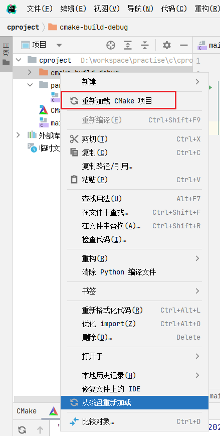

# 起步

## 环境搭建

1. 编译器安装

    编译器最常见的 C 语言编译器为 `GCC 编译器`，是跨平台的编译器集合

    在 windows 中的 GCC 编译器叫做 [MINGW](https://sourceforge.net/projects/mingw/files/)

    

    

1. 设置环境变量

    

    

1. 编译并执行

    ```c
    #include <stdio.h>

    int main() {
        printf("HELLO WORLD");
        return 0;
    }
    ```

    

1. 使用 IDE CLion 开发

    

1. 创建项目

    

    因为对于 C 语言来说，只能有一个入口函数，所以只能有一个 main，所以需要额外安装一个插件，来保证每一个文件都可以作为 main 使用

    

    

    

    

    之后就可以直接执行了

    之后再设置编码规则

    

## C 程序运行机制、标准库、头文件

1. 编辑，编写 C 语言源码，文件形式以后缀 `.c` 存储到磁盘中
2. 编译，C 程序转换为目标程序，若程序没有错误，则会生成一个扩展名字为 `.obj` 的二进制文件。即机器指令
3. 链接，`.obj` 文件和库函数以及其他目录文件链接，形成统一的可执行二进制文件 `.exe`
4. 运行，可以直接执行 `exe` 文件

程序需要使用到的功能一部分已经提前定义好了，这些就是**标准库**，包含 c 内置函数、常量、头文件。

**头文件**是定义不同的功能在不同的文件中，如果系统自带某一功能，则一定会自带描述这个功能的头文件，后缀通常为 `.h`，比如 `<stdio.h>`

**预处理命令**是加载头文件的命令，用 `#` 来表示，声明在各个文件的开头位置。加载使用 `#include`。

```c
// 编译系统在系统头文件所在的目录搜索
#include <stdio.h>
// 编译系统首先在当前源文件目录中搜索，找不到再去系统所在目录搜索
#include "stdio.h"
```

常用的头文件

- `#include "stdio.h"`: printf、scanf、getchar、putchar
- `#include "stdlib.h"`: 数值转换、伪随机网络生成器、内存分配
- `#include "string.h"`: 字符串处理
- `#include "math.h"`: 数学函数，sin、sqrt
- `#include "stddef.h"`: 几个有用的类型和宏