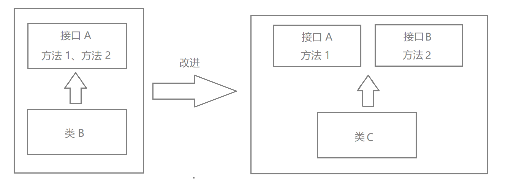

## 前言

参考资料：

- 黑马程序员设计模式
- 《HeadFirst 设计模式》

## 设计模式概述

设计模式最开始出现在建筑领域的设计中，建筑设计的基本模式高达**253**种，后来进入到软件的世界中，收入了**23种设计模式**。

软件设计模式，也叫做设计模式，它是被反复使用的**经验总结**，是被总结出来的一些套路，用于解决一些反复出现的问题，有一定的普适性。

---

设计模式的本质是对类的封装、继承、多态，以及类的关联关系和组合关系的充分理解。

正确使用设计模式具有以下优点：

- 提高程序员的思维能力，编程能力，**设计能力**。
- 使程序设计更加标准化，代码编制更加工程化，使软件开发效率大大增加，从而缩短软件的开发周期。
- 代码的可读性、重用性、可靠性高，灵活性、可维护性强。

---

设计模式分类：

- 创建型模式

  用于描述如何创建对象，主要特点就是将对象的创建和使用分离。经典设计模式中有**单例、原型、工厂、抽象工厂、建造者**五种。

- 结构型模式

  描述如何将类/对象按照某种布局组成更大的结构。经典设计模式中有**代理、适配器、桥接、装饰、外观、享元、组合**七种。

- 行为型模式

  用于描述类或者对象之间如何相互协作共同完成单个对象无法完成的任务，以及如何分配职责。经典设计模式中有**模板方法、策略、命令、职责链、状态、观察者、中介者、迭代器、访问者、备忘录、解释器**十一种。


## UML 类图

统一建模语言（Unified Language，UML）是用来设计软件的可视化建模语言，特点是简单、统一、图形化、能表达软件设计中的动态和静态信息。

UML 从目标系统的不同角度出发，定义了用例图、类图、对象图、状态图、活动图、时序图、协作图、构件图、部署图。

我们主要了解的就是 UML 类图，类图主要体现的就是静态信息。UML 类图是显示了模型的静态结构（类的内部结构、类与类的关系）。

---

### 类图的表现方式

类使用包含类、属性（field）、方法（method）并且带有分割线的矩形表示。比如下图的 `Employee`，包含 `name`、`age`、`address` 三个属性和 `work` 方法。


UML 中的符号有三种：

- `-`：表示 `private`。
- `+`：表示 `public`。
- `#`：表示 `protected`。

属性的完整表达方式为：**可见性 名称: 类型[ = 缺省值]**

方法的完整表达方式为：**可见性 名称(参数列表) [ ： 返回类型]**

**注意：**

1. 中括号中的内容是可选的。
1. 也有将类型放在变量名前边，返回值类型放在方法名前面的写法。


### 类和类/接口之间关系的表示方式

#### 关联关系

关联关系是对象之间的一种引用关系。分为一般关联关系、聚合关系、组合关系。

---

##### 一般关联关系

**单向关联**


上图就是单向关联关系，使用一个带箭头的实线表示关系，`Customer` 引用 `Address`。

**双向关联**


上图就是双向关联关系，使用不带箭头的实现表示关系，`Customer` 和 `Product` 相互引用，但是顾客可以购买多个商品，所以在 `Customer` 中显示的是 `List`。

**自关联**


自关联用到的其实就是自己包含自己类型的变量。

##### 聚合关系

聚合关系是整体对象（整体）和成员对象（部分）之间的关系。

比如学校和老师，学校中包含老师，老师作为学校的一部分存在。

但是成员对象也可以脱离整体对象存在。比如学校停办了，老师仍然存在，可以去其他的学校任职。


聚合关系可以使用带空心菱形的实线表示，菱形的一方指向整体。

##### 组合关系

组合关系表示类之间整体和部分之间的关系，但他是一种更加强烈的聚合关系。

在组合关系中，整体对象可以控制部分对象的生命周期，一旦整体对象不存在，部分对象也就不存在了，部分对象不可以脱离整体而存在，例如头和嘴的关系，头没了嘴也不可能独立存在。


组合关系使用带实心菱形的实线表示，菱形的一方指向整体。

#### 依赖关系

依赖关系是一种使用关系，它是对象之间耦合度最弱的一种关联关系，是临时性的关联。比如在代码中，某一个类的方法通过局部变量、方法的参数，或者通过静态对象的方式访问另一个类（被依赖的类）的某些方法来完成一些职责。


依赖关系使用带箭头的虚线表示，箭头从使用类开始，指向被依赖（被使用）的类。也就是 `Driver` 依赖于 `Car`。

#### 继承关系

继承关系是对象之间耦合度最大的一种关系。在类图中，继承关系也叫做泛化关系。


继承关系使用带空心三角箭头的实线表示，箭头从子类开始，指向父类。

#### 实现关系

实现关系是接口和类之间的关系。


实现关系使用带空心三角箭头的虚线来表示，箭头从实现类指向接口。

## 软件设计原则

### 开闭原则

**对扩展开放，对修改关闭**。也就是说在程序需要进行扩展的时候，不能修改原有代码，要实现热插拔的效果。简而言之，是为了程序的更好的扩张和升级。

要想要达到这种的效果，我们需要使用到接口和抽象类。

因为抽象类灵活性好，适应性广，只要抽象地比较合理，基本可以保持软件架构的稳定性。而软件易变的细节可以通过抽象类的派生类来实现，就相当于是定义规范。

例如：搜狗输入法的皮肤，我们就可以看做是一个抽象类，皮肤可以随意更换，其实就是基于皮肤这种规则来进行的代码实现。

```java
/**
 * 抽象皮肤类，只要继承抽象皮肤类就可以无限扩展
 */
public abstract class AbstractSkin {

    // 显示的方法
    public abstract void display();
}

/**
 * 默认皮肤类
 */
public class DefaultSkin extends AbstractSkin{
    @Override
    public void display() {
        System.out.println("默认皮肤");
    }
}

/**
 * 黑马皮肤类
 */
public class HeimaSkin extends AbstractSkin {
    @Override
    public void display() {
        System.out.println("黑马程序员皮肤");
    }
}

/**
 * 搜狗输入法
 */
public class SougouInput {
    private AbstractSkin skin;

    public void setSkin(AbstractSkin skin) {
        this.skin = skin;
    }

    // 搜狗输入法展示
    public void display(){
        skin.display();
    }
}

public class Client {
    public static void main(String[] args) {
        SougouInput input = new SougouInput();
        // 创建皮肤对象，想要什么皮肤就 new 什么皮肤
        DefaultSkin skin = new DefaultSkin();
        input.setSkin(skin);
        input.display();
    }
}
```

### 里氏替换原则

**任何基类可以出现的地方，子类一定可以出现**。通俗的说，子类可以扩展父类的功能，但是不能更改父类原来的功能。所以说，子类尽量不要重写父类的方法，这样会让重用性变差，新加功能会更好。

正方形是长方形，而长方形不是正方形，所以针对于这种情况，正方形继承长方形不是个好选择，更好的方法是抽象出一个四边形类，两者去继承四边形。

```java
/**
 * 四边形接口
 */
public interface Quadrilateral {
    double getHeight();

    double getWidth();
}

/**
 * 长方形类
 */
@AllArgsConstructor
public class Rectangle implements Quadrilateral{
    private double width;
    private double height;

    @Override
    public double getHeight() {
        return height;
    }

    @Override
    public double getWidth() {
        return width;
    }
}

/**
 * 正方形类
 */
@AllArgsConstructor
public class Square implements Quadrilateral {
    private double side;

    @Override
    public double getHeight() {
        return side;
    }

    @Override
    public double getWidth() {
        return side;
    }
}
```

### 依赖倒转原则

高层模块不应该依赖于低层模块，两者都应该依赖于低层模块的抽象。简单来说就是对抽象编程，具体实现是细节问题。

现在有 A 类、B 类，其中 A 类用到了 B 类中的内容，这个时候 A 类叫做高层模块，B 类叫做低层模块。那么 A 类不应该依赖于 B 类，而应该依赖于 B 类的抽象。

举个例子：

现在我们有一台电脑（高层模块），有各个配件（低层模块）：主板、CPU、散热器、内存条、显卡、电源……。

组装电脑的精髓就是在于挑选各个配件进行组合，挑选出出电脑的最高性价比，也就是说你的各个配件不能是固定的品牌。以 CPU 举例子，我只知道我需要一个 CPU，而具体是 Intel 的还是 AMD 的，具体是什么型号的，这些不是在一开始要去操心的，这是细节问题。


上面的图片就表示了这样一种关系，为了简单，我只写了电脑由 CPU、硬盘、内存构成，但是只是指出了他们的组成没有具体的实现，而具体的实现是具体的细节实现。

假如用代码来展示，是这样的：

```java
@Data
@AllArgsConstructor
@NoArgsConstructor
public class Computer {
  private CPU cpu;
  private Disk disk;
  private Memory memory;
}
```

```java
public interface CPU {
}

public class AMD implements CPU{
}

public class Intel implements CPU{
}
```

```java
public interface Disk {
}

public class Xishu implements Disk{
}
```

```java
public interface Memory {
}

public class WeiGang implements Memory{
}
```

```java
/**
 * 依赖倒转
 */
public class RelyOnReverse {
  public static void main(String[] args) {
    Computer computer = new Computer();
    computer.setCpu(new AMD());
    computer.setDisk(new Xishu());
    computer.setMemory(new WeiGang());
  }
}
```

### 接口隔离原则

简单来讲就是实现最小的接口。

比如接口 A 有方法 1 和 方法 2，但是类 B 只需要实现方法 1 的功能，那么它去实现接口 A 就多余了方法 2，这样就违背了接口隔离原则。



### 迪米特法则

如果两个实体之间不需要直接的通信，那么就不需要直接的调用，而是可以通过第三方的转发来进行调用。目的就是为了降低耦合，提高模块之间的独立性。

比如说，如果要租房，找的其实是中介而不是房东。如果要做软件，找的应该是软件公司而不是具体的工程师。

### 合成复用

类的复用通常来说分为：继承复用、合成复用。

合成复用的意思是指：尽量优先使用组合或者聚合的关联关系来实现操作，其次才考虑使用继承关系来实现。

我们首先要考虑合成复用而不是继承复用，因为继承复用虽然实现起来简单，但是存在以下缺点：

- 继承复用破坏了类的封装性，因为继承会将实现细节暴露给子类。父类对子类是透明的，所以继承复用又被称为白箱复用。
- 子类和父类的耦合度高，父类的任何实现改变都会改变子类，这不利于类的扩展和维护。
- 限制了复用的灵活性，因为从父类继承来的实现是静态的，在编译时就已经定义了，所以在运行时不可能发生变化。

采用组合或者聚合复用时，可以将已有对象纳入到新的对象中，成为新对象的一部分，新对象可以调用原有对象，这有以下好处：

- 维持了类的封装性，因为类的内部实现细节不会对新对象开放。
- 对象之间的耦合度低。
- 这样可以在类的成员位置声明为抽象，复用的灵活性更高，这样的复用可以在运行时动态进行，新对象可以动态引用类型相同的对象。
