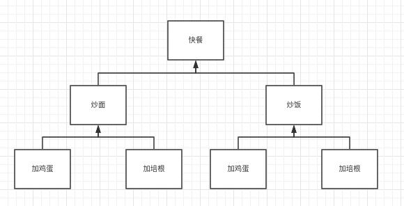
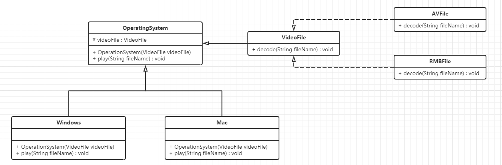

## 结构型模式

结构型模式强调的是结构，如何将对象或者类按照某种更大的布局组成更大的结构。它分为类结构型模式和对象结构型模式，前者采用继承机制来组织接口和类，后者采用组合/聚合来组合对象。

由于组合/聚合关系的耦合度比继承关系的耦合度低，满足合成复用原则，所以对象结构型模式比类结构型模式有更大的灵活性。

结构型模式分为以下七种：

- 代理模式。
- 适配器模式。
- 装饰者模式。
- 桥接模式。
- 外观模式。
- 组合模式。
- 享元模式。

## 代理模式

如果我们想要买房的话，找的是中介而不是房产公司。假如我们想要买电脑，找的是地方代理商而不是具体公司。

所以这就是代理模式，通过一个代理来实现最终的目标，代理模式是一样，访问对象不能直接引用目标对象，而是通过一个中介来访问对应的目标对象。

Java 中的代理按照代理生成的时机不同又分为静态代理和动态代理。静态代理在编译期就已经生成，动态代理则是在 Java 运行时动态生成。动态代理又分为 JDK 代理和 CGLib 代理。

- 静态代理：编译期生成代理对象。
- 动态代理：Java 运行期间动态生成。
    - JDK 代理。
    - CGLib 代理。

代理 Proxy 又分为三种角色：

- 抽象主题 Subject：通过接口/抽象类声明真实主题和代理对象实现的业务方法。
- 真实主题 Real Subject：实现了抽象类主题中的具体业务，是代理对象所代表的真实对象，是最终要引用的对象。
- 代理 Proxy：提供了与真实主题相同的接口，其内部含有对真实主题的引用，它可以访问、控制或扩展真实主题的功能。

### 静态代理

假如我们买火车站，需要坐车到火车站买票，显然比较麻烦。而火车站在多个位置都有代售点，我们到达代售点买票显然要比火车站买票简单的多。

这其实就是典型的代理模式，火车站是目标对象，代售点是代理对象。

```java
public interface SellTickets {
  public void sell();
}
```

```java
public class TrainStation implements SellTickets{
  @Override
  public void sell() {
    System.out.println("卖票");
  }
}
```

```java
public class ProxyPoint implements SellTickets{

  // 声明火车站类对象
  private TrainStation station = new TrainStation();

  @Override
  public void sell() {
    System.out.println("代售点做功能增强");
    station.sell();
  }
}
```

```java
public class Client {
  public static void main(String[] args) {
    ProxyPoint proxyPoint = new ProxyPoint();
    proxyPoint.sell();
  }
}
```

:::tip
注意，代理其实最终还是调用的目标对象的方法，只不过做了一些增强。
:::

### 动态代理

#### JDK 动态代理

下面使用动态代理，首先进行 JDK 动态代理。Java 中提供了一个动态代理类 Proxy，Proxy 并不是我们上述所说的代理对象的类，而是提供了一个创建代理对象的静态方法（new ProxyInstance）来获取代理对象。

```java
public interface SellTickets {
  public void sell();
}

public class TrainStation implements SellTickets {
  @Override
  public void sell() {
    System.out.println("卖票");
  }
}
```

```java
/**
 * 获取代理对象的工厂类
 */
public class ProxyFactory {

  // 声明目标对象
  private TrainStation station = new TrainStation();

  /**
   * 获取代理对象
   *
   * @return 代理对象
   */
  public SellTickets getProxyObject() {
    /*
      newProxyInstance 参数说明：
          - ClassLoader：目标对象的类加载器
          - interfaces：目标对象实现的接口的字节码
          - InvocationHandler：代理对象的调用处理程序
     */
    SellTickets proxyObject = (SellTickets) Proxy.newProxyInstance(
        station.getClass().getClassLoader(),
        station.getClass().getInterfaces(),
        new InvocationHandler() {
          /**
           * invoke 参数说明
           *
           * @param proxy  代理对象，和 proxyObjecy 是一个对象
           * @param method 对接口中的方法进行封装的 method，比如封装了 sell() 和其他的方法
           * @param args   调用方法的实际参数，调用什么方法就会传递对应的参数，比如这里调用 sell() 没有参数，那么 args 就没有
           * @return 调用方法的返回值，比如说调用了 sell()，sell 没有返回值，那么这里就是 null
           */
          @Override
          public Object invoke(Object proxy, Method method, Object[] args) throws Throwable {
            System.out.println("invoke 增强，JDK 动态代理");
            // 执行目标对象的方法
            Object invoke = method.invoke(station, args);
            return invoke;
          }
        });
    return proxyObject;
  }
}
```

```java
public class Client {
  public static void main(String[] args) {
    ProxyFactory factory = new ProxyFactory();
    SellTickets proxyObject = factory.getProxyObject();
    proxyObject.sell();
  }
}
```


:::tip
ProxyFactory 其实并不是代理类，它是一个工厂类，它提供的方法可以生成代理对象，也不是代理类。而代理类是在程序运行过程中，动态在内存中生成的类。

我们可以通过阿里巴巴开源的 Java 诊断工具 [Arthas](https://arthas.aliyun.com/doc/) 来查看代理类的结构。
:::

```java
public class Client {
  public static void main(String[] args) {
    ProxyFactory factory = new ProxyFactory();
    SellTickets proxyObject = factory.getProxyObject();
    proxyObject.sell();

    // 获取代理类全类名，让 Arthas 从内存中读取
    System.out.println(proxyObject.getClass());
    // 让程序一直运行，让我们方便查看
    while (true){}
  }
}
```

```java
/**
 * 使用 Arthas 从内存中读取出来的动态代理类（通过 jad 来反编译）
 */
public final class $Proxy0 extends Proxy implements SellTickets {

    private static Method m3;

    // 这个 invocationHanlder 就是我们在 ProxyFactory 中定义的 InvocationHandler
    public $Proxy0(InvocationHandler invocationHandler) {
        // 直接使用了父类 Proxy 的内容，这里其实就是 protected InvocationHandler h;
        super(invocationHandler);
    }

    static {
      // SellTicketes 的方法 sell() 赋值给了 m3，所以 m3 就是 sell()
      m3 = Class.forName("com.maple.pattern.proxy.jdk_proxy.SellTickets").getMethod("sell", new Class[0]);
    }

    public final void sell() {
      /*
        调用父类中的 invoke 方法，这里的 h 是我们ProxyFactory 中定义的 InvocationHandler
        那么执行 invoke 其实就是执行 ProxyFactory 中，getProxyObject 中定义的 invoke 方法。
      */
      this.h.invoke(this, m3, null);
      return;
    }
}
```

```java
public class Proxy implements java.io.Serializable {
  protected InvocationHandler h;
}
```

JDK 动态代理的执行流程如下：

1. 在测试类中通过代理对象调用 sell() 方法。
1. 根据多态的特性，执行的是代理类 $Proxy0 中的 sell() 方法。
1. 代理类 $Proxy0 中的 sell() 方法中又调用了 InvocationHandler 接口的子实现类对象 invoke 方法。
1. invoke 通过反射执行了真正的 TrainStation 中的 sell() 方法。

#### CGLIB 动态代理

JDK 动态代理要求必须定义接口，对接口进行代理，那么如果没有定义接口，只定义了对应的类，那么 JDK 动态代理就不能使用了。

CGLIB 没有实现接口的动态代理，实现的是子类的动态代理。它为 JDK 的动态代理提供了很好的实现。CGLIB 是一个第三方的包，所以需要引入 jar。

```xml
<dependency>
    <groupId>cglib</groupId>
    <artifactId>cglib</artifactId>
    <version>2.2.2</version>
</dependency>
```

```java
public class TrainStation {

  public void sell() {
    System.out.println("卖票");
  }
}
```

```java
/**
 * 代理对象工厂，用于获取代理对象
 */
public class ProxyFactory implements MethodInterceptor {

  private TrainStation station = new TrainStation();

  /**
   * CGLIB 是基于子类进行的动态代理
   *
   * @return 目标对象的子类对象
   */
  public TrainStation getProxyObject() {
    // 1. 创建 Enhancer 对象，类似 JDK 中的 Proxy 类
    Enhancer enhancer = new Enhancer();
    // 2. 因为 CGLIB 是基于子类进行的动态代理，所以这里设置父类的字节码对象，也就是目标对象
    enhancer.setSuperclass(TrainStation.class);
    // 3. 设置回调函数，这里应该是 MethodInterceptor 中子实现类的对象，那么这里实现了 MethodInterceptor，传递 this 即可
    enhancer.setCallback(this);
    // 4. 创建代理对象
    TrainStation proxyObject = (TrainStation) enhancer.create();
    return proxyObject;
  }


  /**
   * 这个回调函数其实就是 proxyObject 在调用对应的方法时，执行的回调函数
   *
   * @param o 代理对象
   * @param method 对应的调用方法
   * @param objects 对应的调用方法的参数
   * @param methodProxy
   * @return 返回值
   */
  @Override
  public Object intercept(Object o, Method method, Object[] objects, MethodProxy methodProxy) throws Throwable {
    System.out.println("CGLIB 动态代理");
    Object invoke = method.invoke(station, objects);
    return invoke;
  }
}
```

```java
public class Client {
  public static void main(String[] args) {
    ProxyFactory factory = new ProxyFactory();
    // 这里获取的对象是 TranStation 的子类对象
    TrainStation proxyObject = factory.getProxyObject();
    proxyObject.sell();
  }
}
```

#### 三种代理对比

- JDK 和 CGLIB 代理：

    使用 CGLIB 动态代理，CGLIB 底层采用 ASM 字节码生成框架。

    注意，因为 CGLIB 是基于子类的动态代理，所以代理不了声明为 final 的类或者方法。

    CGLIB 在 JDK1.6 之前比 Java 反射效率高，但是在 JDK1.7、JDK1.8 对 JDK 动态代理优化之后，在调用次数少的情况下，JDK 动态代理远高于 CGLIB。只有在大量调用的时候，JDK1.6 和 JDK1.7 比 CGLIB 效率低一点。

    JDK1.8 之后，JDK 动态代理远高于 CGLIB，所以有接口时，优先使用 JDK 动态代理。

- 动态代理和静态代理：

    区别很明显，动态代理将所有的方法都转移到了一个集中的方法进行处理。这样在接口方法数量比较多的时候，我们可以灵活处理，而不是像静态代理那样每一个方法进行中转。

- 优缺点：
    - 优点：
        - 代理模式在客户端与目标对象起到了一个中介作用和保护作用。
        - 代理对象可以扩展目标对象的功能。
        - 代理模式可以将客户端与目标对象分离，在一定程度上降低了系统的耦合度。
    - 缺点：增加了系统的复杂性。

## 适配器模式

国外的插头插座和我们国家的插头插座是不一样的，所以使用国外的插头向我们的插座插的时候，需要一个转换器，我们首先插入到转换器中，然后转换器插入到插座上。

适配器模式就是这个意思，他可以将一个类的接口转换为客户希望的一个接口，让原本由于接口不兼容而不能共同工作的类可以共同工作。

适配器模式分为两类：

- 类适配器模式，使用的是继承的模式，耦合度高一些。
- 对象适配器模式，使用到的是组合的模式，耦合度更低一些。

适配器模式中的角色：

- 目标接口（Target）：中国插头。
- 适配者类（Adaptee）：例如外国插头。
- 适配器类（Adapter）：转接头。

#### 类适配器模式

现在有一台电脑，只能读取 SD 卡，如果我们想要读取 TF 卡那么就要使用适配器模式。

思路是这样的：既然电脑只能读取 SD 卡，那么就创建一个适配器，这个适配器对外（电脑）提供的仍然是 SD 卡的读写操作，但是其实内部读取的是 TF 卡。


```java
/**
 * 目标接口
 */
public interface SDCard {

  String readSD();

  void writeSD(String data);
}

/**
 * 具体的目标接口
 */
public class SDCardImpl implements SDCard{
  @Override
  public String readSD() {
    return "SD";
  }

  @Override
  public void writeSD(String data) {
    System.out.println("write SD data");
  }
}
```

```java
/**
 * 适配者类的接口
 */
public interface TFCard {

  // 从 TF 卡中读取数据
  String readTF();

  // 向 TF 卡中写数据
  void writeTF(String data);
}

/**
 * 适配者类
 */
public class TFCardImpl implements TFCard{
  @Override
  public String readTF() {
    return "TF";
  }

  @Override
  public void writeTF(String data) {
    System.out.println("write TF data");
  }
}
```

```java
/**
 * 注意这里，Computer 其实需要的是 SDCard，但是通过适配器模式，可以将 TFCard 转为 SDCard
 */
public class Computer {
  public String readSD(SDCard sdCard) {
    if (sdCard==null){
      throw new NullPointerException("SDCard must not be null");
    }
    return sdCard.readSD();
  }
}
```

```java
/**
 * 适配器类
 */
public class SDAdapterTF extends TFCardImpl implements SDCard{
  @Override
  public String readSD() {
    System.out.println("adapter read tf card");
    return readTF();
  }

  @Override
  public void writeSD(String data) {
    System.out.println("adapter write tf card");
    writeTF(data);
  }
}
```

```java
public class Client {
  public static void main(String[] args) {
    Computer computer = new Computer();
    String data = computer.readSD(new SDAdapterTF());
    System.out.println(data);
  }
}
```

:::tip
类适配器的缺点有二：

1. 很明显，违背了合成复用原则，类之间的耦合度更高了。
1. 假如客户（电脑）没有提供一个 SDCard 的接口只有一个 SDCardImpl 的规则，那么适配器也不可能去继承 SDCardImpl（因为已经继承了 TFCardImpl）。
:::

#### 对象适配器模式

对象适配器模式进行的改进操作其实就是将适配器的继承 TFCardImpl 改为了在类中使用 TFCard 来聚合，这样做解决了类适配器模式的两个缺点：

1. 满足了合成复用原则。
1. 假如客户（电脑）没有提供 SDCard 接口，也完全可以继承 SDCardImpl 来实现对应的内容。


```java
@AllArgsConstructor
public class SDAdapterTF implements SDCard {

  private TFCard tfCard;

  @Override
  public String readSD() {
    System.out.println("adapter read tf card");
    return tfCard.readTF();
  }

  @Override
  public void writeSD(String data) {
    System.out.println("adapter write tf card");
    tfCard.writeTF(data);
  }
}
```

## 装饰者模式

快餐店中，目前有炒面，炒饭两类，并且炒面和炒饭都可以加鸡蛋、加培根。



假如我们使用以往的方式来计算价格，这将是一个非常麻烦的过程，并且扩展性极差，容易发生类爆炸的情况。

此时我们可以使用装饰者模式。装饰者模式的意思是：在不改变原有对象结构的情况下，动态给改对象增加额外的内容。

装饰者模式的角色：

- 抽象构件角色：例如上图中的快餐。
- 具体构件角色：例如上图中的炒面和炒饭。
- 抽象装饰角色：抽象的，装饰者角色比较特殊，既要继承抽象构件角色也要聚合抽象构件角色。
- 具体装饰角色：具体的装饰角色，比如上图中的鸡蛋和培根。


```java
/**
 * 快餐，抽象类，对应抽象构件角色
 */
@Data
@AllArgsConstructor
public abstract class FastFood {

  // 价格
  private Float price;
  // 描述
  private String desc;

  // 计算价格
  public abstract Float cost();

}
```

```java
/**
 * 炒饭，对应具体构件角色
 */
public class FriendRice extends FastFood {

  public FriendRice() {
    // 炒饭的价格是 10 元，描述就是炒饭
    super(10F, "炒饭");
  }

  @Override
  public Float cost() {
    // 价格就是 10 元，所以我们只需要调用父类的 getPrice，将 10 返回即可
    return getPrice();
  }
}

/**
 * 炒面，类似炒饭
 */
public class FriendNoodles extends FastFood {

  public FriendNoodles() {
    super(12F, "炒面");
  }

  @Override
  public Float cost() {
    return getPrice();
  }
}
```

```java
/**
 * 抽象装饰者类，属于抽象装饰者角色
 */
public abstract class Garnish extends FastFood {

  /**
   * 装饰者类比较特殊，既要继承 FastFood，也要聚合 FastFood
   */
  private FastFood fastFood;

  public Garnish(FastFood fastFood, Float price, String desc) {
    super(price, desc);
    this.fastFood = fastFood;
  }

  public FastFood getFastFood() {
    return fastFood;
  }

  public void setFastFood(FastFood fastFood) {
    this.fastFood = fastFood;
  }
}
```

```java
/**
 * 配料，对应的角色是具体的装饰者
 */
public class Egg extends Garnish {

  public Egg(FastFood fastFood) {
    // 这里的内容也是精髓，继承了抽象装饰者，假如鸡蛋的价格是 1，那么就返回 1。
    super(fastFood, 1F, "鸡蛋");
  }

  @Override
  public Float cost() {
    // 第一个 getPrice 是鸡蛋的价格，假如要获取快餐本身的价格只能通过 getFastFood 来获取快餐本身，进而获取价格
    return getPrice() + getFastFood().getPrice();
  }

  /**
   * 重写描述
   */
  @Override
  public String getDesc() {
    return super.getDesc() + getFastFood().getDesc();
  }
}
```

```java
public class Client {
  public static void main(String[] args) {
    FastFood fastfood = new FriendRice();
    fastfood = new Egg(fastfood);
    System.out.printf("快餐 %s %s 元", fastfood.getDesc(), fastfood.cost());
  }
}
```


::: tip  
代理模式和装饰着模式的异同：

- 相同点：
    - 都要实现与目标类相同的业务接口。
    - 在两个类中都要声明目标对象。
    - 都可以在不修改目标类的前提下增强目标方法。
- 不同点：
    - 目的不同，装饰者是为了增强对象，代理是为了保护和隐藏目标。
    - 获取目标对象构建的地方不同，装饰者是由外界传进来，可以使用构造方法传递。静态代理是在代理类内部创建，用来隐藏目标对象。  
::: 

## 桥接模式

现在有一个需求，需要创建不同的图形，并且每一个图形都可能会有不同的颜色，假设我们使用继承的方式来设计类的关系，那么就可能发生类爆炸。


针对这种情况，我们可以使用桥接模式，将抽象与实现相分离，使它们可以独立变化，它们是以组合关系代理继承关系来实现，从而降低了抽象和实现这两个可变维度的耦合度。

桥接模式（Bridge）主要包含如下角色：

- 抽象化角色（Abstraction）：定义抽象类，并且包含一个对实现化对象的引用。
- 扩展抽象化角色（Refined Abstraction）：是抽象化角色的子类，实现父类中的业务方法，并通过组合关系调用实现化角色中的业务方法。
- 实现化（Implementor）角色：定义实现化角色接口，供扩展抽象化角色调用。
- 具体实现化（Concrete Implementor）角色：给出实现化角色接口的具体实现。

案例：现在需要开发一个跨平台的播放器，可以播放多种格式的视频文件。常见的操作系统比如 Windows、Mac、Linux 等。常见的视频格式包含 RMVB、AVI、WMV 等。

此案例拥有两个维度（操作系统、视频格式），适合使用桥接模式。



```java
/**
 * 视频文件，实现化角色
 */
public interface VideoFile {
  void decode(String fileName);
}

/**
 * 具体实现化角色
 */
public class AviFile implements VideoFile{
  @Override
  public void decode(String fileName) {
    System.out.printf("AVI 视频文件 %s", fileName);
  }
}
/**
 * 具体实现化角色
 */
public class RmvbFile implements VideoFile{
  @Override
  public void decode(String fileName) {
    System.out.printf("RMVB 视频文件 %s", fileName);
  }
}
```

```java
/**
 * 抽象的操作系统类，抽象化角色
 */
@AllArgsConstructor
public abstract class OperatingSystem {

  protected VideoFile videoFile;

  public abstract void play(String fileName);
}

/**
 * 扩展抽象化角色
 */
public class Windows extends OperatingSystem{
  public Windows(VideoFile videoFile) {
    super(videoFile);
  }

  @Override
  public void play(String fileName) {
    videoFile.decode(fileName);
  }
}

/**
 * Mac，扩展抽象化角色
 */
public class Mac extends OperatingSystem{
  public Mac(VideoFile videoFile) {
    super(videoFile);
  }

  @Override
  public void play(String fileName) {
    videoFile.decode(fileName);
  }
}
```

```java
public class Client {
  public static void main(String[] args) {
    OperatingSystem system = new Mac(new AviFile());
    system.play("战狼");
  }
}
```

::: tip  
桥接模式的好处就是在两个维度里面，随意扩展都不会影响另外的维度。
:::  

