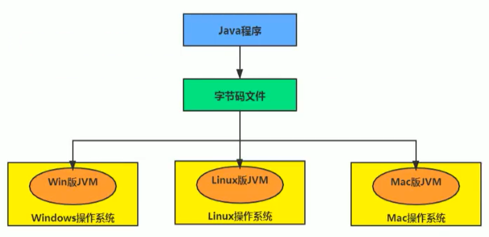
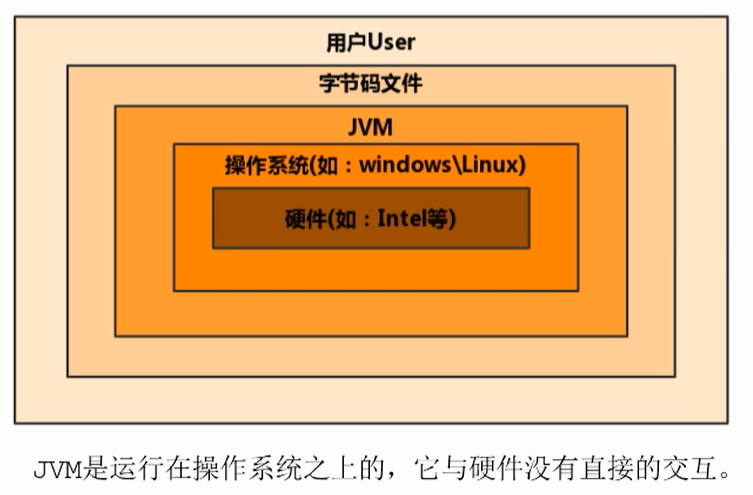
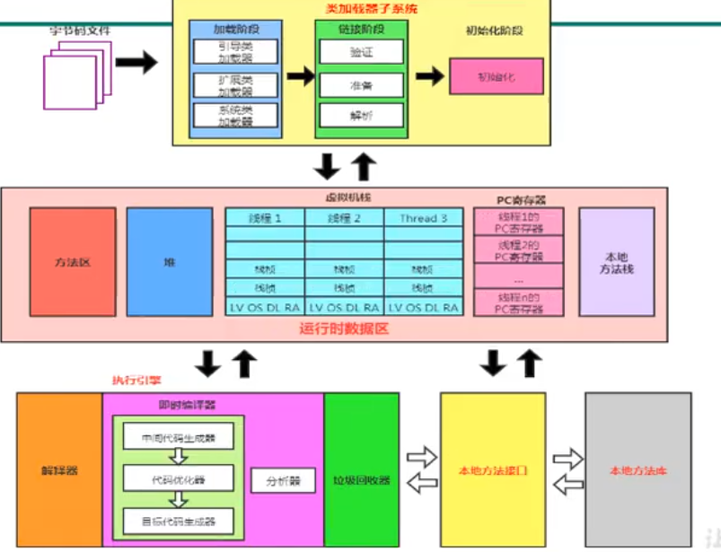

## JVM 概述

**Java 和 JVM**

默认使用 JDK8 讲解，切换版本会有说明。

Java 程序的特性是一处编写，到处运行。这个特性主要靠 Java 虚拟机来实现，Java 程序进行编译之后形成字节码文件，字节码文件放到 Java 虚拟机上运行。
对于每一个操作系统，都有不同的虚拟机，虚拟机去适配操作系统（Windows、Linux、Mac），作为字节码到操作系统的一层转换措施，所以字节码文件才可以在所有平台上运行。
对于现在来说，Java 虚拟机（Java Virtual Machine、JVM）并不仅仅可以运行 Java 程序，只要字节码符合 Java 虚拟机的规范，都可以在它上面运行。

**JVM 字节码**

平常我们说的字节码指的是 Java 编译形成的字节码文件，但是现在 JVM 只会读取符合规则的字节码文件，而不仅仅限定于 Java 编译成的字节码文件，所以叫做 JVM 字节码更合适一些。

**多语言混合编程**

软件开发中渐渐靠拢的一个方向是通过特定领域的语言去解决特定领域的问题。而 JVM 可以支持符合规则的字节码文件，这说明其他语言最后形成符合 JVM 规定的字节码文件之后，JVM 同样会执行。

**JVM 重大事件**

- 2000 年，JDK1.3 发布，同时发布了 `Java HotSpot Virtual Machine`，成为了 Java 的默认虚拟机。
- 2003 年底，Java 平台的 Scala 正式发布，同年 Groovy 也加入了 Java。
- 2006 年，Java 开源并建立了 OpenJDK。顺理成章，Hotspot 虚拟机也成为了 OpenJDK 中的默认虚拟机。
- 2007 年，Java 平台迎来了 Clojure（一种运行在 Java 平台上的 Lisp 语言）。
- 2008 年，Oracle 收购 BEA，得到了 `JRockit` 虚拟机。
- 2010 年，Oracle 收购了 Sun，获得了 Java 商标和 Hotspot 虚拟机。
- 2011 年，JDK7 发布，正式启用了新的垃圾回收器 `G1`。
- 2017 年，JDK9 发布。将 G1 设置为默认 GC，代替了 CMS。IBM 的 J9 开源，形成了 Open J9 的社区。
- 2018 年，发布了革命性的 `ZGC`，调整 JDK 授权许可。
- 2019 年，JDK12 发布，加入 RedHat 领导开发的 `Shenandoah GC`。

**JVM 整体结构**

**指令集架构和 JVM 的架构模型**

指令集的架构模型分为两种：

- 基于栈的指令集架构：

    - 设计和实现更加简单，适用于资源受限的系统。
    - 避开了寄存器的分配难题（一地址或者二、甚至三地址指令），转而采用了零地址指令方式分配。
    - 指令流的大部分指令是零地址指令，执行过程依赖于操作栈，指令集更小，编译器更加容易实现。
    - 不需要硬件支持，可移植性更好。

- 基于寄存器的指令集架构：

    - 性能更加优秀，执行更加高效。
    - 花费更少的指令去完成一项操作。
    - 大部分情况下，基于寄存器架构的指令往往都是一地址、二地址甚至三地址。

Java 编译器输入的指令流基本上都是一种基于栈的指令集架构。

::: tip
零地址、一地址、二地址、三地址：

通常在进行一项操作的时候，往往是 [key - value] 形式，key 就是地址值，value 就是操作数。
一地址，就是说 key 是一个地址，也就是 key-value。二地址是 [(key1, key2) - value]，……。零地址就是 [ value ]。
:::

**JVM 的生命周期**

- 虚拟机启动：

    使用引导类加载器（Bootstrap Class Loader）创建的一个初始类来完成，这个类是由虚拟机的具体实现指定的。

- 虚拟机的执行：

    虚拟机运行起来之后，执行 Java 程序。执行的这个 Java 程序本质上是一个叫做 Java 虚拟机的进程。

- 虚拟机的退出（几种情况）：

    - 程序正常执行结束时，正常退出。
    - 执行过程中遇到了错误，异常终止。
    - 操作系统出现了错误，导致 JVM 进程终止。
    - 某线程调用了 Runtime 类或者 System 中的 exit 方法，或者 Runtime 中的 halt 方法，并且 Java 安全管理器也允许这次操作。
    - JNI（Java Native Interface）规范描述了使用 JNI Invocation API 来加载或者卸载 JVM 的时候，JVM 的退出情况。

::: tip
exit 或者 halt 方法其实最终调用的时一个本地方法 `halt0()`。

JVM 的整体结构有一个叫做运行时数据区的东西（可以理解为运行时环境），Runtime 就是运行时环境对应的类。
:::

**几款 JVM**

::: tip

JVM 的执行引擎中，存在解释器和即时编译器，他们都可以解析字节码，但是有区别：

解释器的缺点时每一行的代码都需要解析，哪怕写了两千次的 for 循环，解释器也会一点不落下。
JIT 编译器会及时将代码编译为本地指令随后缓存这些指令，这样下次就不需要解释执行了，提高了工作效率。

但是所有的代码全部都编译也不够好，我们想要的是经常使用的代码（我们称为热点代码）缓存起来，只需要用一次的正常解析，所以解释器和即时编译器两者配合才能发挥更好的效果。
:::

- Sun Classic VM：

    1996 年的 Java1.0 版本，Sun 公司发布了 Sun Classic VM，也是世界上第一款商用虚拟机，JDK1.4 被淘汰。
    它只能提供解释器，如果使用 JIT 编译器就需要外挂，但是这样一来解释器就不会工作。也就是说解释器和 JIT 编译器不能同时工作。

- Exact VM：

    JDK1.2 时，Sun 公司提供。
    准确式内存管理：可以知道内存中的某个位置存放的数据是什么类型。
    具备现代高性能虚拟机的雏形：热点探测、编译器和解释器混合执行。

    但是它在 Solaris 短暂使用，其他平台当时仍然是 Classic，最终被 Hotspot 代替。

- Hotspot：

    默认虚拟机，至今仍在使用，绝对的市场地位，原来并不是 Sun 的产品，而是 Longview Techonlogies 公司设计，后来被 Sun 收购。后来 Sun 被 Oracle 收购。
    之后主要说明的就是 Hotspot，相关的机制主要也是介绍 Hotspot 的机制（例如其他两个 JVM 没有方法区的概念）。

- JRockit：

    来自 BEA。专注于服务端应用，不太关心程序的启动时间，没有了解释器，这代表所有的代码都缓存，响应速度起飞（甚至传言 JRockit 是世界上最快的 JVM），但是启动时间拉长。
    一般用于延迟敏感性应用的解决方案，比如军事指挥，电信网络。

- J9：

    来自 IBM，全程 IBM Technology for Java Virtual Machine，见车过 IT4J，内部代号 J9。
    定位类似 Hotspot，自封为世界上最快的 Java 虚拟机。2017 年 IBM 开源了 J9，命名为 OpenJ9，交给 Eclipse 基金会管理，也成为 Eclipse OpenJ9。

- Taobao：

    基于 OpenJDK 开发了 AlibabaJDK，简称 AJDK，是整个阿里 Java 的基石。
    基于 OpenJDK Hotspot VM 发布的国内第一个优化，深度定制并且开源的高性能服务器版 Java 虚拟机。

## JVM 整体流程

在进行讲解之前，最好先有一个大体的印象。

---

字节码文件进入到类加载子系统之后，有三个步骤：

1. Loading：加载：

    加载阶段是为了将字节码加载到内存中，需要用到类加载器，有几种典型的类加载器：

    - BootStrapClassLoader：引导类加载器。
    - ExtensionClassLoader：扩展类加载器。
    - ApplicationClassLoader：系统类加载器。

1. Linking：链接，链接有三个步骤：
   - 验证。
   - 准备。
   - 解析。
1. Initialization：初始化。

---

字节码文件经过了类加载子系统之后，进入了运行时数据区，运行时数据区包含：

1. PC Register：PC 寄存器（程序计数器），每一个线程都有一个。
1. Stack Area：虚拟机栈，每一个线程一份，每一个线程中的一个一个结构称为栈帧，栈帧也有内部结构，等到之后详细展开。
1. Native Method Stack：本地方法栈，和虚拟机栈的区别是涉及到了本地方法的调用。
1. heap：堆，最大的一块区域，也是 GC 主要考虑的一块空间。堆是线程间共享空间。
1. Method Area：方法区，存放类的信息，一些域的信息，只有 Hotspot 存在方法区这个概念。

---

执行引擎：和操作系统打交道，相当于一个翻译官，将字节码翻译为物理机器能够识别的机器指令。
