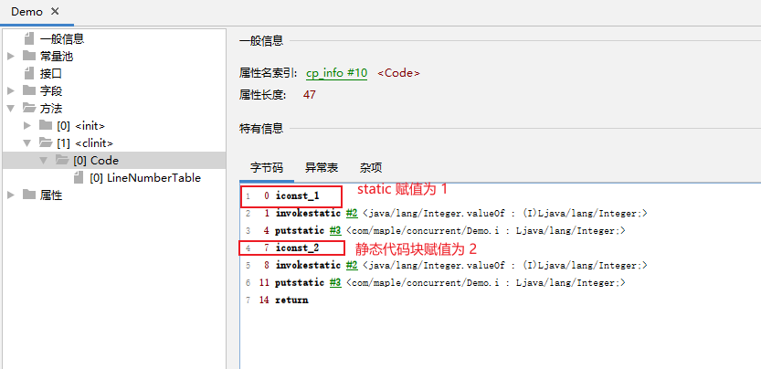
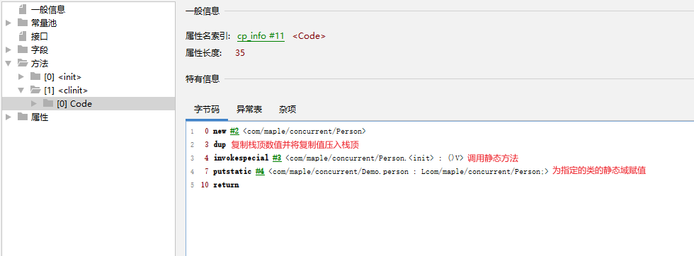
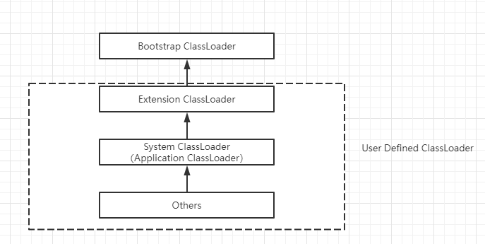

## 类加载器和类的加载过程

类加载子系统的作用主要有：

1. 类加载子系统（类加载器）负责从文件系统/网络中加载 Class 文件：

    ClassLoader 只负责 Class 文件的加载，至于是否可以运行，则由 Execution Engine（执行引擎）决定。

1. 加载的类信息存放于一块称为方法区的内存空间。除了类的信息之外，方法区还会存放运行时常量池信息，可能还包含字符串字面量和数字常量。

## 类加载器的三个阶段


字节码的加载和类加载子系统的加载阶段并不一样，它的加载分为三个部分：加载、链接、初始化。

**加载阶段 Loading**

它有如下步骤：

1. 通过一个类的全限定类名获取这个类的二进制字节流。

    有如下方式加载 `.class` 文件：

    - 从本地系统中直接加载。
    - 从网络中获取，典型场景是 Web Applet（直接嵌入到 HTML 页面中，由支持 Java 的浏览器解释执行，现在几乎绝迹）。
    - 从 zip 压缩包中获取。
    - 运行时计算生成，典型场景是 JSP 应用。
    - 从加密文件中获取，典型场景是防止 Class 文件被反编译的保护措施。

1. 将这个字节流所代表的静态存储结构转换为方法区的运行时数据结构。

    方法区首先只有 Hotspot 虚拟机才有这个概念，并且方法区是一个抽象的概念，而不是具体的实现。在不同的 JDK 版本中有不同的实现。
    比如在 JDK7 及以前，方法区的落地实现为永久代；JDK8 及以后，方法区的落地实现为元空间。
    为了方便称呼，我们不讲方法区的区别时统称方法区。

1. 在内存中生成一个代表这个类的 `java.lang.Class` 对象，作为方法区这个类的各种数据的访问入口。

    通过反射就可以使用这个 Class。

**链接阶段 Linking**

链接分为三部分：

1. Verify 验证：

    主要目的是为了确保 Class 文件是格式正确的，符合虚拟机要求的（比如 Class 文件一律使用 `CA FE BA BE` 开头），不会损害虚拟机自身安全的。
    这个步骤和之后执行引擎是否可以运行是两码事，首先在这里确保 Class 文件格式正确，之后再交给执行引擎查看是否能够运行。

    验证阶段主要包含四种验证：文件格式验证、元数据验证、字节码验证、符号引用验证。

    如果需要查看字节码文件：

    - [JClassLib](https://github.com/ingokegel/jclasslib) 查看（主要用于类似反编译之后的文件），IDEA 有插件，安装完成之后可以在 `View -> Show Bytecode With Jclasslib` 中查看，或者直接下载安装包。
    - PXBinaryView：查看 Class 文件的二进制编码。

1. Prepare 准备：

    为类变量（类中使用 static 修饰的变量）分配内存，并且设置该类变量的默认初始值（即零值）。
    这个零值的意思不是 0，是默认值的意思。

    这里不会为 final 修饰的类变量进行初始化，因为 final 早已经在编译时分配了。
    这里不会为实例变量进行初始化，实例变量会随对象一起分配到 Java 堆中。

1. Resolve 解析：

- 将常量池中的符号引用转化为直接引用的过程。

    符号引用就是一组符号，来描述所引用的目标。
    直接引用就是直接执行目标的指针、相对偏移量，或者是一个间接定位到目标的句柄。

- 解析操作往往伴随着 JVM 在进行初始化之后再执行。
- 解析动作主要针对类或者接口、方法、接口方法、字段、方法类型等。对应常量池中的 `CONSTANT_Class_info、CONSTANT_Fieldref_info、CONSTANT_Methodref_info` 等。

**初始化阶段 Initialization**

```java
public class Demo {
  static Integer i = 1;

  static {
   i = 2;
  }
}
```



`<clinit>()` 是 class 类构造器，用于对 静态变量和静态代码块进行初始化。

这个方法不需要我们去定义，它是 javac 编译器自动收集类中的所有变量的赋值动作和静态代码块中的语句合并而来。

- 构造器方法中指令按语句在源文件中出现的顺序执行（所以静态变量的赋值和静态代码块的赋值谁在前面谁先执行）。
- 假如该类具有父类，那么JVM会保证子类的 `<clinit>()` 执行之前，父类的 `<clint>()` 已经执行完毕。
- 虚拟机必须保证一个类的 `<clinit>()` 方法在多线程下被同步加锁。
- 假如没有静态的内容，那么不会生成 `<clinit>()` 这个方法。
- 虚拟机在加载类的时候仅会执行一次 `<clinit>()`，也就是说类的加载仅有一次，所以 Class 模板只有一个。


除了 `<clinit>()` 之外，上图还有一个 `<init>`，这其实对应着我们类的实例的构造器，用于对非静态变量进行解析初始化。

---

```java
package com.maple.concurrent;

public class Demo {
  static final Person person = new Person();
}

class Person {}
```



类加载子系统的三个阶段：加载、链接、初始化。

在这个 Demo 中，链接中的准备阶段赋值默认值 null，随后在初始化阶段赋值 `new Person()`。

---

```java
public class Demo {
    static {
        a = 20;
    }
    static int a = 10;

    public static void main(String[] args) {
        System.out.println(a);
    }
}
```

这个 Demo 中也类似，首先在链接的准备阶段赋值默认值 0，随后在初始化阶段的静态代码块中赋值为 20，然后在静态变量赋值上赋值 10。


---

## 类加载器

**类加载器分类**

JVM 支持两种类加载器：

- Bootstrap ClassLoader：引导类加载器。
- User Defined ClassLoader：自定义类加载器，它又分为：

    - Extension ClassLoader：扩展类加载器。
    - System ClassLoader（也叫做 Application ClassLoader）：系统类加载器。
    - 自定义的类加载器。



::: tip
各个类加载器都没有父子继承关系，可以理解为包含关系。
Bootstrap ClassLoader 包含 Extension ClassLoader，Extension ClassLoader 包含 System ClassLoader ……
除了 BootStrap ClassLoader 之外，所有类加载器继承 ClassLoader 这个抽象类。
:::

```java
public class Demo1 {
    public static void main(String[] args) {
        ClassLoader systemClassLoader = ClassLoader.getSystemClassLoader();
        ClassLoader extensionClassLoader = systemClassLoader.getParent();
        // 获取不到属于正常，因为 Bootstrap ClassLoader 用 C++ 写的，属于 JVM 的一部分，并不是 Java 类
        ClassLoader bootstrapClassLoader = extensionClassLoader.getParent();

        System.out.println(systemClassLoader);
        System.out.println(extensionClassLoader);
        System.out.println(bootstrapClassLoader);
    }
}
```

**虚拟机自带的类加载器**

- BootStrap ClassLoader：引导类加载器：

    使用 C/C++ 编写，没有父加载器。

    嵌套在 JVM 内部，用来加载 Java 核心类库（`$JAVA_HOME/jre/lib/rt.jar`、`resources.jar`、`sum.boot.class.path` 等路径下的内容），用于提供 JVM 自身所需要的类。

    可以加载扩展类和系统类加载器，并且指定它们的父类加载器。

    可以使用 `URL[] urls = Launcher.getBootstrapClassPath().getURLs();` 来获取所有能够加载的路径。

    出于安全考虑，BootStrapClassLoader 只加载包名为 `java、javax、sun` 等开头的类。

- Extension ClassLoader：扩展类加载器：

    Java 语言编写。派生自 ClassLoader 类。父类加载器为 BootStrap ClassLoader。

    从 `java.ext.dirs` 系统属性所指定的目录中加载类库，或从 JDK 的安装目录的 `jre/lib/ext` 子目录（扩展目录）下加载类库。如果用户创建的 jar 放在此目录下，也会自动由扩展类加载器加载。

    使用 `Arrays.stream(System.getProperty("java.ext.dirs").split(";")).forEach(System.out::println);` 获取所有扩展类加载器可以加载的位置。

**用户自定义的类加载器**

1. 什么情况下需要使用到自定义类加载器：

    - 隔离加载类：例如说，某些情况下我们需要使用到中间件，而中间件之间的类（如类名）相互冲突，这个时候需要人工仲裁，自然需要将类隔离。
    - 修改类加载的方式：除了 BootStrap 之外，其他的类完全可以懒加载，而不是在一开始的时候完全加载进去。
    - 扩展类加载源：类的加载完全可以通过网络、jar、磁盘等等加载，可以自定义类加载器，实现源的扩展。
    - 防止源码泄露：如果 Java 代码缺少反编译，那么字节码很容易被篡改，为了防止被篡改，可以实现一个类加载器去实现加密解密操作。

1. 自定义类加载器的主要步骤：

    1. 继承 `java.lang.ClassLoader`。
    1. 在 JDK1.2 之前需要重写 `loadClass()`，不过之后不建议重写 `loadClass()`，而是建议将自定义的类加载逻辑放到 `findClass()` 中。
    1. 如果没有太过复杂的要求，可以直接继承 `URLClassLoader`，这样可以避免自己去编写 `findClass()` 方法和其获取字节码流的方式。

## 双亲委派机制和沙箱安全机制

**双亲委派机制概述**

Java 虚拟机对 class 文件采用的方式为按需加载的方式，加载某个类的 class 文件时，Java 虚拟机采用双亲委派机制，它是一种任务委派模式。


当前代码的结构如上图所示，注意，这里的 `java.lang.String` 为自己创建的。

我们创建了一个 `java.lang.String`：

```java
package lang;

public class String {
  static {
    System.out.println("自定义的静态代码块");
  }
}
```

在链接阶段中的初始化阶段中，静态代码块中的内容会执行，但是我们手动 `new String` 的时候，并不会有这个语句产生。所以从结果上来看，我们初始化的 String 应该是 JDK 的而不是我们定义的。

其实以上就是双亲委派机制的一个例子，它其实十分简单：

1. 假如一个类加载器接收到了类加载的请求，他不会首先去加载，而是将这个类加载器委托给它的父类的加载器，让那个加载器去加载。
1. 继续第一步，直到到达顶层的启动类加载器。
1. BootStrap ClassLoader 会加载 java、javax 等包下的内容，而 Extension ClassLoader 会加载指定目录下的包。按照刚才的委托来看，BootStrap ClassLoader 可以直接加载 JDK 的 String，那么就不会加载自定义的 String。

双亲委派的优势：

1. 避免类的重复加载。
1. 保证程序的安全性，避免核心 API 被篡改。

**沙箱安全机制**

在前面的双亲委派机制过程中，假如我们这样定义：

```java
package java.lang;

public class String {

    static {
        System.out.println("自定义的静态代码块");
    }

    public static void main(String[] args) {
        System.out.println("Hello JVM");
    }
}
```

假如我们直接在 String 下面定义一个 main 方法，然后执行这个 main 方法，表面上看起来它不得不加载，然而事实上它会直接报错。这种安全防御机制就叫做沙箱安全机制。

## 类的主动使用和被动使用

在 JVM 中，判断两个对象完全一致需要符合两个条件：

- 类的完整名称（包名 + 类名）必须完全一致。
- 加载这个类的类加载器相同，也就是指 ClassLoader 实例对象完全相同。

> ClassLoader 实例对象

这个实例对象比较类似类和对象之间的关系，类加载器本身只是一个模板，而真正起作用的是类加载器的实例。引导类加载器是 C++ 编写的，不能获取它的实例地址，但是其他的类加载器可以。只需要判断一下地址值是否相等就可以看出实例对象是否相等。

---

对类加载器的引用：

JVM 必须知道一个类型是由启动类加载器加载还是由用户类加载器加载的。假如是由用户类加载器加载的，那么 JVM 会将这个类加载器的一个引用作为类型信息的一部分放到方法区中。

也就是说，当前我们的方法区中不仅保存了字节码文件，还保存了当前类加载器的实例。

---

类的主动使用和被动使用：

Java 会将一个类分为主动使用和被动使用，区别就是：主动使用会导致类的初始化，被动使用不会。

> 主动使用会导致类的初始化

这里的初始化指的不是类的构造方法，而是指类的初始化阶段（加载、链接、初始化中的初始化阶段），再简单来讲就是是不是调用了 `<clinit>()`。

主动使用分为七种：

- 创建类的实例。
- 访问某个类或者接口的静态变量，或者对静态变量进行赋值。
- 调用类的静态方法。
- 反射。
- 初始化一个类的子类。
- Java 虚拟机启动时被标记为启动的类。
- JDK7 开始提供的动态语言支持。
- `java.lang.invoke.MethodHandle` 实例的解析结果 `REF_getStatic、REF_putStatic、REF_invokeStatic` 句柄对应的类没有初始化则进行初始化。

除了以上七种情况之外，其余都是类的被动使用。
