## 运行时数据区概述

### 运行时数据区的结构和作用

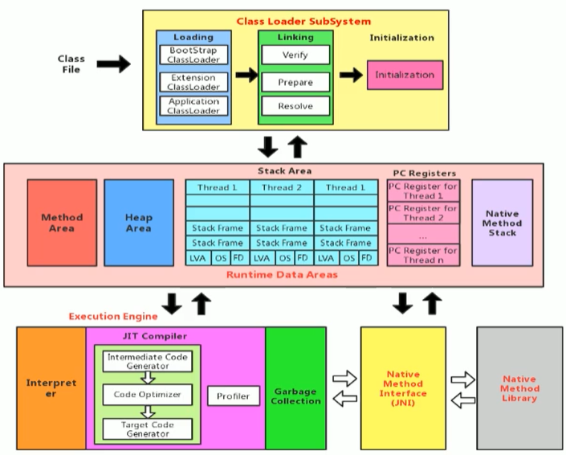

类加载子系统之后，进入了运行时数据区（Runtime Data Area），其实运行时数据区就类似一个存储容器，但是不做任何的计算操作，真正的计算操作是执行引擎在做的内容。

所以运行时数据区和执行引擎的关系有点类似与内存和 CPU 之间的关系，内存也是一个存储容器，CPU 才是计算的人。

其实运行时数据区使用的就是内存，不同的 JVM 对内存的划分方式和管理机制存在差异，这里我们就是用 Hotspot 来作为主要的探索对象。

上图是一个详细版本的，但是不是非常直观，下面放出一个比较直观的图像：


注意 JIT 缓存，不同人对 JIT 缓存划分的区域有不同的见解，但是有一点是非常明确的：它是非堆空间。

---

在运行时数据区中划分为了很多空间，在这其中，有一些是跟随虚拟机启动而创建，随着虚拟机退出而销毁的，它们的生命周期就是虚拟机的生命周期。还有一些是和线程一一对应的，它们的生命周期就是线程的生命周期。

在下图中，灰色部分是单独线程私有的，红色部分是多个线程之间共享的，也就是红色部分是有可能产生线程安全问题的部分。

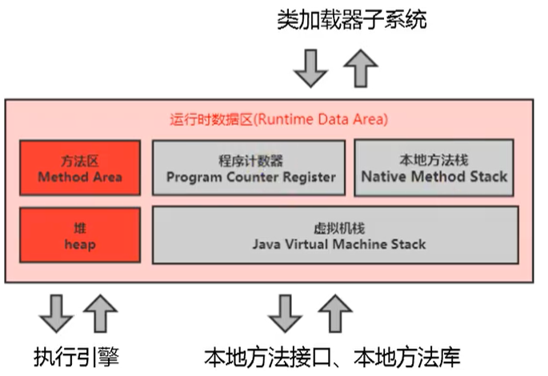

线程私有：

- PC 寄存器（程序计数器）。
- 栈。
- 本地方法栈。

线程间共享：

- 堆。
- 堆外内存（方法区、JIT 缓存）。

1. 堆和方法区是线程之间共有的，所以会涉及到线程的安全问题。
1. 堆和方法区都可以进行垃圾回收，但是可以说绝大多数都会在堆中，只有少数在方法区中。
1. 方法区其实只是一个抽象的概念，它的落地实现在不同版本中有所不同（也就是通常说的永久带和元空间）。

---

每一个 JVM 都会有独一无二的 Runtime 实例，这个 Runtime 实例其实就可以理解为我们的运行时数据区。


---

### JVM 中的线程

JVM 允许一个或多个线程并行执行，**在 Hotspot JVM 中，每一个线程都和操作系统的本地线程一对一对应**，因为线程其实是操作系统的本地线程，Java 并不能直接调用操作系统，所以需要的是一个映射关系来对应操作系统。

当 Java 线程准备好了之后（例如 PC 寄存器、栈存储等），本地线程才开始创建。一旦本地线程执行成功，就会调用 Java 线程中的 `run()`。假如 `run()` 方法出现了一些异常，Java 线程就会终止，但是本地线程的内容还没有结束。

本地线程要在确认 JVM 是否要终止，这个参考条件就是当前终止的 Java 线程是不是最后一个非守护线程，也就是说当程序只剩下守护线程了，那么 JVM 就可以退出了。

在 Hotspot 中，守护线程主要有这样几个：

- 虚拟机线程。
- 周期任务线程。
- GC 线程。
- 编译线程。
- 信号调度线程。

## PC 寄存器（程序计数器）

PC 寄存器其实是对物理 PC 寄存器的一个模拟，实际上它和物理机的寄存器不是一个东西。

PC 寄存器的主要作用就是存储下一条执行的地址，也就是即将执行的指令代码，执行引擎会读取这个指令去执行。

PC 寄存器是线程私有的，也就是说每一个线程都会有一个 PC 寄存器，实际上，每一个线程在任何时间点中，只会有一个方法在运行，也就是所谓的**当前方法**（假如执行的是本地方法栈中的 native 方法，就是 undefined）。

- PC 寄存器是很小的一块空间，几乎可以忽略不计，它也是运行速度最快的一块区域。
- 在 JVM 规范中，规定了每个线程都要有自己的 PC 寄存器，生命周期与当前线程保持一致。
- 字节码解释器工作就是依赖 PC 寄存器的值来选取下一条需要执行的字节码指令。
- 唯一一个在 Java 虚拟机规范中，没有规定任何 `OutOfMemoryError` 的区域。

**为什么需要 PC 寄存器**

当 CPU 在切换线程之后，需要知道应该从那一条指令继续执行，这个时候应该有一个地方来存储下一条应该执行的指令，那么这就是 PC 寄存器的作用。

并且 PC 寄存器必须为线程私有，否则必定会出现线程之间互相干扰的情况。

## 虚拟机栈

### 虚拟机栈概述

**虚拟机栈出现的背景**

指令集架构有两种：

- 基于寄存器的指令集架构。
- 基于栈的指令集架构。

基于寄存器的指令集架构和硬件是绑定在一起的，执行指令时直接使用 CPU 来完成。由于使用高速缓冲区，所以执行速度快，但是无法做到跨平台。

基于栈的指令集架构是基于内存完成的，所以速度上不如基于寄存器的指令集架构，但是优点就是可以做到跨平台，可移植性良好。

JVM 一开始在设计的时候就是基于栈的指令集架构。由于跨平台的特性，Java 的很多指令都是基于栈来设计的。

**内存中的栈和堆**

虽然 JVM 内存结构中不仅仅只有栈和堆，但是这两个比较重要。栈说是运行时的单位，堆是存储时的单位：

- 堆需要解决的是存储的问题，数据应该怎么放，放在什么地方，全都是堆需要解决的问题。
- 栈需要解决的是运行的问题，程序应该如何与运行，如何去处理数据，全都是栈需要解决的问题。

整体看下来的关系是这样的，但是这个关系也不是绝对的，从局部来看，基本数据类型和对象引用也是要放在栈中的。

**栈的优点**

栈是一种比较快速有效的分配方式，它的访问速度仅仅次于 PC 寄存器。JVM 直接对栈进行的操作只有两个：

- 每个方法的执行都伴随着压栈（也就是入栈）。
- 方法执行结束出栈。

对于栈来讲，方法执行完成之后就出栈，方法没有执行完成就不会出栈，所以对于栈来讲，它的操作一目了然，根本就不需要进行调优的操作。

**栈的异常**

栈不存在垃圾回收问题，但是会出现其他的问题。

对于 Java 虚拟机来讲，它允许栈是动态的，也允许栈是固定大小的，但是这两种策略会导致两个问题：

- 假如栈是固定不变的，那么当一个栈只有入栈没有出栈，就可能导致 `StackOverflowError`。
- 假如栈是动态地，那么假如当一个栈只有入栈没有出栈，就可能导致电脑的总内存撑爆，也就是 `OutOfMemoryError`。

当然了，发生 OOM 的另一个可能就是栈太多了，也有可能出现这种问题。

**调节栈的大小**

我们可以使用参数 `-Xss` 选项来设置线程的最大栈空间，栈的大小直接决定了函数调用的最大可达深度。

### 栈帧概述

每一个线程都有自己单独的栈，而栈的存储单位就是栈帧（Stack Frame）。每一个线程中，每个执行的方法都对应着一个栈帧。

栈的结构并不简单，事实上，它是一个内存块，是一个数据集。

**栈运行原理**

- 栈的操作只有两种：压栈和出栈，遵循先进后出（First In，Last Out）的原则。
- 在一条活动线程中，在某一刻只会有一个栈帧在执行，也就栈的顶部的栈帧，这个栈帧被称为当前栈帧（Current Frame），与当前栈帧相对应的方法就是当前方法，定义这个方法的类就是当前类。
- 执行引擎运行的所有字节码指令只对当前栈帧进行操作。
- 如果在该方法中调用了其他的方法，对应的新的栈帧会被创建出来并入栈，称为新的栈顶。

上面说到，栈帧其实对应方法，一个方法就是一个栈帧。栈帧中存在如下结构：

- Local Variables：局部变量表
- Operand Stack：操作数栈，或者叫做表达式栈
- Dynamic Linking：动态链接
- Return Address：方法返回地址，方法正常或者异常退出的定义
- 一些附加信息

栈能存多少完全取决于栈帧的内部结构的大小，而栈帧内部结构的大小很大程度上来自局部变量表和操作数栈。


### 局部变量表（Local Variables）

**局部变量表概述**

局部变量表也叫做局部变量数组或者本地变量表，它其实是一个数字数组，主要存放的是方法参数和定义在方法体内部的局部变量（变量类型包括对象引用类型、返回值类型）。

> 它其实是一个数字数组

这个局部变量表其实是一个一维数组，从形参直到返回值都是局部变量表中的内容。但是这个数组是数字数组，也就是说所有基本类型的数字都算，而且所有能够被转为数字类型的都算。

byte、short、chart 会提前被 JVM 转为 int，char 是有对应 ASCII 或者 Unicode 的，所以当然也可以转为数字。boolean 中，false 为 0，true 为非零数。

对象引用地址、返回值类型，那么其实都可以使用 int 来表示了。

由于局部变量表建立在栈帧上，而栈帧是栈中内容，所以局部变量表不存在线程问题。而且局部变量的生命周期和栈帧一致，局部变量表中的变量只能在当前方法中使用。

局部变量表的所需容量大小是在编译期就确定下来的，并且会保存在方法的 Code 属性的 `maximum local variables`（局部变量表最大槽数） 中，方法运行期间不会改变局部变量表大小。

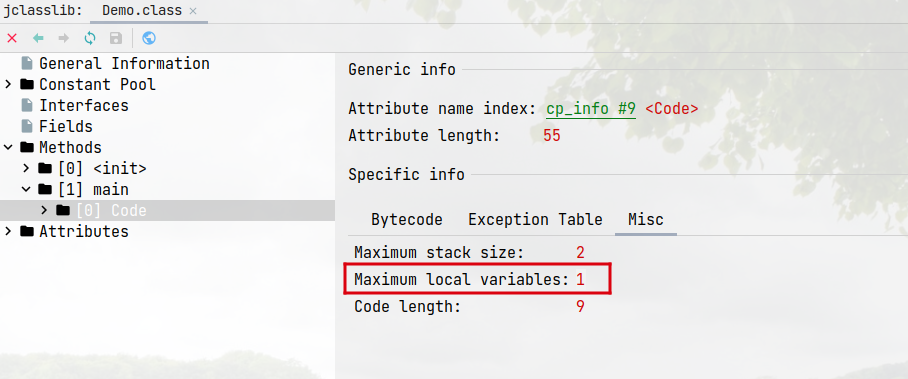

这个容量大小说的不是占用多大内存，而是指的几个变量，类似上图其实就是一个变量。

在栈中，局部变量表算是和性能调优、栈内存关系比较密切的一个结构，因为局部变量表中可能会存放一些对象的引用，不管是直接引用还是间接引用，这个对象都不能被 GC。

**字节码中方法内部结构剖析**

```java
public class Demo {

  public static void main(String[] args) {
    int a = 1;
    int b = 2;
  }
}
```

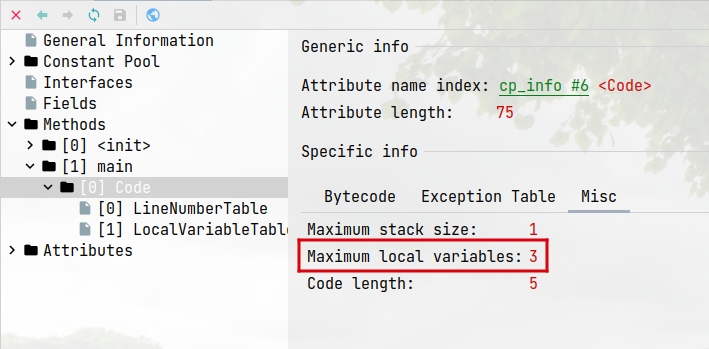

最大深度：3，也就是说局部变量表中存有三个变量。

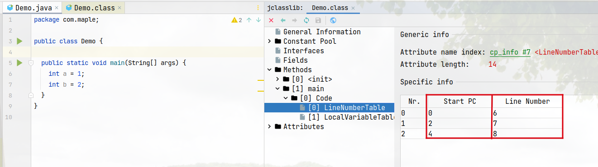

- `Start PC` 指的是字节码中的起始位置。
- `Line Number`：和代码中变量的位置有关。


- `LocalVariablesTable`：局部变量表，可以看到有三个变量：`args`、`a`、`b`。
- `Start PC`：字节码中的位置。
- `Length`：字节码的作用长度。
- `Start PC + Length`：当前变量在字节码中的作用范围。

**变量槽**

之前说局部变量表是一个数值类型的数组，这个数组的基本单元我们称之为槽（slot），也就是变量槽。

在局部变量表中，不同的数值类型的存储是有区别的，32 位只占用一个 slot，64 位占用两个 slot。

例如 byte、short、chart、boolean、int，在 slot 存储时全都使用 int 存储，自然占用 1 个 slot，float 也占用一个 slot。对于 double、long 来讲，自然占用两个 slot。

对于占用两个 slot 的变量来讲，它对应的局部变量表的数组对应的是两个下标，我们取起始下标。


上图中，b 为 long 类型，索引为 2，但是后面的 c 直接从 4 开始，这也证明 64 位占用两个 slot。

---

假如当前方法是通过构造方法或者非静态方法创建的，那么该对象的引用（this）会存放到当前栈帧局部变量表的 0 号索引处。


首先是 Demo 类，当前的 `main()` 方法并非实例方法，所以第一个参数就是 args。

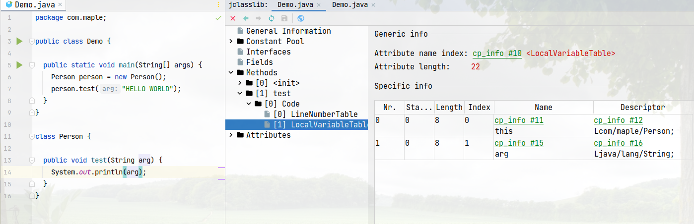

然后是 Person 类，当前的 `test()` 方法是实例方法，所以第一个参数是当前引用 this。

**成员变量和局部变量的对比**

- 成员变量（在类中定义的变量）：

    - 类变量：使用 `static` 修饰，属于类的变量。

        在类的加载过程中，有一个链接阶段，在链接阶段中的准备阶段有一次默认的赋值操作。之后在加载过程中的初始化阶段会显示赋值。

    - 实例变量：在类中直接声明的变量，属于对象的变量。

        对象创建时会在堆中分配实例变量空间，之后进行默认的赋值操作。

- 局部变量（在方法中定义的变量）：

    使用之前必须显示进行赋值操作，没有默认赋值操作。

### 操作数栈（Operand Stack）

**操作数栈概述**


每一个栈帧中，除了局部变量表，还有一个操作数栈，也叫做操作栈。操作数栈是使用数组来进行实现的。

虽然操作数栈是基于数组来进行实现的，但是它仍然是栈，也就是说不使用下标来访问，而是使用入栈出栈的方式访问元素。

操作数栈的具体作用就是用来保存计算的中间结果，具体流程如下：

1. 操作数栈从局部变量表中拿到数据。
1. 执行引擎从操作数栈中拿到数据。
1. 执行引擎进行计算，得到结果。
1. 执行引擎算出的结果放到操作数栈中。
1. 重复操作：操作数栈 -> 执行引擎 -> 操作数栈，直到所有计算全部完成。
1. 将结果同步到局部变量表中。

以上局部变量表 -> 操作数栈 -> 执行引擎，这个数据流转的方向类似于电脑中 硬盘 -> 内存 -> CPU 的关系，JVM 本来就是仿照这样的结构来设计的。所以有一句话叫做 JVM 是基于栈的执行引擎。

刚才说操作数栈是使用数组来实现的，所以它的大小其实早在编译期间就已经确定了。


操作数栈的空间分配规则类似局部变量表：

- 32 位占用一个栈单位的深度。
- 64 位占用两个栈单位的深度。

byte、short、char、boolean 会转为 int 存储。

**局部变量表、操作数栈、执行引擎的使用**

```java
public class Demo {
    public static void main(String[] args) {
        test();
    }

    public static void test() {
        byte i = 15;

        int j = 8;

        int k = i + j;
    }
}
```


以上代码的操作数栈深度：2，局部变量表长度：3，字节码长度：11。


字节码如上图，进行了如下操作：

```
# 将 15 push 进操作数栈 Operand Stack 中
0: bipush        15
# 将 15 从 Operand Stack 中 pop 出来，并且存放到 Local Variables 中索引为 0 的位置中
2: istore_0
# 将 8 push 到 Operand Stack 中
3: bipush        8
# 将 8 从 Operand Stack 中 pop 出来，并存放到 Local Variables 中索引为 1 的位置中
5: istore_1
# 将 Local Variables 中索引为 0 的位置中的数据取出，push 进 Operand Stack 中
6: iload_0
# 将 Local Variables 中索引为 1 的位置中的数据取出，push 进 Operand Stack 中
7: iload_1
# 将 Operand Stack 栈顶和栈顶前一位的数据相加，并重新 push 到 Operand Stack 中
8: iadd
# 将 Operand Stack 中的数据 pop 出来，并存放到 Local Variables 中索引为 2 的位置中
9: istore_2
# 退出
10: return
```

因为操作数栈其实是存储在内存中的，所以频繁读写肯定会影响执行速度。Hotspot JVM 提出了栈顶缓存的概念，也就是说将栈顶元素全部都缓存到物理 CPU 的寄存器中，以此来降低对内存的读写次数，提高执行引擎的执行效率。

### 动态链接（Dynamic Linking）

**动态链接**


之前已经讲过局部变量表，操作数栈，下面是动态链接。

这里的动态链接不是真正的动态链接，它其实就是一个引用，里面放着的是运行时常量池中，这个方法的引用，保存这个引用地址的目的其实是为了实现真正的动态链接。

在 Java 文件编译为字节码文件时，所有的方法引用和变量都作为符号引用保存在常量池中，动态链接的真正作用就是将符号引用转换为调用方法的直接调用。

举个例子：

```java
public class DynamicLinkDemo {

    int num = 1;

    public void A() {
    }

    public void B() {
        A();
        num++;
    }
}
```

当前定义了两个方法 A、B，然后在 B 中使用 A，将如上 Java 文件编译为字节码，之后使用 `javap -verbose DynamicLinkDemo.class` 转为字节码文件查看，或者可以使用 jclasslib 查看，这里使用这种方式比较好举例。

有条件可以使用 JClassLib 插件查看，比单纯看字节码要方便一些，看的时候注意首先要看方法，然后从方法中找到符号引用。

```text
Classfile /C:/Users/causes/Desktop/DynamicLinkDemo.class
  Last modified 2021-12-14; size 501 bytes
  MD5 checksum f078fcd1ceaa7a068fa01b25dc11c860
  Compiled from "DynamicLinkDemo.java"
public class causes.classloaders.DynamicLinkDemo
  minor version: 0
  major version: 52
  flags: ACC_PUBLIC, ACC_SUPER
-- 运行时常量池
Constant pool:
   #1 = Methodref          #5.#19         // java/lang/Object."<init>":()V
   #2 = Fieldref           #4.#20         // causes/classloaders/DynamicLinkDemo.num:I
   -- 使用了符号引用，符号引用指向的地址是 #4 和 #21
   #3 = Methodref          #4.#21         // causes/classloaders/DynamicLinkDemo.A:()V
   -- #4 仍然是符号引用，指向了 #22
   #4 = Class              #22            // causes/classloaders/DynamicLinkDemo
   #5 = Class              #23            // java/lang/Object
   -- 变量 num
   #6 = Utf8               num
   -- I 为 int
   #7 = Utf8               I
   #8 = Utf8               <init>
   -- 返回值类型 V，就是 void
   #9 = Utf8               ()V
  #10 = Utf8               Code
  #11 = Utf8               LineNumberTable
  #12 = Utf8               LocalVariableTable
  #13 = Utf8               this
  #14 = Utf8               Lcauses/classloaders/DynamicLinkDemo;
  -- 字符 A
  #15 = Utf8               A
  #16 = Utf8               B
  #17 = Utf8               SourceFile
  #18 = Utf8               DynamicLinkDemo.java
  #19 = NameAndType        #8:#9          // "<init>":()V
  -- 引用了 #6 和 #7
  #20 = NameAndType        #6:#7          // num:I
  -- 引用了 #15 和 #9
  #21 = NameAndType        #15:#9         // A:()V
  -- 保存的是类方法的名称
  #22 = Utf8               causes/classloaders/DynamicLinkDemo
  #23 = Utf8               java/lang/Object
{
  int num;
    descriptor: I
    flags:

  public causes.classloaders.DynamicLinkDemo();
    descriptor: ()V
    flags: ACC_PUBLIC
    Code:
      stack=2, locals=1, args_size=1
         0: aload_0
         1: invokespecial #1                  // Method java/lang/Object."<init>":()V
         4: aload_0
         5: iconst_1
         6: putfield      #2                  // Field num:I
         9: return
      LineNumberTable:
        line 3: 0
        line 5: 4
      LocalVariableTable:
        Start  Length  Slot  Name   Signature
            0      10     0  this   Lcauses/classloaders/DynamicLinkDemo;

  public void A();
    descriptor: ()V
    flags: ACC_PUBLIC
    Code:
      stack=0, locals=1, args_size=1
         0: return
      LineNumberTable:
        line 8: 0
      LocalVariableTable:
        Start  Length  Slot  Name   Signature
            0       1     0  this   Lcauses/classloaders/DynamicLinkDemo;

  public void B();
    descriptor: ()V
    flags: ACC_PUBLIC
    Code:
      stack=3, locals=1, args_size=1
         0: aload_0
         -- 使用了引用，对应的符号引用为 #3
         1: invokevirtual #3                  // Method A:()V
         4: aload_0
         5: dup
         -- 符号引用为 #2
         6: getfield      #2                  // Field num:I
         9: iconst_1
        10: iadd
        -- 符号引用为 #2
        11: putfield      #2                  // Field num:I
        14: return
      LineNumberTable:
        line 11: 0
        line 12: 4
        line 13: 14
      LocalVariableTable:
        Start  Length  Slot  Name   Signature
            0      15     0  this   Lcauses/classloaders/DynamicLinkDemo;
}
SourceFile: "DynamicLinkDemo.java"
```

```java
public class DynamicLinkDemo {
    static void eat(Animal animal) {
        animal.eat();
    }

    public static void main(String[] args) {
        eat(new Cat());
    }
}

class Animal {
    void eat() {
        System.out.println("吃");
    }
}

class Cat extends Animal {

    void eat() {
        System.out.println("猫吃鱼");
    }
}
```

毫无疑问，这个最终输出的是猫吃鱼，这个过程就叫做动态链接。

**解析与分派**

上面的动态链接说到了符号引用，通过符号引用找到了最终的方法地址，然后调用。

在 JVM 中，将符号引用转换为调用方法的直接引用，这个和方法的绑定机制有关，方法的绑定机制分为两种：动态链接、静态链接。

静态链接：在字节码被加载到 JVM 时，假如被调用的对象在编译期间已经确定了，并且在运行期间保持不变，那么这种符号引用到直接引用的过程叫做静态链接。

动态链接：这个动态链接不是栈帧中的内部结构，而是真正的动态链接，也就是方法的绑定机制。假如方法不能在编译期间确定，也就是说只能在方法的运行过程中将符号引用转换为直接引用，这个过程叫做动态链接。

静态链接和动态链接都需要将符号引用转换为直接引用，区别就是是否能在编译期间就确定转换为何种直接引用。

**早期绑定和晚期绑定**

早期绑定和静态链接对应，晚期绑定和动态链接对应。绑定和链接的区别就是，链接可以看成是绑定的一个子集。绑定的范围包括类、方法、变量，而链接只是针对方法。

早期绑定就是在编译期可知，并且在运行期间保持不变。晚期绑定就是在编译期无法确定，只有在运行期间才可以确认的。

**虚方法、非虚方法**

我们刚才在说动态链接的时候，说道最后符号引用转换为直接引用的过程叫做动态链接。但是我们在实际上调用的时候，还是使用的父类的形参去调用的方法，这个就表现为多态。

非虚方法有以下几种：

- 静态方法。
- 私有方法。
- final 方法。
- 实例构造器方法。
- 父类方法。

父类方法指的不是在子类中重写之后的方法，指的是在子类中使用 `super.方法()` 的意思。

这些方法其实都有一个共同的特点，也就是不能被重写的方法，都不能够实现多态的方法。除了这些方法，其他都是虚方法。

为了提高性能，JVM 在类的方法区中建立了虚方法表，方便使用索引查找。假如我们调用子类重写的方法，它会首先寻找子类中的虚方法表，找不到则向上查找，直到调用。

虚方法表形成在类的加载中，链接阶段的解析阶段。

### 方法返回地址（Return Address）


方法返回地址有些人将其划分到了帧数据区。

方法的返回地址其实就是栈帧中的一块区域，它存放的是调用该方法的 PC 寄存器的值。简单来讲就是此方法执行完成之后，执行引擎会根据它来确定下一条的指令应该执行什么。

在此时，方法的返回地址存放的指令和 PC 寄存器中存放的指令相同，但是它们两个用于不同的情况：PC 寄存器是线程中的使用，方法返回地址仅在方法中。

假如线程切换回来之后，执行引擎仍然需要依赖 PC 寄存器中的指令，反之线程没有切换时则不需要。

此情况只适合与方法正常退出的时候，假如方法出现了异常则不会采用。

### 一些附加信息

没什么东西。

## 本地方法栈

本地方法栈用来管理本地方法的调用，它类似虚拟机栈：

1. 线程私有。
1. 允许动态扩展或者固定。
1. 当某线程调用一个本地方法（native）时，此线程则不再受虚拟机限制，和虚拟机拥有相同权限。
1. 不是所有 JVM 都支持本地方法，要看具体实现。Java 虚拟机规范中并没有明确要求本地方法栈所使用的语言。

## 堆

### 堆的概述


在运行时数据区中，堆是最大的一个空间。调优过程主要是对堆进行调优。

一个 Java 程序是一个进程，而堆和方法区是对应一个进程的，进程中有多个线程，所以说多个线程其实是共享一个堆和方法区。

1. 一个 JVM 实例只存在一个堆，堆是 Java 内存管理的核心区域。
1. Java 堆区在 JVM 被启动时被创建，其空间大小也被确定了，是 JVM 管理的最大的一块区域（在 JVM 启动之前即可设置，堆内存大小可调）。
1. Java 虚拟机规范中规定，堆可以处于物理上不连续的内存空间中，但是在逻辑上应该被认为是连续的。
1. 所有的线程共享 Java 堆，在这里还可以单独给线程划分私有的缓冲区（Thread Local Allocation Buffer，TLAB）。
1. 几乎所有的对象实例和数组都应该分配到堆上。
1. 在方法结束之后，堆中的对象不会被立刻移除，而是要等到垃圾回收的时候来移除。
1. 尽量减少 GC 的次数，因为 GC 需要消耗资源，并且有些垃圾回收器会出现时停的效果，会影响正常的用户线程。

```java
System.out.println("start……");
new Thread(() -> {
  try {
    Thread.sleep(1000000);
  } catch (InterruptedException e) {
    e.printStackTrace();
  }
}).start();
```

之后打开 `JDK 的安装目录 --> bin --> jvisualvm.exe`，打开，可以看到：


这其实就是检测 JVM 的一个工具，点击 `工具 --> 插件 --> 可用插件`，在搜索框中 `Visual GC`，安装，或者直接使用 IDEA 的插件 `Visual GC`。

给 Java 程序配置如下代码：`-Xms10m -Xmx10m`，此代码设置了堆空间的大小，最大值和最小值均为 10M。

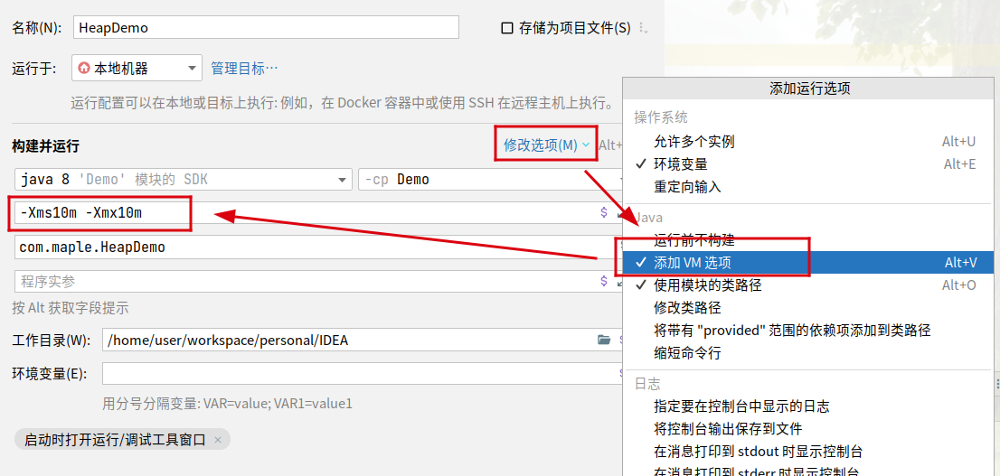

准备代码：

```java
System.out.println("start...");
new Thread(() -> {
  try {
    Thread.sleep(1000000);
  } catch (InterruptedException e) {
    e.printStackTrace();
  }
}).start();
```


上图中有几个区域，之后再讲。

**设置堆空间大小**

- `-Xms`：表示设置堆空间的起始内存，等价于 `-XX:InitialHeapSize`
- `-Xmx`：表示设置堆空间的最大内存，等价于 `-XX:MaxHeapSize`
- `-XX:+PrintGCDetails`：查看内存详细信息。

在这其中，`-X` 是 JVM 的运行参数，`mx` 代表的是 memory start，也就是起始内存。单位不写默认为字节，可以为 k、m、g。

一旦内存使用大小超出了 `-Xmx` 的指定，则会抛出 OOM 异常。通常情况下，我们将最大内存和最小内存设置相同的值，为了能够在 GC 完成之后不需要重新计算堆大小，用来提高性能。

默认情况下，堆的初始内存大小为 `电脑内存 / 64`，最大内存：`电脑内存 / 4`。

### 新生代和老年代

**内存结构**

堆内存的划分，分为：

- 新生代 YoungGen
- 老年代 OldGen
- 元空间

对于元空间来说，逻辑上属于堆，但其实是方法区的实现，我们在方法区时探索。这里讲一下新生代和老年代。

堆内存如果更细致地划分，可以划分为新生代（包括 Eden、Survivor0、Survivor1），老年代。

新生代的 Survivor0 和 Survivor1 为幸存者零区（from 区）、幸存者一区（to 区）。

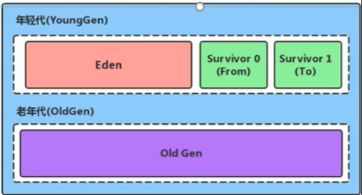

在默认情况下，新生代和老年代的内存占比为 1:2，新生代中 Eden:Survivor0:Survivor1 为 8:1:1

新生代和老年代的占比可以使用参数 `-XX:NewRatio=2` 来表示 `老年代/新生代` = 2，也就是新生代占用 1，老年代占用 2。假如设为 `-XX:NewRatio=4`，则表示新生代占用 1，老年代占用 4，新生代占用整个堆的 `1/5`。

新生代中 `-XX:SurvivorRatio=8` 表示 Eden:Survivor0:Survivor1 为 8:1:1。假如设置为 `-XX:SurvivorRatio=3`，这就代表 Eden:Survivor0:Survivor1 为 3:1:1。

虽然官方文档上明确新生代中的比例是 8:1:1，但其实并不是，这是因为默认情况下会开自适应的内存调节，所以会出现这种情况。

下面有几条注意事项：

- 几乎绝大部分的 Java 对象都是在伊甸园区被 new 出来的，但是伊甸园区放不下了，也有可能转到老年代。
- 绝大部分的新生对象都会很快死亡。
- 可以使用 `-Xmn` 设置新生代大小。

**对象分配过程**

我们会首先讲解普通情况，之后才会说一些特殊情况，对于一般情况情况来说：

1. 对象在新生代的 Eden 区出生。
1. 当 Eden 区满后，进行一次 Minor GC（也叫做 YGC），这次 GC 会将 Eden、S0、S1 区的所有垃圾对象回收。

    说明一下，因为这是首次 YGC，所以没有 S0 和 S1 的垃圾，只回收了 Eden 的垃圾。

    此次回收之后，没有被回收的对象年龄 +1（每一个对象都有一个年龄计数器），然后放到了 S0 区域。

1. 时间继续发展，Eden 区域又满了，再次进行 YGC。

    此时会回收 Eden、S0、S1 的垃圾，但是 S1 没有垃圾，所以只回收了 S0 的垃圾。

    没有被回收的对象年龄 +1，并且 S0 和 Eden 的对象会全部放到 S1 区。（也就是说，S0 和 S1 区总有一个空的区域）。

1. 时间再次进行，再次进行了一次 YGC。

    此时回收了 Eden、S0、S1 的垃圾，但是 S0 没有垃圾。

    没有被回收的对象年龄 +1，并且 Eden、S1 的对象被放到了 S0 区。

1. 当某些对象的年龄达到了 16 的时候，这些对象会放到 Old Gen 老年代。老年代的 GC 之后有讲。

对象分配时的注意点：

1. YGC 只有在 Eden 区满的时候才会触发，S0 和 S1 不会触发。
1. YGC 会同时回收 Eden、S0、S1。
1. 默认情况下，对象年龄高于 15 则直接放到 Old Gen，但是我们可以使用 `-XX:MaxTenuringThreshold=xx` 来设置年龄。
1. S0、S1 也叫做 from、to 区，但是 from 和 to 是动态的，向哪个区转移哪个区就叫做 to。
1. 垃圾回收频繁在新生代收集，很少在老年代收集，几乎不在永久代/元空间收集。

对象分配特殊情况：

1. 新生代内存问题：一个对象太大，Eden 会判断是否可以直接放到 Old Gen 中，假如可以放则放下，不可以放：

    1. 进行一次 Full GC，判断是否可以放下，可以放则放。
    1. 不可以放，则判断是否可以进行 JVM 动态扩容，可以扩容则扩容之后放。
    1. 不可以扩容直接 OOM。

1. 非新生代内存问题：Eden 区域可以放下，但是在进行 YGC 后，发现 S0/S1 区放不下了：

    1. 判断可以放到 Old Gen 中，可以则放下。
    1. 不可以放下则触发一次 Full GC，再次尝试放下。
    1. 放不下尝试 JVM 动态扩容。
    1. 不可以扩容则直接 OOM。

**调优工具**

IDEA 中安装插件 `JProfile`

### GC 介绍

在 HotSpot JVM 中，GC 按照回收区域分为两类：

1. 部分收集（Partial GC）：

    - YGC/Yong GC/Minor GC：回收新生代。
    - Old GC/Major GC：只收集老年代，某些垃圾回收器支持。
    - Mixed GC：整个新生代和部分老年代，某些垃圾回收器支持。

1. 整堆收集（Full GC）：

    - 回收整个 Java 堆和方法区。注意，Full GC 和 Major GC 是两个 GC，不要混淆。

GC 的触发机制：

1. Minor GC 触发：

    新生代中的 Eden 区空间不足时，而不是两个 Survivor 区不足时。

1. Major GC 触发：

    当对象向老年代转移时，发现老年代空间不足时会首先触发一次 Minor GC，再次尝试仍发现不足时会触发 Major GC。

    一般的垃圾回收器会 Minor GC 再进行 Major GC，但是也不是绝对的，比如 Parallel Scavenge 收集器会直接进行 Major GC。

1. Full GC：

    调用 `System.gc` 时，系统会建议 Full GC，但不一定会执行。

    当老年代和方法区不足时会执行。

    Minor GC 之后，或者是 S0 放不下的对象进入到老年代时（其实就是老年代不足时），进行一次 Full GC。

:::tip

这里注意，Full GC 和 Major GC 是一种混合使用的情况，所以有时会触发 Major GC，有时会触发 Full GC。

尽量不要触发 GC：GC 的过程会有一个时停（STW，Stop The World）的效果，这个效果下除了垃圾回收之外，所有的任务都不会进行，对于用户来说，感觉就会很卡。

如果要触发 GC，YGC 的速度原高于 Full GC 的速度。

:::

### TLAB

Thread Local Allocation Buffer，TLAB，是在堆空间（Eden 区）中为每一个线程单独分配的一块空间。

我们知道，每个线程可以访问堆的数据，这样的话加锁是十分频繁的，而且加锁会影响内存的分配速度。因此 TLAB 应运而生。

TLAB 为每个线程划分了私有空间，解决了加锁效率低的问题，同时避免了安全问题。所以 Open JDK 的所有 JVM 几乎都会有 TLAB 存在。

其实不是所有的对象实例都可以在 TLAB 中分配内存，因为确实不大（默认是 Eden 的 1%），但是 JVM 确实将 TLAB 作为首选。

我们可以使用选项 `-XX:UseTLAB` 来设置是否开启 TLAB 空间，他的默认情况下是开启的

我们可以使用选项 `-XX:TLABWasteTargetPercent` 来设置 TLAB 所占用的空间大小，默认是1%

:::tip

注意，ThreadLocal 和 TLAB 没有任何关系，ThreadLocal 是和线程相关的普通类。不过思想差不多。

:::

### 堆常用参数

- `-XX:+PrintFlagsInitial`：查看所有的参数的默认初始值
- `-XX:+PrintFlagsFinal`：查看所有参数的最终值
- `jinfo -flag 参数 进程ID`：通过 jps 查看当前运行的进程的参数的值，比如：`jinfo -flag SurvivorRatio 9875`
- `-Xms`：初始堆内存空间，默认为物理内存的 1/64
- `-Xmx`：最大堆内存空间，默认为物理内存的 1/4
- `-Xmn`：设置新生代的大小，初始值和最大值
- `-XX:NewRatio`：配置新生代和老年代在堆结构的占比，默认为 1:2
- `-XX:SurvivorRatio`：设置新生代中 `Eden:S0:S1` 的比例，默认为 8:1:1，可能会被自动分配修改
- `-XX:MaxTenuringThreshold`：设置新生代垃圾的最大年龄，默认大于 15 会被转移到老年代
- `-XX:+PrintGCDetails`：输出详细的 GC 日志
- `-XX:+PrintGC`：打印 GC 简要信息
- `-verbose:gc`：同样是打印 GC 简要信息
- `-XX:HandlePromotionFailure`：是否设置空间分配担保，JDK7 之后不会影响了，也就是可以理解为 true

### 对象分配存储

**堆是对象分配的唯一选择吗**

其实不是，虽然堆空间是调优的大块，但是随着 JIT 编译器和逃逸分析技术的发展，栈上分配、标量替换等技术将会导致一些变化，对象也不一定绝对会分配到堆上了。

**逃逸分析**

逃逸分析，其实就是分析对象的作用域。

- 当一个对象在方法内部创建之后，假如仅在方法内部使用了，这种情况下自然可以进行栈上分配了。那么我们认为没有发生逃逸。
- 当一个对象在方法内部创建之后，假如被外部的方法所调用，这种情况自然不可以在栈上分配。那么我们就认为这个对象逃逸了。

    常见的逃逸行为：

    1. 在方法中给成员变量赋值。
    1. 方法中返回对象。
    1. 实例引用传递。

栈上分配好处绝对是很大的，首先是线程独有的，不用去考虑并发的问题。然后栈帧弹出之后，对象就没有了，这样也没有了 GC。

TaoBaoVM 有一个创新行为：GCIH，它可以将生命周期比较长的 Java 对象从堆中转移到堆外，并且 GC 不能管理 GCIH 的 Java 对象，这样就会减少 GC 的频率，提升效率。

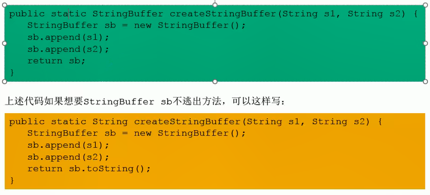

**同步省略**

假如一个对象只能在一个线程中被访问，那么对于这个对象的操作就不需要去考虑同步问题。因为同步的代价是相当高的。

在使用动态编译同步块的时候，JIT 可以使用逃逸分析来确定同步块所使用的锁对象是否只能被一个线程访问。

假如同步块只能被单线程访问，那么 JIT 在编译这个同步块的时候会取消这段代码的同步，这样会大大提高并发性和性能。这个取消同步的过程叫做同步省略，也叫做锁消除。

虽然我们从字节码的角度仍然可以看到 `monitorenter`、`monitorexit` 这两段同步代码，但是在运行时才会去考虑锁消除。因为这个过程是在 JIT 编译期的，而此时字节码早已经编译完成了。

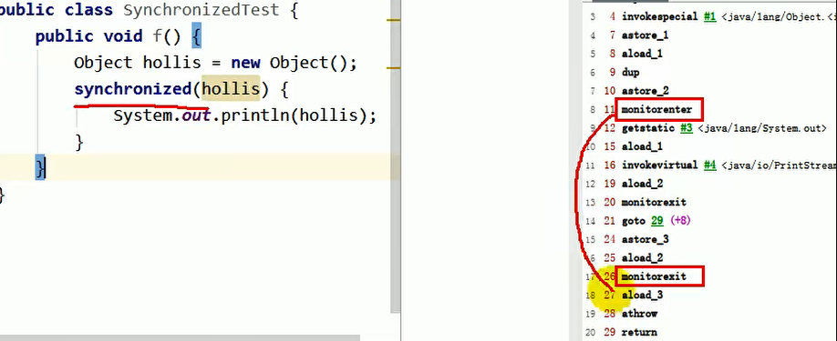

**标量替换**

标量，其实指的就是无法被分解为更小数据的数据。Java 的基本类型就是标量。那些可以被分开的数据我们叫做聚合量。Java 对象就是聚合量。

假如一个对象没有逃逸出方法，那么这个对象就会被 JIT 分解为几个标量。标量替换是很有好处的，因为不需要 new 对象了，也不需要在堆中分配空间了，只需要栈上的空间就足够了，大大减少了 GC。

我们可以使用 `-XX:+EliminateAllocations` 来开启标量替换，默认情况下是开启的。

---

逃逸分析其实本身也是一个比较消耗性能的操作，本身并不是非常成熟，但是是即时编译器优化中一个比较重要的手段（比如已经被应用的 GCIH）。

HotSpot 并没有栈上分配的技术，主要的手段还是标量替换。

## 方法区


从运行时数据区的角度来说，方法区是我们要讲解的最后一个结构。


### 方法区概述

`Person person = new Person();`，这段代码中：

- `Person` 类这个 `.class` 文件被放到了方法区中。
- `new Person()` 是一个新创建的对象，放到了堆中。
- `person` 变量放到了栈中的局部变量表中。


**方法区的演进**

在 JDK7 及以前，习惯上将方法区称为永久代，JDK8 开始我们将方法区称为元空间。

本质上来讲，方法区和永久代并不是等价的，我们只能说针对于 HotSpot 来讲是等价的，对于其他的虚拟机来讲，可能还没有永久代的实现。《Java虚拟机规范》并没有对如何实现方法区做统一要求，例如 BEA JRockit/ IBM J9中不存在永久代的概念。

到了 JDK8，HotSpot 终于永久废弃了永久代的概念，改用 JRockit、J9 一样的，在本地内存中实现的元空间 Metaspace 来代替。

元空间的本质和永久代类似，只不过它们两个的最大区别是：元空间不在虚拟机设置的内存中，而是使用本地内存。

也就是说在永久代的时候，它实现在 JVM 虚拟机中设置的内存中。但是在元空间时，直接使用本地内存，也就是说不再占用 JVM 中的内存了。

永久代和元空间不仅仅是名字变了，结构也有了一些调整，我们在后面讲解。

### 设置方法区大小和 OOM

我们在前面讲，方法区是可以设置为固定大小或者是动态扩容的，那么我们在这里讲一下如何进固定大小的设置。在 JDK7 和 JDK8 有了一些变化，所以他们的指令也有所不同。

- `-XX:PermSize=xx` 设置永久代初始分配空间，默认值是 20.75M。
- `-XX:MaxPermSize=xx` 设置永久代的最大可用分配空间，32 位电脑默认 64M，64 位电脑默认是 82M。

当JVM加载的类信息超过了这个值，会报错 `java.lang.OutOfMemory:PermGen space`

- `-XX:MetaspaceSize=xx` 元数据区初始大小设置，默认是 21M。

    假如触及了这个位置，Full GC 将会被触发，并且卸载没用的类，随后这个 21M 将会被自动重置，重置到多少取决于 GC 释放了多少空间。

    假如释放的空间不足，那么会不超过 MaxMetaspaceSize 的情况下适当提高值，反之会降低该值。

    假如初始化的 MetaspaceSize 设置太低，那么这个值也会调整多次，为了避免频繁 Full GC，应该设置一个合理的的值。

- `-XX:MaxMetaspaceSize=xx` 设置最大大小，默认是 -1 也就是无限制。

### 方法区的内部结构

1. 类的信息：

    这里的类信息是一个泛指，不仅有 class，还有接口、注解、enum、……

1. 运行时常量池：

    这里的运行时常量池中有一个常量池叫做字符串常量池，其中字符串常量池在 JDK 的不同版本中有一些变化

**类型信息**

JVM 必须在方法区存储以下信息

1. 类型的完整有效名称：包名.类名
1. 直接父类的完整有效名：对于 interface 或者是 java.lang.Object 都没有父类
1. 这个类型的修饰符
1. 这个类型实现的接口的一个有序列表

**域信息（成员变量 Field）**

JVM 必须在方法区存储以下信息

1. 保存类型的所有域的相关信息和域的声明顺序
1. 域的相关信息包括：名称、类型、修饰符

:::tip
用 final 修饰的变量，其实在编译阶段就已经将值写入到了 class 文件中

使用 static 修饰的变量则没有在编译写入到 class 文件中，而是在类加载中的链接中的准备阶段将 static 的值进行了一次初始化
:::

**方法信息**

JVM 必须在方法区存储以下信息：

- 方法名称。
- 返回类型（或者void）。
- 参数的数量和类型，按顺序。
- 修饰符。
- 字节码、操作数栈和他的大小、局部变量表和他的的大小。
- 异常表。

## 运行时常量池

**字节码文件中的常量池**

方法区中包含了运行时常量池，字节码中包含常量池。要明白方法区就要明白字节码文件，要明白运行时常量池就要明白字节码中的常量池。

一个有效的字节码文件中除了包含类的版本信息、字段、方法和接口等描述信息之外，还包含一项信息就是常量池表（Constant Pool Table），包含各种字面量和对类型、域和方法的符号引用。


图中就是我们字节码中的的常量池，简而言之，常量池其实是存储基本原材料。常量池也可以看作一张表，虚拟机指令根据这张常量表找到要执行的类名分、方法名、参数类型、字面量等信息。

**运行时常量池**

运行时常量池是方法区的一部分，是常量池在运行时的表现形式。运行时常量池相对于 Class 文件中的常量池的一个重要特征是：具备动态性。

比如说有一些常量池中没有的，但是能够在代码中表现出来，比如 `String.intern()`，这就说明运行时常量池要比常量池具有更多内容信息。

**方法区的演进细节**

只有 HotSpot 才有永久代。HotSpot 方法区中的变化：

| JDK 版本    | 方法区                                                                                               |
| ----------- | ---------------------------------------------------------------------------------------------------- |
| JDK6 及以前 | 静态变量存储在在永久代                                                                               |
| JDK7        | 有永久代，但是逐渐"去永久代"<br>字符串常量池、静态变量移除，保存在堆中                               |
| JDK8及以后  | 无永久代<br>类型信息、字段、方法、常量保存在本地内存的元空间<br>字符串常量池、静态变量仍然保存在堆中 |


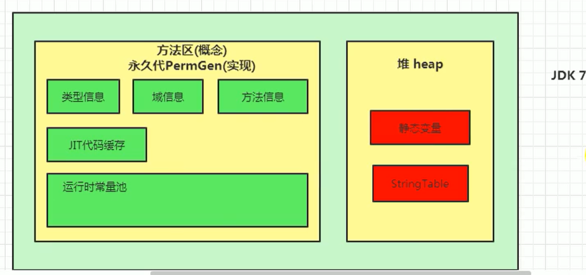


---

为什么永久代要被元空间替换

1. 被 Oracle 收购了，所以 JRockit 和 J9 融合。
1. 永久代的大小是很难确定的，对永久代的调优比较困难。

**方法区的垃圾回收**

一般来说，方法区是难以垃圾回收的，因为不太好实现，但是这个区域的垃圾回收又是必须要实现的。

方法区的垃圾回收主要回收两种内容：

1. 常量池中废弃的常量。
1. 不再使用的类型。


判断一个常量是否被废弃还是比较简单，但是判断一个类型是否属于不再被使用就比较麻烦了，需要满足：

1. 该类的所有实例都被回收，也就是堆中不包含任何此类和其子类的实例。
1. 加载该类的类加载器已经被回收。

    在字节码被类的加载器加载之后，其实类加载器会记录下加载了谁。当字节码放到方法区之后，方法区中也会存一份是哪个加载器加载了这个字节码文件。

    所以这个是一个相互记录的过程。

1. 该类对应的 `java.lang.Class` 对象没有在任何地方被引用，无法在任何地方通过反射访问该类的方法。

## 对象和直接内存

### 对象实例化

**创建对象的几种方式**

1. `new`

    最常见的方式

    变形1：调用单例模式的 静态方法

    变形2：调用 xxxBuilder/xxxFactory 的静态方法

1. 反射

    `Class` 的 `newInstance`：在之后其实已经被废弃了，原因是只能使用空参数的构造器，而且必须是 public。

    `Constructor` 的 `newInstance()`：也是反射的方式，可以调用空参、带参的构造器，没有要求是 public。

1. 使用 `clone()`
1. 使用反序列化。
1. 使用第三方库。

**创建对象的步骤**

1. 判断对象对应的类是否被加载、链接、初始化

    虚拟机遇到一条 new 指令

    首先会去检查这个指令的参数是否在元空间的常量池中定位到一个类的符号引用，并去检查这个符号引用代表的类是否已经被加载、解析、初始化（也就是判断类元信息是否存在）

    假如没有，那么就在双亲委派模式下，使用当前类加载器 `ClassLoader + 包名 + 类名` 为 key 去查找对应的 `.class` 文件

    假如没有找到该文件，那么抛出 ClassNotFoundException，假如找到则进行初始化并生成对应的 Class 对象

1. 为对象分配内存

    首先计算对象占用的空间大小，然后在堆中为对象分配一块内存

    - 假如堆空间的内存是规整的，就比如在书桌上的书摆放地整整齐齐，那么就是使用指针碰撞来为对象分配一块内存

        就是说现在的空间分为两部分，一部分是用过的，一部分是没有用过的，指针碰撞就是说指针指向用过和没用过的交叉点，分配内存的时候根据指针放到没用过的空间，然后指针对应的也移动

        垃圾收集器 Serial 和 ParNew 这种基于压缩算法的，虚拟机就采用这种分配方式，一般带有 compact（整理）过程的收集器使用指针碰撞

    - 假如堆空间的内存是不规整的，就比如在书桌上的书零零散散地放着。那么空间中就有大量的碎片，也就是说有大量的闲置的空间，但是非常零碎，需要使用空闲列表来为对象分配内存

        就是说这种情况下虚拟机就需要维护一个列表，记录那些内存块是可以使用的，再分配的时候需要从列表中找到一块足够大的，能够放下的空间放上

1. 处理并发安全问题：

    处理并发安全问题我们一般使用两种方式：

    - CAS 失败重试、区域加锁保证更新的原子性
    - 为每一个线程预留一块 TLAB，但是这个区域不大，先到先得

1. 初始化分配到的空间

    为对象的属性进行一次默认的初始化，这里可以对应类字节码加载的链接阶段的准备阶段

1. 设置对象的对象头

    记录一下对象的元数据信息、hash等等

1. 执行 `init` 方法进行初始化

    调用类的构造器，就是类的字节码加载的初始化阶段，调用 `<init>`

    这一步是对属性的显示初始化、代码快中初始化、构造器中初始化

### 对象的内存布局

对象的内存布局其实总体上分为三部分：

1. 对象头
1. 实例数据
1. 对齐填充

**对象头 Header**

对象头中包含两部分：

1. 运行时元数据 Mark Word

    - 哈希值（地址值）
    - GC 分代年龄
    - 锁状态标志
    - 线程持有的锁
    - 偏向线程 ID
    - 偏向时间锁

1. 类型指针（注意不是所有的对象都有类型指针）

    - 指向类元数据 InstanceKlass，确定该对象所属的类型

    假如创建的是数组，那么还需要记录数组的长度

**实例数据 Instance Data**

对象真正存储的有效信息，包括程序代码中定义的各种类型的字段（包括从父类继承下来的和本身拥有的字段）

规则：

- 相同宽度的字段总是被分配到一起。
- 父类中定义的变量会出现在子类之前。
- 假如 CompactFields 参数为 true（默认为 true），子类的窄变量可能插入到父类变量的空隙。

**对齐填充**

类似占位符

---


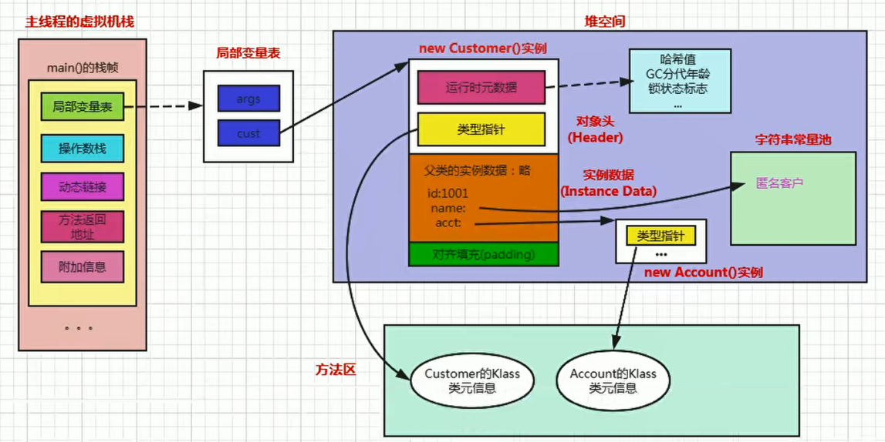

### 对象的访问定位

对象访问方式主要有两种方式：

1. 句柄访问。
1. 直接指针（HotSpot 采用）。

**句柄访问**

之前我们在说栈的时候已经说了，本地变量表中存放引用。

在 Java 堆中专门开一块空间放了一个叫做句柄池的东西，句柄池中的指针有两块：

- 一块是指向到对象实例数据的指针。
- 一块是指向到对象类型数据的指针。

这种方式的好处是当对象移动位置的时候，Java 栈中的引用不用修改了，只需要修改句柄池中的对象实例数据指针信息即可，但是坏处是效率不高。

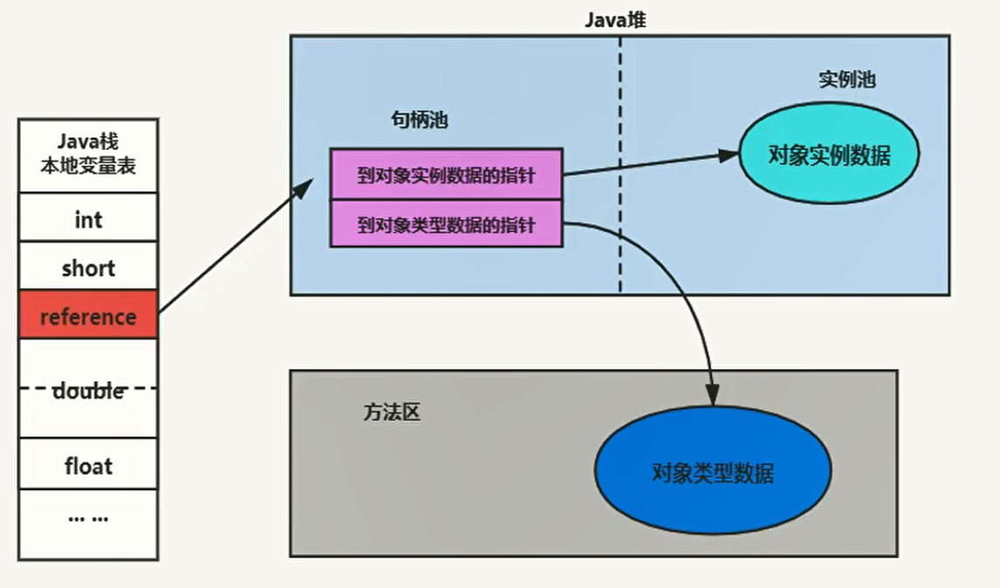

**直接指针**

HotSpot 采用这种方式，栈的本地变量表中存放引用，直接指向到对象实例数据，对象的实例数据中有一个到对象类型数据的指针，指向方法区中对象类型数据。

这样的坏处是对象移动位置的时候，Java 栈中的引用需要做修改，但是好处是效率变高了，不需要专门开一个句柄池，整体上来说这种方式更好一些，所以 HotSpot 采用这种方式。


### 直接内存

我们的 JDK8 使用的元空间，元空间就是使用的直接内存。

要注意直接内存并不属于 Java 的运行时数据区，而是本地内存，是 Java 堆外的，直接向系统申请的内存。它的来源是 NIO，通过存储在堆外的 DirectByteBuffer 操作 Native 内存。

通常情况下，我们访问直接内存的速度都要高于访问 Java 堆的速度。平常我们访问，需要首先经过 JVM，然后 JVM 去跟操作系统打交道。访问直接内存就直接和操作系统打交道。

虽然直接内存是 Java 堆外的，使用命令 `-Xmx` 不会影响它，但是由于系统资源有限，还是会有 `OOM（OutOfMemoryError:Direct buffer memory）`。

所以我们也是需要指定直接内存大小的：`MaxDirectMemorySize`，假如不指定，默认和堆的最大值 `-Xmx` 一致。
