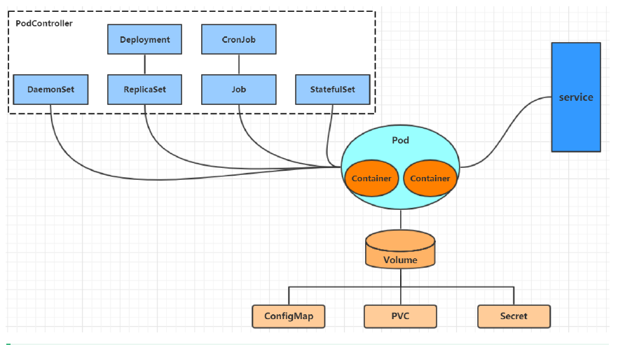

## 资源管理

### 介绍

k8s 实际上就是一个集群系统，可以在这个集群中运行一个个的容器，并将程序跑在容器中，这就叫启动服务了。

k8s 的最小管理单元为 pod，容器将会放到 pod 中，而 k8s 通过 pod 控制器来管理 pod，进而管理容器。

pod 对外提供服务，然而出于单一职责的考虑，pod 不能即管理容器又管理服务访问，所以服务访问交给 service 资源来实现功能。

同理，数据持久化的功能交给了存储系统。

学习 k8s，本质上就是学习对 pod、pod 控制器、service、存储等资源的操作。



### 集群资源分类

| 资源分类   | 资源名称                 | 缩写   | 作用              |
| ---------- | ------------------------ | ------ | ----------------- |
| 集群级别   | nodes                    | no     | 集群组成部分      |
|            | namespace                | ns     | 隔离 pod          |
| pod 资源   | pods                     | po     | 装载容器          |
| pod 控制器 | replicationcontrollers   | rc     | 控制 pod 资源     |
|            | replicasets              | rs     | 控制 pod 资源     |
|            | deployments              | deploy | 控制 pod 资源     |
|            | daemonsets               | ds     | 控制 pod 资源     |
|            | jobs                     |        | 控制 pod 资源     |
|            | cronjobs                 | cj     | 控制pod 资源      |
|            | horizontalpodautoscalers | hpa    | 控制pod 资源      |
|            | statefulsets             | sts    | 控制pod 资源      |
| 服务发现   | services                 | svc    | 统一 pod 对外接口 |
|            | ingress                  | ing    | 统一 pod 对外接口 |
| 存储资源   | volumeattachments        |        | 存储              |
|            | persistentvolumes        | pv     | 存储              |
|            | persistentvolumeclaims   | pvc    | 存储              |
| 配置资源   | configmaps               | cm     | 配置              |
|            | secrets                  |        | 配置              |

### 资源操作方式

资源可以进行多种操作，可以通过 `--help` 查看详细的操作命令。

| 分类     | 命令         | 作用                       |
| -------- | ------------ | -------------------------- |
| 基础     | create       | 创建资源                   |
|          | edit         | 编辑资源                   |
|          | get          | 获取资源                   |
|          | patch        | 更新资源                   |
|          | delete       | 删除资源                   |
|          | explain      | 展示资源文档               |
| 调试运行 | run          | 集群中运行指定镜像         |
|          | expose       | 暴露资源为 service         |
|          | describe     | 显示资源内部信息           |
|          | logs         | 输出容器在 pod 的日志      |
|          | attach       | 进入运行中的容器           |
|          | exec         | 执行容器中的一个命令       |
|          | cp           | pod 内外复制文件           |
|          | rollout      | 管理资源发布               |
|          | scale        | 扩缩 pod 数量              |
|          | autoscale    | 自动调整 pod 数量          |
| 高级     | apply        | 通过文件对资源进行配置     |
|          | label        | 更新资源标签               |
| 其他     | cluster-info | 显示集群信息               |
|          | version      | 展示 server 和 client 版本 |

### 资源管理方式

k8s 中提供了三种方式：命令式对象管理、命令式对象配置、声明式对象配置。

命令式对象管理，直接使用命令来操作 k8s 资源，这种方式简单，但是只能操作活动对象，对于测试比较方便，但是不适于开发。

命令式对象配置，可使用操作文件的方式来操作 k8s 资源，对于小型服务比较简单，可以用于开发，但是当项目变大、配置文件变多时，操作起来就比较麻烦。

声明式对象配置，可使用操作目录的方式来操作 k8s 资源，对于大型项目友好，但是出现意外情况可能难以调试。

#### 命令式对象管理

kubectl [command] [type] [name] [flags]

- command：指定操作
- type：指定资源类型，例如 pod、deployment 等
- name：指定资源名称，大小写敏感
- flags：指定额外参数

```shell
➜  software kubectl create namespace dev
namespace/dev created

➜  software kubectl get ns
NAME                   STATUS   AGE
default                Active   44h
dev                    Active   6s
kube-node-lease        Active   44h
kube-public            Active   44h
kube-system            Active   44h
kubernetes-dashboard   Active   44h

➜  software kubectl run pod --image=nginx -n dev  
pod/pod created

➜  software kubectl get pod -n dev -o wide
NAME   READY   STATUS              RESTARTS   AGE   IP       NODE       NOMINATED NODE   READINESS GATES
pod    0/1     ContainerCreating   0          17s   <none>   minikube   <none>           <none>

➜  software kubectl delete pod pod -n dev
pod "pod" deleted

➜  software kubectl delete ns dev             
namespace "dev" deleted
```

#### 命令式对象配置

进行配置，IDEA 中有 kubernetes 插件可以方便地使用

```yml
apiVersion: v1
kind: Namespace
metadata:
  name: dev

---

apiVersion: v1
kind: Pod
metadata:
  name: nginxpod
  namespace: dev
spec:
  containers:
    - name: nginx-containers
      image: nginx:1.17.1
```

根据文件进行配置：

```shell
➜  k8s kubectl create -f nginxpod.yml
namespace/dev created
pod/nginxpod created
➜  k8s kubectl get -f nginxpod.yml 
NAME            STATUS   AGE
namespace/dev   Active   10s

NAME           READY   STATUS              RESTARTS   AGE
pod/nginxpod   0/1     ContainerCreating   0          10s
➜  k8s kubectl delete -f nginxpod.yml 
namespace "dev" deleted
pod "nginxpod" deleted
```

#### 声明式对象配置

声明式对象配置只有一个 apply 命令，他的意思是：资源存在则更新（kubectl patch），不存在则创建（kubectl create）。

删除时则只能用 `kubectl delete -f` 了。

推荐创建/更新使用 `kubectl apply -f`，删除用 `kubectl delete -f`。

## 资源介绍

### 资源简介

#### Namespace

namespace，命名空间，其实也就是用来实现资源隔离的效果。

在默认情况下，k8s 的各个 pod 均可以相互访问，假如想要实现资源隔离，就可以将不同的 pod 放到不同的 namespace 下。

也可以通过 k8s 的授权机制，将 namespace 交给不同租户管理，这样就实现了多租户的资源隔离。

还可以结合资源配置机制，让不同的租户拥有不同的资源，例如 CPU、内存等，实现租户资源管理。

k8s 会默认启动几个 namespace：

- default：未指定 namespace 的会默认放到这里。
- kube-node-lease：集群心跳维护。
- kube-public：公共空间，可以被所有人访问（包括未认证用户）。
- kube-system：k8s 集群维护。

具体操作：

- 查看：`kubectl get ns`

    可指定 namespace：`kubectl get ns default` 是查看 default 这个 namespace

    可指定输出格式：`kubectl get ns -o yaml` 是以 yaml 形式展示，常用的还有 wide、json

    查看详情：`kubectl describe ns default`

- 创建：`kubectl create ns dev`
- 删除：`kubectl delete ns dev`
- 使用文件配置：

    ```yml
    apiVersion: v1
    kind: Namespace
    metadata:
    name: dev
    ```

    之后就可使用 `kubectl apply -f`、`kubectl delete -f` 操纵了。

#### Pod

程序运行在容器中，而容器必须存在于 Pod 中，一个 pod 可放多个容器。pod 是 k8s 中管理的最小单元，集群的各个组件也是以 pod 为单位运行的。

k8s 不会单独运行 pod，而是通过 pod 控制器间接控制 pod。

- 创建并运行：`kubectl run nginx --image=nginx:1.17.1 --port=80 --namespace dev`

    `--image`：指定镜像。`--port`：指定端口。`--namespace`：指定命名空间。

- 查看 pod：`kubectl get pods -n dev`

    使用 `get pods` 或者 `get pod` 均可，k8s 都支持。

- 查看 pod 详情：`kubectl describe pod nginx -n dev`
- 删除指定 pod：`kubectl delete pod nginx -n dev`

    假如是使用 pod 控制器来进行的创建，那么上面这条命令删除之后，pod 控制器会重新开启一个 pod。

    如果想要在 pod 控制器创建之后删除 pod，需要直接删除 pod 控制器。

#### Label

Label 是个标签，可以在资源上进行标识，便于更好地进行管理。Label 的具体表现是 kv 键值对，可以加到任何对象上去（一个对象也可以有任意数量的 Label）。

常用事例：

- 版本标签：`version: release`、`version: stable`
- 环境标签：`env: dev`、`env: pro`
- 架构标签：`tier: frontend`、`tier: backend`

除了标签之外，还有标签选择器（Label Selector），Label 用于给某个资源对象定义标识，Label Selector 用于查询和筛选拥有某些标签的资源对象。

- 命令式：

    ```shell
    # 给予标签 version=1
    kubectl label pod nginx version=1
    # 更新标签 version=2
    kubectl label pod nginx version=2 --overwrite
    # 带标签查看 pod 
    kubectl get pod nginx --show-labels
    # 使用标签选择器
    kubectl get pod -l version=2
    kubectl get pod -l version!=1
    # 删除标签
    kubectl label pod nginx version-
    ```

- 配置式：

    ```yml
    apiVersion: v1
    kind: Pod
    metadata:
      namespace: dev
      name: nginx
      labels:
        version: "1"
    spec:
      containers:
        - name: pod
          image: nginx:1.17.1
          ports:
            - containerPort: 80
              name: nginx-port
              protocol: TCP
    ```

#### Deployment

属于 pod 控制器的一种，pod 控制器可以控制 pod，k8s 一般使用 pod 控制器来控制 pod。

- 命令方式：

    ```shell
    # 创建太过繁琐，只说查看、删除
    # 查看创建的 deployment
    kubectl get deploy
    # 查看详细信息
    kubectl describe deploy nginx
    # 删除
    kubectl delete deploy nginx
    ```

- 配置方式：

    ```yml
    apiVersion: apps/v1
    kind: Deployment
    metadata:
      name: nginx
      namespace: default
    spec:
      replicas: 3
      selector:
        matchLabels:
          run: nginx
      template:
        metadata:
          labels:
            run: nginx
        spec:
          containers:
            - name: nginx
              image: nginx:1.17.1
              ports:
                - containerPort: 80
                  protocol: TCP
    ```

#### Service

每个 pod 都会分配一个 pod IP，然而:

1. pod IP 会根据 pod 重建产生变化。
1. pod IP 仅仅是集群内的，外部无法访问。

k8s 设计了 service 来解决以上的两个问题。service 可以看成是一组同类 pod 对外访问的接口，可以实现服务发现和负载均衡。

1. 命令式：

    ```shell
    # 创建集群内部可访问的 service
    kubectl expose deploy nginx --name=service-nginx --type=ClusterIP --port=80 --target-port=80
    # 创建集群外部可访问的 service
    kubectl expose deploy nginx --name=service-nginx2 --type=NodePort --port=80 --target-port=80
    ```

    注意，假如使用的是 minikube，有两个方式可以访问：

    1. 进入 k8s 对应的 docker 容器，然后访问。
    1. 使用 `minkube service service-nginx2`，查看对应的 IP 和地址，然后访问。

1. 配置式：

    ```
    apiVersion: v1
    kind: Service
    metadata:
      namespace: default
      name: service-nginx
    spec:
      clusterIP: 10.109.179.231
      ports:
        - port: 80
          protocol: TCP
          targetPort: 80
      selector:
        run: nginx
      type: ClusterIP
    ```

**不同类型的 port**

- nodePort: 外部访问 k8s 集群中 Service 的端口。
- port: k8s 集群内部访问 service 的端口。
- targetPort: pod 对外的端口，nodePort 和 port 的请求将会通过 kube-proxy 访问 targetPort，最终进入容器。
- containerPort: pod 对内的端口，targetPort 会映射到 containerPort。

