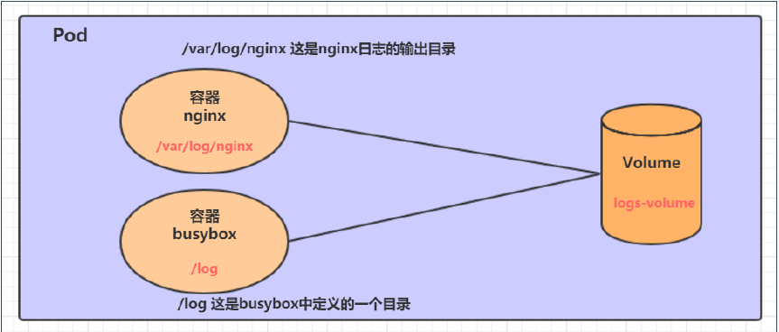
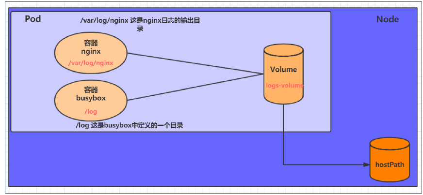

## 数据存储

容器会频繁创建销毁，容器在销毁同时，数据也会被清除。那么为了保存数据，k8s 提出了 volume，也就是共享目录。

volume 在 pod 上定义，被一个 pod 中的多个容器挂载到具体文件目录下，k8s 通过 volume 实现同 pod 的不同容器数据共享以及持久化存储。

volume 的生命周期和 pod 中的容器相关，容器终止、重启时，volume 数据不会丢失。

volume 有多种类型：

- 简单存储：EmptyDir、HostPath、NFS
- 高级存储：PV、PVC
- 配置存储：ConfigMap、Secret

### 简单存储

**EmptyDir**

最简单的 Volume 类型，就是主机上的一个空目录。pod 在分配到 node 的同时就会创建一次，k8s 会自动分配宿主机上的目录。pod 销毁时，EmptyDir 中的数据也会被销毁。

一般作用于临时目录、多容器共享目录。



```yml
apiVersion: v1
kind: Pod
metadata:
  name: volume-emptydir
  namespace: dev
spec:
  containers:
    - name: nginx
      image: nginx:1.14-alpine
      ports:
        - containerPort: 80
      volumeMounts:
        # 挂载目录为 /var/log/nginx
        - mountPath: /var/log/nginx
          name: logs-volume
    - name: busybox
      image: busybox:1.30
      command: ['/bin/bash', '-c', 'tail -f /logs/access.log']
      # 挂载目录为 /logs
      volumeMounts:
        - mountPath: /logs
          name: logs-volume
  volumes:
    - name: logs-volume
      emptyDir: {}
```

pod 中有两个容器，容器之间通过 volume 进行文件共享。其中 nginx 容器将自身的 `/var/log/nginx` 目录挂载到了 volume 下，busybox 容器将 `/log` 目录挂载到了 volume 下。

nginx 写 log 文件，通过 volume，busybox 可以读取 nginx 中的 log 文件并且将其输出。

**HostPath**

EmptyDir 中的数据不会被持久化，pod 结束就会销毁。如果想要持久化，最简单的方式是 HostPath。

hostPath 是将 pod 中的 volume 实际挂载到 node 上，这样就可以保证数据持久化。



```yml
apiVersion: v1
kind: Pod
metadata:
  name: volume-emptydir
  namespace: dev
spec:
  containers:
    - name: nginx
      image: nginx:1.14-alpine
      ports:
        - containerPort: 80
      volumeMounts:
        # 挂载目录为 /var/log/nginx
        - mountPath: /var/log/nginx
          name: logs-volume
    - name: busybox
      image: busybox:1.30
      command: ['/bin/bash', '-c', 'tail -f /logs/access.log']
      # 挂载目录为 /logs
      volumeMounts:
        - mountPath: /logs
          name: logs-volume
  volumes:
    - name: logs-volume
      # 唯一的区别是从 EmptyDir 改为了 HostPath
      hostPath:
        path: /tmp/logs
        # 此目录存在则使用，不存在则创建后使用
        type: DirectoryOrCreate
```

type 类型：

- DirectoryOrCreate：此目录存在则使用，不存在则创建后使用
- Directory：目录必须存在
- FileOrCreate：文件存在则使用，不存在则创建后使用
- File：文件必须存在

**NFS**

如果说 HostPath 是 EmptyDir 的升级版，那么 NFS 是 HostPath 的升级版。它解决了 Node 节点故障导致的 Path 问题。

使用 NFS 方式，需要 NFS 服务器，Pod 中的存储会直接上传到 NFS 中，这样即使 Pod 故障，NFS 没问题，数据就可以访问。

```yml
apiVersion: v1
kind: Pod
metadata:
  name: volume-emptydir
  namespace: dev
spec:
  containers:
    - name: nginx
      image: nginx:1.14-alpine
      ports:
        - containerPort: 80
      volumeMounts:
        # 挂载目录为 /var/log/nginx
        - mountPath: /var/log/nginx
          name: logs-volume
    - name: busybox
      image: busybox:1.30
      command: ['/bin/bash', '-c', 'tail -f /logs/access.log']
      # 挂载目录为 /logs
      volumeMounts:
        - mountPath: /logs
          name: logs-volume
  volumes:
    - name: logs-volume
      # 使用 nfs
      nfs:
        path: /tmp/data/nfs
        server: 192.168.1.1
```

### 高阶存储

:::tip
TODO
:::

## 安全认证

:::tip
TODO
:::
