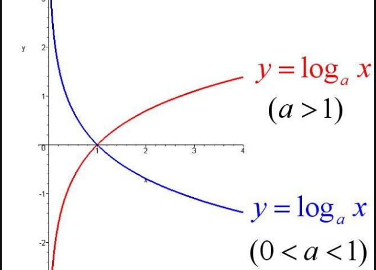

## 数据结构概述

好的代码 = 数据结构 + 算法。

数据结构，也就是数据的组织方式，或者说数据的存放方式；算法，操作数据的一种方法。对于同一个问题，使用不同的算法在执行到结果这个过程中，消耗的资源和时间在数据量庞大的情况下有可能是天差地别。

衡量算法的优劣性，我们可以采用事前进行判断的方式，假设电脑在执行每一行的代码所需事件都相同，并且假设电脑的硬件以及其他条件在执行代码时相同，那么我们就可以从代码执行的两个维度（时间、空间）去考虑。

- 时间：指的是执行当前算法所消耗的时间，通常使用时间复杂度来描述。
- 空间：指的是执行当前算法所占据的内存大小，通常使用空间复杂度来描述。

但是大多数情况下，时间复杂度和空间复杂度二者不可兼得，我们总是要从两者中寻找一个平衡点。

## 时间复杂度

假设我们执行一行代码的时间为 1 个时间单位，比如下面一行代码：

```java
System.out.println("HELLO");
```

那么接下来这段代码的时间单位就是 10：

```java
for (int i = 0; i < 10; i++) {
    System.out.println(i);
}
```

代码执行了十次，所以时间单位为 10，看起来比较好理解，那么接下来的时间单位就是 n：

```java
for (int i = 0; i < n; i++) {
    System.out.println(i);
}
```

输出了 n 次，所以时间单位是 n，非常好理解，我们将上面的 n 次时间单位使用大 O 表示法来表示：T(n) = O(f(n))

简单来理解一下：

- f(n) 代表的是每行代码执行次数的和，执行一次为 f(1)，执行十次为 f(10)，执行 n 次为 f(n)。
- O 这个字符代表的是正比例的关系，也就是执行次数和最终的时间的系数。

    比如 y = x 中，系数为 1，y = 2x 中，系数为 2，那么在上面的代码中，O 的系数就是 1。

- T(n) 就是最终的执行时间。

我们假设一种极端情况，当执行次数 n 为无限大时，无论 O 这个系数的值为多少，那么其实它是多少都是没有意义的。

所以 `T(n) = 1 + 2n` 和 `T(n) = n` 在极端情况下是毫无意义的，我们将他们的时间复杂度都看作 `O(n)`。

同理，`T(n) = 4n^2 + 2n + 8` 和 `T(n) = n^2` 都看作 `O(n^2)`，也就是说，我们关心的时间复杂度只关注高数量级，和系数毫无关系。

**常见的几种时间复杂度**

1. 常数阶，`O(1)`，无论代码执行了多少行，只要没有循环等复杂结构，我们统统看成 `O(1)`：

    ```java
    int n = 10;
    int m = 1;
    int k = n + m;
    ```

1. 线性阶，`O(n)`，循环中的代码会执行 n 次：

    ```java
    for (int i = 0; i < n; i++) {
        System.out.println(i);
    }
    ```

1. 对数阶，`O(logN)`：

    ```java
    int i = 1;
    while (i < n) {
        i = i * 2;
    }
    ```

    首先让我们来复习一下数学内容：在数学中，`a^n = b (a > 0 且 a != 1)`，那么 n 叫做以 a 为底，b 的对数，可以写为：`loga^b = n`;

    在坐标系上，对数函数是这样画的：

    

    在上面的例子中，我们假设 i 经过 x 次循环到达了（或大于） n，也就是说 2 的 x 方 = n，即 `2^x = n ==> log2^n = x`，所以 `O(log2^n)`，常数项在时间复杂度是忽略的，所以是 `O(logN)`。

1. 线性对数阶，`O(nlogN)`，简单理解就是将 `O(logN)` 的代码循环了 n 次：

    ```java
    for(m=1; m<n; m++)
    {
        i = 1;
        while(i<n)
        {
            i = i * 2;
        }
    }
    ```

1. 平方阶，就是将 `O(n)` 代码再次嵌套一遍

    ```java
    for(x=1; x<=m; x++)
    {
        for(i=1; i<=n; i++)
        {
            j = i;
            j++;
        }
    }
    ```

1. k 次方阶，就是将 `O(n)` 代码嵌套 k 次。

## 线性结构和非线性结构

**线性结构**

最常见的数据结构，其特点是数据元素之间存在一一对应的关系，例如数组、队列、栈、链表等。

线性结构又分为两种存储结构：

- 顺序结构：内存中，地址值是连续的，例如数组。
- 链式存储：内存中，地址值不一定是连续的，例如链表。

**非线性结构**

数据元素之间不一定一一对应，比如多维数组、树、图。
