## 远程登陆（Xshell XFTP）

1. Linux服务器是开发小组共享。
1. 正式上线的项目是运行在公网上的。
1. 远程登录的客户端有 XShell6、XFTP、....，我们选择 XShell6 和 XFTP，其他的都大同小异。

## Vi和Vim编辑器

### 基本概述

在Linux中，会内置VI编辑器。

VIM具有程序编辑的功能，可以看作是Vi的增强版本，可以主动的以字体颜色辨别语法的正确性，方便程序设计。

代码补完，编译及错误跳转等方便编程的功能特别丰富，在程序员中被广泛应用。

### Vi和VIM的三种模式

**正常模式**

以 vim 打开一个文档就是进入了正常模式，这也是默认模式。

在这个模式中，可以使用【上下左右】按键来移动光标。可以使用【删除字符】和【删除整行】来处理档案内容。可以使用【复制，粘贴】来处理文件数据。

**插入模式**

按下 `i、I、o、O、a、A、r、R` 等任何一个字母才会进入到编辑模式。

**命令行模式**

在这个模式中，可以提供相关指令，完成读取，存盘，替换，离开vim，显示行号等操作。

**各种模式的切换**


**基本快捷键的使用练习**

1. 拷贝当前行： `yy`，拷贝当前行向下的5行 `5yy`，粘贴 `p`。
1. 删除当前行： `dd`，删除当前行向下的5行 `5dd`。
1. 在文件中查找某个单词（区分大小写）：命令行下 `/关键字 --> 回车查找 --> 输入n查找下一个 --> shift+n` 查找上一个。
1. 设置文件的行号：命令行下-->显示 `set nu` -->:取消显示 `:set nonu`。
1. 快捷键 `G` 到最末行，`gg` 到最首行。
1. 撤销上一步的动作：`u`。
1. 将光标移动到 20 行：先输入 20 --> `shift + g`。

## 开机、重启、登陆、用户

### 开关机和重启

- `sync`：将内存的数据同步到磁盘。
- `shutdown -h now`：立刻关机。
- `halt`：关机，作用和上面一样。
- `shutdown -h 1`：一分钟后关机。
- `shutdown -r now`：立刻重启。
- `shutdown -r 1`：一分钟后重启。
- `reboot`：立刻重启。

1. 不管是重启还是关机，首先要运行 `sync`，将内存中的数据写入到磁盘中。
1. 目前的 `shutdown` 和 `reboot` 和 `halt` 等命令虽然在关机前进行了 `sync`，但是还是要首先运行一遍，因为小心驶得万年船。
1. 假如只输入一个 `shutdown`，默认是`shutdown -h 1`。

---

### 用户管理

Linux 是一种多用户的系统，我们这个系统中可以有多个普通用户，每一个用户都对应自己的目录。

- 用户登录和注销：

    在工作中，我们一般不会使用 root 权限来登陆，因为它是最大的权限，我们要避免操作失误。我们可以先使用普通账号登陆，假如真的需要权限，那么再登录之后可以使用 `su - 用户名` 来切换为系统管理员权限，或者直接使用 `sudo 命令` 来执行命令（推荐这一种）。

    > 直接使用 `sudo 命令` 来执行命令

    在这种情况下，只有在 `/etc/sudoers` 配置文件中的用户才可以使用该指令。

    在提示符下输入`logout`（或者 `exit`）即可注销用户。

    细节：logout注销指令在图形运行级别无效，在运行级别3下有效，运行级别在以后讲。

    ---

    注意，假如我使用tom这个用户首先登陆系统，那么它使用 `su root` 的命令会得到管理员的权限。

    假如这个时候使用 `logout`，它首先会退回到 tom 的权限，假如再次使用 `logout`，那么会退出系统。

    权限高的用户切换到权限低的用户不需要输入密码，反之需要。

- 添加用户：

- `useradd 用户名`：

    它会自动添加一个用户，默认的用户目录在 `/home/用户名`，切换到这个用户后，会自动到这个用户的文件夹。

    可以使用命令 `pwd` 来查看当前所在目录。

    我们也可以通过 `useradd -d 指定目录 用户名` 来新建一个用户，并且指定这个用户的 home 目录。

- 给用户设置密码：

    `passwd 用户名` --> 回车 --> 密码。

    注意，假如不写用户名，那就是给当前用户设置密码。

- 删除用户：

    删除用户有两种情况：

    - 删除此用户，但是保留用户的目录：`userdel 用户名`。
    - 删除此用户和此用户的目录：`userdel -r 用户名`。

- 查询用户信息：

    - `id 用户名`。
    - `who am i`：查看第一次登陆到 Linux 的信息。

### 用户组

可以将某些用户分组，然后对他们进行统一管理，比如增删权限等。

- 组的管理：

    - 新增组：`groupadd 组名`。
    - 删除组：`groupdel 组名`。

- 用户的管理组：

    - 增加用户时直接加上组：`useradd -g 用户组 用户名`。

        假如我们新建一个用户的时候没有指定组，那么 Linux 会根据这个用户新建一个组，组名是这个用户的名字，然后把用户放到这个组中。

    - 修改用户的组：`usermod -g 用户组 用户名`。

- 用户和组相关的文件：

    - `/etc/passwd`：用户 user 的配置文件，记录用户的各种表示信息。

      每当我们添加一个用户的时候，用户的信息就会保存到这里。

      每行的含义：`用户名:口令(加密的，用x显示):用户标识号(user的id):组标识号(group的id):注释性描述:主目录:登陆Shell`。

      这个登陆 Shell 其实就是一个翻译官，在控制台输入什么命令的时候（比如使用 `cd`），Linux 内核是听不懂我们在干什么，我们需要将这个发给 Shell，然后由 Shell 翻译为 Linux 内核能够听懂的东西。

      一般来讲，我们的 Shell 用的是 bash（最多使用）/zsh，别的国家有的用 tcsh，csh。

    - `/etc/shadow`：口令的配置文件。

      在上面的 `/etc/passwd` 我们说这个登录的口令是加密的，在那里用x表示，但是其实它最终是寻找的 `/etc/shadow`，这里才是真正加密口令的存放位置。

      每行的含义：`登录名:加密口令:最后一次的修改时间:最小时间间隔:最大时间间隔:警告时间:不活动时间:失效时间:标志` 这个加密口令在这里自然就是很长一串的加密密码，如果不设置他会使用 `!!` 来代替原来加密的密码。

      后面的修改时间，时间间隔啥的是用特殊数字来进行处理的。

    - `/etc/group`：组的配置文件，记录Linux包含的组的信息。

      每行的含义：`组名:口令:组标识号:组内用户列表`。

## 实用指令

### 指定运行级别

**基本概述**

运行级别说明：

- 0：关机。
- 1：单用户（找回丢失密码）。
- 2：多用户状态没有网络服务。
- 3：多用户状态有网络服务（用的最多）。
- 4：系统未使用保留给用户。
- 5：图形界面（用的也比较多）。
- 6：系统重启。

常用运行级别是 3 和 5，也可以指定默认的运行级别。

应用实例：`init[0 1 2 3 4 5]`：用 init 来切换不同的运行级别，比如`init 3`。

指定默认运行级别

- 指定为3运行级别：`systemctl set-default multi-user.target`。
- 指定为5运行级别：`systemctl set-default graphical.target`。

为什么要这样指定呢，因为在 CentOS7 之前，我们要修改运行级别必须要去 `/etc/inittab` 文件中修改。而这个文件中 3 级别就是 `multi-user.target`，5 级别就是 `graphical.target`。改变了运行级别之后，我们再次启动这个 Linux，它会默认进入新指定的运行级别。

查看当前的运行级别：`systemctl get-default`，查看的结果不是显示 3 或者 5，而是显示 `graphical.target` 或者 `multi-user.target`。

---

### 找回Root密码

在不同的版本，找回 root 密码的方式有些区别，在 CentOS7 及以后中：

1. 启动系统，进入开机界面，在界面中按 `e` 进入编辑界面。

    

1. 找到以 `Linux16` 开头所在的行数。

    

1. 在行的最后写上 `init=/bin/sh`。

    

1. 输入快捷键 `ctrl+x`，进入单用户模式

1. 在光标闪烁处的位置输入 `mount -o remount,rw /`，然后按回车

    

1. 在新的一行输入 `passwd`，然后按键盘的回车，然后输入密码，然后确认密码。
1. 输入 `touch /.autorelabel`，然后回车。
1. 输入 `exec /sbin/init`，然后回车，等待系统自动修改密码（时间可能会有点长，但不是死机，耐心等待），然后系统会重启，密码生效。

---

### 帮助指令

- `man` 获得帮助信息：

    基本语法：man[命令/配置文件]：获得帮助信息

    比如：`man ls`。

    

- `help` 指令：

    基本语法：`help 命令`：获得 shell 内置命令的帮助信息，比如：`help cd`。

- 百度：

    英语不好，看不懂提示的可以百度。

---

### 文件目录

- `pwd`：显示当前目录的绝对路径。
- `ls`：显示当前目录的文件和目录。

    常用选项：

    - `-a`：显示当前目录所有的文件和目录，包括隐藏的。
    - `-l`：以列表方式显示信息。
    - `-h`：以人能够比较直观的方式显示大小。

    案例：`ls -l -a`。
- `cd`：切换到指定目录。

    常用选项：

    - `~`或者`:`：回到自己家目录。
    - `..`：回到上一层目录。

    案例：`cd ~`、`cd :`、`cd ..`
- `mkdir`：创建目录。

    常用选项：

    - `-p`：创建多级目录。

    案例：`mkdir -p /home/animal/dog`。
- `rmdir`：删除空目录，如果目录下有内容则不可删除。

    常用选项：

    - `rm -rf`：递归强制删除则需要使用命令`rm -rf`。

        `recursive`：递归，`force`：强制。

    案例：`rmdir /home/animal/dog`，`rm -rf /home/animal`。

    注意，不要使用`rm -rf /`，这虽然是个梗，但是问题很严重，这种动作要非常谨慎。
- `touch`：创建一个文件。

    案例：`touch hello.txt`。

---

- `cp`：拷贝文件到指定目录。

    常用选项：

    - `-r`：递归复制整个文件夹。

    案例：`cp /home/test/hello.txt /home/animal/`，`cp -r /home/test/ /home/animal/`。

    强制覆盖不提示的方式：`\cp`，比如`\cp /home/test/ /home/animal`。

- `rm`：删除文件或者删除目录。

    常用选项：

    - `-r`：递归删除。
    - `-f`：强制删除。

    recursive：递归，force：强制。

    案例：`rm -r /home/animal/`

    强制删除不提示，带上 `-f` 即可，但是注意这个操作非常危险，你要知道自己在做什么。
- `mv`：移动文件和目录（或者重命名）。

    基本语法：

    - `mv oldNameFile.txt newNameFile.txt`：重命名。
    - `mv /home/animal/hello.txt /home/test/`：移动，移动可以移动文件夹或者文件。
    - `mv /home/animal/hello.txt /home/test/hello2.txt`：移动并且重命名。

- `cat`：查看文件但是不能修改。

    常用选项：

    - `-n`：显示行号。

    案例：`cat -n hello.txt`。

    cat 只能浏览文件，而不能修改，为了方便，我们一般要带上管道命令 `| more`。也就是 `cat -n hello.txt | more`。`more`可以分批查看文件，一次不会全部进行显示。

    管道命令就是将前面的结果再次交个下一个命令进行处理，管道命令就是 `|`，下一个命令比如说 `more`。

- `more`：more 是一个基于 vi 编辑器的文本过滤器，它以全屏的方式按页进行显示文本文件的内容，more 指令中内置了若干快捷键。

    常用选项：

    - 空格：向下翻一页。
    - 回车：向下翻一行。
    - `q`：立刻离开 more，不再显示其他内容。
    - `Ctrl+F`：向下滚动一屏。
    - `Ctrl+B`：向上滚动一屏。
    - `=`：输出当前行的行号。
    - `:f`：输出文件名和当前行的行号。

    案例：`more 文件`。

- `less`：分屏查看文件内容，功能类似 more，但是比 more 更加强大，支持各种显示终端。

    less 在查看文件内容时，并不是一次加载到内存中，而是随用随加载，所以对大文件有较高的效率。

    常用选项：

    - 空格：向下翻一页。
    - [pagedown]：向下翻一页。
    - [pageup]：向上翻一页。
    - `/字符串`：向下搜索字符串，使用 `n` 向下查找，使用 `N` 向上查找。
    - `?字符串`：向上搜索字符串，使用 `n` 向上查找，使用 `N` 向下查找。
    - `q`：退出 less。

    案例：`less 文件`。

---

- `echo`：输出内容到控制台。

    案例：`echo "hello,world"`，`echo $PATH`：输出环境变量。

- 重定向：

    重定向的意思是指使用文件来代替标准输入、标准输出、标准错误输出。

    比如说，平常使用 `echo` 将会打印到终端上，但是使用了重定向之后，完全可以打印到某个文件中。

    |              | 代码 | 运算符    |
    | ------------ | ---- | --------- |
    | 标准输入     | 0    | < 或 <<   |
    | 标准输出     | 1    | > 或 >>   |
    | 标准错误输出 | 2    | 2> 或 2>> |

    在这其中，有一个箭头的表示使用覆盖的方式进行重定向，两个箭头的方向表示使用追加的方式来重定向。

    例如 `echo "HELLO WORLD" >> /dev/null`，这代表着我们将标准输出输出到了 `/dev/null` 中，这个路径相当于是一个垃圾桶，输出的内容就丢弃了，但是我们也完全可以输出到某个文件中。

    假如我们需要将标准输出和错误输出重定向到一个文件，那就必须将某个输出转换为另一种输出，例如将错误输出转换为标准输出，然后随着其他的标准输出一起重定向到另一个文件中。

    `2>&1` 代表着将标准错误输出转换为标准输出，如果需要同时输出到一个文件中，比如 `ll > log 2>&1`，表示错误输出转换为标准输出，同时输出到 log 文件中。

- `head`：显示文件开头部分的内容，默认情况下显示文件的前十行内容。

    常用选项：

    - `-n 行`：查看文件头指定行内容，n 可以为任意数字。

    案例：`head 文件`，`head -n 5 文件`。

- `tail`：输出文件末尾的内容，默认显示文件的后十行内容。

    常用选项：

    - `-n 行`：查看文件头指定行内容，n 可以为任意数字。
    - `-f`：实时追踪文档的所有更新。

    案例：`tail` 文件，`tail -n 5` 文件，`tail -f` 文件。

    注意，这个 `tail -f` 看日志必备，使用了这个命令之后，它就会在控制台中实时输出这个文件的输出。

    退出使用 `Ctrl+C`。

---

- `ln`：软链接，也叫做符号链接，类似 windows 里面的快捷方式，主要存放了链接其他文件的路径。

    基本语法：`ln -s [原文件/目录] [软链接名]`

    案例：

    - `ln -snf /root/ /home/myroot`。
    - `rm /home/myroot`：注意，`rm /home/myroot/`，也就是最后带上 `/` 的时候，Linux 会认为是一个目录，会将数据全部删除，而不是删除软连接保留数据。

- `history`：查看已经执行过的历史命令，也可以执行历史命令。

    基本语法：`history`。

    常用选项：

    - `n`：用于查看最近的 n 条命令。
    - `!n`：重新执行历史编号为 n 的命令。

    案例：`history 10`，`!5`。

---

### 时间日期类

- 显示时间
    - `date`：显示当前时间。
    - `date +%Y`：显示当前年份。
    - `date +%m`：显示当前月份。
    - `date +%d`：显示当前是哪一天。
    - `date +"%Y-%m-%d %H:%M:%S"`：年-月-日 时：分：秒。

    案例：`date +"%Y-%m-%d %H:%M:%S"`，显示时间的 `年-月-日 时：分：秒`。

    为什么说到了年月日时分秒的时候要用一个字符串包起来呢，这是因为加号管不到空格之后的东西。

- 设置时间：

    基本语法：`date -s 字符串时间`。

    案例：`date -s 2020-11-03 20:02:10`。

- `cal`：查看日历，不加选项则显示本月日历。

    常用选项：

    - 日期：直接显示对应的日期的时间。

    案例：`cal`，`cal 2020`。

### 搜索查找类

- `find`：从指定的目录向下递归，查找满足条件的文件或者目录，并显示在终端。

    常用选项：

    - `-name`：查找文件名字，也可以使用通配符。
    - `-user`：查找属于指定用户的文件。
    - `-size`：查找指定大小的文件，其中使用`+`代表大于，`-`代表小于，不写为等于，单位有 K，M，G。

    案例：`find /home -name hello.txt`，`find /home -user tom`，`find /home -size +200M`。

- `localte`：快速定位文件的位置。

    在使用 locate 命令之前必须先使用 updatedb 来创建数据库，然后才能使用 locate 命令。

    因为它的快速定位是基于数据库来进行查询的，所以才如此快。

    案例：`updatedb`，`locate hello.txt`。

- `which`：可以查看某个指令在哪个目录下。

    案例：`which ls`。

- `grep、|`：过滤查找 `grep` 和管道符 `|` 天生一对，表示将前一个命令的处理结果输出传递给管道符后面的命令处理。

    基本语法：`grep 查找内容 源文件`。

    常用选项：

    - `-n`：显示匹配行和行号
    - `-i`：忽略字母大小写

    案例：

    在hello.txt中查询yes的所在行并且显示行号。

    - `cat /home/hello.txt | grep -n "yes"`。
    - `grep -n "yes" /home/hello.txt`。

    以上的两个都是可以的，两种写法都正确。

### 压缩和解压

- `gzip/gunzip`：gzip 用于压缩文件，gunzip 用于解压文件。

    gzip 只能将文件压缩为 `.gz` 文件。

    案例：`gzip hello.txt`，`gunzip hello.txt.gz`。

- zip/unzip：zip 用于压缩文件，unzip 用于解压文件，这两个命令在项目打包发布的时候十分有用。

    基本语法：

    - zip：`zip xxx.zip 要压缩的目标`
    - unzip：`unzip xxx.zip`

    zip 常用选项：

    - `-r`：递归压缩，也就是用于压缩目录。

    unzip 常用选项：

    - `-d<目录>`：指定解压后文件的存放目录。

    案例：`zip -r tom.zip tom/`，`unzip tom.zip -d /home/test/`

- `tar`：tar 指令可以做打包（文件或者文件夹），或者解压。

    打包后的文件是`.tar.gz`的文件。

    基本语法：

    - `tar xxx.tar.gz 打包的内容`。

    常用选项：

    - `-c`：产生 .tar 打包文件。
    - `-v`：显示详细信息。
    - `-f`：指定压缩后的文件名。
    - `-z`：打包同时压缩。
    - `-x`：解包`.tar`文件。

    案例：

    - 压缩多个文件：`tar -zcvf AB.tar.gz A.txt B.txt`。
    - 解压文件：`tar -zxvf AB.tar.gz`。
    - 解压文件到指定的temp文件夹下面：`tar -zxvf /home/tom/AB.tar.gz -C /home/temp/`。

## 组管理和权限管理

### 组

#### Linux组的基本介绍

Linux中的用户必须属于一个组，不能独立在组之外。假如不给用户一个组，那么 Linux 会根据它的用户名创建一个和它用户名相同的组，然后将用户放进去。我们也可以使用指令更改用户所在的组。

在 Linux 中，对于文件来说，每个文件有所有者、所在组、其他组的概念：
1. 所有者。
1. 所在组。
1. 其他组。
1. 改变用户所在的组。
#### 所有者


当我们使用 `ls` 指令来查看内容的时候，我们会看到最右边是文件夹/文件的名称，最左边的用户其实是所有者的意思。也就是红框的内容中，第一个内容是所有者，第二个内容是文件。

在所有者的问题上，有如下指令：

- 修改文件的所有者：`chown 用户名 文件名`

    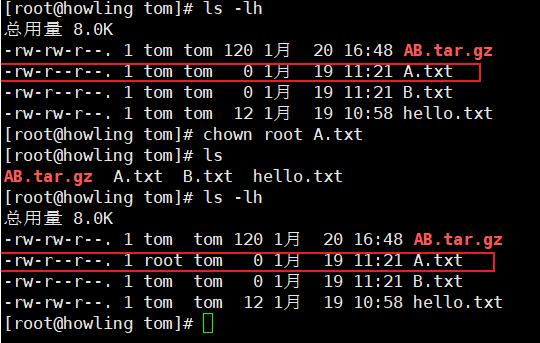
#### 组的创建和更改

- `gruopadd 组名`：组的创建。

    接下来我们要创建一个用户组 monster，然后创建一个用户并指定这个用户的用户组为 monster。

    

    我们使用一个用户创建文件，这个文件的默认所有者是该用户，我们这个文件默认的所在组是改用户所在的组。

    但是这个时候要注意了，假如我们修改了这个文件的所有者，这并不意味这个文件的所在用户组也进行了更改。

    

    我们来看，`A.txt` 的所在用户从 tom 改为了 `root`，但是第二个（用户组）没有发生改变，还是 tom。

- `chgrp 组名 文件名`：组的更改。

    

    成功地将文件 A 的默认用户组改为了 monster。
#### 改变用户所在的组

在添加用户时，可以指定将该用户添加到那个组中，同样的用 root 的管理权限可以改变某个用户所在的组。

改变用户所在组：

- `usermod -g 新组名 用户名`。
- `usermod -g 目录名 用户名 改变该用户登录的初始目录`。

说明：用户需要有进入到新目录的权限，假如权限不够就会很麻烦。比如用户 tom 竟然想要进入 root 目录，那这肯定是不可以的。

案例：`usermod -g monster tom`。

### 权限

#### 权限的基本介绍

1. 文件介绍：

    在我们使用 `ls -l` 显示文件内容的时候，会出现如下内容：

    ```text
    -rw-r--r-- 1 root root 52894708 Dec 11 10:45 System.war
    ```

    第 0-9 位确定文件，在这里就是`-rw-r--r--`

    - 第 0 位确定文件的类型，这里就是 `-`：

        - `l`：链接，相当于 windows 的快捷方式。
        - `d`：目录，相当于 windows 的文件夹。
        - `c`：字符设备文件，比如鼠标和键盘。
        - `b`：块设备，比如硬盘。
        - `-`：普通文件。

    - 第 1-3 位确定文件/文件夹所有者拥有该文件的权限，这里就是`rw-`：

        文件的所有者就是 `root`，1后面的那个第一个 `root` 代表文件的所有者。

    - 第 4-6 位确定所属用户组的用户拥有该文件的权限，这里就是 `r--`：

        第二个 `root` 代表这个文件的所属组，这里的 `r--` 就是所属组中，组员对此文件的权限。

    - 第 7-9 位确定其他用户拥有该文件的权限，这里就是 `r--`。

1. 权限的 `r、w、x`：

    - 对于文件来讲：

        - `r`：read：可以读，查看。
        - `w`：write：可以修改，但是不代表可以删除文件，只有对目录有写权限才能删除此文件。
        - `x`：execute：可以被执行。

        对目录有 w 权限，那么才可以删除文件。

    - 对于目录来讲：

        - `r`：read：可以读，ls查看目录内容。
        - `w`：write：可以修改，对目录内创建+删除+重命名。
        - `x`：execute：可以进入该目录。

        在 Linux 中，我们也可以使用数字来表示权限：
        - `r = 4`。
        - `w = 2`。
        - `x = 1`。

        按照这个来推断，`rwx` 是 7，`rw-` 是 6，......

1. 其他说明：

    ```bash
    -rw-r--r-- 1 root root 52894708 Dec 11 10:45 System.war
    ```

    - `1`：文件的硬连接数  或者  目录的子目录数+文件数。
    - `root`：用户（第一个 root）。
    - `root`：所在组（第二个 root）。
    - `52894708`：文件大小（字节）。
    - `Dec 11 10:45`：最后文件修改日期。
    - `System.war`：文件名。

#### 修改权限

我们可以使用 `chmod` 指令，来将文件或者目录的权限进行修改。

在修改权限之前，先说一下角色：

- `u`：user，代表文件/目录的所有者。
- `g`：group，代表文件/目录的所在组。
- `o`：other，代表相对于文件/目录来说的其他人。
- `a`：all，代表对于文件/目录来说的所有人。

修改权限：

1. 第一种方式修改权限：

    对于这几种角色来说，有下面几种方式来赋于权限：

    - `=`：直接重置某个角色的权限。
    - `+`：向某个角色追加新的权限。
    - `-`：删除某个角色已有的权限。

    案例：

    - `chmod u=rwx,g=rx,o=x 目录/文件`：更改 user 权限为 rwx，所在组为 rx，其他为 x。
    - `chmod o+w 目录/文件`：向其他人追加 `w` 权限。
    - `chmod a-x 目录/文件`：所有人删除 `x` 权限。

1. 第二种方式修改权限：

    我们之前在基本介绍的时候，曾经说过我们的 Linux 可以使用数字来表示权限：`r=4、w=2、x=1`。

    所以我们也可以直接使用数字来修改权限。

    案例：`chmod 761 文件/目录`，这个等同于 `chmod u=rwx,g=rw,o=x abc`。

#### 修改文件所有者、修改文件所在的组

- `chown newowner 文件/目录`：改变此文件的所有者。
- `chown newowner:newgroup 文件/目录`：改变所有者和所在组。
- `chgrp newgruop 文件/目录`：改变文件/目录所在的组。
- `-R`：假如是目录，那么则使其下所有子文件或者目录递归生效。

---

## 定时任务调度

### crond 定时任务调度概述

简单来说，Linux 中可以有一个定时任务调度的说法，也就是说我们可以指定在某一个时间就执行一次我们指定的任务

这种任务往往是一种周期性任务，比如说 MySQL 的备份，病毒的扫描，....

我们说的这个任务不仅仅是 Linux 中的命令，还有程序。


### crond

- `crontab`：我们使用 crontab 来进行定时任务的设置。

    基本语法：`corntab [选项]`。

    常用选项有这么几种：

    - `-e`：编辑 crontab 定时任务。
    - `-l`：查询 crontab 任务。
    - `-r`：删除当前用户所有的 crontab 任务。
    - `service crond restart`：重启任务调度。

    我们使用 `crontab -e` 之后就可以点击回车了，会进入一个类似 vim 编辑器的东西，在那里我们输入指定的时间和命令。

    

- 时间介绍：

    时间是这样定义的：`* * * * *`，这样你可能看不懂，但是马上就会懂了

    | 项目     | 含义               | 范围                    |
    | -------- | ------------------ | ----------------------- |
    | 第一个星 | 一个小时的第几分钟 | 0-59                    |
    | 第二个星 | 一天中的第几个小时 | 0-23                    |
    | 第三个星 | 一个月中的第几天   | 1-31                    |
    | 第四个星 | 一年中的第几月     | 1-12                    |
    | 第五个星 | 一周中的星期几     | 0-7（0和7都代表星期天） |

    看到这个有没有感觉有点熟悉，其实就是类似我们在学习 SpringBoot 中的 CRON 表达式。

- 时间的特殊说明：

    上面的特殊符号显然不能让我们满意，下面我们来搞一下特殊符号的说明。

    | 特殊符号 | 说明                                                                                        |
    | -------- | ------------------------------------------------------------------------------------------- |
    | `*`      | 代表任何时间，比如第一个`*`就代表所有分钟就执行一次                                         |
    | `,`      | 代表不连续的时间，比如`"0 8,12,16 * * *"`就代表每天的8点0分、12点0分、16点0分就执行一次命令 |
    | `-`      | 代表连续的事件范围。比如`0 5 * * 1-6`，就代表在周一到周六的凌晨5点0分执行命令               |
    | `*/n`    | 代表隔多久执行一次，比如`*/1 * * * *`代表每分钟执行一次                                     |


    我们看周和天，都是代表的天，只不过一个是代表周的天，一个是代表月的天，所以最好不要同时出现。假如我们定义一个，另一个只需要定义 `*` 就得了。

- 案例：

    - 案例一：

        每隔一分钟将当前时间追加到 `time.txt` 文件中。

        方式一：写一个 crond 表达式，表达式的内容为：`*/1 * * * * date time.txt`

        方式二：写一个脚本，脚本将时间追加到`time.txt`中，然后crond表达式调用这个脚本

        命令如下 `my.sh`：

        ```bash
        vim my.sh
        date >> time.txt
        :wq
        crontab -e
        */1 * * * * ./my.sh
        :wq
        tail -f time.txt
        ```

### at

- `at` 介绍：

    `crond` 定时任务是反复执行的，但是 `at` 定时任务是一次执行的定时任务。

    1. at 的原理是通过守护进程的方式在后台运行，检查作业队列来执行。
    1. 默认情况下，atd 守护进程每 60 秒检查作业队列，有作业时，会检查作业运行时间，假如时间与当前时间匹配，则运行此作业。
    1. at 命令是一次性的定时计划任务，执行完一个任务之后不再执行此任务。
    1. 在使用 at 命令的时候，一定要保证 atd 进程的启动，可以使用指令来查看。

    使用 `ps -ef`：这个 `ps -ef` 是用于检测当前执行的进程。我们再次使用管道符进行过滤，只需要过滤，查看是否有 `atd` 即可。

    例如，我现在使用：`ps -ef | grep atd`：

    

- at 命令格式：

    `at 【选项】 【时间】`，`ctrl + d` 结束命令的输入。

    | 选项             | 含义                                   |
    | ---------------- | -------------------------------------- |
    | `-m`             | 当指定的任务被完成之后，给用户发送邮件 |
    | 即使没有标准输出 |
    | `-I`             | atq的别名                              |
    | `-d`             | atrm的别名                             |
    | `-v`             | 显示任务将被执行的时间                 |
    | `-c`             | 打印任务的内容到标准输出               |
    | `-V`             | 显示版本信息                           |
    | `-q<队列>`       | 使用指定的队列                         |
    | `-f<文件>`       | 从指定文件读入任务而不是从标准输入读入 |
    | `-t<时间参数>`   | 以时间参数的形式提交要运行的任务       |

    通过 `atq` 命令来查看系统中没有执行的任务。通过 `atrm` 来删除系统中的任务，根据 at 任务的编号删除。

    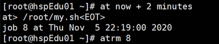

- 时间：

    at 的时间指定相对于crond比较复杂一些，但是仍然非常好理解，它有如下几种方式：

    1. 接受在当天的 `hh:mm`形式指定，比如 `04:00`代表当天的凌晨4点执行，假如今天过去了，那么明天执行。
    1. 使用比较模糊的概念：`midnight(深夜)`、`noon(中午)`、`teatime（饮茶时间，一般在下午四点）`。
    1. 采用 12 小时 + AM/PM 的方式，比如：`8pm`（下午8点）。
    1. 采用具体日期，格式为：`month day`，或者 `mm/dd/yy`，或者 `dd.mm.yy`，日期在时间后面，比如：`04:00 2021-03-1`。
    1. 采用相对计时法，格式为：`now + count time-units`，count 是时间数量，time-units 是时间单位，时间单位可以使用：`minutes`、`hours`、`days`、`weeks`，比如：`now + 5 minutes`表示 5 分钟之后执行。
    1. 直接使用`today`，`tomorrow`来指定完成命令的时间。

- 案例：

    1. 两天后的下午五点执行指令 `/bin/ls /home`。

        ```bash
        # 第一步，输入完成之后回车
        at 5pm + 2 days
        # 第二步，在回车之后的at输入框中输入指令，输入两次 ctrl+d ，注意是两次
        /bin/ls /home
        ```

    1. 使用`atq`来查看系统没有执行的任务。
    1. 明天 17 点，输出时间到 `/root/data100.log` 文件中。

        ```bash
        # 第一步，输入完成之后回车
        at 5pm tomorrow
        # 第二步，在回车之后的at输入框中输入指令，输入两次 ctrl+d ，注意是两次
        date > /root/date100.log
        ```

## 磁盘分区与挂载

### 磁盘分区与挂载原理介绍

1. Linux，无论是几个分区，分给几个目录使用，归根结底就是一块根目录 `/`，只不过这个根目录中有很多分区，共同组成了文件系统。
1. Linux中采用了一个叫做 `载入`，或者叫 `挂载` 的处理方法，它的整个文件系统包含了一整套的文件和目录，并且将一个分区和一个目录联系起来。

    这么说可能有些难以理解，举一个例子，就是拿我们一开始创建 Linux 时的分区举例子：

    

    我们看上面这张图，是我们一开始在创建 Linux 虚拟机的时候执行的，我们给了根目录 17G，给了 boot 目录1G，给了 swap2G。

    其实这些加起来是一块硬盘，只不过硬盘里面有几个分区，看下图：

    

    假如我们还有另外一块硬盘，仍然可以这样挂载。

---

**Linux硬盘**

Linux硬盘分为两种类型：`IDE` 硬盘、`SCSI` 硬盘，目前主流是 `SCSI` 硬盘。

1. 对于 `IDE` 硬盘，驱动盘标识符为 `hdx~`：

    其中`hd`代表IDE硬盘，x为盘号(a为基本盘、b为基本从属盘、c为辅助主盘、d为辅助从属盘)，也可以记作第一块硬盘，第二块硬盘，第三块硬盘，第四块硬盘。

    `~` 代表硬盘中的分区，前四个分区用数字 1-4 表示，它们是主分区或者扩展分区，从 5 开始就是逻辑分区。

    比如 `hda3` 代表 `第一个IDE硬盘第三主分区` 或 `第二个IDE硬盘第三扩展分区`。

    比如 `hdb2` 代表 `第二个IDE硬盘第二主分区` 或 `第二个IDE硬盘第二扩展分区`。

1. 对于 `SCSI` 标识符为 `sdx~`：

    `sd` 代表 `SCSI` 硬盘，`x` 代表第几块硬盘，`~` 代表硬盘中的分区。

    比如`sda1`代表SCSI硬盘中的第一块硬盘中的第一块分区。

1. 我们可以使用命令 `lsblk` 来查看硬盘的情况，使用 `lsblk -f` 可以查看更加详细的信息：

    

    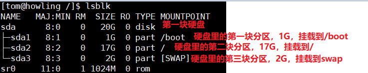

### 挂载的经典案例

**挂载**

1. 准备硬盘：

    

    

    

    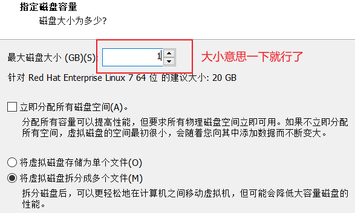

    

1. 分区

    首先重启系统，然后使用查看分区指令 `lsblk`。

    

    我们可以看到 `sdb` 但是没有看到分区，这是因为我们只是添加了，但是没有进行分区，下面我们进行分区：

    为了意思意思，分出一个区就可以了，分区命令 `fdisk /dev/sdb`：

    - `m`：显示命令列表。
    - `p`：显示磁盘分区，同 `fdisk -l`。
    - `n`：新增分区。
    - `d`：删除分区。
    - `w`：写入并退出。

    说明：开始分区后输入 `n` 新增分区，然后选择 `p`，分区类型为主分区。两次回车默认剩余全部空间。最后输入 `w` 写入分区并推出，假如不保存退出输入 `q`。

    

    

    这里的分区号注意了，数字是几就是几个磁盘分区，默认是 1 就是一个分区，2 就是两个分区....直到 4 就是四个分区。

    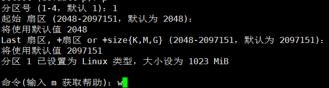

    一路默认回车，但是注意到最后的时候输入 `w` 表示写入并退出。

    

1. 格式化：

    分区之后还不能直接挂载，我们要对这个分区进行格式化，指定它的文件类型。

    格式化之后会给一个分区分配给一个 UUID，我们使用命令 `lsblk -f` 可以查看：

    

    格式化：`mkfs -t ext4 /dev/sdb1`

    解释一下上面的格式化命令，`ext4` 是分区类型，`sdb1` 就是第二块硬盘的第一个分区。

    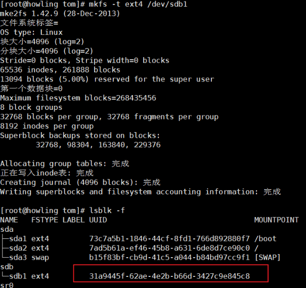

1. 挂载：

    我们现在在 `/` 下面创建一个目录 `newdisk`，作为我们测试挂载的路径，但是注意，这个分区可以挂载到任何目录下面，只不过在根目录下比较好测试罢了。

    `mount /dev/sdb1 /newdisk/`

    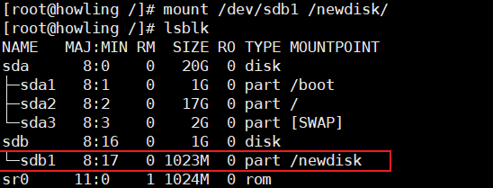

1. 卸载：

    假如因为种种原因，我想要卸载这个分区，那么只需要命令：`umount /dev/sdb1`。

    卸载有两个注意点：

    1. 卸载硬盘之前要首先退出这个目录。
    1. 卸载完成之后，硬盘中的文件不会消失。

1. 永久挂载：

    用命令行挂载，重启之后会失效，所以我们需要永久挂载，永久挂载，需要修改 `/etc/fstab` 文件。

    添加完成之后，只需要执行 `mount -a` 那么就会立刻生效。

    1. `vim /etc/fstab`。
    1. 新加上我们刚才挂载成功的 UUID，假如记不住，直接写上 `/dev/sdb1` 也行。

    

    

---

### 磁盘情况查询

- 查询系统整体磁盘使用情况：`df -h`。

    

    我们说，假如文件的占用率已经达到 80% 及以上，那么就需要考虑空间清理或者扩容了。

- 查询指定目录的磁盘占用情况：`du -h`。

    默认为 `du-h`，查询当前目录，有以下参数：

    - `-s`：指定目录占用大小汇总。
    - `-h`：带计量单位。
    - `-a`：含文件。
    - `--max-depth=1`：子目录深度。
    - `-c`：列出明细的同时，增加汇总值。

    比如查询`/opt`的磁盘占用情况，深度为1：`du -hac --max-depth=1 /opt`。

---

下面有几个场景：

- 统计文件夹下文件的个数：

    `ls -l /opt | grep "^-" | wc -l`

    首先查询出 `/opt` 下的所有文件，然后选择出以 `-` 开头的，也就是普通文件，然后使用 `wc` 统计个数，最后列出。

1. 统计文件夹下目录的个数：

    `ls -l /opt | grep "^d" | wc -l`

1. 统计文件夹下文件的个数，包括子文件夹下：

    `ls -lR /opt | grep "^-" | wc -l`

1. 统计文件夹下目录的个数，包括子文件夹：

    `ls -lR /opt | grep "^d" | wc -l`

1. 以树状显示目录结构：

    `tree /opt`

    注意，默认情况下没有安装 tree 指令，首先要安装tree：`yum -y install tree`

## Linux网络配置

### Linux网络概述

在我们一开始讲解Linux的时候，曾经讲过Linux的网络关系，现在再次进行一次讲解

VMWare 中，网络有这么几种：

- 桥接模式。
- NAT 模式。
- 仅主机模式。
- 自定义。
- LAN 区段。

下面我们说一下几种模式的区别：

- 桥接模式：

    它可以令 Linux 能够和外部进行通讯，只需要 Linux 和外部的主机在同一个网段下即可。

    比如现在张三有主机 A，虚拟机 B，王五有主机 C，虚拟机 D，子网掩码 255.255.255.0。

    这个时候张三的主机是 192.168.0.20，虚拟机是 192.168.0.80，所以张三的主机和虚拟机都是在一个网段下

    那么王五的主机是 192.168.0.30，它们三者共同在一个网段下，张三的虚拟机就可以直接和王五的主机通信。

    是这种方式有可能造成冲突，比如一个教室里面 300 个人，但是网段只有 255，那么肯定就会产生冲突。

    但是在这种模式下，A 可以找 C，C 也可以找 A。

- NAT模式：

    假如现在张三的主机 A、虚拟机 B，王五有主机 C。

    A的 ip 为 `192.168.0.20`，B 的 ip 为 `192.168.100.88`，C的 ip 为 `192.168.0.30`。

    那么这个时候，看似张三的虚拟机和另外两个不在同一个网段，但是在 NAT 模式下一切皆有可能。

    张三的主机 A 会生成一个对应的网卡，和 Linux 虚拟机在同一个网段下，比如 `192.168.100.99`。

    那么 B 就可以和 A 进行互通，并且 B 可以根据 A 作为一个跳板去通信 `192.168.0.xx` 频段的内容。

    所以 NAT 模式就是我们说的网络地址转换模式，不造成 IP 冲突，这个时候虚拟机 B 可以和外部进行通信，但是这个时候注意，外部不能去访问内部的，也就是 C 不能找 B。

    假如一切都正常，检查一下电脑的防火墙是否关闭，关闭后再次测试。

- 主机模式：不和外部进行通讯。

---

**NAT详解**

那么我们根据 NAT 模式进行讲解，虚拟机是如何和外界进行网络通信的。

首先我们来看下面这张图片，下面这张图片上面是来自电脑的网络配置，其中 VMWare Network Adapter VMnet8 指的就是 VMWare，可以很清楚的看到他们其实都在一个网段中:


在一个网段中的意思就是：两者可以相互 ping 通，假如 ping 通不了那么一定是 windows 防火墙的问题。

那么在 windows 中还有一个 IP 地址，这个 IP 地址就是无线网络适配器，如下图：


这个无线局域网适配器也是放在电脑上面的，它承担了和互联网进行数据通信的工作，上面的这个其实是比较特殊的 IP 地址，正常的 IP 地址不会是 0。

我们的 Linux 虚拟机和互联网进行通信其实是依靠了一个中间的代理网卡才能达到这种效果。

---

### Linux网络配置指令

#### 查看网络和IP地址

- 在 VMWare 下面查看网络：

    上面我们在讲解 Linux 使用 NAT 模式是如何进行与互联网通信的过程中，曾经讲过有一个 Linux 的网络地址和 VMWare 网络地址，而 Linux 虚拟机想要和外部进行通信必须依靠 VMWare 这个外部地址：

    那么有一个问题就来了：这两个网络的 IP 地址的网段为什么必须是  `192.168.145.x` 呢？

    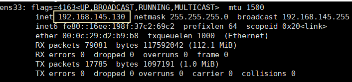

    其实这是因为我们是在 VMWare 中主动进行设置的，这个设置我们走的是默认情况，下面我们来查看：

    打开 VMWare，编辑 --> 虚拟网络编辑器，看到下面的图，这里定义了网段，所以我们的网段就是这么来的

    

    从这里，我们还可以看到 IP 的分配范围，点击 DHCP 设置，就可以看到他的分配范围：

    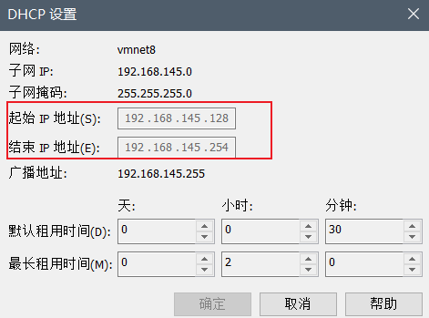

    我们还可以查看 NAT 设置，也可以看到它的网关：

    

查看 IP 配置：

- windows下面：`ipconfig`
- Linux下面：`ifconfig`

---

#### 网络配置

网络配置有两种情况：

1. 自动获取 IP 地址（采用 DHCP 分配）。

1. 固定 IP 地址。

这两者有分别的好处，自动获取IP地址可以尽量的避免网络冲突，在家用电脑上一般使用的就是这种配置。

固定IP地址有可能会出现网络冲突，但是服务器一定要固定 IP 地址，才不会出现重启之后连接原来 IP 连不上的情况，或者你想搞一个主机作为代理设置，这个 IP 一定是固定的。

我们这里主要讲的就是固定 IP 地址：

我们直接修改配置文件来制定 IP，并且可以连接到外网。

只需要编辑 `/etc/sysconfig/network-scripts/ifcfg-ens33` 即可改变我们的配制。

下面是实操部分，比如我们这里就要固定 IP 地址为 `192.168.145.130`

这里说明一下 `ifcfg-ens33` 这个文件的内容

```shell
# 网络类型，通常就是Ethernet
TYPE="Ethernet"
PROXY_METHOD="none"
BROWSER_ONLY="no"
# 分配方式，这里是DHCP，也就是自动分配的意思，我们可以改为static，为静态分配
BOOTPROTO="dhcp"

# 下面这个IP地址在原本的配置文件中是没有的，这段代码就是说假如是static，那么给网络分配什么具体的IP，我们分配时要加上
# IPADDR=192.168.145.130

# 子网掩码，子网掩码在默认的这里也没有加，所以加上即可，三个255代表IP的前三位都是网段，后一位是IP地址分配
# NETMASK=255.255.255.0

# 网关，这里的网关在配置文件中也是没有的，所以我们要加上网关的代码，这个网关注意用自己的网关，别照抄
# GATEWAY=192.168.145.2

# 域名解析器，域名解析器在原本的配置文件中也是没有的，所以我们也需要手动添加，这个DNS也用自己的，别照抄
# DNS1=192.168.145.2
# 如果觉得一个DNS解析器不保险，那么就多加几个
# DNS2=8.8.8.8
# DNS3=114.114.114.114
DEFROUTE="yes"
IPV4_FAILURE_FATAL="no"
IPV6INIT="yes"
IPV6_AUTOCONF="yes"
IPV6_DEFROUTE="yes"
IPV6_FAILURE_FATAL="no"
IPV6_ADDR_GEN_MODE="stable-privacy"
NAME="ens33"
# 唯一的随机标识符
UUID="f85bd30f-ffea-47de-a768-a856fb61ada6"
# 设备名字
DEVICE="ens33"
# 系统启动后网络接口是否有效，这里默认YES即可
ONBOOT="yes"
```

下面我们直接给修改好的配置文件截张图即可

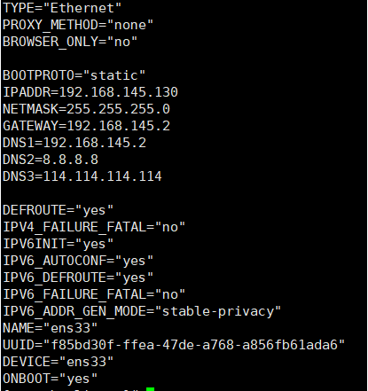

假如我们还想让我们的 Linux 上网，那么还有一个步骤就是设置 VMWare 的 IP，因为我们刚才讲过 Linux 其实是利用 VMWare 这个代理网卡进行的网络通信。

那么我们的Linux虚拟机的网段设置的是 `192.168.145.xxx`，那么我们的 VM 应该也设置这个地址。


注意，上面是 VMWare 的网卡配置而不是 Linux 的网卡配置，毕竟 Linux 的网卡我们刚才已经配置完成了，所以我们仍然需要 DHCP 去给 VMWare 分配 IP 地址。

然后是 NAT 设置中配置网关，网关注意要和 Linux 配置的网关一样。


完成之后，重启网络服务或者重启系统：

- `service network restart`
- `reboot`

---

#### Linux 主机名和 hosts 映射

为了方便记忆，我们可以给Linux设置主机名字，这样方便记忆

- `hostname`：查看主机名字。
- `/etc/hostname`：主机名字，可以直接使用 vi 编辑器修改，修改后重启机器。

下面我们可以使用主机名字和 hosts 进行映射，这样就可以直接使用主机名字进行操作，比如 ping 操作。我们 ping 目标主机名字的时候直接 ping 是 ping 不通的，但是我们只需要进行主机的指定即可。

在 windows 平台和 linux 平台有着不同的映射操作：

- windows：`C\Windows\System32\drivers\etc\hosts` 中指定。
- linux：`/etc/hosts` 文件中指定。

直接使用 windows 的映射来举个例子，linux 也是一样的：


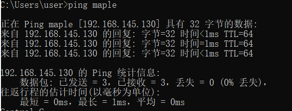

下面我们进行 linux 的配置，注意这个 IP 其实是 VMWare 的代理网卡的 IP，不要真搞成电脑的 IP。

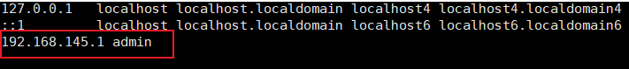

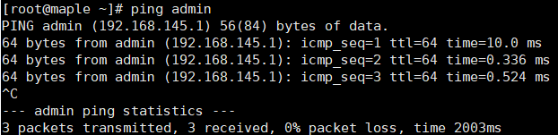

---

**Linux主机名和hosts映射的原理**

Domain Name System：简称 DNS，翻译就是域名系统，他是互联网上作为域名和 IP 地址相互映射的一个分布式数据库。
Hosts：是一个文本文件，用来记录 IP 和 Hostname（主机名）的映射关系。

---

## 进程管理

### 进程管理基本介绍

在Linux中，每一个执行的程序都叫做一个进程，每一个进程都有一个ID号（pid进程号）。每一个进程都可能以两种方式存在：前台和后台。

前台的意思就是可以在用户目前的屏幕上可以进行操作的，后台的意思就是在屏幕上看不见，但是在默默运行。

一般系统的服务都是以后台进程来存在的，而且都是常驻系统中，等到关机才结束。

### ps指令详解

我们可以通过 ps 来查看目前系统中，有哪些正在执行，以及他们执行的情况。可以不加任何参数，但是带出来的信息很少。

- PS显示的信息选项

| 字段 | 说明                     |
| ---- | ------------------------ |
| PID  | 进程识别号               |
| TTY  | 终端机号                 |
| TIME | 此进程所消CPU时间        |
| CMD  | 正在执行的命令或者进程名 |

- PS命令

1. `ps -a`：显示当前终端的所有进程信息。
1. `ps -u`：以用户的格式显示进程信息。
1. `ps -x`：显示后台进程运行的参数。

一般来讲，我们将这三个字段组合使用，并且还会组合管道符进行组合使用。


VSZ 和 RSS 的占用大小单位都是 KB。

STAT 的状态分为这么几个：S-睡眠、s-表示该进程是会话的先导进程，N-表示进程拥有比普通优先级更低的优先级，R-正在运行，D-短期等待，Z-僵死进程，T-被跟踪或者被停止等等

`COMMAND` 是启动此进程的执行指令，假如太长会被截断，就是后面的那些进程。

有时候，我们只关心某一个进程，所以可以加上一个管道符和 grep 来查看进程情况，比如我们查看 sshd 这个进程情况（SSHD 的作用就是远程登录）。


其实只有最上面那一个代表的是我们这个 sshd 这个进程正在执行，下面的二三个是 root 用户登录进去的情况，最下面是我们刚才输入 `ps -aux | grep sshd` 查看的代码。

### 父子进程

在 Linux 中，有父子进程的概念，一个进程可以创建出子进程。

比如现在我们有一个进程 A，进程 A 创建出了两个进程 A1 和 A2，那么 A1 和 A2 就是 A 的子进程。

假如我们干掉了 A 这个父进程，它的子进程也都会一并被干掉，这样利于我们对系统的管理。

`ps -ef` 是以全格式显示所有进程，`-e` 代表所有进程，`-f` 代表全格式。

我们再次以 sshd 这个进程来做演示，查看它的全格式：


然后我们再去看全格式的全部的内容：


从上图我们可以看出来，PID 为 1 的是刚才的 sshd 的父进程，PID 为 1 的这个进程的父进程是 0，但是这里又没有 0，所以我们可以得出这个结论：PID 为 1 的进程是最开始的一个根进程，它有很多子进程，其中就有一个 sshd 进程。

---

### 终止进程

假如一个进程执行了一半需要停止或者已经消耗了大量的系统资源，此时可以考虑停止此进程，使用 kill 命令来完成。

基本语法

1. `kill [选项] 进程号`：通过进程号干掉进程。
1. `killall 进程名称`：通过进程名称干掉进程，支持通配符。

注意，使用 `killall` 的方式干掉一个进程，那么他的子进程也会被干掉。

常用选项：

- `-9`：强迫进程立刻停止。

    有时候系统认为这个进程十分重要，那么可能会忽略单纯的kill命令，这个时候 `-9` 就可以强制干掉进程。
    这个命令在干掉非法用户，终止远程登录服务，强制干掉某个终端等情况很有用。
    干掉进程之后，可以通过 `/bin/systemctl start 服务名字` 来启动这个服务进程，重新启动之后进程号会变化。
    举个例子，强制关闭终端（这个终端和远程登录没关系，远程登录是 sshd 服务起作用，终端指的是 linux 本机上运行的终端 bash），那么查看终端就是 `ps -aux | grep bash`，强制关闭终端就是 `kill -9 bash进程号`。

---

### pstree

查看 linux 进程可以更加直观的查看进程信息。

- `pstree [选项]`

常用选项

- `-p`：显示进程PID
- `-u`：显示进程的所属用户


---

## 服务管理

### 服务管理基本介绍

服务本身就是跑在后台的进程，通常都会监听某一个端口，等待其他程序的请求，比如MySQL、SSHD、防火墙等，因此我们又称为守护进程，是Linux种非常重要的知识点

- `service` 管理指令：

1. `service 服务名 [start | stop | restart | reload | status]`

    选项就是这么几个：start 启动，stop 停止，restart 重启，reload 重载，status 查看状态。

1. 在 CentOS7.0 之后，很多服务不再使用 `service`，而是使用 `systemctl`（后面专讲）。
1. 那么在 CentOS7.0 之后，可以继续使用 service 指令管理的服务在 `/etc/init.d` 中查看，绿色的仍然可以。

    

    到了 CentOS8 之后，network 也没了，service 命令基本凉透了。

- 查看服务名字：

有两种方式：

1. `ls -l /etc/init.d`：这种方式可以查看有限的服务。
1. `setup`：会出现一个弹框页面，选择系统服务回车就可以了，退出就按 `tab` 进入下面的退出选项。

    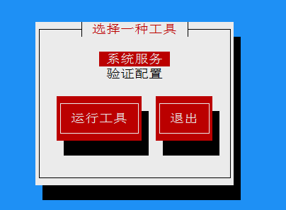

    

    注意，在前面有星号的就是随着 Linux 启动自动启动的，没有的就是手动启动。使用空格可以切换是否自动启动。

---

### 服务的运行级别（runlevel）

Linux 有 7 种运行级别：常用级别是 3 和 5。

- 运行级别 0：系统停机。
- 运行级别 1：单用户工作状态，root 权限，用于系统维护，禁止远程登录。
- 运行级别 2：多用户状态（没有 NFS），不支持网络。
- 运行级别 3：完全多用户状态（有 NFS），登录后进入控制台命令行模式。
- 运行级别 4：系统未使用，保留。
- 运行级别 5：X11 控制台，登录后进入图形 GUI 模式。
- 运行级别 6：系统正常关闭重启，默认级别不能运行 6，否则不能正常启动。

开机流程：

`开机->BIOS引导->/boot->systemd进程1->运行级别->运行级对应的服务`

运行级别介绍：

在 `/etc/initab` 可以进行设置，并且进行了简化：

- `multi-user.target`：等同 `analogous to runlevel 3`。
- `graphical.target`：等同 `analogous to runlevel 5`。

查看运行级别：

那么我们进行查看的指令：`systemctl get-default`：


修改运行级别：

- `systemctl set-default graphical.target`。
- `systemctl set-default multi-user.target`。

### chkconfig

通过 `chkconfig` 命令可以给服务的各个运行级别设置自 启动/关闭。

比如有一个服务，可以通过 chkconfig 设置在 0 级别中是自启动还是关闭，在 1 级别中是自启动还是关闭，在 2 级别中...，也就是说对于某一个服务，在不同的启动级别中它的启动时不同的

chkconfig指令管理的服务在 `/etc/init.d` 中查看，注意，在 CentOS7.0 后，很多服务使用 `systemctl` 管理自启动。

基本语法：

- `chkconfig --list [| grep xxx]`：查看服务。

    

- `chkconfig --level 级别 服务名 on/off`：设置这个服务在某一个级别下是自启动还是关闭状态

    比如设置network在5级别下自启动：`chkconfig --level 5 network on`
### systemctl

- 管理指令：

    - 基本语法：`systemctl [start | stop | restart | status] 服务名`
    - systemctl 指令管理的服务在 `/usr/lib/systemd/system` 中查看。

- 服务的关闭和启动和查看：

    - `systemctl stop 服务`：启动。
    - `systemctl start 服务`：关闭。
    - `systemctl status 服务`：查看状态。

    比如防火墙：`systemctl stop firewalld`、`systemctl status firewalld`

    细节讨论：

    刚才我们关闭或者开启防火墙后，指令立刻生效。这种方式只是临时生效，当重启系统之后，还是回归之前对服务的设置

    如果设置某个服务永久自启动/关闭，要使用`systemctl [enable | disable] 服务名`。

- systemctl 可以设置服务的自启动状态：

    - `systemctl list-unit-files [| grep 服务名]`：查看服务开机启动状态，grep 可以进行过滤。
    - `systemctl enable 服务名`：设置服务开机启动。
    - `systemctl disable 服务名`：关闭服务开机启动。
    - `systemctl is-enabled 服务名`：查询某个服务是否是自启动的。


### 防火墙的端口设置

我们在真正生产环境，肯定是打开防火墙的，但是我们又需要打开某一个端口，那么我们进行如下设置：

- `firewall-cmd --permanent --add-port=端口号/协议`：打开端口。
- `firewall-cmd --permanent --remove-port=端口号/协议`：关闭端口。
- `firewall-cmd --reload`：重新载入才可以生效新的设置。
- `firewall-cmd --query-port=端口号/协议`：查看某端口是否开放。

## 动态监控

动态监控，也就是说动态的监控进程，有一个指令叫做 `top`。top 指令和 ps 指令其实差不多，但是最大的不同之处在于 `top` 一般用于某个时间范围内的查看情况。

基本使用：

- `top [选项]`

选项说明：

- `-d 秒数`：指定top命令每隔几秒更新，默认是3秒。
- `-i`：使top不显示任何闲置或者僵死进程。
- `-p`：通过指定监控进程ID来仅仅监控某一个进程的状态。


上面这张图涉及到的内容还是比较多的，从第一行开始看：

```shell
21:43:57：代表的是当前时间
3min：代表系统运行了多长时间
1 user：一个用户
load average：负载均衡，这三个数全都加起来然后除3，只要没有超过70%就算可以

Tasks：263 total ： 代表了一共263个任务数
1 running：一个正在运行的任务
262 sleeping：262个休眠的任务
0 stopped：没有停止的任务
0 zombie：没有僵死的任务

0.0us：us指的是user，代表了用户占用CPU资源为0%
0.1sy：sy是system，代表了系统占用0.1%的CPU资源
id：Idle，空闲，系统空闲了99.9%的CPU

2028116 total：总共的内存资源为这些
1171352 free：内存资源有这些剩余
431064 used：内存用了这些
425700 buff/cache：这些作为缓存

2097148 total：总共这些Swap，Swap我们一开始分配资源的时候说过是分区
剩下的和内存差不多
1382232 avalil Mem：这些可以申请的空间
```

> 注意一下僵死进程：程序死了但是内存没有释放，这就叫做僵死进程，出现僵死进程就会占用正常进程的资源。

---

**top动态监控中的交互**

| 操作 | 功能                          |
| ---- | ----------------------------- |
| P    | 以CPU使用率排序，默认就是此项 |
| M    | 以内存的使用率排序            |
| N    | 以PID排序                     |
| q    | 退出top                       |

监控指定用户：`top` -> 回车 -> 输入 `u` -> 回车 -> 输入用户名 -> 回车。

终止指定的进程：`top` -> 回车查看执行的进程 -> 输入 `k` -> 回车 -> 输入要结束的进程 ID。

---

**监控网络状态**

基本语法：

- `netstat [选项]`

选项说明：

- `-an`：按照一定的顺序排列输出。
- `-p`：显示按照哪个进程在调用。


上面图片的信息其实还是比较多的：

1. Proto：协议，我们可以看到下面有这种协议 tcp 的，tcp6 的、
1. Local Address：本机的地址，可以理解为 Linux 的地址，后面有 IP:端口，其中 0.0.0.0 和 127.0.0.1 都代表本地。
1. Foreign Address：外部地址。
1. 可以看到有两个端口的外部地址和本机的一个地址相互联通了，State 是 Establish，学计算机网络的时候三次握手有这个状态。
1. 可以看到 tcp6 的 LocalAddress 是三个冒号拼一个端口号，这是 IPv6 的写法，兼容 IPv4 和 IPv6。

应用案例：

- 查看服务名称为`sshd`的服务信息：`netstat -anp | grep sshd`。
- 检测主机连接命令：ping。
