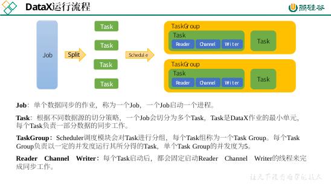

## 概述

[DataX](https://github.com/alibaba/DataX) 是阿里云开源的数据源离线同步工具，到目前为止支持主流的 RDBMS、NOSQL、阿里云中间件、数仓等组件。


DataX 将网状图变为了星型图，也就是说，数据源只需要跟 DataX 对接即可。


DataX 采用 framework + plugin 架构构建，将数据源抽象为 reader + writer 插件。



DataX 会将一个任务拆分为多个 Task，然后调度会调度 Task 的并发数量进行数据同步。

举例来说，用户提交了一个 DataX 作业，并且配置了总的并发度为 20，目的是对一个有 100 张分表的 mysql 数据源进行同步。DataX 的调度决策思路是：

- DataX Job 根据分库分表切分策略，将同步工作分成 100 个 Task。
- 根据配置的总的并发度 20，以及每个 Task Group 的并发度 5，DataX 计算共需要分配 4 个 TaskGroup。
- 4 个 TaskGroup 平分 100 个 Task，每一个 TaskGroup 负责运行 25 个 Task。

## 部署

- datax [下载地址](http://datax-opensource.oss-cn-hangzhou.aliyuncs.com/datax.tar.gz)，解压。
- 自检：`python /opt/module/datax/bin/datax.py /opt/module/datax/job/job.json`，出现类似内容则表示成功：

    ```txt
    ……
    2021-10-12 21:51:12.335 [job-0] INFO  JobContainer -
    任务启动时刻                    : 2021-10-12 21:51:02
    任务结束时刻                    : 2021-10-12 21:51:12
    任务总计耗时                    :                 10s
    任务平均流量                    :          253.91KB/s
    记录写入速度                    :          10000rec/s
    读出记录总数                    :              100000
    读写失败总数                    :                   0
    ```

- [其他方式](https://github.com/alibaba/DataX/blob/master/userGuid.md)。

## 使用

### 配置文件

使用十分简单，只需要指定配置的 json 文件即可：`python bin/datax.py path/to/your/job.json`。

json 模板如下：


reader 和 writer 可参考[官方文档](https://github.com/alibaba/DataX#support-data-channels)。

### 同步 MySQL 到 HDFS

#### TableMode

```json
{
    "job": {
        "content": [
            {
                "reader": {
                    "name": "mysqlreader",
                    "parameter": {
                        "column": [
                            "id",
                            "name",
                            "region_id",
                            "area_code",
                            "iso_code",
                            "iso_3166_2"
                        ],
                        "where": "id>=3",
                        "connection": [
                            {
                                "jdbcUrl": [
                                    "jdbc:mysql://hadoop102:3306/gmall"
                                ],
                                "table": [
                                    "base_province"
                                ]
                            }
                        ],
                        "password": "000000",
                        "splitPk": "",
                        "username": "root"
                    }
                },
                "writer": {
                    "name": "hdfswriter",
                    "parameter": {
                        "column": [
                            {
                                "name": "id",
                                "type": "bigint"
                            },
                            {
                                "name": "name",
                                "type": "string"
                            },
                            {
                                "name": "region_id",
                                "type": "string"
                            },
                            {
                                "name": "area_code",
                                "type": "string"
                            },
                            {
                                "name": "iso_code",
                                "type": "string"
                            },
                            {
                                "name": "iso_3166_2",
                                "type": "string"
                            }
                        ],
                        "compress": "gzip",
                        "defaultFS": "hdfs://hadoop102:8020",
                        "fieldDelimiter": "\t",
                        "fileName": "base_province",
                        "fileType": "text",
                        "path": "/base_province",
                        "writeMode": "append"
                    }
                }
            }
        ],
        "setting": {
            "speed": {
                "channel": 1
            }
        }
    }
}
```

---

HFDS Writer 并未提供 nullFormat 参数：也就是用户并不能自定义 null 值写到 HFDS 文件中的存储格式。

默认情况下，HFDS Writer 会将 null 值存储为空字符串 `''`，而Hive默认的null值存储格式为 `\N`。所以后期将 DataX 同步的文件导入 Hive 表就会出现问题。

可以[修改 DataX 源码](https://blog.csdn.net/u010834071/article/details/105506580)，也可以在 Hive 建表时将 null 存储为 `''`：

```sql
DROP TABLE IF EXISTS base_province;
CREATE EXTERNAL TABLE base_province
(
    `id`         STRING COMMENT '编号',
    `name`       STRING COMMENT '省份名称',
    `region_id`  STRING COMMENT '地区ID',
    `area_code`  STRING COMMENT '地区编码',
    `iso_code`   STRING COMMENT '旧版ISO-3166-2编码，供可视化使用',
    `iso_3166_2` STRING COMMENT '新版IOS-3166-2编码，供可视化使用'
) COMMENT '省份表'
    ROW FORMAT DELIMITED FIELDS TERMINATED BY '\t'
    NULL DEFINED AS ''
    LOCATION '/base_province/';
```

---

- DataX 向 HDFS 同步数据之前，需要确保路径存在：`hadoop fs -mkdir /base_province`。
- 在 datax 目录下执行：`python bin/datax.py job/sync.json`。

#### QuerySQLMode

类似 TableMode：

```json
{
    "job": {
        "content": [
            {
                "reader": {
                    "name": "mysqlreader",
                    "parameter": {
                        "connection": [
                            {
                                "jdbcUrl": [
                                    "jdbc:mysql://hadoop102:3306/gmall"
                                ],
                                "querySql": [
                                    "select id,name,region_id,area_code,iso_code,iso_3166_2 from base_province where id>=3"
                                ]
                            }
                        ],
                        "password": "000000",
                        "username": "root"
                    }
                },
                "writer": {
                    "name": "hdfswriter",
                    "parameter": {
                        "column": [
                            {
                                "name": "id",
                                "type": "bigint"
                            },
                            {
                                "name": "name",
                                "type": "string"
                            },
                            {
                                "name": "region_id",
                                "type": "string"
                            },
                            {
                                "name": "area_code",
                                "type": "string"
                            },
                            {
                                "name": "iso_code",
                                "type": "string"
                            },
                            {
                                "name": "iso_3166_2",
                                "type": "string"
                            }
                        ],
                        "compress": "gzip",
                        "defaultFS": "hdfs://hadoop102:8020",
                        "fieldDelimiter": "\t",
                        "fileName": "base_province",
                        "fileType": "text",
                        "path": "/base_province",
                        "writeMode": "append"
                    }
                }
            }
        ],
        "setting": {
            "speed": {
                "channel": 1
            }
        }
    }
}
```

#### DataX 接收参数

离线数据应该每日定时执行，即路径不固定，所以 DataX 需要接收参数执行：

- 配置文件：

    ```json
    {
        "job": {
            "content": [
                {
                    "reader": {
                        "name": "mysqlreader",
                        "parameter": {
                            "connection": [
                                {
                                    "jdbcUrl": [
                                        "jdbc:mysql://hadoop102:3306/gmall"
                                    ],
                                    "querySql": [
                                        "select id,name,region_id,area_code,iso_code,iso_3166_2 from base_province where id>=3"
                                    ]
                                }
                            ],
                            "password": "000000",
                            "username": "root"
                        }
                    },
                    "writer": {
                        "name": "hdfswriter",
                        "parameter": {
                            "column": [
                                {
                                    "name": "id",
                                    "type": "bigint"
                                },
                                {
                                    "name": "name",
                                    "type": "string"
                                },
                                {
                                    "name": "region_id",
                                    "type": "string"
                                },
                                {
                                    "name": "area_code",
                                    "type": "string"
                                },
                                {
                                    "name": "iso_code",
                                    "type": "string"
                                },
                                {
                                    "name": "iso_3166_2",
                                    "type": "string"
                                }
                            ],
                            "compress": "gzip",
                            "defaultFS": "hdfs://hadoop102:8020",
                            "fieldDelimiter": "\t",
                            "fileName": "base_province",
                            "fileType": "text",
                            "path": "/base_province/${dt}",
                            "writeMode": "append"
                        }
                    }
                }
            ],
            "setting": {
                "speed": {
                    "channel": 1
                }
            }
        }
    }
    ```

- 提交任务使用 `-p"-Dparam=value"`：`python bin/datax.py -p"-Ddt=2020-06-14" job/base_province.json`。

### 同步 HDFS 到 MySQL

配置文件：

```json
{
    "job": {
        "content": [
            {
                "reader": {
                    "name": "hdfsreader",
                    "parameter": {
                        "defaultFS": "hdfs://hadoop102:8020",
                        "path": "/base_province",
                        "column": [
                            "*"
                        ],
                        "fileType": "text",
                        "compress": "gzip",
                        "encoding": "UTF-8",
                        "nullFormat": "\\N",
                        "fieldDelimiter": "\t",
                    }
                },
                "writer": {
                    "name": "mysqlwriter",
                    "parameter": {
                        "username": "root",
                        "password": "000000",
                        "connection": [
                            {
                                "table": [
                                    "test_province"
                                ],
                                "jdbcUrl": "jdbc:mysql://hadoop102:3306/gmall?useUnicode=true&characterEncoding=utf-8"
                            }
                        ],
                        "column": [
                            "id",
                            "name",
                            "region_id",
                            "area_code",
                            "iso_code",
                            "iso_3166_2"
                        ],
                        "writeMode": "replace"
                    }
                }
            }
        ],
        "setting": {
            "speed": {
                "channel": 1
            }
        }
    }
}
```

## 优化

**速度**

DataX3.0 提供了包括通道(并发)、记录流、字节流三种流控模式，可以随意控制你的作业速度，让你的作业在数据库可以承受的范围内达到最佳的同步速度。

| 参数                                | 说明                                                    |
| ----------------------------------- | ------------------------------------------------------- |
| job.setting.speed.channel           | 并发数                                                  |
| job.setting.speed.record            | 总 record 限速                                          |
| job.setting.speed.byte              | 总 byte 限速                                            |
| core.transport.channel.speed.record | 单个 channel 的 record 限速，默认值为10000（10000条/s） |
| core.transport.channel.speed.byte   | 单个 channel 的 byte 限速，默认值1024*1024（1M/s）      |

- 若配置了总 record 限速，则必须配置单个 channel 的 record 限速。
- 若配置了总 byte 限速，则必须配置单个 channel 的 byte 限速。
- 若配置了总 record 限速和总byte限速，channel 并发数参数就会失效。因为配置了总 record 限速和总 byte 限速之后，实际 channel 并发数是通过计算得到的：

    min(总 byte 限速 / 单个 channel 的 byte 限速，总 record 限速 / 单个 channel 的 record 限速)

案例：

```json
{
    "core": {
        "transport": {
            "channel": {
                "speed": {
                    "byte": 1048576 //单个 channel byte 限速1M/s
                }
            }
        }
    },
    "job": {
        "setting": {
            "speed": {
                "byte" : 5242880 //总 byte 限速5M/s
            }
        },
        ...
    }
}
```

**内存**

当提升 DataX Job 内 Channel 并发数时，内存的占用会显著增加，因为 DataX 作为数据交换通道，在内存中会缓存较多的数据。

例如 Channel 中会有一个 Buffer，作为临时的数据交换的缓冲区，而在部分 Reader 和 Writer 的中，也会存在一些 Buffer，为了防止 OOM 等错误，需调大 JVM 的堆内存。

建议将内存设置为 4G 或者 8G，这个也可以根据实际情况来调整。

调整 JVM xms xmx 参数的两种方式：

- 直接更改 datax.py 脚本。
- 在启动的时候，加上对应的参数，如下：`python datax/bin/datax.py --jvm="-Xms8G -Xmx8G" /path/to/your/job.json`。

## 插件开发

详情查看[官方文档](https://github.com/alibaba/DataX/blob/master/dataxPluginDev.md)。
