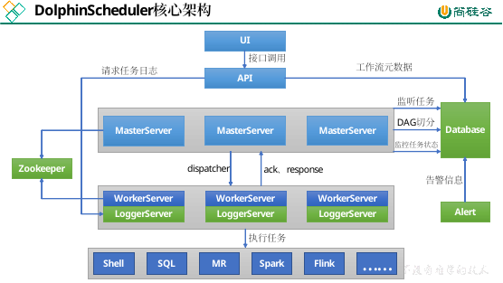
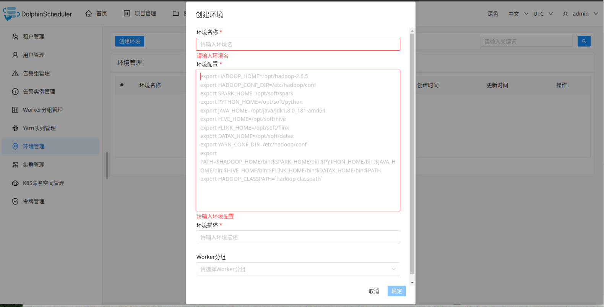
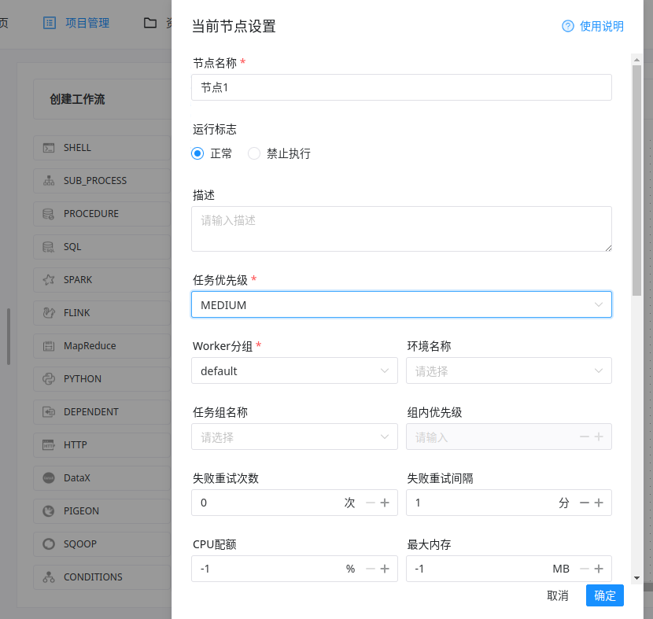
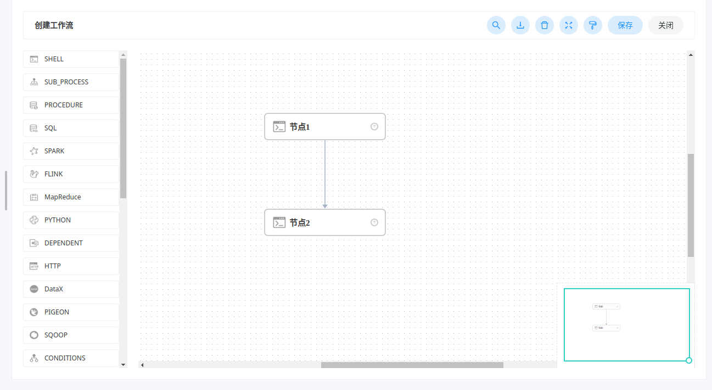

## 概述

[Apache DolphinScheduler](https://dolphinscheduler.apache.org/zh-cn) 是一个调度工具。

主要架构有：

- Zookeeper：用于管理 MasterServer 和 WorkerServer。
- MasterServer：分布式无中心设计理念，负责 DAG 任务切分、任务提交、任务监控，监听其他 MasterServer 和 WorkerServer 的健康状态。
- WorkerServer：分布式无中心设计理念，主要负责任务执行和日志服务。
- Alert：告警服务。
- API：接口，主要处理 UI 的请求。
- UI：前端页面。



## 部署

详见[官方文档](https://dolphinscheduler.apache.org/zh-cn/docs/3.1.3/%E9%83%A8%E7%BD%B2%E6%8C%87%E5%8D%97_menu)。

资源需求：

- 均需要 JDK（1.8+）。
- 部署数据库（MySQL5.7+ 或 PostgreSQL8.2.15+）【MySQL 需要 JDBC Driver 8.0.16】。
- 均需要 Zookeeper（3.4.6+）。
- HDFS 部署则需要 Hadoop（2.6+）。
- 均需要安装 psmisc（进程管理工具包）：`sudo yum install -y psmisc`。

解压后，使用一键部署脚本：`conf/config/install_config.conf`，需要修改为：

```
……
# 将要部署任一 DolphinScheduler 服务的服务器主机名或 ip 列表
ips="hadoop102,hadoop103,hadoop104"

……

# master 所在主机名列表，必须是 ips 的子集
masters="hadoop102"

……

# worker主机名及队列，此处的 ip 必须在 ips 列表中
workers="hadoop102:default,hadoop103:default,hadoop104:default"

……

# 告警服务所在服务器主机名
alertServer="hadoop102"

……

# api服务所在服务器主机名
apiServers="hadoop102"

……

# 不需要的配置项，可以保留默认值，也可以用 # 注释
# pythonGatewayServers="ds1"

……

# DS 安装路径，如果不存在会创建
installPath="/opt/module/dolphinscheduler"

……

# 部署用户，任务执行服务是以 sudo -u {linux-user} 切换不同 Linux 用户的方式来实现多租户运行作业，因此该用户必须有免密的 sudo 权限。
deployUser="atguigu"

……

# 前文配置的所有节点的本地数据存储路径，需要确保部署用户拥有该目录的读写权限
dataBasedirPath="/tmp/dolphinscheduler"

……

# JAVA_HOME 路径
javaHome="/opt/module/jdk1.8.0_212"

# DolphinScheduler API service port, also this is your DolphinScheduler UI component's URL port, default value is 12345
apiServerPort="12345"

……

# 注意：数据库相关配置的 value 必须加引号，否则配置无法生效
# 数据库类型
DATABASE_TYPE="mysql"

……

# 数据库 URL
SPRING_DATASOURCE_URL="jdbc:mysql://hadoop102:3306/dolphinscheduler?useUnicode=true&characterEncoding=UTF-8"
# 数据库用户名
SPRING_DATASOURCE_USERNAME="dolphinscheduler"
# 数据库密码
SPRING_DATASOURCE_PASSWORD="dolphinscheduler"

……

# 注册中心插件名称，DS 通过注册中心来确保集群配置的一致性
registryPluginName="zookeeper"
# 注册中心地址，即 Zookeeper 集群的地址
registryServers="hadoop102:2181,hadoop103:2181,hadoop104:2181"
# DS 在 Zookeeper 的节点名称
registryNamespace="dolphinscheduler"

……

# 资源存储类型：HDFS, S3, NONE
resourceStorageType="HDFS"
# 资源上传路径
resourceUploadPath="/dolphinscheduler"
# 默认文件系统
defaultFS="hdfs://hadoop102:8020"

# if resourceStorageType is S3, the following three configuration is required, otherwise please ignore
s3Endpoint="http://192.168.xx.xx:9010"
s3AccessKey="xxxxxxxxxx"
s3SecretKey="xxxxxxxxxx"

……

# yarn RM http 访问端口
resourceManagerHttpAddressPort="8088"
# Yarn RM 高可用 ip，若未启用 RM 高可用，则将该值置空
yarnHaIps=
# Yarn RM 主机名，若启用了 HA 或未启用 RM，保留默认值
singleYarnIp="hadoop103"
# 拥有 HDFS 根目录操作权限的用户
hdfsRootUser="atguigu"

……
```

初始化数据库：

```sql
-- 创建数据库
CREATE DATABASE dolphinscheduler DEFAULT CHARACTER SET utf8 DEFAULT COLLATE utf8_general_ci;
-- 降低密码强度级别
set global validate_password_length=4;
set global validate_password_policy=0;
-- 创建用户
CREATE USER 'dolphinscheduler'@'%' IDENTIFIED BY 'dolphinscheduler';
-- 赋予权限
GRANT ALL PRIVILEGES ON dolphinscheduler.* TO 'dolphinscheduler'@'%';
-- 刷新
flush privileges;
-- 需要拷贝 MySQL 的驱动：mysql-connector-java-8.0.16.jar 到 mysql lib 下
-- 执行 dolphinScheduler 的初始化脚本：script/create-dolphinscheduler.sh
```

部署 dolphinScheduler：

- 启动 zookeeper 集群。
- 部署并启动 dolphinScheduler：运行 `$DOLPHIN_SCHEDULER_HOME` 下 `install.sh`。
- jps 可查看进程，会启动：`MasterServer`、`WorkerServer`、`AlertServer`、`LoggerServer`、`ApiApplicationServer`。
- 访问 UI：`http://hadoop102:12345/dolphinscheduler`，初始用户名、密码为 `admin`、`dolphinscheduler123`。
- 启动与停止：

    ```
    -- 所有服务
    ./bin/start-all.sh
    ./bin/stop-all.sh
    -- MasterServer
    ./bin/dolphinscheduler-daemon.sh start master-server
    ./bin/dolphinscheduler-daemon.sh stop master-server
    -- WorkerServer
    ./bin/dolphinscheduler-daemon.sh start worker-server
    ./bin/dolphinscheduler-daemon.sh stop worker-server
    -- LoggerServer
    ./bin/dolphinscheduler-daemon.sh start logger-server
    ./bin/dolphinscheduler-daemon.sh stop logger-server
    -- AlertServer
    ./bin/dolphinscheduler-daemon.sh start alert-server
    ./bin/dolphinscheduler-daemon.sh stop alert-server
    ```

## 使用

### 基本使用

注意：

- 安全中心 -> 租户管理：

    对应 Linux 下的租户，worker 会用这个租户提交作业。

    没有这个租户会导致失败，可以修改 `worker.properties` 中 `worker.tenant.auto.create=true`，令没有这个租户会创建。

    `worker.tenant.auto.create=true` 会要求 worker 免密运行 sudo。

    

    队列指提交 Yarn 任务的默认队列。

- 安全中心 -> Worker 分组：

    任务执行时可以将任务分给指定 Worker 组，由该组的 Worker 执行。默认为 default 分组。

    可以修改 worker 分组：

        - 在 `conf/worker.properties` 配置文件修改 `worker.groups`，如：`worker.groups=default,test`。
        - 安全中心 -> worker 分组管理可添加新的 worker 分组。

- 安全中心 -> Yarn 队列：

    这里的队列指 Yarn 的调度器的资源队列，执行 Spark 等程序需要用到队列参数时使用。

    所以队列概念只对跑在 Yarn 的任务有效，在这里创建的队列也不会影响 Yarn 的调度。

- 安全中心 -> 环境：

    一个 Worker 可指定多个环境，每个环境等价于 `dolphinscheduler_env.sh`，默认为 `dolphinscheduler_env.sh` 文件。

    

    可以将任务分配到指定的 worker 分组，由对应的 worker 节点执行环境执行任务。

- 安全中心 -> 令牌：DolphinScheduler 与第三方服务集成时可能需要令牌。
- 项目管理 -> 工作流：

    在创建项目之后，便可以点击进入配置工作流：

    

    直接拖放设置即可创建工作节点：

    

    节点之间可以进行拖放连接，进行步骤执行：

    

    工作流上线之后即可运行：

    

    

### 工作流传参

DolphinScheduler 可以支持针对任务节点进行传参，任务节点可通过 `${参数}` 引用参数值。详见[官方文档](https://dolphinscheduler.apache.org/zh-cn/docs/3.1.3/%E5%8A%9F%E8%83%BD%E4%BB%8B%E7%BB%8D_menu/%E5%8F%82%E6%95%B0_menu)。
