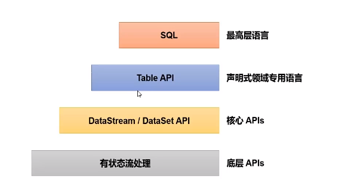

## 概述

**流处理和批处理**

当前大多数企业都将数据处理分为两类：

- 事务处理：OLTP
- 分析处理：OLAP

对于大数据技术来说，主要面向的是分析处理，大数据技术可以为公司的业务运营提供参考意见，比如分析延迟发货原因、预测未来销量等。

大量的、多种类型的数据 ETL 进入到数据仓库后，就可以对数据进行查询。

在之前的技术中，无论是 MapReduce 还是 Spark，其实都是对数据的批处理计算，简单来说就是将大量的数据集合到一起，然后算一段时间，这个时间几小时、几天甚至都是有可能的。

批处理有好处，但是也有它的局限性，在日常生活中，数据其实是源源不断地产生的，所以在实际的生活中，往往产生的是无限的事件流（无界流）。那样的话，批处理难免就会出现滞后性。

这样，传统的架构难免就力不从心，即使是 Spark Streaming，其实也是攒批处理，只不过批次很小，所以叫做微批次。这是架构设计上的硬伤，毕竟 Spark 本质上是为批计算产生的。

假如我们想要处理无限的数据流，并且不愿每次收到一个事件就记录一次，那么我们的应用程序应该是有状态的，也就是说可以存储和访问中间的数据，我们叫做有状态的流式处理。


我们可以看到上图的架构，黄色的圆圈代表原始的事件，经过 `Application Logic` 进行处理，其中产生的红色方块数据（状态）存到本地的变量中，可以是本地内存、磁盘、数据库等。

经过处理之后的绿色三角形数据继续向下游发送，可能还会有其他的处理要进行。

其实这就是 Flink 的流式处理架构，我们可以看到比较有意思的事情，就是事件完全是按照先后顺序排列处理的，所以不管是发生故障还是其他原因，我们都可以在检查点恢复状态，这样就可以恢复整个应用。

**Flink 概述**

[Apache Flink](https://flink.apache.org/)，一个框架、分布式处理引擎，用于对无界流和有界流进行状态运算。

对于 Flink 来讲，Flink 的延迟极低，吞吐量大，结果准确、容错性高（精准一次），支持多种存储系统，高可用。

对于 Flink 来说，它是事件驱动的，也就是来一个事件计算一次。并且是基于流的世界观，离线数据是有界限的流，实时数据是无界限的流。

对于 Flink 来说，API 是分层的，越是顶层的 API 越抽象，表达越简单，使用越方便。越底层表达能力越强，使用越灵活。

Flink 和 Spark 是不同的：

- Spark 采用 RDD 的架构，Spark Streaming 其实本质上也是攒批操作。Flink 是数据流和事件 Event 序列。
- Spark 是批处理，将 DAG 划分为一个个 Stage，每个 Stage 完成之后才可以算下一个 Stage。Flink 是标准的流执行模式，一个事件在一个节点处理完成之后就可以直接发送到下一个节点。

**分层 API**



Flink 进行了 API 的分层，可以看到，从上到下分别对应着各种的语言。

越往上面表达越简单，使用越方便，但是对于一些需求可能不太好实现。越往下面表达越具体，表达能力越丰富，可以实现一些复杂的需求。

最上层的是 SQL，SQL 是基于表的，所以 SQL 和 Table API 基本上是密不可分的，但是事实上 SQL 和 Table API 有一些内容还是有些欠缺的，在不断发展。

DataStream API 是核心 API，用于进行流处理，可以应用于大部分的场景。DataSet API 是用于进行批处理，但是现在已经很少用了（DataStream API 已经实现了流批一体）。

有状态的流处理是最底层的 API，理论上可以做任何事情（包括状态管理、时间计算等）。

## Flink 运行架构基础

**组件、任务提交流程**

Flink 包含四个不同组件：

- 作业管理器 JobManager：控制一个应用程序执行的主进程，每个应用程序都会被一个不同的作业管理器控制。

    作业管理器会接受到作业图 JobGraph、逻辑数据流图 LogicalDataFlowGraph、jar 包。

    JobManager 会将 JobGraph 转为物理的数据流图：执行图 ExecutionGraph，包含了所有可以并发执行的任务。

    JobManager 会向 ResourceManager 申请资源（TaskManager 上的 slot），获取资源之后会发送到负责运行的 TaskManager 上运行。

    JobManager 还会负责协调，例如检查点 checkpoint 的协调。

- 资源管理器 ResourceManager：管理 TaskManager 的 slot。

    JobManager 申请资源时，ResourceManager 会将有空闲 slot 的 TaskManager 分给 JobManager。

    假如没有足够资源，它会向资源提供平台（例如 Yarn）发起会话，以启动新的 TaskManager 的容器。

    ResourceManager 还负责资源的回收。

- 任务管理器 TaskManager：工作进程。

    一般来说，Flink 中有多个 TaskManager，每个 TaskManager 都是一个 JVM 进程。

    每个 TaskManager 上都含有一定数量（至少一个）的插槽 slot，每个 slot 都会启动一个线程，slot 的数量决定了它能够执行的任务数量。

    启动之后，TaskManager 会向 ResourceManager 注册插槽，收到 ResourceManager 的指令后，就会提供给 JobManager 调用。

    JobManager 会向 slot 分配任务 task 执行。

    在默认情况下，Flink 允许子任务共享 slot，这样的结果是，一个 slot 可以保存作业的整个管道。

- 分发器 Dispatcher：跨作业运行，提交了 REST 接口，可以作为集群的 HTTP 入口。

    分发器也会提供一个 Web UI 来展示和监控作业运行情况。Dispatcher 在架构中可能不是必须的，取决于作业提交的方式。


**数据流**

所有的 Flink 程序都是由三部分组成的：Source、Transformation 和 Sink。Source 负责读取数据源，Transformation 利用各种算子进行处理加工，Sink 负责输出。

**并行度**

一个特定算子的子任务 subtask 的个数叫做并行度 parallelism。一个程序中，不同的算子可能有不同的并行度。一般情况下，一个流的并行度就是这个流的算子中的最大并行度。


看上图中，每个任务节点中右下角的数字，代表并行度。例如 A 的并行度是 4，所以在右边的图中每一个 slot 中都有一个 A，同样的，B 也是每个 slot 中都有一个。

但是 C 不同，C 的并行度只有 2，所以它在右图中只有两个。D 又是 4，所以 D 在右图中每个 slot 都有。

重点来了：对于 A -> B，B -> D 来说，每个 slot 都有，这就代表数据的交换不需要跨 slot；但是对于 C -> D 来说，C 不是每个 slot 都有，所以在交换数据时需要跨 slot。

那么这就是 Flink 的任务链，在满足两个或者多个算子并行度相同、并且通过本地转发（local forward）的方式链接时，就会减少本地通信产生的开销。

## 起步

### DataSet API（将要弃用）

1. 搭建环境

    ```xml
    <properties>
        <flink.version>1.13.0</flink.version>
        <scala.binary.version>2.12</scala.binary.version>
        <slfj.version>1.7.30</slfj.version>
    </properties>

    <dependencies>
        <dependency>
            <groupId>org.apache.flink</groupId>
            <artifactId>flink-java</artifactId>
            <version>${flink.version}</version>
        </dependency>
        <dependency>
            <groupId>org.apache.flink</groupId>
            <artifactId>flink-streaming-java_${scala.binary.version}</artifactId>
            <version>${flink.version}</version>
        </dependency>
        <dependency>
            <groupId>org.apache.flink</groupId>
            <artifactId>flink-clients_${scala.binary.version}</artifactId>
            <version>${flink.version}</version>
        </dependency>
    </dependencies>

    <build>
        <plugins>
            <plugin>
                <artifactId>maven-assembly-plugin</artifactId>
                <configuration>
                    <descriptorRefs>
                        <descriptorRef>jar-with-dependencies</descriptorRef>
                    </descriptorRefs>
                </configuration>
                <executions>
                    <execution>
                        <id>make-assembly</id>
                        <phase>package</phase>
                        <goals>
                            <goal>single</goal>
                        </goals>
                    </execution>
                </executions>
            </plugin>
        </plugins>
    </build>
    ```

1. WordCount 程序：

    ```java
    // 1. 环境构建
    ExecutionEnvironment env = ExecutionEnvironment.getExecutionEnvironment();
    // 2. 读取数据源
    DataSource<String> source = env.readTextFile("input/words.txt");
    // 3. 要进行 word count，那么就先转为 (word, count) 的二元组，这个 Tuple 是 flink java 的，不是 scala 的
    FlatMapOperator<String, Tuple2<String, Long>> wordsForTuple = source.flatMap(new FlatMapFunction<String, Tuple2<String, Long>>() {
          // 在 flink 中，返回的是一个 Collector，泛型是我们需要返回的类型
          @Override
          public void flatMap(String line, Collector<Tuple2<String, Long>> out) throws Exception {
            String[] words = line.split(" ");
            for (String word : words) {
              // 这里使用的是 collect 的方式进行返回，而不是直接使用 return 的方式，每进行一次 collect 就相当于返回一次
              out.collect(Tuple2.of(word, 1L));
            }
          }
        })
        // 4. 因为 Java 的函数式编程是之后新加的特性，所以为了避免类型擦除的问题，需要显示再指定一次类型
        .returns(Types.TUPLE(Types.STRING, Types.LONG));
    // 5. 将 words 进行分组，在 flink 中，groupBy 可以直接指定索引来进行分组，以实现 spark 中 groupByKey 的操作
    UnsortedGrouping<Tuple2<String, Long>> wordsForGroup = wordsForTuple.groupBy(0);
    // 6. 组内聚合，这个 1 也是索引的位置，而不是进行聚合的数字
    AggregateOperator<Tuple2<String, Long>> sum = wordsForGroup.sum(1);
    // 7. 打印输出
    sum.print();
    ```

    以上的这套 API 归根结底都是继承自 DataSet，所以这套 API 也叫做 DataSet API。这套 API 在以前是来做批处理的基本操作，假如做流处理就需要继承 DataStream 的那一套 API 了。

    官方认为这个不够统一，所以之后我们统一使用的就都是 DataStream API 来做流批一体，这套 DataSet API 就成为历史。

### DataStream API（流处理）

对于流处理而言，有两种类型：有界流、无界流。

有界流就是我们通常进行批处理的数据，也就是这些数据的数量已经固定了。无界流就是说数据可能会随时进行增加的数据。

#### 有界流

有界流的 WordCount：

```java
// 1. 使用流的执行环境
StreamExecutionEnvironment env = StreamExecutionEnvironment.getExecutionEnvironment();
// 2. 读取文件，这里给到的 source 是 DataStream Source
DataStreamSource<String> dsSource = env.readTextFile("input/words.txt");
// 3. 这个过程和之前批处理的流程是一样的，为了方便，就直接将 new FlatMapFunction 省掉了
SingleOutputStreamOperator<Tuple2<String, Long>> wordsForTuple = dsSource.flatMap((FlatMapFunction<String, Tuple2<String, Long>>) (line, out) -> {
        String[] words = line.split(" ");
        for (String word : words) {
        out.collect(Tuple2.of(word, 1L));
        }
    })
    .returns(Types.TUPLE(Types.STRING, Types.LONG));
// 4. groupBy 变为了 keyBy，使用更加简单了
KeyedStream<Tuple2<String, Long>, String> keyedStream = wordsForTuple.keyBy(data -> data.f0);
// 5. 指定索引位置，进行聚合
SingleOutputStreamOperator<Tuple2<String, Long>> sum = keyedStream.sum(1);
// 6. 输出
sum.print();
// 7. 执行，在流处理中，上面只是定义了每一步的逻辑，真正执行是在这里
env.execute();
```

看一下有界流的输出：

```
7> (WORLD,1)
12> (FLINK,1)
11> (HELLO,1)
11> (HELLO,2)
```

因为流处理的逻辑，数据是一个一个过来的，所以也需要一条一条进行统计，最后的结果是一样的，但是中间的执行过程有很大不同。

并且我们可以看到，字母的输出顺序是不同的（分布式的执行程序，在本地就是多线程模拟）。

前面的尖括号代表的是本地的一个线程来进行执行的，那么对应集群环境，就是一个任务槽（之后会讲）执行。

最前面的数字代表的是本地并行子任务的编号，并行子任务由并行度来决定，因为我们在代码中没有设置并行度，所以并行度默认是本地的 CPU 个数。

并且还有一个规律，例如 HELLO，他的并行子任务编号都是 11，这就代表着 HELLO 这个字母全都分给了 11 这个任务。这也比较好理解，因为是做聚合操作，那么肯定要将相同的字母放到一个并行子任务上。

#### 无界流

在真实场景中，数据往往是无限的，所以文件就不要用了，直接使用监听端口来聚合消息，首先进行 `nc -lk 7777`，然后启动如下代码：

```java
StreamExecutionEnvironment env = StreamExecutionEnvironment.getExecutionEnvironment();
// 监听端口，之后的逻辑和之前完全一样
DataStreamSource<String> dsSource = env.socketTextStream("localhost", 7777);
SingleOutputStreamOperator<Tuple2<String, Long>> wordsForTuple = dsSource.flatMap((FlatMapFunction<String, Tuple2<String, Long>>) (line, out) -> {
        String[] words = line.split(" ");
        for (String word : words) {
        out.collect(Tuple2.of(word, 1L));
        }
    })
    .returns(Types.TUPLE(Types.STRING, Types.LONG));
KeyedStream<Tuple2<String, Long>, String> keyedStream = wordsForTuple.keyBy(data -> data.f0);
SingleOutputStreamOperator<Tuple2<String, Long>> sum = keyedStream.sum(1);
sum.print();
env.execute();
```

在端口中输入字母，在程序中会逐渐累加输出。

### Flink 部署

实际意义上，我们应该真正启动一个集群，然后启动。之前我们已经介绍过了 JobManager、TaskManager，其实还有一个 Client 客户端。

Client 的作用就是将代码转为 Job，交给 JobManager，JobManager 会进一步转换为 Task 最终分发给各个 TaskManager（其实就是 worker），然后 TaskManager 去干活。

Flink 是比较灵活的，在实际场景中用不到 ResourceManager 这个组件，而是直接和一些资源平台做集成，比如 Yarn。

集群部署有几种模式：

- 会话模式：最符合常规思维的模式，就是先启动集群，然后一直保持运行状态，其中集群资源多少已经固定好了，作业竞争资源，竞争失败就失败。
- 单作业模式：将资源按照作业隔离，来一个作业就单独为这个作业创建一个 Flink 集群。适合资源需要大、时间长的作业。必须要结合资源管理平台。
- 应用模式：前两者都是先将作业在客户端上进行代码解析，然后拆成几个作业，之后交给 job manager 跑。应用模式是直接交给 job manager，代码解析都交给 job manager。

#### 本地启动

本地启动就是不搭建集群，直接启动一个单机程序。

直接解压，然后使用 `bin/start-cluster.sh` 直接启动。

启动起来使用 jps 查看，可以看到：

- StandaloneSessionClusterEntrypoint: 独立会话的入口
- TaskManagerRunner: 运行 task 的节点。

也就是说，在独立会话状态下，本机既是 JobManager，也是 TaskManager。

关闭也十分简单，直接使用 `bin/stop-cluster.sh` 关闭。

启动起来之后，进入端口 `8081` 就可以查看到 WEB 页面了。

#### 集群配置

::: tip
TODO
:::

#### 打包部署

1. WEB UI

    因为有了打包插件，所以打包之后会有两个 jar，其中一个是 `with-dependencies.jar`，这个 jar 是带有 flink 依赖的 jar，我们不需要，直接上传另一个 jar（在 submit new job 页面中）。

    上传之后，指定入口类（`com.causes.WordCount`），并且可以指定并行度，给 args，save point path（保存点）。

    还有一个按钮是 show plan，是执行的流程。

    我们提交，之后假如出错可到 job manager、task manager 中查看日志和输出。

    想要取消执行只需要按下 cancel job 按钮。

1. 命令行

    提交：`bin/flink run -m [Job Manager 主机:端口] -c [入口类] -p [并行度] [jar]`

    取消：`bin/flink cancel [job id]`

注意，我们的 task 都会占用一个 task slot，假如 slot 不足就会直接报错 `Could not acquire the minimum required resources`，因为获取不到最小需要的资源。

#### Yarn 

Flink 部署应该和不同的资源管理平台进行集成，我们其实不希望 slot 不足就报错的情况，所以需要资源管理平台。

::: tip
TODO
:::