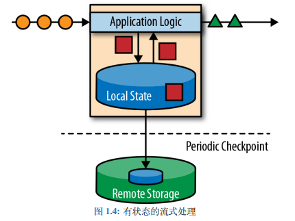
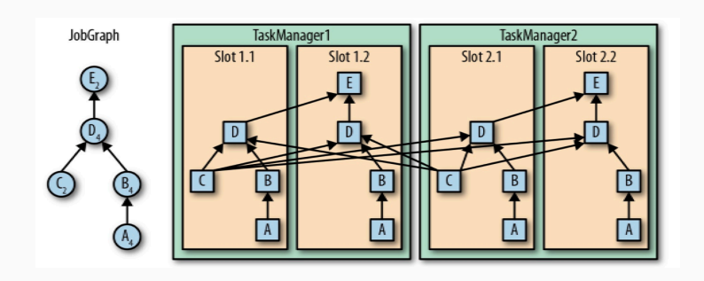

## 概述

**流处理和批处理**

当前大多数企业都将数据处理分为两类：

- 事务处理：OLTP
- 分析处理：OLAP

对于大数据技术来说，主要面向的是分析处理，大数据技术可以为公司的业务运营提供参考意见，比如分析延迟发货原因、预测未来销量等。

大量的、多种类型的数据 ETL 进入到数据仓库后，就可以对数据进行查询。

在之前的技术中，无论是 MapReduce 还是 Spark，其实都是对数据的批处理计算，简单来说就是将大量的数据集合到一起，然后算一段时间，这个时间几小时、几天甚至都是有可能的。

批处理有好处，但是也有它的局限性，在日常生活中，数据其实是源源不断地产生的，所以在实际的生活中，往往产生的是无限的事件流（无界流）。那样的话，批处理难免就会出现滞后性。

这样，传统的架构难免就力不从心，即使是 Spark Streaming，其实也是攒批处理，只不过批次很小，所以叫做微批次。这是架构设计上的硬伤，毕竟 Spark 本质上是为批计算产生的。

假如我们想要处理无限的数据流，并且不愿每次收到一个事件就记录一次，那么我们的应用程序应该是有状态的，也就是说可以存储和访问中间的数据，我们叫做有状态的流式处理。



我们可以看到上图的架构，黄色的圆圈代表原始的事件，经过 `Application Logic` 进行处理，其中产生的红色方块数据（状态）存到本地的变量中，可以是本地内存、磁盘、数据库等。

经过处理之后的绿色三角形数据继续向下游发送，可能还会有其他的处理要进行。

其实这就是 Flink 的流式处理架构，我们可以看到比较有意思的事情，就是事件完全是按照先后顺序排列处理的，所以不管是发生故障还是其他原因，我们都可以在检查点恢复状态，这样就可以恢复整个应用。

**Flink 概述**

[Apache Flink](https://flink.apache.org/)，一个框架、分布式处理引擎，用于对无界流和有界流进行状态运算。

对于 Flink 来讲，Flink 的延迟极低，吞吐量大，结果准确、容错性高（精准一次），支持多种存储系统，高可用。

对于 Flink 来说，它是事件驱动的，也就是来一个事件计算一次。并且是基于流的世界观，离线数据是有界限的流，实时数据是无界限的流。

对于 Flink 来说，API 是分层的，越是顶层的 API 越抽象，表达越简单，使用越方便。越底层表达能力越强，使用越灵活。

Flink 和 Spark 是不同的：

- Spark 采用 RDD 的架构，Spark Streaming 其实本质上也是攒批操作。Flink 是数据流和事件 Event 序列。
- Spark 是批处理，将 DAG 划分为一个个 Stage，每个 Stage 完成之后才可以算下一个 Stage。Flink 是标准的流执行模式，一个事件在一个节点处理完成之后就可以直接发送到下一个节点。

## Flink 运行架构基础

**组件、任务提交流程**

Flink 包含四个不同组件：

- 作业管理器 JobManager：控制一个应用程序执行的主进程，每个应用程序都会被一个不同的作业管理器控制。

    作业管理器会接受到作业图 JobGraph、逻辑数据流图 LogicalDataFlowGraph、jar 包。

    JobManager 会将 JobGraph 转为物理的数据流图：执行图 ExecutionGraph，包含了所有可以并发执行的任务。

    JobManager 会向 ResourceManager 申请资源（TaskManager 上的 slot），获取资源之后会发送到负责运行的 TaskManager 上运行。

    JobManager 还会负责协调，例如检查点 checkpoint 的协调。

- 资源管理器 ResourceManager：管理 TaskManager 的 slot。

    JobManager 申请资源时，ResourceManager 会将有空闲 slot 的 TaskManager 分给 JobManager。

    假如没有足够资源，它会向资源提供平台（例如 Yarn）发起会话，以启动新的 TaskManager 的容器。

    ResourceManager 还负责资源的回收。

- 任务管理器 TaskManager：工作进程。

    一般来说，Flink 中有多个 TaskManager，每个 TaskManager 都是一个 JVM 进程。

    每个 TaskManager 上都含有一定数量（至少一个）的插槽 slot，每个 slot 都会启动一个线程，slot 的数量决定了它能够执行的任务数量。

    启动之后，TaskManager 会向 ResourceManager 注册插槽，收到 ResourceManager 的指令后，就会提供给 JobManager 调用。

    JobManager 会向 slot 分配任务 task 执行。

    在默认情况下，Flink 允许子任务共享 slot，这样的结果是，一个 slot 可以保存作业的整个管道。

- 分发器 Dispatcher：跨作业运行，提交了 REST 接口，可以作为集群的 HTTP 入口。

    分发器也会提供一个 Web UI 来展示和监控作业运行情况。Dispatcher 在架构中可能不是必须的，取决于作业提交的方式。


**数据流**

所有的 Flink 程序都是由三部分组成的：Source、Transformation 和 Sink。Source 负责读取数据源，Transformation 利用各种算子进行处理加工，Sink 负责输出。

**并行度**

一个特定算子的子任务 subtask 的个数叫做并行度 parallelism。一个程序中，不同的算子可能有不同的并行度。一般情况下，一个流的并行度就是这个流的算子中的最大并行度。



看上图中，每个任务节点中右下角的数字，代表并行度。例如 A 的并行度是 4，所以在右边的图中每一个 slot 中都有一个 A，同样的，B 也是每个 slot 中都有一个。

但是 C 不同，C 的并行度只有 2，所以它在右图中只有两个。D 又是 4，所以 D 在右图中每个 slot 都有。

重点来了：对于 A -> B，B -> D 来说，每个 slot 都有，这就代表数据的交换不需要跨 slot；但是对于 C -> D 来说，C 不是每个 slot 都有，所以在交换数据时需要跨 slot。

那么这就是 Flink 的任务链，在满足两个或者多个算子并行度相同、并且通过本地转发（local forward）的方式链接时，就会减少本地通信产生的开销。

## 起步

**WordCount**

1. 搭建环境

    ```xml
    <properties>
        <flink.version>1.13.0</flink.version>
        <scala.binary.version>2.12</scala.binary.version>
        <slfj.version>1.7.30</slfj.version>
    </properties>

    <dependencies>
        <dependency>
            <groupId>org.apache.flink</groupId>
            <artifactId>flink-java</artifactId>
            <version>${flink.version}</version>
        </dependency>
        <dependency>
            <groupId>org.apache.flink</groupId>
            <artifactId>flink-streaming-java_${scala.binary.version}</artifactId>
            <version>${flink.version}</version>
        </dependency>
        <dependency>
            <groupId>org.apache.flink</groupId>
            <artifactId>flink-clients_${scala.binary.version}</artifactId>
            <version>${flink.version}</version>
        </dependency>
    </dependencies>
    ```

1. WordCount 程序：

    ```java
    public class WordCount {
        public static void main(String[] args) throws Exception {
            StreamExecutionEnvironment env = StreamExecutionEnvironment.getExecutionEnvironment();
            // 给程序整体设置并行度，这里的设置的优先级要高于配置
            env.setParallelism(1);
            DataStreamSource<String> stream = env.fromElements("HELLO WORLD", "HELLO WORLD");
            stream
                .flatMap(new FlatMapFunction<String, Tuple2<String, Integer>>() {
                @Override
                public void flatMap(String value, Collector<Tuple2<String, Integer>> out) throws Exception {
                    String[] arr = value.split("\\s");
                    Arrays.stream(arr).forEach(s -> out.collect(Tuple2.of(s, 1)));
                }
                })
                // 类似 groupBy，按照 f0 分组
                .keyBy(r -> r.f0)
                .sum(1)
                .print();
            // 程序执行
            env.execute();
        }
    }
    ```

## Flink DataStream API

接下来的内容是大量的 API 操作，需要大量的练习使用

### 读取数据源

**准备基础类**

```java
@Data
@NoArgsConstructor
@AllArgsConstructor
public class UserBehavior {

  private String userId;
  private String itemId;
  private String categoryId;
  private String behaviorType;
  private Long timeStamp;
}
```

**从集合中读取**

```java
StreamExecutionEnvironment env = StreamExecutionEnvironment.getExecutionEnvironment();
env.setParallelism(1);

// 1. 接收一个可变长数组，直接取得数据
env.fromElements(
    new UserBehavior("543462", "1715", "1464116", "pv", 1511658000 * 1000L),
    new UserBehavior("662867", "2244074", "1575622", "pv", 1511658000 * 1000L)
);

// 2. 通过集合取得数据
List<UserBehavior> userBehaviors = new ArrayList<>();
userBehaviors.add(new UserBehavior("543462", "1715", "1464116", "pv", 1511658000 * 1000L));
userBehaviors.add(new UserBehavior("662867", "2244074", "1575622", "pv", 1511658000 * 1000L));
env.fromCollection(userBehaviors);

env.execute();
```

**从文件中读取**

```java
StreamExecutionEnvironment env = StreamExecutionEnvironment.getExecutionEnvironment();
env.setParallelism(1);

env.readTextFile("/tmp/userBehavior.csv");

env.execute();
```

**从 Socket 中读取**

```java
StreamExecutionEnvironment env = StreamExecutionEnvironment.getExecutionEnvironment();
env.setParallelism(1);

env.socketTextStream(host, port);

env.execute();
```

**从 Kafaka 中读取**

::: tip
待补充
:::

**自定义数据源读取**

::: tip
待补充
:::

### 基本算子

基本算子：对每个单独的事件做处理，每个输入都会产生一个输出。包括转换、数据分割、过滤等。

```java
StreamExecutionEnvironment env = StreamExecutionEnvironment.getExecutionEnvironment();
env.setParallelism(1);

List<UserBehavior> userBehaviors = new ArrayList<>();
userBehaviors.add(new UserBehavior("543462", "1715", "1464116", "pv", 1511658000 * 1000L));
userBehaviors.add(new UserBehavior("662867", "2244074", "1575622", "click", 1511658000 * 1000L));

DataStreamSource<UserBehavior> stream = env.fromCollection(userBehaviors);

// 1. map
stream.map(UserBehavior::getItemId);

// 2. filter
stream.filter(userBehavior -> "pv".equalsIgnoreCase(userBehavior.getBehaviorType()));

// 3. flatMap 就不用解释作用了，这里注意，我们是可以在 flatMap 中向下游发送多次的内容的。并且在转换之后，还需要指定一下流的种类
stream
    .map(UserBehavior::getBehaviorType)
    .flatMap((FlatMapFunction<String, String>) (s, out) -> {
      if ("pv".equals(s)) {
        out.collect(s);
      } else {
        out.collect(s);
        out.collect(s);
      }
    })
    .returns(Types.STRING)
    .print();

env.execute();
```

### 键控流转换算子

简单来说，就是对数据进行分组。DataStream API 提供了一个叫做 KeyedStream 的抽象，这个抽象会从逻辑上对数据流进行分区，分区后的数据具有相同的 key。不同分区的流互不相关。

接下来也有基于 key 的操作：滚动聚合、reduce。

```java
StreamExecutionEnvironment env = StreamExecutionEnvironment.getExecutionEnvironment();
env.setParallelism(1);

// 准备一组 Tuple3，进行分流和做计算
DataStreamSource<Tuple3<Integer, Integer, Integer>> stream = env.fromElements(
    Tuple3.of(1, 2, 2),
    Tuple3.of(2, 3, 1),
    Tuple3.of(2, 2, 4),
    Tuple3.of(1, 5, 3)
);

/*
  对第一个字段进行分流。很多 API 都是 groupBy，不过在 Flink 中使用 keyBey 是分流。

  滚动聚合方法：

  - sum()：在输入流上滚动相加，可以输入值的索引来针对某个位置做计算
  - min()：求输入流上的最小值
  - max()：求输入流上的最大值
  - minBy()：再输入流上针对某字段求最小值，并返回包含最小值的事件
  - maxBy()：类似 minBy()，不过是求最大值

  虽然流是针对第一个字段进行分流的，但是计算是根据第二个字段做计算：

  1. 分流，形成两个流 [(1, 2, 2)、(1, 5, 3)]、[(2, 3, 1)、(2, 2, 4)]
  2. 每组中分别做计算 [(1, 2, 2)、(1, 7, 2)]、[(2, 3, 1)、(2, 5, 1)]

  从结果中可以看出以下事情：

  1. 流处理的意思就是每个事件都会处理，所以在进行 print() 时，每组中的第一个元素都会打印。
  2. 对于每组来说，都会基于第一个作为基础，然后按照指定字段进行累加。
*/
stream.keyBy(0).sum(1).print();

/*
  第二种方式来分流，其实作用都是一样的，写法不同而已，真实中这样的方式更常用

  reduce 是滚动聚合的泛化实现，它不会改变流的事件类型，需要你自己去实现内容，我们会求每组中，第二个值的最大值
*/
stream
    .keyBy(r -> r.f0)
    .reduce((ReduceFunction<Tuple3<Integer, Integer, Integer>>) (in, out) -> in.f1 > out.f1 ? in : out)
    .print();

env.execute();
```

### 分布式转换算子

有时候，我们需要在应用程序的层面控制分区策略，或者做自定义分区策略（例如负载均衡、解决数据倾斜等），又或者需要数据拆分并行计算等，我们可以使用 DataStream 的一些方法自定义分区策略。

注意，这个分区和 `keyBy` 有本质的不同，`keyBy` 产生的是 `KeyedStream`，而自定义的分区策略产生的是 `DataStream`。

**Random**

随机数据交换，由 `DataStream.shuffle()` 方法实现，shuffle 方法将数据随机地分配到下游算子中的并行任务中去。

**Round-Robin**

`rebalance()` 方法使用的是轮询的方式负载均衡，它会将数据流平均分配到之后的所有并行任务中。

`rescale()` 也是 Round-Robin 方式，不过它会将数据平均分配到一部分的任务中

两者的区别：是在于任务之间连接机制不同，rebalance 会针对所有的任务发送者和接受者建立通道，但是 rescale 只会在这个任务的下游中建立通道。


**Broadcast**

`broadcast()`，类似 Spark 的广播变量，会将数据复制并发送到下游所有算子的并行任务中。

**Global**

`global()` 将所有的输入流数据都发送到下游算子的第一个并行任务中去，这个操作会将所有数据发送到同一个 task，所以需要谨慎。

**Custom**

可以使用 `partitionCustom()` 自定义分区策略，此方法接受一个 `Partitioner` 对象，这个对象需要实现分区逻辑以及定义针对流的哪一个字段或者 key 来分区。

**设置并行度**

一个算子并行任务的个数叫做并行度。在 Flink 中可以设置并行度，每个算子的并行任务都会处理这个算子的输入流的一份子集。

假如我们在本地运行，并行度将被设置为 CPU 的核数，假如将应用程序提交到 Flink 集群中，并行度将被设置为集群的默认并行度（除非在提交时，在客户端显示设置并行度）。

设置某个算子的并行度优先级 > 代码中总体设置的并行度优先级 > 环境中的并行度。

并行度是一个动态的概念，插槽数量是一个静态的概念，并行度 <= 插槽数量。一个任务槽最多运行一个并行度。这也就意味着，当任务槽数量 < 并行度时，任务将无法运行。

### Flink 类型系统

Flink 支持 Java 所有普通数据类型，并且还包含专门为 Java 实现的元组 Tuple，支持 Pojo 类。

**Tuple**

Tuple 是强类型，根据元素数量的不同被实现了不同的类，从 Tuple1 一直到 Tuple25。

Tuple 可以通过下标访问，下标从 0 开始，访问时使用 `tuple.f0` 或者 `tuple.getField(0)` 获取元素。

Tuple 是可变数据结构，所以 Tuple 中的元素可以重新赋值，重复利用 Tuple 可以减轻 GC 压力。

```java
Tuple2<String, Integer> tuple = Tuple2.of("causes", 23);
System.out.println(tuple.f0);
System.out.println((String) tuple.getField(0));
// 设置索引为 0 的位置的数值
tuple.setField(23, 0);
```

**Pojo**

在 Java 中，类型信息是 `org.apache.flink.api.common.typeinfo.Types`，例如 `Types.INT`、`Types.POJO(UserBehavior.class);`。

**Lambda 表达式**

Java 支持 Lambda 表达式，但是需要注意一个点：Java 编译器在 lambda 表达式的推断类型信息时，在编译一些信息时可能会出现错误，例如 `flatMap`、`map` 等需要泛型的算子。

在使用一个 `flatMapFunction` 时，本来是 `void flatMap(IN value, Collector<OUT> out)`，但是 Java 会编译为 `void flatMap(IN value, Collector out)`

如此一来，Flink 就无法自动推断输出的类型信息，在这种情况下，我们需要手动指定类型信息，否则会被视为 Object，这会导致低效的序列化，甚至可能会报错。

一般来说，这种类型被擦除的问题可以有两种方式解决：

1. 手动指定类型信息。
1. 使用类来代替。

```java
StreamExecutionEnvironment env = StreamExecutionEnvironment.getExecutionEnvironment();
env.setParallelism(1);

env
    .fromElements(1, 2, 3)
    .flatMap((FlatMapFunction<Integer, Integer>) (num, out) -> {
      out.collect(num);
    })
    // 1. 手动指定类型信息
    .returns(Types.INT)
    .print();

env
    .fromElements(1, 2, 3)
    // 2. 使用类 / 匿名类直接代替
    .flatMap(new FlatMapFunction<Integer, Integer>() {
      @Override
      public void flatMap(Integer num, Collector<Integer> out) throws Exception {
        out.collect(num);
      }
    })
    .print();

env.execute();
```

### 富函数

富函数就是普通函数的升级版本，它可以提供 `open` 和 `close` 方法，用于在执行真正的函数之前和之后做一些其他操作。

提供了 `getRuntimeContext()` 提供了函数的 `RuntimeContext` 的一些信息，例如并行度，当前子任务的索引，子任务的名字，同时包含了访问分区状态的方法。

基本上每个常规函数都有富函数版本，只要在函数前面加上 `Rich` 就是富函数，例如 `RichMapFunction`、`RichFlatMapFunction` 等。

```java
new RichFlatMapFunction<Integer, Integer>() {
    @Override
    public void open(Configuration parameters) throws Exception {
    super.open(parameters);
    }

    @Override
    public RuntimeContext getRuntimeContext() {
    return super.getRuntimeContext();
    }

    @Override
    public void flatMap(Integer integer, Collector<Integer> collector) throws Exception {

    }

    @Override
    public void close() throws Exception {
    super.close();
    }
};
```

```java
StreamExecutionEnvironment env = StreamExecutionEnvironment.getExecutionEnvironment();
env.setParallelism(1);

env
    .fromElements(1, 2, 3)
    .map(new RichMapFunction<Integer, Integer>() {
      @Override
      public Integer map(Integer value) throws Exception {
        return value * 2;
      }
    })
    .print();

env.execute();
```

### 写入下游设备

::: tip
TODO
:::
