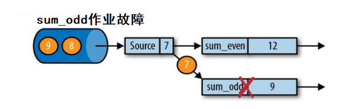
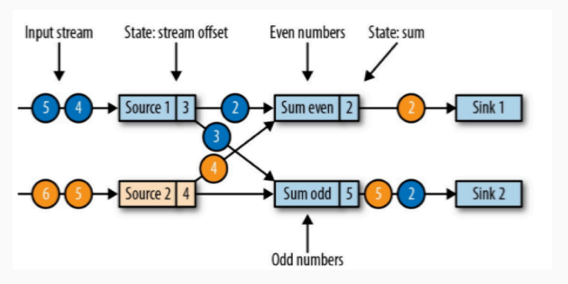
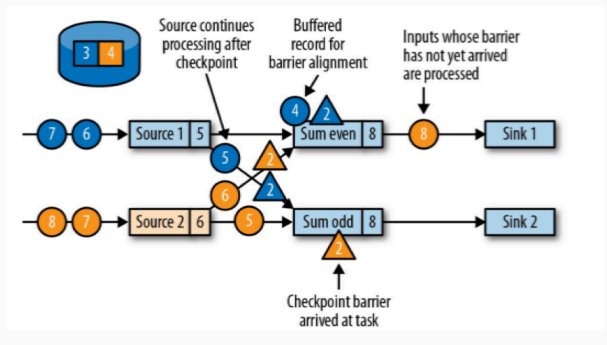

## Flink 中的状态管理

Flink 是有状态的流式计算。状态可以理解为是一个本地变量，隔一段时间保存到文件系统上，用于宕机后恢复程序，状态变量可以被任务的业务逻辑访问。

总体来说，Flink 中的状态有两种：

- 算子状态（Operator State）：算子状态的作用范围限定为算子任务。
- 键控状态（Keyed State）：根据输入数据流中定义的 key 来维护和访问。

之前我们大部分时间用的都是键控状态（ValueState、MapState、ListState 等），没用过算子状态。

那么算子状态和键控状态和监控状态的区别就是：键控状态可见范围是当前 key，算子状态的可见状态是当前任务槽。

**状态后端**

状态后端是一个可插入的组件，用于本地的状态管理（内存），将状态写入到远程存储（磁盘、文件系统）。

状态后端有几种：

1. `MemoryStateBackend`

    内存级状态后端，默认的状态后端。会将键控状态作为内存中的对象管理，存在 TaskManager 的 JVM 上，检查点则存在 JobManager 的内存中。

    特点：快速、低延迟、不稳定。

1. `FsStateBackend`

    文件系统状态后端，可以选择本地文件系统和远程文件系统。本地状态处理和 `MemoryStateBackend` 相同，checkpoint 则放到文件系统。

1. `RocksDBStateBackend`

    所有状态均序列化，放到本地的 RocksDB。RocksDB 是一个硬盘的 KV 数据库。

修改状态后端：

```java
StreamExecutionEnvironment env = StreamExecutionEnvironment.getExecutionEnvironment();
env.setParallelism(1);

env.setStateBackend(new FsStateBackend("file:///home/user/Desktop"));

env.execute();
```

Flink 默认只保存最近一次的检查点。

## Flink 中的容错机制

Flink 中的容错机制主要有以下几点：

- 一致性检查点 checkpoint，从检查点恢复状态。
- Flink 检查点算法，chandy-lamport 的变种。
- 保存点 save point。

**一致性检查点 checkpoint**

一致性检查点其实可以看成一个快照，用于保存某个时间点的状态。

这个时间点应该是所有和上游打交道的、需要数据的任务都恰好处理完一个相同的输入数据的时候。


从上游（比如 kafka）中拿到的数据从 source 拿到，并且分发给两个算子，其中算子 `sum_event` 计算偶数求和，算子 `sum_odd` 计算奇数求和。上游数据向 flink 发送 `1、2、3、4、5、6、7、……` 数据。

在上图中，`source(5)` 代表的是偏移量，索引从 0 开始。

那么这表示算子已经处理完了 `1、2、3、4、5`，也就是 `sum_event` 已经处理了 `2 + 4`，`sum_odd` 已经处理了 `1 + 3 + 5`，并且对于 kafka 来讲，数据源 `source` 刚刚消费完偏移量为 5 的数据。

此时进行检查点保存，存储保存了 `5、6、9`，也就是将计算的结果和将要计算的数据的偏移量都保存了。

这个检查点之前已经说了，恰好处理完一个相同输入数据的时候。对于 flink 来讲，此时只有一个 `source` 来处理上游的输入数据，那么只要当 source 刚好消费完成之后但是还没来得及向下游的算子发送数据时，这个时候就是检查点。



此时一个算子发生了故障，看到上图中，算子 `sum_odd` 挂了，那么就需要从检查点恢复数据了。


恢复数据时，首先就是重启应用


重启应用之后，根据状态变量的名字来读取状态变量


读取完成状态变量之后，我们重新消费数据。这个重新消费数据需要注意，我们的上游必须要支持能够支持根据偏移量重新读取数据的操作（比如使用 kafka，可以支持），否则数据肯定会丢失（比如 socket）。

这种检查点的恢复和保存机制可以为程序提供精准一次（exactly-once）的特点，因为所有的算子都会保存检查点并恢复所有状态，所以针对所有的输入数据都会进行计算，并且只计算一次。

**检查点算法**

Flink 实现的检查点算法是异步的思想，是基于 Chandy-Lamport 算法的一种改变，它的思想是将保存和数据处理分离，不暂停整个应用。

Flink 的检查点算法用到了一种叫做检查点分界线（checkpoint barrier）的特殊数据形式，用于将一条流上数据按照不同检查点分开，也可以理解为是一种特殊的事件。

假如现在的任务中，有两个输入流，两个算子，两个 sink：



那么检查点的操作应该是这样的：

1. JobManager 会向每一个 Source 算子发送一个检查点的事件，检查点事件 ID 应该都是相同的（比如说检查点事件 ID 为 2），也就是下图中三角形的事件。

    

1. 检查点事件发送到了两个 Source 算子，两个 Source 算子将自己的状态交给状态后端用于保存 Source 算子当前的状态，保存状态之后，状态后端告诉 Source 算子，Source 算子再告诉 JobManager。
1. 确认两个 Source 的状态保存完成之后，分界线继续向下游发送，发送给两个 sum 算子。

    

    source 算子是两个，那么保存完成检查点之后，每一个 sum 算子都会复制一份自己的得到的分界线事件并广播到下游中，所以每一个下游的算子都会得到上游的每个 source 算子的检查点事件。

    我们以 sum event 算子为例子：

    当第一个 source 算子的检查点事件到达之后，此算子就会停止计算，继续等待其他的检查点事件算子到达（也就是上图中，属于 source2 的黄色的检查点和属于 source1 蓝色的检查点都到达）。

    第一个检查点算子算子到达之后，第二个检查点算子还没有到达这期间，即使有需要计算的数据到来，算子也只是将数据缓存下来不会进行计算。

    只有两个检查点算子都到达了，这个算子会进行状态保存，然后将检查点算子发送到下游，然后才会计算数据。

    那么 sum odd 算子也是相同的操作。

1. 两个计算算子完成了，那么继续向下游转发检查点分界线。到了 sink 算子，那么 sink 也会保存自己当前的状态。

    

    sink 算子处理完成之后，在这里也就是所有的任务都确认已经完成了状态保存。

    那么此次状态保存的操作就真正的完成了，Flink 会将这次的状态保存标志为完成态，在默认策略下，会替换掉上次的检查点，只留一个。

检查点是随着数据流动的，这也就说明，假如检查点之前的数据没有被算子处理完成，那么检查点就会卡在这个算子上，所以假如检查点迟迟完不成，那么就需要看一下到底是在哪一步被阻塞了。

**保存点 save point**

检查点是自动保存自动恢复，保存点是手动保存手动恢复，它底层算法和检查点是一样的。保存点可以用来做 AB 测试，看看两个程序哪个好使就用哪个。

## Flink 端到端一致性

一致性保证，有如下分类：

- 最多一次：AT_MOST_ONCE：任务故障时，什么也不做，也不重播丢失的数据，也不恢复状态，也就是最多处理一次事件。例如 UDP，不提供任何保障。
- 至少一次：AT_LEAST_ONCE：大多数场景中，我们不希望丢失任何事件。所有的事件都会得到处理，但是有可能会被处理多次。
- 精准一次：EXACTLY_ONCE：数据没有丢失，并且都进行了处理，并且恰好每个数据只处理了一次，是最理想的结果，也是最难实现的。

Flink 的容错机制保证的是 Flink 内部的一致性，那么端到端的一致性如何保证？因为在真实的场景中，除了 Flink 内部的一致性，还有上面的数据源（比如 Kafka、其他消息队列、文件等），以及下游的输出（Kafka、Redis、文件系统等）。

整个端到端的一致性保证最薄弱的点取决于所有组件一致性最弱的组件。那么要保证端到端的一致性，就必须要保证每一个组件都保证它自己的一致性。

在 Flink 中，和其他端对接时，内部保证的是检查点算法，Source 端需要的是可重设读取位置的数据（Kafka、文件系统等），sink 端提供的是不会重复写入外部系统的操作（幂等性写入、事务写入）。

上游设备我们只能尽可能选用可以重设读取位置的数据（比如 Kafka、文件系统），一旦选了不能重复的组件（比如 Socket），那么绝对不能重现数据了。

我们主要考虑是下游的对接：幂等性、事务写入。

**幂等写入**

幂等操作的意思是，一个操作可以重复很多次，但是只会更改一次数据。比如 map，无论输入几次数据，只会有一次更改数据；再比如 hash，也是输入相同输出相同。或者可以理解为，幂等性就是无状态的服务。

当数据写到一半程序宕机了，那么 Flink 会回退到上一个版本的检查点，也会重新给下游的 sink 之前的数据，这样会导致结果的回退。

所以幂等性写入可以保证 exactly once。

**事务写入**

Flink 的事务写入的实现思想是和检查点对应，当检查点完成的时候再将结果写入到 sink 中。

Flink 中的事务写入分两种：

1. 预写日志 Write Ahead Log，WAL：只能保证 at least once。

    将结果数据先保存到状态后端（这个不是检查点，是需要输出的数据），检查点完成之后会一下将结果放到 sink。

    其实本身它不是个事务，因为万一在输出到 sink 之后挂掉，结果就没了。

1. 两阶段提交 Two Phase Commit，2PC：可以保证 exactly once。

    对每一个检查点，下游设备都会开启一个事务（下游设备必须支持事务），Flink 将结果数据放到事务中，检查点完成之后给下游通知，此时下游的事务提交。

那么事务的两阶段提交可能会导致在事务提交之前看不到数据，只有事务写入之后才能看到数据。

2PC 对下游 sink 系统的要求：

1. 必须提供事务支持，或者可以模拟事务。
1. 在每个 checkpoint 间隔期间，必须能够开启一个事务并接受事务写入。
1. 在收到 checkpoing 完成的通知前，不能提交事务。假如 Flink 写入 sink 失败了（或者写入超时了），那么事务必须回滚，必须丢弃未提交的数据。
1. 在进程失败之后必须能够恢复事务。
1. 提交事务必须是幂等操作。

## Flink 连接器

### Kafka

1. 添加 flink-kafka 依赖

    ```xml
    <dependency>
        <groupId>org.apache.flink</groupId>
        <artifactId>flink-connector-kafka_2.12</artifactId>
        <version>1.13.0</version>
    </dependency>
    ```

    maven 中添加依赖需要有些注意事项，类似这种连接器一般放到后面（但是在日志之前），这个顺序有可能会影响程序执行。

1. kafka 写入

    ```java
    StreamExecutionEnvironment env = StreamExecutionEnvironment.getExecutionEnvironment();
    env.setParallelism(1);

    Properties props = new Properties();
    props.put("bootstrap.servers", "localhost:9092");

    // 读取 csv 文件写入到 kafka
    env
        .readTextFile("UserBehavior.csv")
        // 三个参数分别为：kafka 的 topic、数据类型（这里是 String）、配置文件
        .addSink(new FlinkKafkaProducer<String>(
            "user-behavior",
            new SimpleStringSchema(),
            props
        ));

    env.execute();
    ```

1. kafka 读取

    ```java
    StreamExecutionEnvironment env = StreamExecutionEnvironment.getExecutionEnvironment();
    env.setParallelism(1);

    Properties props = new Properties();
    props.setProperty("bootstrap.servers", "localhost:9092");
    // 消费者组
    props.setProperty("group.id", "consumer-group");
    // 从 kafka 读取的时候需要反序列化，这里用的类型就是字符串的反序列化
    props.setProperty("key.deserializer", "org.apache.kafka.common.serialization.StringDeserializer");
    props.setProperty("value.deserializer", "org.apache.kafka.common.serialization.StringDeserializer");
    // 重置 offset 到最后
    props.setProperty("auto.offset.reset", "latest");

    env.addSource(new FlinkKafkaConsumer<String>("user-behavior", new SimpleStringSchema(), props)).map(new MapFunction<String, UserBehavior>() {
      @Override
      public UserBehavior map(String s) throws Exception {
        String[] arr = s.split(",");
        return new UserBehavior(arr[0], arr[1], arr[2], arr[3], Long.parseLong(arr[4]) * 1000L);
      }
    });

    env.execute();
    ```

### Redis

1. 导入依赖

    ```xml
    <dependency>
        <groupId>org.apache.bahir</groupId>
        <artifactId>flink-connector-redis_2.11</artifactId>
        <version>1.0</version>
    </dependency>
    ```

    这个驱动比较诡异，他底层依赖的是 flink 1.2，并且到现在都没有更新。所以一定要将它放到依赖的最后面。

    Redis 虽然有持久化机制，但毕竟不是个正经的持久化技术。所以一般不向 Redis 写数据。

    MySQL 虽然是持久化技术，但是并发性能差（一般只有几十，不超过百），并且一般前面有个缓存，我们一般也不写到 MySQL 中。

1. 写入到 Redis

    ```java
    public static void main(String[] args) throws Exception {
        StreamExecutionEnvironment env = StreamExecutionEnvironment.getExecutionEnvironment();
        env.setParallelism(1);

        FlinkJedisPoolConfig conf = new FlinkJedisPoolConfig.Builder().setHost("localhost").setPort(6379).build();

        env
            .fromElements(Tuple2.of("key", 1), Tuple2.of("key", 2))
            .addSink(new RedisSink<Tuple2<String, Integer>>(conf, new CustRedisMapper()));

        env.execute();
    }

    public static class CustRedisMapper implements RedisMapper<Tuple2<String, Integer>> {

        @Override
        public RedisCommandDescription getCommandDescription() {
        // 这就相当于 redis 命令中的 `hset tuple ${key} ${value}`
        return new RedisCommandDescription(RedisCommand.HSET, "tuple");
        }

        // 指定 key
        @Override
        public String getKeyFromData(Tuple2<String, Integer> in) {
        return in.f0;
        }

        // 指定 value
        @Override
        public String getValueFromData(Tuple2<String, Integer> in) {
        return in.f1.toString();
        }
    }
    ```

### 自定义 sink

我们以 MySQL 为例，写一个进入到 MySQL 的 sink

1. JDBC 驱动

    ```xml
    <dependency>
        <groupId>mysql</groupId>
        <artifactId>mysql-connector-java</artifactId>
        <version>8.0.21</version>
    </dependency>
    ```

1. 自定义 sink

    ```java
    StreamExecutionEnvironment env = StreamExecutionEnvironment.getExecutionEnvironment();
    env.setParallelism(1);

    FlinkJedisPoolConfig conf = new FlinkJedisPoolConfig.Builder().setHost("localhost").setPort(6379).build();

    env
        .fromElements(Tuple2.of("key", 1), Tuple2.of("key", 2))
        .addSink(new RichSinkFunction<Tuple2<String, Integer>>() {
        private Connection conn;
        private PreparedStatement stmt;

        @Override
        public void open(Configuration parameters) throws Exception {
            super.open(parameters);
            // MySQL 连接
            conn = DriverManager.getConnection("jdbc:mysql://localhost:3306/userbehavior", "root", "root");
            stmt = conn.prepareStatement("INSERT INTO userbehavior (k, v) VALUES (?, ?)");
        }

        @Override
        public void invoke(Tuple2<String, Integer> value, Context context) throws Exception {
            super.invoke(value, context);
            stmt.setString(1, value.f0);
            stmt.setString(2, value.f1.toString());
        }

        @Override
        public void close() throws Exception {
            super.close();
            stmt.close();
        }
        });

    env.execute();
    ```
