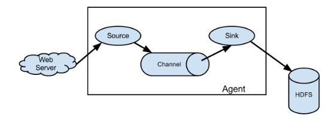
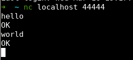

## Flume 概述

Flume，是一个日志采集系统，Cloudera 提供，是高可用的、高可靠的、分布式的，海量日志采集、聚合、传输的系统。Flume 流式架构，灵活简单。

Flume 可以从多个渠道获取内容，写入到多种渠道。


## Flume 基础架构



**Agent**

一个 JVM 进程，主要由 Source、Channel、Sink 组成。它会将数据以事件的方式从源头送到目的地。

**Source**

主要负责从源头将数据接受，Source 组件可以处理多种格式的数据，比如 avro、thrift、exec、jms、spooling directory、netcat、taildir、sequence generator、http、legacy 等。

**Channel**

主要用于传输，将数据源中的数据传送到目的地。可以看成是一个缓冲区，因此 Channel 允许 Source 和 Sink 运送在不用的速率上。

Channel 线程安全，可以同时处理几个 Source 的写入和几个 Sink 的读取。

**Sink**

Sink 位于 Agent 的消费端。它不断轮询 Channel 中的事件并且批量移除它们，并且将这些事件写入到存储中，或者发送到下一个 Flume Agent。

Sink 的目的地有：HDFS、Logger、avro、thrift、ipc、file、HBase、solr、自定义等。

**Event**

Flume 中，数据传输的最小单元。包含 Header 和 Body 两部分，Header 为 kv 结构，存放一些属性。Body 存放一些数据，形式是字节数组。


## Flume 开始

### 安装部署

1. [官网](http://flume.apache.org/)，下载 `apache-flume-1.9.0.tar-gz` 即可。
1. 上传到服务器 `/opt/software`，解压到 `/opt/module`。
1. 配置环境变量。
1. 如果安装了 Hadoop，需要删除 lib 包下的 `guava-11.0.2`，兼容 `Hadoop3.1.3`。

### 入门案例

**监听端口**

1. 思路：监听端口 44444，收集此端口的数据，并且打印到控制台中。
1. 安装 `netcat`，此工具可以用于向端口发送数据：`yum -y install nc`
1. 判断 44444 是否被占用：`sudo netstat -lnp | grep 44444`
1. 在 Flume Agent HOME 目录下创建 job 文件夹，并且进入。
1. 创建配置文件 `flume-netcat-logger.conf`，以下配置来自官方[手册](https://flume.apache.org/FlumeUserGuide.html)

    :::details 监控端口
    ```properties
    # Name the components on this agent
    # r1：a1 的 source 名称
    a1.sources = r1
    # k1：a1 的 sink 名称
    a1.sinks = k1
    # c1：a1 的 channel 名称
    a1.channels = c1

    # Describe/configure the source
    # a1 的输入源为 netcat
    a1.sources.r1.type = netcat
    # a1 监听主机
    a1.sources.r1.bind = localhost
    # a1 监听端口号
    a1.sources.r1.port = 44444

    # Describe the sink
    # a1 输出类型为控制台 logger
    a1.sinks.k1.type = logger

    # Use a channel which buffers events in memory
    # a1 的 channel 类型为内存
    a1.channels.c1.type = memory
    # a1 的 channel 总容量为 1000 个 event
    a1.channels.c1.capacity = 1000
    # a1 的 channel 传输时收集到了 100 条 event 之后再去提交事务
    a1.channels.c1.transactionCapacity = 100

    # Bind the source and sink to the channel
    # source r1 和 channel c1 连接
    a1.sources.r1.channels = c1
    # channel c1 和 sink k1 连接
    a1.sinks.k1.channel = c1
    ```
    :::

1. 开启 flume，监听端口：

    ```bash
    # 方法一：
    bin/flume-ng agent --conf conf/ --name a1 --conf-file job/flume-netcat-logger.conf -Dflume.root.logger=INFO,console
    # 方法二：
    bin/flume-ng agent -c conf -n a1 -f job/flume-netcat-logger.conf -Dflume.root.logger=INFO,console
    ```

    - `--conf/-c`：配置文件存储在 `conf/` 下。
    - `--name/-n`：给 agent 起名。
    - `--conf-file/-f`：本次 flume 启动时执行的读取的配置文件时使用的文件。
    - `-Dflume.root.logger=INFO,console`：`-D` 表示 flume 运行时动态修改 `flume.root.logger` 参数属性值，并且将级别改为 `INFO`（日志级别：`LOG、INFO、WARN、ERROR`）。

1. netcat 向本机 44444 发送内容：`nc localhost 44444`，之后便可以发送内容。
1. 结果：

    

    

**监听单个文件**

监控 Hive 日志，并且上传到 HDFS 中。

1. Flume 需要 Hadoop 相关的 jar 包才可以进行此操作。检查 Hadoop 和 Java 环境变量配置。
1. 在 job 文件夹下创建 `flume-file-hdfs.conf` 文件

    由于 Hive 日志在 Linux 中，所以读取文件需要按照 Linux 的规则来，下方 `exec` 指的是 `execute` 执行，表示执行 Linux 命令。

    对于所有和时间相关的转义序列，Event Header 必须含有时间戳，也就是以 timestamp 的 key（除非 `hdfs.useLocalTimeStamp` 设置为 true，也就是使用本地时间）。

    :::details 监控文件
    ```
    # 定义 source、sink、channel
    a2.sources = r2
    a2.sinks = k2
    a2.channels = c2

    # 定义 source 类型为执行命令，命令为 tail -F /opt/module/apache-hive-3.1.2-bin/logs/hive.log
    a2.sources.r2.type = exec
    a2.sources.r2.command = tail -F /opt/module/hive/logs/hive.log

    a2.sinks.k2.type = hdfs
    a2.sinks.k2.hdfs.path = hdfs://hadoop102:8020/flume/%Y%m%d/%H
    # 上传文件的前缀
    a2.sinks.k2.hdfs.filePrefix = logs-
    # 是否按照时间滚动文件夹
    a2.sinks.k2.hdfs.round = true
    # 多少时间单位创建一个新的文件夹
    a2.sinks.k2.hdfs.roundValue = 1
    # 重新定义时间单位
    a2.sinks.k2.hdfs.roundUnit = hour
    # 是否使用本地时间戳
    a2.sinks.k2.hdfs.useLocalTimeStamp = true
    # 积攒多少个 Event 才 flush 到 HDFS 一次
    a2.sinks.k2.hdfs.batchSize = 100
    # 设置文件类型，可支持压缩
    a2.sinks.k2.hdfs.fileType = DataStream
    # 多久生成一个新的文件
    a2.sinks.k2.hdfs.rollInterval = 60
    # 设置每个文件的滚动大小
    a2.sinks.k2.hdfs.rollSize = 134217700
    # 文件的滚动与 Event 数量无关
    a2.sinks.k2.hdfs.rollCount = 0

    # 缓冲区类型、大小
    a2.channels.c2.type = memory
    a2.channels.c2.capacity = 1000
    a2.channels.c2.transactionCapacity = 100

    # 绑定 source、channel、sink
    a2.sources.r2.channels = c2
    a2.sinks.k2.channel = c2
    ```
    :::

1. 运行 flume：`bin/flume-ng agent -c conf -n a2 -f job/flume-file-hdfs.conf -Dflume.root.logger=INFO,console`

    如果报错 `Exception in thread “SinkRunner-PollingRunner-DefaultSinkProcessor“ java.lang.NoSuchMethodError`，可以将 `$HADOOP_HOME/share/hadoop/common/lib` 下的 `guava-27.0-jre.jar` 覆盖 `$FLUME_HOME/lib` 的低版本 guava

1. 开启 Hadoop 和 Hive
1. 在 HDFS 上查看文件

**监控目录下多个文件**

1. 创建 `job/flume-dir-hdfs.conf`

    :::details 监控目录下多个文件
    ```
    # 定义 source、channel、sink
    a3.sources = r3
    a3.sinks = k3
    a3.channels = c3

    # spooldir：定义 source 类型为目录，spoolDir：给定目录位置，fileSuffix：给定文件上传完成的后缀，fileHeader：是否有文件头
    a3.sources.r3.type = spooldir
    a3.sources.r3.spoolDir = /opt/module/apache-flume-1.9.0/upload
    a3.sources.r3.fileSuffix = .COMPLETED
    a3.sources.r3.fileHeader = true
    #忽略所有以.tmp结尾的文件，不上传
    a3.sources.r3.ignorePattern = ([^ ]*\.tmp)

    # Describe the sink
    a3.sinks.k3.type = hdfs
    a3.sinks.k3.hdfs.path = hdfs://hadoop102:8020/flume/upload/%Y%m%d/%H
    #上传文件的前缀
    a3.sinks.k3.hdfs.filePrefix = upload-
    #是否按照时间滚动文件夹
    a3.sinks.k3.hdfs.round = true
    #多少时间单位创建一个新的文件夹
    a3.sinks.k3.hdfs.roundValue = 1
    #重新定义时间单位
    a3.sinks.k3.hdfs.roundUnit = hour
    #是否使用本地时间戳
    a3.sinks.k3.hdfs.useLocalTimeStamp = true
    #积攒多少个Event才flush到HDFS一次
    a3.sinks.k3.hdfs.batchSize = 100
    #设置文件类型，可支持压缩
    a3.sinks.k3.hdfs.fileType = DataStream
    #多久生成一个新的文件
    a3.sinks.k3.hdfs.rollInterval = 60
    #设置每个文件的滚动大小大概是128M
    a3.sinks.k3.hdfs.rollSize = 134217700
    #文件的滚动与Event数量无关
    a3.sinks.k3.hdfs.rollCount = 0

    # Use a channel which buffers events in memory
    a3.channels.c3.type = memory
    a3.channels.c3.capacity = 1000
    a3.channels.c3.transactionCapacity = 100

    # banding source、channel、sink
    a3.sources.r3.channels = c3
    a3.sinks.k3.channel = c3
    ```
    :::

    使用 Spooling Directory Source 时，不要在监控目录下持续创建并修改文件。

    上传的文件会以 `.COMPLETED` 结尾，比如 `atguigu.log.COMPLETED`。

    被监控的文件夹每 500ms 扫描一次文件变动。

1. 在此文件夹下添加文件即可。

**实时监控目录下的多个追加文件**

使用 `Taildir Source`，可以实现监控多个文件，并且可以实现断点续传。

1. 创建 `job/flume-taildir-hdfs.conf`

:::details 实时监控多个追加文件
```
a4.sources = r4
a4.sinks = k4
a4.channels = c4

# 使用 Taildir Source，可以实现监控多个文件，并且可以实现断点续传
a4.sources.r4.type = TAILDIR
# 配置文件组
a4.sources.r4.filegroups = f1 f2
# 定义监控目录文件，组 f1 监控哪些文件
a4.sources.r4.filegroups.f1 = /opt/module/apache-flume-1.9.0/job/.*file.*
# 定义监控目录文件，组 f2 监控哪些文件
a4.sources.r4.filegroups.f2 = /opt/module/apache-flume-1.9.0/job/.*log.*
# 记录每一个文件读取到了哪个位置，是一个 json 文件
a4.sources.r4.positionFile = /opt/module/apache-flume-1.9.0/job/position.json

# Describe the sink
a4.sinks.k4.type = hdfs
a4.sinks.k4.hdfs.path = hdfs://hadoop102:8020/flume/upload2/%Y%m%d/%H
#上传文件的前缀
a4.sinks.k4.hdfs.filePrefix = upload-
#是否按照时间滚动文件夹
a4.sinks.k4.hdfs.round = true
#多少时间单位创建一个新的文件夹
a4.sinks.k4.hdfs.roundValue = 1
#重新定义时间单位
a4.sinks.k4.hdfs.roundUnit = hour
#是否使用本地时间戳
a4.sinks.k4.hdfs.useLocalTimeStamp = true
#积攒多少个Event才flush到HDFS一次
a4.sinks.k4.hdfs.batchSize = 100
#设置文件类型，可支持压缩
a4.sinks.k4.hdfs.fileType = DataStream
#多久生成一个新的文件
a4.sinks.k4.hdfs.rollInterval = 60
#设置每个文件的滚动大小大概是128M
a4.sinks.k4.hdfs.rollSize = 134217700
#文件的滚动与Event数量无关
a4.sinks.k4.hdfs.rollCount = 0

# Use a channel which buffers events in memory
a4.channels.c4.type = memory
a4.channels.c4.capacity = 1000
a4.channels.c4.transactionCapacity = 100

# Bind the source and sink to the channel
a4.sources.r4.channels = c4
a4.sinks.k4.channel = c4
```
:::
