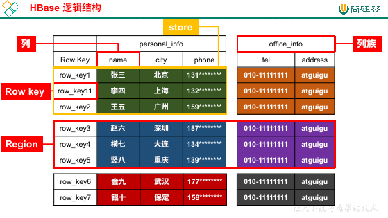
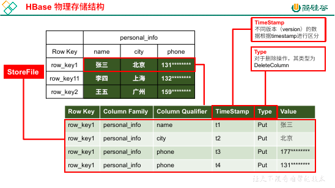

## HBase 简介

HBase 是分布式的、可扩展的、支持海量数据存储的 NoSQL 数据库（基于 Hadoop 的数据库），支持对数据进行大量、实时、随机读写的操作。

**HBase 的逻辑结构**



HBase 在表现上类似关系型数据库，但是在底层存储是 kv，更像是一个多维度 map，但是我们一般将其归类为列存储 NoSQL。

- 列族：

    HBase 和我们之前的关系型数据库不同的第一点就是列族，每一个列族下面可以任意指定列的数量。

    在 HBase 中，列不能单独存在，必须属于某一个列族。

- Row Key：

    row key，也叫做行键。

    在 HBase 中，每一行数据都有自己的 row key，这个 row key 是唯一的。

    row key 是会自动排序的，也就是说数据进入到 HBase 中会根据 row key 自动排序。

    排序规则是根据字典顺序来的，比如 `1 -> 11 -> 2`，而不是 `1 -> 2 -> …… -> 11`。

- region：

    在 HBase 中，横向将表进行切分，比如上图中，`row_key3、row_key4、row_key5` 对应行的数据为一个 region（分区）。

    切分的原因就是因为表太大了，不好维护，所以必须要进行切分，每一个 region 去单独维护。

    每一个 region 中的数据绝对会存储到一台机器上。

- store：

    我们横向切完之后会纵向切分 region，形成 store，比如上图中，`row_key1、row_key11、row_key2` 对应的 region 根据列族切分，形成了两个 store。

    store，存储，顾名思义，物理存储是以一个 store 为单位进行存储的。

    所以，每一个 region 的数据都会存到一个机器上，但是又会按照每一个列族都切分，每一个列族都会存到不同的文件中。

**物理存储结构**



我们以一个 store 为例子，说明物理存储方式。

对于 `row_key1` 对应的行来说，它有三个列：`name`、`city`、`phone`。那么这行中的每一列都会在物理上成为 kv 键值对。

k 包括 `row key`、`列族`、`列名称`、`时间戳`、`类型（PUT/DELETEColumn）`，value 就是当前对应的值，比如 name 为 `张三`。

在上图中，手机号存储了两次，时间戳和值都是不同的，这就代表着手机号有多个版本，也就是数据进行了修改操作（在 HBase 中，添加/修改都是 PUT 操作，删除是操作有多种标识，之后会涉及）。

HBase 号称是支持随机实时读写操作，但是也不能违背 HDFS 的规则。所以 HBase 会将我们的每一个操作都追加到文件末尾，给我们一种随机实时的假象。

也就是说 HBase 在一开始并没有真正的修改这条数据，而是又记录了一个新的内容，然后通过时间戳去判断应该使用哪一个。

但是 HBase 会在一段时间后删除之前版本的记录，留下最后的内容，防止垃圾数据太多，也就是先假后真。

**术语**

- Name Space：

    命名空间，类似关系型数据库的 database，每个 namespace 下有多个表，自带 default 和 hbase 内置表。

- Table：

    表，HBase 定义表只需要声明列族，不需要指定列。这意味着字段在写入时，可以动态指定。

- Row：

    每行数据都由一个 Row Key + 多个 Column（列） 组成，数据按照 Row Key 排序检索（一般我们会按照 Row Key 查询，假如按照别的字段查询，它没有索引，会扫描整张表，效率太低）。

- Column：

    列由列族（Column Family） + 列限定符（Column Qualifier、列名字）组成。

- Timestamp：时间戳
- Cell：

    Row Key、Column Family、Column Qualifier、Timestamp 唯一确定一个单元叫做 cell，cell 中的数据全部都是字节码形式存储。

### HBase 基本架构


1. Region Server：

    Region 的管理者，可以对数据实现增删改查的操作，可以对 Region 实现切分、合并（StoreFile 合并）的操作。

    每个 Region Server 中可以有多个 Region，这些 Region 不一定是来自同一张表，可能会来自不同的表。

    Region 划分的 Store 将会存储到机器的不同文件中，这些文件叫做 StoreFile（或者叫做 HFile）

1. Master：

    Region Server 的管理者，可以对表进行增删改的操作，可以对 Region Server 进行监控、分配 region、负载均衡、故障转移操作。

1. Zookeeper：

    HBase 通过 Zookeeper 实现 Master 高可用、Region Server 监控、元数据入口、集群配置等工作。

1. HDFS：

    底层存储服务，提供高可用支持。

### 环境搭建

TODO

### Shell 操作

**基本操作**

- 链接 hbase shell：`hbase shell`

---

- 列出 namespace：`list_namespace`

    default：默认空间

    hbase：系统使用的

- 创建 namespace：`create_namespace "test"`

    可以在创建 namespace 时给定属性值：`create_namespace "test01", {"author"=>"wyh", "create_time"=>"2020-03-10 08:08:08"}`

- 查看 namespace 详细情况：`describe_namespace "test01"`
- 修改 namespace：`alter_namespace "test01", {METHOD => 'set', 'author' => 'weiyunhui'}`

    通过 set 设置属性值，使用 unset 删除属性值。

- 删除 namespace：`drop_namespace "test01"`

    要删除的 namespace 必须是空的，下面必须没有表，有表存在是 drop 不掉的。

---

- 查看有哪些表：`list`

    此命令会将所有 namespace 下的，非系统创建的所有表列出。

- 创建表：`create 'student'`

    不指定 namespace 的话，默认使用 default，假如想要在某个 namespace 下建立，需要使用 `{namespace}:{table}`

    例如：`create 'ns1:t1'` 代表在 n1 这个 namespace 下创建了 t1 表。

    可以使用 NAME 语法指定属性：`create ns1:t1,{NAME=>'f1'}`，指定了 f1 这个列族。除了指定列族之外，还可以指定其他属性，例如 `VERSION` 版本。

    假如只想要指定列族属性，可以简化为：`create 'n1:t1','f1'`

- 查看表的详细信息：`describe 'student'`
- 变更表：`alter 'student',{NAME=>'f1',VERSIONS=>3},{NAME=>'f2',VERSIONS=>6}`

    如果需要对列族更改的话，如果需要加列族，直接写就可以了，删除使用 `alter 'student','delete'=>'f1'`

    在实际过程中，不回去搞很多列族，既然列族下面可以有 n 个列，在大部分情况下，按照业务分列族就够用了。

- 表的启动和下线：

    下线表：`disable 'student'`。启动表：`enable 'student'`。

- 删除表：`drop 'student'`

    HBase 中，如果需要删除一张表，需要先令表下线

---

- 插入数据：

    - `put 'namespace:表'， 'rowKey'，'列族:列', '值'`：`put 'stu' '1001', 'info:name', 'zhangsan'`

    插入数据时注意，我们平常说的 HBase 是一张大表，其实指的是逻辑结构，底层存储是 kv，所以 rowKey 可以对应任意的列数量，不需要和其他 rowKey 对应的列数量一致。

- 查询数据：

    - `get 'namespace:表', 'rowKey'`:`get 'stu', '1001'`

### Region Server 架构和读写流程

HBase 的基本架构就是 Zookeeper -> Master -> Region Server -> Region -> HDFS。这里重点要说的是 Region Server 的架构。


再来回顾一下 region：


为了解决文件太大的困扰，HBase 会横向切分表，每一块就是一个 Region，而每一个 Region 根据列族进行纵向切分，形成的就是 Store。

为了方便读写，每一个 Region 的内容一定会存储到一台服务器上，而具体存储的物理文件以 Store 为主，也就是说每一个 Store 都是一个 StoreFile（或者叫做 HFile）。

既然每一个 Region 都会存到一台服务器上，那么我们就有 Region Server 的概念：


在每个 Region Server 中，可以有多个 Region，一个 WAL（预写日志），一个 Block Cache（读缓存）。每一个 Store 的结构都有一个 MemStore（读写缓存），一个 StoreFile（物理文件）。

**写流程**

1. Client 请求 Zookeeper，获取 HBase 的 meta 表位于哪个 Region Server。
1. 访问对应 Region Server，获取 meta，根据请求的 namespace:table/rowKey 获取位于哪个 Region Server 的哪个 Region。
1. 将上面的信息缓存到 Client 的 meta cache，方便下次访问。
1. 与目标 Region Server 进行通信。
1. 将数据顺序追加到 WAL 中（避免意外情况导致数据丢失）。
1. 将数据写入 MemStore，数据会在 MemStore 中进行重新排序（所以 HFile 中的数据是顺序的）。
1. 向客户端发送 ack。
1. 等到 MemStore 满足条件之后，将数据写入到 HFile（每次刷写都会生成一个 HFile），减少 WAL 文件。

    单个满足条件的时机：

    1. 单个 MemStore 大小达到了配置的值 `hbase.hregion.memstore.flush.size`，默认 `128M`
    1. 单个 MemStore 时间达到了配置的值 `hbase.regionserver.optionalcacheflushinterval`，默认 1h

    总体满足条件的时机：

    1. Region Server 中总的 MemStore 大小达到了 `java_heapsize * hbase.regionserver.global.memstore.size（默认值0.4）* hbase.regionserver.global.memstore.size.lower.limit（默认值0.95）`，会按照 MemStore 大小由大到小依次刷写，直到 RegionServer 中，MemStore 的总大小减少到上述值以下。
    1. WAL 文件超过 32，按照时间顺序自动刷写，直到文件数量减少到 32 以下（现在已经无需手动设置）。

    停止刷写到 MemStore 的时机：

    1. 单个 MemStore 大小达到了 `hbase.hregion.memstore.flush.size（默认值128M）* hbase.hregion.memstore.block.multiplier（默认值4）` 将停止向此 MemStore 刷写数据。
    1. RegionServer 总大小达到了 `java_heapsize * hbase.regionserver.global.memstore.size（默认值0.4）` 会停止向所有 MemStore 写入数据。

**读流程**

1. Client 访问 Zookeeper，获取 HBase 的 meta 表位于哪个 Region Server。
1. 访问到 meta 表，根据读请求的 namespace:table/rowKey 得到目标所在的 Region Server。
1. 将该信息缓存在 Client 的 meta cache 中。
1. 与目标 Region Server 进行通讯。
1. 查询数据

    因为缓存的存在，所以 Block Cache 和 HFile 的数据是相同的，所以假如 Block Cache 中有数据，就不需要从 HFile 中读取。

    版本问题也不用考虑，Block Cache 缓存的只是某个版本的数据，假如 Block Cache 存在我们需要某个版本的数据那么直接就返回了，假如需要其他版本的数据，仍然需要读取 HFile。

    除了 Block Cache 和 HFile，读数据还有可能在 MemStore 中读取（已经写入 Memory Cache 但是尚未 flush 到 HFile 中的数据）。

    注意一点，某条数据可能有多个版本，所以可能会在多个 HFile 中存在，所以可能会读取多个 HFile。

1. 合并数据

    因为数据存在多个版本，所以要从 MemStore + Block Cache / HFile，从而得到我们最终想要的版本。

    注意一点，MemStore 中的数据虽然是最新的，但是不一定是我们需要的。

    比如说，假如 MemStore 想要删除某个版本的数据，这肯定就不是我们想要的结果，所以还需要进行数据合并。

1. 将查询到的数据块（某个版本的数据）缓存到 Block Cache。
1. 结果返回给客户端。

:::tip
注意，在进行读取 HFile 的过程中，HBase 提供了三种手段进行读取加速。

1. 时间范围过滤。在进行读取的时候，首先会根据时间范围过滤 HFile，避免读取不必要的文件。
1. RowKey 过滤。根据 RowKey 过滤 HFile，缩小读取范围。
1. 布隆过滤器。每个 HFile 都有自己的布隆过滤器，它可以告诉某个文件中没有某条数据。
:::

**StoreFile Compaction**

之前我们提到过有一种叫做 Region 合并的情况。其实这种说法不太准确，Region 是不能合并的，我们合并的是 Region 中的 HFile。

因为 MemStore 每次 flush 都会产生一个 HFile，所以对于同一条数据，不同版本、不同类型，都可能会存在不同的 HFile 中。

长此以往，读取数据就会在多个文件中读取，速度会下降。为了减少 HFile 的个数，删除的多余数据，HBase 会进行 HFile 的合并，也就是 StoreFile Compaction。

Compaction 分为两种，一种是 Minor Compaction（小合并），一种是 Major Compaction（大合并）：

- Minor Compaction 会将临近的几个若干个小的 HFile 合并为一个较大的 HFile，并且清理掉部分过期和删除的数据。

    在 Minor Compaction 中，清理过期和需要删除的数据只能是一小部分，有些数据它不能确定有用还是没用，只能留着。

    每次 flush 数据都有可能产生小合并，但是不一定会，还需要满足一些条件。

- Major Compaction 会合并一个 Store 下的所有 HFile 为一个大的 HFile，清理所有过期和删除的数据。

    大合并定时合并，默认七天一次，可以进行配置。

**Region Split**

HBase 在开始只有一个 region，但是当表逐渐增大时，region 会自动切开为多个（当然，在生产环境可能会做预分区优化）。

为了负载考虑，HMaster 可能会将多个 Region 分给多个 Region Server。我们之前提到，每一个 Region 的数据都会存储到一台机器上，这句话没错，但是一张表有可能会分为多个 Region，那多个 Region 就可能分散给不同的 Region Server。

当一个 Region 中的某个 Store 下的 StoreFile 的总大小超过 `Min(initialSize * R^3 , hbase.hregion.max.filesize")`，此 Region 就会切分。

其中 `initialSize` 默认为 `2 * hbase.hregion.memstore.flush.size`，R 为当前 Region Server 中，属于此 Table 的 Region 个数，默认情况下，具体的策略：

- 第一次：`1^3 * 256 = 256MB < 10GB`，取值 256MB。
- 第二次：`2^3 * 256 = 2048MB`，同理取值 2048MB。
- 第三次：`3^3 * 256 = 6912MB`，通离去之 6912MB。
- 第四次：`4^3 * 256 = 16384MB > 10GB`，取值较小的 10GB。
- 之后，每次都是 10GB。

因为这种方式比较麻烦，在 HBase2.0 引入了新的策略：假如当前 RegionServer 上，此表只有一个 Region，按照 `2 * hbase.hregion.memstore.flush.size` 分裂，否则按照 `hbase.hregion.max.filesize` 分裂。

## API 操作

**环境搭建**

```xml
<dependency>
    <groupId>org.apache.hbase</groupId>
    <artifactId>hbase-server</artifactId>
    <version>2.0.5</version>
</dependency>
<dependency>
    <groupId>org.apache.hbase</groupId>
    <artifactId>hbase-client</artifactId>
    <version>2.0.5</version>
</dependency>
```

用户 API [参考](https://hbase.apache.org/1.4/apidocs/index.html)

**案例**

```java
import org.apache.hadoop.conf.Configuration;
import org.apache.hadoop.hbase.CellUtil;
import org.apache.hadoop.hbase.HBaseConfiguration;
import org.apache.hadoop.hbase.NamespaceDescriptor;
import org.apache.hadoop.hbase.TableName;
import org.apache.hadoop.hbase.client.*;
import org.apache.hadoop.hbase.util.Bytes;
import org.junit.After;
import org.junit.Before;

import java.io.IOException;
import java.util.Arrays;
import java.util.List;
import java.util.stream.Collectors;

/**
 * 1. 获取 connection 对象，重量级别实现，打开一直用即可
 * 2. 获取 table，DML 操作，随用随打开即可
 * 3. 获取 admin，DDL 操作，随用随打开即可
 */
public class HBaseDemo {

  private static Connection connection;

  @Before
  public void config() throws IOException {
    Configuration conf = HBaseConfiguration.create();
    conf.set("hbase.zookeeper.quorum", "hadoop102,hadoop103,hadoop104");
    connection = ConnectionFactory.createConnection(conf);
  }

  /*------------------------------- DDL -------------------------------*/

  public void createNamespace(String namespace) throws IOException {
    Admin admin = connection.getAdmin();
    // 除了 createNamespace 之外，还可以 list、modify 等，不说了
    admin.createNamespace(NamespaceDescriptor.create(namespace).build());
    admin.close();
  }

  /**
   * 创建表
   *
   * @param namespace
   * @param tableName 表名称
   * @param cfs       列族
   */
  public void createTable(String namespace, String tableName, String... cfs) throws IOException {
    if (tableExists(namespace, tableName)) {
      return;
    }
    Admin admin = connection.getAdmin();
    TableDescriptorBuilder tableDescriptorBuilder = TableDescriptorBuilder.newBuilder(TableName.valueOf(namespace, tableName));

    List<ColumnFamilyDescriptor> columnFamilyDescriptors = Arrays.stream(cfs)
        .map(family -> ColumnFamilyDescriptorBuilder.newBuilder(Bytes.toBytes(family)).build())
        .collect(Collectors.toList());
    tableDescriptorBuilder.setColumnFamilies(columnFamilyDescriptors);

    TableDescriptor tableDescriptor = tableDescriptorBuilder.build();
    admin.createTable(tableDescriptor);

    admin.close();
  }

  public Boolean tableExists(String namespace, String tableName) throws IOException {
    Admin admin = connection.getAdmin();
    return admin.tableExists(TableName.valueOf(namespace, tableName));
  }

  public void dropTable(String namespace, String tableName) throws IOException {
    if (!tableExists(namespace, tableName)) {
      return;
    }
    Admin admin = connection.getAdmin();
    TableName table = TableName.valueOf(namespace, tableName);
    // 删除表之前首先需要禁用表
    admin.disableTable(table);
    admin.deleteTable(table);
    admin.close();
  }

  /*------------------------------- DML -------------------------------*/

  /**
   * @param namespace
   * @param tableName
   * @param rowKey
   * @param columnFamily 列族
   * @param columnName   列的名字
   * @param value        数据
   */
  public void put(String namespace, String tableName, String rowKey, String columnFamily, String columnName, String value) throws IOException {
    Table table = connection.getTable(TableName.valueOf(namespace, tableName));

    Put put = new Put(Bytes.toBytes(rowKey));
    put.addColumn(Bytes.toBytes(columnFamily), Bytes.toBytes(columnName), Bytes.toBytes(value));
    // 可使用重载，放 put 的 list 集合
    table.put(put);

    table.close();
  }

  /**
   * 删除时，可以指定删除某个 rowKey 的数据，也可以直接删除某个列族的数，也可以直接删除某个列的数据。
   * <p>
   * columnFamily、columnName 可选
   *
   * @param namespace
   * @param tableName
   * @param rowKey
   * @param columnFamily
   * @param columnName
   */
  public void delete(String namespace, String tableName, String rowKey, String columnFamily, String columnName) throws IOException {
    Table table = connection.getTable(TableName.valueOf(namespace, tableName));

    /*
        删除某个 rowKey 对应的数据
        HBase 标记为 DeleteFamily，因为这里删除的是一整行的数据，删除的是所有列、所有列族的数据
     */
    Delete delete = new Delete(Bytes.toBytes(rowKey));
    table.delete(delete);

    /*
        删除整个列族的数据
        HBase 标记为 DeleteFamily，但是由于一行中可能有多个列族，那么没有指定的列族自然不会删除
     */
    Delete deleteFamily = new Delete(Bytes.toBytes(rowKey));
    delete.addFamily(Bytes.toBytes(columnFamily));
    table.delete(deleteFamily);

    /*
        删除某个列族中的某个列的最后一个版本，HBase 标记为 Delete
        除了 addColumn，还可以指定 addColumns(family, column)，这个指定的是一个列的所有版本，它的标记为 DeleteColumn
     */
    Delete deleteColumn = new Delete(Bytes.toBytes(columnName));
    delete.addColumn(Bytes.toBytes(columnFamily), Bytes.toBytes(columnName));
    table.delete(deleteColumn);

    table.close();
  }

  /**
   * get 也可以获取某个 rowKey、列族、列的数据
   *
   * @param namespace
   * @param tableName
   * @param rowKey
   * @param columnFamily
   * @param columnName
   */
  public void get(String namespace, String tableName, String rowKey, String columnFamily, String columnName) throws IOException {
    Table table = connection.getTable(TableName.valueOf(namespace, tableName));

    // 拿到一整行数据
    Get get = new Get(Bytes.toBytes(rowKey));
    Result result = table.get(get);
    Arrays.stream(result.rawCells()).forEach(cell -> {
      // 直接使用 cell.getRowArray() 的方式有问题，需要工具类转换一下
      String rowKeyStr = Bytes.toString(CellUtil.cloneRow(cell));
      String columnFamilyStr = Bytes.toString(CellUtil.cloneFamily(cell));
      String valueStr = Bytes.toString(CellUtil.cloneValue(cell));
      System.out.printf("rowKey %s, columnFamily %s, value %s\n", rowKeyStr, columnFamilyStr, valueStr);
    });

    // 拿到列族的数据
    Get getFamily = new Get(Bytes.toBytes(rowKey));
    getFamily.addFamily(Bytes.toBytes(columnFamily));
    Result resultFamily = table.get(getFamily);

    // 拿到列的数据
    Get getColumn = new Get(Bytes.toBytes(rowKey));
    getColumn.addColumn(Bytes.toBytes(columnFamily), Bytes.toBytes(columnName));
    Result resultColumn = table.get(getColumn);

    table.close();
  }

  /**
   * 扫描表中数据
   *
   * @param namespace
   * @param tableName
   * @param startRow  可选，可以指定从表的哪个位置开始扫描
   * @param stopRow   可选，可以指定从表的哪个位置结束扫描
   */
  public void scan(String namespace, String tableName, String startRow, String stopRow) throws IOException {
    Table table = connection.getTable(TableName.valueOf(namespace, tableName));

    Scan scan = new Scan();
    // 指定从表的哪个位置开始扫描，可选
    scan.withStartRow(Bytes.toBytes(startRow));
    // 指定从表的哪个位置结束扫描，可选
    scan.withStopRow(Bytes.toBytes(stopRow));
    ResultScanner scanner = table.getScanner(scan);
    for (Result result : scanner) {
      Arrays.stream(result.rawCells()).forEach(cell -> {
        System.out.println(Bytes.toString(CellUtil.cloneValue(cell)));
      });
    }

    scanner.close();
    table.close();
  }

  @After
  public void close() throws IOException {
    connection.close();
  }

}
```

## HBase 优化

**预分区**

这个预分区说的是预先分为多个 region，让数据一进来之后就开始负载均衡。假如之后一个 region 数据量很大，HBase 还是会自动拆分的。

1. 建表时手动分区：`create 'staff1','info',SPLITS => ['1000','2000','3000','4000']`

    划分为了 5 个 region 范围：`负无穷 -> 1000`、`1000 -> 2000`、……、`4000 -> 正无穷`

1. 16 进制序列分区：`create 'staff2','info',{NUMREGIONS => 15, SPLITALGO => 'HexStringSplit'}`

    `NUMREGIONS` 指定为要分为 15 个区，SPLITALGO 指定每个分区的范围（使用 `HexStringSplit` 这个 16 进制）

    这个 15 分区按照 16 进制，也就是从 `00000000` 一直到 `ffffffff`，那分区就是 `负无穷 -> 11111111`、`11111111 -> 22222222`、……、`dddddddd -> eeeeeeee`、`eeeeeeee -> 正无穷`

    rowKey 的设计和预分区是分不开的，假如按照这种内容，为了均匀放到这几个分区中，rowKey 最好也设计为 16 进制。

1. 按照文件进行分区：`create 'staff3','info',SPLITS_FILE => 'splits.txt'`

    这个 `splits.txt` 是我们自己指定的，这里的 `SPLITS_FILE` 指定的就是相对路径下的文件。

    比如我们指定

    ```txt
    aaaa
    cccc
    bbbb
    dddd
    ```

    HBase 会首先将文件进行排序，然后进行预分区。

1. API 创建分区：

    ```java
    public void createTable(String namespace, String tableName, String... cfs) throws IOException {
        if (tableExists(namespace, tableName)) {
            return;
        }
        Admin admin = connection.getAdmin();
        TableDescriptorBuilder tableDescriptorBuilder = TableDescriptorBuilder.newBuilder(TableName.valueOf(namespace, tableName));
        TableDescriptor tableDescriptor = tableDescriptorBuilder.build();

        byte[][] spliteKeys = new byte[4][];
        spliteKeys[0] = Bytes.toBytes("1000");
        spliteKeys[1] = Bytes.toBytes("2000");
        spliteKeys[2] = Bytes.toBytes("3000");
        spliteKeys[3] = Bytes.toBytes("4000");

        admin.createTable(tableDescriptor, spliteKeys);

        admin.close();
    }
    ```

**RowKey 设计**

预分区和 RowKey 密不可分，设计 RowKey 的目的是让数据均匀地进入 region。

原则：

- 唯一性。
- 散列。
- 在保证以上两者后，长度尽量设计地短。

**基础优化**

HBase 对内存需要大量开销，但是不建议分配大量的堆内存。因为 Full GC 太久会导致 RegionServer 长期处于不可用状态。

假如服务器内存为 128G，给个 16 -> 36 即可。或者给一台服务器为 16 -> 36G，专门跑 HBase 也行。

接下来是 `hbase-site.xml` 的基础优化。

- RegionServer 和 Zookeeper 会话时间：

    `zookeeper.session.timeout`，默认 90000ms（90s），可以减少一点，例如 60s。

- RegionServer(RPC) 的监听数量：

    `hbase.regionserver.handler.count`，默认为 30。

    读写操作都是打到 RegionServer 的，假如读写比较高，可以考虑调高此值

- Major Compaction：

    HFile 大合并，`hbase.hregion.majorcompaction`，默认 `604800000s`(七天)，可以设置为 0，手动触发大合并。

- HFile 大小：

    HFile 的大小，`hbase.hregion.max.filesize` 默认 `10737418240`(10G)

    假如需要运行 MR，可以减少此值，因为一个 region 会对应一个 MapTask，假如单个 region 太大，会导致 MapTask 过长。

- 优化 HBase 客户端缓存：

    `hbase.client.write.buffer`，默认 2M，用于客户端缓存。增大可减少 RPC 调用次数，但是会消耗更多内存。反之会增加 RPC 调用次数，但是会减少内存。

- scan 获取的行数：

    `hbase.client.scanner.caching`

    使用 API 的 scanner 操作时，返回的 result 不是所有的值（如果是所有的值一次性返回就炸了），而是需要迭代，每次迭代都会返回一些数据。

    这个参数可以控制每次迭代返回多少行，值越大会消耗越多的内存。

- BlockCache 占用 RegionServer 堆内存的比例：

    `hfile.block.cache.size` 默认 0.4

- MemStore 占用 RegionServer 堆内存的比例：

    `hbase.regionserver.global.memstore.size` 默认 0.4
