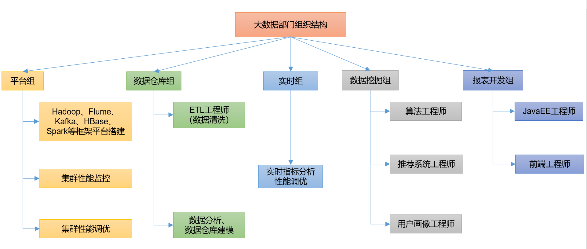
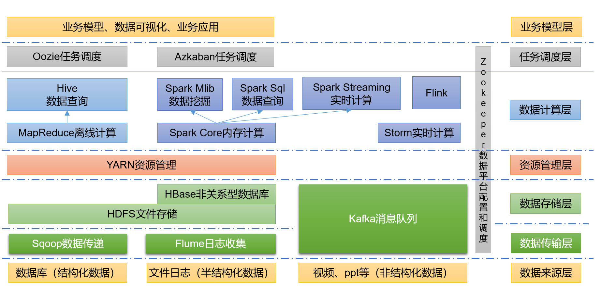
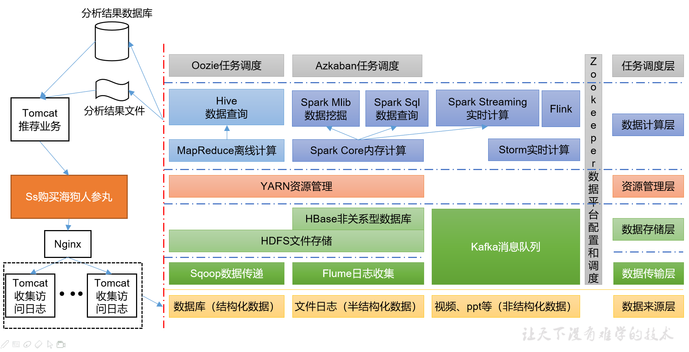
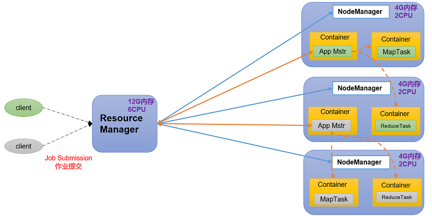
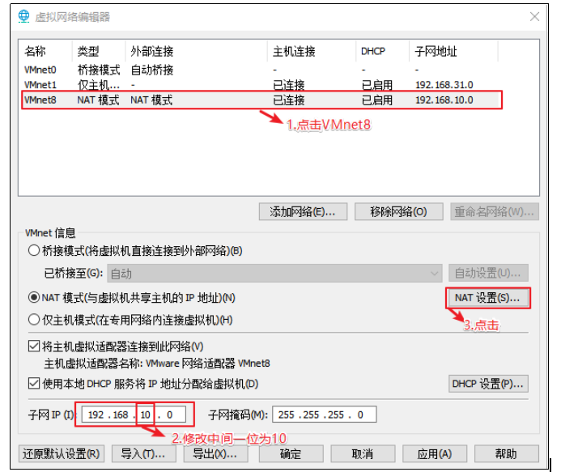
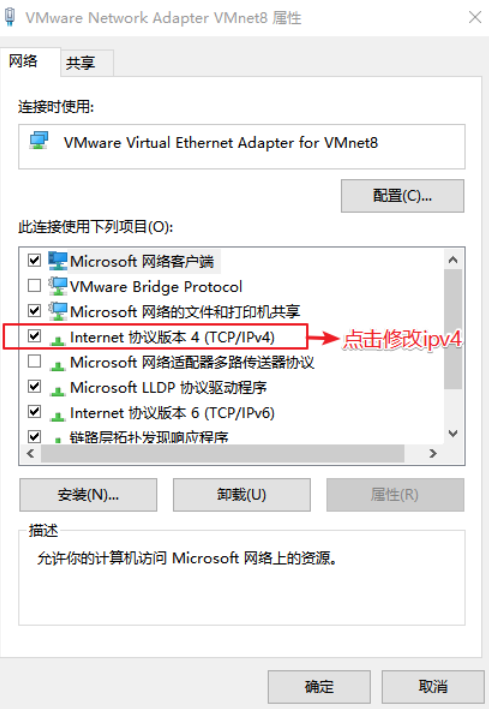

## 前言

大数据（Bigdata），主要解决海量数据的**采集、存储、计算**问题。

按照顺序给出数据存储的单位：bit、Byte、KB、MB、GB、TB、PB、EB、ZB、YB、BB、NB、DB。

其中每一个单位向前都是 1024，例如 1TB = 1024GB

大数据的特点（4V）：

- Volume：大量。
- Velocity：高速，以及到 2025 年，全球数据使用量将达到 163ZB。
- Variety：多样：结构化、半结构化、非结构化数据。
- Value：低价值密度：在大量的数据中，有价值的数据较少。

大数据部门组织架构：



大数据生态体系：



案例，推荐系统：



## Hadoop 概述

Hadoop 由 Apache 基金会开发，是一个**分布式系统基础架构**，主要解决海量数据的存储和计算问题。但是广义上来讲，Hadoop 是一个生态。


Hadoop 有三大发行版本：[Apache](http://hadoop.apache.org)（原始版本，适合学习）、[Cloudera](https://www.cloudera.com/downloads/cdh)（产品 CDH）、[Hortonworks](https://hortonworks.com/products/data-center/hdp/)（产品 HDP，被 Cloudera 收购）。

Hadoop 的优势：

- 高可靠性：底层维护多个数据副本，即使某个存储出现故障也不会导致数据丢失。
- 高扩展性：在集群之间分配任务数据，方便扩展数千节点。
- 高效性：在 MapReduce 思想下，Hadoop 是并行的，加快了任务处理速度。
- 高容错性：失败任务自动分配。

Hadoop 1.x、2.x、3.x 区别：

- Hadoop 1.x 时代，仅有：
  - Common：辅助工具。
  - HDFS：数据存储。
  - MapReduce：计算 + 资源调度。

- hadoop 2.x 时代：
  - Common：辅助工具。
  - HDFS：数据存储。
  - Yarn：资源调度。
  - MapReduce：计算。

  也就是 Hadoop 2.x 时代，将计算和资源调度分开，降低了耦合。

- Hadoop 3.x 时代和 Hadoop 2.x 时代在架构上没有区别，在一些细节问题上有所变化，这是之后的内容。

Hadoop 架构：

- HDFS（Hadoop Distributed File System）：是一个**分布式文件系统**。
    - NN（NameNode）：存储文件的元数据（例如文件名字、文件存储位置、目录结构等）。
    - DN（DataNode）：在本地文件系统存储文件块数据和块数据的校验。
    - 2NN（Secondary NameNode）：每隔一段时间对 NameNode 元数据备份。
- YARN：是一种资源协调者，是 Hadoop 的资源管理器。
    - RM（Resource Manager）：管理整个集群的资源（如 CPU、内存 等）。
    - NM（NodeManager）：管理集群中单个节点的资源。
    - AM（ApplicationMaster）：管理节点中单个任务的资源，一个任务可以分为多个 Task，AM 管理这些 Task。
    - Container：容器，相当于一台独立的服务器，里面封装了任务运行需要的资源（比如 CPU、内存、网络），任务在 Container 中运行。

    说明：可以有多个客户端连接集群提交 Job（任务、作业），集群上可以运行多个 NodeManager，每个 NodeManager 中可以运行多个 Container，一个 Container 对应一个 ApplicationMaster 或者 Task。

    


- MapReduce：任务计算使用。

    Hadoop MapReduce 的计算分为两个阶段：Map、Reduce，和分治算法有点相似。

    Map 阶段并行，将数据进行计算处理，Reduce 阶段将 Map 结果进行汇总。

    

## 环境搭建

### 模板虚拟的准备

1. 使用 VMWare + CentOS7，网上资料很多，这里不再赘述（注意，电脑在 BIOS 界面开启虚拟化，设置网络为 NAT）。
1. 准备一台虚拟机，IP 地址为 192.168.10.100，主机名称为 hadoop100，内存 4G，硬盘 50G。
1. 安装系统时注意：
    - 时区选择上海。
    - 软件选择中，选择 GNOME 桌面，不用选择附加选项。
    - 磁盘分区配置分区，`/boot` 为 1G，ext4 文件系统，`/swap` 交换分区为 4G，`/` 分区为 45G，ext4 文件系统。
    - 关闭 kdump。
    - 修改主机名称为 hadoop100（或者之后在命令行中修改），并且连接以太网。
    - 设置一个好记的 root 密码，比如六个 0。
1. 网络配置：
    1. VMWare -> 编辑 -> 虚拟网络编辑器，设置子网 IP 为 `192.168.10.0`，NAT 设置中设置网关为 `192.169.10.2`。

        

        

    1. Windows 设置，找到网络 --> 更改适配器选项 --> VMnet8 --> 属性 --> ipv4 --> DNS 和 IP 修改。

        

        

        

        

    1. 进入 VMWare 中，已经安装的 CentOS，编辑文件 `/etc/sysconfig/network-scripts/ifcfg-ens33`，设置 IP 为静态 IP 地址，设置网关、域名解析器：

        ```text
        #网络类型（通常是Ethemet）
        TYPE="Ethernet"
        PROXY_METHOD="none"
        BROWSER_ONLY="no"
        #IP的配置方法[none|static|bootp|dhcp]（引导时不使用协议|静态分配IP|BOOTP协议|DHCP协议）
        BOOTPROTO="static"
        DEFROUTE="yes"
        IPV4_FAILURE_FATAL="no"
        IPV6INIT="yes"
        IPV6_AUTOCONF="yes"
        IPV6_DEFROUTE="yes"
        IPV6_FAILURE_FATAL="no"
        IPV6_ADDR_GEN_MODE="stable-privacy"
        NAME="ens33"
        #随机id
        UUID="e83804c1-3257-4584-81bb-660665ac22f6"
        #接口名（设备,网卡）
        DEVICE="ens33"
        #系统启动的时候网络接口是否有效（yes/no）
        ONBOOT="yes"
        #IP地址
        IPADDR=192.168.10.100
        #网关
        GATEWAY=192.168.10.2
        #域名解析器
        DNS1=192.168.10.2
        ```

        文件编辑完成之后，执行命令 `systemctl restart network` 重启网络服务，假如出错则重启系统。

        设置之后，可以通过命令 `ifconfig` 查看当前网络。

    1. 编辑文件 `/etc/hostname`，将主机名修改为 `hadoop100`。
    1. 编辑文件 `/etc/hosts`，在映射文件中添加以下内容：

        ```text
        192.168.10.100 hadoop100
        192.168.10.101 hadoop101
        192.168.10.102 hadoop102
        192.168.10.103 hadoop103
        192.168.10.104 hadoop104
        192.168.10.105 hadoop105
        192.168.10.106 hadoop106
        192.168.10.107 hadoop107
        192.168.10.108 hadoop108
        ```

        从映射文件中可以看到，我们目前增加了八个映射（但其实三台就差不多了，但是先搞定再说）。

    1. 重启 CentOS系统。
    1. 编辑 Windows hosts 映射文件，修改 `C:\Windows\System32\drivers\etc\hosts`，添加：

        ```text
        192.168.10.100 hadoop100
        192.168.10.101 hadoop101
        192.168.10.102 hadoop102
        192.168.10.103 hadoop103
        192.168.10.104 hadoop104
        192.168.10.105 hadoop105
        192.168.10.106 hadoop106
        192.168.10.107 hadoop107
        192.168.10.108 hadoop108
        ```

    1. 远程工具可以使用 `XShell && XFTP` 或者其他。
    1. 远程工具连接 hadoop100，安装 epel-release（一个软件仓库）：`yum install -y epel-release`。
    1. 关闭防火墙：

        ```shell
        systemctl stop firewalld
        systemctl disable firewalld.service
        ```

        企业开发时，一般会关闭单个服务器的防火墙，开启对外的一个防火墙。

    1. 创建用户 atguigu，修改 atguigu 的密码：

        ```shell
        useradd atguigu
        passwd atguigu
        ```

    1. 为 atguigu 用户添加 root 权限，方便操作：

        - 修改 `/etc/sudoers` 文件。
        - 在 `%wheel` 行下添加一行 `atguigu   ALL=(ALL)     NOPASSWD:ALL`，比如：

            ```text
            ## Allow root to run any commands anywhere
            root    ALL=(ALL)     ALL

            ## Allows people in group wheel to run all commands
            %wheel  ALL=(ALL)       ALL
            atguigu   ALL=(ALL)     NOPASSWD:ALL
            ```

            atguigu 这一行不要直接放到root行下面，因为所有用户都属于 wheel 组，配置了 atguigu 具有免密功能，但是程序执行到 %wheel 行时，该功能又被覆盖回需要密码。
            所以 atguigu 要放到 %wheel 这行下面。

    1. 在 `/opt` 下创建文件夹，并修改权限：

        ```shell
        # 之后软件的目录，例如 JDK、Hadoop 的存放位置
        mkdir /opt/module
        # 软件安装包存放目录
        mkdir /opt/software
        # 将两者的所有者和所属组更改为 atguigu
        chown atguigu:atguigu /opt/module
        chown atguigu:atguigu /opt/software
        ```

    1. 卸载虚拟机自带的 JDK：

        ```shell
        rpm -qa | grep -i java | xargs -n1 rpm -e --nodeps
        ```

    1. 重启虚拟机。

### 克隆虚拟机

1. 克隆虚拟机，注意选择完全克隆，使用 hadoop102 作为案例。
1. 修改克隆虚拟机的静态 IP，修改文件 `/etc/sysconfig/network-scripts/ifcfg-ens33`：

    ```text
    BOOTPROTO=static
    NAME="ens33"
    IPADDR=192.168.10.102
    PREFIX=24
    GATEWAY=192.168.10.2
    DNS1=192.168.10.2
    ```

1. 修改主机名称，修改文件 `/etc/hostname` 为 `hadoop102`。
1. 重启。

### 安装环境

1. JDK 安装：

    因为在模板虚拟及已经全部卸载了虚拟机的自带 JDK，所以重新安装 JDK。

    - 利用 XFTP 传输 JDK 到 `/opt/software`，JDK 版本为 `jdk-8u212`，其实 JDK8 即可，中间差别不大。
    - 解压 JDK 到 `/opt/module`：`tar -zxvf jdk-8u212-linux-x64.tar.gz -C /opt/module/`
    - 配置环境变量：
        - 新建文件 `/etc/profile.d/my_env.sh`，编辑，添加：

            ```text
            #JAVA_HOME
            export JAVA_HOME=/opt/module/jdk1.8.0_212
            export PATH=$PATH:$JAVA_HOME/bin
            ```

        - `source /etc/profile`，使用新的环境变量。

            注意，这里直接编辑 `my_env.sh` 是因为 `/etc/profile` 有一段为：

            ```text
            for i in /etc/profile.d/*.sh /etc/profile.d/sh.local ; do
                if [ -r "$i" ]; then
                    if [ "${-#*i}" != "$-" ]; then
                        . "$i"
                    else
                        # 文件黑洞，写到 `/dev/null` 的内容会被立刻丢弃，无用的日志可以向里面放。
                        . "$i" >/dev/null
                    fi
                fi
            done
            ```

            它会遍历所有 `/etc/profile.d/*.sh`，并加入到环境变量。

        - 使用 `java -version` 测试是否安装成功。
1. Hadoop 安装：

    1. 使用 `hadoop-3.1.3`。
    1. 上传至 `/opt/software/`
    1. 解压：`tar -zxvf hadoop-3.1.3.tar.gz -C /opt/module/`
    1. 编辑 `/etc/profile.d/my_env.sh`，将 Hadoop 目录添加到文件末尾：

        ```text
        #HADOOP_HOME
        export HADOOP_HOME=/opt/module/hadoop-3.1.3
        export PATH=$PATH:$HADOOP_HOME/bin
        # 存在 sbin 时，也需要添加 sbin 到环境变量
        export PATH=$PATH:$HADOOP_HOME/sbin
        ```

    1. 使用 `hadoop version` 测试是否成功，不成功重启虚拟机。

### Hadoop 介绍

**Hadoop 目录结构**

```text
drwxr-xr-x. 2 atguigu atguigu  4096 5月  22 2017 bin
drwxr-xr-x. 3 atguigu atguigu  4096 5月  22 2017 etc
drwxr-xr-x. 2 atguigu atguigu  4096 5月  22 2017 include
drwxr-xr-x. 3 atguigu atguigu  4096 5月  22 2017 lib
drwxr-xr-x. 2 atguigu atguigu  4096 5月  22 2017 libexec
-rw-r--r--. 1 atguigu atguigu 15429 5月  22 2017 LICENSE.txt
-rw-r--r--. 1 atguigu atguigu   101 5月  22 2017 NOTICE.txt
-rw-r--r--. 1 atguigu atguigu  1366 5月  22 2017 README.txt
drwxr-xr-x. 2 atguigu atguigu  4096 5月  22 2017 sbin
drwxr-xr-x. 4 atguigu atguigu  4096 5月  22 2017 share
```

- bin：存放对 Hadoop 相关服务（HDFS、YARN、MapReduce）进行操作的脚本。
- etc：Hadoop 的配置文件目录，存放 Hadoop 的配置文件。
- lib：存放 Hadoop 的本地库（对数据进行压缩和解压）。
- sbin：存放启动或者停止 Hadoop 相关服务的脚本。
- share：Hadoop 的依赖 jar 包、文档、官方案例。

**Hadoop 运行模式**

[hadoop](http://hadoop.apache.org/)运行模式包括：

- 本地模式。
- 伪分布式。
- 完全分布式。

### 本地模式

1. 在 hadoop 安装目录（`/opt/module/hadoop-3.1.3`）下创建一个文件夹 `wcinput`，在里面创建一个文件 `word.txt`：

    ```text
    hadoop yarn
    hadoop mapreduce
    atguigu
    atguigu
    ```
1. 使用官方案例 wordCount 执行：

    - 回到 Hadoop 安装目录。
    - 执行官方案例 wordcount：`hadoop jar share/hadoop/mapreduce/hadoop-mapreduce-examples-3.1.3.jar wordcount wcinput wcoutput`
    - 进入 wcoutput，查看结果。

    注意：wcoutput 在执行之前假如存在会报错。

### 完全分布式

伪分布式没什么好说的，准备完全分布式。

**scp、rsync**

工欲善其事，必先利其器，首先来看两个集群之间的分发工具：

scp：可以实现服务器之间的数据拷贝。

- 语法：`scp -r $pdir/$fname $user@$host:$pdir/$fname`
    - `-r`：递归。
    - `$pdir/$fname`：要拷贝的文件路径/名称。
    - `$user@$host:$pdir/$fname`：目的地用户@目的地主机IP:目的地路径/目的地文件名称。
- 案例：`scp -r /opt/module/jdk1.8.0_212  atguigu@hadoop103:/opt/module`
- 其他用法：任意指定服务器的内容，可以复制到任意服务器上，例如：`scp -r atguigu@hadoop102:/opt/module/* atguigu@hadoop104:/opt/module`

`rsync`：主要用于备份和镜像，速度快，避免复制相同内容，并且支持符号链接。

- 和 scp 的区别：rsync 主要用于同步差异文件，scp 会同步所有文件。
- 语法：`rsync -av $pdir/$fname $user@$host:$pdir/$fname`
    - `-a`：归档拷贝。
    - `-v`：显示复制过程。
    - 其余类似 scp 的命令。
- 案例：
    - `rsync -r atguigu@hadoop102:/opt/module/hadoop-3.1.3 /opt/module/`

**完全分布式**

准备虚拟机 hadoop102、hadoop103、hadoop104，准备阶段参考 hadoop102。

- 创建文件夹 `/home/atguigu/bin`，在文件夹下面创建 `xsync` 文件。
- 编辑文件 `xsync` 编写集群分发脚本：

    ```shell
    #!/bin/bash

    #1. 判断参数个数
    if [ $# -lt 1 ]
    then
        echo Not Enough Arguement!
        exit;
    fi

    #2. 遍历集群所有机器
    for host in hadoop102 hadoop103 hadoop104
    do
        echo ====================  $host  ====================
        #3. 遍历所有目录，挨个发送

        for file in $@
        do
            #4. 判断文件是否存在
            if [ -e $file ]
                then
                    #5. 获取父目录
                    pdir=$(cd -P $(dirname $file); pwd)

                    #6. 获取当前文件的名称
                    fname=$(basename $file)
                    ssh $host "mkdir -p $pdir"
                    rsync -av $pdir/$fname $host:$pdir
                else
                    echo $file does not exists!
            fi
        done
    done
    ```

- 修改脚本执行权限：`chmod +x xsync`
- 测试脚本：`xsync /home/atguigu/bin`，将脚本复制到 `/bin/` 下，以便全局调用。
- 同步环境变量配置 `sudo ./bin/xsync /etc/profile.d/my_env.sh`。使用了 sudo 则必须写全 xsync 路径。

**SSH 免密钥登陆**

这块内容是计算机基础知识，使用到了公钥和私钥，详细了解可以查看计算机网络。

在三台机器上分别做以下操作：

- 配置 SSH 密钥：`ssh-keygen -t rsa`：

    此次将会在用户 home 目录下（比如 `/home/atguigu`）生成 `.ssh` 文件夹，文件夹中包含 `id_rsa`（私钥），`id_rsa.pub`（公钥）。

- 复制公钥到需要免密登陆的服务器上，注意，本机器也需要配置：

    ```text
    ssh-copy-id hadoop102
    ssh-copy-id hadoop103
    ssh-copy-id hadoop104
    ```

    此次步骤将会在用户 home 目录下的 `.ssh` 文件夹中生成 `authorized_keys` 文件，其中包含三个密钥，分别对应三台服务器的公钥。

- 使用 ssh 尝试访问其他两台服务器，会出现文件 `known_hosts`，这是记录 ssh 访问过计算机的公钥。

**集群配置**

1. 集群配置：

    |      | hadoop102              | hadoop103                        | hadoop104                       |
    | ---- | ---------------------- | -------------------------------- | ------------------------------- |
    | HDFS | NameNode <br> DataNode | DataNode                         | SecondaryNameNode <br> DataNode |
    | YARN | NodeManager            | ResourceManager <br> NodeManager | NodeManager                     |

    注意：

    1. NN 和 2NN 不要配置到一台机器上，因为 2NN 是 NN 的备份，假如配置在一台服务器上，当这台服务器挂了就凉凉。
    1. RM 同样消耗资源，不要和 NN 或 2NN 放到一起。

1. 集群默认配置文件：

    - `core-default.xml`：文件存放到了 `hadoop-common-3.1.3.jar/core-default.xml`
    - `hdfs-default.xml`：文件存放到了 `hadoop-hdfs-3.1.3.jar/hdfs-default.xml`
    - `yarn-default.xml`：文件存放到了 `hadoop-yarn-common-3.1.3.jar/yarn-default.xml`
    - `mapred-default.xml`：文件存放到了 `hadoop-mapreduce-client-core-3.1.3.jar/mapred-default.xml`

1. 以上是集群默认配置文件，不可更改，但是我们可以自定义配置文件：

    - `core-site.xml`
    - `hdfs-site.xml`
    - `yarn-site.xml`
    - `mapred-site.xml`

    自定义的配置文件将会覆盖原有的配置文件，它们存放到了 `$HADOOP_HOME/etc/hadoop` 中。

    事实上在之后写代码的时候，放在 java resources 包下的会覆盖这里的自定义配置文件，写在代码中的配置又会覆盖自定义的配置文件。

1. 配置核心文件：`$HADOOP_HOME/etc/hadoop/core-site.xml`:

    ```xml
    <?xml version="1.0" encoding="UTF-8"?>
    <?xml-stylesheet type="text/xsl" href="configuration.xsl"?>

    <configuration>
        <!-- 指定NameNode的地址 -->
        <property>
            <name>fs.defaultFS</name>
            <value>hdfs://hadoop102:8020</value>
        </property>

        <!-- 指定hadoop数据的存储目录 -->
        <property>
            <name>hadoop.tmp.dir</name>
            <value>/opt/module/hadoop-3.1.3/data</value>
        </property>

        <!-- 配置HDFS网页登录使用的静态用户为atguigu -->
        <property>
            <name>hadoop.http.staticuser.user</name>
            <value>atguigu</value>
        </property>
    </configuration>
    ```

1. 配置 HDFS 文件：`$HADOOP_HOME/etc/hadoop/hdfs-site.xml`:

    ```xml
    <?xml version="1.0" encoding="UTF-8"?>
    <?xml-stylesheet type="text/xsl" href="configuration.xsl"?>

    <configuration>
        <!-- nn web端访问地址-->
        <property>
            <name>dfs.namenode.http-address</name>
            <value>hadoop102:9870</value>
        </property>
        <!-- 2nn web端访问地址-->
        <property>
            <name>dfs.namenode.secondary.http-address</name>
            <value>hadoop104:9868</value>
        </property>
    </configuration>
    ```

1. 配置 YARN 文件：`$HADOOP_HOME/etc/hadoop/yarn-site.xml`:

    ```xml
    <?xml version="1.0" encoding="UTF-8"?>
    <?xml-stylesheet type="text/xsl" href="configuration.xsl"?>

    <configuration>
        <!-- 指定MR走shuffle -->
        <property>
            <name>yarn.nodemanager.aux-services</name>
            <value>mapreduce_shuffle</value>
        </property>

        <!-- 指定ResourceManager的地址-->
        <property>
            <name>yarn.resourcemanager.hostname</name>
            <value>hadoop103</value>
        </property>

        <!-- 环境变量的继承 -->
        <property>
            <name>yarn.nodemanager.env-whitelist</name>
            <value>JAVA_HOME,HADOOP_COMMON_HOME,HADOOP_HDFS_HOME,HADOOP_CONF_DIR,CLASSPATH_PREPEND_DISTCACHE,HADOOP_YARN_HOME,HADOOP_MAPRED_HOME</value>
        </property>
    </configuration>
    ```

1. 配置 MapReduce 文件：`$HADOOP_HOME/etc/hadoop/mapred-site.xml`:

    ```xml
    <?xml version="1.0" encoding="UTF-8"?>
    <?xml-stylesheet type="text/xsl" href="configuration.xsl"?>

    <configuration>
        <!-- 指定MapReduce程序运行在Yarn上 -->
        <property>
            <name>mapreduce.framework.name</name>
            <value>yarn</value>
        </property>
    </configuration>
    ```

1. 分发脚本：`xsync /opt/module/hadoop-3.1.3/etc/hadoop/`

**群起集群**

1. 配置 workers（2.x 之前叫做 slaves），修改 `/opt/module/hadoop-3.1.3/etc/hadoop/workers`，改为如下：

    ```text
    hadoop102
    hadoop103
    hadoop104
    ```

    > `/opt/module/hadoop-3.1.3/etc/hadoop/workers`

    注意，此文件添加的内容文件结尾不准有空格，文件中不准有空行。

1. 分发：`xsync /opt/module/hadoop-3.1.3/etc`
1. 启动集群：

    1. 如果集群初次启动，则需要在 NameNode 节点格式化，这里就是 hadoop102 节点：`hdfs namenode -format`

        格式化 NameNode 会产生新的集群 ID，假如集群需要重新格式化 NameNode，一定要首先删除机器的 data 和 logs 目录，然后再进行格式化，否则集群 ID 不一致会导致集群找不到以往数据。

    1. 启动 HDFS：`sbin/start-dfs.sh`
    1. 在 ResourceManager 节点，这里是 hadoop103 节点，启动 YARN：`sbin/start-yarn.sh`
    1. 在浏览器上输入 `http://hadoop102:9870` 查看是否启动了 HDFS。在 `http://hadoop103:8088` 查看 YARN 上的 Job 信息。
1. 配置历史服务器：

    1. 修改 `$HADOOP_HOME/etc/hadoop/mapred-site.xml`，增加配置：

        ```xml
        <!-- 历史服务器端地址 -->
        <property>
            <name>mapreduce.jobhistory.address</name>
            <value>hadoop102:10020</value>
        </property>

        <!-- 历史服务器web端地址 -->
        <property>
            <name>mapreduce.jobhistory.webapp.address</name>
            <value>hadoop102:19888</value>
        </property>
        ```

    1. 分发配置：`xsync $HADOOP_HOME/etc/hadoop/mapred-site.xml`
    1. 启动历史服务器：`mapred --daemon start historyserver`
    1. 使用命令 `jps` 查看是否启动（jps 不生效是因为 Java 环境没配好）。
    1. 查看 JobHistory：`http://hadoop102:19888/jobhistory`

        假如失败，则重启 HDFS 再次查看。

1. 配置日志聚集功能：

    日志聚集，其实就是将程序运行日志信息上传到 HDFS 上，方便查看。

    1. 编辑 `$HADOOP_HOME/etc/hadoop/yarn-site.xml`，增加配置：

        ```xml
        <!-- 开启日志聚集功能 -->
        <property>
            <name>yarn.log-aggregation-enable</name>
            <value>true</value>
        </property>
        <!-- 设置日志聚集服务器地址 -->
        <property>
            <name>yarn.log.server.url</name>
            <value>http://hadoop102:19888/jobhistory/logs</value>
        </property>
        <!-- 设置日志保留时间为7天 -->
        <property>
            <name>yarn.log-aggregation.retain-seconds</name>
            <value>604800</value>
        </property>
        ```

    1. 分发配置：`xsync $HADOOP_HOME/etc/hadoop/yarn-site.xml`
    1. 重启 NameNode、ResourceManager、HistoryServer：

        ```text
        sbin/stop-yarn.sh
        mapred --daemon stop historyserver
        sbin/start-yarn.sh
        mapred --daemon start historyserver
        ```

    1. 执行 Word Count 程序，查看日志。

**其他**

- 整体启动/停止模块：
    - start-dfs.sh/stop-dfs.sh
    - start-yarn.sh/stop-yarn.sh
- 各个服务组件单独启动/停止：
    - hdfs --daemon start/stop namenode/datanode/secondarynamenode
    - yarn --daemon start/stop  resourcemanager/nodemanager
- 群起集群脚本：`/home/atguigu/bin/myhadoop.sh`：

    ```shell
    #!/bin/bash

    # 查看输入参数
    if [ $# -lt 1 ]
    then
        echo "No Args Input..."
        exit ;
    fi

    # 当前输入参数为 start 则启动集群，输入为 stop 关闭集群
    case $1 in
    "start")
            echo " =================== 启动 hadoop集群 ==================="

            echo " --------------- 启动 hdfs ---------------"
            ssh hadoop102 "/opt/module/hadoop-3.1.3/sbin/start-dfs.sh"
            echo " --------------- 启动 yarn ---------------"
            ssh hadoop103 "/opt/module/hadoop-3.1.3/sbin/start-yarn.sh"
            echo " --------------- 启动 historyserver ---------------"
            ssh hadoop102 "/opt/module/hadoop-3.1.3/bin/mapred --daemon start historyserver"
    ;;
    "stop")
            echo " =================== 关闭 hadoop集群 ==================="

            echo " --------------- 关闭 historyserver ---------------"
            ssh hadoop102 "/opt/module/hadoop-3.1.3/bin/mapred --daemon stop historyserver"
            echo " --------------- 关闭 yarn ---------------"
            ssh hadoop103 "/opt/module/hadoop-3.1.3/sbin/stop-yarn.sh"
            echo " --------------- 关闭 hdfs ---------------"
            ssh hadoop102 "/opt/module/hadoop-3.1.3/sbin/stop-dfs.sh"
    ;;
    *)
        echo "Input Args Error..."
    ;;
    esac
    ```
- 查看三台服务器进程脚本：`/home/atguigu/bin/jpsall`

    ```shell
    #!/bin/bash

    for host in hadoop102 hadoop103 hadoop104
    do
            echo =============== $host ===============
            ssh $host jps
    done
    ````

- 常用端口号：

| 端口名称                   | Hadoop2.x | Hadoop3.x      |
| -------------------------- | --------- | -------------- |
| NameNode 内部通信端口      | 8020/9000 | 8020/9000/9820 |
| NameNode HTTP UI           | 50070     | 9870           |
| MapReduce 查看执行任务端口 | 8088      | 8088           |
| 历史服务器通信端口         | 19888     | 19888          |

**文件上传和下载**

- 上传文件到 HDFS：`hadoop fs -put ${文件路径} ${HDFS 路径}`
- 上传文件后查看真实的存储位置：

    `/opt/module/hadoop-3.1.3/data/dfs/data/current/BP-1436128598-192.168.10.102-1610603650062/current/finalized/subdir0/subdir0`

    注意，这里的文件夹名称有些不一定相同（比如 `BP-1436128598-192.168.10.102-1610603650062`），但是大体位置是一样的。

- 从 HDFS 下载到本地：`hadoop fs -get ${HDFS 文件路径} ${本地文件路径}`
