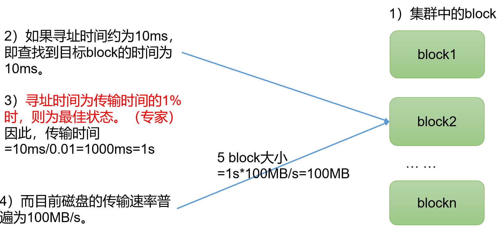
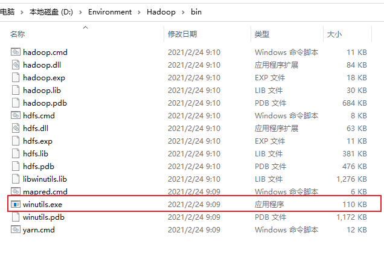
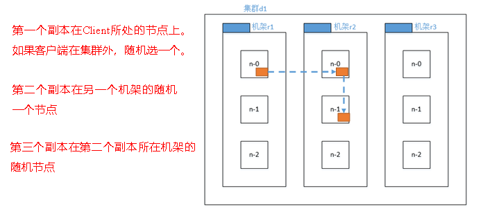
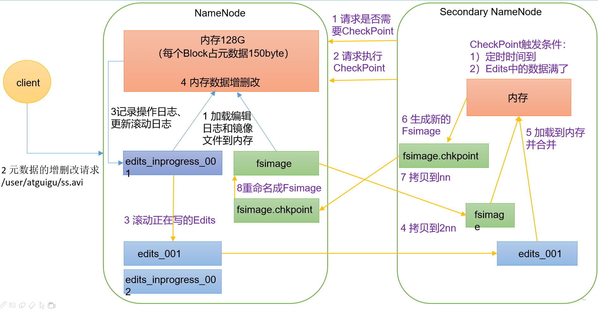
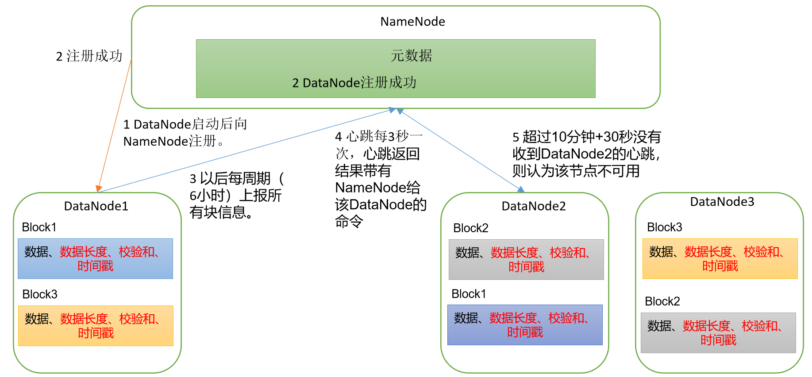

## HDFS 概述

**概述和优缺点**

随着数据量越来越大，一台服务器肯定存不下所有的数据，那么需要一种分布式文件系统来进行文件的存储。HDFS（Hadoop Distributed File System） 就是这样一种分布式文件系统。

HDFS 适合用于一次写入，多次读取的场景，也就是说一个文件经过创建之后就不再进行改变，这也是大数据的特点：从已经存在的数据进行分析，寻找规律，而不是创造规律。

HDFS 的优点：

- 高容错性：数据将会自动保存多个副本，所以当一个副本丢失之后可以自动恢复。
- 适合处理大量的数据：能够处理 TB、甚至 PB 级别的数据，可以处理百万级别的文件数量。
- 廉价：可以构建在廉价的机器上，性价比高。

HDFS 的缺点：

- 毫秒级别的存储做不到，适合使用小时、天、甚至周的事件来处理任务。
- 小文件处理不佳，无法高效地对小文件进行处理：会占用大量的 NameNode 内存，寻址时间将超过读取时间，这其实违背了设计的目的。
- 不支持并发写入，随机修改：也就是说一个文件只能有一个线程进行写操作，而且仅支持数据的追加（append），不支持文件的随机修改。

**HDFS 组成架构**

1. NameNode

    简写为 NN，就是 Master，是一个主管，它有如下作用：

    - 管理 HDFS 名称空间（namespace）。
    - 管理副本的生成策略，一个文件应该生成几个副本来存储，副本应该在哪台 DataNode 存储。
    - 管理数据块（Block）的映射信息，例如什么文件大小多少、位置在哪等。
    - 处理客户端的读写请求。

1. DataNode

    可以看成干活的人，可以叫做 Slave，Worker，NameNode 下达命令，DataNode 执行：

    - 存储数据块。
    - 执行数据块的读写操作。

1. Client

    其实就是客户端，做以下事情：

    - 文件切分：当文件上传到 HDFS 之前，Client 会判断文件是否过大，如果文件超过预定义的值将会把文件切分为一个个的块（Block）。
    - 与 NameNode 交互：获取文件应该存储到那个 DataNode，或者已经存储到了哪个 DataNode。
    - 与 DataNode 交互：进行文件的读写操作。
    - 提供了一些命令管理 HDFS，例如 NameNode 的格式化。
    - 提供了一些命令访问 HDFS，例如 HDFS 的增删改查。

1. Secondary Name Node

    简写为 2NN，虽然名字是这样，但是并不是热备，更多类似于秘书的角色，能起到一定作用，但不能代替 NN 原有的共做：

    - 辅助 NN，分担工作，例如定期合并 Fsimage 和 Edists，并推送给 DataNode。
    - 紧急情况下可恢复 NN，但是注意，这里并不能恢复 NN 下的所有数据，之后会讲。

    在真正的企业中，一般使用 Hadoop 的高可用来替换掉 2NN。

**HDFS 文件块大小**

上面说过，Client 在进行文件上传之前，首先会检测文件的大小，如果文件过大会将文件切分为块（Block）。

Hadoop 2.x 和 Hadoop 3.x 默认大小为 128M，1.x 版本为 64M，但是块大小可以通过配置参数 `dfs.blocksize` 来规定。

但其实块的大小不能太大，也不能太小，HDFS 块大小的设置主要取决于磁盘的传输速率：

- 文件块太大，从磁盘传输数据的速度会很长。
- 文件块太小，寻址时间会超过磁盘加载数据的时间。



## HDFS 中的 Shell 操作

Shell 操作之前，需要首先启动 Hadoop 集群，注意至少要启动 HDFS 和 YARN。

在使用每个命令的时候，可以使用 `--help` 参数来查看使用方式，例如：`hadoop fs -help rm`

### 上传

**本地文件移动到 HDFS**

`hadoop fs -moveFromLocal ${本地文件路径/文件名称}`

**本地文件复制到 HDFS**

`hadoop fs -copyFromLocal ${本地文件路径/文件名称}`

`hadoop fs -put ${本地文件路径/文件名称}`：等同于 `copyFromLocal`，但是因为敲的代码少一点，生产环境更喜欢用 `put` 上传。

**本地文件追加到 HDFS 中已有的一个文件末尾**

`hadoop fs -appendToFile ${本地文件路径/文件名称}`

### 下载

**从 HDFS 拷贝到本地**

`hadoop fs -copyToLocal ${HDFS 的路径/HDFS 的文件名称} ${本地路径/本地文件名称}`

### HDFS 直接操作

**显示目录信息**

`hadoop fs -ls ${目录}`

**显示文件内容**

`hadoop fs -cat ${文件}`

**修改文件所属权限**

类似于 Linux 系统，使用 `hadoop fs -chmod/chown/chgrp ${权限} ${文件}`

**创建目录**

`hadoop fs -mkdir ${目录}`

**HDFS 中的拷贝**

将文件从 HDFS 中的一个路径拷贝到 HDFS 中的另一个路径。

`hadoop fs -cp ${源路径} ${目标路径}`

**HDFS 中的移动**

将文件从 HDFS 中的一个路径移动到另一个路径。

`hadoop fs -mv ${源路径} ${目标路径}`

**显示 HDFS 上一个文件末尾的数据**

`hadoop fs -tail ${文件}`

**删除文件/文件夹**

`hadoop fs -rm [-r] ${文件/文件夹}`

**统计文件夹大小信息**

`hadoop fs -du -s -h ${文件夹}`

**设置 HDFS 中文件的副本数量**

`hadoop fs -setrep ${副本数量} ${文件}`

## HDFS API 操作

### 环境准备

可以使用 API 来对 HDFS 进行操作：

1. 原本 Windows 并没有 Hadoop 的相关配置，需要将 Windows 依赖添加到环境中，只需要 Hadoop 的一个 bin 文件夹即可，其余都不需要。

    

    其中比较重要的是 `winutils.exe` 这个程序。Java 环境变量不再赘述，这里主要是 Hadoop 的配置。

1. 配置环境变量，指向 Hadoop 的配置。

    

1. 双击 `winutils.exe`，假如出现错误 `由于找不到 MSVCR120.dll`，说明缺少微软运行库，可以去 3DM 或者果核剥壳一类的网站找一下。

1. 重启系统。

1. 在 IDEA 中创建一个 Maven 工程，导入对应的依赖。

    ```xml
    <dependencies>
        <dependency>
            <groupId>org.apache.hadoop</groupId>
            <artifactId>hadoop-client</artifactId>
            <version>3.1.3</version>
        </dependency>
        <dependency>
            <groupId>junit</groupId>
            <artifactId>junit</artifactId>
            <version>4.12</version>
        </dependency>
        <dependency>
            <groupId>org.slf4j</groupId>
            <artifactId>slf4j-log4j12</artifactId>
            <version>1.7.30</version>
        </dependency>
    </dependencies>
    ```

1. 使用 `log4j.properties` 文件：

    ```properties
    log4j.rootLogger=INFO, stdout
    log4j.appender.stdout=org.apache.log4j.ConsoleAppender
    log4j.appender.stdout.layout=org.apache.log4j.PatternLayout
    log4j.appender.stdout.layout.ConversionPattern=%d %p [%c] - %m%n
    log4j.appender.logfile=org.apache.log4j.FileAppender
    log4j.appender.logfile.File=target/spring.log
    log4j.appender.logfile.layout=org.apache.log4j.PatternLayout
    log4j.appender.logfile.layout.ConversionPattern=%d %p [%c] - %m%n
    ```

### 案例实操

**创建目录**

```java
public class HDFSClient {

  Configuration conf;
  FileSystem fs;

  @Before
  public void before() throws URISyntaxException, IOException, InterruptedException {
    conf = new Configuration();
    // Linux 对用户权限的管理十分严格，所以不仅需要 HDFS 的路径，配置，还需要指定的用户
    fs = FileSystem.get(new URI("hdfs://hadoop102:8020"), conf, "atguigu");
  }

  @Test
  public void mkdirs() throws IOException {
    // 在 HDFS 根目录下创建 xiyou/huaguoshan 的目录
    fs.mkdirs(new Path("/xiyou/huaguoshan"));
  }

  @After
  public void after() throws IOException {
    fs.close();
  }
}
```

**上传文件**

```java
public class HDFSClient {

  Configuration conf;
  FileSystem fs;

  @Before
  public void before() throws URISyntaxException, IOException, InterruptedException {
    conf = new Configuration();
    // 手动设置单个文件的副本数量，这里设置为 2
    conf.set("dfs.replication","2");
    fs = FileSystem.get(new URI("hdfs://hadoop102:8020"), conf, "atguigu");
  }

  @Test
  public void uploadFile() throws IOException {
    // 手动指定 Windows 下路径为 sunwukong.txt 的文件，上传到 HDFS 中 /xiyou/huaguoshan 路径下
    fs.copyFromLocalFile(new Path("D:/Temp/sunwukong.txt"), new Path("/xiyou/huaguoshan"));
  }

  @After
  public void after() throws IOException {
    fs.close();
  }
}
```

注意，这里在进行上传文件之前，进行了一次设置文件副本数量的操作，最终形成的副本数量将为 2。

事实上，对于一些配置而言（不仅仅是这些切片的配置，还有更多配置）我们可以在多个地点定义配置：

1. 默认配置，权限最低。

    以 HDFS 的配置文件举例，它的位置是：`$HADOOP_HOME/share/hadoop/hdfs/hadoop-hdfs-3.1.3.jar`，在此 jar 包中，可以看到 `hdfs-default.xml`，记载的就是默认配置项。

    

    可以看到默认是 3，也就是说默认切片数量为 3。

1. 服务器自定义配置，权限高于默认配置。

    仍然以 HDFS 配置举例，自定义配置的路径一般在于 `$HADOOP_HOME/etc/hadoop/hdfs-site.xml`，以 `xxx-site.xml` 为格式的文件，一般都是自定义配置。

    这套规则不仅在 Hadoop 下生效，其实已经类似于一种约定俗成的习惯了。

1. ClassPath 下的配置，权限高于自定义配置。

    文件仍然叫做 `hdfs-site.xml`，不过位置将会放到项目的 resources 资源目录下，这也是最终对应 ClassPath 的位置。

    ```xml
    <?xml version="1.0" encoding="UTF-8"?>
    <?xml-stylesheet type="text/xsl" href="configuration.xsl"?>

    <configuration>
      <property>
        <name>dfs.replication</name>
            <value>1</value>
      </property>
    </configuration>
    ```

1. 代码中设置的配置，权限高于 ClassPath 的配置，这个在上面的代码中有写。

**文件下载**

```java
@Test
public void downloadFile() throws IOException {
  /*
    参数一：是否删除源文件。
    参数二：Hadoop 中源文件路径。
    参数三：下载的文件路径。
    参数四：是否开启文件校验。
    */
  fs.copyToLocalFile(false, new Path("/xiyou/huaguoshan/sunwukong.txt"), new Path("d:/sunwukong.txt"), true);
}
```

Before 和 After 不再写。第四个选项是否开启文件校验其实指的是 CRC 文件校验（循环冗余校验），CRC 的作用就是为了确保下载的文件数据是完整的。

**HDFS 改名和移动**

```java
@Test
public void mvFile() throws IOException {
  // rename 类似于 Linux 中的 mv 操作，可以改变文件的位置以及名称
  fs.rename(new Path("/xiyou/huaguoshan/sunwukong.txt"), new Path("/xiyou/huaguoshan/meihouwang.txt"));
}
```

**HDFS 删除**

```java
@Test
public void removeFileAndDir() throws IOException {
  /*
    参数一：需要删除的对象
    参数二：是否递归删除，一般用于目录
    */
  fs.delete(new Path("/xiyou"), true);
}
```

**HDFS 查看文件详情**

```java
@Test
public void descFile() throws IOException {
  /*
    参数一：查看某目录下的文件。
    参数二：是否递归查看。
    */
  RemoteIterator<LocatedFileStatus> files = fs.listFiles(new Path("/"), true);
  while (files.hasNext()) {
    LocatedFileStatus fileStatus = files.next();
    // 路径
    Path path = fileStatus.getPath();
    // path hdfs://hadoop102:8020/input/word.txt
    System.out.printf("path %s%n", path);

    // 名称
    String name = fileStatus.getPath().getName();
    // name word.txt
    System.out.printf("name %s%n", name);

    // 权限
    FsPermission permission = fileStatus.getPermission();
    // permission rw-r--r--
    System.out.printf("permission %s%n", permission);

    // 所属人
    String owner = fileStatus.getOwner();
    // owner atguigu
    System.out.printf("owner %s%n", owner);

    // 所属用户组
    String group = fileStatus.getGroup();
    // group supergroup
    System.out.printf("group %s%n", group);

    // 文件大小
    long len = fileStatus.getLen();
    // len 26，这里其实是 26B
    System.out.printf("len %s%n", len);

    // 最后更新时间
    long modificationTime = fileStatus.getModificationTime();
    System.out.printf("modificationTime %s%n", modificationTime);

    // 副本数量
    short replication = fileStatus.getReplication();
    System.out.printf("replication %s%n", replication);

    // 块大小
    long blockSize = fileStatus.getBlockSize();
    // blockSize 134217728，除两次之后将得到 128M
    System.out.printf("blockSize %s%n", blockSize);

    // 块信息
    BlockLocation[] blockLocations = fileStatus.getBlockLocations();
    System.out.println(Arrays.toString(blockLocations));
  }
}
```

**判断文件/文件夹**

```java
@Test
public void testFileFolderStatus() throws IOException {
  // 获取文件信息
  FileStatus[] listStatus = fs.listStatus(new Path("/"));
  for (FileStatus fileStatus : listStatus) {
    System.out.printf("%s is %s%n", fileStatus.getPath(), fileStatus.isFile() ? "File" : "DIR");
  }
}
```

## HDFS 读写流程

### 文件写入

**文件写入**


使用时序图大致先了解一下内容，接下来将详细讲解：

1. 客户端通过 Distributed FileSystem （分布式文件系统）模块，向 NameNode 请求上传文件。
1. NameNode 会检查该客户端是否有权限访问，是否目录或者目标文件已经存在，进而返回是否可以上传的应答。
1. 客户端向 NameNode 发起请求，询问第一个 Block 应该存储至那几个 DataNode 上。
1. NameNode 进行计算，得到三个 DataNode 节点，并返回。（之后会讲解节点如何选择）
1. 通信管道建立：
    - 客户端通过 FSDataOutputStream 模块请求向 DataNode1 上传数据。
    - DataNode1 接收到了客户端的请求，将会调用 DataNode2，同理，DataNode2 将会调用 DataNode3，直到通信管道建立完成。
    - DataNode3 应答给 DataNode2，DataNode2 应答给 DataNode1，DataNode1 应答给客户端，至此，通信管道建立完成。
1. 客户端向 DataNode1 上传第一个 Block。

    注意，这里从客户端向 DataNode1 节点上传时，有以下注意点：

    - 客户端上传 Block 会首先从磁盘中读取数据，并且放到一个本地内存缓存中。

    ---

    - Block 并不是一次全部上传，而是分批上传。
    - 字节流过来之后，首先会形成 chunk：`512byte 的 chunk + 4byte 的 chunksum（检验数据完整性）`。chunk 的真实数据和校验值比值为 128：1。
    - 当 chunk 攒够 64KB 的时候，就会形成一个大的 Packet（默认 Packet 为 64KB），然后进行发送，所以上传单位其实是 Packet。

    ---

    - DataNode 收到一个 packet 会做两件事：向磁盘中写数据，直接从内存中将 packet 发送给下一个节点。这样做保证了快速写入。
    - DataNode 向下个节点发送 Packet 的时候还会向自己的 ACK 队列中添加这个 Packet，避免因为传输失败导致数据丢失。等待应答之后会将 ACK 队列中的 Packet 删除。
    - 下一个 DataNode 接受之后，向上一个发送应答，表示成功接收。

1. 客户端上传第二个 Block。

---

**机架感知**

假如客户端在集群中：

- 第一个文件副本就是当前客户端所在的节点上，也被叫做本地节点。
- 第二个文件副本会随机在另一个机架（比如选择了 B 机架）上随机选择一个节点。
- 第三个文件副本将会在机架 B 上选择一个其他的节点。



假如客户端不在集群中，会进行网络拓扑，节点计算，算出第一个文件副本的位置。剩下的两个副本位置和上面的计算方式相同。

**网络拓扑，节点计算**

在 HDFS 写数据的时候，会进行一次网络拓扑的节点距离计算。那么节点的选择有两个参考因素：节点距离最近，负载均衡。

找到离 NameNode 最近的 DataNode 来接受数据，也就是节点距离最小的 DataNode，那么节点距离其实就是两个节点到达它们共同祖先的距离总和。


对于 d1 集群中的 r1 机架来说，他自己就是他的祖先，所以节点距离为0。

对于 d1 集群中的 r1 和 r2 节点来说，它们共同祖先是机架 r1，所以节点距离为 2。

### 文件读取

1. 客户端通过 DistributedFileSystem 向 NameNode 请求下载文件，NameNode 通过查询元数据，找到文件块所在的 DataNode 地址。
1. 就近挑选一台存储文件副本的服务器，假如有多台距离相同的，那么随机一个。
1. DataNode 开始传输数据给客户端（从磁盘中读取文件流，然后以 Packet 为单位校验）。
1. 客户端以 Packet 为单位接受，首先本地缓存，之后写入文件。

## NameNode 和 SecondaryNameNodex

### NN 和 2NN 工作机制

NameNode 需要向外提供服务，响应客户请求，那么元数据必须要高效，要想速度快就必须存储到`内存`中。

但是假如元数据仅仅存储在内存中，一旦发生 NameNode 所在服务器断电或者其他问题，内存中的数据将会全部丢失。所以在磁盘中也会备份一份 `FsImage`。

但是这样又会产生一个新的问题，当内存中的元数据更新时，假如同时更新 FsImage，那么就会导致效率过低，不更新则会产生一致性问题。

为了解决一致性问题，引入了一个新的文件 `Edits`，此文件只保存修改的操作，效率极高。当元数据出现了更新操作或增加操作时，内存中修改的部分将会追加到 `Edits` 中。

所以最后内存中的元数据其实是 `FsImage` + `Edits` 合成的。

这样会有另一个问题：假如长时间不断添加 `Edits`，那么 `Edits` 文件将会越来越大，最终效率会降低，因此需要定期将 FsImage 和 Edits 合并，这就是 SecondaryNameNode 的工作，专门用于 FsImage 和 Edits 的合并。

以下是具体的工作流程：

1. NameNode（NN） 启动：
    1. NameNode 首次格式化并启动，创建 FsImage 和 Edits 文件。如果非首次启动，则直接加载编辑日期和镜像文件到内存。
    1. 客户端发起对元数据进行增删改的请求。
    1. NameNode 记录操作日志，更新滚动日志。
    1. NameNode 在内存中对元数据进行修改。
1. SecondaryNameNode（2NN） 工作：
    1. 2NN 检查 NN 是否需要 CheckPoint，如果满足条件 NN 则返回需要。
    1. 2NN 发起请求执行 CheckoutPoint。
    1. NN 滚动正在写的 Edits 日志。
    1. 2NN 将滚动前的编辑日志和镜像文件添加到内存，执行合并。
    1. 2NN 生成新的镜像文件 `fsimage.checpoint`。
    1. 2NN 将 fsimage.checkpoint 拷贝到 NN。
    1. NN 将 fsimage.checkpoint 重命名为 `fsimage`。



### FsImage 和 Edits

NameNode 下 FsImage 和 Edits 的位置：


- FsImage：HDFS 文件系统元数据的一个**永久性**的检查点。其中包含 HDFS 文件系统中所有的目录和文件的序列化信息。
- Edits：存放 HDFS 文件系统中，所有元数据的更新操作的路径，客户端执行的所有写操作会首先记录到 Edits 中。
- seen_txid：保存最后一个 edits 的数据，以上图举例，就是 494，即 `edits_inprogress_0000000000000000494`

NameNode 每次启动时，都会将 FsImage 写入内存，加载 Edits 文件中的更新操作，以保证元数据是最新的。

---

可以使用命令 oiv 或者 oev 来查看 fsimage/edits 文件：

```shell
# hdfs oiv -p ${使用何种文件类型查看} -i ${fsimage 文件} -o ${转换后的文件输出路径}
hdfs oiv -p XML -i fsimage_0000000000000000493 -o /tmp/fs.xml

# hdfs oev -p ${使用何种文件类型查看} -i ${Edits 文件} -o ${转换后的文件输出路径}
hdfs oev -p XML -i edits_0000000000000000134-0000000000000000308 -o /tmp/edit.xml
```

---

默认情况下，CheckPoint 会同时生效两种策略：

1. 2NN 按照时间来执行，默认为一小时执行一次合并。

    `hdfs-default.xml`

    ```xml
    <property>
      <name>dfs.namenode.checkpoint.period</name>
      <value>3600s</value>
      <description>
        The number of seconds between two periodic checkpoints.
        Support multiple time unit suffix(case insensitive), as described
        in dfs.heartbeat.interval.
      </description>
    </property>
    ```

1. 2NN 按照操作次数来执行，2NN 每分钟去检查一次，当操作次数达到一百万时，2NN 合并一次。

    `hdfs-default.xml`

    ```xml
    <property>
      <name>dfs.namenode.checkpoint.txns</name>
      <value>1000000</value>
      <description>The Secondary NameNode or CheckpointNode will create a checkpoint
      of the namespace every 'dfs.namenode.checkpoint.txns' transactions, regardless
      of whether 'dfs.namenode.checkpoint.period' has expired.
      </description>
    </property>

    <property>
      <name>dfs.namenode.checkpoint.check.period</name>
      <value>60s</value>
      <description>The SecondaryNameNode and CheckpointNode will poll the NameNode
      every 'dfs.namenode.checkpoint.check.period' seconds to query the number
      of uncheckpointed transactions. Support multiple time unit suffix(case insensitive),
      as described in dfs.heartbeat.interval.
      </description>
    </property>
    ```

这两个策略也完全可以重写，重写的方式之前已经讲过（文件/代码）。

## DataNode

### DataNode 工作机制

1. DataNode 启动，向 NameNode 进行注册。
1. NameNode 返回注册成功的信息。
1. DataNode 开启存活性判断，默认每隔三秒钟向 NameNode 汇报一次心跳，假如 NameNode 以默认策略（10 分钟 + 30 秒）没有接收到 DataNode 的心跳，则认为此 DataNode 死亡。
1. DataNode 在存活时，默认每隔六小时（一周期）上报所有的块信息。



### 参数设置

默认情况下，DataNode 向 NameNode 汇报当前块信息的时间周期为六小时，在 `hdfs-default.xml` 中可以找到：

```xml
<property>
  <name>dfs.blockreport.intervalMsec</name>
  <value>21600000</value>
  <description>Determines block reporting interval in milliseconds.</description>
</property>
```

DataNode 扫描字节块节点信息列表的时间默认为六小时（注意这里的单位是 s，而上面的为 ms）：

```xml
<property>
  <name>dfs.datanode.directoryscan.interval</name>
  <value>21600s</value>
  <description>Interval in seconds for Datanode to scan data directories and
  reconcile the difference between blocks in memory and on the disk.
  Support multiple time unit suffix(case insensitive), as described
  in dfs.heartbeat.interval.
  </description>
</property>
```

默认 DataNode 的心跳检测时间为 3s 一次，当 DataNode 掉线后，NameNode 不会立刻将其标记为死亡，而是会等待超时时长（默认为 10 分钟 + 30s），之后判定为死亡。

这个超时时间的公式为：`TimeOut = 2 * dfs.namenode.heartbeat.recheck-interval + 10 * dfs.heartbeat.interval`

```xml
<!-- 需要注意，这个单位为毫秒 -->
<property>
    <name>dfs.namenode.heartbeat.recheck-interval</name>
    <value>300000</value>
</property>

<!-- 需要注意，这个单位为 s -->
<property>
    <name>dfs.heartbeat.interval</name>
    <value>3</value>
</property>
```

### 数据的完整性

DataNode 是存储文件的节点，一个数据块在 DataNode 上有两个文件进行存储：

- 数据本身。
- 元数据，也就是记录数据的长度、校验和（保证数据完整性）、时间戳等等。

DataNode 保证数据完整性的方法如下：

1. 当 DataNode 读取 Block 的数据时，会计算 CheckSum。
1. 如果计算后的 CheckSum 和 Block 创建时不一致，则说明 Block 已损坏。
1. 客户端会读取其他 DataNode 的 Block，再次检测。
1. DataNode 在文件创建后会周期性检测 CheckSum。

常见的校验算法有：CRC(32)，MD5(128)，SHA1(160)。
