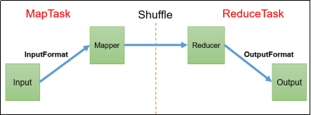
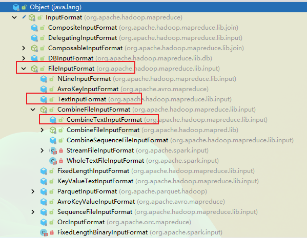
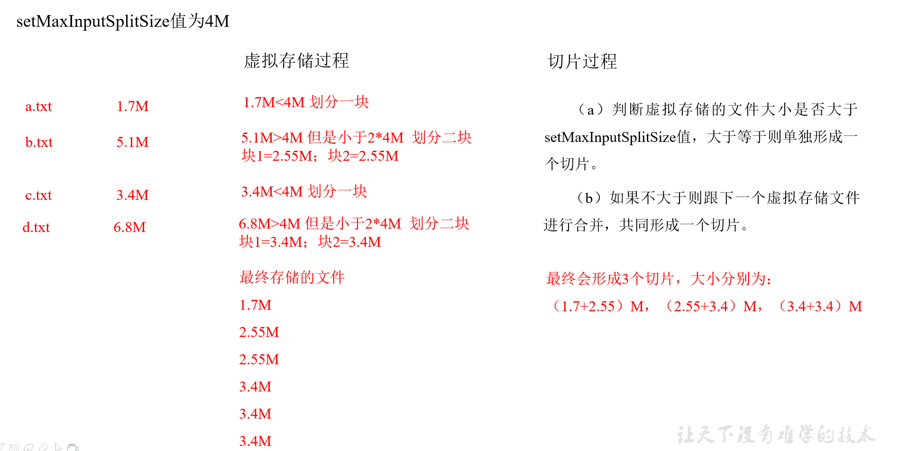
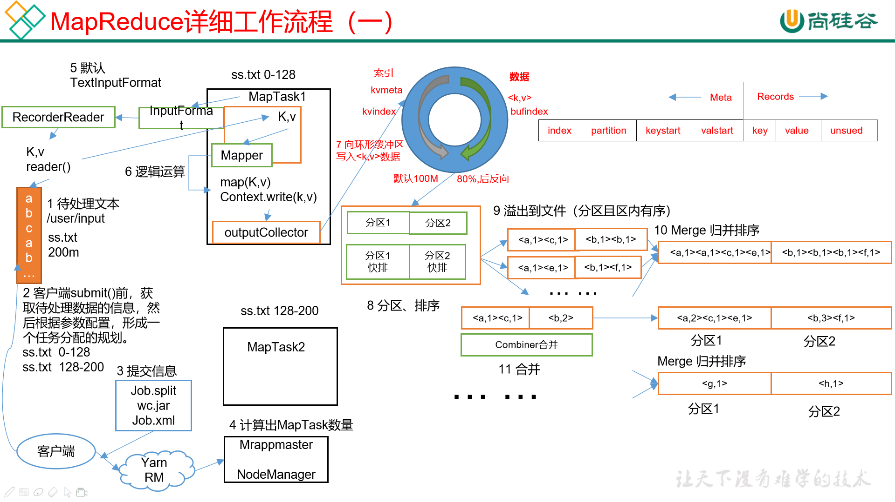
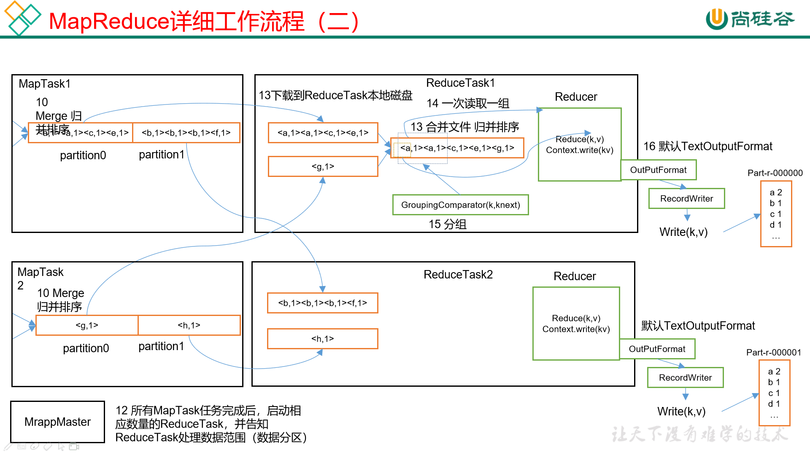
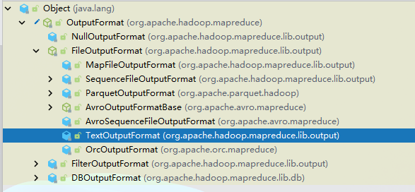
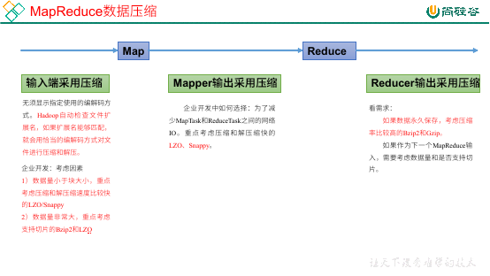

## MapReduce 起步

### 概述

**概述和优缺点**

MapReduce，一个分布式运算程序的编程框架，基于 Hadoop。它将用户的业务代码和自身的默认组件整合，形成一个完整的分布式程序。

MapReduce 的优点：

- 易于编程：实现一些接口即可完成一个分布式程序。
- 扩展性好：可以简单地增加机器来提高计算资源。
- 高容错：一台机器挂掉，它的计算任务会自动转移到另一个节点上。
- 海量数据：PB 以上的海量数据进行离线处理。

缺点：

- 不擅长实时计算：无法在毫秒或者秒内返回结果。
- 不擅长流式计算：流式计算的输入数据是动态的，而 MapReduce 处理的是静态的。
- 不擅长 DAG（有向无环图）计算：也就是说多个计算之间存在依赖关系的时候，MapReduce 计算效率低，因为中间结果全部会写入到磁盘，产生大量磁盘 IO，导致性能低下。

**MapReduce 的核心思想**

MapReduce 类似分治算法的思想，分为两个阶段：

- Map 阶段：对应 MapTask 任务，完全并行执行，互不相关。
- Reduce 阶段：对应 ReduceTask，每一个 ReduceTask 之间互不相关，完全并行执行，但是每一个 ReduceTask，依赖 MapTask 的结果，它们会将 MapTask 的结果拉取到 ReduceTask 中。

MapReduce 变成模型中，有两个阶段（Map、Reduce）而且只有这两个阶段，假如一个业务逻辑十分复杂，那么就只能多个 MapReduce 串行执行。

**MapReduce 进程**

完整的 MR（MapReduce）程序在分布式运行时有三个进程实例：

- MrAppMaster：管理整个程序运行的老大，负责过程调度和状态协调。
- MapTask：负责 Map 阶段的整个数据处理流程。
- ReduceTask：负责 Reduce 阶段的整个数据处理流程。

### 常用数据序列化类型

| Java 类型 | Hadoop Writable 类型 |
| --------- | -------------------- |
| Boolean   | BooleanWritable      |
| Byte      | ByteWritable         |
| Int       | IntWritable          |
| Float     | FloatWritable        |
| Long      | LongWritable         |
| Double    | DoubleWritable       |
| String    | Text                 |
| Map       | MapWritable          |
| Array     | ArrayWritable        |
| Null      | NullWritable         |

可以看到，除了 String 之外，Hadoop 的类型全都是 Java 类型 + Writable，非常容易记忆。

### MapReduce 编程规范

1. Mapper 阶段：

    1. 用户自定义 Mapper，需要继承父类。
    1. Mapper 输入数据为 KV 形式。
    1. Mapper 中的业务逻辑写在 `map()` 方法中。
    1. Mapper 的输出数据为 KV 键值对，KV 类型可自定义。
    1. `map()` 方法（MapTask 进程）对每一个 KV 调用一次。

1. Reduce 阶段

    1. 用户自定义 Reduce，需要继承父类。
    1. Reducer 的输入数据类型对应 Mapper 的输出数据类型，也就是 KV 键值对。
    1. Reduce 中的业务逻辑写在 `reduce()` 方法中。
    1. `reduce()` 方法（ReduceTask 进程）对每一组的 KV 调用一次。每一组 KV 指的是 K 相同但是 V 不相同的数据，也就是说相同 K 的数据会分到一组。

1. Driver 阶段：

    相当于 YARN 集群的客户端，用于提交我们整个程序到 YARN 集群，提交的是封装了 MapReduce 程序相关运行参数的 job 对象。

### 环境准备

要想在 windows 连接 Hadoop 集群实现 MapReduce 程序，需要进行环境准备：

1. 创建 maven 工程：

    ```xml
    <dependencies>
        <dependency>
            <groupId>org.apache.hadoop</groupId>
            <artifactId>hadoop-client</artifactId>
            <version>3.1.3</version>
        </dependency>
        <dependency>
            <groupId>junit</groupId>
            <artifactId>junit</artifactId>
            <version>4.12</version>
        </dependency>
        <dependency>
            <groupId>org.slf4j</groupId>
            <artifactId>slf4j-log4j12</artifactId>
            <version>1.7.30</version>
        </dependency>
    </dependencies>
    ```

1. 在 resources 目录下填写 `log4j.properties`：

    ```properties
    log4j.rootLogger=INFO, stdout
    log4j.appender.stdout=org.apache.log4j.ConsoleAppender
    log4j.appender.stdout.layout=org.apache.log4j.PatternLayout
    log4j.appender.stdout.layout.ConversionPattern=%d %p [%c] - %m%n
    log4j.appender.logfile=org.apache.log4j.FileAppender
    log4j.appender.logfile.File=target/spring.log
    log4j.appender.logfile.layout=org.apache.log4j.PatternLayout
    log4j.appender.logfile.layout.ConversionPattern=%d %p [%c] - %m%n
    ```

1. maven 打为 jar 包插件：

    ```xml
    <build>
        <plugins>
            <plugin>
                <artifactId>maven-compiler-plugin</artifactId>
                <version>3.6.1</version>
                <configuration>
                    <source>1.8</source>
                    <target>1.8</target>
                </configuration>
            </plugin>
            <plugin>
                <artifactId>maven-assembly-plugin</artifactId>
                <configuration>
                    <descriptorRefs>
                        <descriptorRef>jar-with-dependencies</descriptorRef>
                    </descriptorRefs>
                </configuration>
                <executions>
                    <execution>
                        <id>make-assembly</id>
                        <phase>package</phase>
                        <goals>
                            <goal>single</goal>
                        </goals>
                    </execution>
                </executions>
            </plugin>
        </plugins>
    </build>
    ```

### 案例

1. 首先进行一次 WordCount 作为开始，统计各个单词出现的次数：

    ```text
    atguigu atguigu
    ss ss
    cls cls
    jiao
    banzhang
    xue
    hadoop
    ```

1. 按照 MapReduce 的编程规范，分别编写 Mapper、Reducer、Driver：

    ```java
    package com.causes.mapreduce.wordcount;

    import org.apache.hadoop.io.IntWritable;
    import org.apache.hadoop.io.LongWritable;
    import org.apache.hadoop.io.Text;
    import org.apache.hadoop.mapreduce.Mapper;

    import java.io.IOException;

    /**
    * wordcount 程序的 map 阶段，四个泛型分别为：输入 K、输入 V、输出 K、输出 V
    */
    public class WordCountMapper extends Mapper<LongWritable, Text, Text, IntWritable> {

      // 因为 mapreduce 程序中，map 操作会对每一个 kv 键值对调用一次 map 方法，所以要将变量提取到类中：避免重复 new 对象，减少空间浪费。
      Text k = new Text();
      IntWritable v = new IntWritable();

      /**
      * mapreduce 阶段中，MapTask 的 map 方法，对每一个 kv 键值对都会调用一次。
      *
      * @param key 输入的 key
      * @param value 输入的 value
      * @param context 输出的值，其中 context 也必须为 kv 的形式
      */
      @Override
      protected void map(LongWritable key, Text value, Mapper<LongWritable, Text, Text, IntWritable>.Context context) throws IOException, InterruptedException {
        // 1. 获取一行的数据
        String line = value.toString();

        // 2. 将一行数据切割为单词，将单词输出
        String[] words = line.split(" ");

        // 3. 输出，这里的输出不是真正的输出，而是转向 mapreduce 的下一个阶段
        for (String word : words) {
          k.set(word);
          context.write(k,v);
        }
      }
    }
    ```

    ```java
    package com.causes.mapreduce.wordcount;

    import org.apache.hadoop.io.IntWritable;
    import org.apache.hadoop.io.Text;
    import org.apache.hadoop.mapreduce.Reducer;

    import java.io.IOException;
    import java.util.Collections;

    /**
    * mapreduce 的 reduce 阶段，四个泛型为：map 的输出 k，map 的输出 v，输出 k，输出 v
    */
    public class WordCountReducer extends Reducer<Text, IntWritable, Text, IntWritable> {

      IntWritable v = new IntWritable();

      /**
      * reduce 阶段，其中 reduce 根据分组处理数据，map 阶段输出的值，相同 key 为一组。
      *
      * @param key map 的输出 key
      * @param values  map 的输出 values，复数，是因为相同 key 会分到一组中，所以这里才是多个 value
      * @param context 输出
      */
      @Override
      protected void reduce(Text key, Iterable<IntWritable> values, Reducer<Text, IntWritable, Text, IntWritable>.Context context) throws IOException, InterruptedException {
        int count = Collections.singletonList(values).size();
        v.set(count);
        context.write(key,v);
      }
    }
    ```

    ```java
    package com.causes.mapreduce.wordcount;

    import org.apache.hadoop.conf.Configuration;
    import org.apache.hadoop.fs.Path;
    import org.apache.hadoop.io.IntWritable;
    import org.apache.hadoop.io.Text;
    import org.apache.hadoop.mapreduce.Job;
    import org.apache.hadoop.mapreduce.lib.input.FileInputFormat;
    import org.apache.hadoop.mapreduce.lib.output.FileOutputFormat;

    import java.io.IOException;

    /**
    * 有了 Map 和 Reduce，需要将它们关联起来，并且需要和集群关联起来，Driver 顾名思义，驱动
    */
    public class WordCountDriver {
      public static void main(String[] args) throws IOException, InterruptedException, ClassNotFoundException {
        // 1. 获取配置信息和获取 job 对象
        Configuration conf = new Configuration();
        Job job = Job.getInstance(conf);

        // 2. 关联本 driver 程序的 jar
        job.setJarByClass(WordCountDriver.class);

        // 3. 关联 mapper 和 reducer 的 jar
        job.setMapperClass(WordCountMapper.class);
        job.setReducerClass(WordCountReducer.class);

        // 4. 设置 mapper 输出类型
        job.setMapOutputKeyClass(Text.class);
        job.setMapOutputValueClass(IntWritable.class);

        // 5. 设置最终输出类型
        job.setOutputKeyClass(Text.class);
        job.setOutputValueClass(IntWritable.class);

        // 6. 设置输出和输出路径
        FileInputFormat.setInputPaths(job, new Path(args[0]));
        FileOutputFormat.setOutputPath(job, new Path(args[1]));

        // 7. 提交 job
        boolean result = job.waitForCompletion(true);
        System.exit(result ? 0 : 1);
      }
    }
    ```

1. 启动集群，测试。

## Hadoop 序列化

**什么是序列化**

序列化就是将内存中的对象转换为字节序列的过程，目的是方便存储到磁盘中（序列化）或者方便网络传输。

反序列化就是将磁盘中的字节序列转换为内存中的对象的过程。

**为什么不使用 Java 的序列化**

Java 的序列化是一个比较重的框架（Serializable），它不仅有对象的一些信息，而且还自带对象的各种信息（校验头、继承体系），这些信息虽然可以保证数据的安全性，但是不便于在网络中高效传输。所以 Hadoop 自己开发了一套序列化机制（Writable）。

Hadoop 序列化特点：

- 快速：读写数据的额外开销小。
- 紧凑：高效使用存储空间。
- 互操作：支持多语言的互动。

**自定义 Bean 对象实现序列化接口**

```java
/**
 * 1. 注意，必须要实现 writable 接口
 * 2. 反序列化的时候需要调用空参构造，所以需要一个空参构造
 * 3. 重写序列化方法
 * 4. 如果要将当前 Bean 对象作为 K 传递，那么必须实现排序方法，因为 Shuffle 阶段需要根据 K 排序
 */
@Data
public class FlowBean implements Writable, Comparable<FlowBean> {

  private Long upFlow;
  private Long downFlow;
  private Long sumFlow;

  /**
   * 注意，写入（序列化）的顺序和读取的顺序要保持一致
   */
  @Override
  public void write(DataOutput out) throws IOException {
    out.writeLong(upFlow);
    out.writeLong(downFlow);
    out.writeLong(sumFlow);
  }

  /**
   * 注意，反序列化的顺序要和序列化的顺序保持一致，因为不是强类型的赋值，所以这一点要格外注意
   */
  @Override
  public void readFields(DataInput in) throws IOException {
    upFlow = in.readLong();
    downFlow = in.readLong();
    sumFlow = in.readLong();
  }


  /**
   * 如果要将当前 Bean 对象作为 K 传递，那么必须要实现排序，因为 Shuffle 阶段要将 K 进行排序。
   */
  @Override
  public int compareTo(FlowBean o) {
    return this.sumFlow > o.getSumFlow() ? -1 : 1;
  }
}
```

## MapReduce 原理



从上图可以看到，MapReduce 在大体上要经过三个阶段：

- MapTask
- Shuffle
- ReduceTask

我们将要按照顺序，从 Input 开始，一直到 Output。

### InputFormat

**数据切片和 MapTask 的并行度决定机制**

MapTask 的并行度决定了 Map 阶段的任务处理的并发度，进而影响到整个 Job 的处理速度。

但是问题在于，这个 MapTask 的并行度是怎么来决定的？因为并行度并不是越多越好，一个 1K 的数据量启动 8 个 MapTask 不仅不会提升性能，反而会影响集群性能。

MapTask 的并行度其实是受以下因素影响：

- 数据块：

    数据块（Block）是 HDFS 的存储数据的单位，其实就是在物理上，将数据分为一块一块的，叫做数据块（Block）。

- 数据切片：

    数据切片是 MapReduce 程序计算时输入数据的单位，一个数据切片会启动一个 MapTask，所以 MapTask 的个数取决于数据切片的个数。

    数据切片和数据块不同，数据切片只是在逻辑上将输入进行分片，在物理上还是完整的一块。但是在默认情况下，切片的大小就等同于数据块的大小。

    举个例子，现在假设一个文件数据为 300M，假如我们将数据块大小设置为 100M（也就是说在逻辑上我们将 100M 划分为一个数据块），那么在默认情况下，分片大小等于数据块大小，这块数据在物理和逻辑上都将被分为三片，分别为 0-100M、100-200M、200-300M。

    假设我们将数据块的大小设置为 128M，那么对于这 300M 的数据，将分为三片，分别为：0-128M、128-256M、256-300M。

总结：

1. 一个 Job 的 Map 阶段并行度取决于客户端在提交 Job 时的切片数量决定。
1. 每一个 Split 切片都会分配一个 MapTask 并行处理。
1. 在默认情况下，数据切片大小和数据块大小相同，但是也可以自己设置。
1. 切片时不会去考虑数据集整体，而是对每一个文件单独进行切片。比如上传了两个文件，对每个文件都会做单独的切片处理而不是两个加到一起去考虑。

**InputFormat 的体系**



可以看到，InputFormat 是一个接口，它的下面有实现类 `FileInputFormat`，`TextInputFormat`、`CombineFileInputFormat` 等，我们将使用这几种切片类来进行举例。

**FileInputFormat**

这是一个抽象类，顾名思义，FileInputFormat 是根据文件来进行切片的，切片的详细流程都在 `getSplits` 这个方法中：

1. 程序首先找到存储数据的目录。
1. 开始遍历处理目录下的所有文件。

    遍历第一个文件：

    - 获取文件大小：`fs.sizeOf()`
    - 计算切片大小：`computeSplitSize(blockSize, minSize, maxSize);`
    - 默认情况下，切片大小 = blockSize。
    - 开始切片，注意每次切片时，都要注意当切片是不是大于块大小的 1.1 倍，假如不超过 1.1 倍则划分为一个切片。
    - 将切片信息写入到一个切片规划文件中。

    遍历第二个文件，如上……

注意：

1. `InputSplit` 仅仅记录和切片的元数据信息，例如长度、起始位置、所在的节点列表等。
1. 提交切片规划文件到 YARN 上，YARN 上的 MrAppMaster 就可以根据切片规划文件计算开启 MapTask 的个数。


总结：

1. FileInputFormat 仅仅是简单地按照文件的内容长度进行切片。
1. 切片大小默认为 Block 的大小。
1. 切片时不考虑数据的整体，只考虑每一个文件，根据每一个文件进行单独切片。

案例：输入两个文件：`file1.txt - 320M`，`file2.txt - 10M`。经过切片机制运算之后，得到如下信息：

    file1.txt.split1 - 0~128
    file1.txt.split2 - 128~256
    file1.txt.split3 - 256~320

    file2.txt.split1 - 0~10


**TextInputFormat**

FileInputFormat 是一个抽象类，它常见的实现类有 `TextInputFormat`、`KeyValueTextInputFormat`、`NLineInputFormat`、`CombineTextInputFormat`、自定义的 InputFormat 等。

TextInputFormat 是默认的 FileInputFormat 的实现类，它的实现方式就是按行去读取每一条记录，key 是当前行在文件中的起始字节偏移量，LongWritable 类型；value 是该行的值（没有回车、换行），Text 类型。

例如：

```text
Rich learning form
Intelligent learning engine
Learning more convenient
From the real demand for more close to the enterprise
```

那么按照 TextInputFormat 的读取方式，它是这样的：

```text
(0,Rich learning form)
(20,Intelligent learning engine)
(49,Learning more convenient)
(74,From the real demand for more close to the enterprise)
```

**CombineTextInputFormat**

默认的 TextInputFormat 是针对文件划分，不管文件多小，都会是一个单独的切片，都会交给一个 MapTask。这样做是优缺点的，如果有大量的小文件，那么就会产生大量的 MapTask，大量的 MapTask 占用大量的内存，这样完全够不上成本。

针对这种处理十分低下的切片机制，出现了 `CombineTextInputFormat`，它适用于小文件过多的场景，可以将多个小文件从逻辑上规划到一个切片中，这样一来，多个小文件就可以规划到一个 MapTask 来处理，效率增加了。

可以使用 `CombineTextInputFormat.setMaxInputSplitSize(job, 切片大小);` 来设置虚拟存储切片的最大值。



### MapReduce

一个文件经过多个切片，每一个切片都会形成一个 MapTask，而每一个 MapTask 都会进行之前的 Map 程序，也就是说，直到 Reduce 阶段之前，Map 应当是多个并行的，这里为了方便查看只列出了一个 MapTask 的内容。



着重说一下环形缓冲区的内容，环形缓冲区同样是在 Map 阶段的，也就是说每一个 MapTask 都会有一个环形缓冲区，默认大小为 100M，可以使用 `mapreduce.task.io.sort.mb` 调节，但是注意每一个分片默认就是 128M，不需要设置太大。

在 Mapper 类使用 `write()` 方法之后，其实不会立刻到达 Reduce，而是会首先到达一块叫做环形缓冲区的内存区域。


环形缓冲区分为三块区域：

- 空闲区
- 数据区
- 索引区

初始位置为上图白色的部分，叫做赤道。初始状态下，索引和数据均为 0，所有空间均为空闲状态。环形缓冲区开始写入的时候，数据在赤道右边写入，索引在赤道左边写入（索引每次申请 4KB）。

在数据大小写到了 80%（参数 `mapreduce.map.sort.spill.percent` 设置）的时候，会同时进行以下两个动作：

1. 对已经写入的数据进行排序，排序好之后将索引和数据全都写到磁盘上去，形成一个文件（比如 `sort00`）。这个文件是带有分区性质的文件，并且经过了排序操作，分区间的数据是有序的。
1. 在空闲的 20% 的空间里，重新算出一个新的赤道，然后在新赤道的右边写数据，左边写索引。注意，当空闲的 20% 已经写满之后，假如 80% 的数据还没有写完成，那么只能等待，等到空间腾出来之后继续写。

环形缓冲区不需要申请新的内存空间，始终用的都是这个，避免了 Full GC 的问题，也避免了频繁申请内存的问题。

环形缓冲区过后，就是将每一个分区间，刚才使用环形缓冲区进行排序的文件合并。

合并之后有一步操作是 combiner 合并，这个步骤是可选的，combiner 这个步骤并不是排序，而是类似于 reduce，只不过在这个阶段属于预处理阶段。

我们都知道，在 map 阶段之后就会进入 reduce，map 阶段有很多 MapTask，但是 reduce 阶段的 ReduceTask 要远远少于 MapTask。

也就是说，在 reduce 过程中，大量的数据都会被拉取到同一个服务器进行处理，假如数据过大，就会对网络和服务器造成影响，进而可能会导致各种各样的问题。

假如我们可以在 Map 阶段就对数据进行一定的处理，如果提前做出合并，那么就相当于减轻 reduce 阶段的压力。

但是注意，并不是所有的数据操作都可以使用 combiner 的，比如相加的操作可以使用，但是求平均值的操作就不行。所以 combiner 操作是可选项。



### Shuffle

**Shuffle**

在 map 方法之后，reduce 之前的数据处理过程称为 Shuffle，也就是从环形缓冲区到 Combiner 的位置。


**Partition**

Partition，分区。如果我们需要根据不同的条件，将结果分到不同的文件中，那么这个过程就叫做分区。

默认的分区是按照 `hashCode()` 来进行的分区，也就是：

```java
public class HashPartitioner<K, V> extends Partitioner<K, V> {

  /** Use {@link Object#hashCode()} to partition. */
  public int getPartition(K key, V value, int numReduceTasks) {
    return (key.hashCode() & Integer.MAX_VALUE) % numReduceTasks;
  }
}
```

假如我们需要自己手动定义一个 Partitioner，需要继承 Partitioner，重写 `getPartition()`。

举例：根据手机号码的归属地，将相同省份的手机号码放到一个文件中，按照省份划分不同的文件。

1. 自定义分区器，重写方法：

    ```java
    public class CustomPartitioner extends Partitioner<Text, FlowBean> {

      /**
      * 控制分区逻辑，返回值即分区
      */
      @Override
      public int getPartition(Text text, FlowBean flowBean, int numPartitions) {
        return 0;
      }
    }
    ```
1. 在 Job 驱动中，设置自定义的 partitioner

    ```java
    job.setPartitionerClass(CustomPartitioner.class);
    ```

1. 根据 partitioner 设置对应的 reduceTask

    ```java
    job.setNumReduceTasks(num);
    ```

之前在讲解 MapTask 数量的影响因素时，曾经说到文件的切片数量是最终 MapTask 的个数。

ReduceTask 也有它的影响因素，就是参数 `job.setNumReduceTasks(num)`，比起 MapTask 来说比较好理解，但是它和分区息息相关，有如下注意点：

- 如果 `ReduceTask 数量 > 分区数量`，则会产生几个空的输出文件。
- 如果 `1 < ReduceTask < 分区数量`，则有一部分分区数据无处安放，就会抛出异常。
- 如果 `ReduceTask = 1`，那么无论分区数量为多少，都会放到一个文件中。
- 分区号必须从 0 开始累加，逐渐递增。

**WritableComparable**

WritableComparable，排序，这是 MapReduce 中最重要的操作之一。

在执行 MapTask 和 ReduceTask 的过程中均会对数据进行排序，而且是按照 key 进行排序。所有的数据都会被排序，无论在业务上是否需要，这是 Hadoop 的默认行为。

- MapTask：

    在环形缓冲区的内容到达阈值（80%）并且溢写到磁盘之前，对缓冲区的数据进行一次快速排序。

    在环形缓冲区中所有数据处理完毕之后，会对磁盘上的所有文件进行一次归并排序。

- ReduceTask：

    在从 MapTask 拷贝数据文件到内存，假如文件超过一定阈值则溢写到磁盘上。

    如果磁盘上的文件到达一定阈值，则进行一次归并排序成为一个更大的文件。

    在所有数据拷贝完成之后，ReduceTask 会对内存和磁盘上的所有数据进行一次归并排序。

自定义排序：MapReduce 的 Key 必须为可排序字段，当 Bean 对象作为 Key 值传输的时候，那么就要重写 `compareTo` 方法，这样即可实现排序：

```java
/**
 * 1. 注意，必须要实现 writable 接口
 * 2. 反序列化的时候需要调用空参构造，所以需要一个空参构造
 * 3. 重写序列化方法
 * 4. 如果要将当前 Bean 对象作为 K 传递，那么必须实现排序方法，因为 Shuffle 阶段需要根据 K 排序
 */
@Data
public class FlowBean implements Writable, Comparable<FlowBean> {

  private Long upFlow;
  private Long downFlow;
  private Long sumFlow;

  /**
   * 注意，写入（序列化）的顺序和读取的顺序要保持一致
   */
  @Override
  public void write(DataOutput out) throws IOException {
    out.writeLong(upFlow);
    out.writeLong(downFlow);
    out.writeLong(sumFlow);
  }

  /**
   * 注意，反序列化的顺序要和序列化的顺序保持一致，因为不是强类型的赋值，所以这一点要格外注意
   */
  @Override
  public void readFields(DataInput in) throws IOException {
    upFlow = in.readLong();
    downFlow = in.readLong();
    sumFlow = in.readLong();
  }


  /**
   * 如果要将当前 Bean 对象作为 K 传递，那么必须要实现排序，因为 Shuffle 阶段要将 K 进行排序。
   */
  @Override
  public int compareTo(FlowBean o) {
    return this.sumFlow > o.getSumFlow() ? -1 : 1;
  }
}
```

在 Hadoop 中，根据不同排序形成的最终效果，将排序分为以下几类:

- 部分排序：文件内有序，MapReduce 根据输入记录的键对数据集进行排序操作，保证*每个文件*内部有序。
- 全排序：输出结果仅有一个文件，且文件内有序。实现方式就是只使用一个 ReduceTask，不推荐这种做法，因为完全丧失了 MapReduce 的并行架构。
- 辅助排序：也叫做分组排序，组内有序，在 Reduce 端对 Key 进行分组，通常在接受 Bean 对象时，按照 Bean 对象的某个字段或者某几个字段进行分组，组内有序。
- 二次排序：自定义排序过程中，假如 `compareTo` 判断条件为两个就叫做二次排序。

**Combiner**

其实之前在讲 MapTask 的环形缓冲区后，提了一次 Combiner。

简单来说，Combiner 和 Reduce 的功能差不多，但是它们之前是有区别的：

- 严格来讲，Combiner 在 MR 代码层面上不属于 Mapper 类也不属于 Reducer 类，而是另一个组件。
- Combiner 的父类其实就是 Reducer，虽然代码上是分别实现的，但其实用到的还是 Reducer，这样做的好处是可以让你自由选择是否实现。
- Combiner 运行在 MapTask 节点上，Reducer 运行在 ReduceTask 上。

Combiner 的主要意义就是用于每一个 MapTask 的汇总，用于减少网络传输，减少 ReduceTask 的压力。

注意，不是所有的业务都适合使用 Combiner 来实现的，比如算一个平均值的例子，每个 MapTask 先算出各自的平均值，和最后预料的肯定会有差异。所以要十分清楚业务是否可以使用 Combiner。

自定义 Combiner：

1. 自定义一个 Combiner，继承 Reducer，重写 Reduce 方法。

    ```java
    public class CustomCombiner extends Reducer<Text, IntWritable, Text, IntWritable> {

      private IntWritable out = new IntWritable();

      /**
      * 相加的操作肯定可以首先利用 Combiner 来实现
      */
      @Override
      protected void reduce(Text key, Iterable<IntWritable> values, Reducer<Text, IntWritable, Text, IntWritable>.Context context) throws IOException, InterruptedException {
        int sum = 0;
        for (IntWritable value : values) {
          sum += value.get();
        }
        out.set(sum);
        context.write(key, out);
      }
    }
    ```

1. 在 Job 中设置。

    ```java
    job.setCombinerClass(CustomCombiner.class);
    ```

### OutputFormat

经过了 InputFormat、Map、Shuffle、Reduce 之后，文件应该输出了。文件输出就是利用了 OutputFormat，默认情况下使用的是 `TextOutputFormat`。



这个输出默认情况下还好，但是一旦我们想要输出到多种数据源中（比如 MySQL、HBase、ElasticSearch），这个就不太好用了，需要自定义 OutputFormat。

自定义 OutputFormat：

1. 继承 `FileOutputFormat`

    ```java
    public class CustomOutputFormat extends FileOutputFormat<Text, NullWritable> {
      @Override
      public RecordWriter<Text, NullWritable> getRecordWriter(TaskAttemptContext job) throws IOException, InterruptedException {
        // 自定义一个新 RecordWriter 的返回
        OutputWriter writer = new OutputWriter(job);
        return writer;
      }
    }
    ```

1. 改写 `RecordWriter`

    ```java
    class OutputWriter extends RecordWriter<Text, NullWritable> {

      FSDataOutputStream outPutStream;

      public OutputWriter(TaskAttemptContext job) {
        try {
          // 获取文件系统
          FileSystem fs = FileSystem.get(job.getConfiguration());
          // 创建输出目录
          outPutStream = fs.create(new Path("d:/tmp/log.log"));
        } catch (IOException e) {
          e.printStackTrace();
        }
      }

      @Override
      public void write(Text key, NullWritable value) throws IOException, InterruptedException {
        // 输出到对应目录
        outPutStream.writeBytes(key.toString());
      }

      @Override
      public void close(TaskAttemptContext context) throws IOException, InterruptedException {
        // 关闭流
        IOUtils.closeStream(outPutStream);
      }
    }
    ```
::: tip
TODO：Join
:::

## Hadoop 数据压缩

- 压缩的优劣：

    压缩可以减少磁盘 IO，减少磁盘存储空间，但缺点是增加 CPU 的开销。

- 压缩的原则：

    对于运算密集型的 Job 少用压缩，对于 IO 密集型的 Job 多用压缩。

**MR 支持的压缩编码**

| 压缩格式 | 是否为 Hadoop 自带 | 算法    | 文件名扩展 | 是否可切片 | 切换压缩格式后程序是否需要修改       |
| -------- | ------------------ | ------- | ---------- | ---------- | ------------------------------------ |
| DEFAULT  | 是，可直接使用     | DEFAULT | .default   | 否         | 无需修改                             |
| GZip     | 是，可直接使用     | DEFAULT | .gz        | 否         | 无需修改                             |
| bzip2    | 是，可直接使用     | bzip2   | .bz2       | 是         | 无需修改                             |
| LZO      | 否，需要额外安装   | LZO     | .lzo       | 是         | 需要修改，需要建立索引，指定输入格式 |
| Snappy   | 是，可直接使用     | Snappy  | .snappy    | 否         | 无需修改                             |


**压缩性能**

| 压缩算法 | 原始文件 | 压缩文件 | 压缩速度 | 解压速度 |
| -------- | -------- | -------- | -------- | -------- |
| gzip     | 8.3G     | 1.8G     | 17.5MB/s | 58MB/s   |
| bzip2    | 8.3G     | 1.1G     | 2.4MB/s  | 9.5MB/s  |
| LZO      | 8.3G     | 2.9G     | 49.3MB/s | 74.6MB/s |

**压缩位置**

压缩可以在 MapReduce 作用的任意阶段启用。



**编码器和解码器**

为了支持多种压缩和解压缩算法，Hadoop 引入和编码器和解码器。

| 压缩格式 | 编码器/解码器                              |
| -------- | ------------------------------------------ |
| DEFLATE  | org.apache.hadoop.io.compress.DefaultCodec |
| gzip     | org.apache.hadoop.io.compress.GzipCodec    |
| bzip2    | org.apache.hadoop.io.compress.BZip2Codec   |
| LZO      | com.hadoop.compression.lzo.LzopCodec       |
| Snappy   | org.apache.hadoop.io.compress.SnappyCodec  |

**Hadoop 启用压缩**

| 参数                                                                        | 默认值                                         | 阶段        | 建议                                          |
| --------------------------------------------------------------------------- | ---------------------------------------------- | ----------- | --------------------------------------------- |
| io.compression.codecs（在core-site.xml中配置）                              | 无，这个需要在命令行输入hadoop checknative查看 | 输入压缩    | Hadoop使用文件扩展名判断是否支持某种编解码器  |
| mapreduce.map.output.compress（在mapred-site.xml中配置）                    | false                                          | mapper输出  | 这个参数设为true启用压缩                      |
| mapreduce.map.output.compress.codec（在mapred-site.xml中配置）              | org.apache.hadoop.io.compress.DefaultCodec     | mapper输出  | 企业多使用LZO或Snappy编解码器在此阶段压缩数据 |
| mapreduce.output.fileoutputformat.compress（在mapred-site.xml中配置）       | false                                          | reducer输出 | 这个参数设为true启用压缩                      |
| mapreduce.output.fileoutputformat.compress.codec（在mapred-site.xml中配置） | org.apache.hadoop.io.compress.DefaultCodec     | reducer输出 | 使用标准工具或者编解码器，如gzip和bzip2       |
