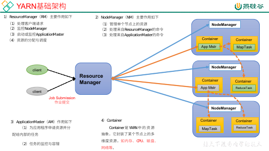
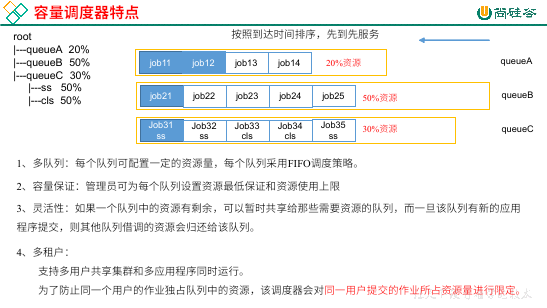
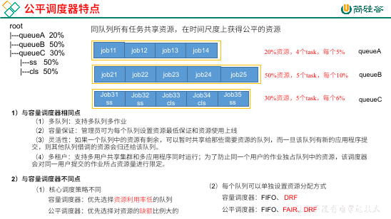

## Yarn 概述

**Yarn 概述**

Yet Another Resource Negotiator，另一种资源调度器，简称 Yarn。

在 Hadoop 中，之前的 MapReduce 组件是进行数据的计算，但是有个问题：数据的计算必须要使用服务器的资源，那么服务器的资源是由什么来进行管理的呢？

在 Hadoop1.x 时代，资源的调度和数据的计算全都是由 MapReduce 来进行管理的，但是在 Hadoop2.x 时代，将资源的调度从 MapReduce 中分离，形成了 Yarn 这一单独的组件。

**Yarn 的基础架构**

Yarn 的架构如下：

- ResourceManager：

    简称 RM，作用是：

    - 处理客户端请求。
    - 监控 NodeManager。
    - 启动及监控 ApplicationMaster。
    - 资源的分配和调度。

- NodeManager：

    简称 NM，作用是：

    - 管理单个节点上的资源。
    - 处理来自 ResourceManager 的请求。
    - 处理来自 ApplicationMaster 的请求。

- ApplicationMaster：

    简称 AM，作用是：

    - 为应用程序申请资源，并且给内部分配任务。
    - 任务的监控与容错。

- Container：

    它是资源的抽象，我们将 内存、CPU、磁盘、网络 等资源看成 Container，任务在 Container 中运行。

综上，可以简单地看出，RM 是整个集群资源的老大，NM 是单个节点资源的老大，AM 是每个 Job 资源的老大，Container 是具体资源的抽象。

**Yarn 的工作机制**

1. MR 程序提交到客户端所在的节点，使用 `waitForCompletion()` 之后，在集群环境下会 new 一个 `YarnRunner`，用于将程序提交到 Yarn 中。
1. YarnRunner 会向 RM 申请一个 Application，RM 返回给一个资源路径和 applicationId。
1. 客户端提交资源（`jar`、切片信息、配置文件）到 HDFS 的 `路径/applicationId`。
1. 客户端发送给 Yarn 资源提交完毕的消息，申请运行 MR AM。
1. RM 将请求初始化为一个 Task 放到其内部的容器队列（容器调度器）中。
1. RM 将队列中的 Task 分配给一个 NM。
1. NM 创建 Container，产生 MR AM。
1. Container 从 HDFS 上拷贝资源到本地。
1. MR AM 向 RM 申请运行 MapTask。
1. RM 将 MapTask 分给 NM（此 NM 可能有一个或多个，可能在同一台机器上也可能不同）。
1. 得到任务的 NM 领取任务，分别创建 Container。
1. AM 向执行任务的 NM 发送程序执行脚本，程序开始执行。
1. MapTask 执行完毕，AM 向 RM 申请运行 ReduceTask。
1. RM 将 ReduceTask 分给 NM。
1. NM 领取任务并创建 Container。
1. ReduceTask 从 MapTask 中获取对应分区的数据。
1. 程序运行完毕，MR 向 RM 申请注销。

## Yarn 调度器和调度算法

之前讲 Yarn 工作机制的时候，有一个过程是：客户端申请运行 MR AM 的时候，RM 会将请求初始化为一个 Task 放到容器调度器中。

Hadoop 的容器调度器有三种：

- FIFO：先进先出。
- Capacity Scheduler：容量调度器，apache 版本的 Hadoop 默认。具体参数可以到 `yarn-default.xml` 查看 `yarn.resourcemanager.scheduler.class` 选项，就是 `Capacity Scheduler`。
- Fair Scheduler：公平调度器，CDH 版本的 Hadoop 默认。

**FIFO**

调度器如名，Task 按照到达 RM 的时间被排序，先进来的先服务。只有一个单队列，生产环境中很少使用。

**Capacity Scheduler**

Yahoo 开发的多用户调度器。

- 有多个队列。
- 可以分别设置每个队列的资源上下限。
- 有富裕资源的队列可以暂时共享给其他需要资源的队列，但是一旦需要资源会将资源取回。
- 支持多用户和多应用执行。该调度器会对单个用户提交的作业所占资源量进行限制。

容量调度器中，任务的优先级执行顺序是按照资源的利用率来进行资源调度的。资源利用率低的队列会优先分配。

**Fair Scheduler**

Facebook 开发的多用户调度器。顾名思义，十分公平。它的核心思想就是让队列中的所有任务在时间上公平。

与容量调度器的相同点：

- 多队列。
- 可以为每个队列设置资源上下限。
- 有富裕资源的队列可以暂时共享资源给需要资源的队列，但是一旦需要资源会将资源取回。
- 支持多用户同时运行，并且会对同一个用户所占资源量进行限制。

---

缺额，这其实是说，在一个任务进入队列之后，这个任务不一定能够得到需要的所有资源，可能只得到一半或者其他，总之不会是百分百。这种情况就叫做缺额，也就是拿到的少于期望的资源量。

虽然公平调度器的主要原则是最终在时间上看，每一个任务所分配的资源都几乎相同，但是任务和任务之间总会有一个优先级的概念，也就是谁先执行，谁后执行。

在公平调度器的调解下，缺额比较大的队列优先分配资源。

---

公平调度器有三种队列资源的分配方式：

- FIFO：

    在这种情况下，相当于容量调度器。

- Fair：

    默认策略。

- DRF：

    可以针对不同应用进行不同资源的比例限制。
