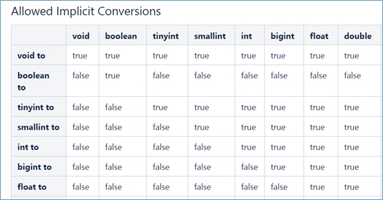
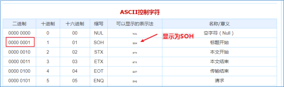
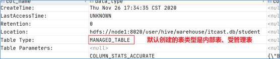
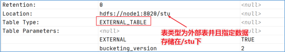
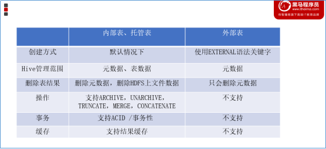
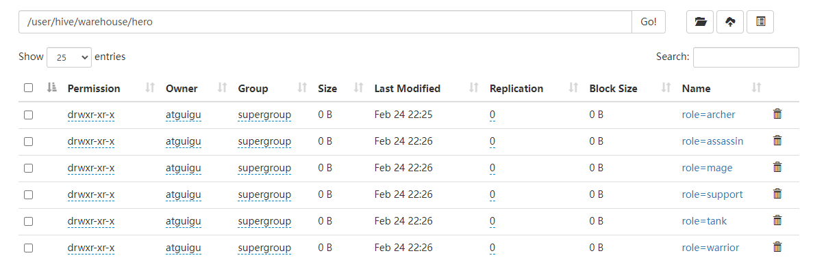

## DDL 概述

数据定义语言：Data Definition Language，DDL，是 SQL 中对数据库内部对象（数据库 schema、数据表 table、数据视图 view、索引 index）的结构进行增删改的操作语言。

核心语法即：`CREATE`、`ALTER`、`DROP` 等。

HQL 基本和 SQL 相同，在此基础上添加了一些特有的语法，例如分区 partition。

## DDL 基础

### Hive 数据类型

**完整建表语法**

```sql
CREATE [TEMPORARY] [EXTERNAL] TABLE [IF NOT EXISTS] [db_name.]table_name
[(col_name data_type [COMMENT col_comment], ……)]
[COMMENT table_comment]
[PARTITIONED BY (col_name data_type [COMMENT col_comment], ……)]
[CLUSTERED BY (col_name, col_name, ……) [SORTED BY (col_name [ASC|DESC], ……)] INTO num_buckets BUCKETS]
[ROW FORMAT DELIMITED [FIELDS TERMINATED BY char] [COLLECTION ITEMS TERMINATED BY char]  [MAP KEYS TERMINATED BY char] [LINES TERMINATED BY char] | SERDE serde_name WITH SERDEPROPERTIES (property_name=property_value, ……)]
[STORED AS file_format]
[LOCATION hdfs_path]
[TBLPROPERTIES (property_name=property_value, ……)]
```

大写字母为关键字。中括号内语法表示可选。分隔符表示左右语法二选一。

---

**Hive 数据类型**

Hive 中，数据类型分为：

- 原生数据类型：数值、时间、字符串、杂项。

    

- 复杂数据类型：array 数组、map 映射、struct 结构、union 联合体。

    

::: tip

- Hive 对英文字母大小写不敏感，除了 SQL 数据类型还支持 Java 数据类型（例如 String）。
- 复杂类型的使用通常和分隔符语法配合。
- 如果定义的数据类型不一致，Hive 会尝试隐式转换，但是不一定能成功

    

- 除了隐式转换之外，还可以使用 `CAST` 来进行显式类型转换 CAST(数据字段 AS 新类型)，例如 `CAST ('INT' AS INT)` 强制转为 INT 类型，但是转换失败，返回 NULL。
:::

### Hive 读写文件机制

**SerDe**

SerDe，是 Serializer、Deserializer 的简称目的是序列化（对象到字节码）和反序列化（字节码到对象）。Hive 可使用 SerDe 进行对象的读取和写入。

**Hive 读写文件流程**

Hive 读取文件：调用 InputFormat（Hadoop 默认是使用 TextInputFormat），返回 KV 键值对，然后调用 SerDe（默认是 LazySimpleSerDe），将 value 根据分隔符切分为各个字段。

Hive 写文件：调用 SerDe（默认是 LazySimpleSerDe）转为字节序列，然后调用 OutputFormat 写入 HDFS。

**SerDe 相关语法**

`[ROW FORMAT DELIMITED | SERDE]`

其中，`ROW FORMAT` 为关键字，DELIMITED 和 SERDE 二选一。

`DELIMITED` 表示使用默认的 SERDE 类：`LazySimpleSerDe` 类来进行数据处理。假如数据格式特殊，可以使用 `ROW FORMAT SERDE serde_name` 指定其他的 SERDE 类来进行处理，甚至还可以自定义 SERDE 类。

**LazySimpleSerDe**

LazySimpleSerDe 是 Hive 中默认的序列化类，可以指定字段之间、集合元素之间、map 映射之间、换行之间的分隔符，在建表的时候可以灵活搭配。


::: tip

假如没有指定默认的 `ROW FORMAT`，那么默认的字段分隔符是 `\001`，使用的是 ASCII 编码，显示为 `SOH`，在 vim 中显示为 `^A`。使用键盘无法打出。



:::

### Hive 数据存储

**默认存储路径**

Hive 默认存储在 `${HIVE_HOME}/conf/hive-site.xml` 配置文件的 `hive.metastore.warehouse.dir` 中指定，默认值为 `/user/hive/warehouse`。

Hive 的库、表均存储在此路径下。

**指定存储路径**

在 Hive 建表时可使用 `LOCATION ${location}` 指定在 HDFS 上的路径。

## DDL 深入

### Hive 内外表

**Hive 内部表**

内部表，Internal Table，被称为被 Hive 拥有和管理的托管表，默认创建的就是内部表。

当删除内部表时，Hive 会同时删除内部表的数据和内部表的元数据。

使用 `DESCRIBE FORMATTED ${table_name}` 查看表的描述信息，进而查看表的类型，其中 Table Type 为 `MANAGED_TABLE` 表示的就是内部表。



**Hive 外部表**

外部表，External Table，它的元数据被 Hive 管理但是实际数据不会被 Hive 管理。

简单来说，删除外部表不会删除表的数据，只会删除表的元数据。

外部表需要使用关键字 `EXTERNAL` 声明，并且一般搭配 `LOCATION` 指定数据的具体路径。

使用 `DESCRIBE FORMATTED ${table_name}` 查看表的描述信息，进而查看表的类型，其中 Table Type 为 `EXTERNAL_TABLE` 表示的就是外部表。



**内外表的其他区别**

除了数据管理的区别之外，它们还有其他区别：




**内外表互相转换**

```sql
-- 修改表为外部表
ALTER TABLE hero SET tblproperties ('EXTERNAL'='TRUE');
-- 查询表，此时 Table Type 一栏中已经变为了 EXTERNAL_TABLE，代表外部表
DESC FORMATTED hero;

-- 设置表为内部表，此时 Table Type 一栏中变为了 MANAGED_TABLE，代表内部表，也就是受管理的表
ALTER TABLE hero SET tblproperties ('EXTERNAL'='FALSE');
```

### Hive 分区

**分区概念**

之前我们提到过分区这个概念，分区其实是为了帮助数据查找的一种手段。

比如，我们将一年的数据根据月份划分为十二个分区，在物理上，不同分区的数据会存储到 HDFS 中的不同文件夹下面。这样一来，查询某个月份的分区就只需要从某个文件夹下面查找，避免了全部数据的扫描。

分区需要使用 `PARTITIONED BY` 关键字指定按照什么字段进行分区：

```sql
CREATE TABLE hero(
    id int,
    name string
) PARTITIONED BY (role string)
ROW FORMAT DELIMITED
FIELDS TERMINATED BY "\t";
```

上面这张表 hero 存在 id 和 name 两个字段，使用 `role` 字段进行分区，使用 DELIMITED 代表的 LazySimpleSerDe 进行文件读写，使用 "\t" 作为分隔符。

需要注意的是，分区字段 `role` 不能是表中已经存在的字段，因为最终分区字段也会以一种虚拟字段的形式显示在表结构上。

分区也分为静态分区和动态分区：

- 静态分区：在创建表的时候手动指定分区字段和分区值。
- 动态分区：基于查询结果动态推断出分区字段和分区值。

**静态分区**

之前已经说明了，静态分区是手动指定的分区字段和分区值，那么首先就要创建一个表：

```sql
CREATE TABLE hero (
      id int,
      name string,
      hp_max int,
      mp_max int,
      attack_max int,
      defense_max int,
      attack_range string,
      role_main string,
      role_assist string
) PARTITIONED BY (role string)
ROW FORMAT DELIMITED
FIELDS TERMINATED BY "\t";
```

之后进行数据的导入，在导入时指定字段的静态分区，语法为：`LOAD DATA [LOCAL] INPATH '' INTO TABLE ${table_name} PARTITION (${partition_key}=${partition_value})`

LOAD 表示加载数据，之后详解。LOCAL 则表示从本地文件系统加载，默认是 HDFS 加载。

```sql
LOAD DATA LOCAL INPATH '/tmp/hero/archer.txt' INTO TABLE hero PARTITION (role='archer');
LOAD DATA LOCAL INPATH '/tmp/hero/assassin.txt' INTO TABLE hero PARTITION (role='assassin');
LOAD DATA LOCAL INPATH '/tmp/hero/mage.txt' INTO TABLE hero PARTITION (role='mage');
LOAD DATA LOCAL INPATH '/tmp/hero/support.txt' INTO TABLE hero PARTITION (role='support');
LOAD DATA LOCAL INPATH '/tmp/hero/tank.txt' INTO TABLE hero PARTITION (role='tank');
LOAD DATA LOCAL INPATH '/tmp/hero/warrior.txt' INTO TABLE hero PARTITION (role='warrior');
```

以上情况加载了文件，在 HDFS 上将会有分区，分别存储对应的文件：




**动态分区**

启用动态分区，首先要在 hive 的 session 中设置两个参数：

```
-- 开启动态分区
SET hive.exec.dynamic.partition=true;
-- 指定动态分区的模式为非严格模式，非严格模式下不必有静态分区；严格模式设置为 strict，要求至少有一个分区为静态分区。
SET hive.exec.dynamic.partition.mode=nonstrict;
```

执行动态分区，其实是执行的动态分区 + 插入，核心就是 `INSERT + SELECT`。

```sql
-- 创建表，这里的内容和之前的静态分区的 hero 表相同
CREATE TABLE dynamicHero(
    id int,
    name string,
    hp_max int,
    mp_max int,
    attack_max int,
    defense_max int,
    attack_range string,
    role_main string,
    role_assist string
) PARTITIONED BY (role string)
ROW FORMAT DELIMITED
FIELDS TERMINATED BY "\t";

-- 执行动态分区插入，核心思想是使用 INSERT + SELECT
-- 分区值将会通过返回字段的位置确定，普通的为 tmp.*，之后的 role 就是 tmp.role_main
INSERT INTO TABLE dynamicHero PARTITION(role)
SELECT tmp.id, tmp.name, tmp.hp_max, tmp.mp_max, tmp.attack_max, tmp.defense_max, tmp.attack_range, tmp.role_main, tmp.role_assist, tmp.role_main FROM hero tmp;
```

动态分区在插入的时候会使用位置自动推断。

之前讲过，分区字段 hero 在表现上也会占用一个字段，也就是说从我们的角度看，hero 表有四个字段：id、name、role_main、role。

以上这段 SQL 在查询的时候，首先会查询出原有的三个字段，分别对应着 id、name、role_main，之后我们查询出的 tmp.role_main 将会被分配到 hero 字段上，所以在分配分区的时候其实是根据 role_main 来分配的。

**分区的本质**

之前说过，分区的本质其实就是将分区分为了多个文件夹，数据存放到不同的分区文件夹中，分区文件夹的名字为 `分区字段=分区值`。

分区字段是虚拟字段，数据不会存储在底层文件中。分区本质上是一种优化手段，是可选项。Hive 支持在分区的基础上继续分区，也就是多重分区。

**多重分区**

在多重分区下，分区是一种递进关系，在物理上表现为：在分区文件夹下面继续划分子分区文件夹。

创建多重分区只需要指定多个 partition，比如：`CREATE TABLE hero(...) PARTITIONED BY (partition1 string, partition2 string, ...)`

常见的多重分区，例如按照地区划分（省市县）、按照时间划分（年月日）等。

### Hive 分桶

**分桶概念**

分桶表也叫做桶表，来源于 bucket。Hive 的分桶也是一种优化手段，不过和分区不同，分区是将数据分到多个文件夹下存储，但分区文件夹下面还是一份文件；分桶则是将一个分区中的数据分为多个文件。

桶的编号相同就会分到同一个 bucket 中。

**分桶语法**

```sql
[CLUSTERED BY (${col_name}) [SORTED BY (${col_name ASC|DESC})] INTO N BUCKETS];
```

`CLUSTERED BY (${col_name}) SORTED BY (${col_name ASC|DESC})` 表示根据什么字段进行分，`INTO N BUCKETS` 表示分为 N 桶。

注意，和分区表不同，分桶表的字段必须是表中已经存在的字段。

```sql
-- 分桶，分桶表的字段必须为表中已经存在的字段
-- 按照 ID 划分为 5 桶
CREATE TABLE IF NOT EXISTS bucketHero(
    id int,
    name string,
    hp_max int,
    mp_max int,
    attack_max int,
    defense_max int,
    attack_range string,
    role_main string,
    role_assist string
) CLUSTERED BY (id) INTO 5 BUCKETS;

INSERT INTO bucketHero SELECT id, name, hp_max, mp_max, attack_max, defense_max, attack_range, role_main, role_assist FROM hero;

-- 按照 ID 划分为 5 桶，并且按照 attack_max 进行排序
CREATE TABLE IF NOT EXISTS bucketHeroWithSort (
    id int,
    name string,
    hp_max int,
    mp_max int,
    attack_max int,
    defense_max int,
    attack_range string,
    role_main string,
    role_assist string
) CLUSTERED BY (id) SORTED BY (attack_max DESC) into 5 BUCKETS;

INSERT INTO bucketHeroWithSort SELECT id, name, hp_max, mp_max, attack_max, defense_max, attack_range, role_main, role_assist FROM hero;
```

**分桶表的好处**

1. 减少全表扫描。
1. JOIN 时可以减少笛卡尔积。
1. 数据量特别大时，可以使用分桶对数据进行抽样检测。

### Hive 事务和视图

**事务**

Hive 的核心目标是为了数据的查询和分析用的，所以在设计之初不支持事务。

但是有些数据仍然有可能会出现一些错误，这些数据就需要修改和删除，那么从 Hive0.14 开始，Hive 就开始支持更新删除以及事务操作。

虽然 Hive 现在支持事务，但是 Hive 本质上不是用来做这个的，所以限制会比较多，并且不像 MySQL 那样方便：

- 所有语言操作都是自动提交的，不支持手动事务。
- 默认情况下为关闭，必须手动配置开启。
- 必须是分桶表才可以支持事务功能。
- 表的参数 `transactional` 必须为 true。
- 外部表不可能成为 ACID 表。

**视图**

Hive 中的视图分为两种，一种是普通视图（view），一种是物化视图（materialized view）。

普通视图是用来简化操作的，比如我们有很复杂的查询语句，每次都写一遍太过复杂，就可以创建这样一种视图来简化操作，每次查询这个视图的时候就相当于执行了之前的复杂查询语句。

普通视图是虚表，不会提高查询性能，也没有缓存记录，当然也不可以进行数据的插入或者更改：

```sql
-- 创建视图
CREATE VIEW v_hero AS SELECT * FROM hero;

-- 从已有的视图中创建新的视图
CREATE VIEW v_hero_inside AS SELECT name FROM v_hero;

-- 展示视图
SHOW VIEWS;

-- 查看视图定义
SHOW CREATE TABLE v_hero_inside;

-- 删除视图，因为视图是虚拟的，所以不会对数据进行操作
DROP VIEW v_hero_inside;

-- 改变视图定义
ALTER VIEW v_hero AS SELECT attack_max FROM hero;
```

**物化视图**

物化视图和视图不同，这里的物化视图其实就可以看作是传统关系型数据库的物化视图。物化视图是一个包含查询结果的数据库对象，是实表，是有真实数据的，在查询的时候可以预先计算保存，然后避免耗时操作。

当然，因为通过了预计算得到了结果，当然需要一定的存储空间。Hive3.0 开始引入了物化视图，结果可以存储到 Hive 中，也可以存储到自定义的系统中。

Hive 引入物化视图就是为了抛弃 index 索引的语法，逐渐转为物化视图加快存储速度，但是当前特性还不是很多，只能说未来可期。

## DDL 其余相关操作

### 数据库操作

**数据库创建**

```sql
CREATE SCHEMA | DATABASE [IF NOT EXISTS] demo
COMMENT "注释"
LOCATION "${HDFS LOCATION}"
WITH DBPROPERTIES (${属性名}=${属性值})
```

```sql
-- `COMMENT`：注释
-- `LOCATION`：指定存储到 HDFS 的位置，默认采用配置文件中的 `/user/hive/warehouse`
-- `WITH DBPROPERTIES`：指定一些数据库的属性配置。
CREATE SCHEMA IF NOT EXISTS demo
COMMENT "CREATE THE DEMO DATABASE"
WITH DBPROPERTIES ("author"="causes")
```

**数据展示信息**

```sql
-- 展示更多信息，DESCRIBE DATABASE/SCHEMA EXTENDED ${table_name};
-- EXTENDED 用于展示更多信息
DESCRIBE SCHEMA EXTENDED demo;
```

**切换数据库**

```sql
-- USE ${table_name}
USE demo;
```

**删除数据库**

```sql
-- 删除数据库，DROP DATABASE IF EXISTS ${demo} RESTRICT | CASCADE
-- RESTRICT：仅仅在数据库为空（没有表）才可以删除，默认值
-- CASCADE：强制删除
DROP DATABASE demo;
```

**更改与当前数据库关联的元数据信息**

```sql
-- ALTER DATABASE | SCHEMA ${db_name} SET DBPROPERTIES (${property_name}=${property_value})
ALTER DATABASE demo SET DBPROPERTIES ("author"="causes");

-- 更改用户所有者，ALTER DATABASE | SCHEMA ${db_name} SET OWNER USER | ROLE ${user};
ALTER SCHEMA demo SET OWNER ROLE causes;

-- 更改数据库位置，ALTER DATABASE | SCHEMA ${db_name} SET LOCATION ${HDFS_PATH}
ALTER DATABASE demo SET LOCATION "${HDFS_PATH}";
```

### 表操作

**查看表**

```sql
-- 查看表，DESCRIBE EXTENDED | FORMATTED ${table_name}
--  EXTENDED：Thrift 序列化形式展示表的元数据
-- FORMATTED：表格形式展示元数据
DESCRIBE FORMATTED hero;
```

**删除表**

```sql
-- 删除表，DROP TABLE IF EXISTS ${table_name} PURGE
-- 普通情况下，表数据不会被立刻删除，而是进入垃圾桶（假如已经配置了垃圾桶，则会进入 .Trash/Current 目录），假如指定了 PURGE 则会跳过垃圾桶，立刻删除
DROP TABLE IF EXISTS hero PURGE;
```

**清空表**

```sql
-- TRUNCATE TABLE ${table_name}
-- 清空表的数据，但是保留元数据，假如 HDFS 启动了垃圾桶则会进入垃圾桶，否则会被立刻删除
TRUNCATE TABLE hero;
```

**修改表**

```sql
-- 更改表名
ALTER TABLE table_name RENAME TO new_table_name;

-- 更改表属性
ALTER TABLE table_name SET TBLPROPERTIES (property_name = property_value, ... );

-- 更改表注释
ALTER TABLE student SET TBLPROPERTIES ('comment' = "new comment for student table");

-- 更改 SerDe 属性
ALTER TABLE table_name SET SERDE serde_class_name [WITH SERDEPROPERTIES (property_name = property_value, ... )];
ALTER TABLE table_name [PARTITION partition_spec] SET SERDEPROPERTIES serde_properties;
ALTER TABLE table_name SET SERDEPROPERTIES ('field.delim' = ',');

--移除 SerDe 属性
ALTER TABLE table_name [PARTITION partition_spec] UNSET SERDEPROPERTIES (property_name, ... );

-- 更改表的文件存储格式 该操作仅更改表元数据。现有数据的任何转换都必须在 Hive 之外进行
ALTER TABLE table_name  SET FILEFORMAT file_format;
-- 更改表的存储位置路径
ALTER TABLE table_name SET LOCATION "new location";

-- 更改列名称/类型/位置/注释
ALTER TABLE test_change CHANGE a a1 INT COMMENT 'this is column a1';;

-- 添加 / 替换列
-- 使用 ADD COLUMNS，您可以将新列添加到现有列的末尾但在分区列之前
-- REPLACE COLUMNS 将删除所有现有列，并添加新的列集
ALTER TABLE table_name ADD|REPLACE COLUMNS (col_name data_type,...);
```

### Hive show 展示语法

SHOW 相关的语句提供了一系列的，查询 Hive Metastore 的命令，可以帮助用户查询相关信息，在这里我们讲解一下比较常见的内容。

```sql
-- 展示某个数据库中的所有表，不填 IN xxx 则为当前数据库。视图也是类似。
SHOW TABLES IN default;

-- 展示某张表的分区信息
SHOW PARTITIONS hero;

-- 展示表的扩展信息，例如名称、所属用户、位置、inputformat、outputformat 等
SHOW TABLE EXTENDED LIKE hero;

-- 展示表的属性信息，例如 是否为外部表、最后修改用户等
SHOW TBLPROPERTIES hero;

-- 展示表中的所有列，包括分区列
SHOW COLUMNS IN hero;

-- 展示可用函数，包括内置和自定义的
SHOW FUNCTIONS;

-- 查看表信息，可以使用 FORMATTED 格式化
DESC EXTENDED hero;

-- 查看数据库相关信息
DESCRIBE DATABASE default;
```
