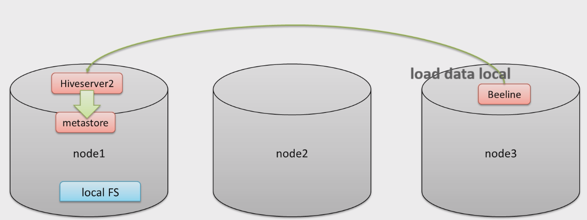

## 加载数据

### LOAD 加载数据

Hive 每当创建一张表，就会在 HDFS 上产生一个文件夹，此时我们可以将文件上传到这个文件夹中，这样 hive 就可以解析文件。

我们可以使用 `hadoop fs -put` 方式直接将文件上传到指定的文件夹下，但是官方推荐我们使用 `load` 命令将数据加载到表中。

那么 load 就是一个纯粹的数据移动的操作，不会对数据做任何修改，换言之，我们需要自己保证数据没有问题。

```
LOAD DATA [LOCAL] INPATH 'filepath' [OVERWRITE] INTO TABLE tablename [PARTITION (partcol1=val1, partcol2=val2 ...)]

LOAD DATA [LOCAL] INPATH 'filepath' [OVERWRITE] INTO TABLE tablename [PARTITION (partcol1=val1, partcol2=val2 ...)] [INPUTFORMAT 'inputformat' SERDE 'serde'] (3.0 or later)
```

- filepath：文件/文件夹：可以使用相对路径，绝对路径，完全的 URI（hdfs://xxx）
- LOCAL：LOCAL 所在的本地，意思是 hiveserver2 上所在的位置。

    

    如果指定了 LOCAL 关键字，那么相对路径将会解析为 hiveserver2 所在的本地文件系统。

    假如没有指定 LOCAL 关键字，那么相对路径就会使用 Hadoop 中，配置文件参数 `fs.default.name` 指定的（例如将会指向 HDFS）

- OVERWRITE：覆盖重写。

```sql
-- 创建表
CREATE TABLE student (
    num int,
    name string,
    sex string,
    age int,
    dept string
) ROW FORMAT DELIMITED FIELDS TERMINATED BY ",";

-- 创建外部表
CREATE EXTERNAL TABLE student_external (
    num int,
    name string,
    sex string,
    age int,
    dept string
) ROW FORMAT DELIMITED FIELDS TERMINATED BY ",";

-- 创建分区表
CREATE TABLE student_partitioner (
    num int,
    name string,
    sex string,
    age int,
    dept string
) PARTITIONED BY (country string) ROW FORMAT DELIMITED FIELDS TERMINATED BY ",";

SHOW TABLES ;

-- 从本地文件系统中（hiveserver2 所在的位置）加载数据，直接指定文件夹
LOAD DATA LOCAL INPATH '/tmp/students' INTO TABLE student;

-- 从外部存储中加载数据，此存储是使用 Hadoop 配置文件中，fs.default.name 指定
LOAD DATA INPATH '/tmp/students.txt' INTO TABLE student_external;

-- 加载数据并且给出静态分区
LOAD DATA LOCAL INPATH '/tmp/students' INTO TABLE student_partitioner PARTITION (country="CHINA");
```

HIVE 在 3.0 版本之后，LOAD 命令增加了新的特性：

1. 可能变为 `INSERT AS SELECT`，即查询加载。

    比如，假如表具有分区，并且 LOAD 命令没有指定分区字段，那么在 HIVE3.0 之前必定会报错，因为没有指定静态分区。

    但是在 HIVE3.0 之后会假定最后一列为分区列，将 LOAD 改为 `INSERT AS SELECT` 模式。但是假如文件不符合预期，也一样会报错。

1. 支持使用 `InputFormat`、`SerDe` 指定输入格式。

```sql
-- HIVE3.0 LOAD 插入动态分区
/* 数据
95001,李勇,男,20,CS
95002,刘晨,女,19,IS
95003,王敏,女,22,MA
95004,张立,男,19,IS
95005,刘刚,男,18,MA
95006,孙庆,男,23,CS
95007,易思玲,女,19,MA
95008,李娜,女,18,CS
95009,梦圆圆,女,18,MA
95010,孔小涛,男,19,CS
95011,包小柏,男,18,MA
95012,孙花,女,20,CS
95013,冯伟,男,21,CS
95014,王小丽,女,19,CS
95015,王君,男,18,MA
95016,钱国,男,21,MA
95017,王风娟,女,18,IS
95018,王一,女,19,IS
95019,邢小丽,女,19,IS
95020,赵钱,男,21,IS
95021,周二,男,17,MA
95022,郑明,男,20,MA
*/
-- 创建分区表
CREATE TABLE student_dynamic_partitioner (
    num int,
    name string,
    sex string,
    age int
) PARTITIONED BY (dept string) ROW FORMAT DELIMITED FIELDS TERMINATED BY ",";

-- 使用 LOAD 命令，这个时候没有指定分区列，那么这个时候它会将 LOAD 转换为 INSERT AS SELECT
LOAD DATA LOCAL INPATH '/tmp/students' INTO TABLE student_dynamic_partitioner;
```

从时间上看，明显边长了，并且经历了一次 MapReduce：


### INSERT + SELECT

在 HIVE 中也有类似传统关系型数据库的语法：`INSERT xxx SELECT xxx`，但是 HIVE 和传统内容不同，在 HIVE 中，这个语句是要转换为 MapReduce 程序的。

官方推荐的方式是将数据清洗之后，使用 LOAD 命令加载到 HIVE 中，但是这并不是说 `INSERT SELECT` 没有用武之地。

事实上，它会用于将查询的结果插入到一张新表中。此时注意：

1. 需要保证查询的结果列的数目和需要插入的表的列数目一致。
1. 数据类型不一致会尝试转换，但是转换失败会为 NULL。

```
INSERT [OVERWRITE] TABLE tablename1 [PARTITION (partcol1=val1, partcol2=val2 ...) [IF NOT EXISTS]] select_statement1 FROM from_statement;
```

---

在查询插入的这个方式下，有一种类型叫做多重插入，简单来说就是扫描一次源表，多次插入新表。

```
-- 一次扫描 from_table，插入 name 到 table1，插入 age 到 table2。
FROM from_table
INSERT OVERWRITE TABLE table1 SELECT name
INSERT OVERWRITE TABLE table2 SELECT age;
```

---

动态分区插入之前的章节（DDL 中）也提到过，这里不再赘述。

**数据导出**

HIVE 可以将 SELECT 的数据放到文件系统中，语法如下：

```sql
-- 将结果导出到 HDFS 中，注意是 OVERWRITE，所以目标目录要谨慎
INSERT OVERWRITE DIRECTORY '/tmp/hive_export/data1' SELECT * FROM student;

-- 指定分隔符和文件格式
INSERT OVERWRITE DIRECTORY '/tmp/hive_export/data2' ROW FORMAT DELIMITED FIELDS TERMINATED BY ','
SELECT * FROM student;

-- 导出到本地文件（hiveserver2 所在服务器）目录下
INSERT OVERWRITE LOCAL DIRECTORY '/tmp/hive_export/data' ROW FORMAT DELIMITED FIELDS TERMINATED BY ','
SELECT * FROM student;
```

## 事务、更新、删除

Hive 一开始是不支持事务的，因为 Hive 本身的需求是对数据进行分析处理，所以不支持 update、delete 等操作，自然也不支持事务。

从 Hive 0.14 版本开始，具有ACID 语义的事务开始支持了，因为有一些场景确实需要使用，比如：

- 流式传输数据，就是说用 flume 或者 kafka 之类的工具，将数据流式传输到现有分区中，但是这会令用户感到脏读（开始查询后可以看到刚刚写入的数据）。
- 收集的数据不正确，需要修正。

虽然 Hive 支持了事务，但是不可能像传统的关系型数据库那样方便，它仍然有一些局限性：

- 事务不支持手动提交，也就是说 Hive 中的事务全部都是自动提交。
- 仅支持 ORC 文件格式。
- 默认事务是关闭的，需要配置参数手动打开。
- 事务必须在分桶表上打开。
- 外部表无法创建事务，不能成为 ACID 表，不允许从非 ACID 会话读取/写入 ACID 表。
- 表的参数 `transaction` 必须为 `true`。

**案例**

```sql
-- Hive 中手动配置事务，使用 set 设置为当前会话中生效，也可以在 hive-site.xml 中配置

-- 1. 开启事务表的配置
-- 支持并发
SET hive.support.concurrency = true;
-- 开启分桶功能，从 HIVE 2.0 开始不需要此配置
SET hive.enforce.bucketing = true;
-- 开启动态分区模式（非严格模式）
SET hive.exec.dynamic.partition.mode = nonstrict;
SET hive.txn.manager = org.apache.hadoop.hive.ql.lockmgr.DbTxnManager;
-- 在 metastore 实例上运行启动压缩合并
SET hive.compactor.initiator.on = true;
-- 在 metastore 实例上运行多少个压缩程序工作线程
SET hive.compactor.worker.threads = 1;

-- 2. 创建 Hive 事务表
-- 表为内部表，存为两个分桶，设置以 ORC 格式存储，并且设置表的属性 transactional 为 true
CREATE TABLE trans_student(
    id int,
    name string,
    age int
) CLUSTERED BY (id) INTO 2 BUCKETS STORED AS ORC TBLPROPERTIES ('transactional' = 'true');

-- 3. 针对事务表进行 INSERT、UPDATE、DELETE 操作
INSERT INTO trans_student (id, name, age) VALUES (1, "allen", 18);
UPDATE trans_student SET age = 20 WHERE id = 1;
DELETE FROM trans_student WHERE id = 1;
```
