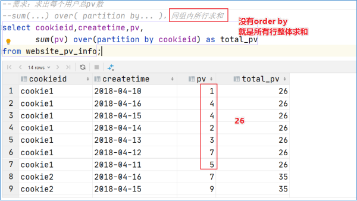
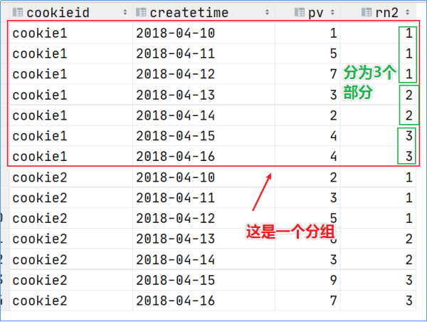

## 函数基础

Hive SQL 内置了不少函数，能满足在开发时的基本需求，可以使用 `show functions` 查看当前版本支持的函数，并且可以通过 `DESCRIBE FUNCTION EXTENDED func_name;` 来查看函数的使用方法。

### 内置函数

内置函数（buildin），指的是 Hive 已经开发实现好，等待调用的函数，也叫做内建函数。官方[文档](https://cwiki.apache.org/confluence/display/Hive/LanguageManual+UDF)。

内置函数根据应用类型可以分为八类，使用频率最高的将举例。

**字符串函数**

字符串函数主要是对字符串数据类型进行操作

```sql
-------------------------------------------- 字符串函数 --------------------------------------------
-- 字符串长度
SELECT length('HELLO WORLD');
-- 字符串反转
SELECT reverse('HELLO WORLD');
-- 字符串连接
SELECT concat('HELLO', 'WORLD');
-- 使用分隔符进行连接 concat_ws(separator, [string | array(string)]+)
SELECT concat_ws('.', 'www', array('baidu', 'com'));
-- 字符串截取，注意，索引是从 1 开始，给定负数的意思是倒着数 substr(str, pos [, len])
SELECT substr('HELLO WORLD', -2);
-- 字符串转大写，这两个没有区别
SELECT upper('hello world');
SELECT ucase('hello world');
-- 字符串转小写，这两个没有区别
SELECT lower('HELLO WORLD');
SELECT lcase('HELLO WORLD');
-- 去除字符串两边空格
SELECT trim(" HELLO WORLD ");
-- 去除左边空格
SELECT ltrim(" HELLO WORLD");
-- 去除右边空格
SELECT ltrim("HELLO WORLD ");
-- 正则替换，最终形成 num-num
SELECT regexp_replace('100-200', '(\\d+)', 'num');
-- 正则解析，可以提取指定的组的内容
SELECT regexp_extract('100-200', '(\\d)-(\\d)', 2);
-- url 解析，想要一次解析多个 url 可以使用 parse_url_tuple 这个 UDTF 函数，最终形成 baike.baidu.com
SELECT parse_url('https://baike.baidu.com/item/hello/38467?fr=aladdin', 'HOST');
-- json 解析
SELECT get_json_object('');
-- 空格字符串函数，返回指定个数的空格
SELECT space(4);
-- 重复字符串 n 次
SELECT repeat('HELLO', 2);
-- 将字符串的首字母转为 ASCII，返回 72
SELECT ascii('HELLO');
-- 左补函数，使用指定符号，在此字符串的左边补齐到指定长度，这里最终为 `???hi`
SELECT lpad('hi', 5, '??');
-- 右补函数，假如字符串的长度大于指定长度，则消减，这里最终为 `h`
SELECT rpad('hi', 1, '??');
-- 字符串分割，["HELLO","WORLD"]
SELECT split('HELLO WORLD', '\\s+');
-- 集合查找
SELECT find_in_set('a','abc,b,a,cd,fe');
```

**日期函数**

针对日期进行操作的函数

```sql
-------------------------------------------- 日期函数 --------------------------------------------
-- 获取当前日期：2022-03-25
SELECT current_date();
-- 获取当前时间戳，在一次查询中，current_timestamp() 返回值相同
-- 返回值比 current_date() 更细致：2022-03-25 21:39:26.202000000
SELECT current_timestamp();
-- 获取当前 UNIX 时间戳：1648215568
SELECT unix_timestamp();
-- UNIX 时间戳转日期函数，可以进行格式化，返回 2022-03-25 13:39:28
SELECT from_unixtime(1648215568);
SELECT from_unixtime(0, 'yyyy-MM-dd HH:mm:ss');
-- 日期转 UNIX 时间戳函数，可以指定格式转换
SELECT unix_timestamp('1999-12-12 13:01:03');
SELECT unix_timestamp('1999-12-12 13:01:03', 'yyyy-MM-dd HH:mm:ss');
-- 抽取日期，返回 1999-07-12
SELECT to_date('1999-07-12 04:12:52');
-- 日期转年
SELECT year('1999-07-12 04:12:52');
-- 日期转月
SELECT month('1999-07-12 04:12:52');
-- 日期转天
SELECT day('1999-07-12 04:12:52');
-- 日期转分钟
SELECT minute('1999-07-12 04:12:52');
-- 日期转秒
SELECT second('1999-07-12 04:12:52');
-- 日期转周，weekofyear 表示年的第几周
SELECT weekofyear('1999-07-12 04:12:52');
-- 日期比较，要求格式为 yyyy-MM-dd
SELECT datediff('2012-12-08', '2012-05-09');
-- 日期增加
SELECT date_sub('2012-01-1', 10);
```

**数学函数**

主要进行数值运算

```sql
-------------------------------------------- 数学函数 --------------------------------------------
-- 取整，四舍五入，默认取整数，可以指定精度
SELECT round(3.1415926);
SELECT round(3.1415926, 4);
-- 向下取整
SELECT floor(3.1415926);
-- 向上取整
SELECT ceil(3.1415926);
-- 随机，默认返回一个 0-1 的随机数，可以指定种子得到一个稳定的随机数序列
SELECT rand();
SELECT rand(2);
-- 二进制函数
SELECT bin(18);
-- 进制转换，将 17 从 10 进制转为 16 进制
SELECT conv(17, 10, 16);
-- 绝对值
SELECT abs(-3);
```

**集合函数**

```sql
-------------------------------------------- 集合函数 --------------------------------------------
-- 长度
SELECT size(array(11, 22, 33));
SELECT size(map('id', 10086, 'name', 'zhangsan', 'age', 18));
-- 取 map 的 keys
SELECT map_keys(map('id', 10086, 'name', 'zhangsan', 'age', 18));
-- 取 map 的 values
SELECT map_values(map('id', 10086, 'name', 'zhangsan', 'age', 18));
-- 判断数组是否包含指定元素
SELECT array_contains(array(11, 22, 33), 11);
-- 数组排序
SELECT sort_array(array(11, 2, 3));
```

**条件函数**

```sql
-------------------------------------------- 条件函数 --------------------------------------------
-- 条件判断，假如 sex 为男，则返回 M，否则返回 W
SELECT if(sex = '男', 'M', 'W') FROM student;
-- 判空
SELECT isnull('');
-- 判非空
SELECT isnotnull('');
-- 空则转换
SELECT nvl(null, 'HELLO');
-- 非空查找，返回参数中第一个非空的值，假如全部为 null 则返回 null
SELECT coalesce(null, 11, 22, 33);
-- 条件转换，类似 switch .. case .. default
SELECT CASE 100
           WHEN 50 THEN 'Jack'
           WHEN 100 THEN 'Mary'
           WHEN 150 THEN 'Tom'
           ELSE 'Larry'
           END;
-- nullif，假如 a == b，则返回 null，否则返回一个
SELECT nullif(11, 11);
-- 假如条件为 false 则抛异常，为 true 返回 null
SELECT assert_true(11 > 0);
```

**类型转换函数**

可以转为任何类型

```sql
-------------------------------------------- 类型转换函数 --------------------------------------------
SELECT cast(3.1415926 as bigint);
SELECT cast(3.1415926 as string);
```

**数据脱敏函数**

对数据进行脱敏

```sql
-------------------------------------------- 数据脱敏函数 --------------------------------------------
-- 大写字母转为 X，小写字母转为 x，数字转为 n，可自定义替换
SELECT mask('ABc123def');
-- 自定义替换的字母
SELECT mask('ABc123def', '-', '.', '^');
-- 对前 n 个字母脱敏
SELECT mask_first_n('ABc123def', 4);
-- 对后 n 个字母脱敏
SELECT mask_last_n('ABc123def', 4);
-- 除前 n 个，其余掩码
SELECT mask_show_first_n('ABc123def', 4);
-- 除后 n 个，其余掩码
SELECT mask_show_last_n('ABc123def', 4);
-- 返回字符串 hash 值掩码
SELECT mask_hash('ABc123def');
```

**杂项函数**

杂项函数

```sql
-------------------------------------------- 杂项函数 --------------------------------------------
-- 调用 Java 函数
SELECT java_method('java.lang.Math', 'max', 11, 22);
-- Java 反射
SELECT reflect('java.lang.Math', 'max', 11, 22);
-- hash
SELECT hash('HELLO');
-- SHA-1 加密
SELECT sha1('HELLO');
-- SHA-2 家族算法加密：sha2(string/binary, int)、SHA-224, SHA-256, SHA-384, SHA-521
SELECT sha2('HELLO', 224);
-- CRC 32 加密
SELECT crc32('HELLO');
-- md5，md5 现在已经不安全了
SELECT md5('HELLO');
```

### 自定义函数

**UDF、UDAF、UDTF 概述**

虽然 Hive 内置的函数有很多，但是可能会有有些业务需求是内置函数无法满足的，这种情况下如果我们可以自己针对业务自定义函数来实现需求。

用户自定义函数简称 UDF，来源于 User Defined Function，自定义函数一共分为三种类型：

- UDF，User Defined Function：普通的用户自定义函数，一进一出。
- UDAF，User Defined Aggregation Function：聚合函数，多进一出。
- UDTF，User Defined Table Generating Function：表生成函数，一进多出。

虽然 UDF、UDAF、UDTF 表面上看起来是用户编写开发的函数，但其实这套标准可以扩大到 Hive 的所有函数中，比如 `count()` 是多进一出，就可以归类到 UDAF 标准中。

编写代码之前，首先准备 maven：

```xml
<dependencies>
    <dependency>
        <groupId>org.apache.hive</groupId>
        <artifactId>hive-exec</artifactId>
        <version>3.1.2</version>
    </dependency>
    <dependency>
        <groupId>org.apache.hadoop</groupId>
        <artifactId>hadoop-common</artifactId>
        <version>3.1.4</version>
    </dependency>
</dependencies>
```

**UDF 案例**

现在有一个需求，就是将字符串的长度返回

1. 代码实现：

    ```java
    package udf;

    import org.apache.hadoop.hive.ql.exec.UDFArgumentException;
    import org.apache.hadoop.hive.ql.exec.UDFArgumentLengthException;
    import org.apache.hadoop.hive.ql.exec.UDFArgumentTypeException;
    import org.apache.hadoop.hive.ql.metadata.HiveException;
    import org.apache.hadoop.hive.ql.udf.generic.GenericUDF;
    import org.apache.hadoop.hive.serde2.objectinspector.ObjectInspector;
    import org.apache.hadoop.hive.serde2.objectinspector.primitive.PrimitiveObjectInspectorFactory;

    import java.io.IOException;
    import java.util.Objects;

    /**
    * 定义 UDF 函数，继承 GenericUDF
    */
    public class StringLength extends GenericUDF {

    /**
    * 可以执行函数的初始化，并且返回函数的返回值类型鉴别器对象
    *
    * @param arguments 输入参数类型的鉴别器对象
    * @return 返回值类型的鉴别器对象
    * @throws UDFArgumentException
    */
    @Override
    public ObjectInspector initialize(ObjectInspector[] arguments) throws UDFArgumentException {
        if (arguments.length != 1) {
        throw new UDFArgumentLengthException("input args length error");
        }
        // 取得参数的鉴别器对象
        ObjectInspector argument = arguments[0];
        /*
        ObjectInspector.Category，一个枚举类，支持 Hive 的五种类型：

        - PRIMITIVE：基本类型
        - LIST：集合
        - MAP：kv 键值对
        - STRUCT：结构体
        - UNION：联合体
        */
        // 判断参数的类型，假如不是基本类型则直接抛异常
        if (!argument.getCategory().equals(ObjectInspector.Category.PRIMITIVE)) {
        throw new UDFArgumentTypeException(0, "input args type error");
        }
        // 返回字符串长度为 int，所以需要返回 int 类型的鉴别器对象
        return PrimitiveObjectInspectorFactory.javaIntObjectInspector;
    }

    /**
    * 函数的逻辑处理
    *
    * @param arguments 输入参数
    * @return 返回值
    * @throws HiveException
    */
    @Override
    public Object evaluate(DeferredObject[] arguments) throws HiveException {
        Object argument = arguments[0].get();
        if (Objects.isNull(argument)) {
        return 0;
        }
        return argument.toString().length();
    }

    /**
    * 显示函数的帮助信息
    */
    @Override
    public String getDisplayString(String[] strings) {
        return "";
    }

    /**
    * 可选，map 结束后执行关闭操作
    *
    * @throws IOException
    */
    @Override
    public void close() throws IOException {
        super.close();
    }
    }
    ```

1. 将代码打为 jar 包，上传到 HiveServer2 所在的 Linux 系统，或者 HDFS 系统。
1. 进入客户端，使用命令 `add jar jap_path.jar` 将 jar 包添加到 classpath：`ADD JAR /tmp/hivedata/StringLength.jar;`。
1. 创建一个临时函数，和 java class 关联：`CREATE TEMPORARY FUNCTION func_name AS 'package.class_name';`：`CREATE TEMPORARY FUNCTION str_len AS 'udf.StringLength';`。
1. 使用函数：`SELECT func_name(name) FROM table_name;`：`SELECT str_len('HELLO WORLD');`。

**UDTF 案例**

其他过程十分相似就不写了，关键在于代码：

```java
package udtf;

import org.apache.hadoop.hive.ql.exec.UDFArgumentException;
import org.apache.hadoop.hive.ql.metadata.HiveException;
import org.apache.hadoop.hive.ql.udf.generic.GenericUDTF;
import org.apache.hadoop.hive.serde2.objectinspector.ObjectInspector;
import org.apache.hadoop.hive.serde2.objectinspector.ObjectInspectorFactory;
import org.apache.hadoop.hive.serde2.objectinspector.StructObjectInspector;
import org.apache.hadoop.hive.serde2.objectinspector.primitive.PrimitiveObjectInspectorFactory;

import java.util.ArrayList;
import java.util.Arrays;
import java.util.List;

/**
 * 定义一个 UDTF 函数，可以将字符串按照分隔符切割成为独立的单词
 */
public class splitStr extends GenericUDTF {

  private List<String> outList = new ArrayList<>();

  @Override
  public StructObjectInspector initialize(StructObjectInspector argOIs) throws UDFArgumentException {
    // 1. 自定义输出数据的列名称和类型
    List<String> fieldNames = new ArrayList<>();
    List<ObjectInspector> fieldOIs = new ArrayList<>();
    // 2. 添加输出数据的列名和类型
    fieldNames.add("lineToWord");
    fieldOIs.add(PrimitiveObjectInspectorFactory.javaStringObjectInspector);
    return ObjectInspectorFactory.getStandardStructObjectInspector(fieldNames, fieldOIs);
  }

  @Override
  public void process(Object[] args) throws HiveException {
    // 获取输入的值的原始数据
    String arg = args[0].toString();
    // 按照传入参数的第二个参数作为分隔符进行分隔
    String splitKey = args[1].toString();
    String[] fields = arg.split(splitKey);
    // 注意，最终在 Hive 呈现时，是很多行，在这里我们不要一次性输出集合内容，而是以集合为单位，一条一条输出内容
    Arrays.stream(fields).forEach(field -> {
      try {
        outList.clear();
        outList.add(field);
        // 以集合为单位，将数据写出
        forward(outList);
      } catch (HiveException e) {
        e.printStackTrace();
      }
    });
  }

  @Override
  public void close() throws HiveException {

  }
}
```

### 函数高阶

#### UDTF 和 侧视图

**explode**

爆炸函数，explode，在分类上也属于 UDTF。

简单来说，它可以将集合或者键值对进行拆分，一条/一对数据单独占用一行。


`explode` 函数本身就已经违反了关系型数据库设计准则的第一范式，但是在面向分析的数据仓库中，我们可以改变这些规则。

一般情况下，`explode` 会和侧视图 lateral view 一起使用，单独用当然也可以。

`explode` 不能和其他字段一起出现，否则就会报错，这是因为：

`explode` 属于 UDTF 函数。

它的返回值可以理解为一张虚拟的表，其数据来源于源表，不能查询源表的同时查询虚拟表，简单来讲就是不能查一张表返回两张表的字段。

从 SQL 的层面来说应该进行连表查询。Hive 专门提供了侧视图 lateral view，专门搭配 UDTF 这样的函数，以满足上述需求。

**lateral view 侧视图**

它是一种特殊的语法，主要的作用就是搭配 UDTF 函数一起使用，用于解决 UDTF 函数一些查询限制的问题。

侧视图的原理是将 UDTF 的结果构建成一张类似于视图的表，然后将源表的每一行和 UDTF 函数输出的每一行进行链接，形成一张虚拟的表，这样就避免了 UDTF 使用限制问题。

使用侧视图时同时也可以针对 UDTF 产生的记录设置字段名称，产生的字段可以用于 `group by`、`order by`、`limit` 等语句中，不需要再单独嵌套一层子查询。

侧视图语法：`SELECT ... FROM table_name LATERAL VIEW UDTF() 别名 AS col1, col2, col3, ...;`

案例：

```sql
SELECT a.name, b.year
FROM tableA a LATERAL VIEW explode(year) b AS year
ORDER BY b.year DESC;
```

#### 聚合

HQL 提供了几种内置的 UDAF 聚合函数，例如 `max`、`min`、`avg`，我们将这些称为基础聚合函数。

除了基础聚合之外，我们还有增强聚合。

增强聚合需要根据多个维度进行分析，维度指的就是看待数据的角度，比如根据天、周、月三个角度进行数据的分析。

**数据准备**

我们首先来准备一些数据，来作为增强聚合的案例：

```sql
/*
    数据类似如下：

    2018-03,2018-03-10,cookie1
    2018-03,2018-03-10,cookie5
    2018-03,2018-03-12,cookie7
    2018-03,2018-03-12,cookie3
    2018-03,2018-03-13,cookie2
    2018-03,2018-03-13,cookie4
    2018-03,2018-03-16,cookie4
    2018-04,2018-03-10,cookie2
    2018-04,2018-03-12,cookie3
    2018-04,2018-03-13,cookie5
    2018-04,2018-03-15,cookie6
    2018-04,2018-03-15,cookie3
    2018-04,2018-03-16,cookie2
 */
CREATE TABLE cookie_info (
  month string,
  day string,
  cookieId string
) ROW FORMAT DELIMITED FIELDS TERMINATED BY ",";

LOAD DATA LOCAL INPATH '/tmp/hivedata/cookie_info.txt' INTO TABLE cookie_info;
```

**grouping sets**

`grouping sets`，它是一种将多个 `group by` 写到一个 sql 中的便利写法，等于将多个不同纬度的 group by 进行 union 操作。

```sql
-- 使用 grouping sets
-- grouping__id 表示这一组结果属于哪个分组集合，注意有两个下划线
-- 根据 grouping sets 中的分组条件 month、day，1 代表 month，2 代表 day
SELECT month, day, count(DISTINCT cookieId) AS nums, GROUPING__ID
FROM cookie_info
GROUP BY month, day
GROUPING SETS (month, day)
ORDER BY GROUPING__ID;

-- 以上等价于
SELECT month, null, count(DISTINCT cookieid) AS nums, 1 AS GROUPING__ID FROM cookie_info GROUP BY month
UNION ALL
SELECT null, day, count(DISTINCT cookieid) AS nums, 2 AS GROUPING__ID FROM cookie_info GROUP BY day;
```

```sql
SELECT month, day, count(DISTINCT cookieId) AS nums, GROUPING__ID
FROM cookie_info
GROUP BY month, day
GROUPING SETS (month, day, (month, day))
ORDER BY GROUPING__ID;

-- 以上等价于
SELECT month, null, count(DISTINCT cookieid) AS nums, 1 AS GROUPING__ID FROM cookie_info GROUP BY month
UNION ALL
SELECT null, day, count(DISTINCT cookieid) AS nums, 2 AS GROUPING__ID FROM cookie_info GROUP BY day
UNION ALL
SELECT month, day, count(DISTINCT cookieid) AS nums, 3 AS GROUPING__ID FROM cookie_info GROUP BY month, day;
```

**cube**

cube 的意思是，根据 `group by` 的维度的所有组进行聚合。对于 cube，假如存在 n 个维度，那么所有组合的个数为 2^n。

例如，有三个维度 a、b、c，那么所有组合为：`(a, b, c)、(a, b)、(a, c)、(b, c), (a), (b), (c), ()`。

```sql
SELECT month, day, count(DISTINCT cookieid) AS nums, GROUPING__ID
FROM cookie_info
GROUP BY month, day
WITH CUBE
ORDER BY GROUPING__ID;

-- 等价于
SELECT null, null, count(DISTINCT cookieid) AS nums, 0 AS GROUPING__ID FROM cookie_info
UNION ALL
SELECT month, null, count(DISTINCT cookieid) AS nums, 1 AS GROUPING__ID FROM cookie_info GROUP BY month
UNION ALL
SELECT null, day, count(DISTINCT cookieid) AS nums, 2 AS GROUPING__ID FROM cookie_info GROUP BY day
UNION ALL
SELECT month, day, count(DISTINCT cookieid) AS nums, 3 AS GROUPING__ID FROM cookie_info GROUP BY month, day;
```

**rollup**

rollup 是 cube 的子集，以最左侧的维度为主

比如有三个维度 `a, b, c`，那么所有的聚合情况为：`(a, b, c)、(a, b)、(a, c)、(a)、()`

```sql
SELECT month, day, count(DISTINCT cookieid) AS nums, GROUPING__ID
FROM cookie_info
GROUP BY month, day
WITH ROLLUP
ORDER BY GROUPING__ID;
```

#### 窗口函数

Window Function 窗口函数，也叫做 OLAP 函数，非常适合数据分析。

最大的特点就是：输入值是从 SELECT 语句的结果集中的一行或者多行的窗口中获取的，也可以理解为行有多少窗口就开多大。

通过 over 子句，窗口函数和其他的 SQL 函数有了区别，假如一个函数具有 over 子句，那么它是窗口函数，如果它缺少 over 子句，则它是一个普通聚合函数。

窗口函数类似聚合函数，但是有些区别。通过 group by 子句组合的常规聚合会隐藏聚合中的行，最终输出为一行。

窗口聚合函数不会隐藏聚合中的各个行（可以访问当中的各个行），并且可以将这些行的属性添加到结果集中。


窗口函数语法：`... OVER ([PARTITION BY ...] [ORDER BY ...]) ...`

```sql
-- sum + group by 的常规聚合操作
SELECT sum(salary) AS total FROM employee GROUP BY dept;

-- sum + 窗口函数聚合操作
SELECT id, name, deg, salary, dept, sum(salary) over (PARTITION BY dept) AS total FROM employee;
```


**窗口聚合函数**

首先我们准备一下数据：

::: details 数据
```text
cookie1,2018-04-10,1
cookie1,2018-04-11,5
cookie1,2018-04-12,7
cookie1,2018-04-13,3
cookie1,2018-04-14,2
cookie1,2018-04-15,4
cookie1,2018-04-16,4
cookie2,2018-04-10,2
cookie2,2018-04-11,3
cookie2,2018-04-12,5
cookie2,2018-04-13,6
cookie2,2018-04-14,3
cookie2,2018-04-15,9
cookie2,2018-04-16,7
```

```sql
CREATE TABLE website_pv_info (
    cookieId string,
    createdTime string,
    pv int
) ROW FORMAT DELIMITED FIELDS TERMINATED BY ",";

LOAD DATA LOCAL INPATH '/tmp/hivedata/website_pv_info.txt' INTO TABLE website_pv_info;
```
:::

```sql
-- 查询网站的总 pv 数量
SELECT cookieId, sum(pv) over() AS total_pv FROM website_pv_info;
-- 分别查询每个用户的总 pv 数量
SELECT cookieId, sum(pv) over(PARTITION BY cookieId) AS total_pv FROM website_pv_info;
-- 求出每个用户截止到当天，累计的总 pv 数
-- sum(...) over(PARTITION BY ... ORDER BY ...)，在每个分组中连续累计求和
SELECT
    cookieId,
    createdTime,
    pv,
    sum(pv) over(
        PARTITION BY cookieId
        ORDER BY createdTime
    ) AS current_total_pv
FROM website_pv_info;
```

可以看到在上面的例子中，over 函数中有时没有条件，有时存在一个 `PARTITION BY` 的条件，有时还存在 `ORDER BY` 的条件。

其中要注意的就是 `ORDER BY` 有无的条件，没有则是所有行的整体求和，有则是累计求和。




**窗口表达式**

窗口函数给了一个累积求和的行为，但是累积行为是可控的，默认情况下就是从第一行开始聚合到最后一行，窗口表达式给了一种控制行动范围的能力，比如向前两行或者向后三行。

窗口表达式关键词是 `ROWS BETWEEN`，包括如下选项：

- `PRECEDING`：向前。
- `FOLLOWING`：向后。
- `CURRENT ROW`：当前行。
- `UNBOUNDED`：边界。
- `UNBOUNDED PRECEDING`：第一行。
- `UNBOUNDED FOLLOWING`：最后一行。

```sql
-- 第一行到当前行
SELECT
    cookieId,
    createdTime,
    sum(pv) over(
        PARTITION BY cookieId
        ORDER BY createdTime
        ROWS BETWEEN UNBOUNDED PRECEDING AND CURRENT ROW
    ) AS pv
FROM website_pv_info;

-- 从前面三行到当前行
SELECT
    cookieId,
    createdTime,
    sum(pv) over(
        PARTITION BY cookieId
        ORDER BY createdTime
        ROWS BETWEEN 3 PRECEDING AND CURRENT ROW
    ) AS pv
FROM website_pv_info;

-- 从前面三行到后一行
SELECT
    cookieId,
    createdTime,
    sum(pv) over(
        PARTITION BY cookieId
        ORDER BY createdTime
        ROWS BETWEEN 3 PRECEDING AND 1 FOLLOWING
    ) AS pv
FROM website_pv_info;

-- 从当前行到最后一行
SELECT
    cookieId,
    createdTime,
    sum(pv) over(
        PARTITION BY cookieId
        ORDER BY createdTime
        ROWS BETWEEN CURRENT ROW AND UNBOUNDED FOLLOWING
    ) AS pv
FROM website_pv_info;
```

**窗口排序函数**

用于给每个分组内的数据打上排序的标记。注意，窗口排序函数不支持窗口表达式。

窗口排序函数有四个函数：

- `row_number`：每个小组中，为每一行分配一个从 1 开始的序列号，此序列号递增不考虑重复。
- `rank`：每组中为每行分配从 1 开始的序列号，考虑重复，挤占后续位置。
- `dense_rank`：每组中为每行分配一个从 1 开始的序列号，考虑重复，不挤占后续位置。

```sql
SELECT
    cookieId,
    createdTime,
    pv,
    rank() over (PARTITION BY cookieId ORDER BY pv DESC) AS rn1,
    dense_rank() over (PARTITION BY cookieId ORDER BY pv DESC) AS rn2,
    row_number() over (PARTITION BY cookieId ORDER BY pv DESC) AS rn3
FROM website_pv_info
WHERE cookieId = 'cookie1';
```


窗口排序函数还有一个函数叫做 `ntile`，功能是将每组的数据分为若干个部分（桶），每个桶分配一个桶编号。假如不能平均分配，则优先分配较小的桶，并且各个桶中能放的行数最多相差 1。

```sql
SELECT
    cookieId,
    createdTime,
    pv,
    ntile(3) over (PARTITION BY cookieId ORDER BY pv DESC) AS rn2
FROM website_pv_info
WHERE cookieId = 'cookie1';
```



#### 抽样函数

数据量过大时，我们可以抽出数据的子集来加快数据处理和速度分析，这就叫做抽样。抽样是抽出部分数据来推测整个数据集的模式。

在 HQL 中，可以采用随机采样、存储桶表采样、块采样。

**Random 随机抽样**

```sql
-- 随机抽取两个
SELECT * FROM student DISTRIBUTE BY rand() SORT BY rand() LIMIT 2;
-- 使用 ORDER BY + rand() 也可以查看，但是效率不高
SELECT * FROM student ORDER BY rand() LIMIT 2;
```

**Block 块抽样**

```sql
-- 根据行数抽样
SELECT * FROM student tablesample(1 ROWS);
-- 百分比抽样
SELECT * FROM student tablesample(50 PERCENT);
-- 根据数据大小抽样，支持 b/B、k/K、m/M、g/G
SELECT * FROM student tablesample (1k);
```


**分桶表抽样**

根据分桶表做了优化，是一种特殊的取样方法。

```sql
--根据整行数据进行抽样
SELECT * FROM t_usa_covid19_bucket tablesample(BUCKET 1 OUT OF 2 ON rand());
--根据分桶字段进行抽样 效率更高
DESCRIBE FORMATTED t_usa_covid19_bucket;
SELECT * FROM t_usa_covid19_bucket tablesample(BUCKET 1 OUT OF 2 ON state);
```
