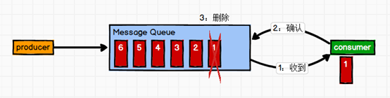
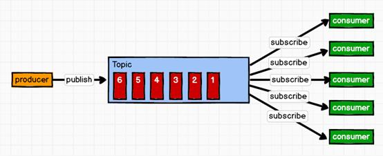

## Kafka 概述

Kafka 是一个消息队列，是分布式的、基于发布/订阅模式的消息队列（Message Queue），主要应用于大数据实时处理领域。

消息队列的两种模式：

1. 点对点模式：

    一对一模式，消费者主动去拉取数据，消息收到之后清除。

    

1. 发布订阅模式：

    一对多模式，消费者消费数据之后并不会清除数据。

    生产者将消息发布到 topic 中，多个消费者消费这个消息。

    

**Kafka 基本架构**


上图中描述了 Kafka 的基本架构：

1. Broker

    这里有三个 broker，在集群中，每一个 Kafka 服务（一般来说多个服务是在多台机器上的）我们称为 broker。

    每一个 broker 都有自己的 ID。

1. Producer

    生产者，用于生产消息放到 kafka 中。

1. Topic

    topic 位于 broker 中，每一个 broker 都包含至少一个 topic。生产者会将消息放到 topic 中。

    topic 也是存在分区的概念的，比如 broker1 中放了是 topicA 的 partition0，broker2 放了 topicA 的 partition2。

    为了保证数据的可靠性，每一个 topic 的分区都存在副本（replica），比如在 broker1 中，topicA 的 partition0 是 Leader，broker2 中 topicA 的 partition0 是 follower。

    注意，每一个 topic 的分区可以存在一个 broker 上，但是副本必须分开到不同的 broker 上，这是为了数据安全考虑。

1. Consumer

    消费者，用于消费数据。消费者是从 topic 中的某个分区中消费的，但是在 leader 可用时，它是面对 topic 的 leader 来消费的。

    kafka 中存在消费者组的概念，消费者是没有个人的概念的，即使只有一个 consumer，也是一个消费者组的概念。

    在上图架构中，consumerA 和 consumerB 在同一个消费者组中。consumerC 在一个消费者组中。

    kafka 消费有一个原则：*一个消费者组中的一个消费者，可以消费同一个主题中的多个分区的数据；但是一个主题中的一个分区的数据只能被一个消费者组中的一个消费者消费*。

    以 consumerA、consumerB 这个消费者组为例，当消费 topicA 时，两个消费者可以各自消费一个分区，例如 partition0 交给 A 消费，partition1 交给 B 消费。

    但是假如一个主题中有三个分区，那么可以随意分配。假如一个主题中有一个分区，那么只能被一个消费者组中的一个消费者消费。

## Kafka 安装

Hadoop102、Hadoop103、Hadoop104 三台机器分别部署 Zookeeper 和 Kafka。

Kafka 下载[地址](http://kafka.apache.org/downloads.html)，我们需要 `kafka_2.11-2.41.tgz`

1. 解压到 `/opt/module`，修改名称为 `kafka`，配制好环境变量
1. 在 `/opt/module/kafka` 下创建文件夹 `logs`
1. 修改配置文件：`vim conf/server.properties`

    ```shell
    # broker 的全局唯一编号，不能重复
    broker.id=0
    # 删除topic 功能使能,当前版本此配置默认为 true，已从配置文件移除
    delete.topic.enable=true
    # 处理网络请求的线程数量
    num.network.threads=3
    # 用来处理磁盘 IO 的线程数量
    num.io.threads=8
    # 发送套接字的缓冲区大小
    socket.send.buffer.bytes=102400
    # 接收套接字的缓冲区大小
    socket.receive.buffer.bytes=102400
    # 请求套接字的缓冲区大小
    socket.request.max.bytes=104857600
    # kafka 运行日志存放的路径
    log.dirs=/opt/module/kafka/logs
    # topic 在当前 broker 上的分区个数
    num.partitions=1
    # 用来恢复和清理 data 下数据的线程数量
    num.recovery.threads.per.data.dir=1
    # segment 文件保留的最长时间，超时将被删除
    log.retention.hours=168
    # 配置连接 Zookeeper 集群地址
    zookeeper.connect=hadoop102:2181,hadoop103:2181,hadoop104:2181
    ```

1. 分发到其他机器：`xsync kafka/`
1. 修改其他机器的配置文件 `conf/server.properties`，一定要修改 `broker.id`，可以分别为 `broker.id=1、broker.id=2`.
1. 启动 kafka 之前，首先要启动 zookeeper 集群
1. 依次在 hadoop102、hadoop103、hadoop104 上启动 kafka：`bin/kafka-server-start.sh -daemon config/server.properties`
1. 关闭 kafka：`bin/kafka-server-stop.sh stop`
1. kafka 群起脚本：

    ```shell
    #!/bin/bash
    if [ $# -lt 1 ]
    then
    echo "Input Args Error....."
    exit
    fi
    for i in hadoop102 hadoop103 hadoop104
    do
        case $1 in
            start)
                echo "==================START $i KAFKA==================="
                ssh $i /opt/module/kafka_2.11-2.4.1/bin/kafka-server-start.sh -daemon /opt/module/kafka_2.11-2.4.1/config/server.properties
            ;;
            stop)
                echo "==================STOP $i KAFKA==================="
                ssh $i /opt/module/kafka_2.11-2.4.1/bin/kafka-server-stop.sh stop
            ;;
            *)
                echo "Input Args Error....."
                exit
            ;;
        esac
    done
    ```

## 命令行操作 Kafka

**topic 操作**

所有使用 `topic` 的命令都使用 `bin/kafka-topics.sh` 来进行操作。

本质上来讲，`topic` 只是我们逻辑上的一个概念，实际上在存储的时候是按照分区来存储的。

- 查看 topic 列表：`bin/kafka-topics.sh --list --bootstrap-server hadoop102:9092`
- 创建名为 first 的 topic：`bin/kafka-topics.sh --create --bootstrap-server hadoop102:9092 --topic first`
- 带分区和副本创建 topic：`bin/kafka-topics.sh --create --bootstrap-server hadoop102:9092 --topic second --partitions 2 --replication-factor 3`

    副本不能随意指定，当前只有三台机器，所以只能有三个副本。

- 查看 topic 详情：`bin/kafka-topics.sh --describe --bootstrap-server hadoop102:9092 --topic first`
- 修改 topic：`bin/kafka-topics.sh --alter --bootstrap-server hadoop102:9092 --topic second --partitions 2 --replication-factor 3`

    分区数量可以向大的改，不能向小的改，否则会报错。因为可能已经有消费者去消费了数据，记录下了 offset，万一将其他分区的数据放到一个分区，offset 没办法维护。

- 删除 topic：`bin/kafka-topics.sh --delete --bootstrap-server hadoop102:9092 --topic first`

**生产者和消费者操作**

生产者使用的是 `bin/kafka-console-producer.sh` 命令。消费者使用的是 `bin/kafka-console-consumer.sh` 命令，消费者在启动的时候会默认分配一个组。

- 生产者进入到某个 broker 中的某个 topic 中：`bin/kafka-console-producer.sh --broker-list hadoop102:9092 --topic first`

    进入到 broker 中的 topic 中后，就可以生产数据。

    生产者生产的数据在逻辑上是放到 topic 中，但是 topic 毕竟只是一个逻辑的概念，所以在物理上是放到了分区中。

- 消费者进入到某个 broker 中的某个 topic 中：`bin/kafka-console-consumer.sh --bootstrap-server hadoop102:9092 --topic first`

    进入到 broker 中的 topic 中，就可以消费数据。

    消费者在启动的时候会被默认分配到一个组，如果要将多个消费者放到通过一个组就需要显示指定。

    新启动的消费者组中的消费者默认不会消费 topic 中早已经存在的数据，这涉及到一个 offset 重置问题。

    如果需要从头消费，需要加上命令 `--from-beginning` 表示从头消费。但是注意，这样只能保证消费过程中，分区是有序的，但是哪个分区先消费就不一定了。

- 消费者组

    在 `config/consumer.properties` 文件下，有一个配置项 `group.id=test-consumer-group`

    我们在启动消费者的时候，指定这个文件就可以使用这个 `group.id`，那么消费者就可以放到同一个消费者组中了。

    `bin/kafka-console-consumer.sh --bootstrap-server hadoop102:9092 --topic first --consumer.config config/consumer.properties`

    当消费者的个数发生变化之后（无论是增加还是减少），topic 的分区就会重新规划一次，确保所有分区都会被消费到。

    假如我们不想指定配置文件，那也可以直接指定组的名称来确保放到同一个组中：

    `bin/kafka-console-consumer.sh --bootstrap-server hadoop102:9092 --topic first --group groupA`
