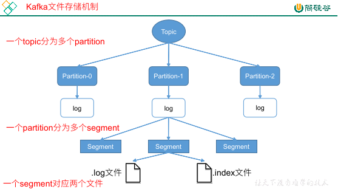
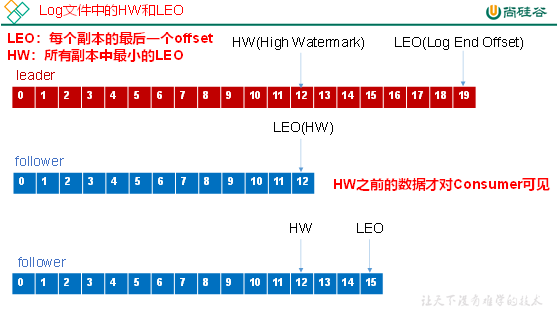
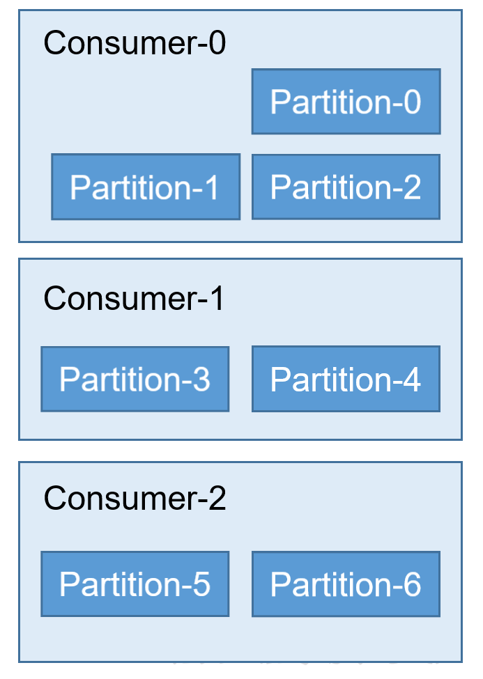
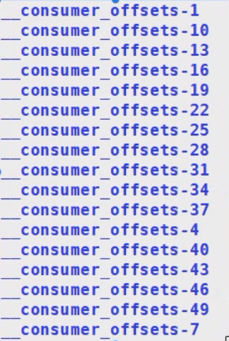
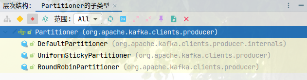

## 架构

### 工作流程和文件存储机制


**offset**

offset 的维护，就是根据 `group + topic + partition ` 来维护的。

**topic 和 partition 和 log**

topic 是逻辑上的概念，partition 是一个物理的存储。

每个分区都会有自己的分区文件夹，命名规则是 `topic-partition`，例如 first 这个 topic 有三个分区，那么对应文件夹为 `first-0`、`first-1`、`first-2`。

每一个 partition 都会对应一个 log 文件（直接存在分区文件夹中），这个文件存着 producer 生产的数据，producer 生产的数据会不断追加到这个文件中，并且每条数据都有自己的 offset（也就是说，kafka 虽然吞吐量高，但其实还是利用文件来存储的，而不是利用内存）。

消费者组中的每个消费者都会实时记录自己消费到了哪个 offset，在出错恢复时，会从上次的位置继续消费。

**segment**



为了防止 log 文件过大导致数据定位效率低，kafka 采取了分片 + 索引的机制。

当 log 文件过大时，会分为多个 segment，每个 partition 分为多个 `segment`，当分区不大那就只有一个 segment。

每个 segment 都对应两个文件：`.log`、`.index`。这两个文件也会放到分区文件夹下。

两个文件的命名也有规则，也就是 `${offset}.log`：

- 第一个 segment 的 offset 为 0，那么就是 `00000000000000000000.log`、`00000000000000000000.index`
- 第二个 segment 可能是 1000，那么就是 `0000……1000.log`、`0000……1000.index`

    每个 log 文件的开头都会是 offset 对应的消息，但是 `.index` 这个文件的索引的计数还是会从 0 开始。

    当我们需要找数据时，会首先根据 offset 找到对应的 index 文件，然后找到对应的数据索引。

    找到索引之后，offset 会减去 index 的文件名（因为文件名是 offset 的开头），得到在 log 文件中，真实数据的位置，这样就找到了最终的数据。

    总结一下就是：index 文件中存储的是逻辑上的数据位置，最终查找需要 offset 这个真实地址转化为 log 文件中的地址。

    之所以这样做，是为了防止数据太多，导致索引过长的问题。

我们之前说，每个消息都会有自己的 offset，这个是没有问题的，但是 kafka 并不会给每条消息都加一个 index，这样太浪费空间了。

kafka 会隔一段消息放一个 index，在根据 offset 寻找索引时，寻找的往往也是一个十分小的片段，然后在对应的片段中遍历查找消息。

### 生产者

#### 分区策略

topic 中会有多个 partition，分区的原因主要是可以提高并发、可以方便扩展。

首先说明一点，即使 kafka 的吞吐量相当快，它也会有一个上限，这个上限就是硬盘的读写速度，这是硬件的限制，没有办法。

当我们存在多个分区时，因为有副本的存在，我们在每台机器上都会有对应分区的存在。

kafka 在给分区选择 leader 时，会尽量分散到不同的机器上，这样就相当于每个分区的 leader 在不同的硬盘上。

我们写数据会向分区的 leader 中读写，这样就相当于多块硬盘一起工作，所以 kafka 的并发是十分重要的。

---

那么究竟是向哪个 partition 中放数据，这个是生产者来决定的，生产者中会有自己的一套分区策略，按照策略行事。

1. 直接指定了 partition：数据会放到指定的 partition 中。
1. 没有指定 partition，但是有 key：根据 key 的 hash 和 topic 做取余操作。
1. 没有 partition 和 key

    这是默认情况。也是粘性分区（Sticky Partition），它首先会随机选择一个分区，然后一直用，直到满足切换分区的条件后，会再换一个分区。

#### 数据可靠性

**producer 到 topic partition**

使用的是 ack（acknowledgement 确认收到）。

topic 中的每个 partition 收到 producer 发送到数据之后，都需要向 producer 发送 ack，如果 producer 收到 ack，就说明消息发送成功，否则会重新发送数据。

对于 partition 来讲，消息会首先到达 leader，然后 leader 会转给 follower，当 leader 发现全部的 follower 同步了，就会发送 ack。

:::tip
zookeeper 的同步机制是半数以上，但是 kafka 做的是全部都同步。

其实这也就是一种策略的选择，半数以上的同步完成，那么说明机器最好的数量就是 `2n + 1` 台，而全部同步，机器就没什么限制了。
:::

而全部都同步完的这种方案，代表也是延迟高。只要有一个节点挂了，那么相应的响应也就慢了。

**ISR**

为了解决 follower 迟迟不能同步完数据的这个问题，kafka 提出了一项技术，ISR。

leader 会维护一个动态的同步列表 `in-sync replication set（ISR）`，leader 和 follower 都会在这个列表中。

当 follower 在这个列表中，leader 就会向 follower 发送消息来同步数据。

当某个 follower 同步数据超时了，leader 会经这个 follower 从这个列表中踢出去。当 follower 恢复正常了（指定时间内可以同步数据），leader 会再将 follower 加到列表中。

当 leader 故障后，会从 ISR 中选择新的 leader。

时间阈值由 `replication.lag.time.max.ms` 参数设置。默认 10000ms，可以在 kafka 官网上看。

**ack 应答级别**

对于数据而言，不是所有数据都需要完整的保存下来，有些数据可能很重要，有些数据丢了就丢了无所谓。那么对应不同的数据，ack 也有不同的应答级别。

kafka 共提供了三种应答级别，用户可以自己权衡来挑选级别：

- `0`：提供了一个最低的延迟，只要 leader 收到了消息，在 leader 自己还没向磁盘写的时候就响应 ack。
- `1`：leader 落盘之后响应 ack。
- `-1`：leader 和 follower 全部落盘之后响应 ack，默认。注意，这种情况可能会导致数据重复。

**leader 和 follower 故障处理**



每个副本中最后一个 offset 叫做 LEO（Log End Offset），所有副本中最小的 LEO 叫做 HW（High Watermark）。

所以其实 HW 这个值保证的就是：这个水位对应的值在所有的副本中都存在，而且一定是响应过 ack 的，而且 HW 对应的值才可以被消费者消费。

- leader 故障：

    kafka 启动之后会自动维护一个副本的顺序，当 leader 故障了，他就会看下一个副本是否在 ISR 中，假如在 ISR 中说明可用，则直接使用这个副本作为新的 leader。

    新的 leader 上任之后，他会看当前的 HW，不管是自己还是其他 follower，全都扔掉 HW 之后的数据，然后等待生产者重新发送。

- follower 故障：

    这个 follower 不要了，回来之后会从他自己当时对应的 HW 的位置开始重新同步数据。

**Exactly Once**

精准一次，在 kafka 中解决数据同步且同步一次的问题，其实就是将重复数据放到 kafka 来做。也就是 `至少一次 + 幂等性操作` 来实现这个精准一次。

启用幂等性需要将 `Producer` 参数中的 `enable.idempotence` 设置为 true。

开启幂等性的 producer 会在初始化分配一个 PID，发往同一个 partition 的消息会附带 sequence number。

broker 端会对 `<PID, Partition, SeqNumber>` 做缓存，具有相同主键的数据提交时仅会持久化一条。

### 消费者

消费者会使用拉取方式来从 broker 中读取数据。假如拉取时没有数据可以被消费，就会停留一个时间，时间过了之后再去拉取。

**分区策略**

一个 consumer group 有多个 consumer，一个 topic 有多个 partition，所以必然涉及 partition 分配问题。

kafka 有三种分配策略：

- RoundRobin

    轮询，现在有一个消费者组中的三个消费者，一个 topic 中的七个 partition

    

    

    消费者个数发生变化时，所有 consumer 负责消费的 partition 会重新分配。

- Range

    默认使用的分区。

    范围分区，首先会使用分区数和消费者组中的消费者进行一个取余操作，假如能整除那就分成 n 份，每一份是一个范围，一个范围的分给一个 consumer。

    除不尽的话，会让最后一个 consumer 少一个，假如最后一个 consumer 少了还不行，那就让倒数第二个 consumer 少一个……

    

- Sticky

    粘性分区，第一次分区和 RoundRobin 比较像，当消费者个数减少时，原有的 consumer 负责的 partition 保持不变。

    如果还有新的 partition 会按照 RoundRobin 的方式重新分配。

    当消费者个数增加时，consumer 对应的 partition 会重新分配。

**offset 维护**

由于 consumer 在消费过程中可能会发生故障，因此 consumer 需要记录自己消费到了哪个 offset，便于故障恢复。

在 kafka 0.9 之后，consumer 默认将 offset 保存在内置的一个 topic 中，就是 `__consumer_offsets`



这是 kafka 自己创建维护的，而且每消费一个数据都需要维护一次 offset。

## kafka API

### Producer API

#### 简单发送

Kafka 的生产者可以同步发送消息，也可以异步发送消息，主要涉及到了两个线程：`main`、`sender`，涉及到了一个线程共享变量：`RecordAccumulator`。


在 main 线程中：

1. 生产者生产消息，经过了 `send()`
1. 消息发送给拦截器
1. 消息发送给序列化器
1. 消息发送给分区器
1. 消息交给共享变量对应的位置

在共享变量 RecordAccumulator 中：

1. 它会为每一个 topic 中的分区开辟一个缓冲
1. 消息会线发送到共享变量中的内容中
1. 假如消息达到了缓冲/超过指定时间，则发送给 topic 中的分区

在 sender 线程中：

1. 将消息从缓冲中拿出来，然后放到 topic 中

**环境搭建**

```xml
<dependencies>
    <dependency>
        <groupId>org.apache.kafka</groupId>
        <artifactId>kafka-clients</artifactId>
        <version>2.4.1</version>
    </dependency>
</dependencies>
```

**案例**

*异步发送*

异步发送，消息发送之后不阻塞，不等待 ack 回来就发送下一条消息。

```java
/**
 * 生产者异步发送，不带回调
 */
public class KafkaProducerDemo {
  public static void main(String[] args) {
    /*
      1. 创建配置对象

      配置类：

      - CommonClientConfigs：生产者和消费者通用的配置类
      - ProducerConfig：生产者配置类
      - ConsumerConfig：消费者配置类
     */
    Properties props = new Properties();
    // kafka 集群，broker-list 的位置
    props.put(CommonClientConfigs.BOOTSTRAP_SERVERS_CONFIG, "hadoop102:9092");
    // ack 的级别，all 就是 -1，默认情况下是 1
    props.put(ProducerConfig.ACKS_CONFIG, "all");
    // 重试次数，默认次数为 INTEGER.MAX
    props.put(CommonClientConfigs.RETRIES_CONFIG, 3);
    // 批次大小，这个批次大小指的是 main 线程攒一批多大的数据发送给线程共享变量
    props.put(ProducerConfig.BATCH_SIZE_CONFIG, 16384);
    // 指的是线程共享变量 RecordAccumulator 中，等待多长时间就发送给 sender 线程
    props.put(ProducerConfig.LINGER_MS_CONFIG, 1);
    // 指的是线程共享变量 RecordAccumulator 中，给 topic 每个分区开辟缓冲区的大小，32M
    props.put(ProducerConfig.BUFFER_MEMORY_CONFIG, 33554432);
    // kv 的序列化器，因为我们指定的 kv 都是字符串，所以这里就是字符串的序列化器
    props.put(ProducerConfig.KEY_SERIALIZER_CLASS_CONFIG, "org.apache.kafka.common.serialization.StringSerializer");
    props.put(ProducerConfig.VALUE_SERIALIZER_CLASS_CONFIG, "org.apache.kafka.common.serialization.StringSerializer");

    // 2. 创建生产者对象，泛型为：消息的 key 的类型、消息本身的类型
    KafkaProducer<String, String> kafkaProducer = new KafkaProducer<String, String>(props);

    // 3. 定义 ProducerRecord，包装一些信息，例如 topic、partition、timestamp 等，发送
    for (int i = 0; i < 10; i++) {
      kafkaProducer.send(new ProducerRecord<String, String>("topic-first", "value" + i));
    }

    // 4. 关闭对象
    kafkaProducer.close();
  }
}
```

```java
/**
 * 生产者异步发送，带回调
 */
public class KafkaProducerDemo {
  public static void main(String[] args) {
    Properties props = new Properties();
    KafkaProducer<String, String> kafkaProducer = new KafkaProducer<>(props);
    ProducerRecord<String, String> record = new ProducerRecord<>("topic-first", "value");
    kafkaProducer.send(record, new Callback() {
      /**
       * 消息发送完成后调用此方法
       * @param recordMetadata 消息元数据信息
       * @param e 消息发送后失败就会抛出异常
       */
      @Override
      public void onCompletion(RecordMetadata recordMetadata, Exception e) {
        if (Objects.nonNull(e)) {
          System.out.println(String.format("消息失败 %s", e.getMessage()));
          return;
        }
        System.out.println(
            String.format("消息发送成功 topic: %s partition: %s offset: %s",
                recordMetadata.topic(),
                recordMetadata.partition(),
                recordMetadata.offset()
            )
        );
      }
    });
    kafkaProducer.close();
  }
}
```

*同步发送*

同步发送，消息发送之后阻塞，等待 ack 回来之后才会发送下一条消息。

```java
/**
 * 生产者同步发送，带回调
 */
public class KafkaProducerDemo {
  public static void main(String[] args) throws ExecutionException, InterruptedException {
    Properties props = new Properties();
    KafkaProducer<String, String> kafkaProducer = new KafkaProducer<>(props);
    ProducerRecord<String, String> record = new ProducerRecord<>("topic-first", "value");
    // 接受返回值
    Future<RecordMetadata> future = kafkaProducer.send(record, (recordMetadata, e) -> {
      if (Objects.nonNull(e)) {
        System.out.println(String.format("消息失败 %s", e.getMessage()));
        return;
      }
      System.out.println(
          String.format("消息发送成功 topic: %s partition: %s offset: %s",
              recordMetadata.topic(),
              recordMetadata.partition(),
              recordMetadata.offset()
          )
      );
    });
    // 调用此方法之后就会阻塞当前线程，一直等到该方法的返回值返回为止，它会抛出 InterruptedException 异常，也就是打断异常
    future.get();
    kafkaProducer.close();
  }
}
```

#### 分区策略

**指定 key，根据 key 的 hash 取余**

```java
// 参数分别为：topic、key、value，根据 key 的 hash 取余来得到最终的 partition
new ProducerRecord<String, String>("topic-first",  "key", "1");
```

**手动指定分区**

```java
// 参数分别为：topic、partition、key、value，发送给 topic 的 0 号分区
new ProducerRecord<String, String>("topic-first", 0, "key", "1");
```

当手动指定了 partition 之后，key 这个字段就没用了

**粘性分区**

默认情况下（即仅指定 topic 和 value）就是粘性分区。

```java
new ProducerRecord<String, String>("topic-first", "value");
```

粘性分区下，首先会只使用一个 partition，满足条件（partition 满了/超过 `ProducerConfig.LINGER_MS_CONFIG` 时间）之后就会切换另外的 partition。

---

其实之前默认分区器是采用轮询的做法，也就是 main 线程到共享变量的缓冲区的这段是轮询的，但是这样有一个问题：

当数据量很小的时候，共享变量中的每一个缓冲区也都只放了一点点的数据，最后分给不同的 partition，这样是完全没有必要的。

所以之后改为了粘性分区，当数据量小的时候直接放到一个缓冲区，给到一个 partition，这样是比较合理的。

**自定义分区器**



对于分区器来讲，kafka 提供的共三个分区器：`DefaultPartitioner（默认，粘性分区器）`、`UniformStickyPartitioner（类似粘性分区器）`、`RoundRobinPartitioner（轮询分区器）`。

自定义分区器，实现 `Partitioner` 接口即可。

```java
/**
 * 自定义分区器
 */
public class CustPartitioner implements Partitioner {

  /**
   * 计算分区号码
   *
   * @param topic      发送的主题
   * @param key        当前消息的 Key
   * @param keyBytes   当前消息 key 序列化之后的字节数组
   * @param value      当前消息
   * @param valueBytes 当前消息序列化之后的字节数组
   * @param cluster    上下文
   * @return 分区号
   */
  @Override
  public int partition(String topic, Object key, byte[] keyBytes, Object value, byte[] valueBytes, Cluster cluster) {
    // 实现分区逻辑
    return 0;
  }

  @Override
  public void close() {
  }

  @Override
  public void configure(Map<String, ?> map) {
  }
}
```

```java
public class KafkaProducerDemo {
  public static void main(String[] args) throws ExecutionException, InterruptedException {
    Properties props = new Properties();
    // 手动设置分区器
    props.setProperty(ProducerConfig.PARTITIONER_CLASS_CONFIG,"producer.partitioner.CustPartitioner");
    KafkaProducer<String, String> kafkaProducer = new KafkaProducer<>(props);
    ProducerRecord<String, String> record = new ProducerRecord<>("topic-first", "value");
    kafkaProducer.send(record);
    kafkaProducer.close();
  }
}
```

### Consumer API

### 简单消费

```java
/**
 * Kafka 消费者
 */
public class KafkaConsumerDemo {
  public static void main(String[] args) {
    // 1. 配置类
    Properties props = new Properties();
    // Kafka 集群配置
    props.put(ConsumerConfig.BOOTSTRAP_SERVERS_CONFIG, "hadoop102:9092");
    // 消费者组 ID
    props.put(ConsumerConfig.GROUP_ID_CONFIG, "test");
    // 自动提交 offset
    props.put(ConsumerConfig.ENABLE_AUTO_COMMIT_CONFIG, "true");
    // offset 提交的间隔
    props.put(ConsumerConfig.AUTO_COMMIT_INTERVAL_MS_CONFIG, "1000");
    // kv 的反序列化
    props.put(ConsumerConfig.KEY_DESERIALIZER_CLASS_CONFIG, "org.apache.kafka.common.serialization.StringDeserializer");
    props.put(ConsumerConfig.VALUE_DESERIALIZER_CLASS_CONFIG, "org.apache.kafka.common.serialization.StringDeserializer");

    // 2. 消费者对象，泛型是生产者生产的数据的泛型
    KafkaConsumer<String, String> kafkaConsumer = new KafkaConsumer<>(props);

    /*
      3. 消费者指定多个 topic 来消费，首先需要订阅多个 topic。

      可以订阅不存在的 topic，会自动创建。但是这个自动创建的 topic 就只有一个分区一个副本。
     */
    kafkaConsumer.subscribe(Arrays.asList("first-topic", "second-topic"));

    // 4. 持续消费数据，正常来说不应该是一个死循环，现在就是意思一下
    while (true) {
      // 假如拉不到数据，那么就等待两秒钟
      ConsumerRecords<String, String> records = kafkaConsumer.poll(Duration.ofSeconds(10));
      records.forEach(record -> System.out.println(
              String.format("消费到 topic: %s partition: %s offset: %s key: %s value: %s",
                  record.topic(),
                  record.partition(),
                  record.offset(),
                  record.key(),
                  record.value()
              )
          )
      );
    }

    // 5. 关闭对象
    kafkaConsumer.close();
  }
}
```

### 维护 offset

**自动提交 offset**

在配置 properties 中指定自动提交 offset `props.put(ConsumerConfig.ENABLE_AUTO_COMMIT_CONFIG, "true")`

指定超时时间 `props.put(ConsumerConfig.AUTO_COMMIT_INTERVAL_MS_CONFIG, "1000");`

这个时候，我们的 offset 会自动重置，会自动重置到当前分区下最大的 offset，所以说之前的数据不可能被消费，只有新进来的数据才会被消费到。

**自动重置 offset**

自动重置由 `auto.offset.reset` 参数控制，有几个值：

- `earliest`: 重置到最开始位置（有些超过七天的数据可能被删掉了，所以最开始位置不一定是 0）。
- `latest`: 重置到最后位置，默认值。

自动重置的情况：

1. kafka 中没有一个 offset 时（没有消费记录时）。
1. 当前 offset 在 kafka 中已经不存在时（被删掉的数据）。

需要改变自动重置的规则，则需要在 properties 中指定 `props.put(ConsumerConfig.AUTO_OFFSET_RESET_CONFIG, "earliest");`。

**手动提交 offset**

首先在配置中禁用自动提交：`props.put(ConsumerConfig.ENABLE_AUTO_COMMIT_CONFIG, "false")`

这个时候我们没有设置有关手动提交的参数，所以当前 offset 只是维护在了 consumer 内存中，而没有提交给 kafka。

当前状态下持续消费没啥问题，但是只要 consumer 重启，因为 offset 没有提交到 kafka 中，所以会读取 kafka 保存的之前的 offset，然后开始消费。

手动提交 offset 也有两种方式：

- 同步提交 commitSync：消费完数据之后提交，提交完成之前不进行下次消费，提交失败则自动重试，直到成功为止。
- 异步提交 commitAsync：消费完数据之后提交，在提交过程中仍然进行下次消费，提交失败不重试，所以有可能失败。

无论是同步还是异步，都会将最高的 offset 提交给 kafka。

```java
public class KafkaConsumerDemo {
  public static void main(String[] args) {
    Properties props = new Properties();
    props.put(ConsumerConfig.BOOTSTRAP_SERVERS_CONFIG, "hadoop102:9092");
    props.put(ConsumerConfig.GROUP_ID_CONFIG, "test");
    // 禁用自动提交 offset
    props.put(ConsumerConfig.ENABLE_AUTO_COMMIT_CONFIG, "true");
    props.put(ConsumerConfig.KEY_DESERIALIZER_CLASS_CONFIG, "org.apache.kafka.common.serialization.StringDeserializer");
    props.put(ConsumerConfig.VALUE_DESERIALIZER_CLASS_CONFIG, "org.apache.kafka.common.serialization.StringDeserializer");

    KafkaConsumer<String, String> kafkaConsumer = new KafkaConsumer<>(props);

    kafkaConsumer.subscribe(Arrays.asList("first-topic", "second-topic"));
    while (true) {
      // 消费数据
      ConsumerRecords<String, String> records = kafkaConsumer.poll(Duration.ofSeconds(10));
      records.forEach(record -> System.out.println(
              String.format("消费到 topic: %s partition: %s offset: %s key: %s value: %s",
                  record.topic(),
                  record.partition(),
                  record.offset(),
                  record.key(),
                  record.value()
              )
          )
      );
      // 手动提交 offset，同步
      kafkaConsumer.commitSync();
      // 手动提交 offset，异步
      kafkaConsumer.commitAsync();
    }
  }
}
```

异步提交有一个回调方法，用于查看是成功还是失败：

```java
kafkaConsumer.commitAsync(new OffsetCommitCallback() {
  @Override
  public void onComplete(Map<TopicPartition, OffsetAndMetadata> offsets, Exception e) {
    if (Objects.nonNull(e)) {
      System.out.println("失败");
      return;
    }
    System.out.println(offsets);
  }
});
```

**漏消费和重复消费**

- 重复消费：假定我们先消费数据，然后提交 offset。

    假如我们在消费数据的过程中抛出了异常，那么 consumer 就执行失败了，offset 肯定也提交失败。等到下次给到的这一批同样的数据，其实已经有一些是已经消费过的。

- 漏消费：假定我们先提交 offset，然后再消费数据。

    假如我们在消费数据的过程抛出了异常，那么 consumer 就执行失败了。但是此时 offset 早已提交完成，等到下次就不会给到这批数据了。

假如我们想要实现精准一次消费，就要将消费和提交 offset 这两件事做成一个事务。kafka 是不能做到这种事情的，所以我们需要借助第三方可以实现事务的组件，比如 MySQL 等。

### 自定义拦截器

```java
/**
 * 自定义拦截器
 */
public class CustInterceptor implements ProducerInterceptor {

  /**
   * 将方法封装到 producer.send() 方法中，也就是说它运行在 main 线程中
   * <p>
   * 消息序列化和计算分区前会调用此方法
   */
  @Override
  public ProducerRecord onSend(ProducerRecord producerRecord) {
    return producerRecord;
  }

  /**
   * 线程间共享变量发送成功 / 失败时调用
   *
   * @param recordMetadata
   * @param e
   */
  @Override
  public void onAcknowledgement(RecordMetadata recordMetadata, Exception e) {

  }

  @Override
  public void close() {

  }

  /**
   * 获取配置信息，初始化使用
   *
   * @param configs 配置
   */
  @Override
  public void configure(Map<String, ?> configs) {

  }
}
```

```java
Properties props = new Properties();
props.put(ProducerConfig.INTERCEPTOR_CLASSES_CONFIG, Arrays.asList("interceptor.CustInterceptor"));
KafkaProducer<String, String> kafkaProducer = new KafkaProducer<>(props);
ProducerRecord<String, String> record = new ProducerRecord<>("topic-first", "value");
kafkaProducer.send(record);
kafkaProducer.close();
```

拦截器可以有多个，所以放一个 List 也是十分合理的。
