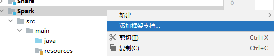
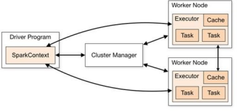
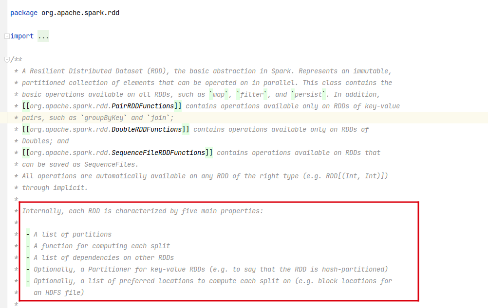
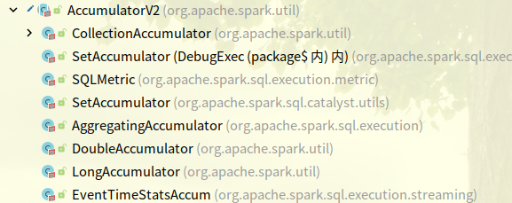

## Spark 概述

之前我们接触过一些大数据的内容，简而言之，大数据就是要处理海量数据的存储和计算。之前我们接触过 Hadoop，其中 Hadoop 的 MapReduce 就是 Hadoop 的计算框架。

但是 MapReduce 有个缺点，就是它在任务之间使用了磁盘操作，导致磁盘 IO 使用极多，这样实现的性能肯定是比较差劲的。

Spark 其实也是一个计算框架，它和 MapReduce 的主要不同点就是：Spark 是基于内存进行计算的框架，多个作业之间的衔接也是用的内存，那么它的效率就大大提高了。在现在的大数据框架中，Spark 往往是替代 MapReduce 的方案。

Spark 的核心模块：

- Spark Core：Spark 的核心，在它的基础上，Spark 进行了很多扩展的功能。
- Spark SQL：类似于 Hive SQL 简化了 MapReduce 的操作，Spark SQL 也简化了编写 Spark 代码的操作，同样类似 HSQL，也专门用于处理结构化数据。
- Spark Streaming：根据 Spark Core 扩展，用于流式计算，但是相较于 Flink 这种框架来说，Spark 的流式计算要差劲一些。
- Spark MLlib：根据 Spark Core 扩展，处理机器学习，这里不做涉及。
- Spark GraphX：根据 Spark Core 扩展，处理图形挖掘计算，这里不做涉及。

## 环境搭建

学习 Spark Core，首先就需要进行环境搭建。

1. Scala 环境：[scala_2.12.11](https://www.scala-lang.org/download/2.12.11.html)，注意配置好环境变量。
1. 将 Scala 加入到 IDEA 中的全局库中，并且将框架假如到当前模块中。

    

    

    

1. 添加 Spark 依赖到当前项目中。

    ```xml
    <dependencies>
        <dependency>
            <groupId>org.apache.spark</groupId>
            <artifactId>spark-core_2.12</artifactId>
            <version>3.0.0</version>
        </dependency>
    </dependencies>

    <build>
        <plugins>
            <!-- 该插件用于将 Scala 代码编译成 class 文件 -->
            <plugin>
                <groupId>net.alchim31.maven</groupId>
                <artifactId>scala-maven-plugin</artifactId>
                <version>3.2.2</version>
                <executions>
                    <execution>
                        <!-- 声明绑定到 maven 的 compile 阶段 -->
                        <goals>
                            <goal>testCompile</goal>
                        </goals>
                    </execution>
                </executions>
            </plugin>
            <plugin>
                <groupId>org.apache.maven.plugins</groupId>
                <artifactId>maven-assembly-plugin</artifactId>
                <version>3.1.0</version>
                <configuration>
                    <descriptorRefs>
                        <descriptorRef>jar-with-dependencies</descriptorRef>
                    </descriptorRefs>
                </configuration>
                <executions>
                    <execution>
                        <id>make-assembly</id>
                        <phase>package</phase>
                        <goals>
                            <goal>single</goal>
                        </goals>
                    </execution>
                </executions>
            </plugin>
        </plugins>
    </build>
    ```

1. `log4j.properties`：Spark 在运行时会产生大量日志，所以直接设置日志配置信息：

    ```xml
    log4j.rootCategory=ERROR, console
    log4j.appender.console=org.apache.log4j.ConsoleAppender
    log4j.appender.console.target=System.err
    log4j.appender.console.layout=org.apache.log4j.PatternLayout
    log4j.appender.console.layout.ConversionPattern=%d{yy/MM/dd HH:mm:ss} %p %c{1}: %m%n

    # Set the default spark-shell log level to ERROR. When running the spark-shell, the
    # log level for this class is used to overwrite the root logger's log level, so that
    # the user can have different defaults for the shell and regular Spark apps. log4j.logger.org.apache.spark.repl.Main=ERROR

    # Settings to quiet third party logs that are too verbose log4j.logger.org.spark_project.jetty=ERROR log4j.logger.org.spark_project.jetty.util.component.AbstractLifeCycle=ERROR log4j.logger.org.apache.spark.repl.SparkIMain$exprTyper=ERROR log4j.logger.org.apache.spark.repl.SparkILoop$SparkILoopInterpreter=ERROR log4j.logger.org.apache.parquet=ERROR
    log4j.logger.parquet=ERROR

    # SPARK-9183: Settings to avoid annoying messages when looking up nonexistent UDFs in SparkSQL with Hive support log4j.logger.org.apache.hadoop.hive.metastore.RetryingHMSHandler=FATAL log4j.logger.org.apache.hadoop.hive.ql.exec.FunctionRegistry=ERROR
    ```

1. 假如使用的是 Windows，那么可能会由于缺少 Hadoop 的相关支持，可能会报错，直接关联 Hadoop 的配置到 Windows 即可，这一步在之前学习 Hadoop 应该已经做过。

## 快速起步

下面来实现一个大数据版本的 HELLO WORLD：实现一次 Word Count，使用 Java 语言也完全支持，但是 Scala 开发比较快速，所以本次采用的是 Scala 语言。

```java
// 1. 定义 Spark 的配置，之后详细讲配置是什么东西
val sparkConf = new SparkConf().setMaster("local[*]").setAppName("WordCount")
// 2. 创建 Spark 上下文，也就是创建 Spark 环境
val sc = new SparkContext(sparkConf)

// 3. 读取文件数据
val fileRDD: RDD[String] = sc.textFile("input/word.txt")
/*
    1. 将数据进行转换，学过 Scala 或者 Java 应该有一定的基础。

    其中 '_' 代表的就是任意的单词：
    _.split(" ")：代表将每一行使用空格符切割
    flatMap 为扁平化处理
    map((_, 1)) 代表将 word => (word, 1)
    reduceByKey 代表将 (word, 1) 按照 word 分组，组内聚合
    */
val wordRDD: RDD[(String, Int)] = fileRDD.flatMap(_.split(" ")).map((_, 1)).reduceByKey(_ + _)
// 5. collect 代表收集，最终形成的结果如：(A, 2), (B, 3), (D, 2), ....
val wordCount: Array[(String, Int)] = wordRDD.collect()
wordCount.foreach(println)

sc.stop()
```

## Spark 运行环境

### Local 模式

Local 模式指的就是不需要其他任何节点资源就可以在本地执行 Spark 代码的环境，一般用于教学、调试、演示等。我们之前在 IDEA 的快速开始案例是开发环境，和 Local 模式不太一样。

TODO：待补充

### Standalone 模式

TODO：待补充

### Yarn 模式

TODO：待补充

### K8s && Mesos 模式

TODO：待补充

### Windows 模式

TODO：待补充

## Spark 运行架构

**Driver && Executor**

Spark 核心是一个计算引擎，采用了标准 master-slave 架构，Spark 在执行时的基本架构为 Driver-Executor。

其中 Driver 就是 master，负责任务调度；Executor 是 slave，负责任务的实际执行。下图的 Cluster Manager 的主要作用就是启动 Executor，之后 Executor 就与 Driver 直接通信了。



从上图可以看到，Spark 有两个核心组件：

- Driver：Spark 驱动器节点，用于执行 Spark 任务中的 main 方法，负责实际代码的执行操作。

    主要用于：将用户程序转换为作业（Job）、在各个 Executor 中调度任务（Task）、跟踪 Executor 的执行情况、通过 UI 展示运行情况。

    简单来说，Driver 用于统一调度，也叫 Driver 类。

- Executor：

    Spark 中的工作节点，每一个 Executor 都是一个 JVM 进程。Executor 负责运行具体任务（Task），任务之间相互独立，互不影响。

    Spark 启动时 Executor 会同时启动，并且伴随整个 Spark 的生命周期。假如有 Executor 发生故障，Spark Task 调度到其他 Executor 上继续执行。

    Executor 有两个核心功能：负责运行 Spark Task，并将结果返回 Driver、通过自身的块管理器（Block Manager）为用户程序中要求缓存的 RDD 提供内存式存储。

**Master && Worker**

Spark 集群的独立部署模式中，不需要其他资源调度框架，所以自己实现了一套资源调度框架：Master、Worker。

Master 是一个进程，主要用于集群资源分配、调度，类似于 YARN 的 RM。Worker 类似于 YARN 中的 NM，可以提供给 Executor 资源（例如 CPU 核心数量 Core、内存大小等）。

**Application Master**

类似 Hadoop ，Application Master 是单个任务的老大，简单来说就是：ResourceManager 和 Driver 之间的解耦合就是利用 ApplicationMaster。

**并行度**

并行度 Parallelism：这里是并行，不是并发。

在分布式计算框架中，一般都是多个任务同时执行，由于任务分布在不同的计算节点上进行计算，所以可以实现真正的多任务并行执行，集群中并行执行任务的个数叫做并行度。

一个作业（Job）的并行度主要取决于配置，当然也可以在运行中动态修改。

**有向无环图**

有向无环图 DAG：Spark 擅长进行有向无环图的计算，而 Hadoop 不行。

简单来说，有向无环图就是这个任务依赖于上个任务的执行结果，是一种抽象的结构，其中箭头所指向的方向是依赖的方向，例如： `A -> B`，就是 A 依赖于 B 的结果，下图中 stage0 依赖于 stage1 的结果。


**Spark 数据结构**

Spark 为了能够进行高并发和高吞吐的处理，封装了三大数据结构，用于处理不同的应用场景：

- RDD：弹性分布式数据集。
- 累加器：分布式共享只写变量。
- 广播变量：分布式共享只读变量。

## RDD

### RDD 概述

RDD，Resilient Distributed Dataset，弹性分布式数据集，是 Spark 最基本的数据处理模型：

- 弹性：存储弹性（内存和磁盘自动切换）、容错弹性（数据丢失自动恢复）、计算弹性（计算出错重试）、分片弹性（根据需要重新分片）。
- 分布式：数据存储到大数据集群不同节点上。
- 数据集：RDD 封装了计算逻辑，并不保存数据。
- 不可变：RDD 封装的计算逻辑不可改变，如果要改变只能重新生成新的 RDD。
- 数据抽象：RDD 是一个抽象类，需要子类具体实现。

**RDD 核心属性**



上图是 RDD 的注解，其中说明了五大核心属性：

- 分区列表：RDD 数据结构中存在分区列表，用于执行任务时并行计算，是实现分布式计算的重要属性。
- 分区计算函数：Spark 使用分区计算函数对每一个分区进行计算。
- RDD 依赖：RDD 之间存在依赖关系。
- 分区器：可选，当为 KV 类型数据时，可以设定分区器自定义数据分区。
- 首选位置：可选，计算数据可以根据计算节点的状态选择不同位置计算。

**RDD 简易理解**

使用文字的方式确实比较抽象了，所以在这里先行一个概述，有人使用薯片的加工流程做了比喻。


首先一开始那一袋子土豆，就可以将其看为一个 RDD。

RDD 中有分区的概念，这其实就可以看成带泥土豆阶段，在这个阶段中，每一个带泥土豆都是 RDD 的一个分区。

接下来进行土豆的清洗、切片、烘焙、分发、装桶，这其实就是 RDD 使用算子的过程中进行的转换。具体算子是什么之后会讲。

从清洗到烘焙的过程中，可以看到 RDD 的分区没有进行改变，这个过程叫做窄依赖，也就是父 RDD 的数据只能被一个子 RDD 所继承。

在即食薯片到装桶的过程中间，经过了一个分发的阶段，也就是将大小不一的薯片归类为三种相同大小的薯片，这个过程叫做宽依赖，也就是父 RDD 中的数据可能被多个子 RDD 所继承。

### RDD 基础编程

**RDD 创建**

```scala
val sparkConf = new SparkConf().setMaster("local[*]").setAppName("spark")
val sc = new SparkContext(sparkConf)

// 1. 从集合（内存）中创建 RDD，其实 makeRDD 底层就是 parallelize
val memoryRDD: RDD[Int] = sc.parallelize(List(1, 2, 3, 4))
val memoryRDD2: RDD[Int] = sc.makeRDD(List(1, 2, 3, 4))

// 2. 从文件（磁盘）创建 RDD
val diskRDD: RDD[String] = sc.textFile("input.txt")

// 3. 基于 RDD 创建 RDD，是运算完成之后产生新的 RDD，详情见后续张杰
val rddtoRDD: RDD[Array[String]] = diskRDD.map(_.split(" "))

// 4. 直接创建 RDD，一般是 Spark 框架自身使用

sc.stop()
```

**RDD 的并行度与分区**

- 并行度：

    Spark 将一个 Job 切分为多个 Task，然后将这些 Task 发送给 Executor 去执行。能够同时并行计算的 Task 的数量被被称为并行度。

    注意，Job 切分 Task 的个数和 Executor 能够执行 Task 的个数不一定相同，能够执行 Task 的个数才叫做并行度。

- 分区：

    默认情况下，分区的规则在使用内存和使用文件有所不同：

    读取内存数据时，数据可以按照并行度的设定进行数据的分区操作，读取文件数据时，默认采用 Hadoop 的规则进行切片分区。

### RDD 算子

RDD 的算子其实就是封装的数据计算逻辑，类似于俄罗斯套娃，上一个 RDD 可以根据规则形成新的 RDD。RDD 的算子就分为两类：

- RDD 转换算子：这一类 RDD 算子可以看成只是封装了逻辑，每一层的封装都会产生新的 RDD，但是这些 RDD 不会真正去执行数据操作。
- RDD 行动算子：这一类 RDD 算子是真正的去执行数据操作的算子，只要出现 RDD 的行动算子，那么 RDD 之前的所有逻辑（包括转换算子的逻辑）都会按顺序执行。

#### RDD 转换算子

RDD 根据数据处理方式的不同，可以分为 Value 类型、双 Value 类型，Key Value 类型。

**Value 类型**

- map：将输入数据逐条映射转换，包括值和类型的转换。
- mapPartitions：将待处理的数据以分区为单位，发送到计算节点进行处理，这里的处理可以为任意处理，比如过滤数据。

    map 和 mapPartitions 有区别：

    从数据的角度考虑，map 是一个数据一个数据地执行，而 mapPartitions 是以分区为单位进行批处理操作。

    从功能的角度考虑，map 是将数据进行转换，但是不会去改变数据的数量，而 mapPartitions 需要一个迭代器，返回一个迭代器，没有要求总数不变，所以可以对数据进行增删。

    从性能的角度来考虑：map 类似串行执行，而 mapPartitions 类似批处理，但是 mapPartitions 会长时间占用内存，有可能会导致内存溢出。所以内存有限情况下优先使用 map。

    ```scala
    val sc = new SparkContext(new SparkConf().setMaster("local[*]").setAppName("Operator"))

    // map：一进一出，将数据逐条进行转换处理，这里就是乘 2 处理操作。
    sc.makeRDD(List(1, 2, 3, 4)).map(_ * 2).foreach(println)

    /*
        mapPartitions：按照分区为单位，将数据发送到计算节点去处理。输入为一个迭代器，输入也是一个迭代器。

        与 map 有所不同：
            - map 是按照分区内的数据为单位去处理，速度较慢。
            - mapPartitions：按照分区为单位去处理，速度较快，但是应当警惕当数据量过于庞大时，内存可能会溢出。
    */
    sc.makeRDD(List(1, 2, 3, 4)).mapPartitions(iterator => iterator.filter(_ % 2 == 0)).foreach(println)
    sc.stop()
    ```

- flatMap：将数据扁平化处理：

    例如 `List(List(1, 2), List(3, 4)) => List(1, 2, 3, 4)`

    ```scala
    val sc = new SparkContext(new SparkConf().setMaster("local[*]").setAppName("Operator"))

    /*
    在这里可以将 List(1, 2) 和 List(3, 4) 看成两条河流：
        - 一般的 map 操作都是对这里两条河流分别进行操作，最后分别输出。
        - flatMap 可以看成将这两条河流分别进行处理，然后将处理的结果汇总到一起输出。在这里没有对 list 进行处理，直接输出，就是做了一层汇总的效果。
    */
    sc.makeRDD(List(List(1, 2), List(3, 4))).flatMap(list => list).foreach(println)

    sc.stop()
    ```

- glom：将同一个分区的数据直接转换为相同类型的内存数组进行处理，分区不变。

    ```scala
    val sc = new SparkContext(new SparkConf().setMaster("local[*]").setAppName("Operator"))

    val rdd: RDD[Int] = sc.makeRDD(List(List(1, 2), List(3, 4)))
    val arrRDD: RDD[Array[Int]] = rdd.glom()

    sc.stop()
    ```

- groupBy：将数据根据指定的规则进行分组：

    分区默认不变，但是数据会被打乱重新组合，这种操作我们称为 Shuffle，极限情况下，数据有可能被分到同一个分区中，Shuffle 还有其他的坏处，要尽量避免 Shuffle 操作。

    注意，上面说的分组并不是分区，一个分区中可能有多个分组。

    ```scala
    val sc = new SparkContext(new SparkConf().setMaster("local[*]").setAppName("Operator"))

    /*
        数字对 2 进行取余共有两种结果：0、1.

        这里进行分组，条件为 List 中的元素是否为 2 的余数，那么就会分为两组：
        - 一组的 key 为 0，value 为 2 的余数。
        - 一组的 key 为 1，value 非 2 的余数。
    */
    val rdd: RDD[(Int, Iterable[Int])] = sc.makeRDD(List(1, 2, 3, 4)).groupBy(_ % 2)
    // scala 中 ，_1 和 _2 分别对应 key、value
    rdd.foreach(group => {
        println(group._1)
        println(group._2.toString())
    })
    sc.stop()
    ```

- filter：按照指定规则进行过滤，分区不变。过滤之后有可能导致数据倾斜。
- sample：按照指定的规则从数据集中抽取数据。

    ```scala
    val sc = new SparkContext(new SparkConf().setMaster("local[*]").setAppName("Operator"))

    val rdd = sc.makeRDD(List(1, 2, 3, 4))

    /*
        sample，简单来说是做随机取样的一个函数，它可以根据指定的规则从数据集中抽取数据。

        简单来说，假如有这样一个箱子，箱子里有各种各样的小球，对于这些小球，有这样的抽取方法：

        - 抽到的数据不放回箱子：伯努利算法：

            也叫做 0、1 算法，简单来说就是非黑即白，和扔硬币一样，不是正面就是反面，采取这样的算法，sample 有三个参数：

            - 参数一：抽取的数据是否放回，选择伯努利算法当然是 false。
            - 参数二：一个数据被抽取到的几率，范围在 [0, 1]，0 为全取，1 为全不取。
            - 参数三：随机种子，一般来说可以不填。

        - 抽到的数据放回箱子：泊松算法：

            如果选择泊松分布，有以下几个参数：

            - 参数一：抽取的数据是否放回，选择泊松分布当然选择 true。
            - 参数二：重复数据的几率，范围 >= 0，表示每个元素被期望抽取到的次数。
            - 参数三：随机数种子，一般来说可以不填。
    */

    rdd.sample(false, 0.5).foreach(print)
    println()
    rdd.sample(true, 2).foreach(print)

    sc.stop()
    ```

    为啥这里说第三个参数中子数可以不填呢，如果玩过游戏都知道，地图的种子确定了，那么地图就确定了，如果写死了种子，写死了算法，那么最终的数据就是确定的。

- distinct：数据集去重。
- coalesce：缩减分区：

    如果当前 Spark 程序中存在过多的小任务，每个任务的数据量都很少，那么启动多个 task 就显得很不划算：

    1. 因为资源有时候是不太好动态调整的。比如每启动一个 task，都需要给 executor 1核2G 来进行计算一个 1M 的数据，简直大材小用，还容易导致资源紧张。
    1. 调度问题也是个问题，有那调度的时间，早就算好好几次了。

    ```scala
    val sc = new SparkContext(new SparkConf().setMaster("local[*]").setAppName("Operator"))

    // 指定分区为 6
    val rdd = sc.makeRDD(List(1, 2, 3, 4, 5, 6), 6)
    // 将分区数缩减到 2
    rdd.coalesce(2)

    sc.stop()
    ```

    coalesce 参数：

    - 参数一：想要缩减到几个分区。
    - 参数二：shuffle，默认为 false。
    - 参数三：分区器。

- repartition：重置分区。

    ```scala
    val sc = new SparkContext(new SparkConf().setMaster("local[*]").setAppName("Operator"))

    val rdd = sc.makeRDD(List(1, 2, 3, 4, 5, 6), 2)
    rdd.repartition(6)

    sc.stop()
    ```

    其实调用了 coalesce，参数 shuffle 的默认值为 true。其实无论是将分区多的 RDD 转为分区少的 RDD，还是将分区少的 RDD 转换为分区多的 RDD，它都可以胜任，因为无论如何都会经过 shuffle。

    coalesce 的 shuffle 可以自由选择，而 repartition 必须进行 shuffle。这里其实涉及到了一个宽窄依赖的问题，宽窄依赖在后面会有详细的解释。

- sortBy：按照规则进行排序：用于排序处理，排序后，新产生的 RDD 分区数量和原来的 RDD 分区数量保持一致，中间存在 shuffle 过程。

**双 Value 型**

- intersection：两个 RDD 取交集，返回一个新的 RDD。
- union：两个 RDD 去并集，返回一个新的 RDD。
- subtract：两个 RDD 取差集：以一个 RDD 为主，去除两个 RDD 的重复元素，将其他的元素保留。
- zip：将两个 RDD 中的元素以键值对形式进行合并，注意这不是压缩。

**Key Value 型**

- partitionBy：将数据按照指定 partitioner 重新分区，Spark 默认分区器为 HashPartitioner。
- reduceByKey：将数据按照相同的 key 对 value 进行聚合。
- groupByKey：将数据按照相同的 key 对 value 进行分组。

    reduceByKey 和 groupByKey 其实很相似：

    两者都存在 shuffle 操作，但是 reduceByKey 会在 shuffle 之前对分区内相同 key 的数据进行一次预聚合，类似于 MapReduce 的 combine 阶段，这样做的好处是可以减少落盘的数据量。

    groupByKey 仅仅是分组，不会进行 combine 操作。

    所以从 reduceByKey 性能较高。

- aggregateByKey：将分区内和分区间指定两套规则，分区内和分区间分别使用这两套规则进行计算。
- foldByKey：指定一套规则，分区内和分区间的计算都使用这一套规则，相当于 aggregateByKey 的简化版。
- combineByKey：进行聚集操作，它允许用户的返回值类型和输入类型不一致。
- sortByKey：根据 key 来进行排序，其中 key 必须可以排序（自定义的 Bean 实现排序接口）。
- join：在两个 RDD 之间进行 JOIN 操作，返回一个相同的 key 连接到一起的 RDD。

    ```scala
    val sparkConf = new SparkConf().setMaster("local[*]").setAppName("spark")
    val sc = new SparkContext(sparkConf)

    val rdd1 = sc.makeRDD(Array((1, "a"), (2, "b"), (3, "c")))
    val rdd2 = sc.makeRDD(Array((1, "x"), (2, "y"), (3, "z")))
    /*
    (1,(a,x))
    (2,(b,y))
    (3,(c,z))
    */
    rdd1.join(rdd2).collect().foreach(println)

    sc.stop()
    ```

- leftOuterJoin：类似 SQL 的左外链接。
- cogroup：两种 (K, V) 和 (K, W) 类型的 RDD 调用形成：`(K, (Iterable<V>, (Iterable<W>)))`

    ```scala
    val sparkConf = new SparkConf().setMaster("local[*]").setAppName("spark")
    val sc = new SparkContext(sparkConf)

    val rdd1 = sc.makeRDD(Array((1, "a"), (2, "b"), (3, "c")))
    val rdd2 = sc.makeRDD(Array((1, "x"), (2, "y"), (3, "z")))
    /*
    (1, (CompactBuffer(a), CompactBuffer(x)))
    (2, (CompactBuffer(b), CompactBuffer(y)))
    (3, (CompactBuffer(c), CompactBuffer(z)))
    */
    rdd1.cogroup(rdd2).collect().foreach(println)
    /*
    ax
    by
    cz
    */
    rdd1.cogroup(rdd2).collect().foreach(v=>{
        val value = v._2
        value._1.foreach(print)
        value._2.foreach(print)
        println()
    })

    sc.stop()
    ```

#### RDD 行动算子

- reduce：聚集 RDD 中的元素，首先聚集分区内，之后聚集分区间。

    ```scala
    val sparkConf = new SparkConf().setMaster("local[*]").setAppName("spark")
    val sc = new SparkContext(sparkConf)

    val rdd = sc.makeRDD(List(1, 2, 3, 4))
    println(rdd.reduce(_ + _))

    sc.stop()
    ```

- collect：将 RDD 中的所有数据从 Executor 收集到 Driver。
- count：返回 RDD 中元素的个数。
- first：返回 RDD 中第一个元素。
- task：返回一个由 RDD 的前 n 个元素组成的数组。
- taskOrdered：返回 RDD 的后 n 个元素组成的数组。
- aggregate：分区数值进行聚合。给一个初始值，初始值聚合第一个元素，形成的结果聚合第二个元素，形成的结果聚合第三个元素……

    ```scala
    val sparkConf = new SparkConf().setMaster("local[*]").setAppName("spark")
    val sc = new SparkContext(sparkConf)

    // 切片数量为 2，最终分区数量为 2
    val rdd = sc.makeRDD(List(1, 2, 3, 4), 2)
    /*
    第一个参数 10 为从 10 开始聚合，也就是每个分区内 10 + ${1} + ${2}，之后分区之间相加也是 10 + ${1} + ${2}
    10 + 1 + 2 = 13
    10 + 3 + 4 = 17
    10 + 13 + 17 = 40
    */
    println(rdd.aggregate(10)(_ + _, _ + _))

    sc.stop()
    ```

- fold：aggregate 的简化版本，两个分区的聚合方式都相同。

    ```scala
    val sparkConf = new SparkConf().setMaster("local[*]").setAppName("spark")
    val sc = new SparkContext(sparkConf)

    // 切片数量为 2，最终分区数量为 2
    val rdd = sc.makeRDD(List(1, 2, 3, 4), 2)
    /*
    第一个参数 10 为从 10 开始聚合，也就是每个分区内 10 + ${1} + ${2}，之后分区之间相加也是 10 + ${1} + ${2}
    10 + 1 + 2 = 13
    10 + 3 + 4 = 17
    10 + 13 + 17 = 40
    */
    println(rdd.fold(10)(_ + _))

    sc.stop()
    ```

- countByKey：根据 key 统计 value 的个数，返回 `key, count(value)`。
- saveAsTextFile：保存为 Text。
- saveAsObjectFile：序列化为对象保存文件。
- saveAsSequenceFile：保存为 sequence 文件。
- foreach：分布式遍历每个，所以有可能顺序不一致。

### RDD 序列化

**闭包检查**

从计算的角度来考虑，RDD 算子之外的代码其实都是在 Driver 端运行，算子内的逻辑都是在 Executor 中运行。

```java
object CreateRDDDemo {
  def main(args: Array[String]): Unit = {
    val sparkConf = new SparkConf().setMaster("local[*]").setAppName("spark")
    val sc = new SparkContext(sparkConf)

    val search = new Search("SPARK")

    search.getMatch(sc.makeRDD(List("HELLO WORLD", "HELLO SPARK"))).collect().foreach(println)

    sc.stop()
  }
}

class Search(query: String) extends Serializable {
  def isMatch(s: String): Boolean = {
    s.contains(query)
  }

  def getMatch(rdd: RDD[String]): RDD[String] = {
    rdd.filter(this.isMatch)
  }
}
```

在 Scala 中，当算子内使用到了算子外的变量，也就是说 Executor 使用到了 Driver 的变量，这个时候假如对应的变量没有进行序列化，就无法通过网络传输给 Executor。

在执行任务之前，检测对象是否可以进行序列化，这个过程叫做闭包检测。

**Kryo**

原生的 Java 序列化字节比较多，比较重，序列化之后对象比较大，Spark 出于性能考虑，从 Spark2.0 开始支持[kryo](https://github.com/EsotericSoftware/kryo)。

它是一个序列化框架，速度是 Serializable 的 10 倍，但是注意，即使是使用 kryo 也需要实现 Serializable。

### RDD 依赖关系

**RDD 的血缘关系**

```scala
val sparkConf = new SparkConf().setMaster("local[*]").setAppName("spark")
val sc = new SparkContext(sparkConf)
/*
(2) input/1.txt MapPartitionsRDD[1] at textFile at CreateRDDDemo.scala:11 []
 |  input/1.txt HadoopRDD[0] at textFile at CreateRDDDemo.scala:11 []
*/
val fileRDD: RDD[String] = sc.textFile("input/1.txt")
println(fileRDD.toDebugString)
println("----------------------")

/*
(2) MapPartitionsRDD[2] at flatMap at CreateRDDDemo.scala:15 []
 |  input/1.txt MapPartitionsRDD[1] at textFile at CreateRDDDemo.scala:11 []
 |  input/1.txt HadoopRDD[0] at textFile at CreateRDDDemo.scala:11 []
*/
val wordRDD: RDD[String] = fileRDD.flatMap(_.split(" "))
println(wordRDD.toDebugString)
println("----------------------")

/*
(2) MapPartitionsRDD[3] at map at CreateRDDDemo.scala:19 []
 |  MapPartitionsRDD[2] at flatMap at CreateRDDDemo.scala:15 []
 |  input/1.txt MapPartitionsRDD[1] at textFile at CreateRDDDemo.scala:11 []
 |  input/1.txt HadoopRDD[0] at textFile at CreateRDDDemo.scala:11 []
*/
val mapRDD: RDD[(String, Int)] = wordRDD.map((_,1))
println(mapRDD.toDebugString)
println("----------------------")

/*
(2) ShuffledRDD[4] at reduceByKey at CreateRDDDemo.scala:23 []
 +-(2) MapPartitionsRDD[3] at map at CreateRDDDemo.scala:19 []
    |  MapPartitionsRDD[2] at flatMap at CreateRDDDemo.scala:15 []
    |  input/1.txt MapPartitionsRDD[1] at textFile at CreateRDDDemo.scala:11 []
    |  input/1.txt HadoopRDD[0] at textFile at CreateRDDDemo.scala:11 []
*/
val resultRDD: RDD[(String, Int)] = mapRDD.reduceByKey(_+_)
println(resultRDD.toDebugString)

resultRDD.collect()
sc.stop()
```

RDD 使用这种直接记录操作的方式记录下了一系列血缘（Lineage），当分区丢失时，可以使用重新走一遍操作的方式恢复丢失的分区。

除了直接记录操作之外，RDD 还会记录相邻的 RDD 之间的关系，我们叫做依赖关系：

```scala
def main(args: Array[String]): Unit = {
  val sparkConf = new SparkConf().setMaster("local[*]").setAppName("spark")
  val sc = new SparkContext(sparkConf)

  // List(org.apache.spark.OneToOneDependency@5dd903be)，一对一的关系
  val fileRDD: RDD[String] = sc.textFile("input/1.txt")
  println(fileRDD.dependencies)
  println("----------------------")

  // List(org.apache.spark.OneToOneDependency@784abd3e)，一对一的关系
  val wordRDD: RDD[String] = fileRDD.flatMap(_.split(" "))
  println(wordRDD.dependencies)
  println("----------------------")

  // List(org.apache.spark.OneToOneDependency@37df14d1)，一对一的关系
  val mapRDD: RDD[(String, Int)] = wordRDD.map((_,1))
  println(mapRDD.dependencies)
  println("----------------------")

  // List(org.apache.spark.ShuffleDependency@34585ac9)，进行了 Shuffle 操作
  val resultRDD: RDD[(String, Int)] = mapRDD.reduceByKey(_+_)
  println(resultRDD.dependencies)

  resultRDD.collect()

  sc.stop()
}
```

**RDD 宽窄依赖、阶段划分、任务划分**

RDD 的算子就像是俄罗斯套娃，之前讲过 RDD 的逻辑不能更改，如果需要更改，那么就要重新生成一个新的算子。

在从老的 RDD 到新 RDD 之间就产生了变化，例如：

```scala
sc.makeRDD(List(1, 2, 3, 4)).map(_ * 2).foreach(println)
```

在这里，`makeRDD` 就产生了 RDD（老的 RDD），之后经过 `map` 操作就产生了一个新的 RDD。


还是使用薯片制作的流程看宽窄依赖。

从清洗到烘焙的过程中，可以看到 RDD 的分区没有进行改变，这个过程叫做窄依赖，也就是父 RDD 的数据只能被一个子 RDD 所继承，也可以理解为独生子女。

在即食薯片到装桶的过程中间，经过了一个分发的阶段，也就是将大小不一的薯片归类为三种相同大小的薯片，这个过程叫做宽依赖，也就是父 RDD 中的数据可能被多个子 RDD 所继承，可以理解为多胎。

在进行宽依赖的过程中，进行了一个薯片重新分区的情况，这其实就是进行了数据的 Shuffle，就是打乱重新排序。

---

每一个 Spark 程序都是一个 Application，每一个 Application 遇到行动算子之后就会形成一个 Job，所以一个 Application 中可能有多个 Job。

在 Job 的执行过程中，可能会遇到 Shuffle，那么此时就会划分为一个或者多个可以并行计算的 stage。

每一个 stage 可以根据当前 RDD 的 partition 分为多个 Task，Task 由 Executor 去执行。


在上图中，RDD 经过了 map、filter 操作，这两个操作并没有改变 RDD 的分区，但是经过 ReduceByKey 算子之后，分区中的数据被打乱重新排序了，这个操作就是宽依赖。

我们任务的阶段划分即从开始的 RDD 到 Filtered RDD 为一个阶段。Reduced RDD 为一个阶段。也就是说任务阶段的划分完全取决与可以进行 Shuffle 的算子。

在上图第一个阶段中，Task 的数量取决于此阶段最后一个 RDD 中分区数量，也就是 Filtered RDD 中的 4 个分区将会形成 4 个 Task。

在第二个阶段中，Task 的数量取决于最后此阶段最后一个 RDD 中分区数量，也就是说取决于 Reduced RDD 的数量，也是 4 个。

### RDD 持久化

RDD 虽然叫做弹性分布式数据集，但其实没有进行 Shuffle 之前，它并不会保存数据。不会保存数据的意思是，假如在计算的过程中出现了某些错误，那么并不会从之前的 RDD 开始算，而是从头开始，例如：

```scala
val fileRDD: RDD[String] = sc.textFile("input/1.txt")
val wordRDD: RDD[String] = fileRDD.flatMap(_.split(" "))
val mapRDD: RDD[(String, Int)] = wordRDD.map((_,1))
val resultRDD: RDD[(String, Int)] = mapRDD.reduceByKey(_+_)
```

在这个例子中，假如中间在计算时忽然发生了错误导致任务失败（例如在进行 map 操作时失败），那么数据的计算不会从 map 再次开始，而是从数据的源头开始，也就是 `textFile`。

这肯定是我们不能忍受的，假如有一批数据量很大，耗时很久的任务，在执行过程中失败了，我们肯定不能接受从头再来。

所以 Spark 提供了保存中间结果的功能，也就是 RDD 的持久化。利用 RDD 的持久化可以将计算结果中间的 RDD 保存到 JVM 的堆中。

但是注意，进行持久化的操作并不是行动算子，也仅仅是一个逻辑的封装，要等到行动算子进行任务的执行之后，到达缓存的逻辑才会将 RDD 缓存起来。

**Cache**

```scala
val fileRDD: RDD[String] = sc.textFile("input/1.txt")
val wordRDD: RDD[String] = fileRDD.flatMap(_.split(" "))

wordRDD.cache()

val mapRDD: RDD[(String, Int)] = wordRDD.map((_,1))
val resultRDD: RDD[(String, Int)] = mapRDD.reduceByKey(_+_)
```

简单来说，利用 `cache()` 方法就可以将 RDD 缓存，假如上述案例在 map 操作时出错了，也不需要从头开始计算。

但是我们也说过，存储默认是存到 JVM 堆中的，那么假如内存不够了，缓存也可以丢失，所以可以更改存储级别：

```scala
val fileRDD: RDD[String] = sc.textFile("input/1.txt")
val wordRDD: RDD[String] = fileRDD.flatMap(_.split(" "))

wordRDD.cache()
wordRDD.persist(StorageLevel.MEMORY_ONLY_SER)

val mapRDD: RDD[(String, Int)] = wordRDD.map((_,1))
val resultRDD: RDD[(String, Int)] = mapRDD.reduceByKey(_+_)
```

| 级别                | 备注                                                                                                                    |
| ------------------- | ----------------------------------------------------------------------------------------------------------------------- |
| MEMORY_ONLY         | 以序列化的方式，仅存在内存中。内存不够不会再缓存。默认方式。                                                            |
| MEMORY_ONLY_SER     | 以序列化的方式，仅存在内存中。这种方式比反序列化对象的方式很大程度上节省空间，但是会增加 CPU 负担。内存不够不会再缓存。 |
| MEMORY_AND_DISK     | 反序列化方式，内存不够放硬盘。                                                                                          |
| MEMORY_AND_DISK_SER | 序列化方式，内存不够放硬盘。                                                                                            |
| DISK_ONLY           | 在硬盘上缓存                                                                                                            |
| MEMORY_ONLY_2       | 与上面功能相同，只不过会在集群中的两个节点上建立副本                                                                    |
| MEMORY_AND_DISK_2   | 与上面功能相同，只不过会在集群中的两个节点上建立副本                                                                    |

Spark 的存储级别本质其实就是 CPU 和 内存之间的权衡。

如果内存可以缓存全部的 RDD，那么使用默认方式即可，默认方式可以最大程度提高 CPU 效率。
假如内存不可缓存全部的 RDD，那么可以优先使用 `MEMORY_ONLY_SER` 以减少磁盘浪费，然后挑一个快速序列化对象的框架（之前说的 Kryo），不必要尽量不要溢写到磁盘，效率太低。

**CheckPoint**

和 Cache 不同，CheckPoint 就是将中间 RDD 写入到磁盘中。

如果 RDD 的血缘关系过长，那么还不如在中间节点做点容错处理，好过之后有错误从头开始执行。

但是只要使用了 CheckPoint，就会切断之前的血缘关系，从检查点的这一刻开始作为根。

**Cache 和 CheckPoint 区别**

- Cache 不会切断血缘，CheckPoint 会切断血缘。
- Cache 可靠性低，一般保存在内存、磁盘中。CheckPoint 通常保存在 HDFS 等高容错系统中。

### RDD 分区器


分区器决定了 RDD 中分区的个数，RDD 中的每条数据经过 Shuffle 之后进入到哪个分区。

- 只有 KV 类型的 RDD 才有分区器，非 KV 类型的 RDD 分区值为 None。
- 每个 RDD 的分区 ID 范围 `0 ~ (numPartitions - 1)`，决定这个值是属于哪个分区的。

Spark 支持多种分区器，我们主要探索 Hash（默认分区器）、Range、自定义分区。

**Hash 分区**

```scala
class HashPartitioner(partitions: Int) extends Partitioner {

  ...

  def getPartition(key: Any): Int = key match {
    // 之前说的是，假如不是 KV 类型，那么 K 为 null，这里就是 0 号分区，也就是没有分区。
    case null => 0
    // 这里调用工具进行分区，第一个参数为 hashcode，第二个参数为指定的分区数量
    case _ => Utils.nonNegativeMod(key.hashCode, numPartitions)
  }

  ...
}
```

```scala
def nonNegativeMod(x: Int, mod: Int): Int = {
    // 首先进行 hashCode 对 分区数量取余操作
    val rawMod = x % mod
    // 保证为 0 ~ 分区数
    rawMod + (if (rawMod < 0) mod else 0)
}
```

**Range 分区**

将一定范围内的数据映射到一个分区中，保证每隔分区内的数据均匀，而且分区见有序。

## 累加器

**累加器的概念和原理**

之前说 Spark 为了能够进行高并发和高吞吐的处理，封装了三大数据结构。RDD 我们已经看过了，接下来就是累加器和广播变量。

累加器其实是一个分布式的，只写的变量。它的实现原理是这样的：

在 Driver 端先定义变量，在 RDD 形成 Task 分发到每一个 Executor 时，Executor 端的每一个 Task 都会得到累加器的一个新的副本，每一个 Task 更新这个变量之后，都会传到 Driver 端，然后 merge 改变的值。

**系统累加器**

```scala
val sc = new SparkContext(new SparkConf().setMaster("local[*]").setAppName("AccumulatorDemo"))

val rdd = sc.makeRDD(List(1, 2, 3, 4, 5))
// 声明一个 Long 的累加器
val sum = sc.longAccumulator("sum")
// 累加器的使用
rdd.foreach(num => sum.add(num))
println(sum.value)

sc.stop()
```

除了 longAccumulator 之外，系统的累加器还有：



**自定义累加器**

实际上，我们大部分在使用累加器的过程中都不会单纯地使用系统的累加器，结合业务场景，我们需要自定义的累加器。

自定义累加器仅需两个步骤：

- 继承 `AccumulatorV2`，设定泛型。
- 重写抽象方法。
- 向 Spark 中注册累加器。

接下来使用 WordCountAccumulator 来作为案例，实现自定义累加器。

```scala
/**
 * AccumulatorV2 共有两个泛型：输入、输出。
 * 这里定义了输入为 String，输出为 Map[String, Long]
 */
class WordCountAccumulator extends AccumulatorV2[String, mutable.Map[String, Long]] {

  // 定义 map 作为输出
  var map: mutable.Map[String, Long] = mutable.Map()

  // 累加器为初始状态的条件，这里就是当 map 为空时
  override def isZero: Boolean = {
    map.isEmpty
  }

  // 复制累加器，这一步用于 Driver 和 Executor 做交互时，复制累加器的副本
  override def copy(): AccumulatorV2[String, mutable.Map[String, Long]] = {
    new WordCountAccumulator
  }

  // 重置累加器
  override def reset(): Unit = {
    map.clear()
  }

  // 累加器累加数据，word 就是输入的 String
  override def add(word: String): Unit = {
    /*
      查询 map 中是否拥有相同的单词：

      - 假如存在此单词，则在 map 中 +1 数量
      - 假如不存在此单词，则在 map 中增加这个词
     */
    map(word) = map.getOrElse(word, 0L) + 1L
  }

  // 用于 Driver 端合并从 Executor 传过来的累加器
  override def merge(other: AccumulatorV2[String, mutable.Map[String, Long]]): Unit = {
    val map1 = map
    val map2 = other.value

    // map2 为初始值。innerMap 为返回结果对象，是一个迭代值。kv 表示 map1 中的每个值。
    map = map1.foldLeft(map2)((innerMap, kv) => {
        /*
          查询 innerMap 中是否拥有相同的单词：

          - 假如存在此单词，则在 innerMap 中 +1 数量
          - 假如不存在此单词，则在 innerMap 中增加这个词
         */
        innerMap(kv._1) = innerMap.getOrElse(kv._1, 0L) + kv._2
        innerMap
      }
    )
  }

  // 返回累加器的结果
  override def value: mutable.Map[String, Long] = map
}
```

```scala
val sc = new SparkContext(new SparkConf().setMaster("local[*]").setAppName("AccumulatorDemo"))

val rdd = sc.makeRDD(List("HELLO WORLD", "HELLO SPARK", "HELLO SCALA"))
val wcAcc = new WordCountAccumulator()
sc.register(wcAcc,"WordCountAccumulator")
rdd.foreach(word => wcAcc.add(word))
println(wcAcc.value)

sc.stop()
```

## 广播变量

Spark 的最后一个结构，广播变量，它是一个分布式的，共享的，只读变量。广播变量的分发是比较高效的。

广播变量一般情况下会用来分发较大的对象，它会向所有的 Executor 发送一个较大的只读值，来让一个或多个 Spark 操作使用。

```scala
val rdd1 = sc.makeRDD(List( ("a",1), ("b", 2), ("c", 3), ("d", 4) ),4)
val list = List( ("a",4), ("b", 5), ("c", 6), ("d", 7) )
// 声明广播变量
val broadcast: Broadcast[List[(String, Int)]] = sc.broadcast(list)

val resultRDD: RDD[(String, (Int, Int))] = rdd1.map {
  case (key, num) => {
    var num2 = 0
    // 使用广播变量
    for ((k, v) <- broadcast.value) {
      if (k == key) {
        num2 = v
      }
    }
    (key, (num, num2))
  }
}
```
