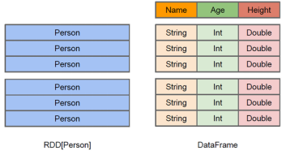

## Spark SQL 概述

Spark SQL 其实和 Hive 很像，Hive 是将 Hive SQL 转化为 Hadoop 的 MapReduce，Spark SQL 是转为 Spark 算子。

Spark SQL 前身是 Shark，是伯克利实验室 Spark 生态环境组件之一，一开始是基于 Hive 开发的工具，让它能运行在 Spark 上。

但是随着 Spark 的发展，Shark 对于 Hive 的太多依赖制约了 Spark，所以分出了两条线：Spark SQL、Hive on Spark。

Spark SQL 出现了，它抛弃了原有 Shark 的代码，汲取了部分优点并重新开发。

Spark SQL 当前兼容 Hive、RDD、parquet、JSON 等多种数据源，未来甚至支持 NOSQL。性能优化良好，组件扩展方面（SQL 语法解析器、分析器、优化器）都可以重新定义和扩展。

对于开发人员来讲，Spark SQL 可以简化 RDD 开发，提高开发效率，并且执行效率很快。

为了简化 RDD 的开发，Spark SQL 提供了两个编程抽象，类似 Spark Core 的 RDD。

---

**DataFrame（DF）**

在 Spark 中，DF 基于 RDD，类似二维表格，但是与 RDD 不同的是，RDD 没有元数据信息，而 DF 存在。

比如说，一个 Person 类，包含 `name、age、height` 属性，在 RDD 中，这三个属性是不会表现出来的，但是在 DF 中会表现出来。



同时，DF 也支持嵌套数据类型（struct、map、array），API 也比较易操作。在性能方面，依赖于优化器，DF 的执行效率比 RDD 更高，并且也是懒执行的，所以 DF 更加友好。

但是 DF 也有缺点，即 DF 是若类型的，例如上面说的 Person，如果要获得 name 属性，只能使用类似 `person[0]` 的方式来获取，也就是说，虽然它支持类型，但在开发时不是强类型。

---

**DataSet**

DS 是 DF 的一个扩展，在 Spark1.6 添加的一个新的抽象。它对 DF 增强了，最大的特点就是变为了强类型，这时候获取 person 的 name 就可以使用类似 `person[name]`。

此时，我们就可以将 DF 看成是 DS 的一个特例，即：`DataSet[Row] = DataFrame`。

## DataFrame

DF 比 RDD 多了一层元数据信息，但是本质上是一种弱类型的数据集合，可以简单理解为 JS 中，所有变量都是用 `val` 来定义的，然而在 DF 中，统一使用 `Row` 来作为属性的类型。

### SparkSession

在单纯使用 RDD 的时候，我们构建出 `SparkContext` 来进行 Spark 的入口，那么在新的 Spark SQL 中，我们使用 `SparkSession` 来作为 SQL 查询的起点。

SparkSession 内部封装了 SparkContext，所以查询其实本质还是 SparkContext，只不过为了使用方便，我们又封装了一层。

```scala
def main(args: Array[String]): Unit = {
  val sparkConf = new SparkConf().setMaster("local[*]").setAppName("SQL")
  val spark = SparkSession.builder().config(sparkConf).getOrCreate()
  spark.stop()
}
```

```xml
<dependency>
    <groupId>org.apache.spark</groupId>
    <artifactId>spark-core_2.12</artifactId>
    <version>3.0.0</version>
</dependency>
<dependency>
    <groupId>org.apache.spark</groupId>
    <artifactId>spark-sql_2.12</artifactId>
    <version>3.0.0</version>
</dependency>
```

### 创建 DF

创建 DF 有三种方式：

- 从 Spark 的数据源创建。
- 从 RDD 转换（后续讨论）。
- 从 Hive Table 查询返回（后续讨论）。

**从 Spark 数据源进行创建**

Spark 数据源支持很多，比如：`csv`、`jdbc`、`json`、`orc`、`parquet`、`text`、`textFile` 等，还可以通过 maven 添加第三方的，比如 `avro`：

```xml
<dependency>
    <groupId>org.apache.spark</groupId>
    <artifactId>spark-avro_2.12</artifactId>
    <version>3.0.1</version>
</dependency>
```

---


```json
{"username": "zhangsan", "age": 18}
```

```scala
def main(args: Array[String]): Unit = {
  val sparkConf = new SparkConf().setMaster("local[*]").setAppName("SQL")
  val spark = SparkSession.builder().config(sparkConf).getOrCreate()

  val df = spark.read.json("person.json")
  df.show(false)

  spark.stop()
}
```

::: tip

1. 以上的 JSON 必须要在同一行，假如为多行则会报错。
1. 如果从内存中读取数据，Spark 可以知道具体的数据类型是什么。假如是数字，默认作为 int 处理。
1. 如果从文件中读取数据，Spark 不知道具体的数据类型是什么，如果是数字，默认作为 bigint 处理，可以和 long 转换，但是不能和 int 转换。

:::

### SQL 语法

Spark SQL 查询，其实表面上看和 SQL 差不多，但是它必须要借助视图来进行查询，不管是临时视图还是全局视图均可。

```scala
val sparkConf = new SparkConf().setMaster("local[*]").setAppName("SQL")
val spark = SparkSession.builder().config(sparkConf).getOrCreate()

// 1. 读取 JSON
val df = spark.read.json("person.json")

// 2. 创建临时视图
df.createOrReplaceTempView("people")

// 3. 查询临时视图
spark.sql("SELECT * FROM people").show(false)

// 4. 创建全局视图
df.createGlobalTempView("person")

// 5. 查询全局视图
spark.sql("SELECT * FROM global_temp.person").show(false)

spark.stop()
```

::: tip

1. Spark SQL 必须借助视图，不管是临时视图还是全局视图。
1. 普通的临时视图是单个 Session 范围内的，如果想要在全局内有效，需要创建全局临时视图。
1. 全局临时视图访问需要加上 `global_temp`，比如 `global_temp.person`。

:::

### DSL

视图创建是比较麻烦的一件事情，为了简化，DF 提供了 DSL（Domain-Specific-Language）去管理结构化的数据。

DSL 可以跨语言使用（即可以在 Scala、Java、Python、R 中使用），使用 DSL 就不必再创建临时视图了。

```scala
val sparkConf = new SparkConf().setMaster("local[*]").setAppName("SQL")
val spark = SparkSession.builder().config(sparkConf).getOrCreate()

// 1. 读取 JSON
val df = spark.read.json("person.json")

// 2. 查看 df 的 schema
df.printSchema()

// 3. 查看 username 列
df.select("username").show(false)
df.select(df.col("username")).show(false)

// 4. 查看 age + 1 列的数据，这里的 spark.implicits._ 中，spark 就是当前的 sparkSession 变量名称
import spark.implicits._
df.select($"age" + 1).show(false)
df.select('age + 1 as "newAge").show(false)

// 5. 查看 age > 30 的数据
df.filter($"age" > 30).show(false)

// 6. 按照 age 进行分组
df.groupBy("age").count().show(false)

spark.stop()
```


```java
SparkSession spark = SparkSession.builder().config(new SparkConf().setMaster("local[*]").setAppName("SQL")).getOrCreate();

Dataset<Row> df = spark.read().json("person.json");

df.select("username").show(false);

df.select(df.col("age").plus(1).as("newAge")).show(false);

df.filter(df.col("age").gt(30)).show(false);

df.groupBy("age").count().show(false);

spark.stop();
```

::: tip
以上代码在 Spark [官网](https://spark.apache.org/docs/latest/sql-getting-started.html)中存在。
:::

### RDD 与 DF 互相转换

```scala
def main(args: Array[String]): Unit = {
  val sparkConf = new SparkConf().setMaster("local[*]").setAppName("SQL")
  val spark = SparkSession.builder().config(sparkConf).getOrCreate()

  // 1. 因为 SparkSession 里面包含 SparkContext，所以可以直接得到 SparkContext
  val sc = spark.sparkContext

  // 2. 和之前一样，引入
  import spark.implicits._

  // 4. 生成 RDD
  val rdd = sc.makeRDD(List(("zhangsan", 18), ("lisi", 20), ("wangwu", 23)))

  // 5. scala 直接生成 DataFrame 即可
  val df = rdd.map(t => Person(t._1, t._2)).toDF()

  // 6. 使用
  df.select("name").show(false)

  // 7. df 转 RDD
  df.select("name").rdd.foreach(println)

  spark.stop()
}

// 3. 定义 Scala 的类
case class Person(name: String, age: Int)
```

::: tip
DataFrame 本质上其实就是对 RDD 的封装，所以可以直接从内部获得 RDD。

但是 RDD 转换到 DF 需要提供对应的类型，但是 DF 其实也是弱类型（统一为 `Row` 类型）。
:::

```java
SparkSession spark = SparkSession.builder().config(new SparkConf().setMaster("local[*]").setAppName("SQL")).getOrCreate();

// 1. 读取文件形成 DS
Dataset<Row> DS = spark.read().csv("person.csv");

// 2. DS 可直接形成 RDD
JavaRDD<Row> rowJavaRDD = DS.toJavaRDD();

// 3. RDD 转为 DS，通过类直接转换
Dataset<Row> rowDS = spark.createDataFrame(rowJavaRDD, Person.class);

// 4. RDD 转为 DS，通过手动构造 schema 生成
StructType schema = new StructType();
schema = schema.add("name", DataTypes.StringType);
schema = schema.add("age", DataTypes.IntegerType);
spark.createDataFrame(rowJavaRDD, schema);

spark.stop();
```

## Dataset

之前提过，DS 其实是对 DF 做了一层增强，是强类型的数据集合。可以简单理解为 JS 升级成了 TS，有了强类型的概念。

### 创建 DS

```scala
def main(args: Array[String]): Unit = {
  val sparkConf = new SparkConf().setMaster("local[*]").setAppName("SQL")
  val spark = SparkSession.builder().config(sparkConf).getOrCreate()

  // 1. 类似之前，引入 implicits
  import spark.implicits._

  // 2. 定义 RDD
  val list = List(Person("zhangsan", 18), Person("lisi", 20))

  // 3. 定义 DS
  val ds = list.toDS()

  // 4. 使用
  ds.show(false)

  spark.stop()
}

case class Person(name: String, age: Int)
```

### RDD、DF、DS 相互转换

```scala
def main(args: Array[String]): Unit = {
  val sparkConf = new SparkConf().setMaster("local[*]").setAppName("SQL")
  val spark = SparkSession.builder().config(sparkConf).getOrCreate()

  import spark.implicits._

  // 1. RDD
  val list = List(Person("zhangsan", 18), Person("lisi", 20))

  // 2. RDD to DS，因为是完全按照类型来构造的，所以可以直接转为 Person
  val ds:Dataset[Person] = list.toDS()

  // 3. ds to df
  val df:DataFrame = ds.toDF()

  // 4. df to ds，需要指定类型，可以使用 df.toDS，但是那样会成为 DS[Row]
  val ds2:Dataset[Person] = df.as[Person]

  spark.stop()
}

case class Person(name: String, age: Int)
```

```java
SparkSession spark = SparkSession.builder().config(new SparkConf().setMaster("local[*]").setAppName("SQL")).getOrCreate();

// Java 可以直接通过 List 来转为 DS
Dataset<Person> ds = spark.createDataset(Arrays.asList(new Person("zhangsan", 18)), Encoders.bean(Person.class));

spark.stop();
```

### RDD、DF、DS 区别与联系

**不同点**

- 从本质上来看，其实就是套娃的过程，RDD 套娃形成 DF，DF 套娃形成 DS。
- 从版本的角度来说，RDD 来自 Spark1.0，DF 来自 Spark1.3，DS 来自 Spark1.6。
- 同样的数据给到这三者结果都是相同的，只不过效率和执行方式不同，所以在未来 DS 可能会取代 RDD 和 DF，形成唯一的 API 接口。
- RDD 不支持 Spark SQL。
- DF 每一行为 Row，但是 DS 是强类型，每行不同。

**相同点**

- RDD、DF、DS 全都是 Spark 的分布式弹性数据集。
- 都有惰性机制（比如到执行算子才会执行），三者都有很多相同函数。
- DF 和 DS 都需要 `import spark.implicits._`。
- 都会根据 Spark 内存情况自动缓存计算，不需担心内存溢出。
- 都有 `partition` 的概念。

**三者的相互转换**


## 用户自定义函数

简单来说，我们的算子可能不太够用，假如我们的业务想要实现某种特殊的功能，那么就必须要进行自定义。

用户自定义函数大致上可以分为两种：

- 一对一关系，类似 map，一个输入一个输出。UDF（user defined function）。
- 多对一关系，类似 aggregate，多个输入一个输出。UDAF（user defined aggregate function）。

::: tip

其实在 Hive 中，还存在输入一行输出多行的情况，也就是 UDTF，但是很遗憾，Spark 中不支持。

:::

### UDF

使用 udf 函数需要三步：

1. 创建 UDF
1. 注册 UDF
1. 使用 UDF

```scala
val sparkConf = new SparkConf().setMaster("local[*]").setAppName("SQL")
val spark = SparkSession.builder().config(sparkConf).getOrCreate()

import spark.implicits._

// 1. 环境准备
val list = List(Person("zhangsan", 18), Person("lisi", 20))
val ds = list.toDS()
ds.createOrReplaceTempView("person")

// 2. udf 创建并注册
spark.udf.register("addName", (x: String) => "Name = " + x)

// 3. 使用 udf
spark.sql("SELECT addName(name) as name FROM person").show(false)

spark.stop()
```

```java
SparkSession spark = SparkSession.builder().config(new SparkConf().setMaster("local[*]").setAppName("SQL")).getOrCreate();

// 1. 环境准备
Dataset<Person> ds = spark.createDataset(Arrays.asList(new Person("zhangsan", 18)), Encoders.bean(Person.class));
ds.createOrReplaceTempView("person");

// 2. 注册 udf 并使用
spark.udf().register("addName", (UDF1<String, String>) s -> "Name = " + s, DataTypes.StringType);

// 3. 使用
spark.sql("SELECT addName(name) as name FROM person").show(false);

spark.stop();
```

### UDAF

```scala
object SparkSQLDemo {
  def main(args: Array[String]): Unit = {
    val sparkConf = new SparkConf().setMaster("local[*]").setAppName("SQL")
    val spark = SparkSession.builder().config(sparkConf).getOrCreate()

    import spark.implicits._

    // 1. 环境准备
    val list = List(Person("zhangsan", 18), Person("lisi", 20))
    val ds = list.toDS()
    ds.createOrReplaceTempView("person")

    // 3. udaf 注册
    spark.udf.register("avg",functions.udaf(AvgUDAF))

    // 4. udaf 使用
    spark.sql("SELECT avg(age) as name FROM person").show(false)

    spark.stop()
  }

  case class Person(name: String, age: Int)
}

case class Average(var sum: Long, var count: Long)

// 2. UDAF 创建，求平均值，三个泛型分别为：传入值、中间值、输出值
object AvgUDAF extends Aggregator[Int, Average, Double] {

  // 初始化中间值，应该满足任意 x + zero = x
  override def zero: Average = Average(0, 0)

  // 中间结果与下一个值相加，返回中间值
  override def reduce(mid: Average, next: Int): Average = {
    mid.sum += next
    mid.count += 1
    mid
  }

  // 合并两个中间值
  override def merge(mid1: Average, mid2: Average): Average = {
    mid1.count += mid2.count
    mid1.sum += mid2.sum
    mid1
  }

  // 输出此次的最终结果
  override def finish(reduction: Average): Double = {
    reduction.sum / reduction.count
  }

  // 缓冲区，可以为固定值
  override def bufferEncoder: Encoder[Average] = Encoders.product

  // 输出
  override def outputEncoder: Encoder[Double] = Encoders.scalaDouble
}
```

::: tip

更多内容查看 spark [docs](https://spark.apache.org/docs/latest/sql-ref-functions-udf-aggregate.html)

:::

## 数据的加载和保存

**数据的加载**

之前在写 Java 的时候，使用了一个 `spark.read().csv()`，其实这就是加载 `csv` 文件，点进源码，可以看到，底层调用了：`format("csv").load(paths : _*)`


所以它其实相当于 `spark.read().format("csv").load(paths : _*)`

`spark.read().load()` 是通用的加载方法，可以加载多种数据格式，例如 csv、jdbc、json、orc、parquet 等，读取不同的格式可以使用 `format` 来指定。

初次之外，还可以使用 `option` 来指定相应的参数，比如 jdbc 的 url，username，password 等，读取 csv 是否决定第一行是表头，分隔符是什么……

```java
spark.read.option("delimiter", "\u0001").option("header", true).csv("odsMember.csv").show(false)
```

::: tip

以上代码中，读取了 csv 文件，指定分隔符为 `\u0001`，指定第一行为表头。

:::

**数据的保存**

除了读取之外，还可以进行保存，可以在 `csv`、`parquet`、`orc`、`textFile` 中传入需要保存数据的路径。

```java
  df.write().option("header", true).option("delimiter", "\u0001").csv(path);
```

::: tip

其实除了上述的保存方式，还可以自行加入其他的数据格式，比如我通过 maven 加了一个 avro 格式的数据，可以使用：

```xml
<dependency>
  <groupId>org.apache.spark</groupId>
  <artifactId>spark-avro_2.12</artifactId>
  <version>3.1.2</version>
</dependency>
```

```java
df.write().mode(SaveMode.Overwrite).format("avro").save(path);
```

:::

保存也有很多选项，除了 option 之外，还有 `mode()` 可以选择，有多种方式：
| Scala/Java                          | Any Language       | Meaning                    |
| ----------------------------------- | ------------------ | -------------------------- |
| `SaveMode.ErrorIfExists`(`default`) | `error`(`default`) | 如果文件已经存在则抛出异常 |
| `SaveMode.Append`                   | `append`           | 如果文件已经存在则追加     |
| `SaveMode.Overwrite`                | `overwrite`        | 如果文件已经存在则覆盖     |
| `SaveMode.Ignore`                   | `ignore`           | 如果文件已经存在则忽略     |

```java
df.write().mode(SaveMode.Overwrite).format("avro").save(path)
```

**MySQL**

```scala
//方式1：通用的load方法读取
spark.read.format("jdbc")
  .option("url", ${url})
  .option("driver", "com.mysql.jdbc.Driver")
  .option("user", ${username})
  .option("password", ${password})
  .option("dbtable", "user")
  .load().show


//方式2:通用的load方法读取 参数另一种形式
spark.read.format("jdbc")
  .options(Map("url"->"${url}?user=${username}&password=${password}",
    "dbtable"->"user","driver"->"com.mysql.jdbc.Driver")).load().show

//方式3:使用jdbc方法读取
val props: Properties = new Properties()
props.setProperty("user", ${username})
props.setProperty("password", ${password})
val df: DataFrame = spark.read.jdbc("url", "user", props)
```

::: tip

注意，不仅是在读取的时候，在写入的时候也需要加入 url、username、password

:::
